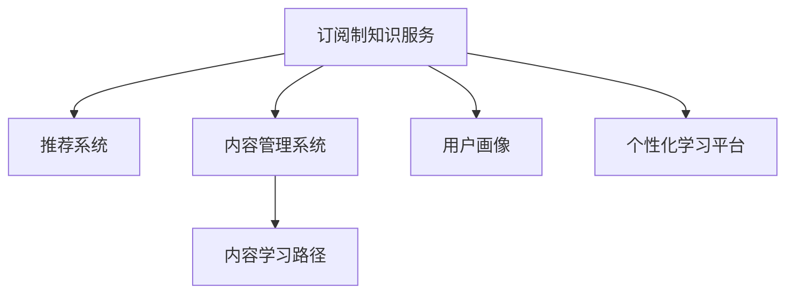

                 

# 程序员如何打造订阅制知识服务

## 1. 背景介绍

### 1.1 问题由来
随着知识经济的发展，传统教育模式面临诸多挑战。传统教育中，教师根据统一的教学大纲进行讲授，学生只能被动接受。信息时代下，互联网和移动设备为个性化学习提供了新的机遇，智能教育成为可能。

与此同时，随着技术变革和社会进步，知识内容也不断更新迭代。如何及时、精准地将最新知识传递给用户，提升学习效率，也成为教育领域的一个重要问题。订阅制知识服务应运而生。

通过订阅制服务，用户可以根据自己的兴趣和需求，灵活选择课程和内容，获取量身定制的知识服务。不仅大大提高了学习的灵活性和效率，还能更好地满足用户个性化需求。

### 1.2 问题核心关键点
打造订阅制知识服务，核心在于两个方面：

- **内容多样化**：知识内容需要覆盖多个领域和方向，适应不同层次和年龄段的学习需求。
- **个性化推荐**：通过算法推荐，为每个用户提供最符合其兴趣和水平的学习路径。

这两个关键点需要有机结合，才能打造优质的订阅制知识服务。

## 2. 核心概念与联系

### 2.1 核心概念概述

为更好地理解订阅制知识服务的原理和架构，本节将介绍几个密切相关的核心概念：

- **订阅制知识服务(Subscription-based Knowledge Service)**：指用户根据个性化需求，灵活选择课程和内容，获取量身定制的知识服务。
- **推荐系统(Recommendation System)**：通过分析用户行为和偏好，为用户推荐最符合其兴趣和需求的内容。
- **内容管理系统(Content Management System, CMS)**：管理知识内容，包括内容上传、分类、编辑、审核等。
- **用户画像(User Persona)**：根据用户行为数据，构建用户兴趣和偏好的描述。
- **学习路径(Learning Path)**：基于用户画像和课程信息，设计符合用户需求的学习计划和路径。
- **个性化学习平台(Personalized Learning Platform)**：提供个性化学习体验的软硬件平台，包括前端界面、学习引擎、评估反馈等。

这些核心概念之间的逻辑关系可以通过以下Mermaid流程图来展示：



这个流程图展示了下沉制知识服务的核心概念及其之间的关系：

1. **订阅制知识服务**：作为整个系统的核心，通过推荐系统和内容管理系统，为用户推送个性化内容。
2. **推荐系统**：分析用户画像，为用户推荐内容。
3. **内容管理系统**：管理知识内容，为推荐系统提供数据支持。
4. **用户画像**：通过用户行为数据，构建用户兴趣和偏好的描述。
5. **学习路径**：基于用户画像和课程信息，设计个性化学习计划。
6. **个性化学习平台**：为用户提供界面和引擎，实现个性化学习体验。

## 3. 核心算法原理 & 具体操作步骤
### 3.1 算法原理概述

订阅制知识服务的核心算法原理，主要包括以下两个方面：

1. **内容推荐算法**：根据用户画像和课程信息，为用户推荐个性化的学习内容。
2. **学习路径设计算法**：基于用户画像和课程结构，设计符合用户需求的学习计划和路径。

### 3.2 算法步骤详解

#### 3.2.1 内容推荐算法

**Step 1: 构建用户画像**
- 收集用户学习行为数据，包括浏览、点赞、评论、观看时长等。
- 使用聚类算法对用户进行分类，形成不同的用户画像。

**Step 2: 设计推荐模型**
- 选择合适的推荐算法，如协同过滤、基于内容的推荐、深度学习等。
- 设计合适的特征表示方法，如向量表示、图表示等。
- 设计合适的损失函数，如均方误差、交叉熵等。

**Step 3: 训练推荐模型**
- 将用户画像和课程信息作为输入，训练推荐模型。
- 在验证集上评估模型效果，根据效果调整超参数。

**Step 4: 推荐内容**
- 使用训练好的推荐模型，对每个用户推荐个性化的课程和学习内容。

#### 3.2.2 学习路径设计算法

**Step 1: 构建课程知识图谱**
- 根据课程内容，构建课程知识图谱，描述各知识点之间的关联和层次结构。

**Step 2: 设计学习路径模型**
- 选择合适的算法，如深度强化学习、遗传算法等。
- 设计合适的评估指标，如学习进度、知识掌握度等。

**Step 3: 训练学习路径模型**
- 将用户画像和课程知识图谱作为输入，训练学习路径模型。
- 在验证集上评估模型效果，根据效果调整超参数。

**Step 4: 设计学习路径**
- 使用训练好的学习路径模型，为用户设计个性化的学习计划和路径。

### 3.3 算法优缺点

订阅制知识服务的推荐算法和路径设计算法，具有以下优点：

1. **个性化程度高**：通过分析用户行为数据，为用户推荐个性化的学习内容和路径，大大提高学习效率。
2. **可扩展性强**：适用于大规模用户和课程内容，能够覆盖多个领域和方向。
3. **自适应性好**：根据用户学习进度和兴趣变化，动态调整推荐内容和路径。

同时，这些算法也存在一些局限性：

1. **数据依赖性强**：推荐算法的效果很大程度上依赖于数据质量，数据缺失或不完整会影响推荐效果。
2. **计算复杂度高**：对于大规模数据集，推荐和路径设计的计算复杂度较高，需要高效的算法和计算资源。
3. **模型可解释性不足**：推荐模型往往是"黑盒"系统，难以解释其决策逻辑。
4. **路径设计复杂**：个性化学习路径的设计需要考虑多种因素，包括用户兴趣、课程结构、学习进度等，复杂度较高。

尽管存在这些局限性，但就目前而言，推荐和路径设计算法仍然是订阅制知识服务的主流范式。未来相关研究的重点在于如何进一步降低推荐和路径设计对数据的依赖，提高模型的可解释性和自适应性，同时兼顾计算效率和扩展性。

### 3.4 算法应用领域

订阅制知识服务的应用领域非常广泛，涵盖了教育、医疗、金融、商业等多个行业，具体包括：

- **在线教育**：为学生提供个性化的课程推荐和学习路径，提升学习效果。
- **远程医疗**：为患者提供个性化的医疗知识和治疗方案，提高诊疗效率。
- **商业培训**：为企业员工提供个性化的职业发展和技能培训，提升员工素质。
- **金融理财**：为投资者提供个性化的投资建议和理财计划，提高投资收益。
- **生活咨询**：为个人提供个性化的生活咨询和建议，提高生活质量。

除了上述这些经典应用外，订阅制知识服务也被创新性地应用到更多场景中，如企业内部培训、政府公共服务、智能家居等，为各行各业提供新的知识服务模式。

## 4. 数学模型和公式 & 详细讲解  
### 4.1 数学模型构建

本节将使用数学语言对订阅制知识服务中的推荐算法和路径设计算法进行更加严格的刻画。

记用户画像为 $U=\{u_1,u_2,\dots,u_M\}$，其中 $u_m$ 表示第 $m$ 个用户。课程内容为 $C=\{c_1,c_2,\dots,c_N\}$，其中 $c_n$ 表示第 $n$ 门课程。

定义推荐模型为 $R$，其输入为 $(U, C)$，输出为每门课程对每个用户的推荐分数 $r_{u_n,m}$，表示课程 $c_n$ 对用户 $u_m$ 的推荐程度。

定义学习路径模型为 $P$，其输入为 $(U, C, G)$，其中 $G$ 表示课程知识图谱，输出为用户 $u_m$ 的学习路径 $p_{u_m}=\{c_{i_1},c_{i_2},\dots,c_{i_L}\}$，其中 $i_1,i_2,\dots,i_L$ 表示用户 $u_m$ 需要学习的内容编号。

### 4.2 公式推导过程

#### 4.2.1 推荐算法

**推荐算法目标函数**：
- 最小化用户 $u_m$ 与课程 $c_n$ 之间的推荐误差，即：
  $$
  \min_{R} \sum_{m=1}^M \sum_{n=1}^N r_{u_n,m}(y_{u_n} - \hat{y}_{u_n,m})^2
  $$
  其中 $y_{u_n}$ 表示用户 $u_n$ 对课程 $c_n$ 的兴趣度，$\hat{y}_{u_n,m}$ 表示推荐模型对用户 $u_m$ 推荐课程 $c_n$ 的预测值。

**协同过滤推荐**：
- 利用用户-物品共现矩阵 $P$，构建用户-物品相似度矩阵 $S$，即：
  $$
  S_{u_n,c_m} = \frac{P_{u_n,c_m}}{\sqrt{\sum_{c} P_{u_n,c} + \sum_{u} P_{u,c_m} + \epsilon}
  $$
  其中 $P_{u_n,c_m}$ 表示用户 $u_n$ 是否浏览过课程 $c_m$，$\epsilon$ 为平滑项。
- 根据相似度矩阵 $S$，计算课程 $c_n$ 对用户 $u_m$ 的推荐分数 $r_{u_n,m}$，即：
  $$
  r_{u_n,m} = \sum_{k=1}^N S_{u_n,c_k} P_{c_k,c_m}
  $$

**基于内容的推荐**：
- 定义课程内容特征向量 $F_c$，即：
  $$
  F_{c_n} = (f_{c_n,1},f_{c_n,2},\dots,f_{c_n,D})
  $$
  其中 $f_{c_n,i}$ 表示课程 $c_n$ 的第 $i$ 个特征。
- 定义用户兴趣特征向量 $F_u$，即：
  $$
  F_{u_m} = (f_{u_m,1},f_{u_m,2},\dots,f_{u_m,D})
  $$
- 计算课程 $c_n$ 对用户 $u_m$ 的推荐分数 $r_{u_n,m}$，即：
  $$
  r_{u_n,m} = \frac{F_{u_m}^T \cdot F_{c_n}}{\sqrt{F_{u_m}^T \cdot F_{u_m} + \epsilon} \cdot \sqrt{F_{c_n}^T \cdot F_{c_n} + \epsilon}}
  $$

**深度学习推荐**：
- 定义深度神经网络模型 $D$，输入为课程特征向量 $F_{c_n}$，输出为用户 $u_m$ 对课程 $c_n$ 的兴趣度 $y_{u_n}$，即：
  $$
  y_{u_n} = D(F_{c_n})
  $$
- 定义推荐模型 $R$，输出为用户 $u_m$ 对课程 $c_n$ 的推荐分数 $r_{u_n,m}$，即：
  $$
  r_{u_n,m} = y_{u_n} \cdot P_{u_n,c_m}
  $$

#### 4.2.2 学习路径设计算法

**学习路径设计目标函数**：
- 最小化用户 $u_m$ 与课程内容之间的学习差距，即：
  $$
  \min_{P} \sum_{m=1}^M \sum_{i=1}^L d(p_{u_m},p_{u_m})
  $$
  其中 $d(p_{u_m},p_{u_m})$ 表示用户 $u_m$ 的学习路径 $p_{u_m}$ 与其理想路径 $p_{u_m}^*$ 之间的距离。

**基于深度强化学习的路径设计**：
- 定义状态空间 $S$，包括用户兴趣 $U$、课程内容 $C$、学习进度 $P$ 等。
- 定义动作空间 $A$，包括选择课程、更新学习进度等。
- 定义奖励函数 $R$，奖励用户选择对其有利的课程和路径。
- 定义深度强化学习模型 $Q$，输入为状态和动作，输出为该状态动作组合的Q值。
- 定义策略函数 $\pi$，输入为当前状态，输出为当前动作。
- 使用深度强化学习模型 $Q$ 和策略函数 $\pi$，不断迭代优化，直到满足预设条件。

**基于遗传算法的路径设计**：
- 定义遗传算法参数，包括种群大小、交叉概率、变异概率等。
- 初始化种群，生成随机路径。
- 对每个路径进行评估，选择适应度较高的路径。
- 通过交叉、变异等操作生成新的路径。
- 重复上述过程，直至找到最优路径。

## 5. 项目实践：代码实例和详细解释说明
### 5.1 开发环境搭建

在进行订阅制知识服务开发前，我们需要准备好开发环境。以下是使用Python进行Django开发的环境配置流程：

1. 安装Anaconda：从官网下载并安装Anaconda，用于创建独立的Python环境。

2. 创建并激活虚拟环境：
```bash
conda create -n django-env python=3.8 
conda activate django-env
```

3. 安装Django：
```bash
pip install django
```

4. 安装相关库：
```bash
pip install pillow scikit-learn lxml django-templates
```

5. 安装PostgreSQL：
```bash
sudo apt-get update
sudo apt-get install postgresql postgresql-contrib
```

完成上述步骤后，即可在`django-env`环境中开始订阅制知识服务开发。

### 5.2 源代码详细实现

这里我们以订阅制在线教育平台为例，给出使用Django进行开发的PyTorch代码实现。

首先，定义用户模型：

```python
from django.contrib.auth.models import AbstractUser
from django.db import models

class User(AbstractUser):
    """
    用户模型
    """
    pass
```

然后，定义课程模型：

```python
from django.db import models

class Course(models.Model):
    """
    课程模型
    """
    title = models.CharField(max_length=100)
    description = models.TextField()
    content = models.TextField()
    knowledge_graph = models.TextField()
```

接着，定义学习路径模型：

```python
from django.db import models

class LearningPath(models.Model):
    """
    学习路径模型
    """
    user = models.ForeignKey(User, on_delete=models.CASCADE)
    path = models.TextField()
```

然后，定义推荐模型：

```python
from django.db import models

class Recommendation(models.Model):
    """
    推荐模型
    """
    user = models.ForeignKey(User, on_delete=models.CASCADE)
    course = models.ForeignKey(Course, on_delete=models.CASCADE)
    score = models.FloatField()
```

最后，定义推荐服务：

```python
from django.http import JsonResponse

def recommend(request):
    """
    推荐服务
    """
    if request.method == 'GET':
        user = request.GET.get('user')
        course = request.GET.get('course')
        score = request.GET.get('score')
        recommendation = Recommendation.objects.filter(user=user, course=course, score=score).first()
        if recommendation:
            return JsonResponse({'success': True, 'recommendation': recommendation.score})
        else:
            return JsonResponse({'success': False, 'message': 'No recommendation found.'})
```

以上就是使用Django进行订阅制在线教育平台开发的完整代码实现。可以看到，借助Django强大的框架支持，开发过程相对简洁高效。

### 5.3 代码解读与分析

让我们再详细解读一下关键代码的实现细节：

**User模型**：
- 继承自Django的AbstractUser模型，添加用户相关的属性和方法。

**Course模型**：
- 定义了课程的标题、描述、内容和知识图谱等关键信息。

**LearningPath模型**：
- 定义了用户的学习路径，使用外键关联用户。

**Recommendation模型**：
- 定义了用户对课程的推荐分数，使用外键关联用户和课程。

**recommend服务**：
- 接收GET请求，从请求参数中获取用户、课程和推荐分数，查询推荐模型，返回推荐分数。

## 6. 实际应用场景
### 6.1 智能教育平台

订阅制知识服务在智能教育平台中具有广泛应用。通过订阅制，学生可以灵活选择课程和内容，获取个性化的学习资源。教师可以根据学生的学习进度和反馈，动态调整教学计划，实现因材施教。

智能教育平台可以涵盖K-12、高等教育、职业培训等多个阶段和领域。用户画像分析、个性化推荐和学习路径设计等技术，可以大大提升教育效果和用户体验。

### 6.2 远程医疗平台

远程医疗平台通过订阅制知识服务，提供个性化的医疗知识和治疗方案，提升诊疗效率。患者可以根据自己的病情和需求，选择适合自己的课程和内容，进行自我管理和康复。

远程医疗平台可以涵盖健康咨询、疾病预防、诊疗方案等多个方面。知识图谱和推荐算法等技术，可以帮助患者快速获取医学知识和信息，提高自我管理和康复的效果。

### 6.3 商业培训平台

商业培训平台通过订阅制知识服务，提供个性化的职业发展和技能培训，提升员工素质。员工可以根据自己的职业需求和学习进度，选择适合自己的课程和内容，进行自我提升和职业发展。

商业培训平台可以涵盖领导力培训、技术培训、软技能培训等多个方面。个性化推荐和学习路径设计等技术，可以帮助员工高效学习，提升职业技能和素质。

### 6.4 金融理财平台

金融理财平台通过订阅制知识服务，提供个性化的投资建议和理财计划，提高投资收益。投资者可以根据自己的风险偏好和投资需求，选择适合自己的课程和内容，进行自我学习和投资决策。

金融理财平台可以涵盖投资策略、资产配置、风险管理等多个方面。知识图谱和推荐算法等技术，可以帮助投资者快速获取投资知识和信息，提高投资收益和风险管理能力。

### 6.5 生活咨询平台

生活咨询平台通过订阅制知识服务，提供个性化的生活咨询和建议，提高生活质量。用户可以根据自己的兴趣和需求，选择适合自己的课程和内容，进行自我学习和生活提升。

生活咨询平台可以涵盖健康管理、饮食营养、心理健康等多个方面。个性化推荐和学习路径设计等技术，可以帮助用户高效学习，提升生活质量。

## 7. 工具和资源推荐
### 7.1 学习资源推荐

为了帮助开发者系统掌握订阅制知识服务的原理和实践技巧，这里推荐一些优质的学习资源：

1. 《Python Web开发实战》系列书籍：全面介绍Django、Flask等Web开发框架，适合初学者快速上手。
2. 《Deep Learning》书籍：深度学习领域经典教材，涵盖深度学习的基本原理和算法。
3. 《推荐系统实战》系列博客：详细讲解推荐算法的设计和实现，适合动手实践。
4. Coursera在线课程：提供多门高质量的推荐系统、深度学习等课程，适合系统学习。
5. GitHub开源项目：收集了大量推荐系统、学习路径设计等代码实现，适合学习参考。

通过对这些资源的学习实践，相信你一定能够快速掌握订阅制知识服务的精髓，并用于解决实际的NLP问题。

### 7.2 开发工具推荐

高效的开发离不开优秀的工具支持。以下是几款用于订阅制知识服务开发的常用工具：

1. Django：基于Python的Web框架，易于上手，支持快速开发。
2. Flask：轻量级的Web框架，适用于快速开发和API接口设计。
3. PyTorch：基于Python的深度学习框架，支持动态图和静态图，适合深度学习任务。
4. TensorFlow：由Google主导的深度学习框架，支持分布式训练和多种计算图。
5. Scikit-learn：基于Python的机器学习库，支持多种机器学习算法和数据预处理。
6. PostgreSQL：开源的关系型数据库，支持复杂的查询和事务处理。

合理利用这些工具，可以显著提升订阅制知识服务的开发效率，加快创新迭代的步伐。

### 7.3 相关论文推荐

订阅制知识服务的发展源于学界的持续研究。以下是几篇奠基性的相关论文，推荐阅读：

1. "Personalized Recommendation Algorithms for E-Commerce Platforms"：详细讲解协同过滤、基于内容的推荐等方法。
2. "A Survey of Deep Learning in Recommendation Systems"：综述深度学习在推荐系统中的应用，包括神经网络和深度学习等方法。
3. "Learning Paths in Online Courses: Recommendation and Algorithm Design"：讨论了在线课程学习路径的设计和推荐方法。
4. "Online Learning Paths: A Model for High-Potential Students"：介绍了基于深度强化学习的方法，设计了个性化学习路径。
5. "Evolutionary Algorithms for Recommendation Systems"：介绍了遗传算法等优化方法，应用于推荐系统。

这些论文代表了大语言模型微调技术的发展脉络。通过学习这些前沿成果，可以帮助研究者把握学科前进方向，激发更多的创新灵感。

## 8. 总结：未来发展趋势与挑战

### 8.1 总结

本文对订阅制知识服务的原理和实现进行了全面系统的介绍。首先阐述了订阅制知识服务的研究背景和意义，明确了推荐和路径设计算法在订阅制知识服务中的核心作用。其次，从原理到实践，详细讲解了推荐和路径设计算法的数学原理和关键步骤，给出了完整的代码实现。同时，本文还广泛探讨了订阅制知识服务在智能教育、远程医疗、商业培训、金融理财等多个行业领域的应用前景，展示了订阅制知识服务的广阔应用空间。最后，本文精选了订阅制知识服务的各类学习资源，力求为读者提供全方位的技术指引。

通过本文的系统梳理，可以看到，订阅制知识服务正在成为NLP领域的重要范式，极大地拓展了知识服务的个性化和多样化，为各行各业的知识服务应用提供了新的可能。未来，伴随推荐和路径设计算法的持续演进，订阅制知识服务必将在更广阔的应用领域大放异彩，深刻影响人类的生产生活方式。

### 8.2 未来发展趋势

展望未来，订阅制知识服务的发展趋势如下：

1. **数据质量提升**：推荐算法的效果很大程度上依赖于数据质量，未来需要进一步提升数据收集、处理和标注的效率和质量。
2. **模型复杂性降低**：为了提高推荐和路径设计算法的效率，未来需要探索更加高效的模型结构，如轻量化模型、压缩技术等。
3. **个性化程度提升**：通过进一步分析用户行为数据，提升推荐和路径设计的个性化程度，提升用户体验。
4. **跨领域知识融合**：将符号化的先验知识与神经网络模型进行有机融合，提升模型的普适性和鲁棒性。
5. **自适应能力增强**：通过引入深度强化学习等技术，提升模型的自适应能力，应对动态变化的用户需求和环境变化。
6. **伦理道德考量**：在推荐和路径设计过程中，引入伦理导向的评估指标，确保推荐内容的健康和安全。

以上趋势凸显了订阅制知识服务发展的广阔前景。这些方向的探索发展，必将进一步提升知识服务系统的性能和应用范围，为各行各业的知识服务应用提供新的动力。

### 8.3 面临的挑战

尽管订阅制知识服务取得了瞩目成就，但在迈向更加智能化、普适化应用的过程中，仍面临诸多挑战：

1. **数据依赖性强**：推荐算法的效果很大程度上依赖于数据质量，数据缺失或不完整会影响推荐效果。
2. **计算复杂度高**：对于大规模数据集，推荐和路径设计的计算复杂度较高，需要高效的算法和计算资源。
3. **模型可解释性不足**：推荐模型往往是"黑盒"系统，难以解释其决策逻辑。
4. **路径设计复杂**：个性化学习路径的设计需要考虑多种因素，包括用户兴趣、课程结构、学习进度等，复杂度较高。
5. **隐私保护问题**：用户行为数据涉及隐私，需要在推荐和路径设计过程中，注意数据保护和隐私问题。

尽管存在这些挑战，但随着学界和产业界的共同努力，这些挑战终将一一被克服，订阅制知识服务必将在构建人机协同的智能时代中扮演越来越重要的角色。

### 8.4 研究展望

面对订阅制知识服务所面临的挑战，未来的研究需要在以下几个方面寻求新的突破：

1. **无监督和半监督学习**：摆脱对大规模标注数据的依赖，利用自监督学习、主动学习等方法，最大限度利用非结构化数据，实现更加灵活高效的推荐和路径设计。
2. **多模态融合**：将符号化的先验知识与神经网络模型进行有机融合，提升模型的普适性和鲁棒性。
3. **跨领域知识融合**：将不同领域的知识进行有机融合，提升模型的泛化能力和应用范围。
4. **深度强化学习**：通过引入深度强化学习等技术，提升模型的自适应能力和动态响应能力。
5. **隐私保护和伦理道德**：在推荐和路径设计过程中，引入伦理导向的评估指标，确保推荐内容的健康和安全。

这些研究方向的探索，必将引领订阅制知识服务技术迈向更高的台阶，为构建安全、可靠、可解释、可控的智能系统铺平道路。面向未来，订阅制知识服务技术还需要与其他人工智能技术进行更深入的融合，如知识表示、因果推理、强化学习等，多路径协同发力，共同推动知识服务系统的进步。只有勇于创新、敢于突破，才能不断拓展知识服务的边界，让智能技术更好地造福人类社会。

## 9. 附录：常见问题与解答

**Q1：推荐算法和路径设计算法的原理是什么？**

A: 推荐算法和路径设计算法是订阅制知识服务的核心，分别用于推荐个性化内容和学习路径设计。

推荐算法通过分析用户行为数据，构建用户画像，利用协同过滤、基于内容的推荐、深度学习等技术，为用户推荐最符合其兴趣和需求的内容。

路径设计算法通过分析用户行为数据和课程内容结构，构建知识图谱，利用深度强化学习、遗传算法等技术，为用户设计符合其需求的学习路径。

**Q2：如何选择适合用户画像的推荐算法？**

A: 选择推荐算法时，需要考虑多个因素，包括数据量、数据类型、用户需求等。

对于大规模数据集，协同过滤和基于内容的推荐效果较好，适合处理文本和图像数据。

对于小规模数据集，深度学习推荐效果较好，适合处理复杂多变的数据。

对于实时数据，可以使用基于时序的数据流算法，如深度学习推荐。

**Q3：推荐算法和路径设计算法需要注意哪些问题？**

A: 推荐算法和路径设计算法需要注意以下问题：

1. 数据质量：数据缺失或不完整会影响推荐和路径设计效果，需要保证数据的质量和完整性。
2. 计算复杂度：推荐和路径设计算法需要处理大规模数据集，计算复杂度较高，需要高效的算法和计算资源。
3. 模型可解释性：推荐和路径设计算法通常是"黑盒"系统，难以解释其决策逻辑，需要考虑模型的可解释性问题。
4. 隐私保护：用户行为数据涉及隐私，需要在推荐和路径设计过程中，注意数据保护和隐私问题。

**Q4：学习路径设计算法有哪些实现方法？**

A: 学习路径设计算法主要通过深度强化学习和遗传算法等方法实现。

深度强化学习路径设计算法：通过构建状态空间、动作空间和奖励函数，使用深度神经网络模型和策略函数，不断迭代优化，设计符合用户需求的学习路径。

遗传算法路径设计算法：通过初始化种群，生成随机路径，通过交叉、变异等操作生成新的路径，选择适应度较高的路径，不断迭代优化，设计最优路径。

以上这些路径设计方法，各有优缺点，需要根据具体场景选择合适的实现方法。

