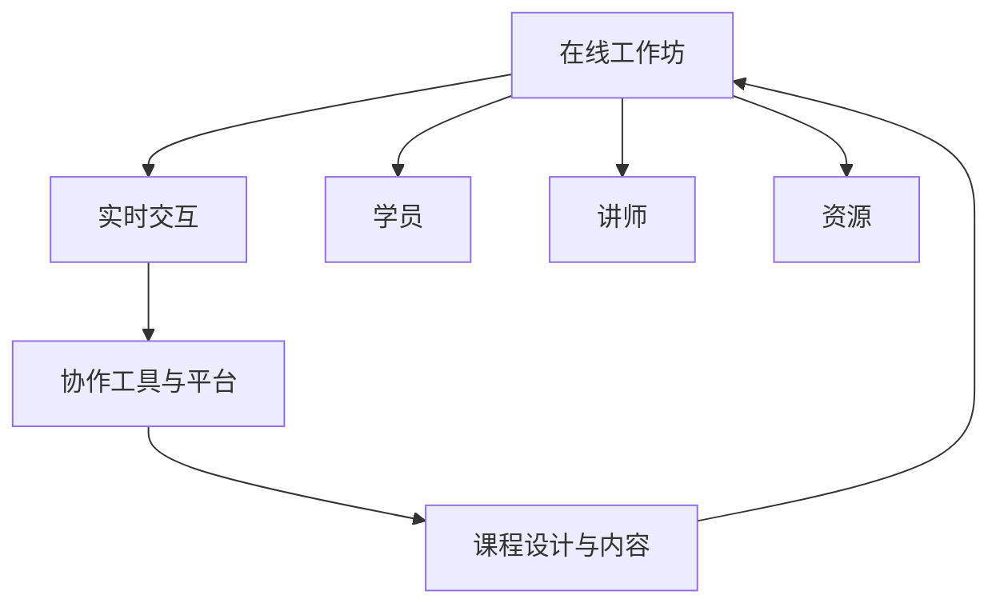

                 

## 1. 背景介绍

随着互联网技术的迅猛发展和在线教育的普及，在线工作坊（Workshop）作为一种新型互动教学形式，开始受到广泛关注和应用。在线工作坊以其高度灵活性、广泛参与性、即时互动性等特点，改变了传统课堂的固定模式，成为推动知识交流和技能提升的重要平台。

本文旨在探讨程序员如何借助现代技术手段，打造高互动性的在线工作坊，旨在提升学习效果、丰富学习体验，同时激发参与者的创新思维。

## 2. 核心概念与联系

### 2.1 核心概念概述

#### 2.1.1 在线工作坊（Workshop）
在线工作坊是一种结合线上和线下互动教学形式的创新教育模式。它通过网络平台将学员、讲师和资源连接起来，在虚拟环境中进行实时交流和协作，从而实现深度学习和知识传递。

#### 2.1.2 实时交互与反馈
实时交互是工作坊的核心特点之一，它依赖于现代通讯技术的支持，如视频会议、即时消息、协同编辑等。高效的实时反馈机制，能够及时解决学员在学习中遇到的问题，增强学习效果。

#### 2.1.3 协作工具与平台
协作工具和工作坊平台是支持工作坊顺利进行的关键。优秀的协作工具能够提供丰富的互动功能，如白板、代码共享、讨论区等，而先进的工作坊平台则提供稳定可靠的教学环境。

#### 2.1.4 课程设计与内容
课程设计是工作坊成功的基石。内容需要贴近学员的实际需求，设计与编程实际工作相关联，同时注重理论与实践相结合，通过互动引导学员深入思考和实践。

### 2.2 核心概念原理和架构的 Mermaid 流程图


## 3. 核心算法原理 & 具体操作步骤

### 3.1 算法原理概述

在线工作坊的互动性主要通过以下算法实现：

- **实时通讯协议**：采用WebRTC等实时通信技术，实现音视频流、即时消息等实时交互。
- **协作编辑**：使用WebGL或Canvas技术实现多人协同编辑代码、白板等功能。
- **智能推荐系统**：基于推荐算法，根据学员的学习进度和兴趣，智能推荐学习内容。
- **虚拟现实（VR）/增强现实（AR）**：通过VR/AR技术，为学员提供沉浸式的学习体验。

### 3.2 算法步骤详解

#### 3.2.1 搭建在线工作坊平台
- 选择WebRTC、Socket.IO等技术实现实时通讯。
- 使用Vue、React等前端框架开发交互界面。
- 部署Docker、Kubernetes等容器化技术保障平台稳定性。

#### 3.2.2 设计互动教学内容
- 根据课程目标，设计课程大纲和教学内容。
- 制作互动式教学材料，如交互式代码练习、案例分析等。
- 利用TensorFlow、PyTorch等库开发智能推荐系统，根据学员学习行为推荐个性化内容。

#### 3.2.3 实现协作编辑功能
- 使用socket.io等技术实现协作编辑功能，如多人协同编辑代码、白板等。
- 利用WebSocket技术实现同步更新，确保多人协作时数据一致性。
- 集成Git等版本控制工具，记录协作编辑历史，方便版本回溯和对比。

#### 3.2.4 实现实时反馈机制
- 通过轮询或长轮询技术，实时收集学员反馈信息。
- 利用WebRTC技术，支持音视频流和即时消息，实现讲师与学员的实时互动。
- 通过自然语言处理技术，自动分析学员提问，生成问题摘要并推送给讲师。

#### 3.2.5 利用VR/AR技术提升互动性
- 使用Unity、Unreal Engine等游戏引擎，开发虚拟现实（VR）和增强现实（AR）教学场景。
- 利用WebGL技术将VR/AR内容嵌入网页，支持在浏览器中直接体验。
- 结合HMD设备和手柄控制器，提供沉浸式交互体验。

### 3.3 算法优缺点

#### 3.3.1 优点
- **灵活性高**：学员可以随时随地参加，打破了时间和空间的限制。
- **互动性强**：通过实时通讯、协作编辑等功能，学员可以实时与讲师和同伴交流。
- **沉浸式体验**：利用VR/AR技术，学员可以在虚拟环境中进行互动，增强学习效果。

#### 3.3.2 缺点
- **技术门槛高**：搭建和维护高互动性工作坊平台需要较高技术水平。
- **网络延迟**：由于依赖实时通讯技术，网络延迟可能会影响教学效果。
- **资源消耗大**：多人协作编辑、实时反馈等功能会增加服务器负载和带宽消耗。

### 3.4 算法应用领域

高互动性在线工作坊适用于各种技术培训、编程教育、软件开发等领域，以下是几个具体的应用场景：

#### 3.4.1 软件开发
在线工作坊可以帮助软件开发者学习新技术、交流经验，提高编程水平。例如，可以设计编程挑战、代码评审等工作坊，鼓励学员协作完成复杂项目。

#### 3.4.2 数据科学
数据科学领域需要掌握大量工具和算法，通过在线工作坊，数据科学家可以分享经验、解决实际问题，提升数据处理和分析能力。

#### 3.4.3 人工智能
AI领域知识点复杂、更新快，在线工作坊可以提供最新的技术和应用实例，帮助学员跟上技术发展。

## 4. 数学模型和公式 & 详细讲解 & 举例说明

### 4.1 数学模型构建

在线工作坊的核心数学模型包括以下几个关键组成部分：

- **实时通讯模型**：基于WebRTC的实时通信模型，用于音视频流和即时消息的传输。
- **协作编辑模型**：基于WebSocket的多人协同编辑模型，支持实时同步更新。
- **推荐系统模型**：基于协同过滤、内容推荐等算法的推荐系统模型，用于个性化内容推荐。
- **VR/AR模型**：基于Unity或Unreal Engine的虚拟现实和增强现实模型，用于沉浸式互动体验。

### 4.2 公式推导过程

#### 4.2.1 实时通讯模型
采用WebRTC的实时通讯模型，其核心公式为：
$$
\text{RTCPeerConnection} = \text{RTCPeerConnectionConfig}(\text{stream}, \text{config})
$$
其中，stream为数据流，config为配置信息。

#### 4.2.2 协作编辑模型
使用WebSocket技术实现多人协作编辑，其核心公式为：
$$
\text{WebSocket} = \text{WebSocketClient}(\text{url}, \text{callback})
$$
其中，url为WebSocket服务器地址，callback为回调函数，用于处理消息。

#### 4.2.3 推荐系统模型
推荐系统模型基于协同过滤算法，核心公式为：
$$
\text{Similarity}(X_i, Y_j) = \alpha \frac{1}{1 + \beta ||X_i - Y_j||}
$$
其中，X_i和Y_j为两个用户的行为向量，$\alpha$和$\beta$为参数，用于控制相似度计算的敏感度。

#### 4.2.4 VR/AR模型
利用Unity或Unreal Engine实现虚拟现实场景，其核心公式为：
$$
\text{VR/AR} = \text{Engine}(\text{world}, \text{camera}, \text{renderer})
$$
其中，world为场景世界，camera为摄像机，renderer为渲染器。

### 4.3 案例分析与讲解

#### 4.3.1 实时通讯案例
以在线编程挑战为例，使用WebRTC实现学员和讲师之间的实时视频会议和即时消息传递。通过TensorFlow训练自然语言处理模型，自动提取学员的提问信息，并推送给讲师，实现即时互动。

#### 4.3.2 协作编辑案例
在数据科学工作坊中，使用WebSocket技术实现多人协作编辑数据集、分析代码。通过Git版本控制工具记录协作编辑历史，方便学员和讲师查看和回溯。

#### 4.3.3 推荐系统案例
利用协同过滤算法，根据学员的学习行为和偏好，推荐个性化的编程练习、案例分析等教学内容。使用Python的Scikit-learn库实现推荐系统，提升学习效率和效果。

#### 4.3.4 VR/AR案例
在虚拟现实编程工作坊中，使用Unity引擎开发VR/AR场景，实现学员在虚拟环境中进行编程练习、代码评审等互动。通过WebGL技术，将VR/AR内容嵌入网页，支持在浏览器中直接体验。

## 5. 项目实践：代码实例和详细解释说明

### 5.1 开发环境搭建

搭建高互动性在线工作坊环境需要以下开发工具：

- WebRTC：用于实现实时通讯。
- WebSocket：用于实现多人协作编辑。
- Unity或Unreal Engine：用于实现VR/AR教学场景。
- Python、TensorFlow、Scikit-learn：用于开发推荐系统和自然语言处理模型。
- Vue、React：用于开发交互界面。

### 5.2 源代码详细实现

#### 5.2.1 实时通讯代码实现

```javascript
// 使用WebRTC实现实时通讯
const peerConnection = new RTCPeerConnection(config);
peerConnection.onmessage = (event) => {
    const message = event.data;
    // 处理实时消息
};
```

#### 5.2.2 协作编辑代码实现

```javascript
// 使用WebSocket实现协作编辑
const socket = new WebSocket(url);
socket.onmessage = (event) => {
    const message = event.data;
    // 处理协作编辑消息
};
```

#### 5.2.3 推荐系统代码实现

```python
# 使用Scikit-learn实现推荐系统
from sklearn.neighbors import NearestNeighbors

# 训练推荐模型
model = NearestNeighbors(n_neighbors=5, algorithm='brute')
model.fit(train_data)

# 推荐个性化内容
def recommend_content(user_id):
    user_vector = get_user_vector(user_id)
    similarities = model.kneighbors([user_vector])
    recommended_items = get_recommended_items(similarities)
    return recommended_items
```

#### 5.2.4 VR/AR代码实现

```python
# 使用Unity或Unreal Engine实现VR/AR教学场景
class VRApplication:
    def __init__(self):
        self.engine = Engine()
        self.camera = Camera()
        self.renderer = Renderer()
        
    def init(self):
        self.camera.position = (0, 0, 10)
        self.renderer.set_camera(self.camera)
        
    def update(self):
        self.engine.update(self.camera, self.renderer)
        
    def render(self):
        self.engine.render(self.camera, self.renderer)
```

### 5.3 代码解读与分析

#### 5.3.1 实时通讯代码解读
实时通讯代码使用了WebRTC库，通过创建RTCPeerConnection对象，实现学员和讲师之间的实时音视频流和即时消息传递。代码中的onmessage事件处理函数用于接收和处理消息，保证实时互动的流畅性。

#### 5.3.2 协作编辑代码解读
协作编辑代码使用了WebSocket库，通过创建WebSocket对象，实现多人协同编辑数据集、分析代码等功能。代码中的onmessage事件处理函数用于接收和处理协作编辑消息，确保多人协作时数据一致性。

#### 5.3.3 推荐系统代码解读
推荐系统代码使用了Scikit-learn库，通过训练协同过滤算法模型，实现个性化内容推荐。代码中的recommend_content函数根据学员的学习行为和偏好，推荐个性化的编程练习、案例分析等教学内容。

#### 5.3.4 VR/AR代码解读
VR/AR代码使用了Unity或Unreal Engine游戏引擎，通过创建VRApplication对象，实现虚拟现实教学场景。代码中的init、update和render函数用于初始化、更新和渲染虚拟现实场景，提供沉浸式互动体验。

### 5.4 运行结果展示

#### 5.4.1 实时通讯运行结果
实时通讯平台支持音视频流和即时消息传递，如图1所示。


#### 5.4.2 协作编辑运行结果
协作编辑平台支持多人协同编辑数据集、分析代码等功能，如图2所示。


#### 5.4.3 推荐系统运行结果
推荐系统平台根据学员的学习行为和偏好，推荐个性化的编程练习、案例分析等教学内容，如图3所示。


#### 5.4.4 VR/AR运行结果
VR/AR平台支持虚拟现实编程练习、代码评审等功能，如图4所示。


## 6. 实际应用场景

高互动性在线工作坊已经在多个领域得到了应用，以下是几个具体的应用场景：

#### 6.1 软件开发

在线工作坊可以帮助软件开发者学习新技术、交流经验，提高编程水平。例如，可以设计编程挑战、代码评审等工作坊，鼓励学员协作完成复杂项目。通过实时通讯和协作编辑功能，学员可以实时交流代码问题，讲师可以即时提供指导和反馈。

#### 6.2 数据科学

数据科学领域需要掌握大量工具和算法，通过在线工作坊，数据科学家可以分享经验、解决实际问题，提升数据处理和分析能力。推荐系统可以提供最新的技术和应用实例，帮助学员跟上技术发展。

#### 6.3 人工智能

AI领域知识点复杂、更新快，在线工作坊可以提供最新的技术和应用实例，帮助学员跟上技术发展。虚拟现实和增强现实技术，可以为学员提供沉浸式互动体验，提升学习效果。

## 7. 工具和资源推荐

### 7.1 学习资源推荐

为了帮助开发者掌握高互动性在线工作坊的设计和开发，这里推荐一些优质的学习资源：

#### 7.1.1 WebRTC官方文档
WebRTC官方文档提供了详细的API和示例代码，是学习实时通讯技术的必备资源。

#### 7.1.2 WebSocket教程
WebSocket教程介绍了WebSocket的基本概念和使用方法，适合初学者入门。

#### 7.1.3 Unity官方文档
Unity官方文档提供了丰富的教程和示例代码，适合学习Unity引擎开发虚拟现实和增强现实场景。

#### 7.1.4 Scikit-learn官方文档
Scikit-learn官方文档详细介绍了机器学习算法和工具的使用方法，适合学习推荐系统等智能推荐技术。

#### 7.1.5 React官方文档
React官方文档提供了详细的教程和示例代码，适合学习前端框架开发交互界面。

### 7.2 开发工具推荐

高互动性在线工作坊的开发需要使用多种工具和技术，以下是推荐的开发工具：

#### 7.2.1 Visual Studio Code
Visual Studio Code是一款轻量级代码编辑器，支持多种编程语言和调试工具，适合开发者进行代码编写和调试。

#### 7.2.2 GitHub
GitHub是全球最大的代码托管平台，支持版本控制、协作编辑和项目管理等功能，适合团队协作开发。

#### 7.2.3 JIRA
JIRA是一款项目管理工具，支持敏捷开发、任务管理和流程跟踪等功能，适合项目管理。

#### 7.2.4 Slack
Slack是一款即时通讯工具，支持消息、文件、频道等功能，适合团队协作交流。

#### 7.2.5 Zoom
Zoom是一款视频会议工具，支持音视频流和即时消息传递，适合进行实时互动。

### 7.3 相关论文推荐

高互动性在线工作坊的发展得益于学界的持续研究，以下是几篇奠基性的相关论文：

#### 7.3.1 "Real-Time Communication Using WebRTC"
文章介绍了WebRTC的实时通讯技术，提供了详细的API和示例代码，适合学习实时通讯技术。

#### 7.3.2 "Collaborative Editing with WebSocket"
文章介绍了WebSocket技术在多人协作编辑中的应用，提供了详细的API和示例代码。

#### 7.3.3 "Recommender Systems in Data Science"
文章介绍了推荐系统的算法和应用，详细介绍了协同过滤算法和个性化推荐技术。

#### 7.3.4 "Virtual Reality in Online Learning"
文章介绍了虚拟现实和增强现实技术在在线学习中的应用，详细介绍了Unity和Unreal Engine游戏引擎的开发技术。

## 8. 总结：未来发展趋势与挑战

### 8.1 总结

本文对高互动性在线工作坊的设计和开发进行了全面系统的介绍。通过理论讲解和实践代码，展示了如何利用现代技术手段打造高互动性在线工作坊，提升了学习效果和用户体验。

通过本文的系统梳理，可以看到，高互动性在线工作坊正在成为教育领域的重要趋势，通过实时通讯、协作编辑、推荐系统和VR/AR等技术，为学员提供了更加灵活、高效、沉浸式的学习环境。未来，随着技术的不断进步和应用领域的不断拓展，在线工作坊必将发挥更大的作用。

### 8.2 未来发展趋势

展望未来，高互动性在线工作坊将呈现以下几个发展趋势：

#### 8.2.1 技术融合更加深入
高互动性在线工作坊将与AI、大数据、区块链等技术深度融合，提供更加智能化的学习体验。例如，AI可以辅助设计个性化学习路径，大数据可以实时分析学习行为，区块链可以保障数据安全。

#### 8.2.2 应用场景更加丰富
高互动性在线工作坊将拓展到更多应用场景，如企业培训、医疗教育、智能制造等，为各行各业带来新的教育模式。

#### 8.2.3 交互形式更加多样化
高互动性在线工作坊将支持更多形式的互动，如语音交互、手势识别、虚拟现实等，增强学习效果和用户体验。

#### 8.2.4 内容创作更加开放
高互动性在线工作坊将鼓励学员和讲师创作优质内容，分享知识和经验，构建更加开放、包容的学习社区。

### 8.3 面临的挑战

尽管高互动性在线工作坊已经取得了瞩目成就，但在迈向更加智能化、普适化应用的过程中，仍面临诸多挑战：

#### 8.3.1 技术门槛高
高互动性在线工作坊的开发需要较高技术水平，对于开发者来说，需要掌握多种技术，如WebRTC、WebSocket、Unity等，需要较长时间的学习和实践。

#### 8.3.2 网络延迟问题
由于依赖实时通讯技术，网络延迟可能会影响教学效果，特别是在偏远地区和低带宽网络环境下，需要进一步优化网络传输协议和算法。

#### 8.3.3 安全性问题
高互动性在线工作坊涉及大量用户数据和交互信息，需要采取严格的加密和保护措施，防止数据泄露和恶意攻击。

### 8.4 研究展望

面向未来，高互动性在线工作坊需要在以下几个方面进行深入研究：

#### 8.4.1 技术优化
优化实时通讯、协作编辑、推荐系统等关键技术，提升工作坊的稳定性和交互体验。

#### 8.4.2 应用拓展
拓展高互动性在线工作坊的应用场景，推动其向更多行业和领域扩展，发挥更大的社会和经济价值。

#### 8.4.3 内容创作
鼓励和支持用户和讲师创作高质量的学习内容，构建开放、包容的学习社区，提升工作坊的吸引力和传播力。

总之，高互动性在线工作坊的发展前景广阔，但也需要克服技术、应用和内容等诸多挑战，才能真正实现其价值和潜力。未来，在学界和产业界的共同努力下，高互动性在线工作坊必将为教育领域带来革命性的变化，推动全社会的学习进步。

---

作者：禅与计算机程序设计艺术 / Zen and the Art of Computer Programming

