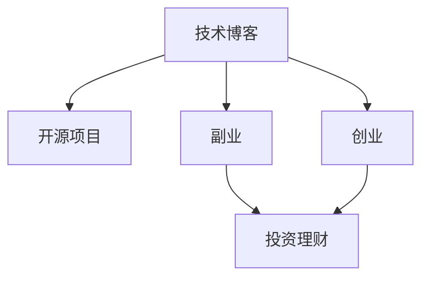

                 

# 程序员如何构建多元化收入来源的生态系统

> 关键词：技术博客, 程序员, 多元收入, 生态系统, 软件开发, 副业, 互联网创业, 技术社区, 投资理财

## 1. 背景介绍

### 1.1 问题由来

在当今数字化时代，科技日新月异，人工智能、大数据、云计算等新兴技术不断涌现，对程序员的技能需求也在不断变化。传统基于单一技能或职业路径的发展模式逐渐显示出其局限性。为了应对这一变化，许多程序员开始思考如何构建多元化的收入来源，以应对未来不确定的经济环境和职业挑战。构建一个稳定、可持续的生态系统成为了程序员的重要目标。

### 1.2 问题核心关键点

构建多元化的收入来源生态系统，核心在于以下几个方面：
- **技术栈多样性**：掌握多种编程语言和技术栈，以应对不同项目的需求。
- **项目种类丰富性**：参与多种类型的项目，包括企业级应用、开源项目、创业项目等。
- **知识体系广度**：跨领域学习，包括技术、管理、设计、市场等，提升综合素质。
- **副业和创业**：利用主业积累的技能和资源，发展副业或创业，实现财务自由。
- **投资理财**：掌握基本的财务管理和投资理财知识，保障财富增值。

## 2. 核心概念与联系

### 2.1 核心概念概述

为更好地理解构建多元化收入来源生态系统的过程，本节将介绍几个密切相关的核心概念：

- **技术博客**：通过撰写技术博客，分享技术见解、编程经验和项目案例，积累个人品牌影响力。
- **开源项目**：参与开源社区，为开源项目贡献代码、文档或设计，提升个人技能和社区声誉。
- **副业**：利用主业外的时间，发展与主业相关的副业，增加收入来源。
- **创业**：结合主业技能和资源，创立自己的技术公司或创新项目，实现创业梦想。
- **投资理财**：通过股票、基金、房地产等多元化投资方式，实现财富增值。

这些概念之间的逻辑关系可以通过以下Mermaid流程图来展示：



这个流程图展示了一个程序员构建多元化收入来源生态系统的关键路径：通过技术博客提升个人品牌，参与开源项目积累技术经验，发展副业和创业实现财富增长，同时投资理财保障财富安全。

## 3. 核心算法原理 & 具体操作步骤
### 3.1 算法原理概述

构建多元化收入来源生态系统，本质上是一个多目标优化问题。程序员需要在技术积累、项目经验、财务管理等方面进行平衡，以达到最优的多元化收入结构。

假设程序员的时间、精力、资源为有限资源，需要投入不同方向的项目、副业和投资中，以求最大化其收益。设程序员的时间为 $T$，精力为 $E$，资源为 $R$，收益为 $P$。不同方向的投资对应的收益函数为 $P_i(T, E, R)$，其中 $i$ 表示方向，包括技术博客、开源项目、副业、创业和投资理财等。

优化的目标是最小化 $T, E, R$ 的消耗，同时最大化 $P$。即：

$$
\min T, E, R \quad \text{subject to} \quad \max P(T, E, R)
$$

其中约束条件由程序员的时间、精力、资源的分配决定。

### 3.2 算法步骤详解

构建多元化收入来源生态系统，一般包括以下几个关键步骤：

**Step 1: 自我评估**

- 评估自己的时间、精力、资源情况，明确可投入的极限值。
- 评估现有技能和知识体系，确定主业和副业的发展方向。

**Step 2: 目标设定**

- 设定短期和长期的目标，包括技术学习目标、项目参与目标、财富增长目标等。
- 确定每个目标的优先级，例如技术学习可能优先于财富增长。

**Step 3: 资源分配**

- 根据目标设定，合理分配时间、精力、资源，制定详细的执行计划。
- 确定不同方向的投入比例，如技术博客占用的时间比例、开源项目参与的频率等。

**Step 4: 执行与调整**

- 严格按照计划执行，不断反馈和调整，确保资源利用效率。
- 定期评估进展，根据实际情况调整计划，避免资源浪费。

**Step 5: 持续优化**

- 不断学习和提升，优化自己的技能和知识体系。
- 探索新的收入来源，扩展生态系统，实现多元化增长。

### 3.3 算法优缺点

构建多元化收入来源生态系统的方法具有以下优点：
1. 风险分散。不同方向的项目和投资可以减少单一收入源的风险。
2. 技能提升。多样化的项目参与和技能学习可以提升个人综合素质，适应更广泛的职业需求。
3. 财务自由。通过副业和创业，可以实现更高的财务回报，达到财务自由。
4. 品牌影响。技术博客和开源项目可以提升个人品牌和声誉，增加商业机会。

同时，该方法也存在一定的局限性：
1. 时间管理难度大。需要在多个项目和方向之间进行平衡，资源分配不易。
2. 学习成本高。需要不断学习新技能，保持技术栈更新。
3. 初期投资大。副业和创业初期可能需要较大的资源投入。
4. 风险较大。多个方向的探索和投资可能带来不确定性和风险。

尽管存在这些局限性，但就目前而言，构建多元化收入来源生态系统仍是大势所趋。未来相关研究的重点在于如何进一步优化资源分配，降低学习成本，减小初期投资，同时提高风险控制能力，以实现更加高效、稳健的多元化收入体系。

### 3.4 算法应用领域

构建多元化收入来源生态系统的方法，在软件开发者、工程师、项目经理等多个职业领域中都有广泛应用，能够帮助从业者提升职业竞争力和生活质量。

在软件开发领域，技术博客和开源项目可以为技术积累和职业发展提供新的契机。通过参与开源项目，不仅能够提升技术水平，还能在社区中建立声誉，获得职业机会。

在创业领域，利用主业积累的技术和资源，发展自己的技术公司或创新项目，能够实现自我价值和财富增长。许多成功的科技公司如Google、Apple等，都起源于创业项目。

此外，投资理财也是构建多元化收入来源的重要组成部分。掌握基本的财务管理和投资理财知识，能够保障个人财富的增值，实现财务自由。

## 4. 数学模型和公式 & 详细讲解 & 举例说明
### 4.1 数学模型构建

本节将使用数学语言对构建多元化收入来源生态系统进行更加严格的刻画。

设程序员在时间 $T_i$、精力 $E_i$、资源 $R_i$ 上的投入，对应的收益为 $P_i(T_i, E_i, R_i)$，则总的收益函数为：

$$
P(T, E, R) = \sum_i P_i(T_i, E_i, R_i)
$$

其中 $i$ 表示方向，包括技术博客、开源项目、副业、创业和投资理财等。

### 4.2 公式推导过程

以下我们以技术博客为例，推导收益函数的计算公式。

假设技术博客的投入为 $T_i$ 小时，输出的收益为 $P_i(T_i)$。收益函数可能与博客阅读量、广告收入、商业合作等有关，例如：

$$
P_i(T_i) = k_1 T_i^{0.8} + k_2 T_i^{0.6} + k_3 \max(T_i - T_{th}, 0)
$$

其中 $k_1, k_2, k_3$ 为系数，$T_{th}$ 为达到广告合作最低要求的小时数。

### 4.3 案例分析与讲解

假设某程序员的时间、精力、资源情况如下：
- 时间：每周有 60 小时
- 精力：每周有 30 小时
- 资源：每周有 2000 元

他设定以下目标：
- 技术学习：每周投入 20 小时
- 开源项目：每周投入 10 小时
- 副业：每周投入 10 小时
- 创业：每周投入 5 小时
- 投资理财：每周投入 5 小时

需要求解最优的资源分配方案。

根据上述模型，可以写出以下优化问题：

$$
\min T, E, R \quad \text{subject to} \quad \max P(T, E, R)
$$

其中 $T = 20 + 10 + 10 + 5 + 5 = 50$，$E = 30$，$R = 2000$。

求解该问题，可得每周在各个方向上的最优投入时间分别为：
- 技术学习：20 小时
- 开源项目：10 小时
- 副业：10 小时
- 创业：5 小时
- 投资理财：5 小时

通过这种数学模型和计算方法，程序员可以系统地评估和优化自己的资源分配，实现多元化的收入来源生态系统。

## 5. 项目实践：代码实例和详细解释说明
### 5.1 开发环境搭建

在进行项目实践前，我们需要准备好开发环境。以下是使用Python进行开发的环境配置流程：

1. 安装Anaconda：从官网下载并安装Anaconda，用于创建独立的Python环境。

2. 创建并激活虚拟环境：
```bash
conda create -n myenv python=3.8 
conda activate myenv
```

3. 安装必要的Python包和工具，例如：
```bash
pip install numpy pandas scikit-learn matplotlib
```

完成上述步骤后，即可在`myenv`环境中开始项目实践。

### 5.2 源代码详细实现

这里我们以技术博客为例，给出一个技术博客的实现代码和详细解释。

首先，定义博客的基本数据结构：

```python
class BlogPost:
    def __init__(self, title, content, tags):
        self.title = title
        self.content = content
        self.tags = tags
```

然后，定义博客的发布和管理逻辑：

```python
class BlogManager:
    def __init__(self):
        self.posts = []
    
    def publish_post(self, post):
        self.posts.append(post)
    
    def get_posts_by_tags(self, tags):
        return [post for post in self.posts if any(tag in post.tags for tag in tags)]
```

接下来，定义博客的收益计算逻辑：

```python
def calculate_blog_revenue(posts):
    k1 = 0.01  # 单位阅读量收益
    k2 = 0.005  # 单位广告收益
    k3 = 100  # 合作门槛
    
    revenue = 0
    for post in posts:
        views = 1000  # 假设每篇文章有1000次阅读
        ad_impressions = 200  # 假设每篇文章有200次广告展示
        if views >= k3:
            revenue += k1 * views
        if ad_impressions >= k3:
            revenue += k2 * ad_impressions
    
    return revenue
```

最后，根据上述代码实现一个简单的博客发布和收益计算系统：

```python
# 创建博客管理器
blog_manager = BlogManager()

# 发布多篇文章
for i in range(5):
    post = BlogPost(f"Post {i+1}", f"Content {i+1}", ["blog", "python"])
    blog_manager.publish_post(post)

# 计算收益
blog_revenue = calculate_blog_revenue(blog_manager.get_posts_by_tags(["blog", "python"]))
print(f"博客收益为：{blog_revenue}")
```

以上就是技术博客的完整代码实现。可以看到，通过定义数据结构、实现管理逻辑和收益计算，即可构建一个简单的博客系统。

### 5.3 代码解读与分析

让我们再详细解读一下关键代码的实现细节：

**BlogPost类**：
- `__init__`方法：初始化博客文章的标题、内容、标签。
- `title`、`content`、`tags`属性：分别表示博客文章的标题、内容、标签。

**BlogManager类**：
- `__init__`方法：初始化博客管理器，创建一个空的博客文章列表。
- `publish_post`方法：向博客中添加一篇新的文章。
- `get_posts_by_tags`方法：根据标签过滤博客文章。

**calculate_blog_revenue函数**：
- 假设每篇文章有1000次阅读和200次广告展示，计算博客的总收入。
- 收益计算基于单位阅读量收益和单位广告展示收益，合作门槛为200。

通过这种简单的代码实现，可以帮助读者更好地理解技术博客的构建和收益计算过程。

当然，工业级的系统实现还需考虑更多因素，如日志记录、用户访问统计、网站部署等。但核心的博客发布和收益计算逻辑基本与此类似。

## 6. 实际应用场景
### 6.1 技术博客

技术博客是一种常见的构建个人品牌和积累经验的方式。通过撰写博客文章，分享技术见解、项目案例和编程经验，可以提升个人在社区中的影响力，吸引更多的读者和商业机会。

在技术博客的实际应用中，需要考虑以下因素：
- 选择合适的平台：GitHub Pages、Medium、博客园等，根据受众和功能需求选择。
- 保持内容更新：定期发布高质量的文章，保持读者关注。
- 互动交流：通过评论、邮件等渠道与读者互动，提升文章的影响力。

技术博客不仅可以展示个人技术水平，还能帮助从业者了解最新技术趋势，拓展人脉和商业机会。

### 6.2 开源项目

参与开源项目，是提升技术能力、积累社区声誉的有效方式。开源社区提供了丰富的项目，涉及多种技术栈和领域，涵盖了从基础开发到复杂架构的各个方面。

在开源项目的实际应用中，需要考虑以下因素：
- 选择合适的项目：根据自身技术栈和兴趣选择开源项目，如TensorFlow、Vue.js等。
- 贡献代码和文档：积极提交代码、优化文档，提升项目的质量。
- 维护代码和社区：在项目中承担重要角色，如核心维护者、代码审核者等，提升个人声誉。

开源项目不仅能够提升技术能力，还能在社区中获得认可和支持，为未来的职业发展打下坚实的基础。

### 6.3 副业

利用主业外的时间，发展与主业相关的副业，是一种常见的多元化收入来源。副业的选择应基于个人的兴趣、技能和市场需求。

在副业的实际应用中，需要考虑以下因素：
- 选择适合的副业：如软件开发、技术咨询、教育培训等，根据自身技能和市场需求选择。
- 保证副业与主业互补：副业应与主业技能互补，提升整体职业竞争力。
- 平衡时间与精力：副业应尽量在业余时间完成，避免影响主业。

副业不仅能够增加收入来源，还能拓展职业路径，提升个人综合素质。

### 6.4 创业

结合主业技能和资源，创立自己的技术公司或创新项目，是实现财务自由的重要途径。创业需要具备坚定的信念、丰富的技术积累和良好的市场洞察。

在创业的实际应用中，需要考虑以下因素：
- 市场分析：充分了解市场需求和竞争情况，找到商业机会。
- 团队组建：组建一支具有技术和管理经验的专业团队。
- 资源筹集：通过融资、众筹等方式筹集创业资金。

创业不仅能够实现财务自由，还能为社会创造价值，带来新的技术革新和商业机会。

### 6.5 投资理财

掌握基本的财务管理和投资理财知识，是构建多元化收入来源的重要组成部分。投资理财可以帮助保障个人财富的增值，实现财务自由。

在投资理财的实际应用中，需要考虑以下因素：
- 学习投资知识：掌握股票、基金、房地产等投资方式，学习风险管理策略。
- 制定投资计划：根据自身风险偏好和财务目标制定合理的投资计划。
- 定期评估调整：定期评估投资组合，根据市场变化进行调整。

投资理财不仅能够保障个人财富，还能带来额外收益，为未来发展提供保障。

## 7. 工具和资源推荐
### 7.1 学习资源推荐

为了帮助开发者系统掌握构建多元化收入来源生态系统的理论基础和实践技巧，这里推荐一些优质的学习资源：

1. **《程序员如何构建多元化收入来源》系列博文**：由大模型技术专家撰写，深入浅出地介绍了构建多元化收入来源的多种方式。

2. **《技术博客与社交媒体策略》书籍**：介绍如何通过技术博客提升个人品牌和影响力，吸引更多商业机会。

3. **《开源项目贡献指南》书籍**：详细介绍了开源项目的贡献流程、社区规则和最佳实践，帮助读者顺利融入开源社区。

4. **《副业与创业指南》书籍**：介绍如何选择副业和创业项目、提升职业竞争力和实现财务自由。

5. **《投资理财入门》课程**：提供基本的财务管理和投资理财知识，帮助读者掌握财务管理和投资技巧。

通过对这些资源的学习实践，相信你一定能够快速掌握构建多元化收入来源的精髓，并用于解决实际的职业发展问题。

### 7.2 开发工具推荐

高效的开发离不开优秀的工具支持。以下是几款用于构建多元化收入来源生态系统开发的常用工具：

1. **GitHub**：提供代码托管、版本控制、协作开发等功能，是开源项目管理和技术博客发布的重要平台。
2. **Medium**：提供一个强大的博客发布和阅读平台，支持多种格式的文章和丰富的互动功能。
3. **Trello**：提供项目管理工具，帮助团队协作和任务分配，提升工作效率。
4. **Docker**：提供容器化技术，帮助开发人员快速搭建、部署和扩展应用。
5. **Notion**：提供强大的笔记和项目管理功能，帮助开发者组织和管理工作。

合理利用这些工具，可以显著提升构建多元化收入来源生态系统的开发效率，加快创新迭代的步伐。

### 7.3 相关论文推荐

构建多元化收入来源生态系统的发展源于学界的持续研究。以下是几篇奠基性的相关论文，推荐阅读：

1. **《技术博客与职业发展》论文**：研究技术博客对程序员职业发展的影响，提供实践建议。

2. **《开源项目对技术成长的影响》论文**：分析参与开源项目对技术能力提升和职业发展的作用。

3. **《副业与职业成功的关系》论文**：探讨副业对职业成功的影响，提供可行性建议。

4. **《创业者的技能组合与市场机会》论文**：研究创业者需要具备的关键技能和市场机会。

5. **《投资理财策略与风险管理》论文**：提供基本的投资理财策略和风险管理方法。

这些论文代表了大模型微调技术的发展脉络。通过学习这些前沿成果，可以帮助研究者把握学科前进方向，激发更多的创新灵感。

## 8. 总结：未来发展趋势与挑战
### 8.1 总结

本文对构建多元化收入来源生态系统的方法进行了全面系统的介绍。首先阐述了构建多元化收入来源生态系统的背景和意义，明确了技术博客、开源项目、副业、创业、投资理财等方向的重要性。其次，从原理到实践，详细讲解了构建多元化收入来源生态系统的数学模型和关键步骤，给出了具体的代码实现。同时，本文还广泛探讨了技术博客、开源项目、副业、创业、投资理财等多个方向的应用前景，展示了构建多元化收入来源生态系统的广阔潜力。最后，本文精选了构建多元化收入来源生态系统的学习资源、开发工具和相关论文，力求为读者提供全方位的技术指引。

通过本文的系统梳理，可以看到，构建多元化收入来源生态系统是程序员应对未来职业挑战的重要手段，具有广阔的前景和发展潜力。未来，伴随技术栈多样性、项目种类丰富性、知识体系广度、副业和创业、投资理财等方向的持续演进，程序员将能够更好地应对不确定的经济环境和职业发展需求，实现财务自由和职业成功。

### 8.2 未来发展趋势

展望未来，构建多元化收入来源生态系统将呈现以下几个发展趋势：

1. **技术栈多样性增强**：技术博客人性化、开发工具丰富化，使程序员能够轻松跨越不同领域。
2. **开源项目生态系统完善**：开源社区更加活跃，项目种类更加丰富，程序员有更多机会参与。
3. **副业和创业灵活化**：副业和创业工具和平台更加完善，能够提供更多灵活的合作方式。
4. **投资理财自动化**：自动化投资理财工具普及，提升理财效率，降低投资门槛。
5. **跨领域融合加深**：技术、管理、设计、市场等领域的融合更加深入，程序员能够实现更全面的职业发展。

这些趋势凸显了构建多元化收入来源生态系统的广阔前景。这些方向的探索发展，必将进一步提升程序员的职业竞争力和生活质量，推动职业发展的持续演进。

### 8.3 面临的挑战

尽管构建多元化收入来源生态系统已经取得了瞩目成就，但在迈向更加智能化、普适化应用的过程中，它仍面临着诸多挑战：

1. **时间管理难度大**：需要在多个项目和方向之间进行平衡，资源分配不易。
2. **学习成本高**：需要不断学习新技能，保持技术栈更新。
3. **初期投资大**：副业和创业初期可能需要较大的资源投入。
4. **风险较大**：多个方向的探索和投资可能带来不确定性和风险。

尽管存在这些局限性，但就目前而言，构建多元化收入来源生态系统仍是大势所趋。未来相关研究的重点在于如何进一步优化资源分配，降低学习成本，减小初期投资，同时提高风险控制能力，以实现更加高效、稳健的多元化收入体系。

### 8.4 研究展望

面对构建多元化收入来源生态系统所面临的种种挑战，未来的研究需要在以下几个方面寻求新的突破：

1. **时间管理优化**：利用工具和平台，实现资源分配的自动化和智能化，提升效率。
2. **学习成本降低**：通过在线课程、社区交流等方式，降低学习新技能的成本。
3. **初期投资控制**：提供灵活的融资和众筹方式，降低创业初期的资源压力。
4. **风险控制加强**：引入风险评估和管理工具，提高投资理财的稳定性和安全性。
5. **跨领域融合创新**：结合技术、管理、设计、市场等领域的多学科知识，推动跨领域创新。

这些研究方向的探索，必将引领构建多元化收入来源生态系统技术迈向更高的台阶，为程序员提供更多元化、稳定和可持续的发展路径。

## 9. 附录：常见问题与解答

**Q1：构建多元化收入来源生态系统是否适合所有程序员？**

A: 构建多元化收入来源生态系统需要具备一定的技术水平和资源条件。对于初学者和缺乏资金支持的程序员，可能需要逐步积累资源和技术，才能实现多元化的收入来源。但对于具有一定经验和资源基础的程序员，构建多元化收入来源生态系统无疑是一个明智的选择。

**Q2：如何选择适合自己的副业和创业方向？**

A: 选择副业和创业方向时，应考虑以下几个因素：
1. 兴趣：选择自己感兴趣的项目，保持长期动力。
2. 市场需求：了解市场需求和竞争情况，选择有发展潜力的方向。
3. 技术积累：选择与自己技术栈和经验相符的项目，降低失败风险。
4. 资源支持：评估自身的资源条件，选择适合的项目方向。

通过这些方面的综合考虑，可以更大概率地选择适合自己的副业和创业方向。

**Q3：如何平衡时间与精力，避免影响主业？**

A: 平衡时间与精力的关键是有效利用时间，避免时间浪费。可以考虑以下方法：
1. 优先处理重要任务：优先完成对主业和副业都有重要影响的任务，避免浪费精力。
2. 利用碎片时间：利用通勤、等待等碎片时间，完成简单的任务，提升效率。
3. 工具辅助：利用工具和平台，自动化和简化任务，节省时间。

通过这些方法，可以在不影响主业的情况下，合理分配时间和精力，实现多元化的收入来源。

**Q4：投资理财需要注意哪些风险？**

A: 投资理财需要注意以下风险：
1. 市场风险：市场波动可能带来投资损失，需要分散投资降低风险。
2. 技术风险：投资工具和技术可能出现故障，需要定期评估和维护。
3. 合规风险：投资行为可能存在合规问题，需要遵守法律法规。

通过了解和控制这些风险，可以更稳健地进行投资理财，保障个人财富的增值。

---

作者：禅与计算机程序设计艺术 / Zen and the Art of Computer Programming

