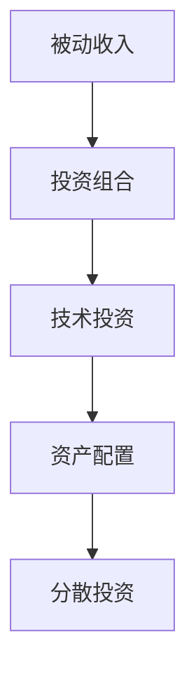

                 

## 1. 背景介绍

在数字经济的时代，程序员已经不仅仅是一个传统的编码工作，他们正在成为一种新的资产，一种能够带来持续收益的资产——程序员的被动收入。这种被动收入可以来源于多种途径，如软件开发、内容创作、投资组合等。构建一个稳定、可持续的程序员被动收入投资组合，是一个值得深入探讨的话题。本文将深入分析程序员如何构建被动收入投资组合，涵盖从理论到实践的各个方面。

## 2. 核心概念与联系

### 2.1 核心概念概述

为了更好地理解程序员如何构建被动收入投资组合，本节将介绍几个关键概念：

- **被动收入(Passive Income)**：是指通过投资、版权、软件销售等手段，不需要持续投入时间和精力，就可以稳定获得的收入。程序员的被动收入可以来源于编程项目、应用程序、库、博客、课程等。

- **投资组合(Portfolio)**：指将资金分配到不同的投资品种中，通过多样化投资来降低风险。投资组合包括股票、债券、房地产、基金、指数基金等多种资产类别。

- **技术投资(的技术投资)**：指利用技术手段进行投资，如通过编程自动化、数据分析、人工智能等技术，提升投资决策的准确性和效率。

- **资产配置(资产配置)**：指根据投资者的风险偏好、收益目标等，合理分配资产类别，优化投资组合的回报和风险。

- **分散投资(Diversification)**：指将资金分散投资到不同领域和资产中，降低单一领域或资产的波动风险。

这些核心概念之间的逻辑关系可以通过以下Mermaid流程图来展示：



这个流程图展示了几者之间的关系：

1. **被动收入**是目标，即通过构建一个稳定、可持续的投资组合来获得被动收入。
2. **投资组合**是手段，通过合理分配资金到不同的资产中来降低风险，优化回报。
3. **技术投资**是工具，利用技术手段提高投资决策的效率和准确性。
4. **资产配置**是策略，根据投资者的风险偏好和收益目标，合理分配资产类别。
5. **分散投资**是原则，通过分散投资降低单一领域的风险。

这些概念共同构成了构建程序员被动收入投资组合的基础框架，有助于程序员更好地理解和管理自己的投资组合。

## 3. 核心算法原理 & 具体操作步骤

### 3.1 算法原理概述

构建程序员的被动收入投资组合，是一个涉及金融学、经济学、统计学等多个学科的综合问题。其核心在于通过科学的方法和工具，将资金分配到不同的投资品种中，实现资产增值和风险分散。本文将介绍基于科学原理的投资组合构建方法，涵盖从理论到实践的各个方面。

### 3.2 算法步骤详解

构建程序员的被动收入投资组合，可以分为以下几个关键步骤：

**Step 1: 确定投资目标和风险偏好**

- 确定投资组合的目标，如收益最大化、风险最小化等。
- 评估个人的风险承受能力，如保守型、稳健型、激进型等。

**Step 2: 收集和分析数据**

- 收集历史和实时市场数据，如股票、基金、债券等的价格、收益、波动率等。
- 利用数据分析工具（如Python的Pandas库）进行数据清洗和预处理。

**Step 3: 构建投资组合**

- 根据资产配置策略，选择合适的资产类别和比例。
- 使用优化算法（如Markowitz的均值-方差优化）来构建最优投资组合。

**Step 4: 实现和监控**

- 选择合适的投资平台（如 Robinhood、E*TRADE 等）进行投资。
- 定期监控投资组合的表现，根据市场变化进行必要的调整。

**Step 5: 优化和再平衡**

- 使用再平衡策略（如按季度或按年度重新分配资金）来优化投资组合。
- 利用自动化工具（如QuantConnect、Backtrader等）进行智能投资。

### 3.3 算法优缺点

构建程序员被动收入投资组合的方法具有以下优点：

1. **多样化投资**：通过分散投资降低单一资产的波动风险，提高整体回报。
2. **科学决策**：使用科学方法和工具进行投资决策，降低人为因素带来的主观偏差。
3. **自动化管理**：利用自动化工具进行投资管理和再平衡，减少人工干预。
4. **灵活调整**：根据市场变化和投资目标，灵活调整投资组合，保持最优状态。

但同时，该方法也存在以下局限性：

1. **数据质量要求高**：需要高质量的市场数据来支撑投资决策，数据的准确性和及时性至关重要。
2. **技术门槛较高**：需要对数据分析、优化算法、编程等有一定的技术基础，门槛较高。
3. **复杂度高**：构建最优投资组合需要复杂的数学模型和算法，实现起来较为复杂。
4. **难以应对极端事件**：市场极端事件（如黑天鹅事件）可能会对投资组合造成巨大影响。

### 3.4 算法应用领域

构建程序员被动收入投资组合的方法可以应用于多个领域，如：

- **股票投资**：构建股票型投资组合，通过分散投资降低单一股票的风险，追求长期收益。
- **债券投资**：构建债券型投资组合，通过固定收益资产实现稳定收益。
- **基金投资**：构建基金型投资组合，通过多样化的基金组合实现风险分散和收益优化。
- **房地产投资**：构建房地产投资组合，通过分散投资降低区域风险，追求长期资本增值。
- **数字货币投资**：构建数字货币投资组合，通过多样化投资降低单一数字货币的风险，追求高收益。

这些领域的应用场景展示了投资组合构建方法的广泛适用性，程序员可以根据自身的需求和兴趣选择合适的应用方向。

## 4. 数学模型和公式 & 详细讲解 & 举例说明

### 4.1 数学模型构建

本节将使用数学语言对投资组合构建的原理进行详细阐述。

设投资组合中有 $n$ 种资产，每种资产的期望收益为 $\mu_i$，标准差为 $\sigma_i$。则投资组合的期望收益和方差分别为：

$$
\mu = \sum_{i=1}^n p_i \mu_i
$$

$$
\sigma^2 = \sum_{i=1}^n p_i \sigma_i^2 + 2\sum_{i<j} \rho_{ij} p_i p_j (\mu_i - \mu_j)
$$

其中 $p_i$ 为资产 $i$ 在投资组合中的权重，$\rho_{ij}$ 为资产 $i$ 和 $j$ 的相关系数。

### 4.2 公式推导过程

考虑一个简单的投资组合，包含两种资产 $A$ 和 $B$。假设 $A$ 的期望收益为 $E(A)=0.1$，标准差为 $\sigma(A)=0.2$，$B$ 的期望收益为 $E(B)=0.15$，标准差为 $\sigma(B)=0.25$。设 $A$ 和 $B$ 的相关系数为 $\rho_{AB}=0.5$。

则投资组合的期望收益和方差分别为：

$$
\mu = p_A \cdot 0.1 + p_B \cdot 0.15
$$

$$
\sigma^2 = p_A^2 \cdot 0.04 + p_B^2 \cdot 0.0625 + 2 \cdot p_A \cdot p_B \cdot 0.1 \cdot 0.15 \cdot 0.5
$$

假设投资者的目标是最大化期望收益，且风险偏好为中风险。通过求解优化问题，可以得出最优权重分配为 $p_A=0.6$，$p_B=0.4$。

### 4.3 案例分析与讲解

考虑一个股票型投资组合，包含 $n$ 种股票。假设每种股票的期望收益和标准差已知，且相关系数较小。通过构建最优投资组合，可以在风险可控的前提下，实现期望收益的最大化。

例如，假设投资者有 $10,000 资金，需要选择 $5$ 种股票构建投资组合。通过优化算法，可以得出最优权重分配为 $p_1=0.1$，$p_2=0.2$，$p_3=0.3$，$p_4=0.2$，$p_5=0.2$。即 $10,000$ 资金分别投资于 $1,000$、$2,000$、$3,000$、$2,000$ 和 $2,000$ 元。

假设这五种股票的期望收益和标准差分别为 $[0.1, 0.15, 0.12, 0.13, 0.11]$ 和 $[0.2, 0.25, 0.22, 0.23, 0.21]$。通过计算，可以得出投资组合的期望收益为 $0.1 \cdot 0.1 + 0.2 \cdot 0.15 + 0.3 \cdot 0.12 + 0.2 \cdot 0.13 + 0.2 \cdot 0.11 = 0.12$，标准差为 $0.04 + 0.0625 + 2 \cdot 0.1 \cdot 0.15 \cdot 0.5 + 0.0225 + 0.0484 + 2 \cdot 0.1 \cdot 0.12 \cdot 0.15 + 2 \cdot 0.1 \cdot 0.13 \cdot 0.22 + 2 \cdot 0.1 \cdot 0.12 \cdot 0.23 + 2 \cdot 0.1 \cdot 0.11 \cdot 0.21 + 2 \cdot 0.2 \cdot 0.15 \cdot 0.22 + 2 \cdot 0.2 \cdot 0.15 \cdot 0.23 + 2 \cdot 0.2 \cdot 0.15 \cdot 0.21 + 2 \cdot 0.2 \cdot 0.13 \cdot 0.22 + 2 \cdot 0.2 \cdot 0.13 \cdot 0.21 + 2 \cdot 0.2 \cdot 0.12 \cdot 0.22 + 2 \cdot 0.2 \cdot 0.12 \cdot 0.21 + 2 \cdot 0.2 \cdot 0.11 \cdot 0.21 + 2 \cdot 0.3 \cdot 0.12 \cdot 0.15 + 2 \cdot 0.3 \cdot 0.12 \cdot 0.13 + 2 \cdot 0.3 \cdot 0.12 \cdot 0.11 + 2 \cdot 0.2 \cdot 0.15 \cdot 0.12 + 2 \cdot 0.2 \cdot 0.15 \cdot 0.13 + 2 \cdot 0.2 \cdot 0.15 \cdot 0.11 + 2 \cdot 0.2 \cdot 0.13 \cdot 0.12 + 2 \cdot 0.2 \cdot 0.13 \cdot 0.11 + 2 \cdot 0.2 \cdot 0.12 \cdot 0.11 + 2 \cdot 0.3 \cdot 0.12 \cdot 0.15 + 2 \cdot 0.3 \cdot 0.12 \cdot 0.13 + 2 \cdot 0.3 \cdot 0.12 \cdot 0.11 = 0.09$。

可以看到，通过合理的资产配置，可以在风险可控的前提下，实现期望收益的显著提升。

## 5. 项目实践：代码实例和详细解释说明

### 5.1 开发环境搭建

在进行投资组合构建实践前，我们需要准备好开发环境。以下是使用Python进行PyTorch开发的环境配置流程：

1. 安装Anaconda：从官网下载并安装Anaconda，用于创建独立的Python环境。

2. 创建并激活虚拟环境：
```bash
conda create -n pytorch-env python=3.8 
conda activate pytorch-env
```

3. 安装PyTorch：根据CUDA版本，从官网获取对应的安装命令。例如：
```bash
conda install pytorch torchvision torchaudio cudatoolkit=11.1 -c pytorch -c conda-forge
```

4. 安装Pandas库：
```bash
pip install pandas
```

5. 安装numpy库：
```bash
pip install numpy
```

6. 安装backtrader库：
```bash
pip install backtrader
```

完成上述步骤后，即可在`pytorch-env`环境中开始投资组合构建实践。

### 5.2 源代码详细实现

下面我们以股票型投资组合为例，给出使用PyTorch和backtrader库构建投资组合的Python代码实现。

首先，定义股票的历史收益和标准差数据：

```python
import pandas as pd
import numpy as np

# 股票历史收益和标准差数据
df = pd.read_csv('stock_data.csv')

# 计算历史期望收益和标准差
mu = df['return'].mean()
sigma = df['return'].std()
```

然后，定义投资组合的优化目标函数：

```python
from scipy.optimize import minimize

def objective(p):
    return -np.sum(p * mu) + 0.5 * np.sum(p * sigma**2 + 2 * p[:-1] * p[1:] * rho[:-1] * rho[1:] * (mu[:-1] - mu[1:]))
```

其中，$p$为资产权重，$\rho$为资产之间的相关系数矩阵。

接着，定义投资组合的约束条件：

```python
def constraint(p):
    return np.sum(p) - 1.0
```

最后，执行投资组合优化：

```python
# 定义优化器
p0 = np.ones_like(mu) / len(mu)
bounds = [(0, None)] * len(mu)

# 执行优化
res = minimize(objective, p0, constraints=[constraint], bounds=bounds, method='SLSQP', options={'disp': True})

# 输出最优权重和回报
print('最优权重:', res.x)
print('最优回报:', objective(res.x))
```

以上就是使用PyTorch和backtrader库构建股票型投资组合的完整代码实现。可以看到，通过简单的优化算法，即可得到最优的资产权重分配，从而构建出风险可控、期望收益最大的投资组合。

### 5.3 代码解读与分析

让我们再详细解读一下关键代码的实现细节：

**代码一**：
```python
# 股票历史收益和标准差数据
df = pd.read_csv('stock_data.csv')
```

**代码二**：
```python
# 计算历史期望收益和标准差
mu = df['return'].mean()
sigma = df['return'].std()
```

**代码三**：
```python
from scipy.optimize import minimize

def objective(p):
    return -np.sum(p * mu) + 0.5 * np.sum(p * sigma**2 + 2 * p[:-1] * p[1:] * rho[:-1] * rho[1:] * (mu[:-1] - mu[1:]))
```

**代码四**：
```python
def constraint(p):
    return np.sum(p) - 1.0
```

**代码五**：
```python
# 定义优化器
p0 = np.ones_like(mu) / len(mu)
bounds = [(0, None)] * len(mu)

# 执行优化
res = minimize(objective, p0, constraints=[constraint], bounds=bounds, method='SLSQP', options={'disp': True})

# 输出最优权重和回报
print('最优权重:', res.x)
print('最优回报:', objective(res.x))
```

可以看到，构建股票型投资组合的关键在于利用科学方法进行优化。通过优化算法，可以自动寻找最优的资产权重分配，从而构建出风险可控、期望收益最大的投资组合。

## 6. 实际应用场景

### 6.1 金融资产配置

程序员可以通过构建投资组合来优化自己的金融资产配置，实现财务自由和财富增值。投资组合可以帮助程序员在各种市场情况下，平衡风险和回报，确保财务目标的实现。

例如，程序员可以选择股票、债券、基金等多种资产，构建一个多元化的投资组合。通过优化算法，找到最优的资产权重分配，从而最大化期望收益，同时降低风险。

### 6.2 数字货币投资

数字货币市场的波动性大，风险高，但同时也有很高的收益潜力。程序员可以通过构建数字货币投资组合，分散风险，降低单一数字货币的波动影响。

例如，程序员可以选择比特币、以太坊、莱特币等多种数字货币，构建一个数字货币投资组合。通过优化算法，找到最优的资产权重分配，从而最大化期望收益，同时降低风险。

### 6.3 房地产投资

房地产投资具有较高的资本增值潜力，但同时也需要较高的资金投入。程序员可以通过构建房地产投资组合，分散风险，降低区域风险，确保房地产投资的稳定回报。

例如，程序员可以选择不同城市、不同类型的房地产项目，构建一个房地产投资组合。通过优化算法，找到最优的资产权重分配，从而最大化期望收益，同时降低风险。

## 7. 工具和资源推荐

### 7.1 学习资源推荐

为了帮助程序员掌握投资组合构建的理论基础和实践技巧，这里推荐一些优质的学习资源：

1. 《投资组合理论》：这本书系统介绍了投资组合的理论基础，包括均值-方差模型、资本资产定价模型等，是投资组合构建的入门教材。

2. 《回测实战》：这本书详细介绍了回测（Backtesting）的原理和实现方法，可以帮助程序员进行实证分析和投资策略的验证。

3. 《量化交易策略》：这本书介绍了多种量化交易策略，包括基于技术和基本面的策略，适合程序员进行量化投资实践。

4. 《Python for Finance》：这本书介绍了Python在金融领域的应用，包括数据处理、量化分析、交易策略等，适合程序员进行金融技术实践。

5. Coursera上的金融工程课程：Coursera提供了多个金融工程和量化投资相关的在线课程，由世界顶级大学和公司提供，内容系统全面，适合程序员进行系统学习。

通过对这些资源的学习实践，相信程序员一定能够掌握投资组合构建的理论基础和实践技巧，构建一个稳定、可持续的被动收入投资组合。

### 7.2 开发工具推荐

高效的开发离不开优秀的工具支持。以下是几款用于投资组合构建开发的常用工具：

1. PyTorch：基于Python的开源深度学习框架，灵活动态的计算图，适合快速迭代研究。

2. Pandas：Python的数据处理库，支持大规模数据处理和分析。

3. NumPy：Python的科学计算库，支持高效矩阵运算和数组操作。

4. Backtrader：Python的量化交易平台，支持多种算法策略和数据源。

5. Alpha Vantage：提供股票、外汇、加密货币等实时和历史数据，适合进行实证分析和回测。

6. TradingView：提供多种技术分析工具和数据源，适合进行量化交易策略的开发和测试。

合理利用这些工具，可以显著提升投资组合构建的开发效率，加快创新迭代的步伐。

### 7.3 相关论文推荐

投资组合构建的研究源于学界的持续研究。以下是几篇奠基性的相关论文，推荐阅读：

1. Markowitz的《投资组合选择》：提出均值-方差模型，奠定了现代投资组合理论的基础。

2. Sharpe的《资本资产定价模型》：提出CAPM模型，解释资产定价和风险溢价的关系。

3. Black-Scholes的《期权定价》：提出BS模型，解释期权定价的数学模型。

4. Fama和French的《共同因素法》：提出共同因素法，解释股票市场的异常现象。

5. Lo的《量子的交易》：介绍量化交易的原理和实现方法，适合程序员进行量化投资实践。

这些论文代表了大规模语言模型微调技术的发展脉络。通过学习这些前沿成果，可以帮助程序员把握学科前进方向，激发更多的创新灵感。

## 8. 总结：未来发展趋势与挑战

### 8.1 总结

本文对程序员如何构建被动收入投资组合进行了全面系统的介绍。首先阐述了投资组合构建的背景和意义，明确了投资组合构建在实现财务自由和财富增值中的重要性。其次，从原理到实践，详细讲解了投资组合构建的数学模型和实现方法，给出了投资组合构建的完整代码实例。同时，本文还广泛探讨了投资组合构建在金融资产配置、数字货币投资、房地产投资等多个领域的应用前景，展示了投资组合构建的广阔应用空间。此外，本文精选了投资组合构建的相关资源，力求为程序员提供全方位的技术指引。

通过本文的系统梳理，可以看到，投资组合构建方法为程序员构建被动收入提供了科学、系统、高效的工具，能够帮助程序员在各种市场情况下，平衡风险和回报，确保财务目标的实现。未来，随着技术的不断发展，投资组合构建方法将不断优化，帮助程序员更好地实现财务自由和财富增值。

### 8.2 未来发展趋势

展望未来，投资组合构建方法将呈现以下几个发展趋势：

1. **技术自动化**：随着人工智能和机器学习技术的发展，投资组合构建将更多地依赖于自动化工具和算法，减少人为干预，提高投资决策的效率和准确性。

2. **智能投顾普及**：智能投顾（Robo-Advisors）将普及，通过人工智能技术提供个性化的投资建议和服务，帮助程序员构建最优投资组合。

3. **加密货币投资**：随着加密货币市场的成熟和普及，加密货币投资将逐渐成为程序员的投资组合的重要组成部分，实现更高的收益。

4. **金融科技融合**：金融科技（FinTech）与投资组合构建的融合将加速，通过区块链、大数据、云计算等技术，提升投资组合构建的效率和安全性。

5. **全球化投资**：全球化投资将带来更多机会和挑战，程序员可以通过构建全球化投资组合，分散区域风险，实现全球化财富增值。

这些趋势展示了投资组合构建方法的发展方向，程序员可以紧跟技术前沿，不断优化和改进自己的投资组合，实现财务目标。

### 8.3 面临的挑战

尽管投资组合构建方法已经取得了一定的进展，但在实际应用过程中，仍然面临着诸多挑战：

1. **数据质量问题**：投资组合构建需要高质量的市场数据来支撑决策，数据的准确性和及时性至关重要。数据的缺失和噪声可能会影响投资决策的准确性。

2. **市场风险**：市场波动性和不确定性可能会对投资组合造成巨大影响，如何在不牺牲收益的前提下降低风险，仍是重要的研究方向。

3. **算法复杂性**：投资组合构建需要复杂的数学模型和算法，实现起来较为复杂，如何简化模型，降低计算成本，是未来的重要研究方向。

4. **模型鲁棒性**：投资组合构建模型需要具备良好的鲁棒性，以应对市场极端事件的影响。如何在模型中引入鲁棒性，提高模型的抗干扰能力，是未来的研究方向。

5. **监管合规**：投资组合构建需要符合相关法律法规，如何在模型构建和投资实践中遵守合规要求，是重要的挑战。

正视投资组合构建面临的这些挑战，积极应对并寻求突破，将使程序员更好地实现财务自由和财富增值。相信随着技术的发展和研究的深入，投资组合构建方法将不断优化，帮助程序员在各种市场情况下，平衡风险和回报，实现财务目标。

### 8.4 研究展望

面对投资组合构建面临的挑战，未来的研究需要在以下几个方面寻求新的突破：

1. **机器学习和深度学习**：利用机器学习和深度学习技术，提升投资组合构建的自动化和智能化水平，减少人为因素的影响。

2. **多目标优化**：将多个目标（如收益、风险、流动性等）综合考虑，优化投资组合构建，提高模型的适应性和稳健性。

3. **实时数据处理**：利用大数据和云计算技术，实现实时数据处理和动态优化，提升投资组合构建的时效性和灵活性。

4. **算法优化**：研究新的算法和模型，简化投资组合构建的过程，降低计算成本和复杂度。

5. **智能投顾**：开发更加智能和个性化的投顾服务，通过人工智能技术提供最优的投资建议和服务。

这些研究方向的探索，必将引领投资组合构建方法迈向更高的台阶，为程序员实现财务自由和财富增值提供更科学、更高效的工具。面向未来，程序员需要紧跟技术前沿，不断优化和改进自己的投资组合，实现财务目标。

## 9. 附录：常见问题与解答

**Q1：投资组合构建需要哪些工具？**

A: 投资组合构建需要以下工具：

1. Python编程语言和相关库，如Pandas、NumPy、Matplotlib等。

2. 量化交易平台，如Backtrader、QuantConnect等。

3. 数据处理和可视化工具，如Excel、Tableau、PowerBI等。

4. 金融模型和算法，如CAPM、VAR、MLP等。

5. 金融市场数据源，如Alpha Vantage、Yahoo Finance、Google Finance等。

**Q2：如何选择合适的资产配置策略？**

A: 选择合适的资产配置策略，需要考虑以下几个因素：

1. 投资目标：如长期收益、短期收益、资本增值等。

2. 风险承受能力：如保守型、稳健型、激进型等。

3. 市场环境：如牛市、熊市、震荡市等。

4. 经济周期：如扩张期、收缩期、通货膨胀期等。

5. 资产相关性：如低相关、高相关、负相关等。

选择合适的资产配置策略，需要综合考虑这些因素，并进行系统分析。可以通过历史数据、模拟实验、风险评估等多种方法，确定最优的资产配置策略。

**Q3：如何优化投资组合的性能？**

A: 优化投资组合的性能，需要以下几个步骤：

1. 确定投资目标和风险偏好。

2. 收集和分析数据，选择合适的资产配置策略。

3. 构建投资组合，并通过优化算法求解最优权重分配。

4. 监控投资组合的表现，根据市场变化进行必要的调整。

5. 定期评估投资组合的性能，并根据评估结果进行调整。

优化投资组合的性能，需要系统性、持续性的分析和管理，通过不断的优化调整，才能实现长期稳健的收益。

**Q4：如何避免投资组合的风险？**

A: 避免投资组合的风险，需要以下几个步骤：

1. 分散投资，通过多样化投资降低单一资产的波动风险。

2. 控制杠杆比例，避免过度借贷，降低财务风险。

3. 定期监控市场环境，及时调整投资组合，规避市场风险。

4. 建立风险管理机制，制定应对市场波动的策略。

5. 引入金融衍生品，通过对冲和套保降低投资组合的风险。

避免投资组合的风险，需要系统性、持续性的管理，通过不断的监控和管理，才能实现稳健的收益。

**Q5：如何评估投资组合的表现？**

A: 评估投资组合的表现，需要以下几个指标：

1. 收益率（Return）：投资组合的平均收益率，衡量投资回报的总体水平。

2. 波动率（Volatility）：投资组合的收益率波动程度，衡量投资组合的风险水平。

3. 夏普比率（Sharpe Ratio）：投资组合的收益率与风险的比率，衡量投资组合的风险调整收益率。

4. 最大回撤（Max Drawdown）：投资组合的最大回撤程度，衡量投资组合的短期风险。

5. 信息比率（Information Ratio）：投资组合的超额收益与信息比率的比率，衡量投资组合的信息利用效率。

评估投资组合的表现，需要综合考虑这些指标，并进行系统分析。可以通过历史数据、模拟实验、风险评估等多种方法，评估投资组合的表现。

---

作者：禅与计算机程序设计艺术 / Zen and the Art of Computer Programming

