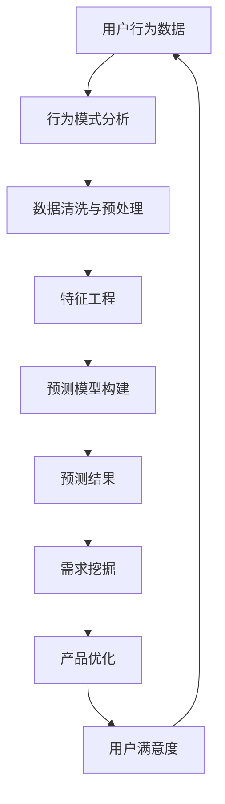

                 

# 程序员如何进行知识付费的用户需求挖掘

> 关键词：知识付费, 用户需求, 数据分析, 行为挖掘, 行为模式, 模型训练, 预测模型, 优化策略

## 1. 背景介绍

在当今快速发展的数字化时代，知识付费已经成为许多专业人士获取知识的重要途径。程序员作为推动技术进步的核心力量，对高质量技术内容有着巨大的需求。然而，由于工作繁忙、时间紧张，他们往往很难通过传统的学习方式获取全面且高效的技术知识。在这样的背景下，知识付费平台应运而生，为程序员提供了一个高效、便捷的学习途径。然而，要想在竞争激烈的知识付费市场中脱颖而出，深入挖掘用户需求，是关键所在。本文将探讨程序员如何进行知识付费的用户需求挖掘，帮助程序员平台优化课程设置，提升用户体验。

## 2. 核心概念与联系

### 2.1 核心概念概述

在深入探讨用户需求挖掘前，我们需要先了解几个核心概念：

- **知识付费**：指用户通过支付一定费用，获取到专业、系统、高效的知识学习服务。它涵盖了在线课程、电子书、编程工具等多种形式。

- **用户需求挖掘**：指通过数据收集和分析，了解用户的行为习惯、兴趣偏好等，挖掘出用户深层次的需求，从而指导产品优化和服务改进。

- **行为模式**：指用户在特定场景下的行为规律，通过观察和分析这些模式，可以更准确地预测用户需求。

- **预测模型**：基于历史数据构建的数学模型，用于预测用户的行为和需求。

- **优化策略**：指通过数据驱动的方式，不断调整产品和服务，提升用户满意度。

这些核心概念通过一系列流程关联起来，形成了一个完整的用户需求挖掘体系。

### 2.2 核心概念原理和架构的 Mermaid 流程图



这个流程图展示了用户需求挖掘的核心流程：通过收集用户行为数据，分析行为模式，经过数据清洗与预处理、特征工程，构建预测模型，并根据预测结果进行需求挖掘，指导产品优化，最终提升用户满意度。

## 3. 核心算法原理 & 具体操作步骤

### 3.1 算法原理概述

用户需求挖掘是一个循环迭代的过程，依赖于大量的数据收集、分析与模型构建。其主要包括以下步骤：

1. **数据收集**：通过日志、问卷、行为记录等方式，收集用户的相关数据。
2. **数据清洗与预处理**：对收集到的数据进行去重、缺失值填充、异常值处理等操作，确保数据的准确性和一致性。
3. **特征工程**：从数据中提取有意义的特征，如用户活跃度、购买频率、学习时长等。
4. **预测模型构建**：使用机器学习算法，如随机森林、神经网络等，构建用户需求预测模型。
5. **需求挖掘与产品优化**：根据预测模型结果，挖掘用户需求，指导产品优化。

### 3.2 算法步骤详解

#### 3.2.1 数据收集

数据收集是用户需求挖掘的第一步。我们需要收集以下几类数据：

- **行为数据**：如课程观看时长、题目解答次数、代码提交频率等。
- **交互数据**：如评论、点赞、分享等互动行为。
- **历史交易数据**：如购买记录、付费订阅信息等。

#### 3.2.2 数据清洗与预处理

数据清洗与预处理是确保数据质量的关键步骤。常见处理方式包括：

- **去重**：去除重复的记录，避免噪音数据对分析结果的影响。
- **缺失值填充**：对缺失数据进行填充，常用的方法有均值填充、插值填充等。
- **异常值处理**：检测并处理异常值，如通过箱线图识别异常值，进行替换或删除。

#### 3.2.3 特征工程

特征工程是构建预测模型的基础。关键步骤包括：

- **特征提取**：从原始数据中提取有意义的特征，如用户活跃度、学习时长等。
- **特征选择**：选择与用户需求高度相关的特征，去除无关特征，提高模型泛化能力。
- **特征变换**：对特征进行归一化、标准化等处理，提升模型性能。

#### 3.2.4 预测模型构建

预测模型是用户需求挖掘的核心。常见预测模型包括：

- **随机森林**：基于决策树的集成算法，适用于分类和回归问题。
- **神经网络**：通过多层感知器实现，适用于复杂模式识别问题。
- **梯度提升树**：基于决策树的集成算法，适用于大规模数据集。

#### 3.2.5 需求挖掘与产品优化

根据预测模型结果，我们可以进行以下需求挖掘：

- **热门课程挖掘**：通过预测用户最感兴趣的课程，优化课程设置，提升课程吸引力。
- **个性化推荐**：根据用户历史行为，推荐符合其兴趣的课程和资源，提升用户粘性。
- **课程质量评估**：通过用户评价和行为数据，评估课程质量，优化课程内容。

### 3.3 算法优缺点

#### 3.3.1 优点

用户需求挖掘具有以下优点：

- **数据驱动**：通过大量数据驱动决策，提高产品优化效果。
- **动态调整**：可以根据用户行为实时调整产品和服务，提升用户体验。
- **全面覆盖**：覆盖用户各个维度的需求，提升产品竞争力。

#### 3.3.2 缺点

用户需求挖掘也存在以下不足：

- **数据隐私**：收集和处理用户数据时，需要关注用户隐私保护，避免数据泄露。
- **模型复杂性**：预测模型构建复杂，需要大量数据和计算资源。
- **数据质量**：数据质量对预测结果影响较大，需要确保数据准确性和完整性。

### 3.4 算法应用领域

用户需求挖掘在知识付费平台中具有广泛应用，主要涵盖以下几个领域：

- **课程推荐系统**：通过用户行为数据，推荐符合用户兴趣的课程。
- **个性化学习路径**：根据用户学习进度和需求，设计个性化学习路径。
- **用户体验优化**：通过行为数据分析，优化平台界面和功能，提升用户体验。
- **内容创作指导**：根据用户需求，指导内容创作者优化课程和文章，提升内容质量。

## 4. 数学模型和公式 & 详细讲解 & 举例说明

### 4.1 数学模型构建

用户需求挖掘的数学模型构建，主要基于机器学习算法。以随机森林模型为例，其构建流程如下：

1. **数据准备**：将数据集分为训练集和测试集，如80%用于训练，20%用于测试。
2. **特征选择**：选择有意义的特征，如用户活跃度、学习时长等。
3. **模型训练**：使用随机森林算法，训练预测模型。
4. **模型评估**：在测试集上评估模型性能，如准确率、召回率等指标。

### 4.2 公式推导过程

假设我们有一个用户数据集，包含以下特征：

- 用户ID
- 学习时长
- 课程观看次数
- 评价评分

我们将这些特征作为随机森林模型的输入，输出为是否购买该课程的预测结果。

```latex
$$
\begin{aligned}
y &= \sum_{i=1}^n f_i(x) \\
f_i(x) &= \sum_{j=1}^m T_j(x) \cdot w_{ij}
\end{aligned}
$$
```

其中，$y$表示预测结果，$f_i(x)$表示第$i$棵决策树的预测结果，$T_j(x)$表示决策树的第$j$个节点，$w_{ij}$表示节点的权重。

### 4.3 案例分析与讲解

假设我们收集到以下数据：

| 用户ID | 学习时长（小时） | 课程观看次数 | 评价评分 |
| --- | --- | --- | --- |
| 1 | 10 | 5 | 4.5 |
| 2 | 5 | 3 | 3.0 |
| 3 | 20 | 8 | 5.0 |
| ... | ... | ... | ... |

我们通过随机森林模型，预测用户是否会购买该课程。模型首先进行特征工程，提取用户活跃度和学习时长等特征。然后，使用随机森林算法进行训练，得到预测模型。最后，将新用户数据输入模型，预测其是否会购买该课程。

## 5. 项目实践：代码实例和详细解释说明

### 5.1 开发环境搭建

以下是使用Python进行数据分析和机器学习实验的开发环境配置流程：

1. 安装Anaconda：从官网下载并安装Anaconda，用于创建独立的Python环境。

2. 创建并激活虚拟环境：
```bash
conda create -n py35 python=3.5
conda activate py35
```

3. 安装相关依赖：
```bash
conda install pandas numpy scikit-learn matplotlib seaborn
```

4. 安装机器学习库：
```bash
pip install scikit-learn xgboost lightgbm catboost
```

5. 安装数据可视化库：
```bash
pip install matplotlib seaborn plotly
```

6. 安装用户行为分析库：
```bash
pip install py3mvpy xgboost
```

完成上述步骤后，即可在`py35`环境中进行数据分析和机器学习实验。

### 5.2 源代码详细实现

以下是使用Python进行用户需求挖掘的完整代码实现。

```python
import pandas as pd
from sklearn.ensemble import RandomForestClassifier
from sklearn.model_selection import train_test_split
from sklearn.metrics import accuracy_score, roc_auc_score

# 加载数据
df = pd.read_csv('user_data.csv')

# 特征工程
features = ['user_id', 'learning_hours', 'course_watches', 'rating']
X = df[features]
y = df['purchase']

# 划分数据集
X_train, X_test, y_train, y_test = train_test_split(X, y, test_size=0.2, random_state=42)

# 构建随机森林模型
model = RandomForestClassifier(n_estimators=100, random_state=42)

# 模型训练
model.fit(X_train, y_train)

# 模型评估
y_pred = model.predict(X_test)
accuracy = accuracy_score(y_test, y_pred)
auc = roc_auc_score(y_test, y_pred)

# 打印结果
print('Accuracy:', accuracy)
print('AUC:', auc)
```

### 5.3 代码解读与分析

我们详细解读一下关键代码的实现细节：

**数据加载**：使用`pandas`库读取数据，并进行初步处理。

**特征工程**：从数据中提取有意义的特征，如用户活跃度、学习时长等。

**模型构建**：使用`RandomForestClassifier`构建随机森林模型。

**模型训练**：在训练集上训练模型，并使用测试集进行评估。

**模型评估**：计算模型的准确率和AUC值，评估模型性能。

**结果输出**：打印模型评估结果，供后续优化参考。

## 6. 实际应用场景

### 6.1 智能推荐系统

基于用户需求挖掘，智能推荐系统可以为用户提供个性化推荐，提升用户满意度。例如，在知识付费平台上，通过用户学习行为数据，可以推荐符合其兴趣的课程，提升平台用户粘性。

**具体流程**：

1. 收集用户学习行为数据，如课程观看时长、评价评分等。
2. 使用随机森林等模型，预测用户是否会购买某课程。
3. 根据预测结果，推荐符合用户兴趣的课程。
4. 根据用户反馈，实时调整推荐策略。

### 6.2 课程内容优化

通过用户需求挖掘，可以优化课程内容和设置，提升课程质量。例如，在知识付费平台上，通过用户学习行为数据，可以优化课程设置，增加用户满意度和留存率。

**具体流程**：

1. 收集用户学习行为数据，如课程观看时长、评价评分等。
2. 使用随机森林等模型，预测用户对课程的兴趣。
3. 根据预测结果，优化课程设置，增加用户满意度和留存率。
4. 根据用户反馈，实时调整课程设置。

### 6.3 用户行为分析

通过用户需求挖掘，可以分析用户行为模式，提升用户体验。例如，在知识付费平台上，通过用户学习行为数据，可以分析用户行为模式，优化平台界面和功能。

**具体流程**：

1. 收集用户学习行为数据，如课程观看时长、评价评分等。
2. 使用随机森林等模型，分析用户行为模式。
3. 根据分析结果，优化平台界面和功能，提升用户体验。
4. 根据用户反馈，实时调整界面和功能。

## 7. 工具和资源推荐

### 7.1 学习资源推荐

为了帮助开发者系统掌握用户需求挖掘的理论基础和实践技巧，这里推荐一些优质的学习资源：

1. 《数据挖掘导论》：详细介绍了数据挖掘的基本概念和常用算法，适合初学者学习。
2. 《Python数据分析实战》：讲解了如何使用Python进行数据分析和可视化，适合数据分析工程师学习。
3. 《机器学习实战》：通过实例介绍了机器学习的基本概念和常用算法，适合机器学习初学者学习。
4. 《深度学习入门》：讲解了深度学习的基本概念和常用模型，适合深度学习工程师学习。
5. 《Python数据科学手册》：详细介绍了Python在数据科学中的应用，适合数据分析工程师学习。

### 7.2 开发工具推荐

高效的开发离不开优秀的工具支持。以下是几款用于用户需求挖掘开发的常用工具：

1. Jupyter Notebook：用于编写和运行Python代码，支持交互式数据分析。
2. PyCharm：用于编写和调试Python代码，支持智能提示和代码自动补全。
3. Pandas：用于数据清洗和预处理，支持多种数据格式处理。
4. Scikit-learn：用于构建机器学习模型，支持多种算法实现。
5. TensorFlow：用于构建深度学习模型，支持GPU加速。
6. PyTorch：用于构建深度学习模型，支持动态图和静态图。

### 7.3 相关论文推荐

用户需求挖掘在人工智能领域具有重要应用，以下是几篇奠基性的相关论文，推荐阅读：

1. 《用户行为数据挖掘与分析》：详细介绍了用户行为数据挖掘的方法和应用。
2. 《机器学习在用户需求挖掘中的应用》：讲解了机器学习在用户需求挖掘中的应用案例。
3. 《基于用户行为数据的推荐系统》：介绍了推荐系统的主要算法和技术实现。
4. 《深度学习在推荐系统中的应用》：讲解了深度学习在推荐系统中的应用案例。
5. 《数据驱动的用户行为分析》：讲解了数据驱动的用户行为分析方法。

## 8. 总结：未来发展趋势与挑战

### 8.1 研究成果总结

用户需求挖掘在知识付费领域具有重要应用，以下是对当前研究进展的总结：

1. **数据驱动决策**：通过大量数据驱动决策，提高了产品优化效果。
2. **动态调整**：可以实时调整产品和服务，提升用户体验。
3. **全面覆盖**：覆盖用户各个维度的需求，提升产品竞争力。

### 8.2 未来发展趋势

展望未来，用户需求挖掘将呈现以下几个发展趋势：

1. **数据质量提升**：数据质量对预测结果影响较大，未来将进一步提升数据质量，确保预测结果的准确性。
2. **模型优化**：通过模型优化和参数调整，提升模型性能。
3. **多模态融合**：将多模态数据融合，提升预测效果。
4. **实时分析**：通过实时数据分析，提升用户体验。
5. **隐私保护**：关注用户隐私保护，确保数据安全。

### 8.3 面临的挑战

用户需求挖掘在发展过程中，仍面临以下挑战：

1. **数据隐私**：收集和处理用户数据时，需要关注用户隐私保护，避免数据泄露。
2. **模型复杂性**：预测模型构建复杂，需要大量数据和计算资源。
3. **数据质量**：数据质量对预测结果影响较大，需要确保数据准确性和完整性。

### 8.4 研究展望

未来的研究应在以下几个方面寻求新的突破：

1. **多模态融合**：将多模态数据融合，提升预测效果。
2. **实时分析**：通过实时数据分析，提升用户体验。
3. **隐私保护**：关注用户隐私保护，确保数据安全。
4. **模型优化**：通过模型优化和参数调整，提升模型性能。
5. **数据质量提升**：进一步提升数据质量，确保预测结果的准确性。

总之，用户需求挖掘具有广泛应用前景，但需要克服数据隐私、模型复杂性等挑战。只有不断优化数据质量和模型性能，才能更好地服务用户，推动知识付费平台的发展。

## 9. 附录：常见问题与解答

**Q1: 用户需求挖掘是否适用于所有类型的知识付费平台？**

A: 用户需求挖掘适用于多种类型的知识付费平台，如在线课程、电子书、编程工具等。但需要注意的是，不同类型的平台可能需要不同的数据来源和分析方法。

**Q2: 如何确保用户数据的安全性？**

A: 确保用户数据安全是用户需求挖掘的重要考虑因素。具体措施包括：
1. 数据匿名化处理：去除用户敏感信息，如姓名、地址等。
2. 数据加密传输：使用SSL等加密技术，确保数据传输安全。
3. 数据访问控制：限制数据访问权限，确保只有授权人员可以访问数据。

**Q3: 用户需求挖掘是否需要大量数据？**

A: 用户需求挖掘需要大量的用户行为数据，以确保预测结果的准确性和泛化能力。但数据质量比数量更为重要，需要确保数据的准确性和完整性。

**Q4: 用户需求挖掘是否需要高昂的计算资源？**

A: 用户需求挖掘确实需要一定的计算资源，特别是在构建复杂模型时。但随着计算技术的发展，云计算和大数据技术已经大大降低了计算成本。

**Q5: 用户需求挖掘是否需要高水平的算法知识？**

A: 用户需求挖掘确实需要一定的算法知识，但也可以通过学习基础机器学习和数据科学课程，逐步掌握相关技能。

作者：禅与计算机程序设计艺术 / Zen and the Art of Computer Programming

