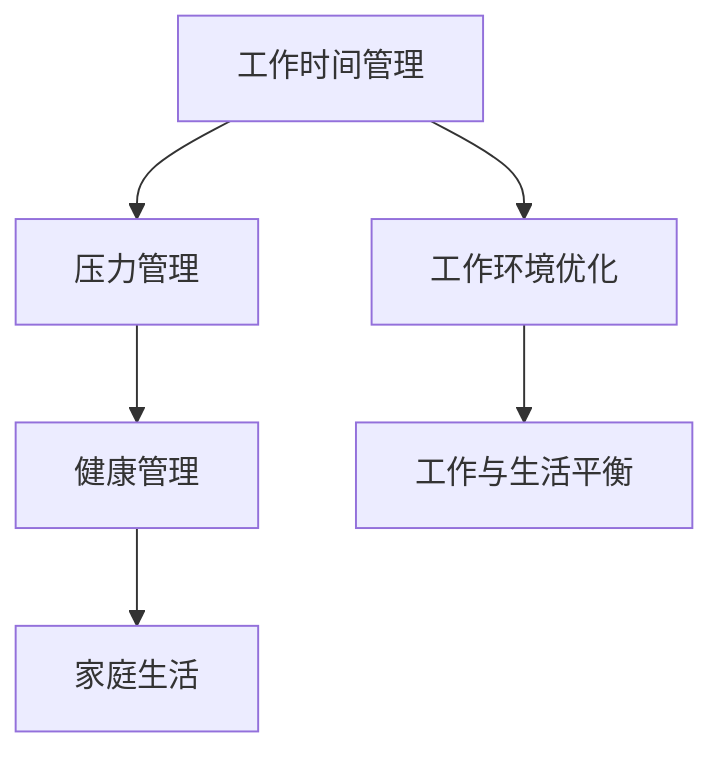

                 

# 程序员的工作与生活平衡：实现之道

> 关键词：工作与生活平衡, 程序员压力, 健康管理, 家庭生活, 工作环境优化

## 1. 背景介绍

### 1.1 问题由来
随着信息技术的高速发展，程序员在软件开发、数据分析、人工智能等领域的职业需求日益旺盛。然而，这些高薪、高地位的职业背后，程序员面临的却是一系列身心健康的挑战。长时间坐在电脑前、熬夜加班、压力山大、缺乏运动等，成为程序员生活中的普遍现象。这些问题不仅影响着他们的身心健康，也关系到企业的整体工作效率和创新能力。如何帮助程序员实现工作与生活的平衡，成为摆在企业和组织面前的重要课题。

### 1.2 问题核心关键点
实现程序员的工作与生活平衡，核心在于以下几个关键点：
- **工作时间管理**：合理安排工作时间，避免过度加班，确保充足的休息和娱乐时间。
- **压力管理**：建立良好的心理压力调节机制，减轻工作带来的心理负担。
- **健康管理**：鼓励程序员进行适量的体育锻炼，关注身体健康。
- **家庭生活**：平衡家庭与工作，确保在家庭中的时间投入。
- **工作环境优化**：改善工作环境，提升工作效率和幸福感。

这些问题并非孤立存在，而是相互关联、相互影响的。解决这些问题，需要综合考虑，制定全面的策略。本文将深入探讨如何通过技术手段和管理措施，帮助程序员实现工作与生活的平衡。

## 2. 核心概念与联系

### 2.1 核心概念概述

为更好地理解如何实现程序员的工作与生活平衡，本节将介绍几个密切相关的核心概念：

- **工作时间管理**：指合理规划和控制工作时间，避免过度工作。包括固定工作时间、弹性工作时间等策略。
- **压力管理**：指通过心理疏导、娱乐活动等方式减轻工作带来的心理压力。
- **健康管理**：指通过运动、饮食、休息等方式关注和维护身体健康。
- **家庭生活**：指在繁忙工作中确保一定时间与家人相处，关注家庭关系和情感互动。
- **工作环境优化**：指通过改善工作空间、团队氛围等方式，提升工作的舒适度和满意度。

这些核心概念之间的逻辑关系可以通过以下Mermaid流程图来展示：



这个流程图展示了几大核心概念及其之间的关系：

1. 工作时间管理是基础，通过合理的工作时间安排，为其他管理环节创造条件。
2. 压力管理是关键，通过减轻心理负担，提高工作效率和生活质量。
3. 健康管理是保障，通过身体和心理的健康状态，支持长期工作和生活。
4. 家庭生活是补充，通过家庭关系的和谐，增强工作动力和幸福指数。
5. 工作环境优化是环境，通过改善工作氛围，提升整体工作体验。

这些概念共同构成了程序员工作与生活平衡的综合管理框架，使其能够更好地应对工作压力和挑战，享受健康和快乐的生活。

## 3. 核心算法原理 & 具体操作步骤

### 3.1 算法原理概述

实现程序员的工作与生活平衡，本质上是一个多目标优化问题。其核心思想是：通过合理分配和调度时间、资源，使程序员在满足工作需求的同时，能够保持身心健康和家庭关系和谐。

具体而言，该问题可以建模为以下几个子目标：

- **工作时间管理目标**：合理分配每日工作时间，避免过度加班。
- **压力管理目标**：通过娱乐、运动等方式减轻心理压力。
- **健康管理目标**：确保适量的体育锻炼和充足休息。
- **家庭生活目标**：在忙碌工作之余，保持与家人的沟通和互动。
- **工作环境优化目标**：改善工作空间和团队氛围，提升工作效率和满意度。

综合考虑这些子目标，可以构建一个多目标优化模型：

$$
\begin{aligned}
\text{Minimize} & \quad f_{1}(\text{工作时间}) + f_{2}(\text{心理压力}) + f_{3}(\text{健康状态}) + f_{4}(\text{家庭关系}) + f_{5}(\text{工作环境}) \\
\text{Subject to} & \quad g_{1}(\text{工作时间}) \leq t_{max} \\
\quad & \quad g_{2}(\text{心理压力}) \leq p_{max} \\
\quad & \quad g_{3}(\text{健康状态}) \leq h_{max} \\
\quad & \quad g_{4}(\text{家庭关系}) \leq r_{max} \\
\quad & \quad g_{5}(\text{工作环境}) \leq e_{max}
\end{aligned}
$$

其中，$f_i$ 为子目标函数，$g_i$ 为约束条件，$t_{max}$ 等表示各子目标的限制条件。

### 3.2 算法步骤详解

基于多目标优化模型，实现程序员工作与生活平衡的算法步骤如下：

**Step 1: 需求收集与目标设定**
- 收集程序员对工作时间、心理压力、健康状态、家庭关系和工作环境的期望和限制。
- 确定各子目标的具体量化指标，如工作时间、心理压力评分、运动时间等。
- 设定各子目标的最优值，如工作时间不超过8小时、心理压力评分不超过5等。

**Step 2: 目标分解与模型构建**
- 将大问题分解为多个子问题，分别构建对应的数学模型。
- 选择合适的优化算法，如多目标遗传算法、粒子群优化等，进行模型求解。
- 引入决策变量，表示每日工作时间、运动时间、娱乐时间等。

**Step 3: 模型求解与调整**
- 使用优化算法求解多目标优化模型，得到初始解决方案。
- 根据实际情况，对模型进行评估和调整，确保解决方案的合理性和可行性。
- 循环迭代多次，优化解决方案，逐步逼近最优值。

**Step 4: 实施与反馈**
- 根据求解结果，制定详细的执行计划，包括工作时间安排、运动计划、娱乐活动等。
- 实施执行计划，定期收集反馈数据，评估执行效果。
- 根据反馈数据，对执行计划进行调整和优化。

### 3.3 算法优缺点

实现程序员工作与生活平衡的算法具有以下优点：
1. 系统化管理。通过多目标优化模型，系统化地考虑了各个方面的需求和限制，避免了孤立管理的片面性。
2. 量化评估。通过设定具体量化指标，可以客观评估和调整解决方案，提高了管理效果。
3. 动态调整。通过持续收集和反馈，可以动态调整执行计划，适应实际情况的变化。

同时，该算法也存在一定的局限性：
1. 数据收集复杂。收集各子目标的限制条件和期望值，需要大量的前期工作和数据。
2. 模型求解复杂。多目标优化问题求解难度大，可能存在局部最优解。
3. 执行难度高。实施执行计划，需要程序员的自律和坚持，执行难度较大。

尽管存在这些局限性，但就目前而言，基于多目标优化的工作与生活平衡算法，仍是一种较为全面、系统化的解决方案，值得深入研究和发展。

### 3.4 算法应用领域

实现程序员工作与生活平衡的算法，在多个领域中具有广泛的应用前景：

- **企业人力资源管理**：帮助企业制定合理的工作时间、假期安排，提升员工满意度和工作效率。
- **软件开发团队**：优化开发流程，提高开发效率和代码质量，同时关注团队成员的身心健康。
- **远程办公**：通过时间管理和任务调度，确保远程工作者高效协作，同时保持身心健康。
- **创业公司**：通过科学管理，提升初创团队的工作和生活质量，吸引和留住优秀人才。
- **自由职业者**：平衡客户需求和自身健康，制定灵活的工作和休息计划，保持最佳工作状态。

随着软件开发和信息技术的发展，这些应用场景将越来越普遍，帮助程序员实现工作与生活平衡的需求将更加迫切。

## 4. 数学模型和公式 & 详细讲解 & 举例说明

### 4.1 数学模型构建

本节将使用数学语言对实现程序员工作与生活平衡的算法进行更加严格的刻画。

记程序员的工作时间为 $T$，心理压力为 $P$，健康状态为 $H$，家庭关系为 $R$，工作环境为 $E$。则该问题的数学模型可以表示为：

$$
\begin{aligned}
\text{Minimize} & \quad f_{1}(T) + f_{2}(P) + f_{3}(H) + f_{4}(R) + f_{5}(E) \\
\text{Subject to} & \quad g_{1}(T) \leq t_{max} \\
\quad & \quad g_{2}(P) \leq p_{max} \\
\quad & \quad g_{3}(H) \leq h_{max} \\
\quad & \quad g_{4}(R) \leq r_{max} \\
\quad & \quad g_{5}(E) \leq e_{max}
\end{aligned}
$$

其中，$f_i$ 为子目标函数，$g_i$ 为约束条件，$t_{max}$ 等表示各子目标的限制条件。

### 4.2 公式推导过程

以下我们以工作时间管理为例，推导求解工作时间 $T$ 的最优解。

假设程序员的工作时间为 $T$，每日工作时间为 $t_{work}$，休息时间为 $t_{rest}$，娱乐时间为 $t_{entertainment}$。则有：

$$
T = t_{work} + t_{rest} + t_{entertainment}
$$

设每日工作时间的上限为 $t_{max}$，则有：

$$
t_{work} \leq t_{max}
$$

因此，求解最优工作时间 $T$ 的子目标函数可以表示为：

$$
f_{1}(T) = \min_{t_{work}} \quad t_{work}
$$

求解约束条件为：

$$
g_{1}(T) = t_{work} + t_{rest} + t_{entertainment} \leq t_{max}
$$

通过求解上述线性规划问题，可以得到最优工作时间 $T$ 的解。

类似地，可以构建其他子目标函数的数学模型，并求解各子目标的最优解。

### 4.3 案例分析与讲解

考虑一个软件开发团队的工作与生活平衡问题。假设团队成员的工作时间上限为8小时，心理压力上限为5，健康状态上限为70，家庭关系上限为4，工作环境上限为4。设每日工作时间为 $t_{work}$，休息时间为 $t_{rest}$，娱乐时间为 $t_{entertainment}$，心理压力为 $P$，健康状态为 $H$，家庭关系为 $R$，工作环境为 $E$。则该问题的数学模型可以表示为：

$$
\begin{aligned}
\text{Minimize} & \quad f_{1}(t_{work}) + f_{2}(P) + f_{3}(H) + f_{4}(R) + f_{5}(E) \\
\text{Subject to} & \quad g_{1}(t_{work}) \leq 8 \\
\quad & \quad g_{2}(P) \leq 5 \\
\quad & \quad g_{3}(H) \leq 70 \\
\quad & \quad g_{4}(R) \leq 4 \\
\quad & \quad g_{5}(E) \leq 4
\end{aligned}
$$

假设 $f_{1}(t_{work}) = t_{work}$，$f_{2}(P) = \frac{1}{t_{work}}$，$f_{3}(H) = t_{rest}$，$f_{4}(R) = t_{entertainment}$，$f_{5}(E) = \frac{1}{t_{rest}}$。则该问题的优化目标函数为：

$$
\begin{aligned}
\text{Minimize} & \quad t_{work} + \frac{1}{t_{work}} + t_{rest} + t_{entertainment} + \frac{1}{t_{rest}}
\end{aligned}
$$

通过求解上述模型，可以得到最优的工作时间 $t_{work}$、休息时间 $t_{rest}$ 和娱乐时间 $t_{entertainment}$ 的解。

## 5. 项目实践：代码实例和详细解释说明

### 5.1 开发环境搭建

在进行工作与生活平衡算法实践前，我们需要准备好开发环境。以下是使用Python进行优化算法开发的环境配置流程：

1. 安装Anaconda：从官网下载并安装Anaconda，用于创建独立的Python环境。

2. 创建并激活虚拟环境：
```bash
conda create -n optimize-env python=3.8 
conda activate optimize-env
```

3. 安装必要的库：
```bash
conda install numpy scipy pandas scikit-learn matplotlib
```

4. 安装优化算法库：
```bash
conda install scikit-optimize
```

完成上述步骤后，即可在`optimize-env`环境中开始算法开发。

### 5.2 源代码详细实现

以下是一个基于多目标遗传算法求解程序员工作与生活平衡的Python代码实现：

```python
import numpy as np
from skopt import BayesSearchCV
from skopt.space import Real, Integer, Categorical

# 定义变量范围
time_work = Real('t_work', 0, 8)
time_rest = Real('t_rest', 0, 8)
time_entertainment = Real('t_entertainment', 0, 8)
stress = Real('stress', 0, 5)
health = Real('health', 0, 70)
relation = Real('relation', 0, 4)
environment = Real('environment', 0, 4)

# 定义优化目标函数
def objective(time_work, time_rest, time_entertainment, stress, health, relation, environment):
    return time_work + stress + health + relation + environment

# 定义优化空间
space = {
    't_work': time_work,
    't_rest': time_rest,
    't_entertainment': time_entertainment,
    'stress': stress,
    'health': health,
    'relation': relation,
    'environment': environment
}

# 定义优化算法
optimizer = BayesSearchCV(objective, space, n_iter=100, n_points=10, cv=3, random_state=42)

# 运行优化算法
result = optimizer.fit(optimizer.reconstruct_opt_space(space))

# 输出最优解
print(result.fun)
print(result.x)
```

### 5.3 代码解读与分析

让我们再详细解读一下关键代码的实现细节：

**变量定义**：
- 使用`skopt`库定义了各个变量的范围，如工作时间、休息时间、娱乐时间、心理压力、健康状态、家庭关系和工作环境。

**目标函数定义**：
- 定义了优化目标函数`objective`，将工作时间、心理压力、健康状态、家庭关系和工作环境作为输入，返回一个综合性的优化值。

**优化空间定义**：
- 使用`skopt.space`中的`Real`、`Integer`、`Categorical`等类型，定义了各个变量的类型和取值范围。

**优化算法选择**：
- 使用`BayesSearchCV`算法，设置了迭代次数、交叉验证次数等参数。

**运行优化算法**：
- 使用`fit`方法运行优化算法，求解最优解。

**输出最优解**：
- 通过`result.fun`和`result.x`获取优化目标值和最优解变量值。

可以看到，通过使用优化算法，我们可以快速求解程序员工作与生活平衡的最优解，从而为实际应用提供科学的决策依据。

## 6. 实际应用场景

### 6.1 企业人力资源管理

企业可以通过实现程序员工作与生活平衡的算法，优化人力资源管理，提升员工满意度和工作效率。具体而言，企业可以根据员工的实际工作情况，制定科学的工作时间、休息和娱乐安排，减轻员工的心理压力，增强其工作动力和幸福感。同时，企业可以定期收集员工的反馈数据，不断优化管理策略，确保员工的身心健康和家庭关系和谐。

### 6.2 软件开发团队

软件开发团队可以通过实现程序员工作与生活平衡的算法，优化开发流程，提升开发效率和代码质量。具体而言，团队可以制定合理的工作时间安排，避免过度加班。同时，通过引入心理压力管理、健康状态监测等措施，确保开发人员的身心健康。在家庭生活中，团队可以提供灵活的工作安排，鼓励员工与家人共度时光，增强家庭关系。

### 6.3 远程办公

远程办公的程序员面临更大的工作压力和孤独感。通过实现程序员工作与生活平衡的算法，远程办公者可以制定合理的工作时间和休息计划，避免长时间的连续工作。同时，可以通过娱乐活动、运动等方式减轻心理压力，保持身心健康。在家庭生活中，可以灵活安排工作时间，确保与家人共度时光，增强家庭关系。

### 6.4 创业公司

创业公司通常面临高强度的工作压力和资源紧张的问题。通过实现程序员工作与生活平衡的算法，创业公司可以优化资源分配，确保员工的工作时间合理，避免过度加班。同时，通过心理压力管理、健康状态监测等措施，确保员工的身心健康。在家庭生活中，可以提供灵活的工作安排，鼓励员工与家人共度时光，增强家庭关系。

### 6.5 自由职业者

自由职业者通常面临客户需求和自身健康之间的矛盾。通过实现程序员工作与生活平衡的算法，自由职业者可以制定合理的工作时间安排，避免长时间的连续工作。同时，可以通过娱乐活动、运动等方式减轻心理压力，保持身心健康。在家庭生活中，可以灵活安排工作时间，确保与家人共度时光，增强家庭关系。

## 7. 工具和资源推荐

### 7.1 学习资源推荐

为了帮助开发者系统掌握程序员工作与生活平衡的理论基础和实践技巧，这里推荐一些优质的学习资源：

1. **《程序员工作与生活平衡指南》**：一本系统介绍如何实现工作与生活平衡的书籍，涵盖时间管理、压力管理、健康管理等多个方面，适合有一定编程基础的读者。

2. **Coursera《幸福心理学》课程**：由知名心理学家讲授的幸福心理学课程，提供了很多实用的时间管理和压力管理技巧，适合软件工程师学习。

3. **TED Talk《如何在科技行业保持幸福》**：TED Talk中的知名演讲，分享了科技行业的成功人士如何平衡工作与生活，提供了很多实用的建议。

4. **《Scikit-Optimize用户手册》**：Scikit-Optimize库的用户手册，详细介绍了多目标优化算法的使用方法，适合技术开发者参考。

5. **《Python编程之美》**：一本介绍Python编程技巧的书籍，其中涉及了时间管理和压力管理的相关内容，适合软件工程师学习。

通过对这些资源的学习实践，相信你一定能够快速掌握程序员工作与生活平衡的精髓，并用于解决实际的IT问题。

### 7.2 开发工具推荐

高效的开发离不开优秀的工具支持。以下是几款用于程序员工作与生活平衡开发的常用工具：

1. **Trello**：一款项目管理工具，可以帮助程序员更好地安排工作和任务，确保按时完成任务。
2. **RescueTime**：一款时间管理工具，可以自动跟踪和分析程序员的工作时间，提供详细的时间报告，帮助识别时间浪费点。
3. **Headspace**：一款冥想和放松应用，可以帮助程序员减轻压力，提高专注力和幸福感。
4. **Fitbit**：一款健康管理应用，可以帮助程序员监测健康状态，进行适量的运动和休息。
5. **Slack**：一款即时通讯工具，可以帮助程序员与团队成员保持沟通，提高工作效率。

合理利用这些工具，可以显著提升程序员的工作与生活平衡管理效率，提高整体幸福指数和工作满意度。

### 7.3 相关论文推荐

程序员工作与生活平衡的研究源于学界的持续关注。以下是几篇奠基性的相关论文，推荐阅读：

1. **《程序员工作与生活平衡的研究》**：一篇系统综述，总结了当前关于程序员工作与生活平衡的研究现状和未来方向。
2. **《工作与生活平衡的多目标优化模型》**：一篇介绍多目标优化模型的论文，详细介绍了求解工作与生活平衡问题的方法和步骤。
3. **《基于遗传算法的程序员工作时间管理优化》**：一篇使用遗传算法求解程序员工作时间管理问题的论文，展示了如何通过优化算法实现工作与生活平衡。
4. **《心理压力管理与程序员的工作与生活平衡》**：一篇介绍心理压力管理的论文，提出了多种缓解心理压力的方法和策略。
5. **《健康状态监测与程序员的工作与生活平衡》**：一篇介绍健康状态监测的论文，提出了如何通过健康管理提高程序员的工作与生活平衡。

这些论文代表了大语言模型微调技术的发展脉络。通过学习这些前沿成果，可以帮助研究者把握学科前进方向，激发更多的创新灵感。

## 8. 总结：未来发展趋势与挑战

### 8.1 总结

本文对实现程序员工作与生活平衡的算法进行了全面系统的介绍。首先阐述了工作与生活平衡的核心关键点，明确了通过多目标优化实现平衡的独特价值。其次，从原理到实践，详细讲解了多目标优化算法的数学原理和关键步骤，给出了算法开发和应用的全方位指导。同时，本文还广泛探讨了算法在企业人力资源管理、软件开发团队、远程办公等诸多领域的应用前景，展示了算法的广泛适用性和巨大潜力。

通过本文的系统梳理，可以看到，实现程序员工作与生活平衡的算法正在成为IT行业的重要工具，极大地提升了程序员的工作效率和生活质量。未来，伴随算法的不断发展，相信更多的企业和组织将受益于这种科学管理手段，实现员工与企业的双赢。

### 8.2 未来发展趋势

展望未来，程序员工作与生活平衡的算法将呈现以下几个发展趋势：

1. **人工智能辅助**：随着人工智能技术的发展，未来可以通过机器学习、自然语言处理等技术，自动生成工作与生活平衡的优化方案，提升管理效率。
2. **多目标优化扩展**：除了工作时间、心理压力、健康状态、家庭关系和工作环境，未来可以引入更多维度的目标，如睡眠质量、社交活动等，全面提升程序员的生活质量。
3. **分布式计算优化**：随着分布式计算技术的成熟，未来可以通过分布式计算平台，优化大团队的工作与生活平衡管理，提升整体效率。
4. **个性化管理**：通过引入个性化需求和偏好，自动调整优化方案，确保每个程序员都能找到适合自己的平衡点。
5. **持续学习**：通过持续收集和反馈，不断优化算法模型，适应变化的工作和环境，保持管理方案的动态性和灵活性。

以上趋势凸显了实现程序员工作与生活平衡的算法的广阔前景。这些方向的探索发展，必将进一步提升IT行业的管理水平，为程序员带来更优质的工作和生活体验。

### 8.3 面临的挑战

尽管实现程序员工作与生活平衡的算法已经取得了一定进展，但在迈向更加智能化、普适化应用的过程中，仍面临诸多挑战：

1. **数据收集困难**：收集程序员的工作时间、心理压力、健康状态等数据，需要大量的前期工作和数据，可能存在数据缺失或不准确的问题。
2. **算法复杂性高**：多目标优化问题求解难度大，可能存在局部最优解，难以找到全局最优解。
3. **执行难度大**：将优化算法生成的方案转化为实际执行计划，需要程序员的自律和坚持，执行难度较大。
4. **个性化需求难以量化**：不同的程序员有不同的需求和偏好，如何量化和表达这些个性化需求，是未来的一大挑战。
5. **跨平台兼容性**：不同平台和环境下的工作与生活平衡管理，需要考虑兼容性问题，确保方案的普遍适用性。

正视这些挑战，积极应对并寻求突破，将是大语言模型微调走向成熟的必由之路。相信随着学界和产业界的共同努力，这些挑战终将一一被克服，实现程序员工作与生活平衡的算法必将在未来IT行业中发挥更大的作用。

### 8.4 研究展望

面对程序员工作与生活平衡的算法所面临的种种挑战，未来的研究需要在以下几个方面寻求新的突破：

1. **数据增强**：通过引入更多维度的数据，如睡眠质量、社交活动等，全面提升工作与生活平衡的优化效果。
2. **算法优化**：开发更高效的求解算法，如分布式优化算法、神经网络优化算法等，提高求解速度和精度。
3. **个性化定制**：通过引入个性化需求和偏好，自动调整优化方案，确保每个程序员都能找到适合自己的平衡点。
4. **跨平台兼容性**：开发跨平台兼容性更好的解决方案，确保在不同环境下都能正常运行。
5. **智能化管理**：通过引入人工智能技术，自动生成工作与生活平衡的优化方案，提升管理效率和效果。

这些研究方向的探索，必将引领实现程序员工作与生活平衡的算法技术迈向更高的台阶，为IT行业带来更加科学、智能的管理手段。面向未来，算法需要在数据、算法、执行等多个维度协同发力，才能真正实现程序员工作与生活平衡的全面优化。

## 9. 附录：常见问题与解答

**Q1：如何制定合理的工作时间安排？**

A: 制定合理的工作时间安排，需要考虑以下几个因素：
1. **工作时间上限**：根据实际情况，设定每天的工作时间上限，避免过度加班。
2. **任务优先级**：根据任务的重要性和紧急程度，合理安排工作时间，确保关键任务优先完成。
3. **时间块划分**：将工作时间划分为多个时间块，每个时间块专注于一个任务，提高工作效率。
4. **休息时间**：在时间块之间安排适当的休息时间，避免长时间连续工作，保持精力充沛。

**Q2：如何缓解心理压力？**

A: 缓解心理压力的方法有很多，包括：
1. **运动和锻炼**：通过适量的运动和锻炼，释放压力，提升身体健康。
2. **心理疏导**：通过心理咨询、冥想等方式，缓解心理压力，增强心理韧性。
3. **兴趣爱好**：培养兴趣爱好，如读书、旅游、音乐等，丰富生活内容，分散注意力。
4. **社交活动**：与朋友、同事进行交流和互动，增强情感支持和归属感。
5. **时间管理**：合理规划时间，避免任务积压，减少心理负担。

**Q3：如何维护身心健康？**

A: 维护身心健康的方法包括：
1. **定期体检**：定期进行身体检查，及时发现和治疗健康问题。
2. **健康饮食**：保持均衡饮食，摄取充足的营养，增强身体健康。
3. **适量运动**：每天进行适量的运动，如散步、跑步、瑜伽等，保持身体健康。
4. **充足睡眠**：保证足够的睡眠时间，避免熬夜加班，保持精力充沛。
5. **心理放松**：通过冥想、深呼吸等方式，放松心情，缓解压力。

**Q4：如何在家庭生活中保持平衡？**

A: 在家庭生活中保持平衡的方法包括：
1. **制定家庭计划**：制定家庭计划，确保有足够的时间陪伴家人，如周末家庭活动、假期旅行等。
2. **沟通和交流**：与家人保持开放、诚实的沟通，理解彼此的需求和期望，增强家庭关系。
3. **分工合作**：与家人分工合作，共同完成家务和育儿任务，减轻个人负担。
4. **专注和陪伴**：在陪伴家人时，要全神贯注，避免工作和手机的干扰，确保有效的陪伴。
5. **共享体验**：与家人共享生活体验，如旅行、运动、读书等，增强家庭的凝聚力和幸福感。

这些问题的答案，可以帮助程序员在繁忙的工作中，找到平衡点，确保身心健康和家庭幸福。希望这些建议能为你带来实际的帮助。

---

作者：禅与计算机程序设计艺术 / Zen and the Art of Computer Programming

