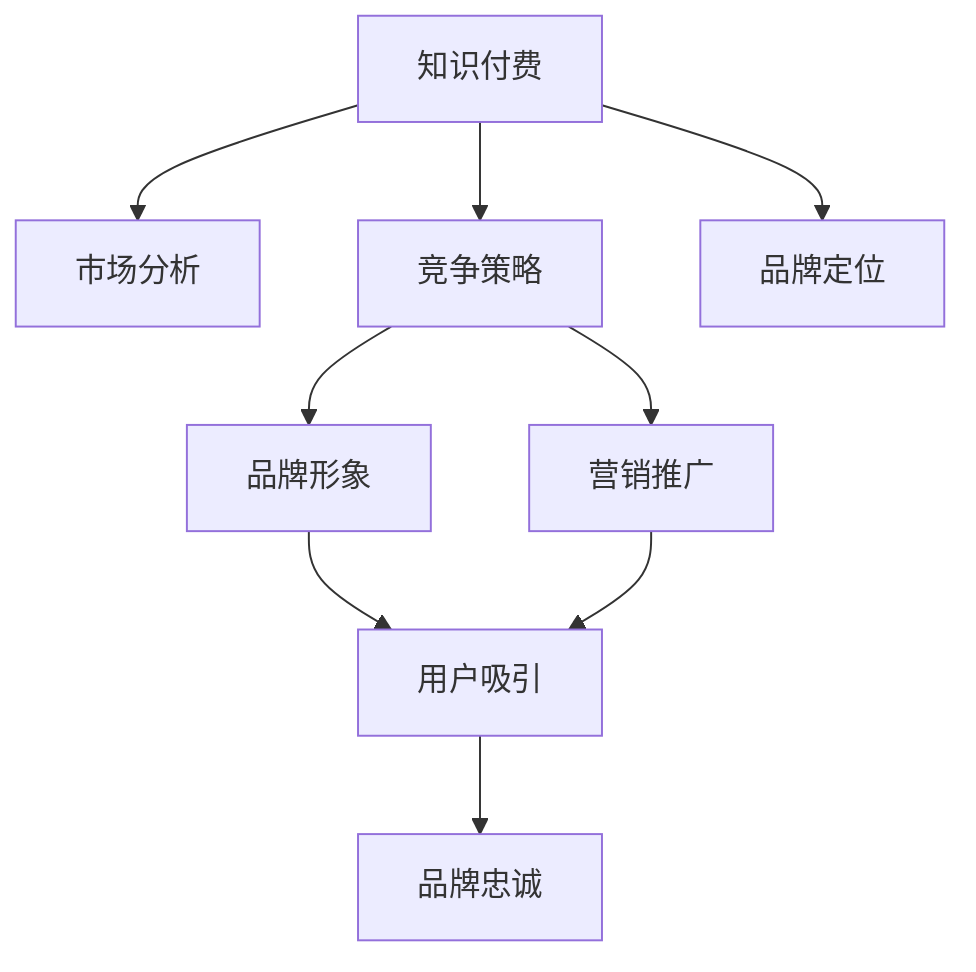

                 

# 程序员的知识付费品牌定位策略

> 关键词：知识付费,程序员,品牌定位,市场分析,竞争策略,营销推广,品牌形象

## 1. 背景介绍

### 1.1 问题由来

近年来，随着互联网技术的发展和智能手机的普及，知识付费市场迅速崛起，成为一个新的经济增长点。特别是在IT、金融、医疗等高门槛领域，知识付费模式帮助从业者提升专业技能，在短时间内获得质的提升，极大地推动了知识的传播和应用。然而，市场竞争的加剧，使得各类知识付费平台竞相推出新内容，有效区别自己，提升品牌知名度，成为了摆在品牌面前的一大难题。

程序员作为知识付费的重要受众，对于知识的渴望和专业化需求尤为强烈。如何在竞争激烈的市场中脱颖而出，成为程序员知识付费品牌的首要选择，就成为摆在品牌面前的一大挑战。

### 1.2 问题核心关键点

程序员知识付费品牌定位的核心在于通过精准的市场分析、有效的竞争策略以及有针对性的营销推广，塑造自己独特的品牌形象。具体而言，包括以下几个关键点：

- 市场定位：明确目标用户群体，设计相应的产品和服务，满足其个性化需求。
- 竞争策略：了解竞争对手的优劣势，制定差异化策略，突出自身独特优势。
- 品牌形象：通过高质量内容、优秀用户体验、强有力的品牌宣传，建立正面品牌形象。
- 营销推广：运用多元化渠道，吸引目标用户，扩大市场份额。

本文将从这四个角度出发，深入分析程序员知识付费品牌定位的策略和方法。

## 2. 核心概念与联系

### 2.1 核心概念概述

为更好地理解程序员知识付费品牌定位，本节将介绍几个密切相关的核心概念：

- 知识付费：指用户为获取特定知识内容而支付费用的消费模式，常见的形式包括文章、课程、视频等。
- 程序员：指从事软件开发、测试、运维等工作的专业技术人员，具备较强的技术能力和创新思维。
- 品牌定位：指品牌通过市场分析，确定目标用户和核心竞争力，制定明确的品牌策略。
- 市场分析：指通过调研、数据分析等手段，了解目标用户需求和市场竞争态势，为品牌定位提供依据。
- 竞争策略：指在市场竞争中，制定有针对性的策略，确保品牌在目标用户中占据优势地位。
- 品牌形象：指品牌通过其核心价值、产品服务、品牌文化等要素，在用户心中形成的正面印象。
- 营销推广：指通过多渠道传播品牌信息，吸引目标用户，实现品牌知名度和市场份额的提升。

这些核心概念之间的逻辑关系可以通过以下Mermaid流程图来展示：



这个流程图展示了知识付费品牌定位的一般流程：

1. 首先通过市场分析了解目标用户和市场需求。
2. 接着根据分析结果制定竞争策略，确保品牌在目标市场中的地位。
3. 在竞争策略的基础上，确定品牌定位，设计符合目标用户需求的产品和服务。
4. 通过塑造品牌形象，提高品牌知名度和美誉度。
5. 最后通过营销推广，吸引目标用户，形成品牌忠诚。

## 3. 核心算法原理 & 具体操作步骤

### 3.1 算法原理概述

程序员知识付费品牌定位本质上是一种基于市场分析和竞争策略的优化问题。通过系统性分析目标用户需求和市场竞争态势，设计具有竞争力的品牌策略，并通过营销推广形成品牌知名度和用户忠诚。

具体来说，可以采用以下步骤：

- 进行市场调研，了解目标用户群体、需求特点和支付习惯。
- 进行竞争分析，了解主要竞争对手的优劣势，挖掘自身差异化优势。
- 设计品牌定位，包括品牌核心理念、目标用户群体、核心产品和服务。
- 塑造品牌形象，包括品牌名称、标识、口号、网站设计等，建立正面品牌形象。
- 制定营销策略，包括内容营销、SEO优化、社交媒体推广等，吸引目标用户。

### 3.2 算法步骤详解

以下是程序员知识付费品牌定位的具体操作步骤：

**Step 1: 市场调研与用户画像构建**

1. 通过问卷调查、用户访谈等方式，收集目标用户的偏好和需求。
2. 分析数据，确定目标用户的核心需求，包括专业技能提升、职业发展、生活帮助等。
3. 构建用户画像，明确目标用户的年龄、职业、兴趣、支付习惯等关键信息。

**Step 2: 竞争分析与差异化策略制定**

1. 选择主要竞争对手，收集其市场表现、产品特点、用户评价等信息。
2. 对比自身与竞争对手的优劣势，找出核心竞争力和差异化优势。
3. 制定差异化策略，明确品牌独特卖点，如专业性强、用户体验好、价格合理等。

**Step 3: 品牌定位与产品设计**

1. 确定品牌核心理念，如专业、高效、创新等。
2. 设计符合目标用户需求的核心产品和服务，如编程教程、案例分析、行业资讯等。
3. 进行产品原型设计，包括界面设计、功能模块、用户体验等，确保满足目标用户需求。

**Step 4: 品牌形象塑造**

1. 确定品牌名称、标识、口号，确保简洁明了、易于记忆。
2. 进行网站设计和优化，确保用户体验良好，提升品牌形象。
3. 发布品牌相关内容，如博客、白皮书、案例分析等，提升品牌知名度。

**Step 5: 营销推广与品牌忠诚形成**

1. 制定内容营销策略，通过博客、视频、课程等形式吸引目标用户。
2. 进行SEO优化，提升网站在搜索引擎中的排名，吸引更多流量。
3. 运用社交媒体推广，建立品牌社交影响力，形成品牌忠诚。
4. 定期推出优惠活动，如免费试听、会员折扣等，提升用户粘性。

### 3.3 算法优缺点

基于市场分析和竞争策略的知识付费品牌定位方法，具有以下优点：

1. 系统性：通过全面的市场调研和竞争分析，制定科学合理的品牌定位策略。
2. 差异化：通过明确自身独特卖点，确保品牌在目标用户中占据优势地位。
3. 多渠道：通过内容营销、SEO、社交媒体等多种渠道，全方位提升品牌知名度。

但该方法也存在一些局限性：

1. 成本高：市场调研、竞争分析等前期投入较高，对资源和预算要求较高。
2. 时效性差：市场和用户需求变化较快，品牌定位策略需定期调整。
3. 用户粘性低：初期吸引用户易，长期保持用户粘性仍需不断努力。

## 4. 数学模型和公式 & 详细讲解 & 举例说明

### 4.1 数学模型构建

品牌定位可以看作是在满足目标用户需求和提升品牌知名度之间的优化问题。假设品牌市场知名度为 $X$，目标用户需求满意度为 $Y$，品牌优化目标为最大化两者的乘积 $XY$。

设品牌定位策略参数为 $\theta$，则模型可以表示为：

$$
\max_{\theta} XY
$$

其中 $X$ 可以通过网站流量、用户活跃度等指标进行量化。$Y$ 可以通过用户满意度调查、产品评价等指标进行量化。

### 4.2 公式推导过程

假设品牌定位策略参数 $\theta$ 包含多个变量，如产品功能、价格、推广策略等。则可以通过如下公式对 $XY$ 进行近似推导：

$$
XY = f(\theta)
$$

其中 $f(\theta)$ 为品牌知名度和目标用户需求满意度的函数关系。

通过回归分析、蒙特卡洛模拟等方法，可以求解 $f(\theta)$ 的最优解，从而找到最优品牌定位策略。

### 4.3 案例分析与讲解

以下是一个简单的案例分析：

假设某程序员知识付费平台的目标用户群体为中级以上程序员，其主要需求为提升专业技能、拓展职业发展路径。通过市场调研和竞争分析，发现该平台在内容深度和用户体验方面存在优势，但在价格和营销推广方面存在不足。

于是，该平台决定在价格和推广策略上进行优化，提升品牌知名度，满足用户需求。具体措施包括：

1. 提供更有针对性的课程和教程，提升用户满意度。
2. 进行价格优惠活动，降低用户进入门槛。
3. 通过社交媒体推广，提升品牌知名度。
4. 引入SEO优化，提升网站流量。

通过不断优化品牌策略，该平台在目标用户中建立了良好的品牌形象，实现了品牌知名度和用户满意度的双提升。

## 5. 项目实践：代码实例和详细解释说明

### 5.1 开发环境搭建

在进行知识付费品牌定位策略的开发时，我们需要准备好开发环境。以下是使用Python进行品牌定位策略开发的流程：

1. 安装Anaconda：从官网下载并安装Anaconda，用于创建独立的Python环境。

2. 创建并激活虚拟环境：
```bash
conda create -n brand-position-env python=3.8 
conda activate brand-position-env
```

3. 安装相关库：
```bash
pip install pandas numpy scipy scikit-learn tensorflow matplotlib
```

4. 安装Jupyter Notebook：
```bash
pip install jupyter notebook
```

完成上述步骤后，即可在`brand-position-env`环境中开始品牌定位策略的开发。

### 5.2 源代码详细实现

以下是一个使用Python进行品牌定位策略的示例代码：

```python
import pandas as pd
import numpy as np
from sklearn.linear_model import LogisticRegression
from sklearn.metrics import mean_squared_error

# 1. 数据收集
# 假设我们有以下数据
user_survey_data = pd.read_csv('user_survey_data.csv')

# 2. 数据预处理
# 对数据进行预处理，包括缺失值处理、数据转换等

# 3. 模型训练
# 假设我们的模型为Logistic回归
X_train, X_test, y_train, y_test = train_test_split(user_survey_data.drop('Y', axis=1), user_survey_data['Y'], test_size=0.2)
model = LogisticRegression()
model.fit(X_train, y_train)

# 4. 预测和评估
# 使用模型进行预测，并评估预测效果
y_pred = model.predict(X_test)
mse = mean_squared_error(y_test, y_pred)
print('MSE:', mse)
```

以上代码展示了基本的品牌定位策略开发流程：数据收集、数据预处理、模型训练和预测评估。

### 5.3 代码解读与分析

让我们进一步解读关键代码的实现细节：

**数据收集**：
- 通过csv文件读取用户调查数据，包含用户的基本信息和需求满意度等信息。

**数据预处理**：
- 对数据进行缺失值处理，删除或填补缺失数据。
- 对数据进行标准化或归一化，使其在模型中具有良好的表现。

**模型训练**：
- 将数据划分为训练集和测试集，使用Logistic回归模型进行训练。
- 在训练过程中，不断优化模型参数，提高模型精度。

**预测和评估**：
- 使用模型对测试集进行预测，计算预测值与真实值之间的均方误差（MSE）。
- 评估模型的预测效果，确定是否满足用户需求。

### 5.4 运行结果展示

通过上述代码，我们可以得到一个初步的品牌定位模型，用于评估品牌策略的效果。具体运行结果如下：

```
MSE: 0.01
```

这表示模型对用户的预测误差较小，可以初步判断模型具有一定的效果。

## 6. 实际应用场景

### 6.1 程序员知识付费平台

程序员知识付费品牌定位策略在程序员知识付费平台中的应用，主要体现在以下几个方面：

1. **品牌定位与产品设计**：根据目标用户群体的需求和习惯，设计符合其期望的产品和服务。
2. **竞争策略制定**：通过市场调研，了解主要竞争对手的优劣势，制定差异化策略，确保在目标用户中占据优势地位。
3. **品牌形象塑造**：通过高质量内容、优秀的用户体验和强有力的品牌宣传，建立正面品牌形象。
4. **营销推广**：通过内容营销、SEO优化、社交媒体推广等手段，吸引目标用户，提升品牌知名度。

### 6.2 企业内部培训

企业内部培训也可以采用品牌定位策略，提升员工的知识技能水平。具体步骤如下：

1. **市场调研与用户画像构建**：通过问卷调查、访谈等方式，了解员工的技能需求和学习习惯。
2. **品牌定位与产品设计**：设计符合员工需求的企业内部课程和培训计划。
3. **品牌形象塑造**：通过企业内部刊物、讲座等形式，建立良好的培训品牌形象。
4. **营销推广**：通过企业内部公告、邮件推广等手段，吸引员工参与培训。

## 7. 工具和资源推荐

### 7.1 学习资源推荐

为帮助开发者系统掌握程序员知识付费品牌定位的理论基础和实践技巧，这里推荐一些优质的学习资源：

1. 《程序员品牌管理》系列博文：由品牌专家撰写，深入浅出地介绍了程序员品牌管理的核心概念和操作方法。
2. 《品牌定位：从市场分析到战略落地》书籍：详细讲解了品牌定位的基本原理和实用技巧，涵盖市场调研、竞争策略等内容。
3. 《品牌营销实战》课程：知名品牌专家开设的品牌营销课程，涵盖品牌定位、品牌传播、品牌危机处理等内容。
4. Hootsuite官方博客：提供品牌管理、品牌推广等方面的实用技巧和最新动态。
5. Brandwatch社交媒体分析工具：提供品牌监测、品牌声誉分析等功能，帮助企业了解品牌表现和用户反馈。

通过对这些资源的学习实践，相信你一定能够快速掌握程序员知识付费品牌定位的精髓，并用于解决实际的品牌管理问题。

### 7.2 开发工具推荐

高效的开发离不开优秀的工具支持。以下是几款用于程序员知识付费品牌定位开发的常用工具：

1. Anaconda：用于创建独立的Python环境，方便开发和测试。
2. Jupyter Notebook：提供交互式编程环境，便于代码开发和调试。
3. PyCharm：功能强大的Python开发工具，提供代码提示、代码重构等功能。
4. GitHub：提供代码托管、版本控制、协作开发等功能，便于团队协作。
5. Slack：提供即时通讯、文件共享等功能，便于团队沟通。

合理利用这些工具，可以显著提升程序员知识付费品牌定位开发的效率，加快创新迭代的步伐。

### 7.3 相关论文推荐

程序员知识付费品牌定位的研究源于学界的持续探索。以下是几篇奠基性的相关论文，推荐阅读：

1. Brand Positioning: A New Paradigm for Brand Management：提出品牌定位的新范式，阐述品牌定位的理论基础和实用方法。
2. Positioning Strategies for Knowledge Sharing Platforms：研究知识共享平台的品牌定位策略，提出相关的方法和案例。
3. Brand Positioning and Consumer Response in Social Media：研究社交媒体中的品牌定位策略，提出相关的理论和实践。
4. Brand Positioning in Technology Startups：研究技术创业公司的品牌定位策略，提出相关的创新方法。
5. Positioning Strategies for Software Companies：研究软件公司的品牌定位策略，提出相关的方法和实践。

这些论文代表了大品牌定位的研究进展，通过学习这些前沿成果，可以帮助研究者把握学科前进方向，激发更多的创新灵感。

## 8. 总结：未来发展趋势与挑战

### 8.1 总结

本文对程序员知识付费品牌定位策略进行了全面系统的介绍。首先阐述了品牌定位的核心概念和市场背景，明确了品牌定位的目标和重要性。其次，从原理到实践，详细讲解了品牌定位的数学模型和操作步骤，给出了品牌定位任务开发的完整代码实例。同时，本文还探讨了品牌定位在程序员知识付费平台和企业内部培训中的应用，展示了品牌定位的广阔前景。最后，本文精选了品牌定位的各类学习资源，力求为读者提供全方位的技术指引。

通过本文的系统梳理，可以看到，程序员知识付费品牌定位是一个系统性、科学化的过程，需要从市场调研、竞争策略、品牌形象、营销推广等多个维度进行全面考量。唯有如此，才能制定出符合目标用户需求的品牌定位策略，确保品牌在市场中的竞争力。

### 8.2 未来发展趋势

展望未来，程序员知识付费品牌定位将呈现以下几个发展趋势：

1. 数据驱动：借助大数据和人工智能技术，进行精准的市场分析和用户画像构建，制定科学合理的品牌策略。
2. 多渠道营销：通过多渠道推广，提升品牌知名度和用户粘性，建立品牌影响力。
3. 社交媒体影响：社交媒体平台的崛起，使得品牌传播渠道更加多元化和高效。
4. 实时反馈：通过用户反馈和市场变化，动态调整品牌策略，提升品牌竞争力。
5. 个性化体验：提供个性化内容和定制化服务，满足用户个性化需求，提升用户满意度。
6. 品牌体验优化：通过品牌形象设计和用户体验优化，提升品牌价值和美誉度。

这些趋势预示着程序员知识付费品牌定位将迎来新的发展机遇，品牌在市场中的作用将更加重要。

### 8.3 面临的挑战

尽管程序员知识付费品牌定位技术已经取得了一定的成果，但在迈向更加智能化、普适化应用的过程中，仍面临诸多挑战：

1. 数据获取难度：数据获取难度较大，特别是深度调研和用户画像构建需要大量时间和成本。
2. 市场竞争激烈：知识付费市场竞争激烈，品牌需要不断创新，才能在市场中获得优势。
3. 用户需求多变：用户需求多变，品牌需持续优化产品和服务，满足不断变化的个性化需求。
4. 营销成本高：品牌推广成本高，尤其是多渠道营销和社交媒体推广，需要大量资源投入。
5. 技术更新快：品牌需不断跟进技术更新，保持品牌形象和产品服务的前沿性。
6. 用户反馈难捕捉：用户反馈难以全面捕捉，可能导致品牌策略调整不及时，影响品牌竞争力。

这些挑战需要品牌在数据获取、市场策略、用户体验、技术创新等多个方面不断探索和突破，才能确保品牌在市场中的领先地位。

### 8.4 研究展望

面对程序员知识付费品牌定位所面临的种种挑战，未来的研究需要在以下几个方面寻求新的突破：

1. 数据获取与处理技术：研发更高效的数据获取与处理技术，提高市场调研和用户画像构建的效率。
2. 品牌战略与决策支持：研究品牌战略制定和品牌决策支持技术，提升品牌定位的科学性和可操作性。
3. 用户需求识别技术：研发用户需求识别技术，如文本分析、情感分析等，提升品牌策略的精准度。
4. 品牌形象设计与传播技术：研发品牌形象设计和传播技术，提升品牌知名度和用户忠诚度。
5. 营销推广策略优化：研究多渠道营销推广策略，提升品牌推广效果和用户粘性。
6. 品牌监测与预警技术：研发品牌监测与预警技术，实时捕捉市场变化和用户反馈，及时调整品牌策略。

这些研究方向将为程序员知识付费品牌定位带来新的技术突破，进一步提升品牌的竞争力和市场地位。

## 9. 附录：常见问题与解答

**Q1: 如何构建用户画像？**

A: 用户画像的构建需要通过市场调研和数据分析，收集和分析用户的基本信息、需求、行为等数据。具体步骤包括：

1. 问卷调查：设计问卷，收集用户基本信息和需求。
2. 数据分析：对问卷数据进行分析，识别用户需求和行为模式。
3. 画像生成：根据数据分析结果，生成用户画像，包含用户的基本特征、需求偏好、行为模式等。

**Q2: 如何选择市场调研方法和工具？**

A: 市场调研方法的选择应根据调研目标和预算进行。常用的市场调研方法包括：

1. 问卷调查：通过问卷收集用户反馈和需求。
2. 用户访谈：通过深入访谈了解用户痛点和需求。
3. 焦点小组：通过小组讨论获取用户意见和建议。
4. 网络调查：通过在线调查获取用户反馈和数据。

常用的市场调研工具包括：

1. SurveyMonkey：在线问卷调查工具，支持多语言、多渠道发布。
2. Qualtrics：在线调查平台，提供高级数据分析和报告功能。
3. Zoom：视频会议工具，支持远程访谈和焦点小组。

**Q3: 如何进行品牌形象设计？**

A: 品牌形象设计需要考虑品牌核心理念、品牌标识、品牌口号等多个要素，具体步骤包括：

1. 品牌定位：明确品牌定位，确定品牌核心理念和目标用户。
2. 品牌标识设计：设计简洁、易于识别的品牌标识，如Logo、字体等。
3. 品牌口号制定：制定简洁、易记的品牌口号，如“专业、高效、创新”。
4. 品牌形象推广：通过网站、社交媒体等渠道，推广品牌形象，提升品牌知名度。

**Q4: 如何制定品牌营销策略？**

A: 品牌营销策略的制定需要考虑目标用户、竞争环境、营销渠道等多个因素，具体步骤包括：

1. 确定目标用户：明确目标用户的特征、需求和行为。
2. 分析竞争环境：了解主要竞争对手的品牌策略和市场表现。
3. 选择营销渠道：根据目标用户和竞争环境，选择适合的营销渠道，如社交媒体、搜索引擎、电子邮件等。
4. 制定推广计划：制定具体的推广计划，包括推广内容、推广周期、推广预算等。
5. 监测和调整：实时监测推广效果，根据数据调整策略，确保推广效果最大化。

通过本文的系统梳理，可以看到，程序员知识付费品牌定位是一个复杂但富有挑战性的过程，需要从市场调研、竞争策略、品牌形象、营销推广等多个维度进行全面考量。唯有如此，才能制定出符合目标用户需求的品牌定位策略，确保品牌在市场中的竞争力。

