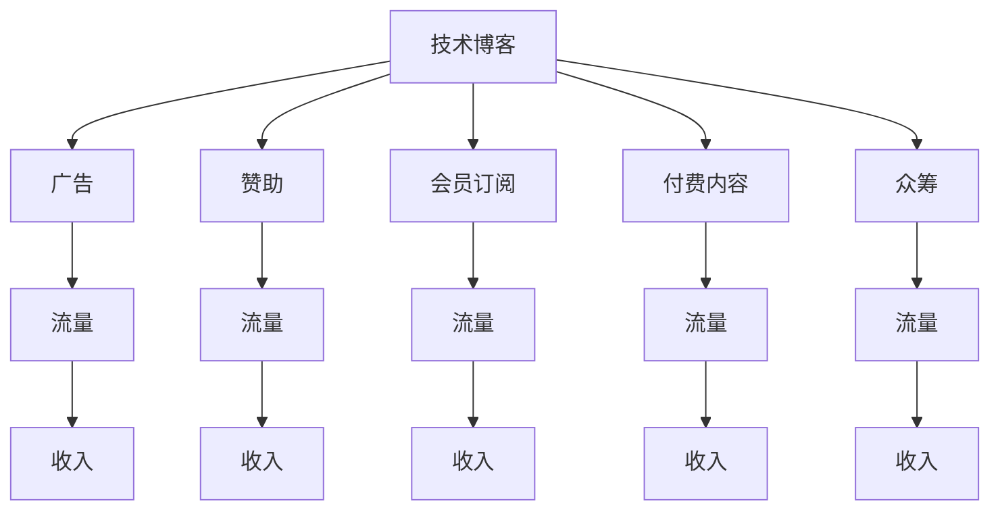

                 

# 程序员的被动收入：构建与维护

程序员的被动收入，即通过构建和维护技术产品或服务，实现无需直接投入劳动时间即可产生收益的财务模式。这一概念在近几年的数字经济浪潮中迅速崛起，成为越来越多技术人员探索的收入增长路径。本文将从背景介绍、核心概念、算法原理、具体实践、应用场景、工具资源以及总结展望等多个维度，全面剖析程序员如何构建并维护自己的被动收入，帮助读者掌握实现被动收入的关键步骤和策略。

## 1. 背景介绍

随着互联网和数字技术的快速发展，全球范围内的技术创新和商业应用愈发紧密地融合在一起。程序员作为数字时代的关键人才，不仅限于传统的软件开发和系统运维，更通过创造和迭代互联网产品，实现收入的多元化。被动收入的兴起，正是技术创新的产物，让程序员能够实现财富的积累和增长。

### 1.1 问题的由来
程序员长期以来面临着薪资天花板的问题，特别是随着技术的快速发展，高级技术人才的薪资增长速度明显低于行业平均水平。此外，过度依赖单一雇主和全职工作的模式，使得技术人员的职业发展面临较大的不确定性。

随着共享经济和自由职业模式的发展，程序员开始探索通过技术产品或服务实现被动收入。比如，开发开源项目获得社区支持，创建技术博客获得广告收入，开发商业软件通过销售或订阅获取持续收益。这些新型的收入模式不仅拓宽了程序员的职业路径，还提供了更为灵活和可持续的经济来源。

### 1.2 问题核心关键点
实现被动收入的关键在于以下几个方面：
1. 技术产品或服务的创新与优化，以吸引和维持用户群体。
2. 高质量内容的持续输出，如高质量的技术博客、开源项目、商业应用等。
3. 有效的商业变现策略，如广告、订阅、销售等。
4. 对市场的敏锐洞察，把握技术趋势和用户需求。
5. 良好的用户社区和客户关系管理，提升用户粘性和品牌忠诚度。

这些关键点构成了程序员构建与维护被动收入的核心框架。

## 2. 核心概念与联系

### 2.1 核心概念概述

为更好地理解程序员构建与维护被动收入的原理和流程，本节将介绍几个关键概念：

- **被动收入（Passive Income）**：无需直接投入劳动时间，仅通过技术产品或服务的持续运营获得的收入。
- **技术博客（Tech Blog）**：通过撰写高质量的技术博客，吸引流量，并通过广告、赞助、会员订阅等方式获取收益。
- **开源项目（Open Source Project）**：开发并维护开源软件，通过社区支持、捐赠、赞助等方式实现收益。
- **商业软件（Commercial Software）**：开发并销售或提供订阅服务，如SaaS应用、桌面软件等。
- **技术服务（Tech Services）**：提供技术咨询、培训、维护等服务，实现稳定的客户收入。

这些概念之间的联系紧密，构成了一个完整的程序员被动收入生态系统。

### 2.2 核心概念原理和架构的 Mermaid 流程图



该流程图展示了技术博客如何通过多种变现方式获得收入，即流量吸引和变现的过程。被动收入的生成，离不开高质量内容的吸引和有效的变现手段。

## 3. 核心算法原理 & 具体操作步骤

### 3.1 算法原理概述

程序员构建与维护被动收入的过程，本质上是一种基于互联网和数字技术的产品或服务迭代与变现。这一过程的核心算法原理如下：

1. **产品或服务设计**：针对特定用户需求，设计和开发技术产品或服务。
2. **内容创作与迭代**：定期发布高质量内容，如技术博客、开源项目代码、软件功能更新等。
3. **用户获取与转化**：通过各种营销手段，吸引用户访问和使用产品或服务，并将其转化为付费客户。
4. **客户维护与复购**：通过持续的服务和内容更新，提升用户满意度，实现客户留存和复购。
5. **收入变现**：通过广告、赞助、订阅、销售等方式实现收入。

### 3.2 算法步骤详解

基于以上核心算法原理，程序员构建与维护被动收入的一般步骤包括：

**Step 1: 确定目标与方向**
- 明确被动收入目标，如实现年收益X万元。
- 分析自身优势和资源，确定技术产品或服务方向，如技术博客、开源项目、商业软件等。

**Step 2: 设计与开发**
- 根据市场需求，设计和开发技术产品或服务。
- 确保产品或服务的稳定性和高质量，以便吸引和维持用户。

**Step 3: 内容创作与发布**
- 定期创作高质量内容，如博客文章、开源代码、软件更新等。
- 在各大平台发布内容，吸引流量。

**Step 4: 营销与推广**
- 通过社交媒体、SEO优化、内容营销等方式吸引潜在用户。
- 针对目标用户群体，进行定向推广。

**Step 5: 用户获取与转化**
- 设计转化漏斗，引导用户完成注册、试用、付费等步骤。
- 提供优惠政策，如免费试用、首次购买优惠等。

**Step 6: 客户维护与复购**
- 定期更新产品或服务，提供新功能或改进用户体验。
- 关注用户反馈，及时解决用户问题。

**Step 7: 收入变现**
- 选择合适的变现方式，如广告、订阅、销售等。
- 监控收入来源，进行优化和调整。

### 3.3 算法优缺点

基于互联网与数字技术的被动收入构建与维护，具有以下优缺点：

#### 优点
1. **灵活性和自由度**：可随时调整策略和方向，适应市场变化。
2. **多元化收入来源**：通过多个产品或服务，分散风险。
3. **潜在收入增长**：随着用户基数的增加，收入有持续增长潜力。

#### 缺点
1. **初期投入较大**：可能需要较长时间和资金投入，才能看到收益。
2. **持续维护要求高**：产品或服务需要不断更新迭代，以保持用户兴趣和市场竞争力。
3. **市场竞争激烈**：技术领域变化迅速，需时刻关注市场动态，保持创新。

### 3.4 算法应用领域

被动收入构建与维护的算法原理，适用于多个应用领域，如：

- **技术博客与内容平台**：通过撰写技术博客，吸引流量，并实现广告、赞助、会员订阅等方式变现。
- **开源项目与社区**：开发并维护开源项目，通过社区支持、捐赠、赞助等方式获得收益。
- **商业软件与SaaS**：开发并销售商业软件，或提供SaaS服务，实现持续订阅收入。
- **技术咨询服务**：提供技术咨询、培训、维护等服务，获得稳定的客户收入。

## 4. 数学模型和公式 & 详细讲解 & 举例说明

### 4.1 数学模型构建

为更好地量化和分析程序员被动收入构建的过程，本节将构建一个简化的数学模型。

假设技术产品或服务的月活跃用户数为 $U_t$，用户转化率为 $C_t$，每次使用费用为 $P_t$，用户复购率为 $R_t$，则月收入 $I_t$ 可以表示为：

$$
I_t = U_t \times C_t \times P_t \times R_t
$$

其中：
- $U_t$：月活跃用户数
- $C_t$：用户转化率
- $P_t$：每次使用费用
- $R_t$：用户复购率

### 4.2 公式推导过程

以技术博客为例，假设博客每月访问量为 $V$，广告收入为 $A$，赞助收入为 $S$，会员订阅收入为 $M$，众筹收入为 $F$。则月收入 $I$ 可表示为：

$$
I = A + S + M + F
$$

其中：
- $A$：广告收入
- $S$：赞助收入
- $M$：会员订阅收入
- $F$：众筹收入

以技术博客广告收入的计算为例，假设平均点击率为 $C$，每次点击费用为 $P$，则月广告收入 $A$ 可表示为：

$$
A = V \times C \times P
$$

### 4.3 案例分析与讲解

**案例分析：一个开源项目的被动收入构建**

假设一个开源项目每月活跃用户数为5万，用户转化率为10%，用户复购率为30%，每次使用费用为1元。根据以上数学模型，可以计算出该项目的月收入：

$$
I = 50000 \times 0.1 \times 1 \times 0.3 = 15000
$$

即每月通过开源项目的用户贡献可以获得1.5万元的被动收入。

## 5. 项目实践：代码实例和详细解释说明

### 5.1 开发环境搭建

为了构建和维护技术产品或服务，程序员需要具备一定的开发环境和工具支持。以下是一个典型的开发环境搭建流程：

1. 安装Python和必要的依赖包：
```bash
pip install numpy pandas flask django
```

2. 搭建开发服务器：
```bash
gunicorn --bind 0.0.0.0:8000 myapp.wsgi
```

3. 部署项目：
```bash
gunicorn --bind 0.0.0.0:8000 myapp.wsgi
```

4. 安装必要的监控工具：
```bash
pip install django-debug-toolbar
```

### 5.2 源代码详细实现

以下是一个简单的技术博客示例，使用Flask框架实现：

```python
from flask import Flask, render_template, request
import logging

app = Flask(__name__)

@app.route('/')
def index():
    return render_template('index.html')

@app.route('/post', methods=['POST'])
def create_post():
    title = request.form.get('title')
    content = request.form.get('content')
    logging.info(f'New post created: {title}')

    return render_template('post.html', title=title, content=content)

if __name__ == '__main__':
    app.run(debug=True)
```

### 5.3 代码解读与分析

**代码解读**：
- 引入Flask框架，定义一个简单的应用程序。
- 主页路由，渲染index.html模板。
- 创建帖子路由，接收POST请求，并记录日志。
- 运行应用程序。

**分析**：
- Flask框架简单高效，易于快速搭建Web应用。
- 使用HTML模板渲染，提高了前端页面的可维护性。
- 日志记录功能，帮助开发者追踪应用运行状态。

### 5.4 运行结果展示

运行上述代码后，可以通过浏览器访问`http://localhost:5000`查看主页，并尝试提交博客帖子。

## 6. 实际应用场景

### 6.1 开源项目与社区

开源项目通过提供高质量、自由可用的软件，吸引全球开发者和用户。开发者通过贡献代码、修复漏洞、提交测试用例等方式参与社区，获得社区的认可和支持。用户则通过使用开源软件，享受技术红利和免费服务。

### 6.2 技术博客与内容平台

技术博客通过撰写高质量的技术文章，吸引读者，并通过广告、赞助、会员订阅等方式实现收益。博客内容不仅有助于个人品牌建设，还能为社区贡献有价值的信息。

### 6.3 商业软件与SaaS

商业软件通过销售许可证、提供订阅服务等方式实现收益。SaaS应用则通过按需付费的机制，实现稳定的收入流。

### 6.4 技术咨询服务

技术咨询服务通过提供定制化的技术方案和实施服务，实现长期的客户关系和收入。

## 7. 工具和资源推荐

### 7.1 学习资源推荐

为了帮助程序员系统掌握被动收入构建与维护的技术和策略，本节推荐以下学习资源：

1. **《编程：与浏览器之外的世界交流》（Programming: The Interconnected Mesh）**：深入浅出地介绍了网络编程、Web开发、Web安全等基础知识，是构建技术产品或服务的基础。
2. **《程序员开发生态系统》（The Pragmatic Programmer）**：系统讲解了软件开发生命周期的各个阶段，提供了实用的编程技巧和策略。
3. **《Web开发实战》（Web Development with Flask）**：详细介绍了Flask框架的使用方法和实践技巧，适合快速搭建Web应用。
4. **《开源软件的艺术》（The Art of Open Source）**：介绍了开源项目的维护和社区管理，帮助开发者构建和维护开源项目。

### 7.2 开发工具推荐

高效的工具支持是程序员构建与维护被动收入的重要保障。以下推荐几款常用工具：

1. **Git**：版本控制工具，支持分布式协作，适合开源项目和多人开发。
2. **Docker**：容器化平台，支持跨平台部署，便于技术产品或服务的快速迭代和发布。
3. **GitHub**：代码托管平台，支持代码提交、版本控制、项目协作等，是开源项目的理想选择。
4. **GitLab**：与GitHub类似，支持持续集成、持续部署等高级功能，适合团队协作。

### 7.3 相关论文推荐

以下几篇论文代表了大规模开源项目和被动收入构建领域的最新研究进展，推荐阅读：

1. **《大规模分布式协作系统》（Large-Scale Collaborative System）**：介绍了大规模开源项目的维护和管理策略，提供了丰富的实践经验。
2. **《开源社区动态研究》（Open Source Community Dynamics）**：研究开源项目的社区行为和合作模式，揭示了开源社区的运作机制。
3. **《Web应用程序性能优化》（Web Application Performance Optimization）**：介绍了Web应用性能优化的技术和策略，帮助开发者提升应用效率。

## 8. 总结：未来发展趋势与挑战

### 8.1 总结

本文详细介绍了程序员如何通过构建和维护技术产品或服务，实现被动收入的生成。从背景介绍、核心概念、算法原理到具体实践，从学习资源、开发工具到相关论文，全面剖析了程序员构建与维护被动收入的全过程。通过本文的系统梳理，可以看到，被动收入的构建不仅需要技术实力，还需要市场洞察和商业策略。程序员在构建被动收入的过程中，需要不断学习和实践，才能实现理想的效果。

### 8.2 未来发展趋势

展望未来，程序员构建与维护被动收入将呈现以下几个趋势：

1. **人工智能与自动化**：借助人工智能和自动化技术，提升产品或服务的智能化和自动化水平，降低人工成本。
2. **用户参与与协同**：利用用户反馈和社区协作，实现产品或服务的快速迭代和优化。
3. **区块链与去中心化**：区块链技术为开源项目和社区提供了新的管理和维护方式，提高了透明度和信任度。
4. **新兴技术与应用**：如云计算、大数据、物联网等新兴技术，将为技术产品或服务带来新的应用场景和商业机会。

### 8.3 面临的挑战

尽管被动收入构建与维护在技术和策略上取得了一定的进展，但仍面临诸多挑战：

1. **市场竞争激烈**：技术领域的快速变化和激烈竞争，要求程序员持续学习和创新，保持市场竞争力。
2. **用户获取与留存**：高质量产品的需求和市场教育成本，增加了用户获取和留存的难度。
3. **技术平台选择**：选择适合的技术平台和工具，需要综合考虑性能、可扩展性、成本等因素。
4. **安全与隐私**：用户数据和隐私保护成为重要课题，程序员需要重视数据安全技术的应用。

### 8.4 研究展望

未来，程序员构建与维护被动收入的研究将集中在以下几个方向：

1. **持续集成与部署（CI/CD）**：提升开发效率和代码质量，加速产品迭代和发布。
2. **区块链技术的应用**：利用区块链的透明和不可篡改特性，提升开源项目和社区的管理水平。
3. **自动化测试与监控**：利用自动化测试和监控工具，提高产品或服务的稳定性和可靠性。
4. **用户体验设计与优化**：通过用户研究和技术手段，提升产品或服务的用户体验，增加用户粘性。

## 9. 附录：常见问题与解答

**Q1：程序员如何平衡工作与被动收入构建？**

A: 平衡工作与被动收入构建的关键在于时间管理和任务优先级。可以采用以下策略：
1. 制定详细的工作计划，明确每天的任务和目标。
2. 优先处理紧急且重要的任务，如日常工作、重要项目等。
3. 利用碎片时间，如通勤、午休等，进行被动收入相关的学习和开发。
4. 合理规划和分配时间，确保被动收入构建不影响主要工作。

**Q2：程序员如何选择合适的技术平台和工具？**

A: 选择适合的技术平台和工具需要考虑多个因素：
1. 平台功能和易用性：选择功能强大、易用性高的平台，降低开发难度。
2. 扩展性和可维护性：选择扩展性强、易于维护的平台，便于后续迭代和优化。
3. 成本和资源消耗：考虑平台的使用成本和资源消耗，确保经济可行。
4. 社区和生态支持：选择社区活跃、生态完善的平台，获取更多支持和资源。

**Q3：程序员如何提升技术博客的流量和用户粘性？**

A: 提升技术博客的流量和用户粘性需要多方面的努力：
1. 提供高质量内容：持续发布高质量的技术文章，满足读者需求。
2. 优化SEO策略：通过SEO优化提升博客在搜索引擎中的排名，吸引更多流量。
3. 互动与社区建设：建立博客评论和社区，增强与读者的互动，提升用户粘性。
4. 营销推广：利用社交媒体、邮件营销等方式，扩大博客影响力。

---

作者：禅与计算机程序设计艺术 / Zen and the Art of Computer Programming

