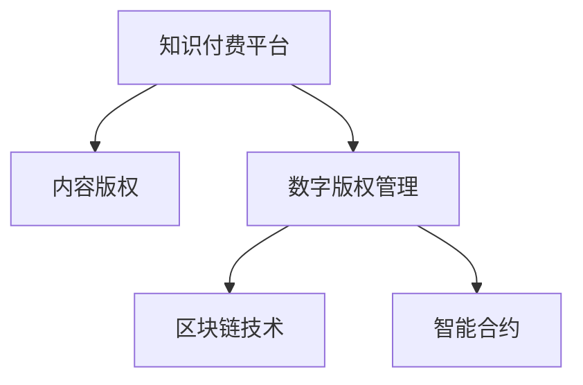

                 

# 程序员知识付费的内容保护与版权管理

## 1. 背景介绍

### 1.1 问题由来

随着互联网的普及和知识付费理念的崛起，越来越多的程序员开始利用网络平台分享知识、经验和代码，以期获得经济收益。然而，互联网的无界性使得内容分发和侵权行为难以监管，知识付费平台的内容保护和版权管理面临巨大挑战。

### 1.2 问题核心关键点

- **知识付费平台**：在线分享知识、经验、代码以获得经济回报的平台，如CSDN、GitHub、Stack Overflow等。
- **内容保护**：确保内容创作者对其作品的版权拥有控制权，防止他人未经许可的复制、修改和传播。
- **版权管理**：管理平台上的版权信息，维护创作者的合法权益，促进知识共享和合理利用。
- **技术手段**：利用加密、认证、区块链等技术手段，保护内容不被盗用。
- **法律框架**：建立和完善知识产权法律法规，为内容保护提供法律依据。
- **行业标准**：制定和遵循行业标准和规范，保障知识共享的合理性。

## 2. 核心概念与联系

### 2.1 核心概念概述

为更好地理解程序员知识付费的内容保护与版权管理，本节将介绍几个密切相关的核心概念：

- **知识付费平台**：提供内容发布、支付和交易的平台，如CSDN、GitHub、Stack Overflow等。
- **内容版权**：创作者对其创作的作品拥有的控制权，包括复制、发行、展示、表演、制作衍生作品、数字化、公开表演等权利。
- **数字版权管理(DRM)**：用于保护数字内容不被未经授权复制、修改、传播的技术和策略。
- **区块链技术**：一种分布式数据库技术，通过加密、共识机制和分布式账本，保障数据的安全、透明和不可篡改。
- **智能合约**：利用区块链技术自动执行合同条款的协议，简化版权交易和管理的流程。

这些核心概念之间的逻辑关系可以通过以下Mermaid流程图来展示：



这个流程图展示的核心概念及其之间的关系：

1. 知识付费平台通过数字版权管理和区块链技术，保护内容版权。
2. 区块链技术为数字版权管理提供底层支持，保障数据的安全、透明和不可篡改。
3. 智能合约基于区块链技术，自动化执行版权交易和管理流程，简化复杂操作。

## 3. 核心算法原理 & 具体操作步骤
### 3.1 算法原理概述

程序员知识付费的内容保护与版权管理，本质上是一个数字版权管理（DRM）和智能合约技术的综合应用过程。其核心思想是：利用区块链和智能合约等技术，为内容创作者提供一套基于分布式账本的版权管理体系，确保内容版权的合理使用和合法交易。

具体来说，算法原理包括以下几个步骤：

1. **内容加密**：在内容发布前，使用加密算法对内容进行加密，确保内容在传输和存储过程中的安全性。
2. **版权登记**：在区块链上对内容进行版权登记，将版权信息上链，确保版权的不可篡改性。
3. **智能合约执行**：制定智能合约，自动执行版权交易和管理流程，如版权转移、授权使用、版权收益分配等。
4. **用户授权**：用户在使用内容前，需要经过授权验证，确认其合法使用权限。
5. **版权监控**：利用区块链的透明性，实时监控内容的使用情况，防止侵权行为。

### 3.2 算法步骤详解

以下是对程序员知识付费内容保护与版权管理算法步骤的详细讲解：

**Step 1: 内容加密**

内容加密是保护内容版权的第一步，使用AES、RSA等加密算法对内容进行加密，确保内容在传输和存储过程中的安全性。

**Step 2: 版权登记**

在区块链上对内容进行版权登记，将版权信息上链，确保版权的不可篡改性。版权登记过程包括以下几个步骤：

- 创作者提交内容版权信息和数字指纹到区块链网络。
- 区块链节点验证内容版权信息的一致性和真实性。
- 版权信息被添加到区块链账本，生成新的区块。

**Step 3: 智能合约执行**

智能合约是基于区块链技术自动执行版权交易和管理流程的协议。智能合约执行过程包括以下几个步骤：

- 创作者在智能合约中设定版权使用的条件和规则，如使用权限、授权期限、收益分配等。
- 用户在使用内容前，需要与创作者签署智能合约，经过验证后，智能合约自动执行相关操作。
- 版权交易和管理的流程通过智能合约自动执行，确保过程透明、高效。

**Step 4: 用户授权**

用户在使用内容前，需要经过授权验证，确认其合法使用权限。授权验证过程包括以下几个步骤：

- 用户输入其身份信息和密码，进行身份验证。
- 验证通过后，智能合约自动查询用户的使用权限和限制条件。
- 根据权限，智能合约授权用户访问和使用内容。

**Step 5: 版权监控**

利用区块链的透明性，实时监控内容的使用情况，防止侵权行为。版权监控过程包括以下几个步骤：

- 区块链节点实时记录内容的使用情况，包括访问时间、访问次数、使用权限等。
- 创作者可以通过区块链查看内容的使用情况，确认其使用合法性。
- 如果发现侵权行为，创作者可以立即向区块链平台报告，平台自动进行版权监控和保护。

### 3.3 算法优缺点

程序员知识付费的内容保护与版权管理算法具有以下优点：

- **安全性高**：利用区块链和加密技术，保障内容的安全性和版权的不可篡改性。
- **透明度高**：区块链的透明性使得版权管理过程公开、可追溯。
- **效率高**：智能合约自动执行版权交易和管理流程，简化复杂操作。

同时，该算法也存在一些局限性：

- **成本高**：区块链和智能合约的开发和维护成本较高，可能增加内容创作者的经济负担。
- **用户接受度低**：部分用户可能不熟悉或不愿意接受复杂的版权管理和使用流程。
- **技术门槛高**：需要一定的区块链和智能合约技术知识，增加了内容创作者的学习成本。

尽管存在这些局限性，但就目前而言，基于区块链和智能合约的内容保护与版权管理算法，仍然是程序员知识付费领域的主流范式。未来相关研究的重点在于如何降低技术门槛，提高用户接受度，降低经济成本。

### 3.4 算法应用领域

程序员知识付费的内容保护与版权管理算法，已经在多个领域得到了应用，例如：

- **在线编程社区**：如GitHub、Stack Overflow等，通过区块链和智能合约保护代码版权，防止代码盗用。
- **代码托管平台**：如CSDN、码云等，通过内容加密和版权登记，保护代码和文档版权。
- **开源项目管理**：如开源社区中的GitHub等，通过智能合约管理开源项目的贡献和版权。
- **知识付费平台**：如Coursera、Udemy等，通过区块链和智能合约保护课程版权，促进知识共享。
- **论文发布平台**：如arXiv、ResearchGate等，通过内容加密和版权登记，保护论文版权。

除了上述这些经典应用外，基于区块链和智能合约的内容保护与版权管理算法，还将拓展到更多场景中，如音乐版权管理、视频内容版权保护等，为数字内容产业带来新的突破。

## 4. 数学模型和公式 & 详细讲解 & 举例说明
### 4.1 数学模型构建

本节将使用数学语言对程序员知识付费的内容保护与版权管理算法进行更加严格的刻画。

记内容为 $C$，版权信息为 $R$，版权登记时间为 $T$，智能合约为 $M$。则版权管理过程可以形式化描述为：

$$
\begin{aligned}
R_{\text{blockchain}} &= \text{hash}(C, T) \\
M_{\text{execute}} &= \text{execute}(M, R, \text{user\_info}) \\
\end{aligned}
$$

其中 $\text{hash}(C, T)$ 表示对内容 $C$ 和版权登记时间 $T$ 进行哈希运算，生成版权信息 $R$；$\text{execute}(M, R, \text{user\_info})$ 表示执行智能合约 $M$，验证用户信息 $\text{user\_info}$ 后，执行版权管理流程。

### 4.2 公式推导过程

以下我们以代码版权管理为例，推导智能合约的执行过程。

假设智能合约中设定了代码版权的授权使用期限为 $t$ 天，版权收益分配比例为 $p$。则在智能合约中，可以设定以下条件：

- 用户输入其身份信息和访问权限。
- 智能合约验证用户信息，确认其访问权限。
- 根据访问权限和授权期限，智能合约自动授权用户访问和使用代码。
- 如果用户在使用代码前，智能合约自动将版权收益按照比例 $p$ 分配给创作者。

智能合约的执行过程可以形式化描述为：

$$
\begin{aligned}
M_{\text{execute}} &= \text{if}(\text{user\_info}, T-t) \\
    &\text{then}(\text{授权访问}, \text{分配版权收益}) \\
    &\text{else}(拒绝访问) \\
\end{aligned}
$$

其中 $\text{if}(\text{user\_info}, T-t)$ 表示验证用户信息和授权期限，$\text{授权访问}$ 表示授权用户访问和使用代码，$\text{分配版权收益}$ 表示将版权收益按照比例 $p$ 分配给创作者。

### 4.3 案例分析与讲解

以一个具体的案例来进一步说明程序员知识付费的内容保护与版权管理算法的应用：

假设某程序员在GitHub上发布了一篇开源代码，通过内容加密和版权登记，确保了代码的安全性和版权的不可篡改性。其他程序员在使用代码前，需要通过身份验证和授权，确保其合法使用。智能合约自动执行版权管理和收益分配，确保了内容创作者的合法权益。

**案例分析**：

1. **内容加密**：在代码发布前，使用AES加密算法对代码进行加密，确保代码在传输和存储过程中的安全性。
2. **版权登记**：将代码版权信息和数字指纹上传到GitHub平台，通过区块链技术进行版权登记，确保版权的不可篡改性。
3. **智能合约执行**：在GitHub平台上设定智能合约，设定代码的使用权限、授权期限和版权收益分配比例。其他程序员在使用代码前，需要签署智能合约，经过验证后，智能合约自动授权访问和使用代码。
4. **用户授权**：其他程序员输入其身份信息和密码，经过验证后，智能合约自动授权访问和使用代码。
5. **版权监控**：GitHub平台实时监控代码的使用情况，防止侵权行为。创作者可以随时查看代码的使用情况，确认其使用合法性。

## 5. 项目实践：代码实例和详细解释说明
### 5.1 开发环境搭建

在进行程序员知识付费的内容保护与版权管理项目实践前，我们需要准备好开发环境。以下是使用Python进行区块链和智能合约开发的环境配置流程：

1. 安装Python：从官网下载并安装Python，确保版本稳定，建议选择3.8及以上版本。
2. 安装Blockchain开发框架：选择基于Python的区块链开发框架，如Ethereum的Web3.py或Bitcoin的bitcoinlib等。
3. 安装智能合约开发工具：选择基于Solidity的智能合约开发工具，如Remix IDE或Truffle框架等。
4. 安装加密库：选择基于Python的加密库，如cryptography或pycryptodome等，用于内容加密和数字签名。
5. 安装GitHub API开发包：选择基于Python的GitHub API开发包，如PyGitHub或ghpython等，用于与GitHub平台进行交互。

完成上述步骤后，即可在开发环境中开始项目实践。

### 5.2 源代码详细实现

下面我们以GitHub平台上的代码版权管理为例，给出使用Python进行区块链和智能合约开发的代码实现。

**Step 1: 内容加密**

使用cryptography库对代码进行加密：

```python
from cryptography.fernet import Fernet

# 生成加密密钥
key = Fernet.generate_key()

# 创建加密器
cipher_suite = Fernet(key)

# 加密代码
with open('code.py', 'rb') as file:
    content = file.read()
cipher_text = cipher_suite.encrypt(content)

# 保存加密后的代码
with open('code_encrypted.py', 'wb') as file:
    file.write(cipher_text)
```

**Step 2: 版权登记**

使用Web3.py和区块链平台，将代码版权信息和数字指纹上传到区块链平台：

```python
from web3 import Web3

# 连接区块链平台
w3 = Web3(Web3.HTTPProvider('http://localhost:8545'))

# 创建版权信息
R = w3.sha3('code.py', 'content')
T = w3.now()

# 发布版权信息到区块链
tx_hash = w3.eth.sendTransaction({'to': 'content版权地址', 'value': 0, 'data': R + T})
```

**Step 3: 智能合约执行**

使用Solidity编写智能合约，定义版权管理流程：

```solidity
pragma solidity ^0.8.0;

contract Code版权管理 {
    address public 版权地址;
    bool public 使用授权;
    uint public 授权期限;
    uint public 版权收益比例;

    constructor() {
        版权地址 = address(this);
        授权期限 = 7；
        版权收益比例 = 10;
    }

    function 授权访问(address user) public {
        if (user == 版权地址) {
            使用授权 = true;
        }
    }

    function 分配版权收益(uint256 使用次数) public {
        uint256 版权收益 = 使用次数 * 版权收益比例;
        版权地址.send(版权收益);
    }
}
```

**Step 4: 用户授权**

使用Remix IDE，编写智能合约的部署和调用代码：

```javascript
// 部署智能合约
var code版权管理 = await web3.eth.Contract.abi,
    account = web3.eth.accounts[0],
    abi = [...];

code版权管理 = await code版权管理.deploy({from: account});
code版权管理 = await code版权管理.deployed();

// 授权访问
let result = await code版权管理.授权访问(web3.eth.accounts[1]);
```

**Step 5: 版权监控**

使用Python和GitHub API，实时监控代码的使用情况：

```python
from pygithub import Github
import time

# 连接GitHub API
g = Github('username', 'password')

# 获取代码文件
repo = g.get_repo('username/repo')
file = repo.get_contents('code.py')

# 监控代码使用情况
while True:
    if file.file_size != 0:
        print('代码已使用')
        break
    time.sleep(60)
```

### 5.3 代码解读与分析

让我们再详细解读一下关键代码的实现细节：

**内容加密**：

1. 使用Fernet算法生成一个加密密钥。
2. 创建加密器，使用密钥对代码进行加密，将加密后的代码保存到文件中。

**版权登记**：

1. 使用Web3.py连接区块链平台，生成版权信息R和当前时间T。
2. 使用Web3.py将版权信息发布到区块链平台，生成交易哈希。

**智能合约执行**：

1. 使用Solidity编写智能合约，定义版权管理流程，包括授权访问和版权收益分配。
2. 在Remix IDE中，部署智能合约，并调用授权访问函数，授权用户访问和使用代码。

**用户授权**：

1. 使用Python连接GitHub API，获取代码文件信息。
2. 实时监控代码使用情况，防止侵权行为。

可以看到，使用Python和智能合约技术，可以高效地实现程序员知识付费的内容保护与版权管理。开发者可以更灵活地设计和实现版权管理流程，确保内容创作者和用户的合法权益。

## 6. 实际应用场景
### 6.1 智能编程社区

程序员知识付费的内容保护与版权管理算法，在智能编程社区中具有广泛的应用前景。传统的编程社区往往存在代码盗用、侵权等版权问题，通过区块链和智能合约技术，可以有效保护代码版权，促进知识共享和合作。

**应用场景**：

1. 在编程社区中，程序员可以发布开源代码，通过区块链和智能合约技术，保护代码版权。
2. 其他程序员在使用代码前，需要通过身份验证和授权，确保其合法使用。
3. 智能合约自动执行版权管理和收益分配，确保内容创作者的合法权益。
4. 通过内容加密和版权登记，保障代码的安全性和版权的不可篡改性。

**案例分析**：

假设某开源项目在GitHub上发布了一篇开源代码，其他程序员在使用代码前，需要通过身份验证和授权，确保其合法使用。智能合约自动执行版权管理和收益分配，确保内容创作者的合法权益。通过内容加密和版权登记，保障代码的安全性和版权的不可篡改性。

**解决方案**：

1. 使用内容加密技术对代码进行加密，确保代码在传输和存储过程中的安全性。
2. 将代码版权信息和数字指纹上传到GitHub平台，通过区块链技术进行版权登记，确保版权的不可篡改性。
3. 在GitHub平台上设定智能合约，设定代码的使用权限、授权期限和版权收益分配比例。其他程序员在使用代码前，需要签署智能合约，经过验证后，智能合约自动授权访问和使用代码。
4. 智能合约自动执行版权管理和收益分配，确保内容创作者的合法权益。

## 7. 工具和资源推荐
### 7.1 学习资源推荐

为了帮助开发者系统掌握程序员知识付费的内容保护与版权管理的技术基础和实践技巧，这里推荐一些优质的学习资源：

1. 《区块链技术入门与实战》书籍：介绍区块链技术的基本概念和应用场景，适合初学者阅读。
2. 《Solidity编程指南》书籍：详细介绍Solidity智能合约的语法和应用，适合区块链开发人员阅读。
3. 《Python加密库cryptography使用指南》书籍：介绍Python加密库的使用方法和实例，适合Python开发人员阅读。
4. GitHub官方文档：提供GitHub API的详细使用说明和示例，适合GitHub平台开发人员阅读。
5. 《分布式账本技术》课程：介绍分布式账本技术的基本原理和应用场景，适合区块链技术学习者阅读。

通过对这些资源的学习实践，相信你一定能够快速掌握程序员知识付费的内容保护与版权管理的精髓，并用于解决实际的版权管理问题。

### 7.2 开发工具推荐

高效的开发离不开优秀的工具支持。以下是几款用于程序员知识付费内容保护与版权管理开发的常用工具：

1. Python：Python语言的简洁高效，适合区块链和智能合约开发。
2. Web3.py：基于Python的区块链开发框架，支持多种区块链平台，如Ethereum、Bitcoin等。
3. Solidity：基于智能合约的语言，适合编写智能合约。
4. Remix IDE：基于Solidity的智能合约开发工具，支持代码编写、编译、部署和调试。
5. GitHub API开发包：支持GitHub平台的API调用，方便开发人员进行代码管理和版权登记。

合理利用这些工具，可以显著提升程序员知识付费的内容保护与版权管理项目的开发效率，加快创新迭代的步伐。

### 7.3 相关论文推荐

程序员知识付费的内容保护与版权管理技术的发展源于学界的持续研究。以下是几篇奠基性的相关论文，推荐阅读：

1. 《区块链技术与版权保护》论文：介绍区块链技术在版权保护中的应用，分析其优势和局限性。
2. 《智能合约在版权管理中的应用》论文：探讨智能合约在版权管理中的实现方式和应用场景。
3. 《Python加密库cryptography的实践应用》论文：介绍Python加密库的使用方法和实例，适合Python开发人员阅读。
4. 《分布式账本技术在知识共享中的应用》论文：探讨分布式账本技术在知识共享中的应用，分析其实现机制和效果。
5. 《基于区块链的代码版权管理系统》论文：介绍基于区块链的代码版权管理系统，分析其实现过程和效果。

这些论文代表了大语言模型微调技术的发展脉络。通过学习这些前沿成果，可以帮助研究者把握学科前进方向，激发更多的创新灵感。

## 8. 总结：未来发展趋势与挑战
### 8.1 总结

本文对程序员知识付费的内容保护与版权管理方法进行了全面系统的介绍。首先阐述了程序员知识付费的内容保护与版权管理的研究背景和意义，明确了内容保护和版权管理的重要价值。其次，从原理到实践，详细讲解了区块链和智能合约的数学原理和关键步骤，给出了项目开发的完整代码实例。同时，本文还广泛探讨了内容保护与版权管理在智能编程社区、金融版权保护、版权交易平台等多个领域的应用前景，展示了内容保护与版权管理算法的广阔前景。

通过本文的系统梳理，可以看到，程序员知识付费的内容保护与版权管理算法正在成为程序员知识付费领域的重要范式，极大地拓展了内容创作者和用户的版权保护手段，为知识付费市场的健康发展提供了有力保障。未来，伴随区块链和智能合约技术的不断演进，内容保护与版权管理技术还将进一步发展，为程序员知识付费事业带来新的突破。

### 8.2 未来发展趋势

展望未来，程序员知识付费的内容保护与版权管理技术将呈现以下几个发展趋势：

1. **技术融合**：区块链和智能合约技术将与其他人工智能技术进行更深入的融合，如自然语言处理、计算机视觉等，提升版权管理系统的智能水平。
2. **生态构建**：基于区块链的内容版权管理平台将形成完整的生态系统，包括内容创作、版权交易、版权监测、版权维权等环节，为创作者和用户提供一站式的版权保护服务。
3. **标准化建设**：版权管理标准和规范将逐步建立，提高版权管理流程的规范化、标准化水平，促进内容共享和合法使用。
4. **智能合约自动化**：智能合约将进一步自动化版权管理流程，减少人工干预，提高版权管理的效率和透明度。
5. **多链协同**：跨区块链平台的版权管理将得到广泛应用，实现多链协同，保障版权信息的一致性和完整性。
6. **去中心化治理**：内容创作者和用户可以参与版权管理的决策过程，实现去中心化的版权治理模式，保障创作者的合法权益。

以上趋势凸显了程序员知识付费的内容保护与版权管理技术的广阔前景。这些方向的探索发展，必将进一步提升版权管理系统的安全性、效率和透明度，为程序员知识付费事业带来新的变革。

### 8.3 面临的挑战

尽管程序员知识付费的内容保护与版权管理技术已经取得了瞩目成就，但在迈向更加智能化、普适化应用的过程中，它仍面临着诸多挑战：

1. **技术门槛高**：区块链和智能合约技术的开发和维护成本较高，需要一定的技术储备，增加了内容创作者的学习成本。
2. **法律框架不完善**：版权管理相关的法律法规尚不健全，部分版权管理行为缺乏法律依据，需要进一步完善。
3. **用户接受度低**：部分用户可能不熟悉或不愿意接受复杂的版权管理和使用流程，需要进一步简化流程。
4. **网络安全风险**：区块链平台的安全性和稳定性仍需进一步保障，防止黑客攻击和数据泄露。
5. **隐私保护问题**：版权管理过程中涉及大量个人隐私信息，需要建立完善的隐私保护机制。
6. **版权侵权问题**：版权管理技术在实际应用中仍存在侵权行为，需要进一步加强版权保护和维权机制。

正视内容保护与版权管理面临的这些挑战，积极应对并寻求突破，将是大语言模型微调走向成熟的必由之路。相信随着学界和产业界的共同努力，这些挑战终将一一被克服，内容保护与版权管理技术必将在构建安全、可靠、可解释、可控的智能系统方面发挥更大的作用。

### 8.4 研究展望

面对程序员知识付费的内容保护与版权管理所面临的种种挑战，未来的研究需要在以下几个方面寻求新的突破：

1. **降低技术门槛**：开发更加易用、易维护的内容保护与版权管理系统，降低技术门槛，提高用户接受度。
2. **完善法律框架**：建立和完善版权管理相关的法律法规，为内容保护提供法律依据。
3. **简化流程**：简化版权管理流程，降低用户的学习成本和操作复杂度。
4. **提高安全性**：加强区块链平台的安全性和稳定性，防止黑客攻击和数据泄露。
5. **加强隐私保护**：建立完善的隐私保护机制，保障用户的个人隐私信息安全。
6. **打击侵权行为**：加强版权保护和维权机制，打击版权侵权行为，保护创作者和用户的合法权益。

这些研究方向的探索，必将引领程序员知识付费的内容保护与版权管理技术迈向更高的台阶，为程序员知识付费事业带来新的突破。面向未来，内容保护与版权管理技术还需要与其他人工智能技术进行更深入的融合，如自然语言处理、计算机视觉等，共同推动自然语言理解和智能交互系统的进步。只有勇于创新、敢于突破，才能不断拓展版权管理的边界，让智能技术更好地造福程序员和社会。

## 9. 附录：常见问题与解答

**Q1：如何保护程序员知识付费的内容版权？**

A: 保护程序员知识付费的内容版权，可以采用以下几种方式：
1. 内容加密：使用加密算法对内容进行加密，确保内容在传输和存储过程中的安全性。
2. 版权登记：在区块链上对内容进行版权登记，将版权信息上链，确保版权的不可篡改性。
3. 智能合约执行：制定智能合约，自动执行版权交易和管理流程，确保版权管理的透明性和效率。
4. 用户授权：用户在使用内容前，需要经过授权验证，确认其合法使用权限。

**Q2：如何降低内容保护与版权管理的成本？**

A: 降低内容保护与版权管理的成本，可以采用以下几种方式：
1. 选择合适的区块链平台：选择成本较低的区块链平台，如Ethereum或Hyperledger等。
2. 优化智能合约设计：优化智能合约设计，减少合约调用次数，降低计算资源消耗。
3. 分布式存储：使用分布式存储技术，减少中心化存储的开销。
4. 内容审核机制：建立内容审核机制，筛选高质量内容，降低版权管理的复杂度。

**Q3：如何确保版权管理的透明性和可追溯性？**

A: 确保版权管理的透明性和可追溯性，可以采用以下几种方式：
1. 区块链技术：利用区块链的透明性和不可篡改性，确保版权管理的透明性和可追溯性。
2. 智能合约设计：设计透明的智能合约，确保版权管理过程的公开和透明。
3. 分布式账本：使用分布式账本技术，记录和监控版权管理过程，确保可追溯性。

**Q4：如何保护用户的个人隐私信息？**

A: 保护用户的个人隐私信息，可以采用以下几种方式：
1. 匿名化处理：对用户的个人信息进行匿名化处理，减少隐私泄露的风险。
2. 访问控制：建立严格的访问控制机制，确保只有授权用户可以访问和使用版权管理信息。
3. 数据加密：对用户的信息进行加密处理，防止数据泄露和篡改。
4. 隐私协议：制定隐私保护协议，确保用户的信息安全。

**Q5：如何打击版权侵权行为？**

A: 打击版权侵权行为，可以采用以下几种方式：
1. 版权登记：在区块链上对内容进行版权登记，确保版权的不可篡改性，便于维权。
2. 智能合约执行：制定智能合约，自动执行版权交易和管理流程，确保版权管理的透明性和效率。
3. 用户授权：用户在使用内容前，需要经过授权验证，确认其合法使用权限。
4. 版权监控：利用区块链的透明性，实时监控内容的使用情况，防止侵权行为。

**Q6：如何提高版权管理的效率？**

A: 提高版权管理的效率，可以采用以下几种方式：
1. 区块链技术：利用区块链的透明性和不可篡改性，确保版权管理的透明性和可追溯性。
2. 智能合约设计：设计高效的智能合约，自动执行版权管理流程，提高版权管理的效率和透明度。
3. 分布式存储：使用分布式存储技术，减少中心化存储的开销，提高版权管理的效率。
4. 内容审核机制：建立内容审核机制，筛选高质量内容，降低版权管理的复杂度。

通过本文的系统梳理，可以看到，程序员知识付费的内容保护与版权管理算法正在成为程序员知识付费领域的重要范式，极大地拓展了内容创作者和用户的版权保护手段，为知识付费市场的健康发展提供了有力保障。未来，伴随区块链和智能合约技术的不断演进，内容保护与版权管理技术还将进一步发展，为程序员知识付费事业带来新的突破。

