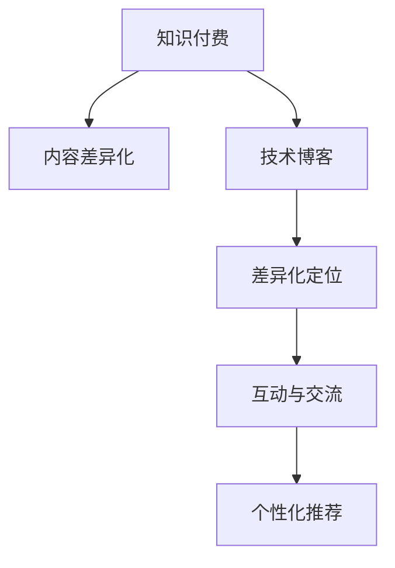

                 

# 程序员知识付费的内容差异化策略

> 关键词：知识付费, 差异化策略, 内容策略, 技术博客, 程序员, 专业成长, 学习资源

## 1. 背景介绍

### 1.1 问题由来

近年来，随着互联网技术的迅猛发展和知识经济的崛起，知识付费已成为引领行业潮流的新兴领域。程序员作为技术领域的重要群体，其知识积累和专业成长需求日益增强，知识付费市场随之蓬勃发展。然而，如何在这个竞争激烈的市场中脱颖而出，吸引并留住程序员群体，成为一个亟待解决的问题。

### 1.2 问题核心关键点

程序员知识付费的核心在于提供高质量、实用性强且贴合程序员实际需求的内容。具体而言，内容差异化策略的关键点包括：

1. **质量与深度**：内容应具有高专业性和实用性，能够解决程序员在实际工作中遇到的问题。
2. **差异化定位**：针对不同技术栈、不同经验水平的程序员，提供差异化的内容策略，满足多样化的需求。
3. **互动与交流**：鼓励用户参与互动，提供良好的交流平台，增强用户的参与感和忠诚度。
4. **个性化推荐**：利用算法推荐系统，提供个性化的内容推荐，提升用户体验和满意度。
5. **市场调研与反馈**：定期进行市场调研，收集用户反馈，及时调整内容策略，满足用户需求。

### 1.3 问题研究意义

探索和实施程序员知识付费的内容差异化策略，对于提升平台竞争力和用户体验具有重要意义：

1. 提升平台黏性：差异化内容能够吸引不同背景的程序员，增加平台的用户基数和活跃度。
2. 优化收益结构：通过个性化推荐和互动机制，增加用户粘性和消费频次，提升平台的盈利能力。
3. 促进专业成长：高质量内容能够帮助程序员快速提升技能，增强其在行业中的竞争力。
4. 加速行业发展：高质量的程序员培训和指导，有助于推动整个行业的发展和技术进步。
5. 满足多样化需求：通过差异化定位，更好地满足不同层次程序员的学习需求，促进教育公平。

## 2. 核心概念与联系

### 2.1 核心概念概述

为了更好地理解程序员知识付费的内容差异化策略，本节将介绍几个核心概念：

- **知识付费**：指用户为获取特定的知识或技能而支付费用的行为，涵盖书籍、课程、咨询等多种形式。
- **内容差异化**：指通过分析用户需求和行为，提供具有个性化、专业化和多样化特点的内容，满足不同用户的需求。
- **技术博客**：专业技术人员撰写的博客文章，通常涵盖技术分享、问题解答、实战经验等内容。
- **差异化定位**：根据用户的职业背景、技术水平、学习需求等因素，提供差异化的内容和服务。
- **互动与交流**：通过评论、问答、社区讨论等形式，增强用户之间的互动和交流，提升用户参与感。
- **个性化推荐**：利用算法技术，基于用户的历史行为和偏好，提供个性化的内容推荐。

这些核心概念之间的联系可以通过以下Mermaid流程图来展示：



这个流程图展示了知识付费与内容差异化策略之间的逻辑关系：

1. 知识付费的核心是提供高质量的内容。
2. 内容差异化策略通过分析用户需求，提供针对性的内容。
3. 技术博客是知识付费平台的重要内容形式之一。
4. 差异化定位确保内容能够满足不同用户群体的需求。
5. 互动与交流增强用户参与感，提升平台粘性。
6. 个性化推荐提高用户满意度，优化用户体验。

这些概念共同构成了程序员知识付费的内容差异化策略框架，为其有效实施提供了理论基础。

## 3. 核心算法原理 & 具体操作步骤
### 3.1 算法原理概述

程序员知识付费的内容差异化策略主要基于用户行为分析、内容推荐算法和互动交流平台等技术手段。其核心算法原理包括以下几个方面：

- **用户行为分析**：通过分析用户的访问记录、购买行为、学习进度等数据，了解用户的需求和偏好。
- **内容推荐算法**：利用协同过滤、基于内容的推荐、矩阵分解等算法，推荐用户感兴趣的内容。
- **互动交流平台**：构建论坛、问答社区、社交网络等平台，促进用户之间的交流和互动。

### 3.2 算法步骤详解

程序员知识付费的内容差异化策略实施步骤如下：

**Step 1: 用户行为数据收集与分析**
- 通过网站、APP等平台收集用户的行为数据，包括访问记录、浏览时间、购买记录等。
- 使用数据分析工具对数据进行清洗和预处理，提取有用的用户特征，如学习频率、热门主题等。
- 定期对用户行为进行分析，识别用户需求和偏好，形成用户画像。

**Step 2: 内容分类与标注**
- 对知识付费平台上的所有内容进行分类，如编程语言、框架、算法等。
- 对每个分类下的内容进行标注，如难度、实用性、用户评价等。
- 利用自然语言处理技术，提取内容的关键词和主题，建立内容库。

**Step 3: 内容推荐算法设计**
- 根据用户画像和内容库，设计个性化推荐算法。常用的算法包括协同过滤、基于内容的推荐、矩阵分解等。
- 利用机器学习模型训练推荐模型，如协同过滤模型、基于内容的推荐模型、神经网络模型等。
- 对推荐模型进行评估和调优，确保其能够准确地为用户推荐感兴趣的内容。

**Step 4: 互动交流平台构建**
- 开发社区论坛、问答系统、在线课程等互动平台，促进用户之间的交流和互动。
- 引入实时聊天、评论、点赞等互动机制，增强用户参与感。
- 定期举办技术交流会、编程比赛等活动，提升平台的活跃度和用户粘性。

**Step 5: 用户反馈与内容优化**
- 收集用户的反馈意见，包括内容推荐效果、平台功能、学习效果等。
- 根据用户反馈，及时调整内容策略和推荐算法，优化用户体验。
- 引入A/B测试等方法，评估不同内容策略的效果，不断改进平台功能。

### 3.3 算法优缺点

程序员知识付费的内容差异化策略具有以下优点：

1. 提升用户体验：通过个性化推荐和互动交流，满足用户的个性化需求，提升用户体验。
2. 增加用户粘性：利用用户行为分析和互动平台，增强用户参与感和忠诚度。
3. 优化收益结构：通过提高用户粘性和消费频次，增加平台的盈利能力。
4. 促进专业成长：高质量的内容能够帮助程序员快速提升技能，增强其在行业中的竞争力。

同时，该策略也存在一定的局限性：

1. 数据隐私问题：收集和分析用户行为数据，可能涉及用户隐私问题，需要采取严格的隐私保护措施。
2. 推荐算法复杂度：内容推荐算法的设计和调优较为复杂，需要大量的数据和计算资源。
3. 互动平台维护：互动交流平台的建设和维护需要投入大量人力和技术资源。
4. 内容多样性问题：用户偏好多样，内容库中可能存在内容多样性不足的问题，需要持续更新和丰富内容库。
5. 用户行为变化：用户行为可能会随时间变化，需要定期更新用户画像和推荐算法。

尽管存在这些局限性，但就目前而言，内容差异化策略仍是程序员知识付费平台的主要竞争手段，能够显著提升平台的竞争力和用户满意度。未来相关研究的重点在于如何进一步优化推荐算法，提升推荐准确性和用户满意度，同时兼顾隐私保护和平台运营效率。

### 3.4 算法应用领域

程序员知识付费的内容差异化策略主要应用于以下领域：

1. 在线编程课程：如Udemy、Coursera、Codecademy等平台，提供多样化的编程课程和实践项目，满足不同层次程序员的学习需求。
2. 技术博客与文章：如Medium、Stack Overflow、CSDN等平台，提供高质量的技术文章、代码示例、问题解答等。
3. 编程工具与资源：如GitHub、Docker、Jenkins等平台，提供实用的编程工具和资源，提升程序员的开发效率。
4. 技术社区与论坛：如Reddit、Hacker News、GitHub社区等，促进程序员之间的交流和合作，分享知识和经验。
5. 在线咨询服务：如Upwork、Fiverr等平台，提供专业的技术咨询和编程服务，帮助程序员解决实际问题。

## 4. 数学模型和公式 & 详细讲解 & 举例说明

### 4.1 数学模型构建

为了更好地理解程序员知识付费的内容差异化策略，本节将介绍几个核心数学模型：

- **协同过滤推荐算法**：通过分析用户的行为数据和相似用户的行为数据，推荐用户感兴趣的内容。公式如下：
  $$
  \hat{r}_{ui} = \sum_{j=1}^{n}\alpha_{u}(r_{uj}\cdot r_{vj}\cdot \frac{1}{r_{vj}})
  $$

- **基于内容的推荐算法**：基于内容的相似度，推荐与用户感兴趣内容相似的新内容。公式如下：
  $$
  similarity = \frac{\sum_{i=1}^{d}(a_i\cdot b_i)}{\sqrt{\sum_{i=1}^{d}(a_i^2)\cdot\sum_{i=1}^{d}(b_i^2)}}
  $$
  其中，$a_i$ 和 $b_i$ 分别为用户感兴趣内容和候选内容的特征向量。

- **深度学习推荐模型**：利用神经网络模型进行推荐，如神经协同过滤、序列推荐模型等。公式如下：
  $$
  h_i = W_1h_{i-1} + U_1x_i + b_1
  $$
  $$
  \hat{y} = \sigma(h_iW_2 + b_2)
  $$
  其中，$h_i$ 为隐藏层状态，$x_i$ 为输入特征，$W_1$ 和 $W_2$ 为权重矩阵，$b_1$ 和 $b_2$ 为偏置向量，$\sigma$ 为激活函数。

### 4.2 公式推导过程

以下我们以协同过滤推荐算法为例，推导其公式及其背后的逻辑：

**协同过滤推荐算法**：

设用户 $u$ 对物品 $i$ 的评分 $r_{ui}$ 为 $1$ 到 $5$ 的整数，设物品 $i$ 和 $j$ 的相似度为 $sim_{ij}$，设用户 $u$ 对物品 $j$ 的评分 $r_{uj}$ 为 $1$ 到 $5$ 的整数。则协同过滤推荐算法推荐物品 $j$ 的评分为：

$$
\hat{r}_{uj} = \sum_{i=1}^{n}\alpha_{u}(r_{uj}\cdot sim_{ij}\cdot \frac{1}{r_{uj}})
$$

其中 $\alpha_{u}$ 为常数项，控制用户兴趣的强度。

**基于内容的推荐算法**：

设用户 $u$ 对物品 $i$ 的评分 $r_{ui}$ 为 $1$ 到 $5$ 的整数，设物品 $i$ 和 $j$ 的相似度为 $sim_{ij}$，设用户 $u$ 对物品 $j$ 的评分 $r_{uj}$ 为 $1$ 到 $5$ 的整数。基于内容的推荐算法推荐物品 $j$ 的评分为：

$$
similarity = \frac{\sum_{i=1}^{d}(a_i\cdot b_i)}{\sqrt{\sum_{i=1}^{d}(a_i^2)\cdot\sum_{i=1}^{d}(b_i^2)}}
$$

其中，$a_i$ 和 $b_i$ 分别为用户感兴趣内容和候选内容的特征向量，$d$ 为特征向量的维度。

在得到相似度后，根据相似度推荐物品，推荐评分为：

$$
\hat{r}_{uj} = \max\{0, r_{ui} - \epsilon\}
$$

其中 $\epsilon$ 为阈值，防止负评分。

### 4.3 案例分析与讲解

为了更好地理解这些数学模型，以下我们以一个简单的在线编程课程推荐案例进行分析：

**背景**：假设有两个用户 $u_1$ 和 $u_2$，他们分别对课程 $i_1$ 和 $i_2$ 进行了评分。用户 $u_1$ 对课程 $i_1$ 的评分为 $3$，对课程 $i_2$ 的评分为 $5$；用户 $u_2$ 对课程 $i_1$ 的评分为 $4$，对课程 $i_2$ 的评分为 $2$。课程 $i_1$ 和 $i_2$ 的相似度为 $0.8$。

**协同过滤推荐算法**：
- 假设协同过滤算法的参数 $\alpha_{u_1}=1.0$，$\alpha_{u_2}=0.5$。则用户 $u_1$ 对课程 $i_2$ 的评分预测为：
  $$
  \hat{r}_{i_2|u_1} = \alpha_{u_1}\cdot r_{u_1i_2}\cdot \frac{1}{r_{u_1i_1}} = 1.0\cdot 2\cdot \frac{1}{3} = 0.67
  $$
- 用户 $u_2$ 对课程 $i_1$ 的评分预测为：
  $$
  \hat{r}_{i_1|u_2} = \alpha_{u_2}\cdot r_{u_2i_1}\cdot \frac{1}{r_{u_2i_2}} = 0.5\cdot 4\cdot \frac{1}{2} = 1.0
  $$

**基于内容的推荐算法**：
- 假设基于内容的推荐算法的特征向量 $a_1=[1, 2, 3]$，$b_1=[1, 0, 1]$，$a_2=[3, 4, 5]$，$b_2=[0, 1, 2]$。则课程 $i_1$ 和 $i_2$ 的相似度为：
  $$
  similarity = \frac{\sum_{i=1}^{3}(1\cdot 3)}{\sqrt{\sum_{i=1}^{3}(1^2)\cdot\sum_{i=1}^{3}(3^2)}} = \frac{3}{3\sqrt{10}} = 0.577
  $$
- 用户 $u_1$ 对课程 $i_2$ 的评分预测为：
  $$
  \hat{r}_{i_2|u_1} = \max\{0, 3 - 0.577\} = 2.423
  $$
- 用户 $u_2$ 对课程 $i_1$ 的评分预测为：
  $$
  \hat{r}_{i_1|u_2} = \max\{0, 4 - 0.577\} = 3.423
  $$

通过对比这两种算法，可以看出协同过滤推荐算法能够更准确地反映用户对课程的兴趣，而基于内容的推荐算法则更注重课程之间的相似性。在实际应用中，这两种算法可以结合使用，以提升推荐效果。

## 5. 项目实践：代码实例和详细解释说明
### 5.1 开发环境搭建

在进行内容差异化策略的实践前，我们需要准备好开发环境。以下是使用Python进行知识付费平台开发的典型环境配置流程：

1. 安装Anaconda：从官网下载并安装Anaconda，用于创建独立的Python环境。

2. 创建并激活虚拟环境：
```bash
conda create -n knowledge-payment python=3.8 
conda activate knowledge-payment
```

3. 安装必要的Python库：
```bash
pip install numpy pandas scikit-learn scipy matplotlib seaborn jupyter notebook
```

4. 安装Flask和Django等Web框架，用于开发知识付费平台。
```bash
pip install flask django
```

5. 安装知识付费平台所需的第三方库，如MySQL数据库、Redis缓存、Elasticsearch搜索等。

完成上述步骤后，即可在`knowledge-payment`环境中开始知识付费平台的内容差异化策略开发。

### 5.2 源代码详细实现

以下是一个简单的基于内容的推荐算法实现示例：

```python
from sklearn.metrics.pairwise import cosine_similarity
from sklearn.feature_extraction.text import TfidfVectorizer

# 假设课程数据集，包含课程名称和用户评分
courses = [
    {'name': 'Python编程基础', 'score': 4.5},
    {'name': '机器学习算法', 'score': 4.0},
    {'name': '深度学习实战', 'score': 4.2},
    {'name': '数据科学入门', 'score': 4.8},
    {'name': '人工智能前沿', 'score': 3.9}
]

# 假设用户数据集，包含用户ID和已购买课程
users = [
    {'id': 1, 'courses': ['Python编程基础', '机器学习算法']},
    {'id': 2, 'courses': ['深度学习实战']},
    {'id': 3, 'courses': ['数据科学入门', '人工智能前沿']}
]

# 使用TF-IDF向量提取课程特征
vectorizer = TfidfVectorizer()
course_vectors = vectorizer.fit_transform([course['name'] for course in courses])

# 计算课程之间的相似度
similarity_matrix = cosine_similarity(course_vectors)

# 用户推荐算法：基于内容的推荐
def recommend_courses(user_id):
    user_courses = [course['name'] for course in users[user_id]['courses']]
    user_vector = vectorizer.transform([user_courses])
    recommendations = []
    for i, course in enumerate(courses):
        if course['name'] not in user_courses:
            similarity = similarity_matrix[user_vector[0]].dot(similarity_matrix[:, i])
            recommendations.append((course['name'], similarity))
    recommendations.sort(key=lambda x: x[1], reverse=True)
    return [course[0] for course in recommendations]

# 测试推荐算法
for user_id in users:
    print(f"User {user_id} recommendations: {recommend_courses(user_id)}")
```

### 5.3 代码解读与分析

让我们再详细解读一下关键代码的实现细节：

**课程数据集**：
- 假设课程数据集包含课程名称和用户评分，用于计算课程相似度。

**用户数据集**：
- 假设用户数据集包含用户ID和已购买课程，用于推荐新课程。

**TF-IDF向量提取**：
- 使用TF-IDF向量提取课程特征，用于计算课程相似度。

**相似度矩阵计算**：
- 使用余弦相似度计算课程之间的相似度，得到相似度矩阵。

**用户推荐算法**：
- 基于内容的推荐算法，通过计算用户已购买课程与课程相似度，推荐新课程。
- 计算用户已购买课程的向量表示，与所有课程的向量表示计算相似度，排序后返回推荐课程。

**测试推荐算法**：
- 测试推荐算法，输出每个用户推荐的课程列表。

在实际应用中，知识付费平台的内容差异化策略需要结合协同过滤、深度学习等推荐算法，并考虑用户行为分析、个性化推荐等技术手段，构建更加复杂的内容推荐系统。

## 6. 实际应用场景

### 6.1 知识付费平台的差异化推荐

知识付费平台可以利用内容差异化策略，为用户推荐个性化的课程和资源，提升用户体验和满意度。

**场景描述**：
- 用户 $u_1$ 主要关注Python编程相关课程，购买了《Python编程基础》和《机器学习算法》。平台根据用户的历史行为和评分，推荐《深度学习实战》和《人工智能前沿》等课程。

**推荐算法**：
- 利用协同过滤算法和基于内容的推荐算法，结合用户行为分析和个性化推荐，为用户 $u_1$ 推荐相关课程。

**实现细节**：
- 收集用户的历史行为数据，包括浏览记录、购买记录、评分记录等。
- 使用协同过滤算法和基于内容的推荐算法，计算课程之间的相似度和用户对课程的兴趣。
- 根据用户行为数据和推荐算法结果，为用户 $u_1$ 推荐《深度学习实战》和《人工智能前沿》等课程。

### 6.2 在线编程课程的个性化学习路径

在线编程课程可以利用内容差异化策略，为用户提供个性化的学习路径，帮助其快速提升编程技能。

**场景描述**：
- 用户 $u_2$ 希望学习数据科学相关课程，但对数据科学的基础知识还不熟悉。平台根据用户的学习进度和掌握情况，推荐《数据科学入门》和《Python数据分析》等课程。

**推荐算法**：
- 利用个性化推荐算法，根据用户的学习进度和掌握情况，推荐相关课程。

**实现细节**：
- 收集用户的学习进度和掌握情况，如已完成课程、学习时间、评分等。
- 使用个性化推荐算法，根据用户的学习进度和掌握情况，推荐《数据科学入门》和《Python数据分析》等课程。
- 根据用户的学习进度和掌握情况，动态调整推荐内容，帮助用户快速提升编程技能。

### 6.3 技术博客与文章的差异化内容推荐

技术博客与文章可以利用内容差异化策略，为用户推荐高质量的内容，帮助其快速提升技术水平。

**场景描述**：
- 用户 $u_3$ 希望提升机器学习技能，关注机器学习相关的文章。平台根据用户的历史行为和评分，推荐高质量的机器学习文章。

**推荐算法**：
- 利用协同过滤算法和基于内容的推荐算法，为用户推荐高质量的机器学习文章。

**实现细节**：
- 收集用户的历史行为数据，包括浏览记录、评分记录等。
- 使用协同过滤算法和基于内容的推荐算法，计算文章之间的相似度和用户对文章的热度。
- 根据用户的历史行为数据和推荐算法结果，为用户 $u_3$ 推荐高质量的机器学习文章。

## 7. 工具和资源推荐
### 7.1 学习资源推荐

为了帮助开发者系统掌握知识付费的内容差异化策略的理论基础和实践技巧，这里推荐一些优质的学习资源：

1. 《推荐系统实践》系列博文：由知名推荐系统专家撰写，深入浅出地介绍了推荐系统的原理、算法和实践。

2. 《深度学习理论与实践》课程：斯坦福大学开设的深度学习明星课程，涵盖深度学习理论和实践的各个方面，包括推荐系统。

3. 《Python推荐系统实战》书籍：详细介绍了基于Python的推荐系统开发，涵盖协同过滤、基于内容的推荐、深度学习推荐等算法。

4. Kaggle推荐系统竞赛：参与Kaggle的推荐系统竞赛，实践推荐算法的实际应用，积累推荐系统开发经验。

5. GitHub开源推荐系统项目：浏览和参与开源推荐系统项目，学习推荐算法的实现细节和优化策略。

通过对这些资源的学习实践，相信你一定能够快速掌握知识付费平台的内容差异化策略，并用于解决实际的推荐问题。
### 7.2 开发工具推荐

高效的开发离不开优秀的工具支持。以下是几款用于知识付费平台开发和内容差异化策略实施的常用工具：

1. Python：作为知识付费平台的主要开发语言，Python具有丰富的第三方库和框架，能够快速开发和实现推荐算法。

2. Flask和Django：用于开发知识付费平台的Web框架，支持前后端分离和RESTful API设计。

3. MySQL和PostgreSQL：用于知识付费平台的数据库系统，支持高效的数据存储和查询。

4. Redis和Memcached：用于知识付费平台的缓存系统，提高数据访问速度和系统性能。

5. Elasticsearch：用于知识付费平台的搜索系统，支持全文搜索和实时查询。

6. Jupyter Notebook：用于知识付费平台的数据分析和模型验证的工具，支持多种编程语言和可视化展示。

合理利用这些工具，可以显著提升知识付费平台的内容差异化策略的开发效率，加快创新迭代的步伐。

### 7.3 相关论文推荐

知识付费平台的内容差异化策略的研究源于学界的持续研究。以下是几篇奠基性的相关论文，推荐阅读：

1. 《推荐系统：Algorithms, Adaptive Systems, and Applications》：推荐系统领域的经典教材，涵盖推荐算法的理论基础和实践方法。

2. 《Probabilistic Matrix Factorization Techniques for Recommender Systems》：提出概率矩阵分解算法，用于推荐系统的建模和预测。

3. 《Collaborative Filtering for Implicit Feedback Datasets》：提出协同过滤算法，用于推荐系统中的用户行为数据建模。

4. 《Deep Personalized Recommendation with User-Item Knowledge Graph》：提出基于知识图谱的深度推荐模型，用于提高推荐系统的准确性和效果。

5. 《Hybrid Recommendation System for Smart Home Service Discovery》：提出混合推荐系统，结合协同过滤和基于内容的推荐，提升推荐系统的效果。

这些论文代表了大语言模型微调技术的发展脉络。通过学习这些前沿成果，可以帮助研究者把握学科前进方向，激发更多的创新灵感。

## 8. 总结：未来发展趋势与挑战
### 8.1 总结

本文对知识付费平台的内容差异化策略进行了全面系统的介绍。首先阐述了知识付费平台的核心在于提供高质量、实用性强且贴合用户需求的内容。其次，从原理到实践，详细讲解了内容差异化策略的数学模型和算法步骤，给出了知识付费平台的内容差异化策略开发案例。同时，本文还广泛探讨了内容差异化策略在知识付费平台、在线编程课程、技术博客与文章等多个领域的应用前景，展示了其广阔的应用场景。

通过本文的系统梳理，可以看到，内容差异化策略在知识付费平台的应用中具有重要意义。其能够提升用户体验、增加用户粘性、优化收益结构、促进专业成长、满足多样化需求，对于知识付费平台的成功运营具有不可或缺的作用。未来，伴随推荐算法的不断演进和推荐系统的广泛应用，知识付费平台的内容差异化策略必将在更多领域得到应用，为技术领域的人才培养和知识传播带来新的动力。

### 8.2 未来发展趋势

展望未来，知识付费平台的内容差异化策略将呈现以下几个发展趋势：

1. 推荐算法的智能化：随着深度学习、强化学习等技术的不断进步，推荐算法将变得更加智能和高效，能够更好地满足用户需求。
2. 个性化推荐的多样化：除了基于内容的推荐和协同过滤，未来还将出现更多的个性化推荐方法，如基于时序的推荐、基于兴趣图谱的推荐等。
3. 用户行为的复杂化：用户的行为将更加多样和复杂，推荐系统需要更好地理解和建模用户行为，提供更加精准的推荐。
4. 推荐系统的网络化：推荐系统将与社交网络、知识图谱等进行更深层次的融合，提升推荐效果和用户满意度。
5. 推荐系统的普适化：推荐系统将从技术领域向更多领域扩展，如教育、医疗、金融等，实现跨领域推荐。
6. 推荐系统的伦理化：推荐系统将更加注重伦理和隐私保护，确保推荐内容的公正性和安全性。

这些趋势凸显了内容差异化策略在知识付费平台的重要性和未来潜力。这些方向的探索发展，必将进一步提升知识付费平台的内容质量和用户满意度，为技术领域的人才培养和知识传播带来新的动力。

### 8.3 面临的挑战

尽管知识付费平台的内容差异化策略已经取得了显著成效，但在迈向更加智能化、普适化应用的过程中，它仍面临着诸多挑战：

1. 数据隐私问题：收集和分析用户行为数据，可能涉及用户隐私问题，需要采取严格的隐私保护措施。
2. 推荐算法复杂度：内容推荐算法的设计和调优较为复杂，需要大量的数据和计算资源。
3. 平台维护成本：知识付费平台的建设和维护需要投入大量人力和技术资源。
4. 内容多样性问题：用户偏好多样，内容库中可能存在内容多样性不足的问题，需要持续更新和丰富内容库。
5. 用户行为变化：用户行为可能会随时间变化，需要定期更新用户画像和推荐算法。
6. 算法公平性问题：推荐算法可能存在偏见，需要引入公平性约束，确保推荐的公平性和公正性。

尽管存在这些挑战，但就目前而言，内容差异化策略仍是知识付费平台的主要竞争手段，能够显著提升平台的竞争力和用户满意度。未来相关研究的重点在于如何进一步优化推荐算法，提升推荐准确性和用户满意度，同时兼顾隐私保护和平台运营效率。

### 8.4 研究展望

未来，知识付费平台的内容差异化策略需要在以下几个方面寻求新的突破：

1. 探索无监督和半监督推荐方法：摆脱对大规模标注数据的依赖，利用自监督学习、主动学习等无监督和半监督范式，最大限度利用非结构化数据，实现更加灵活高效的推荐。
2. 研究个性化推荐与强化学习结合：利用强化学习技术，优化推荐系统的参数设置和策略调整，提升推荐效果和用户满意度。
3. 引入先验知识与领域专家的结合：将领域专家的知识与推荐系统进行融合，提升推荐内容的可信度和实用性。
4. 实现多模态数据的融合：将推荐系统与多模态数据进行融合，提升推荐系统的泛化能力和适应性。
5. 引入公平性和隐私保护：引入公平性约束和隐私保护机制，确保推荐内容的公正性和安全性。

这些研究方向将进一步推动知识付费平台的内容差异化策略的演进，提升平台的智能化水平和用户体验。面向未来，知识付费平台的内容差异化策略还需要与其他人工智能技术进行更深入的融合，如知识表示、因果推理、强化学习等，多路径协同发力，共同推动知识付费平台的进步和发展。总之，内容差异化策略需要从数据、算法、工程、业务等多个维度协同发力，才能真正实现知识付费平台的目标，为技术领域的人才培养和知识传播带来新的动力。

## 9. 附录：常见问题与解答

**Q1：知识付费平台如何实现个性化推荐？**

A: 知识付费平台通过收集用户的历史行为数据和评分数据，建立用户画像和课程库。然后利用协同过滤算法、基于内容的推荐算法、深度学习推荐模型等技术手段，为用户推荐个性化的课程和学习路径。

**Q2：推荐算法的选择和调优需要考虑哪些因素？**

A: 推荐算法的选择和调优需要考虑以下因素：
1. 数据特点：推荐算法应根据数据的类型和分布进行选择，如协同过滤适合处理稀疏数据，基于内容的推荐适合处理稠密数据。
2. 推荐效果：不同的推荐算法有不同的推荐效果，需要根据具体应用场景选择合适的算法。
3. 计算资源：推荐算法的设计和调优需要大量的计算资源，需要考虑平台的计算资源限制。
4. 实时性要求：推荐算法需要根据用户行为实时更新推荐结果，需要考虑算法的实时性要求。
5. 隐私保护：推荐算法需要考虑用户的隐私保护，采用加密、匿名化等技术手段。

**Q3：如何提升知识付费平台的推荐效果？**

A: 提升知识付费平台的推荐效果可以从以下几个方面入手：
1. 增加数据量：收集更多的用户行为数据和课程数据，丰富内容库和用户画像。
2. 改进算法：利用深度学习、强化学习等技术手段，改进推荐算法的设计和调优。
3. 引入多模态数据：将知识付费平台与其他多模态数据进行融合，提升推荐系统的泛化能力和适应性。
4. 优化用户体验：通过用户行为分析和互动交流平台，提升用户满意度和平台粘性。
5. 引入伦理和公平性约束：确保推荐内容的公正性和安全性，避免偏见和歧视。

通过不断优化推荐算法和平台功能，知识付费平台的推荐效果将不断提升，为用户带来更好的学习体验。

---

作者：禅与计算机程序设计艺术 / Zen and the Art of Computer Programming

