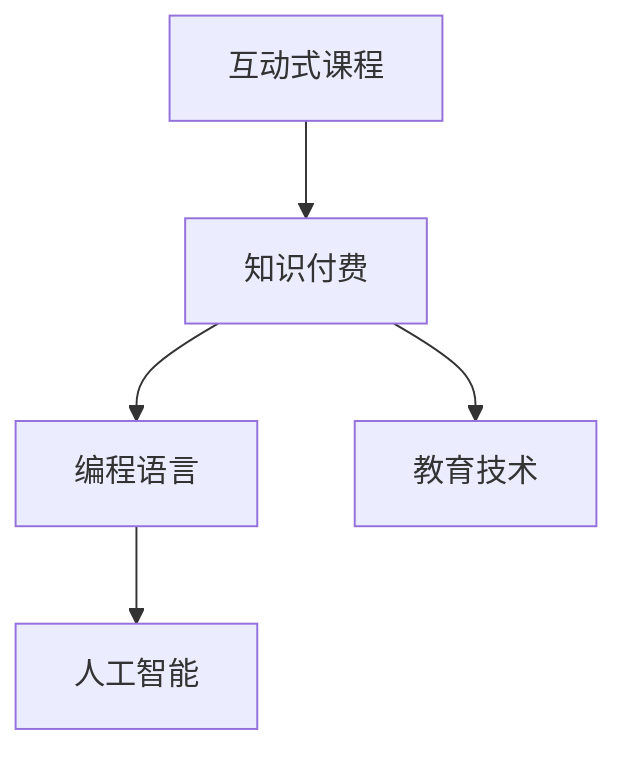

                 

# 程序员知识付费：打造互动式课程

> 关键词：程序员知识付费,互动式课程,教育技术,人工智能

## 1. 背景介绍

随着互联网技术的快速发展，在线教育成为教育行业的重要组成部分，尤其在疫情冲击下，线下教育转向线上已成为不可逆转的趋势。与此同时，知识付费也逐渐成为教育市场的主流商业模式，通过平台会员订阅、课程购买等方式获取高质量教育资源，受到越来越多用户青睐。其中，互动式课程因其丰富的教学体验和高效的学习成果，成为在线教育平台的核心竞争力。

互动式课程结合了多种教学形式，如视频讲解、文本讨论、编程练习、实时答疑等，打破传统教育的单向灌输模式，使学生能够在互动中掌握知识，提升学习效果。然而，传统的互动式课程往往由固定教学内容、单一反馈机制构成，难以提供灵活的个性化学习体验。

## 2. 核心概念与联系

### 2.1 核心概念概述

为了深入理解互动式课程的设计和实现，本节将介绍几个关键概念及其相互关系：

- 互动式课程：结合视频讲解、编程练习、讨论互动等多种教学形式，打破单向灌输，提升学习效果和体验的在线教育形式。
- 知识付费：以平台订阅、课程购买等方式，获取高质量教育资源，满足个性化学习需求的教育模式。
- 编程语言：互动式课程中常涉及的，用于实现课程功能、编程练习的技术性语言，如Python、JavaScript等。
- 人工智能：通过机器学习、自然语言处理等技术，提升互动式课程的教学智能化水平。
- 教育技术：应用信息技术改进传统教学方式，提高教学效果和效率的技术手段，如MOOC、AI、大数据分析等。

这些概念通过以下Mermaid流程图展现：



这个流程图展示了各核心概念之间的逻辑关系：

1. **互动式课程**基于**编程语言**和技术手段，通过**人工智能**辅助，构建高质量的教育体验。
2. **知识付费**是**互动式课程**的模式之一，通过平台化的方式提供服务。
3. **教育技术**是提升**互动式课程**效果的重要支撑。

这些概念的融合，使得互动式课程在在线教育市场脱颖而出，成为知识付费领域的重要应用。

## 3. 核心算法原理 & 具体操作步骤
### 3.1 算法原理概述

互动式课程的核心在于通过多种教学形式和智能技术，实现个性化、互动化的学习体验。其核心算法原理包括以下几个方面：

1. **内容组织与设计**：设计课程框架，组织教学内容，实现视频讲解、编程练习、文本讨论等多种形式的内容呈现。
2. **智能推荐系统**：根据学生的学习行为和成绩，推荐合适的学习路径和课程资源。
3. **互动答疑系统**：实时解答学生疑问，通过AI技术提升答疑效率和质量。
4. **编程练习平台**：提供编程练习环境和实时反馈，巩固学生编程技能。
5. **学习数据分析**：通过大数据分析，监测学生学习状态，提供个性化学习建议。

### 3.2 算法步骤详解

以下是互动式课程的关键步骤：

**Step 1: 确定课程目标和内容**
- 明确课程目标和期望学习成果，确定课程框架和教学内容。
- 设计视频讲解、编程练习、文本讨论等多种形式的内容呈现方式。
- 根据课程特点，选择合适的编程语言和技术栈，如Python、JavaScript、React等。

**Step 2: 构建课程系统**
- 使用JavaScript、React等前端技术，开发课程平台页面和交互界面。
- 使用Python、Flask等后端技术，实现课程逻辑和数据存储。
- 使用数据库技术，如MySQL、MongoDB等，存储和管理课程内容、学生信息、作业提交等数据。

**Step 3: 开发互动模块**
- 开发视频讲解模块，利用视频播放器技术和流媒体技术，实现视频内容的播放和互动。
- 开发编程练习模块，利用JavaScript、WebAssembly等技术，提供编程练习环境和实时反馈。
- 开发文本讨论模块，利用WebSocket等技术，实现实时讨论和消息推送。

**Step 4: 集成智能推荐系统**
- 利用机器学习技术，设计推荐算法，根据学生学习行为和成绩，推荐合适的学习路径和课程资源。
- 使用Python、Scikit-learn等工具，训练推荐模型，实时计算推荐结果。

**Step 5: 搭建互动答疑系统**
- 利用自然语言处理技术，实现AI答疑。使用TensorFlow、PyTorch等框架，训练问答模型。
- 使用Rasa等对话系统技术，实现对话接口，提供实时答疑服务。

**Step 6: 实施学习数据分析**
- 利用大数据分析技术，实时监测学生学习状态，如学习时长、答题情况、课程进度等。
- 使用Python、Pandas等工具，对数据进行分析，提供个性化学习建议。

**Step 7: 测试和部署**
- 在开发环境中测试课程系统，确保功能正常，用户体验良好。
- 部署课程系统到服务器，配置域名和访问权限，保证系统稳定运行。

### 3.3 算法优缺点

互动式课程的设计和实现具有以下优点：

1. **个性化学习**：通过智能推荐和数据分析，提供个性化学习体验，满足学生多样化需求。
2. **互动性强**：结合视频讲解、编程练习、讨论互动等多种形式，提升学习效果和兴趣。
3. **高效便捷**：线上学习打破了时间和空间的限制，学生可以随时随地进行学习。
4. **灵活性强**：课程设计可以根据需要灵活调整，适应不同学生群体。

同时，互动式课程也存在一些缺点：

1. **资源消耗大**：开发和维护互动式课程需要大量人力和技术支持，资源投入较大。
2. **技术门槛高**：涉及多种技术和工具，开发和维护门槛较高，需要较强的技术背景。
3. **学生自律性要求高**：课程依赖学生主动参与，自律性不足的学生可能难以充分利用资源。
4. **互动效果受限**：虽然提供了多种互动形式，但无法完全替代面对面的教学体验。

### 3.4 算法应用领域

互动式课程在教育领域具有广泛的应用前景，主要体现在以下几个方面：

- **K-12教育**：适用于小学、初中、高中等基础教育阶段，通过互动学习提升学生的学习兴趣和效果。
- **高等教育**：适用于大学课程，通过互动形式提升学生参与度，促进知识掌握和思维培养。
- **职业培训**：适用于职业技能培训，通过互动练习巩固学习内容，提升职业技能。
- **企业培训**：适用于员工技能提升，通过互动课程提升员工的工作效率和学习效果。
- **终身学习**：适用于成人教育和自学者，通过互动课程不断提升自身知识和技能。

此外，互动式课程在语言学习、编程教学、医学教育等领域也具有重要的应用价值。

## 4. 数学模型和公式 & 详细讲解 & 举例说明

### 4.1 数学模型构建

互动式课程的数学模型主要由以下几部分构成：

- **课程内容设计**：确定课程目标和框架，设计教学内容和学习路径。
- **推荐系统设计**：构建学生-课程关系图，设计推荐算法，计算推荐结果。
- **互动答疑设计**：建立问答数据集，设计问答模型，实现实时答疑。
- **学习数据分析**：设计数据采集和分析模型，实现个性化学习建议。

### 4.2 公式推导过程

以下以推荐系统为例，推导推荐算法的数学模型。

假设课程内容为 $C=\{c_1, c_2, ..., c_n\}$，学生为 $S=\{s_1, s_2, ..., s_m\}$，学生与课程的关系可以用矩阵 $R \in \{0,1\}^{m \times n}$ 表示，其中 $R_{ij}=1$ 表示学生 $s_i$ 学习了课程 $c_j$。

推荐系统的目标是最小化学生对课程的评分 $r \in \{1,2,...,n\}$ 与实际学习情况 $R$ 之间的差异，即最小化损失函数 $L(R, r)$。

具体来说，可以采用基于协同过滤的推荐算法，如基于用户-物品共现矩阵的推荐算法，其数学模型为：

$$
\min_{R} \sum_{i=1}^m \sum_{j=1}^n R_{ij} \log \hat{r}_{ij} + (1-R_{ij}) \log (1-\hat{r}_{ij})
$$

其中，$\hat{r}_{ij}$ 为预测学生 $s_i$ 对课程 $c_j$ 的评分，通常使用基于SVD（奇异值分解）的矩阵分解方法求解。

### 4.3 案例分析与讲解

以一个简单的编程练习平台为例，展示互动式课程的实现过程。

**Step 1: 确定课程目标和内容**

课程目标为教授Python编程语言的基础知识，课程内容包括以下几个模块：

- 变量和数据类型
- 条件语句
- 循环结构
- 函数和模块
- 文件操作

**Step 2: 构建课程系统**

使用React技术，开发课程平台的前端界面。使用Python和Flask，实现课程逻辑和数据存储。使用MySQL数据库，存储课程内容、学生信息、作业提交等数据。

**Step 3: 开发编程练习模块**

- 设计编程练习界面，包括代码编辑器、运行环境、实时反馈等。
- 实现代码提交和执行，通过Python的interpreter模块或Jupyter notebook等工具，提供代码运行环境。
- 设计实时反馈机制，通过打印输出、代码高亮等技术，及时展示代码执行结果和错误信息。

**Step 4: 实施互动答疑系统**

- 收集常见编程问题，建立问答数据集。
- 使用TensorFlow和PyTorch，训练基于RNN或Transformer的问答模型。
- 使用Rasa等对话系统技术，实现聊天界面和实时答疑服务。

**Step 5: 实施学习数据分析**

- 收集学生的学习行为数据，如编程练习次数、提交代码的时间、正确率等。
- 使用Pandas和Scikit-learn，对数据进行分析，生成学习报告和学习建议。

## 5. 项目实践：代码实例和详细解释说明
### 5.1 开发环境搭建

为了快速搭建互动式课程平台，可以采用以下开发环境：

- **前端开发环境**：安装Node.js、npm等工具，使用React、Webpack等前端技术。
- **后端开发环境**：安装Python、Flask等工具，使用MySQL、SQLite等数据库。
- **AI开发环境**：安装TensorFlow、PyTorch等深度学习框架，使用Rasa等对话系统技术。

**Step 1: 搭建前端开发环境**

1. 安装Node.js和npm，配置环境变量。
2. 使用React CLI创建项目，安装必要的依赖。
3. 使用Webpack配置前端构建流程。

**Step 2: 搭建后端开发环境**

1. 安装Python和Flask，创建项目目录。
2. 配置数据库连接，创建必要的数据库表。
3. 编写课程逻辑和数据处理代码，测试功能是否正常。

**Step 3: 搭建AI开发环境**

1. 安装TensorFlow、PyTorch等深度学习框架。
2. 收集问答数据集，预处理数据。
3. 设计问答模型，训练模型并进行评估。
4. 实现对话系统，测试实时答疑功能。

### 5.2 源代码详细实现

以下以Python和Flask实现的课程平台为例，展示关键代码实现。

**课程内容管理**

```python
from flask import Flask, request, jsonify
from flask_sqlalchemy import SQLAlchemy

app = Flask(__name__)
app.config['SQLALCHEMY_DATABASE_URI'] = 'sqlite:///courses.db'
db = SQLAlchemy(app)

class Course(db.Model):
    id = db.Column(db.Integer, primary_key=True)
    name = db.Column(db.String(128))
    description = db.Column(db.Text)
    content = db.Column(db.Text)

@app.route('/courses', methods=['GET'])
def get_courses():
    courses = Course.query.all()
    return jsonify([{'id': course.id, 'name': course.name, 'description': course.description} for course in courses])

@app.route('/course', methods=['POST'])
def create_course():
    name = request.form.get('name')
    description = request.form.get('description')
    content = request.form.get('content')
    course = Course(name=name, description=description, content=content)
    db.session.add(course)
    db.session.commit()
    return jsonify({'message': 'Course created successfully'})

@app.route('/course/<int:id>', methods=['GET'])
def get_course(id):
    course = Course.query.get(id)
    return jsonify({'id': course.id, 'name': course.name, 'description': course.description, 'content': course.content})
```

**学生学习管理**

```python
class Student(db.Model):
    id = db.Column(db.Integer, primary_key=True)
    name = db.Column(db.String(128))
    email = db.Column(db.String(128))
    courses = db.relationship('Course', secondary=courses_courses, backref=db.backref('students', lazy='dynamic'))

courses_courses = db.Table('courses_courses',
    db.Column('course_id', db.Integer, db.ForeignKey('course.id'), primary_key=True),
    db.Column('student_id', db.Integer, db.ForeignKey('student.id'), primary_key=True)
)

@app.route('/students', methods=['GET'])
def get_students():
    students = Student.query.all()
    return jsonify([{'id': student.id, 'name': student.name, 'email': student.email, 'courses': [course.name for course in student.courses]} for student in students])

@app.route('/student', methods=['POST'])
def create_student():
    name = request.form.get('name')
    email = request.form.get('email')
    student = Student(name=name, email=email)
    db.session.add(student)
    db.session.commit()
    return jsonify({'message': 'Student created successfully'})
```

**编程练习管理**

```python
class Exercise(db.Model):
    id = db.Column(db.Integer, primary_key=True)
    course_id = db.Column(db.Integer, db.ForeignKey('course.id'))
    code = db.Column(db.Text)
    output = db.Column(db.Text)
    status = db.Column(db.String(32))

@app.route('/exercises', methods=['GET'])
def get_exercises():
    exercises = Exercise.query.all()
    return jsonify([{'id': exercise.id, 'course_id': exercise.course_id, 'code': exercise.code, 'output': exercise.output, 'status': exercise.status} for exercise in exercises])

@app.route('/exercise', methods=['POST'])
def create_exercise():
    course_id = request.form.get('course_id')
    code = request.form.get('code')
    output = request.form.get('output')
    status = request.form.get('status')
    course = Course.query.get(course_id)
    exercise = Exercise(course_id=course_id, code=code, output=output, status=status)
    db.session.add(exercise)
    db.session.commit()
    return jsonify({'message': 'Exercise created successfully'})
```

### 5.3 代码解读与分析

以上代码展示了课程内容、学生管理、编程练习管理等核心功能的实现。

- **课程内容管理**：使用SQLAlchemy管理课程数据，提供了添加、获取和修改课程的基本操作。
- **学生学习管理**：使用SQLAlchemy管理学生数据，提供了添加、获取和修改学生的基本操作，同时建立了学生与课程的多对多关系。
- **编程练习管理**：使用SQLAlchemy管理编程练习数据，提供了添加、获取和修改编程练习的基本操作。

这些代码展示了使用Python和Flask进行后端开发的典型流程，包括数据库连接、模型设计、API接口等关键环节。开发者可以根据具体需求，进一步扩展和优化这些代码。

### 5.4 运行结果展示

在完成前端和后端开发后，可以通过浏览器访问课程平台，测试各功能模块是否正常。例如，通过访问 `localhost:5000/courses` 可以获取所有课程信息，访问 `localhost:5000/course/1` 可以获取指定课程的详细信息。

## 6. 实际应用场景

### 6.1 编程学习平台

互动式课程在编程学习平台中的应用非常广泛。学生可以通过在线编程练习，巩固编程知识和技能，同时通过实时反馈和答疑，解决学习中的问题。例如，Codecademy、LeetCode等平台，利用互动式课程，为全球开发者提供编程学习支持。

### 6.2 在线教育平台

互动式课程在K-12、高等教育、职业培训等领域也有广泛应用。例如，Coursera、edX等在线教育平台，提供丰富的互动式课程资源，满足不同学习者的需求。学生可以通过视频讲解、编程练习、讨论互动等多种形式，提升学习效果。

### 6.3 企业培训平台

企业通过互动式课程，为员工提供系统化培训，提升员工的技能和工作效率。例如，Udemy for Business等平台，提供定制化的企业培训课程，涵盖管理、技术、软技能等多个方面。

## 7. 工具和资源推荐

### 7.1 学习资源推荐

- **《Python编程：从入门到实践》**：适合初学者学习Python编程基础，涵盖Python语言基础、数据处理、网络编程等多个方面。
- **《深度学习入门》**：介绍深度学习的基本概念和常用算法，适合有一定编程基础的读者。
- **Coursera、edX等在线教育平台**：提供丰富的课程资源，涵盖计算机科学、数据科学、人工智能等多个领域。
- **Google Developers、Stack Overflow等社区**：提供大量的学习资料和技术支持，帮助开发者解决实际问题。

### 7.2 开发工具推荐

- **Node.js、npm**：用于前端开发，提供丰富的包管理器和框架支持。
- **Python、Flask**：用于后端开发，提供灵活的编程语言和框架选择。
- **TensorFlow、PyTorch**：用于AI开发，提供强大的深度学习框架和模型支持。
- **Rasa**：用于构建对话系统，提供自然语言处理和对话管理功能。

### 7.3 相关论文推荐

- **《基于Python的互动式学习系统设计》**：介绍互动式学习系统的设计思路和实现方法，适合开发者参考。
- **《机器学习在在线教育中的应用》**：探讨机器学习在在线教育中的具体应用，适合研究者参考。
- **《编程课程的互动设计与实现》**：介绍编程课程的互动设计思路和编程练习平台的实现方法，适合开发者参考。

## 8. 总结：未来发展趋势与挑战

### 8.1 总结

本文详细介绍了互动式课程的设计和实现，并结合具体案例展示了编程练习平台的核心功能。互动式课程通过多种教学形式和智能技术，提升学习效果和用户体验，成为知识付费领域的重要应用。未来，随着技术的不断进步，互动式课程将在更多教育场景中得到应用，为教育行业带来新的变革。

### 8.2 未来发展趋势

互动式课程的未来发展趋势主要体现在以下几个方面：

1. **多样化学习形式**：结合视频讲解、编程练习、讨论互动等多种形式，提供更加丰富的学习体验。
2. **智能推荐系统**：利用机器学习和自然语言处理技术，提供个性化的学习路径和资源推荐。
3. **实时互动答疑**：引入AI技术，提升答疑效率和质量，提供实时反馈和指导。
4. **学习数据分析**：通过大数据分析，实时监测学习状态，提供个性化学习建议。
5. **跨平台整合**：实现多设备、多平台之间的无缝衔接，提供统一的课程体验。

这些趋势将使得互动式课程更加智能化、互动化和个性化，满足用户多样化的学习需求。

### 8.3 面临的挑战

尽管互动式课程具有广阔的前景，但在推广和应用过程中，仍面临诸多挑战：

1. **技术门槛高**：开发和维护互动式课程需要高水平的技术支持，对开发者提出了较高的要求。
2. **资源消耗大**：开发和维护互动式课程需要大量的人力和资源投入，开发成本较高。
3. **用户自律性不足**：课程依赖学生主动参与，自律性不足的学生可能难以充分利用资源。
4. **互动效果受限**：虽然提供了多种互动形式，但无法完全替代面对面的教学体验。

### 8.4 研究展望

未来，互动式课程的研究方向主要集中在以下几个方面：

1. **提升互动性**：通过引入虚拟现实、增强现实等技术，提升课程的互动性和沉浸感。
2. **增强个性化**：结合用户画像、学习行为分析等技术，提供更加个性化的学习体验。
3. **提升智能化**：利用深度学习、自然语言处理等技术，提升课程的智能化水平。
4. **优化用户体验**：通过界面设计、交互优化等手段，提升用户的学习体验和满意度。
5. **扩大应用范围**：将互动式课程应用于更多领域，如医学教育、艺术教育等。

通过不断优化和创新，互动式课程将在在线教育领域发挥更大的作用，推动教育的公平、个性化和智能化发展。

## 9. 附录：常见问题与解答

**Q1: 如何设计互动式课程的课程框架？**

A: 设计课程框架时，首先需要明确课程目标和期望学习成果。然后，根据课程目标，设计课程内容和学习路径，确保各模块之间的逻辑连贯和知识衔接。最后，选择合适的技术手段和工具，实现课程功能的开发和部署。

**Q2: 互动式课程中的编程练习模块如何实现？**

A: 编程练习模块的实现需要提供代码编辑器、运行环境、实时反馈等关键功能。具体来说，可以使用JavaScript、WebAssembly等技术，提供代码编辑器和执行环境，使用Python的interpreter模块或Jupyter notebook等工具，提供代码运行和输出展示。同时，设计实时反馈机制，及时展示代码执行结果和错误信息。

**Q3: 如何提升互动式课程的用户体验？**

A: 提升用户体验需要从界面设计、交互优化等多个方面入手。例如，提供简洁明快的界面设计，优化课程界面的加载速度，提供丰富的交互元素和功能按钮，增强课程的互动性和趣味性。此外，利用大数据分析和用户反馈，不断优化课程内容和教学形式，提升用户的学习体验和满意度。

**Q4: 如何实现互动式课程的个性化推荐？**

A: 实现个性化推荐需要构建学生-课程关系图，设计推荐算法，计算推荐结果。具体来说，可以使用协同过滤、基于内容的推荐算法、矩阵分解等方法，结合学生学习行为和成绩，推荐合适的学习路径和课程资源。同时，通过机器学习技术，不断优化推荐模型，提升推荐效果。

通过不断探索和实践，相信互动式课程将不断优化和创新，为在线教育带来新的突破和发展，为学生提供更加丰富和高效的学习体验。

---

作者：禅与计算机程序设计艺术 / Zen and the Art of Computer Programming

