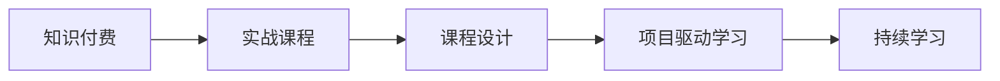
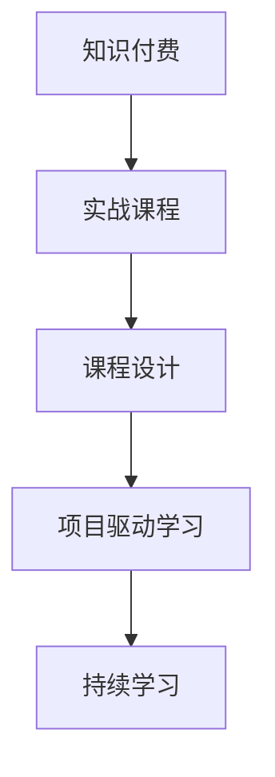

                 

# 程序员知识付费：打造实战课程

## 1. 背景介绍

在数字化浪潮席卷全球的今天，程序员作为新经济的重要力量，在技术创新和产业变革中扮演着关键角色。随着软件开发领域的竞争日益激烈，技术更新的速度不断加快，如何保持学习状态，提升自我价值，已成为每位程序员面临的重要课题。

### 1.1 问题由来
程序员知识付费的兴起，得益于近年来知识共享和在线教育的发展。传统的线下培训往往成本高昂，时间安排不便，难以满足广大程序员的学习需求。而在线课程和知识平台，凭借其灵活的时间、地点和费用优势，为程序员提供了更为便捷的学习渠道。

### 1.2 问题核心关键点
知识付费的核心在于优质内容的生产与传播。对于程序员而言，高质量的课程内容不仅需要深入浅出，同时还需要紧密贴合实际项目需求，解决实际问题。然而，如何设计一门既满足学习者需求，又能保证自身收益的实战课程，成为了知识付费市场的一大难题。

### 1.3 问题研究意义
有效的课程设计不仅能够提升程序员的技能水平，帮助其快速解决实际工作中的问题，还能通过知识付费模式，实现课程制作者与学习者之间的共赢。同时，高质量课程的普及，也有助于加速技术知识的传播，推动整个行业的发展。

## 2. 核心概念与联系

### 2.1 核心概念概述

为更好地理解如何打造优质程序员知识付费课程，本节将介绍几个关键概念：

- **知识付费**：指通过付费的方式，获取优质内容的学习过程。在线课程、电子书、技术讲座等都是常见的知识付费形式。
- **实战课程**：以实际项目和技术案例为基础，结合理论知识的课程。旨在通过模拟真实的开发环境，帮助学习者掌握实用技能。
- **课程设计**：包括课程目标设定、内容规划、教学方法选择、互动反馈机制等多方面工作。好的课程设计能最大化课程效果和用户体验。
- **项目驱动学习**：通过实际项目驱动课程内容，提升学习者解决实际问题的能力。
- **持续学习**：强调课程内容的时效性和更新频率，帮助学习者跟上技术发展的步伐。

这些核心概念之间相互关联，共同构成了程序员知识付费课程设计的框架。以下通过Mermaid流程图展示这些概念之间的逻辑关系：



### 2.2 核心概念原理和架构的 Mermaid 流程图



## 3. 核心算法原理 & 具体操作步骤
### 3.1 算法原理概述

打造优质程序员知识付费课程，本质上是一个将复杂技术知识转化为易于理解、易于应用的教学内容的过程。其核心算法可以概括为以下步骤：

1. **需求分析**：通过市场调研和用户访谈，明确目标用户的学习需求和痛点。
2. **内容设计**：围绕核心需求，设计课程内容，包括理论知识、案例分析、实战练习等。
3. **教学实施**：选择合适的教学方法和工具，如视频、直播、互动讨论等，确保内容传递的有效性。
4. **反馈优化**：通过学习者的互动反馈，不断优化课程内容和教学方法，提升学习效果。

### 3.2 算法步骤详解

以下详细介绍打造程序员知识付费课程的每个步骤：

**Step 1: 需求分析**
- 调研目标用户群体，了解他们的技术背景、职业需求和学习习惯。
- 通过问卷调查、用户访谈等方式收集学习者的具体痛点和期望。
- 分析收集到的数据，提炼出核心需求和关键知识点。

**Step 2: 内容设计**
- 确定课程目标，明确学习者通过课程能够掌握的关键技能。
- 设计课程框架，包括理论知识点、实战项目和案例分析。
- 选择适合的案例，确保案例的典型性和实用性。
- 编写课程讲义和实战练习，提供详细的开发环境和指导文档。

**Step 3: 教学实施**
- 选择合适的教学平台和工具，如Coursera、Udemy等。
- 设计互动环节，如在线讨论、代码评审等，促进学习者之间的交流和互助。
- 安排课程节奏，合理分配理论学习和实践练习的时间。
- 提供技术支持，如在线答疑、编程指导等，解决学习者的技术难题。

**Step 4: 反馈优化**
- 设计评估机制，通过小测验、项目评审等方式评估学习者的学习成果。
- 收集学习者的反馈意见，分析课程效果和不足。
- 根据反馈优化课程内容，及时更新案例和实战练习。
- 持续跟进学习者进展，提供个性化的学习建议。

### 3.3 算法优缺点

基于以上算法，打造程序员知识付费课程具有以下优点：
1. 贴近实际需求：课程内容紧密结合实际项目和真实问题，帮助学习者解决实际工作中的难题。
2. 互动性强：通过在线讨论、代码评审等方式，提升学习者的参与感和互动性。
3. 持续更新：课程内容根据技术发展和用户反馈进行迭代，确保其时效性和实用性。
4. 高效学习：通过项目驱动的方式，帮助学习者快速掌握实用技能。

同时，该方法也存在一些局限：
1. 制作成本高：高质量课程的开发和维护需要大量的时间和精力。
2. 学习者自驱性要求高：需要学习者有较强的自我管理能力，才能充分利用课程资源。
3. 课程质量参差不齐：部分课程内容可能与实际需求不符，或者过于简单或复杂，难以满足所有学习者的需求。

## 4. 数学模型和公式 & 详细讲解 & 举例说明

### 4.1 数学模型构建

本节通过数学模型来描述课程设计的核心算法流程。假设目标用户群体为 $T=\{t_1, t_2, ..., t_N\}$，其中每个用户 $t_i$ 有其特定的技术背景 $B_i$ 和学习需求 $D_i$。课程设计过程可以表示为以下步骤：

1. **需求收集**：对 $T$ 中的每个用户进行需求调研，收集其学习需求 $D_i$。
2. **需求分析**：将 $D_i$ 进行分析，提炼出核心需求 $C_i$。
3. **内容设计**：根据 $C_i$ 设计课程内容 $C$，并确定课程结构 $S$。
4. **教学实施**：选择合适的教学方法和工具 $M$，进行课程实施 $E$。
5. **反馈优化**：收集学习者反馈 $F$，进行课程优化 $O$。

### 4.2 公式推导过程

以一个具体的案例为例，说明课程设计过程的数学表达。

假设某个课程的目标是教授Python Web开发，课程需求调研结果表明，大部分学习者希望学习前端框架Django和后端框架Flask。根据需求调研，可以确定课程的核心需求为：
- 掌握Django框架的基础知识。
- 掌握Flask框架的基础知识。
- 能够进行基本的Web应用开发。

课程内容设计可以表示为以下数学公式：

$$
C = \{(Django基础), (Flask基础), (Web应用开发实战)\}
$$

课程结构设计可以表示为以下数学公式：

$$
S = \{理论讲解, 案例分析, 实战练习\}
$$

教学方法选择可以表示为以下数学公式：

$$
M = \{视频教学, 在线讨论, 代码评审\}
$$

课程实施过程可以表示为以下数学公式：

$$
E = \{视频讲解, 在线讨论, 实战练习\}
$$

学习者反馈可以表示为以下数学公式：

$$
F = \{问题反馈, 课程评价, 学习进展\}
$$

课程优化过程可以表示为以下数学公式：

$$
O = \{内容更新, 教学改进, 课程结构调整\}
$$

### 4.3 案例分析与讲解

以一个具体的案例来展示课程设计过程的实际应用：

**案例：Python Web开发课程设计**

1. **需求收集**：通过问卷和访谈，收集100名目标用户的学习需求，如“希望学习Django框架”、“希望学习Flask框架”、“希望进行Web应用开发”等。
2. **需求分析**：将收集到的需求进行分析，提炼出核心需求为“掌握Django框架基础知识”、“掌握Flask框架基础知识”和“进行Web应用开发实战”。
3. **内容设计**：根据核心需求，设计课程内容为“Django基础”、“Flask基础”和“Web应用开发实战”，课程结构为“理论讲解”、“案例分析”和“实战练习”。
4. **教学实施**：选择视频教学、在线讨论和代码评审等教学方法，进行课程实施。
5. **反馈优化**：收集学习者的反馈意见，分析课程效果，进行内容更新和教学改进。

## 5. 项目实践：代码实例和详细解释说明

### 5.1 开发环境搭建

在开始项目实践之前，需要准备相应的开发环境。以下是具体的步骤：

1. **选择课程平台**：选择合适的在线课程平台，如Coursera、Udemy等。
2. **安装编程工具**：安装Python、Git、GitHub等编程工具，确保开发环境的稳定性和高效性。
3. **设计课程框架**：根据课程目标，设计课程结构和内容。
4. **准备教学资源**：准备课程讲义、实战练习和案例分析等教学资源。
5. **搭建教学环境**：搭建视频录制和互动讨论的平台，确保教学资源的顺利传输。

### 5.2 源代码详细实现

以下展示一个具体的Python Web开发课程的代码实现过程：

**步骤1: 课程内容设计**

```python
# 定义课程结构
course_structure = {
    '理论讲解': [
        'Django基础',
        'Flask基础',
        'Web应用开发实战'
    ],
    '案例分析': [
        'Django电商应用案例',
        'Flask博客应用案例'
    ],
    '实战练习': [
        '构建Django电商应用',
        '开发Flask博客系统'
    ]
}

# 定义课程内容
course_content = {
    'Django基础': 'Python Web开发基础',
    'Flask基础': 'Python Web框架基础',
    'Web应用开发实战': 'Python Web应用实战开发'
}

# 输出课程结构和内容
print('课程结构:', course_structure)
print('课程内容:', course_content)
```

**步骤2: 教学资源准备**

```python
# 定义课程讲义
lectures = {
    'Django基础': 'Django基础课程讲义',
    'Flask基础': 'Flask基础课程讲义',
    'Web应用开发实战': 'Web应用开发实战课程讲义'
}

# 定义实战练习
practicals = {
    '构建Django电商应用': '构建Django电商应用实战练习',
    '开发Flask博客系统': '开发Flask博客系统实战练习'
}

# 输出课程讲义和实战练习
print('课程讲义:', lectures)
print('实战练习:', practicals)
```

**步骤3: 教学平台搭建**

```python
# 搭建视频录制环境
# 搭建在线讨论环境
# 搭建代码评审环境
```

### 5.3 代码解读与分析

以下是对上述代码的详细解读：

**步骤1: 课程内容设计**

- 通过Python字典数据结构，定义了课程结构和内容。课程结构包括理论讲解、案例分析和实战练习，内容为Django基础、Flask基础和Web应用开发实战。
- 通过Python字典数据结构，将每个课程内容映射为其对应的讲义名称。

**步骤2: 教学资源准备**

- 通过Python字典数据结构，定义了课程讲义和实战练习的名称。
- 这些讲义和练习将成为课程的重要教学资源，供学习者参考和学习。

**步骤3: 教学平台搭建**

- 具体的平台搭建过程，如视频录制、在线讨论和代码评审，需要结合具体的平台和技术工具进行配置。

### 5.4 运行结果展示

**展示教学资源和课程结构**

```python
# 展示课程结构和内容
print('课程结构:', course_structure)
print('课程内容:', course_content)

# 展示课程讲义和实战练习
print('课程讲义:', lectures)
print('实战练习:', practicals)
```

## 6. 实际应用场景

### 6.1 智能企业培训

智能企业可以通过知识付费课程，提升员工的技术水平和业务能力。通过将内部培训课程转化为知识付费产品，企业可以更高效地共享技术资源，节省培训成本，提升员工满意度。

**实际应用场景：**某智能制造企业通过将内部开发工具和流程培训课程转化为知识付费产品，员工可以通过在线学习掌握最新的开发工具和流程，提升工作效率。

### 6.2 在线教育平台

在线教育平台可以通过高质量课程的开发和销售，获取稳定的收益，同时提供优质内容，满足用户的学习需求。

**实际应用场景：**某在线教育平台开设Python Web开发课程，吸引大量用户参与，通过课程销售和广告收入，获得可观收益。

### 6.3 技术交流社群

技术交流社群可以通过知识付费课程，提升社群成员的技术水平，同时增强社群的凝聚力和活跃度。

**实际应用场景：**某技术交流社群开设实战Python编程课程，吸引大量开发者加入，通过课程销售和社群会员费用，获得收益。

## 7. 工具和资源推荐

### 7.1 学习资源推荐

为帮助开发者系统掌握知识付费课程的开发过程，以下是一些优质的学习资源推荐：

1. **Coursera《深度学习课程》**：由斯坦福大学Andrew Ng教授主讲，涵盖深度学习基础和进阶内容，适合初学者和进阶者。
2. **Udemy《Python编程课程》**：Udemy平台上的高质量Python编程课程，包括基础语法、高级应用等，适合不同层次的学习者。
3. **edX《数据分析课程》**：edX平台上的数据分析课程，涵盖统计学、数据处理、数据可视化等内容，适合数据分析领域的学习者。
4. **Kaggle《数据科学竞赛》**：Kaggle平台上的数据科学竞赛，提供大量真实数据和挑战，适合提升实战能力。
5. **Google开发者社区**：Google开发者社区提供丰富的技术文档和教程，涵盖Java、Python、Web开发等多个方向。

### 7.2 开发工具推荐

为提高课程开发效率，以下是一些推荐使用的开发工具：

1. **Coursera**：提供视频录制、互动讨论、实时测试等功能，适合制作高质量在线课程。
2. **Udemy**：支持多种教学形式，包括视频、文本、互动练习等，适合制作多样化课程。
3. **Khan Academy**：提供自适应学习平台，适合制作个性化学习课程。
4. **Kaggle**：提供数据科学竞赛平台，适合制作实战性强的课程。
5. **Moodle**：开源的学习管理系统，支持多种教学模式，适合制作线上线下结合的课程。

### 7.3 相关论文推荐

知识付费课程的研究和实践涉及多个领域，以下是一些具有代表性的相关论文推荐：

1. **《大规模在线教育系统的设计与实现》**：介绍大规模在线教育系统的设计原则和实现方法，涵盖课程内容设计、教学工具选择、用户交互优化等多个方面。
2. **《在线课程评估与反馈机制设计》**：探讨在线课程的评估与反馈机制设计，包括测试题设计、学习者反馈收集与分析等。
3. **《人工智能与在线教育融合研究》**：研究人工智能技术在在线教育中的应用，探讨AI辅助教学、智能推荐等功能。
4. **《知识付费市场的现状与发展趋势》**：分析知识付费市场的现状、用户需求和未来发展趋势，探讨课程设计的方向和策略。

## 8. 总结：未来发展趋势与挑战

### 8.1 总结

本文系统介绍了如何通过知识付费模式，打造高质量的程序员实战课程。从需求分析、内容设计、教学实施、反馈优化等各个环节，详细阐述了课程设计的核心算法和具体操作步骤。通过实际案例的展示，进一步加深了对课程设计的理解。

通过本文的学习，相信读者能够掌握如何设计一门既符合用户需求，又能实现盈利的程序员实战课程。

### 8.2 未来发展趋势

未来知识付费课程的发展趋势将呈现以下几个方向：

1. **内容多样化**：课程内容将更加多样化，涵盖编程语言、数据科学、人工智能等多个方向，满足不同用户的需求。
2. **技术互动化**：通过虚拟现实、增强现实等技术，提升学习者的互动体验，增强学习效果。
3. **知识泛化化**：将知识付费课程与在线测试、职业认证等形式结合，提升学习者的学习动力和成就感。
4. **平台平台化**：构建开放、协同的平台，鼓励开发者和企业共同参与课程开发，提升课程质量。
5. **技术智能化**：利用人工智能技术，实现学习路径推荐、自动答疑等智能化功能，提升用户体验。

### 8.3 面临的挑战

在知识付费课程的开发过程中，也面临着一些挑战：

1. **课程质量保证**：如何保证课程内容的质量，避免劣质课程对学习者造成负面影响。
2. **用户参与度**：如何吸引用户参与课程，保持其持续学习的动力。
3. **平台运营成本**：开发高质量课程需要大量的时间和资金投入，如何平衡成本和收益。
4. **版权和知识产权**：在课程开发过程中，如何保护知识产权，避免侵权和抄袭。

### 8.4 研究展望

未来的研究需要在以下几个方面进行探索：

1. **课程质量评估体系**：构建课程质量评估体系，对课程内容、教学方法、用户体验等进行全面评估，提升课程质量。
2. **个性化学习算法**：利用人工智能技术，实现个性化学习路径推荐，提升学习者的学习效果。
3. **知识图谱与课程融合**：将知识图谱与课程内容结合，提升课程的时效性和实用性。
4. **混合教学模式**：探索线上线下混合教学模式，提升课程的互动性和学习效果。

## 9. 附录：常见问题与解答

**Q1: 如何选择合适的课程平台？**

A: 选择合适的课程平台，需要考虑以下几个因素：
1. 平台的用户量和技术成熟度。
2. 平台提供的教学工具和功能，如视频录制、互动讨论等。
3. 平台的用户评价和市场口碑。
4. 平台的用户服务和技术支持。

**Q2: 如何设计高质量的课程内容？**

A: 设计高质量的课程内容，需要考虑以下几个步骤：
1. 进行需求调研，了解目标用户的需求和痛点。
2. 分析需求，提炼出核心知识点和技能点。
3. 设计课程框架，包括理论讲解、案例分析和实战练习等。
4. 准备教学资源，如课程讲义、实战练习等。
5. 进行课程评估，收集用户反馈，不断优化课程内容。

**Q3: 如何提升课程的用户参与度？**

A: 提升课程的用户参与度，需要考虑以下几个方法：
1. 设计互动环节，如在线讨论、代码评审等，促进学习者之间的交流。
2. 提供实时答疑和编程指导，帮助学习者解决技术难题。
3. 定期更新课程内容，保持课程的时效性和吸引力。
4. 建立学习社区，鼓励学习者分享经验和成果，增强归属感。

**Q4: 如何平衡课程开发成本和收益？**

A: 平衡课程开发成本和收益，需要考虑以下几个策略：
1. 进行市场调研，了解目标用户的需求和支付能力。
2. 优化课程内容，减少不必要的制作成本。
3. 进行用户测试，评估课程效果和用户反馈，优化课程质量和收益。
4. 采用众筹和众测等方式，降低开发成本。

通过本文的学习和实践，相信读者能够系统掌握知识付费课程的开发方法和技巧，实现自身价值的提升。

