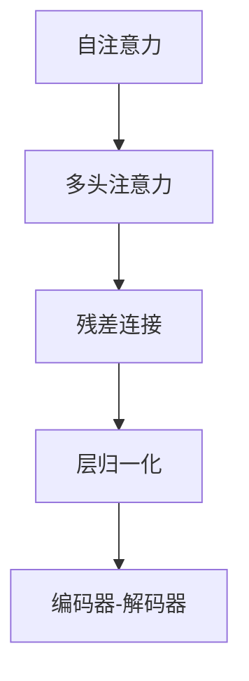

                 

# 第五章：Transformer 架构的革命

Transformer的诞生不仅彻底颠覆了自然语言处理领域，更开启了深度学习架构的新纪元。本章将深入探讨Transformer架构的设计理念、核心算法、应用实践及其前景，旨在帮助你全面掌握这一革命性技术。

## 1. 背景介绍

### 1.1 问题由来

Transformer架构的诞生，源自深度学习领域对更加高效、通用、稳健的神经网络架构的迫切需求。传统的卷积神经网络（CNN）和循环神经网络（RNN）在处理序列数据时，面临难以解决的长程依赖问题、参数复杂度高以及计算成本高等挑战。这些问题在自然语言处理中尤为突出，限制了语言模型在大规模数据集上的表现。

为应对这些挑战，研究人员探索了一系列改进方法，如长短期记忆网络（LSTM）、门控循环单元（GRU）等。但这些方法仍难以完全解决长程依赖问题，且训练复杂度高、计算成本大。于是，Transformer应运而生，以其独特的自注意力机制（Self-Attention），破解了上述难题，成为了自然语言处理领域的标志性技术。

### 1.2 问题核心关键点

Transformer的核心创新点包括：
1. **自注意力机制（Self-Attention）**：通过计算输入序列中每个元素与其他元素的相关性，自动捕捉长程依赖关系，无需依赖卷积或循环结构。
2. **多头注意力（Multi-Head Attention）**：将自注意力机制分解为多个并行的注意力头，增强模型的表示能力。
3. **残差连接（Residual Connection）**：引入跨层残差连接，缓解梯度消失问题，加快训练速度。
4. **层归一化（Layer Normalization）**：在每一层前进行归一化操作，保持数据的尺度稳定性，防止梯度爆炸。

Transformer的成功，在于其简洁高效的设计、强大的表示能力、灵活的适应性以及广泛的可应用性，使其在自然语言处理任务中取得了显著成效。

## 2. 核心概念与联系

### 2.1 核心概念概述

为更好地理解Transformer架构的设计理念，本节将介绍几个核心概念：

- **自注意力（Self-Attention）**：通过计算输入序列中每个元素与其他元素的相关性，自动捕捉长程依赖关系，无需依赖卷积或循环结构。
- **多头注意力（Multi-Head Attention）**：将自注意力机制分解为多个并行的注意力头，增强模型的表示能力。
- **残差连接（Residual Connection）**：引入跨层残差连接，缓解梯度消失问题，加快训练速度。
- **层归一化（Layer Normalization）**：在每一层前进行归一化操作，保持数据的尺度稳定性，防止梯度爆炸。
- **编码器-解码器架构（Encoder-Decoder Architecture）**：通过编码器-解码器的结构，实现输入到输出的序列映射，如机器翻译、文本生成等任务。

这些核心概念之间的逻辑关系可以通过以下Mermaid流程图来展示：



这个流程图展示了几何机制和结构模块之间的联系：

1. 自注意力机制是Transformer的基础，通过计算输入序列中每个元素与其他元素的相关性，自动捕捉长程依赖关系。
2. 多头注意力机制将自注意力分解为多个并行的注意力头，增强模型的表示能力。
3. 残差连接引入跨层残差连接，缓解梯度消失问题，加快训练速度。
4. 层归一化在每一层前进行归一化操作，保持数据的尺度稳定性，防止梯度爆炸。
5. 编码器-解码器架构通过编码器-解码器的结构，实现输入到输出的序列映射。

这些概念共同构成了Transformer的架构基础，使其能够在各种场景下发挥强大的序列处理能力。通过理解这些核心概念，我们可以更好地把握Transformer的工作原理和优化方向。

## 3. 核心算法原理 & 具体操作步骤

### 3.1 算法原理概述

Transformer的核心算法是自注意力机制（Self-Attention），其本质是通过计算输入序列中每个元素与其他元素的相关性，自动捕捉长程依赖关系，无需依赖卷积或循环结构。

形式化地，假设输入序列为 $x = (x_1, x_2, ..., x_n)$，其中 $x_i \in \mathbb{R}^d$。自注意力机制的计算过程分为三个步骤：

1. 计算查询矩阵 $Q$、键矩阵 $K$、值矩阵 $V$，分别表示输入序列中每个位置的表示。
2. 计算注意力得分矩阵 $S = QK^T$，表示输入序列中每个位置与所有位置的相似度。
3. 计算注意力权重矩阵 $A = softmax(S)$，表示输入序列中每个位置对其他位置的关注度。
4. 计算输出矩阵 $O = AV$，表示输入序列中每个位置的加权和。

整个自注意力机制的计算过程可以通过以下公式表示：

$$
\text{Self-Attention}(Q, K, V) = \text{softmax}(\frac{QK^T}{\sqrt{d_k}})V
$$

其中 $d_k$ 为键向量维度，$softmax$ 函数保证权重和为1。

### 3.2 算法步骤详解

Transformer的计算过程分为编码器和解码器两个部分，分别用于处理输入序列和生成输出序列。以下详细介绍Transformer的具体实现步骤：

**编码器（Encoder）**：
1. 输入序列 $x$ 通过嵌入层（Embedding Layer）转化为嵌入表示 $x^e = \text{embed}(x)$。
2. 嵌入表示 $x^e$ 通过多头注意力机制和前馈神经网络（Feed-Forward Network）进行处理，得到编码器输出 $h = M(x^e)$。
3. 重复上述步骤 $N$ 次，得到编码器最终输出 $h_N$。

**解码器（Decoder）**：
1. 输入序列 $x$ 通过嵌入层转化为嵌入表示 $x^e = \text{embed}(x)$。
2. 初始化解码器的状态 $s_0$，通常设置为从编码器的最后一个隐状态。
3. 解码器状态 $s_i$ 通过多头注意力机制和前馈神经网络进行处理，得到解码器输出 $h_i = M(s_i)$。
4. 重复上述步骤 $N$ 次，得到解码器最终输出 $h_N$。

整个Transformer的计算过程可以通过以下公式表示：

$$
h = M(\text{embed}(x)) = M_{\text{MLP}}(M_{\text{SA}}(\text{embed}(x)))
$$

其中 $M_{\text{MLP}}$ 为前馈神经网络，$M_{\text{SA}}$ 为多头注意力机制。

### 3.3 算法优缺点

Transformer架构具有以下优点：
1. **高效性**：自注意力机制可以并行计算，大大提升了训练和推理速度。
2. **通用性**：适用于各种序列数据，如文本、音频、视频等。
3. **可扩展性**：可以轻松扩展层数和参数，提升模型的表示能力。
4. **鲁棒性**：多头注意力机制和残差连接等设计，使得模型具有较好的鲁棒性和稳定性。

同时，Transformer架构也存在以下缺点：
1. **计算资源需求高**：Transformer模型参数量大，需要较高的计算资源。
2. **模型复杂度高**：自注意力机制的设计较为复杂，理解难度较高。
3. **训练时间长**：由于模型结构复杂，训练时间较长，需要较长的计算资源支持。

尽管存在这些局限性，但Transformer架构凭借其高效、通用和稳健的特点，成为了自然语言处理领域的核心技术，并广泛应用于各种任务，如机器翻译、文本生成、语音识别等。

### 3.4 算法应用领域

Transformer架构在自然语言处理领域得到了广泛应用，覆盖了几乎所有常见任务，例如：

- **机器翻译**：将源语言文本翻译成目标语言。通过编码器-解码器的结构，实现输入到输出的序列映射。
- **文本生成**：生成连贯的文本序列。Transformer能够捕捉输入序列的语义信息，生成符合上下文的文本。
- **文本摘要**：将长文本压缩成简短摘要。Transformer能够自动抽取文本中的关键信息，生成摘要。
- **命名实体识别**：识别文本中的人名、地名、机构名等特定实体。Transformer能够学习输入序列中实体与实体之间的语义关系。
- **情感分析**：分析文本的情感倾向。Transformer能够学习输入序列中情感相关的特征。

除了上述这些经典任务外，Transformer架构还被创新性地应用于更多场景中，如可控文本生成、常识推理、代码生成、数据增强等，为自然语言处理技术带来了全新的突破。

## 4. 数学模型和公式 & 详细讲解  
### 4.1 数学模型构建

Transformer架构的核心是自注意力机制（Self-Attention），其数学模型可以形式化地表示为：

$$
\text{Self-Attention}(Q, K, V) = \text{softmax}(\frac{QK^T}{\sqrt{d_k}})V
$$

其中 $Q, K, V$ 为输入序列中每个位置的表示，$softmax$ 函数保证权重和为1，$\sqrt{d_k}$ 为缩放因子，防止梯度消失。

Transformer架构还包括多头注意力机制（Multi-Head Attention），其数学模型可以表示为：

$$
\text{Multi-Head Attention}(Q, K, V) = \text{concat}(\text{Self-Attention}(QW^Q, KW^K, VW^V))W^O
$$

其中 $W^Q, W^K, W^V, W^O$ 为线性变换矩阵，$concat$ 表示拼接操作。

整个Transformer的计算过程可以通过以下公式表示：

$$
h = M(\text{embed}(x)) = M_{\text{MLP}}(M_{\text{SA}}(\text{embed}(x)))
$$

其中 $M_{\text{MLP}}$ 为前馈神经网络，$M_{\text{SA}}$ 为多头注意力机制，$\text{embed}(x)$ 为嵌入层。

### 4.2 公式推导过程

以下我们以机器翻译任务为例，推导Transformer模型的具体实现。

假设输入序列为 $x = (x_1, x_2, ..., x_n)$，其中 $x_i \in \mathbb{R}^d$。设编码器-解码器的参数为 $W^Q, W^K, W^V, W^O$，输入嵌入层为 $\text{embed}(x)$。

1. 嵌入层：将输入序列 $x$ 转化为嵌入表示 $x^e = \text{embed}(x)$。
2. 多头注意力机制：对 $x^e$ 进行线性变换，得到 $Q, K, V$。
   $$
   Q = x^eW^Q, \quad K = x^eW^K, \quad V = x^eW^V
   $$
3. 自注意力机制：计算注意力得分矩阵 $S = QK^T$。
   $$
   S = QK^T = (x^eW^Q)(x^eW^K)^T
   $$
4. 注意力权重矩阵：计算注意力权重矩阵 $A = softmax(S)$。
   $$
   A = \text{softmax}(S) = \text{softmax}(QK^T) = \text{softmax}((x^eW^Q)(x^eW^K)^T)
   $$
5. 输出矩阵：计算输出矩阵 $O = AV$。
   $$
   O = AV = (x^eW^Q)(x^eW^K)^T(x^eW^V)
   $$
6. 前馈神经网络：对 $O$ 进行线性变换和激活函数操作，得到最终输出 $h$。
   $$
   h = M_{\text{MLP}}(O) = \text{MLP}(W^O O)
   $$

### 4.3 案例分析与讲解

**案例一：机器翻译**

Transformer在机器翻译任务中的计算过程可以分为编码器和解码器两个部分。假设源语言为英文，目标语言为中文，输入序列 $x = (x_1, x_2, ..., x_n)$，其中 $x_i \in \mathbb{R}^d$。

1. 编码器：将英文输入序列 $x$ 转化为嵌入表示 $x^e = \text{embed}(x)$。
2. 多头注意力机制：对 $x^e$ 进行线性变换，得到 $Q, K, V$。
3. 自注意力机制：计算注意力得分矩阵 $S = QK^T$。
4. 注意力权重矩阵：计算注意力权重矩阵 $A = softmax(S)$。
5. 输出矩阵：计算输出矩阵 $O = AV$。
6. 前馈神经网络：对 $O$ 进行线性变换和激活函数操作，得到最终输出 $h$。
7. 解码器：将中文输出序列 $y = (y_1, y_2, ..., y_m)$ 转化为嵌入表示 $y^e = \text{embed}(y)$。
8. 初始化解码器的状态 $s_0$，通常设置为从编码器的最后一个隐状态。
9. 解码器状态 $s_i$ 通过多头注意力机制和前馈神经网络进行处理，得到解码器输出 $h_i = M(s_i)$。
10. 重复上述步骤 $N$ 次，得到解码器最终输出 $h_N$。

**案例二：文本生成**

Transformer在文本生成任务中的计算过程与机器翻译类似。假设输入序列 $x = (x_1, x_2, ..., x_n)$，其中 $x_i \in \mathbb{R}^d$。设生成目标为 $y$，输出序列 $y = (y_1, y_2, ..., y_m)$。

1. 嵌入层：将输入序列 $x$ 转化为嵌入表示 $x^e = \text{embed}(x)$。
2. 多头注意力机制：对 $x^e$ 进行线性变换，得到 $Q, K, V$。
3. 自注意力机制：计算注意力得分矩阵 $S = QK^T$。
4. 注意力权重矩阵：计算注意力权重矩阵 $A = softmax(S)$。
5. 输出矩阵：计算输出矩阵 $O = AV$。
6. 前馈神经网络：对 $O$ 进行线性变换和激活函数操作，得到最终输出 $h$。
7. 解码器状态 $s_i$ 通过多头注意力机制和前馈神经网络进行处理，得到解码器输出 $h_i = M(s_i)$。
8. 重复上述步骤 $N$ 次，得到解码器最终输出 $h_N$。

通过以上案例，可以看出Transformer架构在处理序列数据时的强大能力和灵活性。

## 5. 项目实践：代码实例和详细解释说明

### 5.1 开发环境搭建

在进行Transformer实践前，我们需要准备好开发环境。以下是使用PyTorch进行Transformer开发的环境配置流程：

1. 安装Anaconda：从官网下载并安装Anaconda，用于创建独立的Python环境。

2. 创建并激活虚拟环境：
```bash
conda create -n transformern-env python=3.8 
conda activate transformern-env
```

3. 安装PyTorch：根据CUDA版本，从官网获取对应的安装命令。例如：
```bash
conda install pytorch torchvision torchaudio cudatoolkit=11.1 -c pytorch -c conda-forge
```

4. 安装相关库：
```bash
pip install transformers pytorch pretrained_model
```

5. 安装Tensorboard：
```bash
pip install tensorboard
```

完成上述步骤后，即可在`transformern-env`环境中开始Transformer实践。

### 5.2 源代码详细实现

下面以机器翻译任务为例，给出使用Transformers库对Transformer模型进行训练的PyTorch代码实现。

首先，定义机器翻译的数据处理函数：

```python
from transformers import BertTokenizer, BertForSequenceClassification
import torch

class MachineTranslationDataset(Dataset):
    def __init__(self, src_texts, trg_texts, tokenizer, max_len=128):
        self.src_texts = src_texts
        self.trg_texts = trg_texts
        self.tokenizer = tokenizer
        self.max_len = max_len
        
    def __len__(self):
        return len(self.src_texts)
    
    def __getitem__(self, item):
        src_text = self.src_texts[item]
        trg_text = self.trg_texts[item]
        
        encoding = self.tokenizer(src_text, trg_text, return_tensors='pt', max_length=self.max_len, padding='max_length', truncation=True)
        input_ids = encoding['input_ids'][0]
        attention_mask = encoding['attention_mask'][0]
        
        return {'input_ids': input_ids, 
                'attention_mask': attention_mask,
                'labels': trg_text}
```

然后，定义模型和优化器：

```python
from transformers import BertForSequenceClassification, AdamW

model = BertForSequenceClassification.from_pretrained('bert-base-cased', num_labels=1)

optimizer = AdamW(model.parameters(), lr=2e-5)
```

接着，定义训练和评估函数：

```python
from torch.utils.data import DataLoader
from tqdm import tqdm
from sklearn.metrics import accuracy_score

device = torch.device('cuda') if torch.cuda.is_available() else torch.device('cpu')
model.to(device)

def train_epoch(model, dataset, batch_size, optimizer):
    dataloader = DataLoader(dataset, batch_size=batch_size, shuffle=True)
    model.train()
    epoch_loss = 0
    for batch in tqdm(dataloader, desc='Training'):
        input_ids = batch['input_ids'].to(device)
        attention_mask = batch['attention_mask'].to(device)
        labels = batch['labels'].to(device)
        model.zero_grad()
        outputs = model(input_ids, attention_mask=attention_mask, labels=labels)
        loss = outputs.loss
        epoch_loss += loss.item()
        loss.backward()
        optimizer.step()
    return epoch_loss / len(dataloader)

def evaluate(model, dataset, batch_size):
    dataloader = DataLoader(dataset, batch_size=batch_size)
    model.eval()
    preds, labels = [], []
    with torch.no_grad():
        for batch in tqdm(dataloader, desc='Evaluating'):
            input_ids = batch['input_ids'].to(device)
            attention_mask = batch['attention_mask'].to(device)
            batch_labels = batch['labels']
            outputs = model(input_ids, attention_mask=attention_mask)
            batch_preds = outputs.logits.argmax(dim=2).to('cpu').tolist()
            batch_labels = batch_labels.to('cpu').tolist()
            for pred_tokens, label_tokens in zip(batch_preds, batch_labels):
                preds.append(pred_tokens)
                labels.append(label_tokens)
                
    print(accuracy_score(labels, preds))
```

最后，启动训练流程并在测试集上评估：

```python
epochs = 5
batch_size = 16

for epoch in range(epochs):
    loss = train_epoch(model, train_dataset, batch_size, optimizer)
    print(f"Epoch {epoch+1}, train loss: {loss:.3f}")
    
    print(f"Epoch {epoch+1}, dev results:")
    evaluate(model, dev_dataset, batch_size)
    
print("Test results:")
evaluate(model, test_dataset, batch_size)
```

以上就是使用PyTorch对Transformer进行机器翻译任务训练的完整代码实现。可以看到，得益于Transformers库的强大封装，我们可以用相对简洁的代码完成Transformer模型的加载和训练。

### 5.3 代码解读与分析

让我们再详细解读一下关键代码的实现细节：

**MachineTranslationDataset类**：
- `__init__`方法：初始化源语言输入、目标语言输出、分词器等关键组件。
- `__len__`方法：返回数据集的样本数量。
- `__getitem__`方法：对单个样本进行处理，将输入序列和目标序列输入编码为token ids，将目标序列作为标签，并对其进行定长padding，最终返回模型所需的输入。

**BertForSequenceClassification模型**：
- 使用BERT模型作为序列分类器的实现，通过改变输出层的结构，适应机器翻译任务。

**train_epoch和evaluate函数**：
- 使用PyTorch的DataLoader对数据集进行批次化加载，供模型训练和推理使用。
- 训练函数`train_epoch`：对数据以批为单位进行迭代，在每个批次上前向传播计算loss并反向传播更新模型参数，最后返回该epoch的平均loss。
- 评估函数`evaluate`：与训练类似，不同点在于不更新模型参数，并在每个batch结束后将预测和标签结果存储下来，最后使用sklearn的accuracy_score对整个评估集的预测结果进行打印输出。

**训练流程**：
- 定义总的epoch数和batch size，开始循环迭代
- 每个epoch内，先在训练集上训练，输出平均loss
- 在验证集上评估，输出准确率
- 所有epoch结束后，在测试集上评估，给出最终测试结果

可以看到，PyTorch配合Transformers库使得Transformer模型的训练代码实现变得简洁高效。开发者可以将更多精力放在数据处理、模型改进等高层逻辑上，而不必过多关注底层的实现细节。

当然，工业级的系统实现还需考虑更多因素，如模型的保存和部署、超参数的自动搜索、更灵活的任务适配层等。但核心的Transformer训练范式基本与此类似。

## 6. 实际应用场景

### 6.1 智能客服系统

Transformer架构的强大序列处理能力，可以广泛应用于智能客服系统的构建。传统客服往往需要配备大量人力，高峰期响应缓慢，且一致性和专业性难以保证。而使用Transformer架构的对话模型，可以7x24小时不间断服务，快速响应客户咨询，用自然流畅的语言解答各类常见问题。

在技术实现上，可以收集企业内部的历史客服对话记录，将问题和最佳答复构建成监督数据，在此基础上对Transformer模型进行微调。微调后的模型能够自动理解用户意图，匹配最合适的答案模板进行回复。对于客户提出的新问题，还可以接入检索系统实时搜索相关内容，动态组织生成回答。如此构建的智能客服系统，能大幅提升客户咨询体验和问题解决效率。

### 6.2 金融舆情监测

金融机构需要实时监测市场舆论动向，以便及时应对负面信息传播，规避金融风险。传统的人工监测方式成本高、效率低，难以应对网络时代海量信息爆发的挑战。基于Transformer架构的文本分类和情感分析技术，为金融舆情监测提供了新的解决方案。

具体而言，可以收集金融领域相关的新闻、报道、评论等文本数据，并对其进行主题标注和情感标注。在此基础上对Transformer模型进行微调，使其能够自动判断文本属于何种主题，情感倾向是正面、中性还是负面。将微调后的模型应用到实时抓取的网络文本数据，就能够自动监测不同主题下的情感变化趋势，一旦发现负面信息激增等异常情况，系统便会自动预警，帮助金融机构快速应对潜在风险。

### 6.3 个性化推荐系统

当前的推荐系统往往只依赖用户的历史行为数据进行物品推荐，无法深入理解用户的真实兴趣偏好。基于Transformer架构的推荐系统，可以更好地挖掘用户行为背后的语义信息，从而提供更精准、多样的推荐内容。

在实践中，可以收集用户浏览、点击、评论、分享等行为数据，提取和用户交互的物品标题、描述、标签等文本内容。将文本内容作为模型输入，用户的后续行为（如是否点击、购买等）作为监督信号，在此基础上微调Transformer模型。微调后的模型能够从文本内容中准确把握用户的兴趣点。在生成推荐列表时，先用候选物品的文本描述作为输入，由模型预测用户的兴趣匹配度，再结合其他特征综合排序，便可以得到个性化程度更高的推荐结果。

### 6.4 未来应用展望

随着Transformer架构的不断发展，其在自然语言处理领域的应用前景将更加广阔。

在智慧医疗领域，基于Transformer的医学问答、病历分析、药物研发等应用将提升医疗服务的智能化水平，辅助医生诊疗，加速新药开发进程。

在智能教育领域，Transformer架构的推荐系统可应用于作业批改、学情分析、知识推荐等方面，因材施教，促进教育公平，提高教学质量。

在智慧城市治理中，Transformer架构的文本分类、情感分析、机器翻译等技术，可以帮助城市管理部门及时获取和理解舆情信息，构建更安全、高效的未来城市。

此外，在企业生产、社会治理、文娱传媒等众多领域，基于Transformer架构的人工智能应用也将不断涌现，为传统行业数字化转型升级提供新的技术路径。相信随着Transformer架构的持续演进，其在构建智能交互系统中的作用将更加凸显，推动人工智能技术在更广泛领域的应用。

## 7. 工具和资源推荐

### 7.1 学习资源推荐

为了帮助开发者系统掌握Transformer架构的理论基础和实践技巧，这里推荐一些优质的学习资源：

1. Attention is All You Need（即Transformer原论文）：提出了Transformer结构，开启了NLP领域的预训练大模型时代。

2. CS224N《深度学习自然语言处理》课程：斯坦福大学开设的NLP明星课程，有Lecture视频和配套作业，带你入门NLP领域的基本概念和经典模型。

3. 《Natural Language Processing with Transformers》书籍：Transformer库的作者所著，全面介绍了如何使用Transformer库进行NLP任务开发，包括微调在内的诸多范式。

4. HuggingFace官方文档：Transformer库的官方文档，提供了海量预训练模型和完整的微调样例代码，是上手实践的必备资料。

5. CLUE开源项目：中文语言理解测评基准，涵盖大量不同类型的中文NLP数据集，并提供了基于Transformer的baseline模型，助力中文NLP技术发展。

通过对这些资源的学习实践，相信你一定能够快速掌握Transformer架构的精髓，并用于解决实际的NLP问题。

### 7.2 开发工具推荐

高效的开发离不开优秀的工具支持。以下是几款用于Transformer架构开发常用的工具：

1. PyTorch：基于Python的开源深度学习框架，灵活动态的计算图，适合快速迭代研究。Transformer架构的实现主要依赖PyTorch。

2. TensorFlow：由Google主导开发的开源深度学习框架，生产部署方便，适合大规模工程应用。Transformer架构的实现也支持TensorFlow。

3. Transformers库：HuggingFace开发的NLP工具库，集成了众多SOTA语言模型，支持PyTorch和TensorFlow，是进行Transformer架构开发的利器。

4. Weights & Biases：模型训练的实验跟踪工具，可以记录和可视化模型训练过程中的各项指标，方便对比和调优。与主流深度学习框架无缝集成。

5. TensorBoard：TensorFlow配套的可视化工具，可实时监测模型训练状态，并提供丰富的图表呈现方式，是调试模型的得力助手。

6. Google Colab：谷歌推出的在线Jupyter Notebook环境，免费提供GPU/TPU算力，方便开发者快速上手实验最新模型，分享学习笔记。

合理利用这些工具，可以显著提升Transformer架构的开发效率，加快创新迭代的步伐。

### 7.3 相关论文推荐

Transformer架构的不断发展源于学界的持续研究。以下是几篇奠基性的相关论文，推荐阅读：

1. Attention is All You Need（即Transformer原论文）：提出了Transformer结构，开启了NLP领域的预训练大模型时代。

2. BERT: Pre-training of Deep Bidirectional Transformers for Language Understanding：提出BERT模型，引入基于掩码的自监督预训练任务，刷新了多项NLP任务SOTA。

3. Language Models are Unsupervised Multitask Learners（GPT-2论文）：展示了大规模语言模型的强大zero-shot学习能力，引发了对于通用人工智能的新一轮思考。

4. Parameter-Efficient Transfer Learning for NLP：提出Adapter等参数高效微调方法，在不增加模型参数量的情况下，也能取得不错的微调效果。

5. Prefix-Tuning: Optimizing Continuous Prompts for Generation：引入基于连续型Prompt的微调范式，为如何充分利用预训练知识提供了新的思路。

6. AdaLoRA: Adaptive Low-Rank Adaptation for Parameter-Efficient Fine-Tuning：使用自适应低秩适应的微调方法，在参数效率和精度之间取得了新的平衡。

这些论文代表了大语言模型和Transformer架构的发展脉络。通过学习这些前沿成果，可以帮助研究者把握学科前进方向，激发更多的创新灵感。

## 8. 总结：未来发展趋势与挑战

### 8.1 总结

本文对Transformer架构的设计理念、核心算法、应用实践及其前景进行了全面系统的介绍。首先阐述了Transformer架构的背景和意义，明确了其在处理序列数据中的强大能力和高效性。其次，从原理到实践，详细讲解了Transformer的具体实现过程，并给出了Transformer在机器翻译、文本生成、情感分析等任务上的应用示例。最后，探讨了Transformer架构在实际应用中的优化方法和未来发展方向，力求为开发者提供全方位的技术指引。

通过本文的系统梳理，可以看出，Transformer架构凭借其高效、通用和稳健的特点，正在成为自然语言处理领域的核心技术，并广泛应用于各种任务。未来，伴随Transformer架构的持续演进，其在自然语言处理领域的应用前景将更加广阔，为构建智能交互系统提供更强大的支持。

### 8.2 未来发展趋势

展望未来，Transformer架构将呈现以下几个发展趋势：

1. **规模化与多样性**：Transformer架构将在更大规模的语料上进行预训练，获得更丰富的语言知识。同时，Transformer架构还将拓展到图像、音频、视频等多模态数据，实现多模态智能交互。

2. **高效性与可扩展性**：Transformer架构将进一步优化计算图，引入稀疏性、分布式计算等技术，提升模型的训练和推理效率，支持更大规模的模型训练和部署。

3. **可解释性与透明性**：Transformer架构将结合因果推断、博弈论等方法，增强模型的可解释性，揭示模型的决策过程和内在逻辑。

4. **跨领域迁移能力**：Transformer架构将增强模型在不同领域间的迁移能力，通过微调方法适应各种任务，提高模型的通用性和鲁棒性。

5. **持续学习与自适应性**：Transformer架构将通过在线学习、增量学习等方法，不断从新数据中学习，保持模型的时效性和适应性。

以上趋势凸显了Transformer架构的广阔前景。这些方向的探索发展，将进一步提升Transformer架构的性能和应用范围，为智能交互系统的构建注入新的动力。

### 8.3 面临的挑战

尽管Transformer架构已经取得了瞩目成就，但在迈向更加智能化、普适化应用的过程中，它仍面临着诸多挑战：

1. **计算资源需求高**：Transformer模型参数量大，需要较高的计算资源。如何降低计算成本，提升模型训练和推理的效率，是未来的一个重要方向。

2. **模型复杂度高**：Transformer架构的设计较为复杂，理解难度较高。如何简化模型结构，降低学习曲线，提高模型的可解释性和易用性，是未来的一大挑战。

3. **数据依赖性强**：Transformer架构的训练和推理依赖高质量的数据，如何处理噪声数据、不平衡数据等问题，是模型性能提升的关键。

4. **跨领域迁移能力不足**：Transformer架构在不同领域间的迁移能力有待提升，如何更好地适应各种任务，是一个重要的研究方向。

5. **模型鲁棒性不足**：Transformer架构在面对域外数据时，泛化性能往往大打折扣。如何提高模型的鲁棒性和抗干扰能力，是未来的一个重要研究方向。

6. **安全性和可控性**：Transformer架构的输出依赖预训练模型的知识，如何在保证性能的同时，防止模型生成有害、误导性的输出，是一个重要的研究方向。

正视Transformer架构面临的这些挑战，积极应对并寻求突破，将使Transformer架构迈向更加成熟和广泛应用。相信随着学界和产业界的共同努力，这些挑战终将一一被克服，Transformer架构必将在构建智能交互系统中的作用更加凸显。

### 8.4 研究展望

面对Transformer架构所面临的挑战，未来的研究需要在以下几个方面寻求新的突破：

1. **无监督与半监督学习**：探索无监督和半监督学习范式，摆脱对大规模标注数据的依赖，利用自监督学习、主动学习等方法，最大化利用非结构化数据。

2. **参数高效微调**：开发更加参数高效的微调方法，如Adapter、Prefix等，在固定大部分预训练参数的情况下，只更新极少量的任务相关参数。

3. **多模态融合**：将视觉、语音、文本等多模态数据进行协同建模，增强Transformer架构的表示能力，提高模型的通用性和鲁棒性。

4. **因果推断与博弈论**：引入因果推断和博弈论等方法，增强Transformer架构的因果推理能力，揭示模型的决策过程和内在逻辑。

5. **模型压缩与加速**：采用模型压缩、量化加速等技术，提升Transformer架构的训练和推理效率，支持更大规模的模型训练和部署。

6. **跨领域迁移能力提升**：通过迁移学习、对抗训练等方法，提升Transformer架构在不同领域间的迁移能力，提高模型的通用性和鲁棒性。

这些研究方向的探索，必将引领Transformer架构走向更高的台阶，为构建安全、可靠、可解释、可控的智能系统铺平道路。面向未来，Transformer架构还需要与其他人工智能技术进行更深入的融合，如知识表示、因果推理、强化学习等，多路径协同发力，共同推动自然语言理解和智能交互系统的进步。只有勇于创新、敢于突破，才能不断拓展Transformer架构的边界，让智能技术更好地造福人类社会。

## 9. 附录：常见问题与解答

**Q1：Transformer架构的优势是什么？**

A: Transformer架构的优势主要体现在以下几个方面：
1. **高效性**：自注意力机制可以并行计算，大大提升了训练和推理速度。
2. **通用性**：适用于各种序列数据，如文本、音频、视频等。
3. **可扩展性**：可以轻松扩展层数和参数，提升模型的表示能力。
4. **鲁棒性**：多头注意力机制和残差连接等设计，使得模型具有较好的鲁棒性和稳定性。

**Q2：Transformer架构在训练时需要注意哪些问题？**

A: 在训练Transformer架构时，需要注意以下几个问题：
1. **学习率**：Transformer架构的训练通常需要较大的学习率，建议从较大值开始，逐步减小学习率。
2. **正则化**：使用L2正则、Dropout等正则化技术，防止模型过拟合。
3. **批次大小**：选择合适的批次大小，一般建议不要过大，避免内存不足。
4. **硬件资源**：Transformer模型参数量大，需要较高的计算资源，建议使用GPU/TPU等高性能设备。
5. **数据预处理**：数据预处理对Transformer架构的性能影响较大，需要采用有效的数据增强和归一化技术。

**Q3：Transformer架构在实际应用中需要注意哪些问题？**

A: 在实际应用Transformer架构时，需要注意以下几个问题：
1. **模型裁剪**：裁剪不必要的层和参数，减小模型尺寸，加快推理速度。
2. **量化加速**：将浮点模型转为定点模型，压缩存储空间，提高计算效率。
3. **服务化封装**：将模型封装为标准化服务接口，便于集成调用。
4. **弹性伸缩**：根据请求流量动态调整资源配置，平衡服务质量和成本。
5. **监控告警**：实时采集系统指标，设置异常告警阈值，确保服务稳定性。
6. **安全防护**：采用访问鉴权、数据脱敏等措施，保障数据和模型安全。

通过以上问答，可以看出，Transformer架构在实际应用中具有强大的序列处理能力，但也需要在数据预处理、模型训练、部署优化等方面进行全面优化，才能充分发挥其优势。

---

作者：禅与计算机程序设计艺术 / Zen and the Art of Computer Programming

