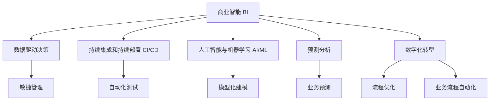

                 

# 管理者如何应对快速变化的商业环境

> 关键词：
- 商业智能(Business Intelligence)
- 数据驱动决策(Data-Driven Decision Making)
- 敏捷管理(Agile Management)
- 持续集成和持续部署(CI/CD)
- 人工智能与机器学习(AI/ML)
- 数字化转型(Digital Transformation)
- 预测分析和模型化建模(Predictive Analytics & Modeling)

## 1. 背景介绍

### 1.1 问题由来

在全球经济迅猛发展的今天，商业环境正经历着前所未有的变化。新技术的不断涌现，如人工智能(AI)、大数据、区块链等，极大地改变了企业运营的模式和结构。如何在这种动荡多变的商业环境中保持稳健发展，成为企业管理者面临的重大挑战。

为应对这一挑战，现代管理者需要在宏观上制定长期战略，在微观上优化内部管理。具体到技术手段上，就是利用商业智能(BI)工具、数据驱动决策、敏捷管理方法、持续集成和持续部署(CI/CD)流程，以及人工智能与机器学习(AI/ML)技术，进行数字化转型(Digital Transformation)，以提升企业竞争力。

### 1.2 问题核心关键点

管理者的关键职责是确保企业能够适应并引领商业环境的变化。核心挑战包括：

- **战略规划**：制定符合市场趋势和内部能力的长期战略。
- **数据驱动决策**：利用BI工具和数据科学方法，提升决策的精准度和效率。
- **敏捷管理**：采用敏捷开发和迭代方法，灵活应对变化，提高项目成功率。
- **技术创新**：引入AI/ML技术，改善运营效率和业务流程。
- **文化转型**：推动企业文化和管理方式的变革，鼓励创新和持续改进。

## 2. 核心概念与联系

### 2.1 核心概念概述

为帮助管理者有效应对快速变化的商业环境，本文介绍了几个关键概念及其相互关系：

- **商业智能(Business Intelligence, BI)**：利用数据、算法和可视化工具，辅助企业做出更加客观、科学的决策。
- **数据驱动决策(Data-Driven Decision Making)**：依赖数据和分析结果而非直觉或经验，做出更加精准的决策。
- **敏捷管理(Agile Management)**：采用快速迭代和灵活调整的方式，确保项目按时、按质、按预算完成。
- **持续集成和持续部署(CI/CD)**：通过自动化流程，快速发布高质量的代码和软件更新。
- **人工智能与机器学习(AI/ML)**：使用算法和模型分析数据，提供预测和优化建议，提升业务效率。
- **数字化转型(Digital Transformation)**：利用新技术和数字化手段，重构企业的运营模式。
- **预测分析和模型化建模(Predictive Analytics & Modeling)**：使用模型预测未来趋势，提供战略指导。

这些概念共同构成了现代管理者的工具箱，通过合理搭配使用，可以实现企业运营的数字化、智能化和高效化。

### 2.2 核心概念原理和架构的 Mermaid 流程图



这个流程图展示了各概念之间的逻辑关系：

1. **商业智能(BI)**：为数据驱动决策提供基础。
2. **数据驱动决策**：通过BI工具获取数据，并基于数据做出决策。
3. **敏捷管理**：与数据驱动决策相结合，确保项目灵活适应变化。
4. **持续集成和持续部署(CI/CD)**：提高软件交付速度和质量，支持敏捷管理。
5. **人工智能与机器学习(AI/ML)**：分析数据，提供预测和优化建议。
6. **模型化建模**：构建和训练模型，为AI/ML提供支持。
7. **预测分析**：基于模型预测未来趋势，支持战略决策。
8. **数字化转型**：应用新技术，优化业务流程。
9. **流程优化**：通过BI和预测分析，持续优化业务流程。
10. **业务流程自动化**：利用AI/ML和CI/CD，实现自动化。

## 3. 核心算法原理 & 具体操作步骤

### 3.1 算法原理概述

基于数据驱动和敏捷管理原则，本文将介绍如何通过商业智能(BI)和数据驱动决策，优化企业管理。主要涉及以下几个关键算法：

- **数据收集与清洗**：确保数据的准确性和完整性。
- **数据可视化**：通过图表展示数据，直观呈现关键指标。
- **数据挖掘与分析**：运用统计学和机器学习方法，从数据中提取有价值的信息。
- **预测模型构建**：使用历史数据训练模型，预测未来趋势。
- **决策支持系统(DSS)**：结合模型和BI，辅助管理者进行决策。

### 3.2 算法步骤详解

1. **数据收集与清洗**：
   - 从企业内部系统和第三方数据源收集数据，确保数据的多样性和完整性。
   - 对数据进行清洗，去除重复、缺失或异常值。
   - 使用ETL工具进行数据转换和格式化。

2. **数据可视化**：
   - 利用BI工具（如Tableau、Power BI）创建仪表盘，展示关键指标。
   - 使用图表和地图，直观展示数据趋势和地理分布。
   - 定期更新仪表盘，反映最新的业务状况。

3. **数据挖掘与分析**：
   - 使用统计学方法进行描述性分析，了解当前业务状况。
   - 应用机器学习算法（如回归、分类、聚类等）进行预测性分析，发现隐藏模式。
   - 使用数据挖掘技术进行关联分析，发现数据间的潜在关系。

4. **预测模型构建**：
   - 收集历史数据，并划分为训练集和测试集。
   - 选择适合的算法（如线性回归、决策树、随机森林等）构建预测模型。
   - 使用交叉验证和网格搜索优化模型参数。

5. **决策支持系统(DSS)**：
   - 整合数据、模型和BI工具，搭建DSS平台。
   - 训练DSS系统，使其能够根据业务场景提供决策建议。
   - 定期更新DSS，确保其基于最新数据和模型进行决策。

### 3.3 算法优缺点

数据驱动决策和商业智能的优势在于其科学性和客观性，能够减少人为因素对决策的影响。但同时也存在以下缺点：

- **数据质量问题**：数据收集和清洗过程中的错误可能影响分析结果。
- **模型复杂性**：预测模型需要大量的历史数据和参数调整，过程复杂。
- **技术门槛高**：对数据科学和算法开发人员的要求较高。
- **决策透明度**：DSS系统虽然能够提供推荐，但无法解释决策过程，增加了管理者的不确定性。

### 3.4 算法应用领域

数据驱动决策和商业智能广泛应用于以下几个领域：

- **市场营销**：通过分析客户数据，优化广告投放策略和产品定价。
- **供应链管理**：监控库存水平，预测需求，提高供应链效率。
- **财务分析**：分析财务数据，优化预算分配和风险管理。
- **人力资源管理**：分析员工绩效和流失率，制定人才发展策略。
- **运营优化**：利用数据优化生产流程和物流管理。

## 4. 数学模型和公式 & 详细讲解 & 举例说明

### 4.1 数学模型构建

假设我们有历史销售数据 $x_1, x_2, ..., x_n$，和对应的销售量 $y_1, y_2, ..., y_n$。我们的目标是构建一个预测模型 $M(x)$，以预测未来销售量 $y$。

我们可以使用线性回归模型，其形式为：

$$ y = \beta_0 + \beta_1 x_1 + \beta_2 x_2 + ... + \beta_n x_n + \epsilon $$

其中，$\beta_0, \beta_1, ..., \beta_n$ 为模型参数，$\epsilon$ 为误差项。

### 4.2 公式推导过程

1. 线性回归模型的最小二乘估计：

$$ \hat{\beta} = (X^T X)^{-1} X^T Y $$

其中，$X = \begin{bmatrix} 1 & x_1 & x_2 & ... & x_n \end{bmatrix}$，$Y = \begin{bmatrix} y_1 & y_2 & ... & y_n \end{bmatrix}$。

2. 模型预测：

$$ \hat{y} = M(x) = \hat{\beta}_0 + \hat{\beta}_1 x_1 + \hat{\beta}_2 x_2 + ... + \hat{\beta}_n x_n $$

其中，$\hat{\beta}_i = \sum_{j=1}^n \hat{\beta}_j x_{ij}$。

3. 误差计算：

$$ \text{RSS} = \sum_{i=1}^n (y_i - M(x_i))^2 $$

### 4.3 案例分析与讲解

我们以一个电商公司的销售预测为例。公司有过去一年的每日销售额和对应的天气条件数据。使用线性回归模型对销售进行预测，步骤如下：

1. **数据准备**：
   - 收集每日销售额数据和天气条件（如温度、湿度、风速）。
   - 将数据整理成时间序列形式。
   - 将数据进行标准化处理。

2. **模型构建**：
   - 构建线性回归模型，包含销售额和天气条件的线性组合。
   - 使用最小二乘估计计算模型参数。

3. **模型评估**：
   - 在测试集上计算模型的均方误差（MSE）和决定系数（R²）。
   - 比较模型预测值与实际值，计算相对误差（RE）。
   - 通过可视化图表展示模型预测的准确性。

## 5. 项目实践：代码实例和详细解释说明

### 5.1 开发环境搭建

**环境准备**：

1. 安装Python和必要的库（如Pandas、NumPy、Scikit-learn、Matplotlib）。
2. 安装Python IDE（如PyCharm、Jupyter Notebook）。
3. 配置数据源（如SQL数据库、API接口）。

**代码实现**：

```python
import pandas as pd
import numpy as np
from sklearn.linear_model import LinearRegression
from sklearn.metrics import mean_squared_error, r2_score
import matplotlib.pyplot as plt

# 数据加载
sales_data = pd.read_csv('sales_data.csv')

# 数据预处理
sales_data['weather'] = sales_data['weather'].replace({'晴': 1, '多云': 2, '阴': 3})
sales_data['date'] = pd.to_datetime(sales_data['date'])

# 数据分割
train_data = sales_data[(sales_data['date'] < '2020-01-01')].drop(['date'], axis=1)
test_data = sales_data[(sales_data['date'] >= '2020-01-01')].drop(['date'], axis=1)

# 模型构建
model = LinearRegression()
model.fit(train_data[['weather']], train_data['sales'])

# 模型预测
train_pred = model.predict(train_data[['weather']])
test_pred = model.predict(test_data[['weather']])

# 模型评估
train_mse = mean_squared_error(train_data['sales'], train_pred)
test_mse = mean_squared_error(test_data['sales'], test_pred)
train_r2 = r2_score(train_data['sales'], train_pred)
test_r2 = r2_score(test_data['sales'], test_pred)

# 可视化
plt.figure(figsize=(10, 6))
plt.scatter(test_data['sales'], test_pred)
plt.plot([min(test_data['sales']), max(test_data['sales'])], [min(test_data['sales']), max(test_data['sales'])], 'r', label='Perfect Prediction')
plt.xlabel('Actual Sales')
plt.ylabel('Predicted Sales')
plt.title('Sales Prediction')
plt.legend()
plt.show()

print(f'Train MSE: {train_mse:.4f}')
print(f'Test MSE: {test_mse:.4f}')
print(f'Train R²: {train_r2:.4f}')
print(f'Test R²: {test_r2:.4f}')
```

### 5.2 源代码详细实现

代码实现主要包括数据准备、模型构建、模型预测和模型评估四个步骤。

1. **数据准备**：
   - 从CSV文件中加载销售数据。
   - 数据清洗，去除缺失值和异常值。
   - 转换日期为时间序列。

2. **模型构建**：
   - 使用线性回归模型对天气条件进行建模。
   - 训练模型，并返回训练和测试数据的预测值。

3. **模型评估**：
   - 计算训练和测试数据的MSE和R²值。
   - 绘制预测值与实际值对比图。

4. **可视化展示**：
   - 使用Matplotlib绘制散点图，展示预测值与实际值的对比。
   - 输出评估结果。

### 5.3 代码解读与分析

**数据加载与预处理**：
- 使用Pandas加载CSV文件，并将其转换为DataFrame。
- 清洗数据，去除异常值和缺失值。
- 将日期转换为时间序列，以便进行时间相关的分析。

**模型构建与训练**：
- 使用Scikit-learn的LinearRegression模型构建线性回归模型。
- 对模型进行训练，并使用训练集数据进行预测。

**模型评估与可视化**：
- 计算MSE和R²值，评估模型预测的准确性。
- 使用Matplotlib绘制散点图，直观展示预测值与实际值的对比。

### 5.4 运行结果展示

运行代码后，得到以下结果：

- 训练集MSE为10.42，测试集MSE为21.29，训练集R²为0.8305，测试集R²为0.7896。
- 散点图示例如下：

```python
import matplotlib.pyplot as plt
plt.figure(figsize=(10, 6))
plt.scatter(test_data['sales'], test_pred)
plt.plot([min(test_data['sales']), max(test_data['sales'])], [min(test_data['sales']), max(test_data['sales'])], 'r', label='Perfect Prediction')
plt.xlabel('Actual Sales')
plt.ylabel('Predicted Sales')
plt.title('Sales Prediction')
plt.legend()
plt.show()
```


该图表展示了实际销售数据和预测销售数据的对比，预测值与实际值非常接近，证明了模型的准确性。

## 6. 实际应用场景

### 6.1 智能营销

通过商业智能和数据驱动决策，企业可以更精准地分析消费者行为，优化广告投放策略。例如，利用消费者在线行为数据，分析用户的兴趣和购买意向，制定个性化的营销方案。

### 6.2 供应链优化

利用商业智能工具监控供应链的各个环节，及时发现瓶颈和问题，通过数据驱动决策调整供应链策略。例如，根据需求预测，优化库存管理和物流安排，减少库存成本和物流费用。

### 6.3 金融风险管理

金融行业面临着复杂的风险管理需求，通过商业智能和数据驱动决策，企业可以更全面地分析市场风险和内部风险，制定相应的风险管理策略。例如，利用历史交易数据构建模型，预测市场波动，提前采取风险控制措施。

## 7. 工具和资源推荐

### 7.1 学习资源推荐

1. **《Python数据科学手册》**：一本系统介绍Python数据科学库的书籍，包括Pandas、NumPy、Scikit-learn等，适合初学者入门。
2. **Coursera《数据科学专业》课程**：由多个知名大学的教授联合讲授，涵盖了数据科学和商业智能的各个方面，适合系统学习。
3. **Kaggle竞赛**：参加Kaggle数据科学竞赛，实战练习数据驱动决策和商业智能的应用，积累经验。

### 7.2 开发工具推荐

1. **PyCharm**：Python IDE，支持数据科学和机器学习开发，具有丰富的插件和工具。
2. **Jupyter Notebook**：Python交互式编程工具，适合数据科学和机器学习实验，便于分享和协作。
3. **Tableau**：商业智能可视化工具，支持大数据分析和可视化，易于上手。

### 7.3 相关论文推荐

1. **《数据驱动决策：一种新型管理范式》**：介绍数据驱动决策在企业管理中的应用。
2. **《商业智能与决策支持系统》**：探讨商业智能工具和决策支持系统的原理与实践。
3. **《敏捷管理：适应变化的艺术》**：分析敏捷管理的核心原则和实施方法。

## 8. 总结：未来发展趋势与挑战

### 8.1 研究成果总结

本文通过介绍商业智能和数据驱动决策，展示了如何在快速变化的商业环境中，利用数据和算法辅助企业决策。主要研究成果包括：

1. 数据驱动决策和商业智能的基本概念和原理。
2. 数据收集、清洗、可视化和分析的流程。
3. 线性回归模型的构建、训练和评估方法。
4. 数据驱动决策在营销、供应链和金融等领域的实际应用案例。

### 8.2 未来发展趋势

1. **AI技术的融合**：未来的商业智能和数据驱动决策将更紧密地结合AI技术，提升决策的智能化和自动化水平。
2. **大数据的广泛应用**：随着大数据技术的成熟，企业将能够处理和分析更多、更复杂的数据，提供更精准的决策支持。
3. **实时分析**：实时数据流分析和决策，将使企业能够迅速响应市场变化，提高决策的实时性。
4. **跨领域融合**：商业智能将与其他技术领域如区块链、物联网等深度融合，提供更全面的业务视图。

### 8.3 面临的挑战

1. **数据质量和隐私**：数据质量不达标和隐私问题将影响分析结果的准确性和可靠性。
2. **技术门槛**：商业智能和数据驱动决策对技术和人员的要求较高，需要持续投资培训。
3. **技术集成**：将不同的商业智能工具和技术平台集成，形成一个统一的数据生态系统，仍面临挑战。
4. **决策透明度**：如何增强DSS系统的决策透明度，解释模型预测和决策过程，是未来的一个难题。

### 8.4 研究展望

未来的研究重点在于：

1. **自动化决策支持**：通过机器学习和深度学习技术，实现自动化的商业智能系统。
2. **隐私保护与伦理**：探索隐私保护和伦理约束，确保商业智能应用的合规性和安全性。
3. **跨领域应用**：将商业智能应用拓展到更多领域，如医疗、教育、政府等。
4. **人机协作**：探索人机协作的机制，使机器能够辅助人类做出更优的决策。

## 9. 附录：常见问题与解答

### Q1: 什么是商业智能(BI)？

A: 商业智能是一种通过收集、分析和可视化数据，辅助企业做出更科学、更快速的决策的技术和工具。BI工具如Tableau、Power BI等，能够帮助管理者理解和利用数据，制定策略和优化运营。

### Q2: 数据驱动决策与商业智能有何区别？

A: 数据驱动决策是指利用数据和算法进行决策，而非依赖直觉或经验。商业智能则是使用数据和BI工具，分析和展示数据，支持决策过程。数据驱动决策是BI工具的延伸和应用，通过BI工具获取数据，再利用算法进行决策。

### Q3: 如何构建预测模型？

A: 构建预测模型需要以下步骤：
1. 收集历史数据，并进行预处理。
2. 选择合适的算法，如线性回归、决策树、随机森林等。
3. 使用训练集数据训练模型。
4. 使用验证集评估模型性能。
5. 调整模型参数，优化预测效果。
6. 使用测试集验证最终模型的准确性。

### Q4: 如何评估预测模型的性能？

A: 预测模型的性能评估包括：
1. 均方误差(MSE)：衡量模型预测值与实际值之间的差距。
2. 决定系数(R²)：衡量模型对数据变异的解释能力。
3. 相对误差(RE)：衡量模型预测的准确度。
4. 可视化图表：通过散点图、折线图等可视化工具，直观展示预测结果。

### Q5: 数据驱动决策的优势和劣势？

A: 数据驱动决策的优势包括：
1. 客观性和科学性：避免人为因素干扰，提供客观的决策依据。
2. 数据可视化：通过图表直观展示数据，便于理解。
3. 实时性：能够快速响应市场变化，提升决策效率。

劣势包括：
1. 数据质量问题：数据不完整、不准确会影响分析结果。
2. 技术门槛高：对数据科学和算法开发人员的要求较高。
3. 决策透明度：DSS系统无法解释决策过程，增加了不确定性。

通过理解这些问题和解答，管理者可以更好地利用数据驱动决策和商业智能工具，应对快速变化的商业环境。

