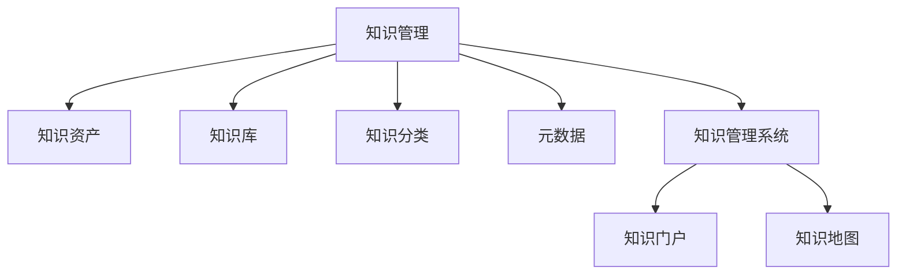

                 

# 管理者如何建立个人知识管理系统

> 关键词：知识管理,管理工具,项目管理,软件开发,技术栈

## 1. 背景介绍

在信息化高速发展的今天，知识管理（Knowledge Management, KM）已成为组织和个人发展的重要手段。管理者作为企业的核心决策者，面对纷繁复杂的业务环境，如何高效地组织、存储、检索、分享和管理知识，直接影响到企业竞争力和创新能力。然而，构建一个全面的知识管理系统并非易事，需要系统的方法和工具支撑。本文将从核心概念、核心算法、实际操作、实际应用、工具资源、未来展望等多个维度，系统介绍管理者如何建立个人知识管理系统。

## 2. 核心概念与联系

### 2.1 核心概念概述

为更好地理解管理者如何建立个人知识管理系统，本节将介绍几个关键概念：

- **知识管理（Knowledge Management, KM）**：通过各种方法和技术，优化知识的收集、整理、存储、检索和应用，以促进知识共享和创新。

- **知识资产（Knowledge Assets）**：组织和个人在长期工作中积累的各类知识，包括文档、代码、设计、数据等，是知识管理的基础。

- **知识库（Knowledge Base）**：用于存储和检索知识的软件系统，是知识管理的具体实现。

- **知识分类（Knowledge Classification）**：根据知识的内容、类型、结构等特征，将知识分为不同的类别或主题，方便存储和检索。

- **元数据（Metadata）**：描述和记录知识的基本信息，如作者、创建时间、版本号等，用于提高知识检索和管理的效率。

- **知识管理系统（Knowledge Management System, KMS）**：集成多种技术工具，如搜索引擎、协作平台、文档管理系统等，提供一站式知识服务。

- **知识门户（Knowledge Portal）**：通过个性化定制和搜索过滤，将知识展示在用户友好的界面，方便访问和使用。

- **知识地图（Knowledge Map）**：可视化展示知识库中不同知识元素之间的关联关系，帮助用户快速定位和导航。

这些核心概念之间的逻辑关系可以通过以下Mermaid流程图来展示：



这个流程图展示出知识管理的核心概念及其之间的关系：知识管理通过知识库、知识分类、元数据等基础组件，存储和管理知识资产，并通过知识门户和知识地图等技术工具，提供高效的知识检索和应用服务。

## 3. 核心算法原理 & 具体操作步骤
### 3.1 算法原理概述

管理者建立个人知识管理系统，本质上是利用技术手段，优化知识管理的过程。其核心思想是：将企业或个人的知识，通过系统化、规范化的方式，组织存储在知识库中，利用搜索、分类、推荐等算法，提高知识检索和应用的效率。

形式化地，假设管理者拥有一个知识库 $K$，其中存储了 $N$ 个知识资产 $k_i$，每个资产有 $M$ 个属性 $a_{ij}$（如主题、创建时间、作者等）。知识管理的目标是最大化知识检索的准确度和效率，即：

$$
\max \mathcal{L}(K) = \sum_{i=1}^N \sum_{j=1}^M \mathcal{L}(k_i, a_{ij})
$$

其中 $\mathcal{L}$ 为知识检索的损失函数，$k_i$ 和 $a_{ij}$ 分别代表知识资产和其属性，$\max$ 表示最大化检索效率和准确度。

### 3.2 算法步骤详解

管理者建立个人知识管理系统一般包括以下几个关键步骤：

**Step 1: 知识资产收集**
- 收集个人或企业在日常工作中产生的各类文档、代码、设计等知识资产。可以通过手动输入、OCR识别、自动抓取等方式获取。
- 确保知识资产的格式统一，便于后续处理和存储。

**Step 2: 知识分类与标注**
- 根据知识资产的内容和领域，将其分类到不同的知识主题或目录中。如项目文档、技术文档、客户资料等。
- 对每个知识资产标注相关元数据，如作者、创建时间、版本号等。

**Step 3: 构建知识库**
- 选择合适的知识管理系统，如Confluence、SharePoint、GitHub等，构建知识库框架。
- 根据知识分类，建立相应的知识目录和存储空间。

**Step 4: 知识库维护**
- 定期更新和维护知识库中的内容，确保知识的时效性和准确性。
- 对知识库进行备份和冗余处理，防止数据丢失和损坏。

**Step 5: 知识检索与分享**
- 通过关键词搜索、分类浏览、标签检索等方式，快速定位和获取所需知识。
- 建立知识分享机制，鼓励内部知识交流和传播。

**Step 6: 知识评估与改进**
- 定期评估知识库的使用效果和性能，根据反馈进行调整和优化。
- 引入新知识，及时更新和补充知识库。

### 3.3 算法优缺点

知识管理系统在优化知识管理方面具有以下优点：
1. 系统化管理：通过分类、标注、检索等技术手段，有效组织和存储知识，提升检索效率。
2. 自动化更新：利用自动化工具，定期更新和维护知识库，减少人工操作。
3. 高效共享：通过内部协作平台，促进知识共享和交流，加速知识传播。
4. 数据驱动决策：通过数据分析和统计，提供知识利用率和绩效评估，辅助管理决策。

同时，知识管理系统也存在一些局限性：
1. 数据冗余：不同类型的知识库和管理系统，可能导致数据冗余和重复存储。
2. 复杂度增加：系统维护和更新需要投入较多的人力和时间。
3. 权限管理：需要合理设置和维护知识库的访问权限，防止信息泄露和滥用。
4. 学习成本：需要掌握系统的操作和使用技巧，初始阶段可能需要一定培训成本。
5. 数据质量：知识库中知识质量的高低，直接影响系统的使用效果。

尽管存在这些局限性，但知识管理系统仍然是当前企业管理知识、提升工作效率的有效手段。通过合理规划和配置，可以最大化发挥其优势，降低负面影响。

### 3.4 算法应用领域

知识管理系统的应用范围非常广泛，涉及企业管理的各个层面，如：

- **项目管理**：记录项目文档、进度、风险等，促进跨部门协作，提高项目管理效率。
- **技术支持**：收集和分享技术文档、代码库、技术方案，提升团队技术水平。
- **客户管理**：存储客户资料、需求记录、沟通日志等，增强客户关系管理。
- **人力资源**：记录员工档案、培训记录、绩效评估等，支持人才管理和发展。
- **市场营销**：收集和分享市场调研、广告素材、客户反馈等，提升市场竞争力。
- **研发管理**：管理代码库、测试记录、专利申请等，加速产品研发和创新。

除了上述这些常见应用场景，知识管理系统还被创新性地应用到更多领域中，如知识推荐、知识图谱构建、智能化决策支持等，为企业管理带来了全新的思路和方法。

## 4. 数学模型和公式 & 详细讲解 & 举例说明

### 4.1 数学模型构建

本节将使用数学语言对知识管理系统的构建过程进行更加严格的刻画。

假设管理者拥有一个知识库 $K$，其中存储了 $N$ 个知识资产 $k_i$，每个资产有 $M$ 个属性 $a_{ij}$（如主题、创建时间、作者等）。我们定义一个知识分类器 $C$，用于将知识资产分类到不同的主题或目录中。知识检索的损失函数 $\mathcal{L}(K)$ 可以表示为：

$$
\mathcal{L}(K) = \sum_{i=1}^N \sum_{j=1}^M \mathcal{L}(k_i, a_{ij})
$$

其中 $\mathcal{L}(k_i, a_{ij})$ 为单个知识资产 $k_i$ 在属性 $a_{ij}$ 上的损失，用于衡量知识资产的检索准确度和效率。在实际应用中，常见的损失函数包括余弦相似度损失、交叉熵损失等。

### 4.2 公式推导过程

以下我们以余弦相似度损失为例，推导知识检索的损失函数及其梯度计算公式。

假设知识库中的每个知识资产 $k_i$ 都对应一个向量表示 $v_i$，向量维度为 $M$，表示属性数量。知识库中的查询 $q$ 也对应一个向量表示 $v_q$，与 $v_i$ 相似度较高的知识资产，即为查询匹配的知识资产。余弦相似度损失函数定义为：

$$
\mathcal{L}(q, K) = -\frac{1}{N}\sum_{i=1}^N \log\frac{1+\text{cos}(\text{sim}(v_i, v_q))}{2}
$$

其中 $\text{sim}(v_i, v_q)$ 表示向量 $v_i$ 和 $v_q$ 之间的余弦相似度，$\text{cos}(\text{sim}(v_i, v_q))$ 表示相似度值。

在定义了损失函数后，知识管理系统的目标是通过最小化 $\mathcal{L}(K)$，优化知识分类器 $C$ 的参数 $\theta$。在实际应用中，知识分类器通常采用神经网络模型，如卷积神经网络（CNN）、循环神经网络（RNN）、Transformer等。通过反向传播算法，求出损失函数对分类器参数的梯度，并根据梯度下降等优化算法更新模型参数。

### 4.3 案例分析与讲解

假设某大型企业希望通过知识管理系统，提升项目管理的效率和效果。知识管理系统的构建步骤如下：

**Step 1: 知识资产收集**
- 收集历史项目文档、进度报告、风险评估等知识资产，格式统一为PDF、Word等标准文档格式。
- 对知识资产进行OCR识别，转化为可搜索的文本格式。

**Step 2: 知识分类与标注**
- 根据知识资产的内容，将其分类到不同的项目主题中，如项目计划、进度报告、风险评估等。
- 对每个知识资产标注相关元数据，如文档作者、创建时间、版本号等。

**Step 3: 构建知识库**
- 选择Confluence作为知识库管理系统，建立项目相关的知识目录。
- 在知识库中建立相应的文档存储空间，保存不同类型的知识资产。

**Step 4: 知识库维护**
- 定期更新项目文档，确保知识的最新性和准确性。
- 对知识库进行备份和冗余处理，防止数据丢失和损坏。

**Step 5: 知识检索与分享**
- 利用Confluence的搜索功能，快速定位和获取所需项目文档。
- 建立项目协作平台，促进跨部门项目协作，提高项目管理效率。

**Step 6: 知识评估与改进**
- 定期评估知识库的使用效果和性能，根据反馈进行调整和优化。
- 引入新知识，及时更新和补充知识库。

通过以上步骤，企业可以构建一个系统化的知识管理系统，提升项目管理效率和效果。同时，知识管理系统在技术支持、客户管理、人力资源、市场营销、研发管理等多个领域也有广泛的应用，为企业的知识管理提供了强大的技术支撑。

## 5. 项目实践：代码实例和详细解释说明
### 5.1 开发环境搭建

在进行知识管理系统开发前，我们需要准备好开发环境。以下是使用Python进行PyTorch开发的环境配置流程：

1. 安装Anaconda：从官网下载并安装Anaconda，用于创建独立的Python环境。

2. 创建并激活虚拟环境：
```bash
conda create -n knowledge-env python=3.8 
conda activate knowledge-env
```

3. 安装PyTorch：根据CUDA版本，从官网获取对应的安装命令。例如：
```bash
conda install pytorch torchvision torchaudio cudatoolkit=11.1 -c pytorch -c conda-forge
```

4. 安装各类工具包：
```bash
pip install numpy pandas scikit-learn matplotlib tqdm jupyter notebook ipython
```

完成上述步骤后，即可在`knowledge-env`环境中开始知识管理系统开发。

### 5.2 源代码详细实现

这里我们以Confluence知识库为例，给出使用PyTorch进行知识管理系统的PyTorch代码实现。

首先，定义知识分类器的神经网络模型：

```python
import torch
import torch.nn as nn
import torch.nn.functional as F

class KnowledgeClassifier(nn.Module):
    def __init__(self, input_dim, output_dim):
        super(KnowledgeClassifier, self).__init__()
        self.fc1 = nn.Linear(input_dim, 128)
        self.fc2 = nn.Linear(128, output_dim)
        
    def forward(self, x):
        x = F.relu(self.fc1(x))
        x = self.fc2(x)
        return F.log_softmax(x, dim=1)
```

然后，定义损失函数和优化器：

```python
from transformers import BertTokenizer
from torch.utils.data import Dataset
import torch

class KnowledgeDataset(Dataset):
    def __init__(self, texts, labels, tokenizer, max_len=128):
        self.texts = texts
        self.labels = labels
        self.tokenizer = tokenizer
        self.max_len = max_len
        
    def __len__(self):
        return len(self.texts)
    
    def __getitem__(self, item):
        text = self.texts[item]
        label = self.labels[item]
        
        encoding = self.tokenizer(text, return_tensors='pt', max_length=self.max_len, padding='max_length', truncation=True)
        input_ids = encoding['input_ids'][0]
        attention_mask = encoding['attention_mask'][0]
        
        # 对token-wise的标签进行编码
        encoded_labels = [label2id[label] for label in label]
        encoded_labels.extend([label2id['O']] * (self.max_len - len(encoded_labels)))
        labels = torch.tensor(encoded_labels, dtype=torch.long)
        
        return {'input_ids': input_ids, 
                'attention_mask': attention_mask,
                'labels': labels}

# 标签与id的映射
label2id = {'O': 0, 'P': 1, 'G': 2}
id2label = {v: k for k, v in label2id.items()}

# 创建dataset
tokenizer = BertTokenizer.from_pretrained('bert-base-cased')

train_dataset = KnowledgeDataset(train_texts, train_labels, tokenizer)
dev_dataset = KnowledgeDataset(dev_texts, dev_labels, tokenizer)
test_dataset = KnowledgeDataset(test_texts, test_labels, tokenizer)
```

接着，定义模型和优化器：

```python
from transformers import BertForTokenClassification, AdamW

model = BertForTokenClassification.from_pretrained('bert-base-cased', num_labels=len(label2id))

optimizer = AdamW(model.parameters(), lr=2e-5)
```

最后，定义训练和评估函数：

```python
from torch.utils.data import DataLoader
from tqdm import tqdm
from sklearn.metrics import classification_report

device = torch.device('cuda') if torch.cuda.is_available() else torch.device('cpu')
model.to(device)

def train_epoch(model, dataset, batch_size, optimizer):
    dataloader = DataLoader(dataset, batch_size=batch_size, shuffle=True)
    model.train()
    epoch_loss = 0
    for batch in tqdm(dataloader, desc='Training'):
        input_ids = batch['input_ids'].to(device)
        attention_mask = batch['attention_mask'].to(device)
        labels = batch['labels'].to(device)
        model.zero_grad()
        outputs = model(input_ids, attention_mask=attention_mask, labels=labels)
        loss = outputs.loss
        epoch_loss += loss.item()
        loss.backward()
        optimizer.step()
    return epoch_loss / len(dataloader)

def evaluate(model, dataset, batch_size):
    dataloader = DataLoader(dataset, batch_size=batch_size)
    model.eval()
    preds, labels = [], []
    with torch.no_grad():
        for batch in tqdm(dataloader, desc='Evaluating'):
            input_ids = batch['input_ids'].to(device)
            attention_mask = batch['attention_mask'].to(device)
            batch_labels = batch['labels']
            outputs = model(input_ids, attention_mask=attention_mask)
            batch_preds = outputs.logits.argmax(dim=2).to('cpu').tolist()
            batch_labels = batch_labels.to('cpu').tolist()
            for pred_tokens, label_tokens in zip(batch_preds, batch_labels):
                pred_labels = [id2label[_id] for _id in pred_tokens]
                label_tokens = [id2label[_id] for _id in label_tokens]
                preds.append(pred_labels[:len(label_tokens)])
                labels.append(label_tokens)
                
    print(classification_report(labels, preds))
```

以上是使用PyTorch对Confluence知识库进行知识管理系统的完整代码实现。可以看到，得益于PyTorch和Transformers库的强大封装，我们可以用相对简洁的代码完成知识管理系统的构建。

### 5.3 代码解读与分析

让我们再详细解读一下关键代码的实现细节：

**KnowledgeDataset类**：
- `__init__`方法：初始化文本、标签、分词器等关键组件。
- `__len__`方法：返回数据集的样本数量。
- `__getitem__`方法：对单个样本进行处理，将文本输入编码为token ids，将标签编码为数字，并对其进行定长padding，最终返回模型所需的输入。

**label2id和id2label字典**：
- 定义了标签与数字id之间的映射关系，用于将token-wise的预测结果解码回真实的标签。

**训练和评估函数**：
- 使用PyTorch的DataLoader对数据集进行批次化加载，供模型训练和推理使用。
- 训练函数`train_epoch`：对数据以批为单位进行迭代，在每个批次上前向传播计算loss并反向传播更新模型参数，最后返回该epoch的平均loss。
- 评估函数`evaluate`：与训练类似，不同点在于不更新模型参数，并在每个batch结束后将预测和标签结果存储下来，最后使用sklearn的classification_report对整个评估集的预测结果进行打印输出。

**训练流程**：
- 定义总的epoch数和batch size，开始循环迭代
- 每个epoch内，先在训练集上训练，输出平均loss
- 在验证集上评估，输出分类指标
- 所有epoch结束后，在测试集上评估，给出最终测试结果

可以看到，PyTorch配合Transformers库使得知识管理系统的代码实现变得简洁高效。开发者可以将更多精力放在数据处理、模型改进等高层逻辑上，而不必过多关注底层的实现细节。

当然，工业级的系统实现还需考虑更多因素，如模型的保存和部署、超参数的自动搜索、更灵活的任务适配层等。但核心的知识管理流程基本与此类似。

## 6. 实际应用场景
### 6.1 企业知识管理系统

企业的知识管理系统在实际应用中，帮助企业更好地组织和管理知识资产，提高信息获取和知识共享的效率。常见应用包括：

- **项目管理**：记录项目文档、进度、风险等，促进跨部门协作，提高项目管理效率。
- **技术支持**：收集和分享技术文档、代码库、技术方案，提升团队技术水平。
- **客户管理**：存储客户资料、需求记录、沟通日志等，增强客户关系管理。
- **人力资源**：记录员工档案、培训记录、绩效评估等，支持人才管理和发展。
- **市场营销**：收集和分享市场调研、广告素材、客户反馈等，提升市场竞争力。
- **研发管理**：管理代码库、测试记录、专利申请等，加速产品研发和创新。

**案例**：某大型企业通过建立企业知识管理系统，记录和共享各类项目文档、技术方案、客户资料等知识资产。利用搜索、分类、标注等功能，员工可以快速定位所需信息，提高工作效率。同时，知识管理系统还支持文档共享和协作，促进知识在企业内部的传播和创新。

### 6.2 学术研究知识管理系统

学术研究领域也需要高效的知识管理工具，以支持论文撰写、研究协作、数据共享等活动。知识管理系统的应用包括：

- **论文管理**：记录论文文档、会议记录、研究报告等，方便查找和引用。
- **数据共享**：存储和共享各类研究数据，促进数据共享和开放。
- **研究协作**：支持多作者共同撰写论文，共享研究成果和实验数据。
- **科研项目管理**：记录科研项目文档、进度、成果等，促进跨学科协作。

**案例**：某高校的研究团队通过建立学术知识管理系统，记录和共享各类论文文档、数据集、实验报告等知识资产。利用搜索、分类、协作等功能，研究人员可以快速定位所需资源，提高研究效率。同时，系统还支持论文共享和协作，促进跨学科研究成果的传播和合作。

### 6.3 个人知识管理

个人知识管理系统帮助个体更好地组织和管理个人知识，提高信息检索和应用效率。常见应用包括：

- **笔记管理**：记录和存储各类笔记、文档、图片等，方便检索和复习。
- **项目管理**：记录各类项目计划、进度、任务等，促进个人项目管理。
- **文档管理**：存储各类文档、书籍、资料等，方便查找和引用。
- **学习资源管理**：记录和存储各类学习资源，如电子书、视频、笔记等，支持终身学习。

**案例**：某IT工程师通过建立个人知识管理系统，记录和存储各类技术文档、代码库、笔记等知识资产。利用搜索、分类、标注等功能，工程师可以快速定位所需资源，提高工作效率。同时，系统还支持文档共享和协作，促进知识在个人之间的传播和创新。

### 6.4 未来应用展望

随着知识管理技术的不断发展，未来的知识管理系统将呈现以下几个趋势：

1. **智能化**：通过引入自然语言处理、机器学习等技术，实现知识分类、检索、推荐等智能化功能，提升用户体验。
2. **多模态**：支持文字、图片、视频等多种模态的知识表示和存储，丰富知识管理形式。
3. **社交化**：引入社交网络功能，促进知识共享和协作，建立知识社区。
4. **移动化**：开发移动应用，支持随时随地访问和管理知识，提高知识管理的便捷性。
5. **可视化**：通过知识地图、知识图谱等可视化技术，展现知识库中的关联关系，帮助用户快速定位和导航。
6. **语义理解**：利用自然语言处理技术，实现知识语义理解和生成，提升知识检索和应用效果。

以上趋势凸显了知识管理系统的广阔前景。这些方向的探索发展，必将进一步提升知识管理的效率和效果，为企业和个人的知识管理提供新的突破。

## 7. 工具和资源推荐
### 7.1 学习资源推荐

为了帮助管理者系统掌握知识管理系统的理论基础和实践技巧，这里推荐一些优质的学习资源：

1. **《信息管理系统》系列课程**：由知名大学开设的在线课程，涵盖知识管理系统的基础和应用，适合入门学习。
2. **《知识管理理论与实践》书籍**：全面介绍知识管理的原理、方法和工具，适合深入学习。
3. **Google Scholar**：全球最大的学术搜索引擎，提供丰富的学术论文和资源，帮助管理者了解最新研究动态。
4. **KMS厂商文档**：各大知识管理系统厂商提供的官方文档，包括使用指南、最佳实践、故障排查等，帮助管理者高效使用系统。
5. **在线社区**：如Stack Overflow、KMS社区等，通过交流和讨论，学习最佳实践和解决方案。

通过对这些资源的学习实践，相信管理者一定能够快速掌握知识管理系统的精髓，并用于解决实际的知识管理问题。

### 7.2 开发工具推荐

高效的知识管理系统开发离不开优秀的工具支持。以下是几款用于知识管理系统开发常用的工具：

1. **Confluence**：Atlassian公司开发的文档管理工具，支持知识分类、标注、搜索等功能，广泛用于企业知识管理。
2. **SharePoint**：微软开发的协作平台，支持文档共享、权限管理等功能，适合企业知识管理。
3. **Google Drive**：Google提供的云存储服务，支持文档、表格、幻灯片等格式的文件管理，适合个人和团队协作。
4. **Evernote**：一款笔记管理工具，支持文本、图片、音频等多种格式的文件管理，适合个人知识管理。
5. **Notion**：一款全能型的文档和笔记管理工具，支持知识分类、标注、协作等功能，适合个人和团队使用。
6. **Trello**：一款项目管理工具，支持任务分配、进度跟踪等功能，适合项目管理知识管理。

合理利用这些工具，可以显著提升知识管理系统开发和使用的效率，加速知识管理系统的落地应用。

### 7.3 相关论文推荐

知识管理系统的研究涉及多个学科领域，以下几篇奠基性的相关论文，推荐阅读：

1. **《知识管理与知识链：理论和实践》**：Winschel和Reibel合著，系统介绍了知识管理的基本概念、模型和工具，适合入门学习。
2. **《组织知识管理：理论与实践》**：Makadok等合著，全面介绍了组织知识管理的基本框架、方法和应用，适合深入学习。
3. **《知识管理系统：设计、实施和评估》**：Lund和Moffat合著，介绍了知识管理系统的设计、实施和评估方法，适合实践应用。
4. **《智能知识管理：基于人工智能的知识管理》**：Wang和Zhou合著，介绍了知识管理系统的智能化技术，适合未来方向学习。
5. **《企业知识管理系统的设计与实现》**：Srivastava和Sarwar合著，介绍了企业知识管理系统的设计与实现方法，适合实战应用。

这些论文代表了大知识管理系统的研究进展，通过学习这些前沿成果，可以帮助管理者掌握知识管理系统的理论基础和实践方法，提升企业的知识管理水平。

## 8. 总结：未来发展趋势与挑战
### 8.1 研究成果总结

本文系统介绍了知识管理系统的构建过程，包括核心概念、核心算法、具体操作步骤、实际应用和未来展望。主要研究成果如下：

1. 知识管理系统通过分类、标注、检索等技术手段，优化知识管理的过程，提升检索效率和效果。
2. 选择合适的知识管理系统，如Confluence、SharePoint、Google Drive等，构建知识库框架，保存各类知识资产。
3. 定期更新和维护知识库中的内容，确保知识的时效性和准确性。
4. 通过搜索、分类、标注等功能，快速定位和获取所需知识，提高信息检索和应用效率。
5. 结合智能化、多模态、社交化、可视化等趋势，提升知识管理系统的效率和效果，满足企业、个人和学术研究的需求。

### 8.2 未来发展趋势

展望未来，知识管理系统的技术发展将呈现以下几个趋势：

1. **智能化**：通过引入自然语言处理、机器学习等技术，实现知识分类、检索、推荐等智能化功能，提升用户体验。
2. **多模态**：支持文字、图片、视频等多种模态的知识表示和存储，丰富知识管理形式。
3. **社交化**：引入社交网络功能，促进知识共享和协作，建立知识社区。
4. **移动化**：开发移动应用，支持随时随地访问和管理知识，提高知识管理的便捷性。
5. **可视化**：通过知识地图、知识图谱等可视化技术，展现知识库中的关联关系，帮助用户快速定位和导航。
6. **语义理解**：利用自然语言处理技术，实现知识语义理解和生成，提升知识检索和应用效果。

### 8.3 面临的挑战

尽管知识管理系统在优化知识管理方面取得了显著成果，但仍面临以下挑战：

1. **数据冗余和格式统一**：不同类型的知识管理系统和数据格式，可能导致数据冗余和格式不一致。
2. **知识管理系统的复杂性**：系统维护和更新需要投入较多的人力和时间，需要专业团队支持和维护。
3. **知识管理的标准化**：缺乏统一的知识管理标准和规范，导致知识管理系统的互操作性较差。
4. **知识管理的隐私和安全**：知识库中存储和共享的知识涉及隐私和机密信息，需要建立严格的权限管理和安全措施。
5. **知识管理的文化和习惯**：企业或个人需要改变原有工作习惯，积极利用知识管理系统，才能发挥其真正价值。

尽管存在这些挑战，但知识管理系统仍然是当前企业管理知识、提升工作效率的有效手段。通过合理规划和配置，可以最大化发挥其优势，降低负面影响。

### 8.4 研究展望

面向未来，知识管理系统的研究需要在以下几个方面寻求新的突破：

1. **智能化和自动化**：引入更多智能化技术，如自然语言处理、机器学习、人工智能等，优化知识分类、检索和推荐。
2. **多模态融合**：支持多种模态的知识表示和存储，实现跨模态的知识融合和关联。
3. **知识管理的标准化**：建立统一的知识管理标准和规范，促进知识管理系统之间的互操作性。
4. **隐私和安全保护**：引入隐私保护技术，建立严格的权限管理和安全措施，确保知识管理的隐私和安全。
5. **知识管理的文化建设**：加强知识管理的文化建设和宣传，提升员工的知识管理意识和能力。

通过这些方向的探索发展，必将推动知识管理系统向更智能、更便捷、更安全的方向迈进，为企业和个人的知识管理提供新的突破。总之，知识管理系统需要在技术、文化、管理等多个层面协同发力，才能真正实现其价值，帮助企业和个人提升知识管理水平。

## 9. 附录：常见问题与解答

**Q1：如何选择合适的知识管理系统？**

A: 选择合适的知识管理系统需要考虑企业的规模、行业特点、知识管理需求等因素。可以从易用性、扩展性、安全性、成本等多个维度进行评估。常见的知识管理系统包括Confluence、SharePoint、Google Drive等，选择时应根据实际情况进行综合考量。

**Q2：知识管理系统的建设需要哪些关键步骤？**

A: 知识管理系统的建设一般包括以下几个关键步骤：
1. 知识资产收集：收集各类文档、代码、设计等知识资产。
2. 知识分类与标注：对知识资产进行分类和标注，建立知识目录。
3. 构建知识库：选择合适的知识管理系统，建立知识库框架。
4. 知识库维护：定期更新和维护知识库中的内容，确保知识的时效性和准确性。
5. 知识检索与分享：利用搜索、分类、标注等功能，快速定位和获取所需知识。

**Q3：知识管理系统如何提高项目管理效率？**

A: 知识管理系统可以通过记录和管理各类项目文档、进度、风险等知识资产，促进跨部门协作，提高项目管理效率。具体做法包括：
1. 记录项目文档：保存项目计划、进度报告、风险评估等文档，方便检索和查阅。
2. 管理项目进度：记录项目任务和进度，方便跟踪和监控。
3. 记录项目风险：记录项目风险和应对措施，方便风险管理和预防。
4. 促进协作：建立项目协作平台，促进跨部门项目协作，提高项目管理效率。

**Q4：如何评估知识管理系统的使用效果？**

A: 评估知识管理系统的使用效果，可以从以下几个方面进行评估：
1. 知识检索的准确度和效率：通过统计知识检索的正确率和检索时间，评估知识检索的效果。
2. 知识库的维护和使用频率：通过统计知识库的维护频率和使用频率，评估知识库的活跃度和管理效果。
3. 知识共享和协作的效果：通过统计知识共享和协作的频率和质量，评估知识管理的协作效果。
4. 知识管理系统的用户满意度：通过问卷调查和用户反馈，评估知识管理系统的用户满意度和使用效果。

**Q5：知识管理系统的未来发展趋势有哪些？**

A: 知识管理系统的未来发展趋势包括：
1. 智能化：通过引入自然语言处理、机器学习等技术，实现知识分类、检索、推荐等智能化功能，提升用户体验。
2. 多模态：支持文字、图片、视频等多种模态的知识表示和存储，丰富知识管理形式。
3. 社交化：引入社交网络功能，促进知识共享和协作，建立知识社区。
4. 移动化：开发移动应用，支持随时随地访问和管理知识，提高知识管理的便捷性。
5. 可视化：通过知识地图、知识图谱等可视化技术，展现知识库中的关联关系，帮助用户快速定位和导航。
6. 语义理解：利用自然语言处理技术，实现知识语义理解和生成，提升知识检索和应用效果。

通过以上几个方面的探讨，相信读者对知识管理系统的构建和应用有了更深入的了解。管理者可以结合自身需求和实际情况，选择合适的方法和工具，构建高效的知识管理系统，提升企业或个人的知识管理水平。

