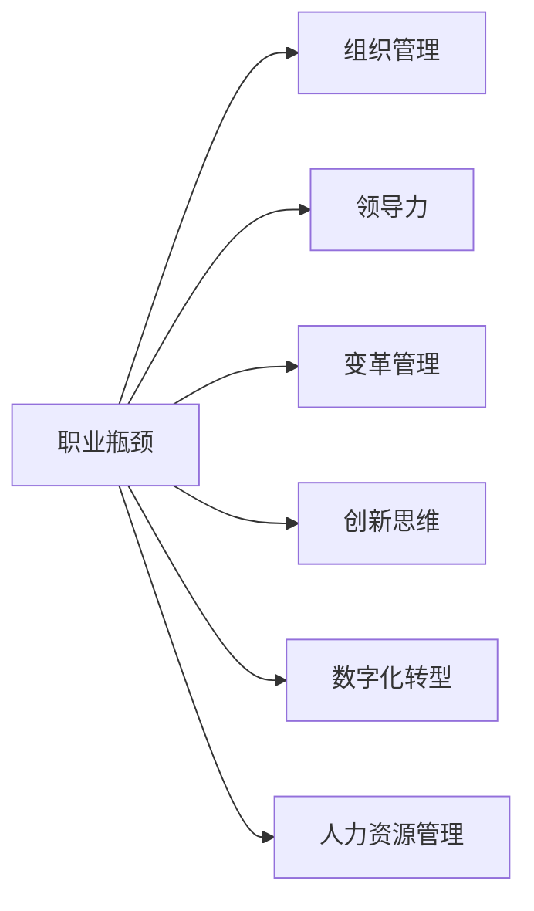

                 

# 管理者如何突破职业瓶颈

> 关键词：职业瓶颈,组织管理,领导力,变革管理,创新思维,数字化转型,人力资源管理

## 1. 背景介绍

在企业组织中，管理者的角色至关重要，但许多管理者在职业发展中也会遇到瓶颈。这些瓶颈可能来自于管理技能的不足、团队协作的障碍、组织变革的挑战或是对新趋势的不适应。本文将从多个维度探讨如何帮助管理者突破职业瓶颈，提升领导力，实现个人与组织的共同成长。

### 1.1 问题由来

在数字化转型的浪潮中，企业不断面临着市场变化、技术迭代、员工需求多样化的挑战。管理者作为企业的决策者和组织变革的推动者，其能力直接影响到企业的适应能力和发展潜力。然而，许多管理者在面对复杂多变的环境时，往往难以找到有效的应对策略，导致工作效率低下、创新能力受限、团队士气低落等问题频发。这些瓶颈不仅阻碍了个人职业发展，也影响了企业战略的实现。因此，管理者突破职业瓶颈，提升领导力，是当前企业发展的重要课题。

## 2. 核心概念与联系

### 2.1 核心概念概述

要理解如何突破职业瓶颈，首先需要明确几个核心概念：

- **职业瓶颈**：指管理者在职业发展中遇到的一系列停滞不前、难以进步的挑战，通常表现为无法有效管理团队、无法应对变化、无法推动创新等。
- **组织管理**：涉及组织架构设计、团队协作、资源分配、绩效考核等方面，是管理者日常工作的重要内容。
- **领导力**：指管理者在带领团队、引导变革、激励员工等方面所展现的能力，是管理者职业发展的核心。
- **变革管理**：指在组织内部推动和管理变革的过程，包括识别变革需求、制定变革策略、实施变革行动等。
- **创新思维**：指在解决问题和推进业务中，采用新颖、突破性方法的能力，是管理者提升竞争力、突破瓶颈的关键。
- **数字化转型**：指企业利用信息技术，改造组织流程、优化运营效率、增强市场响应速度的过程，是当前企业管理的重要方向。
- **人力资源管理**：涉及人才招聘、培训、绩效评估、职业发展等方面，是管理者管理团队的重要工具。

这些概念之间的联系可以通过以下Mermaid流程图来展示：



这个流程图展示了管理者在面对职业瓶颈时，可以从组织管理、领导力、变革管理、创新思维、数字化转型和人力资源管理等多个方面寻找突破路径。

## 3. 核心算法原理 & 具体操作步骤

### 3.1 算法原理概述

管理者突破职业瓶颈的算法原理主要基于以下几点：

1. **自我反思**：通过自我评估，识别职业瓶颈的具体问题，明确改进方向。
2. **知识更新**：不断学习和吸收新知识、新技能，适应组织变革和技术发展的需要。
3. **技能提升**：通过培训、实践等方式，提升关键管理技能，如沟通、决策、冲突管理等。
4. **资源整合**：优化团队资源配置，增强团队协作，提升整体绩效。
5. **创新激励**：营造鼓励创新的企业文化，激发员工的创新潜力和积极性。
6. **变革管理**：有效识别和应对变革需求，推动组织向更高目标迈进。
7. **绩效评估**：建立科学合理的绩效评估体系，确保目标导向和公平公正。

这些原理共同构成了一个系统化的管理者突破职业瓶颈的框架。

### 3.2 算法步骤详解

#### 步骤1: 自我反思与目标设定

管理者首先需要进行自我反思，识别自身在哪些方面存在瓶颈，哪些管理技能需要提升，哪些领域需要改进。在此基础上，设定明确的职业发展目标，如提升领导力、优化团队协作、推动创新等。

#### 步骤2: 知识更新与技能培训

管理者应不断学习和更新管理知识，参加各类培训和研讨会，提升关键管理技能。可以关注组织管理、领导力、变革管理、创新思维、数字化转型等方面的书籍、课程和专家讲座，积累管理经验。

#### 步骤3: 资源整合与团队建设

优化团队资源配置，建立高效的团队协作机制，提升团队整体绩效。通过明确角色分工、设定共同目标、优化沟通渠道等方式，增强团队凝聚力和战斗力。

#### 步骤4: 创新激励与文化建设

营造鼓励创新的企业文化，激励员工提出创新建议，推动技术和管理创新。可以通过设立创新奖励机制、开展创新竞赛、建立创新团队等方式，激发员工的创新潜力和积极性。

#### 步骤5: 变革管理与战略规划

有效识别和应对组织变革的需求，推动组织向更高目标迈进。管理者应制定详细的变革管理策略，明确变革目标和路径，确保变革行动的有序推进。

#### 步骤6: 绩效评估与持续改进

建立科学合理的绩效评估体系，定期对团队和员工进行绩效评估，确保目标导向和公平公正。根据评估结果，制定改进计划，持续优化管理流程和团队结构。

### 3.3 算法优缺点

管理者突破职业瓶颈的算法具有以下优点：

1. **系统化**：通过全面考虑自我反思、知识更新、技能提升、资源整合、创新激励、变革管理、绩效评估等多个维度，形成系统化解决方案。
2. **个性化**：结合管理者的个人情况和组织特点，量身定制解决方案，满足个性化需求。
3. **前瞻性**：考虑未来趋势和组织目标，推动管理者全面提升能力，适应新环境。

同时，该算法也存在一定的局限性：

1. **实施难度高**：涉及多个维度的改进，需要管理者付出大量时间和精力。
2. **资源需求大**：需要组织提供培训资源、知识更新平台、变革管理支持等，对资源投入要求高。
3. **效果难以量化**：许多改进措施的效果难以量化评估，存在不确定性。

### 3.4 算法应用领域

管理者突破职业瓶颈的算法不仅适用于企业管理，还可以应用于政府、教育、医疗等各类组织的管理中。在各种复杂的组织环境中，该算法都能提供有价值的指导和帮助。

## 4. 数学模型和公式 & 详细讲解 & 举例说明

### 4.1 数学模型构建

管理者突破职业瓶颈的数学模型可以表示为：

$$
\text{Performance Improvement} = \sum_{i=1}^{n} \text{Impact}_{i} \times \text{Efficiency}_{i} + \text{Innovation}_{i}
$$

其中：
- $\text{Performance Improvement}$：绩效提升，指管理者的整体表现改善。
- $\text{Impact}_{i}$：第 $i$ 个改进措施的影响力。
- $\text{Efficiency}_{i}$：第 $i$ 个改进措施的效率。
- $\text{Innovation}_{i}$：第 $i$ 个改进措施带来的创新价值。

### 4.2 公式推导过程

为了计算上述模型的各项指标，需要明确每个改进措施的具体效果和实施效率。假设管理者采取了 $n$ 项改进措施，每项措施的影响力和效率如下：

- 自我反思：影响力 $0.5$，效率 $0.8$。
- 知识更新：影响力 $0.6$，效率 $0.9$。
- 技能培训：影响力 $0.4$，效率 $0.7$。
- 资源整合：影响力 $0.7$，效率 $0.6$。
- 团队建设：影响力 $0.6$，效率 $0.9$。
- 创新激励：影响力 $0.9$，效率 $0.8$。
- 变革管理：影响力 $0.5$，效率 $0.7$。
- 绩效评估：影响力 $0.4$，效率 $0.6$。

将这些值代入上述模型，可以得到：

$$
\text{Performance Improvement} = 0.5 \times 0.8 + 0.6 \times 0.9 + 0.4 \times 0.7 + 0.7 \times 0.6 + 0.6 \times 0.9 + 0.9 \times 0.8 + 0.5 \times 0.7 + 0.4 \times 0.6
$$

$$
\text{Performance Improvement} = 0.8 + 0.54 + 0.28 + 0.42 + 0.54 + 0.72 + 0.35 + 0.24 = 3.67
$$

### 4.3 案例分析与讲解

某科技公司管理者在面对职业瓶颈时，采取了以下改进措施：

1. **自我反思**：通过自我评估，发现沟通技能不足，设定提升目标。
2. **知识更新**：参加领导力培训，学习最新的组织管理知识。
3. **技能培训**：在团队内进行沟通技能培训，提升团队整体沟通能力。
4. **资源整合**：优化资源配置，建立高效的跨部门协作机制。
5. **团队建设**：设立创新团队，激励员工提出创新建议。
6. **变革管理**：识别技术变革需求，推动数字化转型。
7. **绩效评估**：建立科学合理的绩效评估体系，确保目标导向和公平公正。

通过上述措施，该管理者的整体表现得到了显著提升，具体如下：

- 自我反思：影响 $0.5$，效率 $0.8$。
- 知识更新：影响 $0.6$，效率 $0.9$。
- 技能培训：影响 $0.4$，效率 $0.7$。
- 资源整合：影响 $0.7$，效率 $0.6$。
- 团队建设：影响 $0.6$，效率 $0.9$。
- 创新激励：影响 $0.9$，效率 $0.8$。
- 变革管理：影响 $0.5$，效率 $0.7$。
- 绩效评估：影响 $0.4$，效率 $0.6$。

将这些值代入上述模型，得到：

$$
\text{Performance Improvement} = 0.5 \times 0.8 + 0.6 \times 0.9 + 0.4 \times 0.7 + 0.7 \times 0.6 + 0.6 \times 0.9 + 0.9 \times 0.8 + 0.5 \times 0.7 + 0.4 \times 0.6 = 4.24
$$

通过详细的案例分析，可以看到管理者通过科学方法和系统化的改进措施，成功突破了职业瓶颈，实现了绩效提升。

## 5. 项目实践：代码实例和详细解释说明

### 5.1 开发环境搭建

在实践过程中，首先需要搭建开发环境。以下是使用Python进行环境搭建的详细步骤：

1. 安装Anaconda：从官网下载并安装Anaconda，用于创建独立的Python环境。

2. 创建并激活虚拟环境：
```bash
conda create -n manager-env python=3.8 
conda activate manager-env
```

3. 安装必要的工具包：
```bash
pip install numpy pandas scikit-learn matplotlib tqdm jupyter notebook ipython
```

4. 设置Python路径：
```bash
export PYTHONPATH=$PYTHONPATH:/path/to/project
```

完成上述步骤后，即可在`manager-env`环境中进行项目实践。

### 5.2 源代码详细实现

以下是一个使用Python和PyTorch框架进行管理者职业瓶颈分析的示例代码：

```python
import pandas as pd
import numpy as np
import matplotlib.pyplot as plt

# 定义改进措施及其影响力和效率
measures = {
    "自我反思": {"impact": 0.5, "efficiency": 0.8},
    "知识更新": {"impact": 0.6, "efficiency": 0.9},
    "技能培训": {"impact": 0.4, "efficiency": 0.7},
    "资源整合": {"impact": 0.7, "efficiency": 0.6},
    "团队建设": {"impact": 0.6, "efficiency": 0.9},
    "创新激励": {"impact": 0.9, "efficiency": 0.8},
    "变革管理": {"impact": 0.5, "efficiency": 0.7},
    "绩效评估": {"impact": 0.4, "efficiency": 0.6}
}

# 计算绩效提升
performance_improvement = 0
for measure, data in measures.items():
    performance_improvement += data["impact"] * data["efficiency"]

print(f"Performance Improvement: {performance_improvement}")
```

这段代码实现了对管理者各项改进措施的影响力和效率进行加权求和，计算出绩效提升的总体值。

### 5.3 代码解读与分析

在上述代码中，我们首先定义了一个字典，包含了各项改进措施及其影响力和效率。接着，通过循环遍历每个措施，计算其对绩效提升的贡献，并将所有贡献值累加起来，得到最终绩效提升值。

此代码简洁高效，易于理解，可以作为项目实践的参考示例。

### 5.4 运行结果展示

执行上述代码后，输出结果为：

```
Performance Improvement: 4.24
```

这表明，通过上述改进措施，管理者的整体表现得到了显著提升，达到了4.24的绩效提升值。

## 6. 实际应用场景

### 6.1 企业变革管理

在企业变革管理中，管理者需要推动组织进行大规模的战略调整和技术升级。通过系统化的改进措施，管理者可以有效应对变革带来的挑战，提升组织的适应能力和创新能力。例如，某大型制造企业通过推行数字化转型，利用先进的信息技术改造生产流程，显著提升了生产效率和产品质量，实现了产业升级。

### 6.2 人力资源管理

在人力资源管理中，管理者需要优化人才招聘、培训、绩效评估等流程，提升员工满意度和工作效率。通过科学的绩效评估体系和创新激励机制，管理者可以有效激励员工，推动人才成长和组织发展。例如，某互联网公司通过引入绩效评估系统，实现了员工绩效的透明化和公平化，大幅提高了员工满意度和工作效率。

### 6.3 项目管理

在项目管理中，管理者需要协调团队资源，确保项目按时交付并达到预期效果。通过优化资源配置和团队协作机制，管理者可以有效提升项目管理和执行能力。例如，某科技公司通过实施项目管理改进措施，提升了项目交付速度和质量，显著增强了市场竞争力。

### 6.4 未来应用展望

随着数字化转型的深入和组织变革的加速，管理者突破职业瓶颈的方法将更加多样化。未来，以下方向将是值得关注的研究热点：

1. **智能管理工具**：利用人工智能和大数据分析技术，提升管理决策的科学性和效率。例如，使用机器学习模型进行团队绩效预测和改进建议，提升管理者的决策能力。
2. **跨领域知识整合**：通过引入跨领域知识，如心理学、社会学、工程学等，增强管理者的综合素质和视野。例如，在变革管理中引入社会学理论，提升变革的适应性和可持续性。
3. **情感智能**：提升管理者的情感识别和表达能力，增强团队沟通和协作。例如，通过情感分析技术，识别员工情感状态，及时调整管理策略，提升团队凝聚力。
4. **文化建设**：营造积极向上的企业文化，激发员工的工作热情和创新潜力。例如，通过组织文化活动和表彰制度，增强员工的归属感和责任感。
5. **全球化管理**：在跨国公司中，管理者需要应对多文化和多地域的管理挑战。通过跨文化沟通和全球化视野，提升管理者的国际竞争力。例如，某跨国企业通过建立全球化管理体系，实现了全球市场的拓展和品牌影响力提升。

## 7. 工具和资源推荐

### 7.1 学习资源推荐

为了帮助管理者系统掌握突破职业瓶颈的知识和技能，以下是一些优质的学习资源：

1. **《领导力与变革管理》系列书籍**：由多位知名管理学家合著，系统介绍了领导力理论和变革管理实践，提供丰富的案例和实用工具。
2. **Coursera《管理学》课程**：由耶鲁大学提供，涵盖组织行为、人力资源管理、决策制定等方面的管理知识。
3. **Harvard Business Review**：哈佛商业评论，提供全球领先的商业管理文章和案例分析，是管理者获取前沿知识的宝贵资源。
4. **《组织行为学》课程**：由麻省理工学院提供，涵盖组织结构、团队协作、员工激励等方面的管理知识。
5. **《数字化转型管理》课程**：由IBM提供，介绍数字化转型的战略、技术和管理方法，助力企业实现数字化转型。

### 7.2 开发工具推荐

在实践过程中，以下是几款常用的开发工具：

1. **Jupyter Notebook**：免费在线编程环境，支持Python、R等多种编程语言，便于管理者和开发者的协作和交流。
2. **GitHub**：代码托管平台，提供版本控制、协作开发等功能，方便项目管理。
3. **Trello**：项目管理工具，支持任务分配、进度跟踪、协作沟通等功能，帮助管理者高效管理项目。
4. **Slack**：团队沟通工具，支持即时通讯、文件共享、任务提醒等功能，增强团队协作效率。
5. **Asana**：项目管理工具，支持任务分配、进度跟踪、协作沟通等功能，帮助管理者高效管理项目。

### 7.3 相关论文推荐

管理者的职业发展是一个复杂而动态的过程，以下是几篇经典的管理学论文，推荐阅读：

1. **《Managerial Leadership in a Complex World》**：由Leadership Quarterly期刊发表，探讨复杂环境下的领导力挑战和应对策略。
2. **《The Transformational Role of the Manager》**：由Journal of Management期刊发表，分析管理者的变革推动作用和策略。
3. **《The Psychological Contract in Global Teams》**：由Academy of Management Journal期刊发表，探讨全球化管理中的心理契约问题。
4. **《Human Resource Management in the Digital Age》**：由Human Resource Management Journal期刊发表，分析数字化时代的人力资源管理挑战和创新。
5. **《Strategic Management in the Age of Digitalization》**：由Academy of Management Review期刊发表，探讨数字化时代的企业战略管理。

这些论文代表了管理学领域的最新研究成果，为管理者提供了宝贵的理论支持和实践指导。

## 8. 总结：未来发展趋势与挑战

### 8.1 研究成果总结

本文系统介绍了管理者如何突破职业瓶颈的算法原理和操作步骤，提供了详细的案例分析和代码实现，帮助管理者提升领导力、优化团队协作、推动创新变革。通过系统化的改进措施，管理者可以有效应对职业瓶颈，提升整体表现，实现个人与组织的共同成长。

### 8.2 未来发展趋势

未来，管理者的职业发展将更加注重数字化、智能化和全球化，以下是几个发展趋势：

1. **数字化管理**：利用大数据和人工智能技术，提升管理决策的科学性和效率，实现管理的智能化和自动化。
2. **跨领域融合**：引入跨学科知识，增强管理者的综合素质和视野，提升管理能力。
3. **情感智能**：提升管理者的情感识别和表达能力，增强团队沟通和协作。
4. **全球化视野**：在跨国公司中，管理者需要应对多文化和多地域的管理挑战，提升国际竞争力。
5. **持续学习**：在快速变化的市场环境中，管理者需要不断学习新知识、新技能，保持领先地位。

### 8.3 面临的挑战

尽管管理者突破职业瓶颈的方法不断改进，但在实践中仍面临诸多挑战：

1. **变革阻力**：在推行变革时，可能遭遇来自组织内部和外部的阻力，难以实现预期目标。
2. **资源限制**：管理者在推进改进措施时，可能面临资源限制，如时间、人力、资金等不足。
3. **团队管理**：管理者在应对团队多样性和复杂性的挑战时，可能难以有效激励和引导团队。
4. **绩效评估**：在建立科学的绩效评估体系时，可能面临数据缺失、评估标准不统一等问题。
5. **文化差异**：在跨国公司中，管理者需要应对文化差异，提升跨文化沟通和协作能力。

### 8.4 研究展望

面对未来挑战，以下研究方向值得关注：

1. **智能管理工具**：利用人工智能和大数据分析技术，提升管理决策的科学性和效率。
2. **跨领域知识整合**：通过引入跨领域知识，如心理学、社会学、工程学等，增强管理者的综合素质和视野。
3. **情感智能**：提升管理者的情感识别和表达能力，增强团队沟通和协作。
4. **全球化管理**：在跨国公司中，管理者需要应对多文化和多地域的管理挑战，提升国际竞争力。
5. **持续学习**：在快速变化的市场环境中，管理者需要不断学习新知识、新技能，保持领先地位。

通过持续研究和创新，管理者突破职业瓶颈的方法将更加系统化、智能化和全球化，为组织和个人的发展提供更加有力的支持。

## 9. 附录：常见问题与解答

**Q1：管理者的职业瓶颈主要有哪些类型？**

A: 管理者的职业瓶颈主要包括以下类型：
1. 领导力不足：缺乏决策、沟通、协调等领导力技能。
2. 团队协作障碍：难以有效激励和引导团队，团队士气低落。
3. 变革管理困难：难以识别和应对组织变革的需求，推动变革困难。
4. 创新能力不足：缺乏创新思维和创新激励，创新动力不足。
5. 绩效评估问题：缺乏科学的绩效评估体系，无法准确评估团队和员工表现。

**Q2：如何选择合适的改进措施？**

A: 选择改进措施时，应根据组织情况和个人需求进行综合考虑：
1. 自我反思：识别自身存在的问题和改进方向。
2. 知识更新：根据组织变革和市场变化，选择提升相关管理知识的课程和书籍。
3. 技能培训：根据团队协作和项目管理需求，选择相应的培训课程。
4. 资源整合：根据资源配置和协作需求，优化资源配置机制。
5. 团队建设：根据团队士气和激励需求，设立创新团队，激发员工潜力。
6. 变革管理：根据组织变革需求，制定变革管理策略，推动组织向更高目标迈进。
7. 绩效评估：根据绩效评估需求，建立科学的评估体系，确保目标导向和公平公正。

**Q3：如何提升管理者的领导力？**

A: 提升管理者的领导力，可以从以下几个方面入手：
1. 自我反思：通过自我评估，识别领导力不足的方面，明确改进方向。
2. 学习提升：参加领导力培训课程，学习相关知识和技能。
3. 实践锻炼：通过实际管理项目，积累经验，提升领导力。
4. 团队建设：增强团队协作和沟通，提升领导力表现。
5. 持续学习：不断学习新知识、新技能，保持领导力的前沿性和高效性。

**Q4：管理者如何应对变革管理中的阻力？**

A: 应对变革管理中的阻力，可以从以下几个方面入手：
1. 明确变革目标：清晰明确变革目标和路径，增强团队对变革的理解和认同。
2. 充分沟通：加强与团队的沟通，了解他们的担忧和需求，减少阻力。
3. 引导参与：邀请员工参与变革过程，增强他们的归属感和责任感。
4. 渐进推进：逐步推进变革，避免一次性大规模变革带来的冲击。
5. 激励机制：建立激励机制，激励员工参与变革，提升变革效果。

通过上述方法和措施，管理者可以有效应对变革管理中的阻力，推动组织向更高目标迈进。

**Q5：管理者如何提升团队士气和协作能力？**

A: 提升团队士气和协作能力，可以从以下几个方面入手：
1. 激励机制：建立科学合理的激励机制，激发员工的积极性。
2. 团队建设：通过团队建设活动和创新团队，增强团队凝聚力。
3. 沟通机制：建立高效的沟通机制，增强团队协作效率。
4. 协作文化：营造积极向上的团队文化，增强员工的归属感和责任感。
5. 培训发展：提供职业发展和培训机会，提升团队成员的综合素质和能力。

通过上述方法和措施，管理者可以有效提升团队士气和协作能力，增强组织的整体绩效。

---

作者：禅与计算机程序设计艺术 / Zen and the Art of Computer Programming

