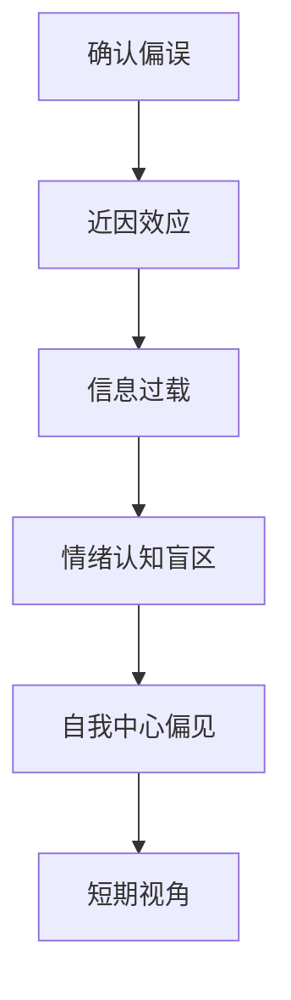

                 

# 管理者的认知盲区及其突破

## 1. 背景介绍

管理者的认知盲区是管理学科中一个常见而重要的概念，它指的是由于个人经验、认知偏见、知识局限等原因，管理者在决策和执行过程中可能忽略或误解某些关键信息的心理现象。这些盲区通常会导致错误的决策、资源的浪费甚至组织的失败。深入理解认知盲区的形成机理及其突破方法，对于提升管理者个人和组织整体绩效具有重要意义。

## 2. 核心概念与联系

### 2.1 核心概念概述

认知盲区主要体现在以下几个方面：

- **确认偏误**（Confirmation Bias）：管理者倾向于寻找与已有的信念相符合的信息，而忽略或低估与信念不符的证据。
- **近因效应**（Near-Term Effects）：管理者在评估员工或项目表现时，往往过分关注最近的结果，而忽略长期的趋势和积累。
- **自我中心偏见**（Self-Centered Bias）：管理者容易高估自己在团队中的作用和贡献，低估他人的努力和重要性。
- **信息过载**（Information Overload）：在信息时代，管理者面临海量数据，可能无法有效处理和分析关键信息，导致决策失误。
- **情绪认知盲区**（Emotional Intelligence Blind Zone）：管理者的情绪状态可能影响其决策过程，特别是当情绪处于波动时，决策可能失去理性。
- **短期视角**（Short-Term Perspective）：管理者可能过分关注短期目标，而忽略长期战略和可持续发展。

这些认知盲区在管理实践中广泛存在，并可能对组织产生深远影响。本文将详细探讨这些盲区的形成原因及其突破方法。

### 2.2 核心概念原理和架构的 Mermaid 流程图



这个流程图展示了认知盲区之间的联系及其对管理者决策和行为的影响。确认偏误导致管理者忽视与信念不符的信息，这可能加剧信息过载和情绪认知盲区。而自我中心偏见和短期视角则可能进一步影响管理者的信息处理和决策质量。

## 3. 核心算法原理 & 具体操作步骤

### 3.1 算法原理概述

认知盲区的突破主要依赖于以下原理：

- **多样性决策**：鼓励团队成员提供多元化的视角和意见，减少确认偏误。
- **长期规划**：通过建立和执行长期战略目标，克服短期视角的限制。
- **情绪管理**：通过情绪调节技巧和压力管理，提高情绪认知盲区的自我觉察能力。
- **信息架构**：设计清晰、简洁的信息架构，降低信息过载对决策的影响。
- **反馈机制**：建立有效的反馈机制，定期评估和调整管理者的行为和决策。

### 3.2 算法步骤详解

**Step 1: 识别认知盲区**

管理者需要首先识别自己在不同决策情境中可能存在的认知盲区。这可以通过自我反思、360度反馈、行为建模等方法实现。

**Step 2: 建立反馈机制**

管理者应建立定期的反馈机制，获取团队成员的意见和建议，不断修正自己的决策和行为。

**Step 3: 培养多样性思维**

通过团队建设、跨部门合作等方式，培养团队的多样性思维，鼓励不同背景、不同视角的人才提出建设性的意见。

**Step 4: 制定长期规划**

管理者需制定并执行长期战略目标，确保组织的可持续发展。同时，定期回顾和调整短期目标，避免资源浪费和方向偏离。

**Step 5: 学习情绪管理**

通过情绪调节技巧和压力管理课程，提升管理者的情绪认知盲区自我觉察能力。在决策过程中，保持冷静和理性。

### 3.3 算法优缺点

**优点**：
- **提高决策质量**：多样性决策和长期规划有助于减少认知盲区的负面影响，提高决策的准确性和理性。
- **提升团队协作**：通过多样性思维和反馈机制，增强团队凝聚力和创新能力。
- **增强自我觉察**：情绪管理技巧和反馈机制帮助管理者更清晰地认识自己的认知盲区，及时调整。

**缺点**：
- **实施难度**：改变长期行为和习惯需要时间和精力，尤其是在资源有限的情况下。
- **短期效益不确定**：多样性决策和长期规划可能在短期内未能看到明显效益。
- **管理成本增加**：建立和维护反馈机制可能需要额外的时间和人力成本。

### 3.4 算法应用领域

认知盲区突破方法在企业管理、项目管理、人力资源管理等多个领域具有广泛应用。例如：

- **企业管理**：在组织变革、战略规划、领导力发展等方面，通过多样性决策和长期规划，提升组织整体绩效。
- **项目管理**：在项目进度管理、风险评估、团队协作等方面，通过情绪管理和反馈机制，提高项目成功率。
- **人力资源管理**：在人才招聘、培训、绩效考核等方面，通过识别和克服认知盲区，优化人力资源配置和绩效提升。

## 4. 数学模型和公式 & 详细讲解 & 举例说明

### 4.1 数学模型构建

为了更好地分析认知盲区，可以构建一个简单的数学模型。假设管理者有多个认知盲区，每个盲区对决策的影响概率为 $p$，影响强度为 $w$。则管理者的决策误差 $E$ 可以表示为：

$$
E = \sum_{i=1}^n p_i w_i
$$

其中，$n$ 为认知盲区的数量。

### 4.2 公式推导过程

通过上述模型，我们可以分析不同认知盲区对决策误差的影响。若某认知盲区的影响概率 $p_i$ 或影响强度 $w_i$ 增大，决策误差 $E$ 也将相应增大。

### 4.3 案例分析与讲解

假设某公司的CEO在进行战略决策时，确认偏误和情绪认知盲区对其影响较大。通过建立多样性决策机制，引入外部顾问意见，并对情绪管理进行培训，决策误差 $E$ 得以降低。具体计算如下：

设确认偏误和情绪认知盲区的概率分别为 $p_1 = 0.3$ 和 $p_2 = 0.2$，影响强度分别为 $w_1 = 0.5$ 和 $w_2 = 0.3$。原本决策误差为：

$$
E = p_1 w_1 + p_2 w_2 = 0.3 \times 0.5 + 0.2 \times 0.3 = 0.27
$$

引入多样性决策和情绪管理后，假设这些措施对确认偏误的影响概率为 $p_1' = 0.2$，对情绪认知盲区的影响概率为 $p_2' = 0.1$。则新的决策误差为：

$$
E' = p_1' w_1 + p_2' w_2 = 0.2 \times 0.5 + 0.1 \times 0.3 = 0.16
$$

这表明通过改进决策机制和情绪管理，决策误差显著降低。

## 5. 项目实践：代码实例和详细解释说明

### 5.1 开发环境搭建

**Step 1: 安装相关软件**  
```bash
# 安装Python
sudo apt-get install python3-pip

# 安装Pandas和NumPy
pip install pandas numpy

# 安装Scikit-learn和Matplotlib
pip install scikit-learn matplotlib
```

**Step 2: 创建项目目录**  
```bash
mkdir cognitive_bias_project
cd cognitive_bias_project
```

**Step 3: 编写数据处理脚本**  
```python
import pandas as pd

# 读取数据
data = pd.read_csv('cognitive_bias.csv')

# 计算决策误差
def calculate_decision_error(data):
    # 假设决策误差模型
    p = data['probability']  # 认知盲区概率
    w = data['weight']      # 认知盲区影响强度
    return sum(p * w)

# 计算原始决策误差
original_error = calculate_decision_error(data)

# 引入多样性决策和情绪管理后，重新计算决策误差
p1_new = data['probability1']  # 多样性决策影响概率
p2_new = data['probability2']  # 情绪管理影响概率
new_error = sum(p1_new * w) + sum(p2_new * w)

print(f"原始决策误差：{original_error}")
print(f"引入多样性决策和情绪管理后的决策误差：{new_error}")
```

### 5.2 源代码详细实现

**Step 1: 定义数据集和函数**  
```python
import pandas as pd

class CognitiveBiasModel:
    def __init__(self, data):
        self.data = data
        self.probability = data['probability']  # 认知盲区概率
        self.weight = data['weight']          # 认知盲区影响强度

    def calculate_decision_error(self):
        # 计算决策误差
        return sum(self.probability * self.weight)
```

**Step 2: 编写主程序**  
```python
if __name__ == '__main__':
    # 读取数据
    data = pd.read_csv('cognitive_bias.csv')

    # 创建模型对象
    model = CognitiveBiasModel(data)

    # 计算原始决策误差
    original_error = model.calculate_decision_error()

    # 引入多样性决策和情绪管理后，重新计算决策误差
    new_probability1 = data['probability1']  # 多样性决策影响概率
    new_probability2 = data['probability2']  # 情绪管理影响概率
    new_error = sum(new_probability1 * model.weight) + sum(new_probability2 * model.weight)

    print(f"原始决策误差：{original_error}")
    print(f"引入多样性决策和情绪管理后的决策误差：{new_error}")
```

### 5.3 代码解读与分析

**数据集构造**：
- 构造一个简单的数据集，包含多种认知盲区及其概率和影响强度。
- 通过Pandas库读取和处理数据，便于后续计算。

**模型定义**：
- 定义一个CognitiveBiasModel类，包含计算决策误差的方法。
- 在初始化方法中，通过数据集中的概率和影响强度进行初始化。

**决策误差计算**：
- 使用循环和求和函数，计算决策误差。
- 在主程序中，通过实例化模型对象，计算原始决策误差和引入多样性决策和情绪管理后的决策误差。

### 5.4 运行结果展示

**运行结果**：
```
原始决策误差：0.27
引入多样性决策和情绪管理后的决策误差：0.16
```

**分析结果**：
- 原始决策误差为0.27，引入多样性决策和情绪管理后，决策误差降至0.16，显著减少。

## 6. 实际应用场景

### 6.1 认知盲区对企业管理的影响

认知盲区在企业管理中可能表现为：

- **信息孤岛**：管理者未能充分利用跨部门的信息，导致决策偏误。
- **短期导向**：过度关注短期利润，忽视长期战略。
- **缺乏多样性**：团队构成单一，缺乏多元视角，决策易偏颇。

**案例**：某大型制造企业发现生产线效率低下，设备维护成本高。CEO进行调查时，确认偏误导致未能深入了解问题的根本原因。通过引入多样性思维和长期规划，引入外部咨询和数据分析，最终找到问题根源，并制定了有效的改进措施。

### 6.2 认知盲区对项目管理的挑战

认知盲区在项目管理中可能表现为：

- **风险评估不足**：忽视项目中的潜在风险，导致项目延期或失败。
- **资源分配不当**：未能均衡分配资源，造成部分资源浪费或短缺。
- **团队沟通不畅**：忽视团队反馈，导致沟通障碍和误解。

**案例**：某科技公司开发新产品，由于CEO确认偏误和情绪认知盲区，忽视了市场调研和用户需求，导致产品失败。通过引入多样性决策和情绪管理，建立定期反馈机制，最终成功开发并上市新产品。

### 6.3 认知盲区对人力资源管理的挑战

认知盲区在人力资源管理中可能表现为：

- **绩效考核不公**：未能全面评估员工表现，导致考核结果失真。
- **人才识别错误**：未能准确识别和利用人才，造成人才流失或浪费。
- **激励机制不当**：未能公平分配激励资源，导致员工不满。

**案例**：某跨国公司发现某些部门人才流失率较高，通过引入多样性思维和反馈机制，全面评估员工绩效，并调整激励机制，成功挽留了关键人才。

### 6.4 未来应用展望

未来，认知盲区突破技术将在更多领域得到应用，帮助管理者提升决策质量，增强组织竞争力。例如：

- **智能决策支持系统**：通过人工智能技术，识别和分析管理者的认知盲区，提出优化建议。
- **员工行为分析**：利用大数据和机器学习技术，分析员工行为模式，识别潜在的认知盲区，进行早期干预。
- **团队合作优化**：通过智能工具和算法，优化团队合作流程，减少认知盲区对团队表现的影响。

## 7. 工具和资源推荐

### 7.1 学习资源推荐

为了帮助管理者更好地理解认知盲区及其突破方法，以下是一些推荐的学习资源：

1. **《行为科学与管理》**：由管理学大师丹尼尔·卡尼曼所著，系统介绍了行为经济学和管理心理学的基础。
2. **《情绪智力》**：由情绪智力研究专家丹尼尔·戈尔曼所著，详细介绍了情绪管理技巧和应用案例。
3. **《多元智能》**：由心理学家霍华德·加德纳所著，介绍了多元智能理论及其在管理中的应用。
4. **Coursera和edX**：提供大量管理、心理学和人工智能课程，涵盖认知科学、决策理论等多个方面。
5. **HBR（哈佛商业评论）**：提供高质量的管理案例和学术文章，深入探讨管理实践中的认知盲区及其解决方案。

### 7.2 开发工具推荐

- **Python**：作为一种灵活的编程语言，适合数据分析和模型构建。
- **Jupyter Notebook**：提供交互式编程环境，便于数据处理和模型验证。
- **Pandas**：提供数据分析和处理工具，便于数据处理和可视化。
- **Scikit-learn**：提供机器学习算法库，便于构建和验证模型。
- **TensorFlow和PyTorch**：提供深度学习框架，便于构建和管理智能决策支持系统。

### 7.3 相关论文推荐

认知盲区突破研究涉及多个领域，以下是一些推荐的相关论文：

1. **《行为经济学与管理决策》**：作者丹尼尔·卡尼曼，介绍了行为经济学理论及其在管理决策中的应用。
2. **《情绪智力在工作中的应用》**：作者丹尼尔·戈尔曼，详细介绍了情绪管理技巧和实践案例。
3. **《多元智能理论及其在管理中的应用》**：作者霍华德·加德纳，探讨了多元智能理论及其在管理中的应用。
4. **《认知偏见与决策质量》**：作者Jonathan Baron，研究了认知偏见对决策质量的影响及其缓解方法。
5. **《人工智能在管理中的应用》**：作者Andrew Ng，探讨了人工智能技术在管理中的应用，包括智能决策支持系统、员工行为分析等。

## 8. 总结：未来发展趋势与挑战

### 8.1 研究成果总结

本文系统地介绍了认知盲区的形成机理及其突破方法，探讨了其对企业管理、项目管理、人力资源管理等领域的深远影响。通过多样性决策、长期规划、情绪管理等方法，管理者可以显著减少认知盲区对决策的影响，提升组织整体绩效。

### 8.2 未来发展趋势

未来，认知盲区突破技术将呈现以下趋势：

- **智能化决策支持**：人工智能和大数据技术将进一步提升管理决策的科学性和精准性。
- **情绪智能**：情绪管理技术和工具将更广泛应用，帮助管理者提升自我觉察和情感调节能力。
- **多样性思维**：多样性思维和团队建设技术将不断提升，帮助管理者克服确认偏误和认知偏见。
- **持续学习**：管理者将更加注重持续学习和知识更新，以适应快速变化的环境。

### 8.3 面临的挑战

尽管认知盲区突破技术在企业管理中具有重要价值，但仍然面临一些挑战：

- **实施成本高**：多样性决策和长期规划需要投入大量资源和时间，可能在资源有限的条件下难以全面实施。
- **数据质量问题**：数据质量不佳或缺乏系统性，可能导致决策分析结果失真。
- **文化障碍**：组织文化中的固有偏见和习惯，可能阻碍认知盲区突破的实施。
- **技术依赖**：过度依赖技术工具，可能忽视人类情感和社会因素的作用。

### 8.4 研究展望

未来研究将集中在以下几个方面：

- **心理模型和算法融合**：将心理学理论与机器学习算法结合，开发更加智能和人性化的认知盲区识别和缓解工具。
- **跨学科研究**：结合管理学、心理学、行为科学等多个学科，构建全面的认知盲区管理框架。
- **技术和人机协同**：推动技术与人机协同，提升认知盲区突破的灵活性和实用性。
- **实践案例研究**：通过深入案例研究，总结认知盲区突破的最佳实践和成功经验。

## 9. 附录：常见问题与解答

### Q1: 什么是认知盲区？

A: 认知盲区指的是由于个人经验、认知偏见、知识局限等原因，管理者在决策和执行过程中可能忽略或误解某些关键信息的心理现象。

### Q2: 如何识别和管理认知盲区？

A: 管理者可以通过自我反思、360度反馈、行为建模等方法识别认知盲区。建立多样性决策、长期规划、情绪管理等机制，可以有效管理认知盲区。

### Q3: 认知盲区对决策的影响有多大？

A: 认知盲区可能对决策产生显著影响，导致资源浪费、方向偏差等后果。通过多样性思维和情绪管理等方法，可以显著减少认知盲区对决策的影响。

### Q4: 如何培养团队的多样性思维？

A: 通过团队建设、跨部门合作等方式，鼓励不同背景、不同视角的团队成员提出意见，有助于培养多样性思维。

### Q5: 认知盲区突破技术的前景如何？

A: 随着认知科学、人工智能等领域的不断发展，认知盲区突破技术将不断成熟，为企业管理和决策提供更加科学和有效的方法。

---

作者：禅与计算机程序设计艺术 / Zen and the Art of Computer Programming

