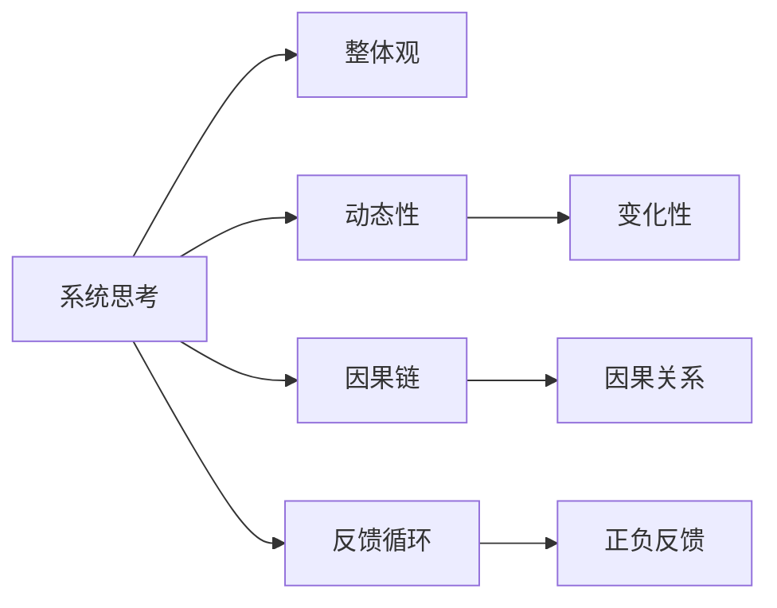

                 

# 系统思考与问题解决能力

在信息爆炸、快速迭代的时代，系统思考(System Thinking)与问题解决能力成为每一位科技从业者必备的核心竞争力。本文将深入探讨系统思考与问题解决的理论基础，并结合实际案例，剖析其方法和技巧，力求为读者提供系统全面的指导。

## 1. 背景介绍

### 1.1 问题由来
在现代科技日新月异、竞争激烈的背景下，企业及个人面临的问题日益复杂多变。传统的问题解决模式往往只关注单一维度，难以兼顾全局和长远。系统思考则提供了一种全局性、动态性的思维框架，通过把握系统整体规律，实现问题的根本解决。

### 1.2 问题核心关键点
系统思考的核心在于以下几个方面：
1. 整体观：强调系统各要素的相互依赖和互动关系，重视系统的整体目标和功能。
2. 动态性：认为系统是不断变化的，需要通过动态分析来理解系统行为。
3. 因果链：揭示系统内因果关系，分析影响系统的关键因素。
4. 反馈循环：理解系统内部的正负反馈机制，合理调整系统结构。

## 2. 核心概念与联系

### 2.1 核心概念概述

为了更好地理解系统思考与问题解决的方法，本节将介绍几个关键概念：

- **系统思考(System Thinking)**：一种全局性的思维方式，通过系统观、动态性、因果链、反馈循环等原理，理解并解决系统性问题。
- **反馈循环(Feedback Loop)**：系统内部的输入和输出之间的循环反馈机制，对系统行为有重要影响。
- **因果链(Causal Chain)**：系统内各要素之间的因果关系链条，揭示问题的根本原因。
- **整体观(Holistic View)**：关注系统的整体目标和功能，避免局限于单一维度。

这些概念共同构成了系统思考的基础框架，帮助我们在复杂环境中识别和解决问题。

### 2.2 核心概念原理和架构的 Mermaid 流程图



以上流程图展示了系统思考的关键概念及其相互关系。整体观、动态性、因果链、反馈循环构成系统思考的四个核心维度，相互关联，共同作用。

## 3. 核心算法原理 & 具体操作步骤

### 3.1 算法原理概述

系统思考与问题解决的核心算法原理可以总结为以下几个步骤：

1. **系统定义**：明确系统的边界和组成要素。
2. **因果链分析**：识别系统内的因果关系链条，理解问题本质。
3. **反馈循环分析**：识别系统的正负反馈机制，理解系统的行为规律。
4. **整体优化**：调整系统的组成部分，优化整体功能。

### 3.2 算法步骤详解

1. **系统定义**：明确系统边界和组成要素。
   - 识别系统的输入、输出和内部组件。
   - 绘制系统的结构图，标明各个组件的相互作用关系。

2. **因果链分析**：识别系统内的因果关系链条，理解问题本质。
   - 通过结构图分析各组件之间的因果关系，列出因果链条。
   - 判断哪些因素是问题的直接原因，哪些是间接原因。

3. **反馈循环分析**：识别系统的正负反馈机制，理解系统的行为规律。
   - 分析系统中各组件间的反馈关系，识别正反馈和负反馈。
   - 通过反馈循环图展示系统的动态行为。

4. **整体优化**：调整系统的组成部分，优化整体功能。
   - 根据因果链和反馈循环的分析结果，制定优化策略。
   - 逐步调整系统的各个组成部分，达到整体最优。

### 3.3 算法优缺点

系统思考与问题解决的优势在于其全局性和动态性，能够全面系统地理解问题，提出根本性解决方案。但同时，也存在以下缺点：
1. **复杂度高**：系统思考需要全面分析系统的各个组成部分，工作量大，复杂度高。
2. **数据需求高**：系统思考依赖大量数据，对数据的全面性和准确性要求较高。
3. **实施难度大**：优化系统的过程可能涉及多个组件和流程，实施难度较大。

### 3.4 算法应用领域

系统思考与问题解决广泛应用于多个领域，包括但不限于：

1. **企业战略管理**：通过系统思考，企业可以全局视角审视内外环境，制定合理的战略规划。
2. **项目管理**：系统思考帮助项目经理理解项目各组成部分的关系，优化资源配置和流程管理。
3. **产品设计**：在系统思考的指导下，设计师可以全面考虑产品的各个方面，提升产品整体性能。
4. **社会问题解决**：政府和组织利用系统思考分析社会问题，制定切实可行的解决方案。
5. **医疗健康**：系统思考应用于疾病预防和治疗，全面分析患者的整体状况，制定个性化治疗方案。

## 4. 数学模型和公式 & 详细讲解 & 举例说明

### 4.1 数学模型构建

系统思考与问题解决可以借助数学模型进行量化分析和优化。这里介绍一种简单的系统优化模型，即线性优化模型：

$$
\min \sum_{i=1}^{n} x_i^2 \\
\text{s.t.} \\
A_{ij}x_j + b_i = 0, \quad i=1,\ldots,m, \\
c_ix_i = d_i, \quad i=1,\ldots,p
$$

其中 $x_i$ 为系统各组成要素的输入，$A_{ij}$ 和 $b_i$ 表示线性约束条件，$c_i$ 和 $d_i$ 表示目标函数。

### 4.2 公式推导过程

上述线性优化模型的推导过程如下：

1. 目标函数：$\min \sum_{i=1}^{n} x_i^2$ 表示最小化系统各组成要素的输入平方和，即最小化系统输入的总体波动。
2. 约束条件：$A_{ij}x_j + b_i = 0$ 表示系统各组成部分之间的线性约束关系，$b_i$ 表示系统输入与约束条件之间的关系。$c_ix_i = d_i$ 表示系统各组成部分的目标值，$c_i$ 和 $d_i$ 为系数。

### 4.3 案例分析与讲解

考虑一个制造企业的生产线优化问题。生产线由多个环节组成，每个环节的输入和输出需要严格控制，以达到整体生产效率最优。

- **系统定义**：生产线由输入原料、生产过程、输出产品等组成，明确各环节的输入输出关系。
- **因果链分析**：通过结构图分析，发现原料质量、设备状态、操作人员技能等因素对生产效率的影响。
- **反馈循环分析**：正反馈体现在生产线对设备状态的自适应调整，负反馈体现在生产效率对原料供应的调节。
- **整体优化**：通过优化原料采购、设备维护、操作培训等环节，提升整体生产效率。

## 5. 项目实践：代码实例和详细解释说明

### 5.1 开发环境搭建

在实际项目中，可以使用Python和Pandas库进行系统思考与问题解决的数学建模和优化。

1. 安装Python：确保系统上已安装Python，并添加相关依赖。
2. 安装Pandas库：通过pip安装Pandas库，用于数据处理和分析。
3. 准备数据：收集系统各组成要素的输入和输出数据，形成数据集。

### 5.2 源代码详细实现

以下是一个简单的线性优化模型求解的Python代码示例：

```python
import numpy as np
from scipy.optimize import linprog

# 定义系统各组成要素的输入和输出
A = np.array([[1, 1], [1, -1], [0, 1]])
b = np.array([10, 5, 0])
c = np.array([1, 0])

# 求解线性优化模型
result = linprog(c, A_ub=A, b_ub=b, bounds=[(0, 10), (0, 5)])
print(result)
```

### 5.3 代码解读与分析

上述代码实现了一个线性优化模型的求解，代码流程如下：

1. 定义系统的输入和输出：通过Numpy数组表示，包含各组成部分之间的线性约束条件和目标函数。
2. 求解线性优化模型：使用SciPy库中的linprog函数求解，返回最优解。
3. 输出结果：打印优化结果，包括各组成要素的最优值。

## 6. 实际应用场景

### 6.1 智能制造

智能制造是现代制造业的重要方向，通过系统思考可以实现生产的数字化、智能化和柔性化。

- **生产系统设计**：通过系统思考分析生产流程中的各环节，设计最优的生产线布局。
- **资源优化**：分析原材料采购、设备维护、人员安排等因素，优化生产效率。
- **质量控制**：通过系统反馈机制，实时监控产品质量，及时调整生产参数。

### 6.2 金融风险管理

金融市场复杂多变，系统思考有助于有效管理风险。

- **风险识别**：通过系统思考分析市场因素和内部风险，识别潜在问题。
- **风险评估**：综合考虑各种风险因素，量化风险水平。
- **风险控制**：制定合理的风险控制策略，优化资产配置。

### 6.3 城市交通管理

城市交通是典型的复杂系统，系统思考有助于解决交通拥堵、环境污染等问题。

- **交通流量分析**：分析交通网络中各要素的流量关系，识别瓶颈节点。
- **资源优化**：调整交通信号灯、道路设计等，优化交通流量。
- **环境改善**：通过系统反馈机制，实时监测环境指标，调整交通管理策略。

## 7. 工具和资源推荐

### 7.1 学习资源推荐

1. 《系统思考：改善决策与创新的方法》：一本经典书籍，深入浅出地介绍了系统思考的基本原理和应用方法。
2. 《复杂系统：探索科学中的创新》：介绍了复杂系统的理论和应用，特别是系统思考在科技管理中的应用。
3. 《System Dynamics 101: An Introduction to System Dynamics》：通过具体的案例讲解系统动态学的基本原理。
4. 在线课程：Coursera和edX等平台提供了系统思考和复杂系统的相关课程，适合初学者入门。
5. 社区和论坛：如System Dynamics Society和Complexity Hub，提供丰富的学习资源和交流平台。

### 7.2 开发工具推荐

1. Python和Pandas：适合数据处理和分析，是系统思考与问题解决的常用工具。
2. System Modeler：用于建模和分析复杂系统，支持系统动态学理论的应用。
3. Simio：模拟和优化复杂系统，适合资源优化和流程管理。
4. Matlab/Simulink：用于系统仿真和优化，适合复杂系统的设计和分析。

### 7.3 相关论文推荐

1. "Complex Adaptive Systems: An Introduction to Computational Models of Social Life"：该书介绍了复杂系统的理论和应用，特别是系统思考在社会科学中的应用。
2. "Principles of System Dynamics"：系统动力学原理，适合系统思考和问题解决的基础学习。
3. "System Dynamics and Management: A Modeling Approach to Organizational Theory and Management"：系统思考在组织管理中的应用，提供丰富的实际案例和分析方法。

## 8. 总结：未来发展趋势与挑战

### 8.1 总结

本文对系统思考与问题解决的理论与实践进行了全面介绍。系统思考通过整体观、动态性、因果链、反馈循环等原理，理解并解决复杂系统性问题。通过具体的案例分析，展示了系统思考在企业管理、金融风险管理、城市交通管理等领域的实际应用。同时，本文提供了丰富的学习资源和工具推荐，帮助读者深入掌握系统思考的方法和技巧。

### 8.2 未来发展趋势

系统思考与问题解决未来将呈现以下几个发展趋势：

1. **智能化发展**：结合人工智能和大数据技术，提升系统思考的精度和效率。
2. **跨领域融合**：系统思考与问题解决将与其他学科结合，如经济学、心理学、社会学等，拓展应用领域。
3. **自适应系统**：开发自适应系统，使系统能够实时调整和优化，提升响应速度和适应能力。
4. **区块链技术**：结合区块链技术，实现系统内部的透明性和安全性，增强系统的可靠性。
5. **虚拟现实**：通过虚拟现实技术，提供系统可视化和交互界面，增强系统思考的直观性和操作性。

### 8.3 面临的挑战

尽管系统思考与问题解决具有诸多优势，但在实际应用中仍面临以下挑战：

1. **数据获取难度**：系统思考依赖大量数据，但在一些复杂系统中，数据获取难度较大。
2. **计算复杂度**：系统模型的构建和求解过程复杂度高，需要高效的计算工具支持。
3. **模型适应性**：系统模型需要根据实际情况进行调整和优化，确保模型适应性强。
4. **系统可操作性**：系统思考的结果需要在实际系统中落地应用，需要考虑系统的可操作性。
5. **跨学科沟通**：系统思考涉及多学科知识，跨学科沟通难度较大。

### 8.4 研究展望

未来在系统思考与问题解决的研究中，需要关注以下几个方向：

1. **多学科融合**：结合经济学、心理学、社会学等多学科知识，拓展系统思考的理论和应用。
2. **人工智能结合**：结合机器学习、深度学习等技术，提升系统思考的智能化水平。
3. **跨平台应用**：开发跨平台的应用工具，提升系统思考的可操作性和可扩展性。
4. **实时化优化**：开发实时化的优化方法，使系统能够动态调整和优化，适应不断变化的环境。
5. **普适性设计**：开发普适性设计方法，使系统思考能够适应不同规模和复杂度的系统。

## 9. 附录：常见问题与解答

**Q1：系统思考与问题解决的适用范围有哪些？**

A: 系统思考与问题解决适用于各种复杂系统，特别是涉及多个组成部分和动态变化的系统。例如，企业管理、城市交通、金融风险管理等领域。

**Q2：系统思考与问题解决有哪些步骤？**

A: 系统思考与问题解决的步骤包括：系统定义、因果链分析、反馈循环分析和整体优化。通过系统定义明确系统边界和组成要素，通过因果链分析理解问题本质，通过反馈循环分析理解系统行为规律，通过整体优化调整系统组成部分，优化整体功能。

**Q3：如何选择合适的系统优化模型？**

A: 选择系统优化模型需要考虑系统的复杂度、数据获取难度和优化目标。简单线性系统可以使用线性优化模型，复杂系统可以使用动态优化模型，如系统动力学模型。

**Q4：系统思考与问题解决在实际应用中需要注意哪些问题？**

A: 在实际应用中，需要注意数据获取难度、计算复杂度、模型适应性、系统可操作性和跨学科沟通等问题。需要结合实际情况，选择合适的工具和方法，确保系统思考的效果。

**Q5：系统思考与问题解决有哪些成功案例？**

A: 成功的系统思考与问题解决案例包括：丰田汽车的生产线优化、城市交通拥堵治理、金融市场风险管理等。这些案例展示了系统思考在实际应用中的巨大价值。

---

作者：禅与计算机程序设计艺术 / Zen and the Art of Computer Programming

