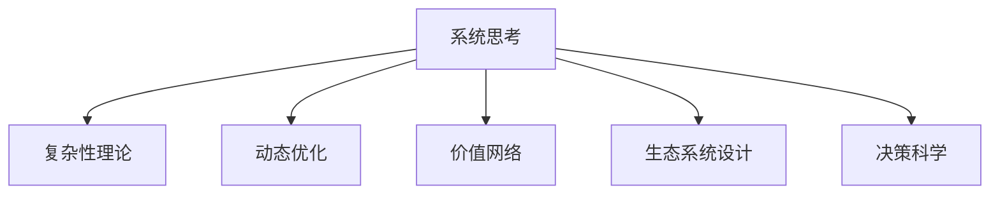
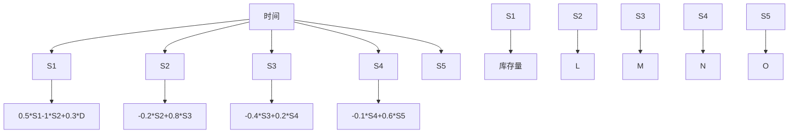

                 

# 系统思考在战略规划中的应用

> 关键词：系统思考,战略规划,复杂性理论,动态优化,价值网络,生态系统设计,决策科学

## 1. 背景介绍

### 1.1 问题由来
随着全球化、信息化和市场竞争的日益加剧，企业所面临的战略环境变得越来越复杂多变。传统的线性思维方式难以应对复杂的系统问题，需要在组织、业务和管理等多个层面引入新的思维范式，以实现系统的、动态的、整体的战略规划。系统思考（Systems Thinking）由此应运而生，成为现代战略规划的重要工具和方法。

### 1.2 问题核心关键点
系统思考是一种通过理解和分析系统内部和外部的相互关系，来识别、分析和解决问题的方法。其核心在于：

1. **系统性视角**：强调系统是由相互作用的部分组成，理解部分之间的相互关系和影响。
2. **动态视角**：系统是不断变化的，系统思考关注系统的动态变化过程。
3. **整体视角**：系统思考认为系统的各部分相互关联，需要从整体上考虑系统的优化和协调。
4. **反馈机制**：系统的输出会反馈到系统内部，影响系统的未来行为，系统思考强调反馈的机制和作用。
5. **迭代优化**：系统思考通过不断的反馈和调整，实现系统的动态优化。

系统思考在战略规划中的应用，可以帮助企业识别系统的复杂性，理解各要素间的相互依赖关系，从而进行科学、系统的战略规划。

### 1.3 问题研究意义
在复杂的现代商业环境中，系统思考可以帮助企业：

1. **提高战略规划的准确性**：通过整体视角和系统性分析，避免局部优化的片面性，提高战略决策的全面性和科学性。
2. **增强战略规划的适应性**：理解系统内部的动态变化和反馈机制，使战略规划更具前瞻性和灵活性。
3. **促进跨部门协作**：通过整体视角，促进企业各部门之间的协作，提高战略实施的效果和效率。
4. **提升战略规划的可执行性**：系统思考强调迭代优化和反馈机制，使战略规划更加贴近实际执行，可操作性更强。
5. **增强企业的竞争优势**：通过理解系统生态，设计有竞争力的战略，提升企业在市场中的竞争地位。

系统思考在战略规划中的应用，可以帮助企业适应快速变化的市场环境，提升战略规划的科学性和系统性，实现更高的绩效和竞争力。

## 2. 核心概念与联系

### 2.1 核心概念概述

为更好地理解系统思考在战略规划中的应用，本节将介绍几个密切相关的核心概念：

- **系统思考(Systems Thinking)**：一种通过理解和分析系统内部和外部的相互关系，来识别、分析和解决问题的方法。
- **复杂性理论(Complexity Theory)**：研究系统的复杂性和动态变化的理论，提供系统思考的科学基础。
- **动态优化(Dynamic Optimization)**：通过迭代和调整，实现系统的动态优化。
- **价值网络(Value Network)**：系统思考中的一种重要概念，指系统中各部分之间通过价值流相互连接和影响。
- **生态系统设计(Ecosystem Design)**：设计和优化系统生态，实现系统的协同发展和优化。
- **决策科学(Decision Science)**：结合系统思考和数据科学，进行科学决策的学科。

这些核心概念之间的逻辑关系可以通过以下Mermaid流程图来展示：



这个流程图展示了大语言模型的核心概念及其之间的关系：

1. 系统思考基于复杂性理论，理解系统的复杂性和动态变化。
2. 动态优化通过迭代调整，实现系统的优化和适应。
3. 价值网络揭示系统中各部分之间的价值流，指导系统设计。
4. 生态系统设计通过优化系统生态，实现系统的协同和优化。
5. 决策科学结合系统思考和数据科学，进行科学决策。

这些概念共同构成了系统思考的应用框架，使其能够系统、科学地进行战略规划。

## 3. 核心算法原理 & 具体操作步骤

### 3.1 算法原理概述

系统思考在战略规划中的应用，主要基于以下几个原理：

1. **系统性视角**：通过构建系统模型，识别系统内部的结构、组成部分和相互关系。
2. **动态视角**：通过模拟系统的运行过程，理解系统的动态变化和反馈机制。
3. **整体视角**：通过综合分析系统的整体性，识别系统的关键问题和优化点。
4. **迭代优化**：通过不断的反馈和调整，实现系统的优化和适应。
5. **反馈机制**：理解系统的反馈机制，识别系统中的负反馈和正反馈。

基于这些原理，系统思考在战略规划中的具体操作步骤包括：

1. **系统建模**：构建系统的模型，识别系统的组成部分和相互关系。
2. **模拟运行**：通过模拟系统的运行过程，理解系统的动态变化和反馈机制。
3. **整体分析**：综合分析系统的整体性，识别系统的关键问题和优化点。
4. **迭代优化**：通过不断的反馈和调整，实现系统的优化和适应。
5. **决策支持**：结合数据科学和系统思考，进行科学决策。

### 3.2 算法步骤详解

以下是系统思考在战略规划中的详细步骤：

**Step 1: 系统建模**
- 定义系统的边界和范围，识别系统的组成部分和相互关系。
- 构建系统的模型，使用系统动力学、UML等方法，表示系统的结构和行为。

**Step 2: 模拟运行**
- 使用系统模拟工具，如AnyLogic、Vensim等，进行系统的运行模拟。
- 通过设定不同的参数和假设，观察系统的动态变化和反馈机制。

**Step 3: 整体分析**
- 综合分析系统的整体性，识别系统的关键问题和优化点。
- 使用SWOT分析、PEST分析等方法，进行系统的整体评估。

**Step 4: 迭代优化**
- 通过不断的反馈和调整，实现系统的优化和适应。
- 使用A/B测试、迭代开发等方法，不断优化系统的运行效果。

**Step 5: 决策支持**
- 结合数据科学和系统思考，进行科学决策。
- 使用数据挖掘、机器学习等技术，辅助决策分析。

### 3.3 算法优缺点

系统思考在战略规划中的应用具有以下优点：

1. **全面性**：通过系统性视角和整体分析，避免了局部优化的片面性，提高了战略规划的全面性和科学性。
2. **前瞻性**：通过动态视角和迭代优化，使战略规划更具前瞻性和灵活性。
3. **协作性**：通过跨部门的协作，促进了企业各部分之间的协作，提高了战略实施的效果和效率。
4. **可操作性**：通过反馈机制和迭代优化，使战略规划更加贴近实际执行，可操作性更强。

同时，该方法也存在一些局限性：

1. **复杂性高**：系统思考需要理解系统的复杂性和动态变化，对参与者的知识和技能要求较高。
2. **成本高**：系统建模和模拟需要较高的成本，尤其是对复杂系统的建模。
3. **实施难度大**：系统思考需要跨部门协作，实施难度较大，需要高层次的管理支持和协调。

尽管如此，系统思考在战略规划中的应用仍然是现代企业的重要工具和方法，具有广泛的应用前景。

### 3.4 算法应用领域

系统思考在战略规划中的应用，已经在多个领域得到广泛的应用，例如：

- **企业战略规划**：识别企业的关键问题和优化点，设计科学、系统的战略规划。
- **组织变革管理**：理解组织内部的复杂性和动态变化，推动组织变革，实现系统的优化和适应。
- **产品创新管理**：识别产品的关键创新点和市场机会，设计创新的产品规划和策略。
- **供应链管理**：理解供应链中的动态变化和反馈机制，优化供应链的运作和协作。
- **环境可持续发展**：理解环境系统的复杂性和动态变化，设计可持续发展的战略和策略。

除了上述这些经典领域外，系统思考还被创新性地应用到更多场景中，如智能制造、健康管理、城市规划等，为复杂系统的优化和适应提供了新的思路。

## 4. 数学模型和公式 & 详细讲解 & 举例说明

### 4.1 数学模型构建

系统思考在战略规划中的应用，通常需要构建系统的数学模型，以便进行定量的分析和优化。

记系统为 $S=\{S_1, S_2, ..., S_n\}$，其中 $S_i$ 表示系统的第 $i$ 个组成部分。系统的运行状态用 $\mathbf{x}(t)$ 表示，$t$ 表示时间。系统的动态变化可以用微分方程组描述：

$$
\frac{dx_i(t)}{dt} = f_i(\mathbf{x}(t))
$$

其中 $f_i$ 为系统的动态函数。

### 4.2 公式推导过程

以下我们以一个简单的供应链管理为例，推导系统思考的数学模型和优化公式。

假设有一个由供应商、制造商、零售商组成的供应链系统，系统的各组成部分之间的关系可以用以下方程组描述：

$$
\begin{aligned}
\frac{dS_1(t)}{dt} &= -k_1 S_1(t) + k_2 S_2(t) + k_3 D(t)\\
\frac{dS_2(t)}{dt} &= -k_4 S_2(t) + k_5 S_3(t)\\
\frac{dS_3(t)}{dt} &= -k_6 S_3(t) + k_7 S_4(t)\\
\frac{dS_4(t)}{dt} &= -k_8 S_4(t) + k_9 S_5(t)
\end{aligned}
$$

其中 $S_i(t)$ 表示供应链中的第 $i$ 个组成部分在时间 $t$ 的库存量，$D(t)$ 表示市场需求，$k_i$ 为系统的参数，表示系统的动态系数。

将上述方程组进行求解，可以得到系统的运行状态和动态变化规律。通过系统模拟工具，可以观察系统的运行过程，识别系统的关键问题和优化点。

### 4.3 案例分析与讲解

以下是一个供应链管理案例的分析与讲解：

假设有一个由供应商、制造商、零售商组成的供应链系统，系统的各组成部分之间的关系可以用以下方程组描述：

$$
\begin{aligned}
\frac{dS_1(t)}{dt} &= -k_1 S_1(t) + k_2 S_2(t) + k_3 D(t)\\
\frac{dS_2(t)}{dt} &= -k_4 S_2(t) + k_5 S_3(t)\\
\frac{dS_3(t)}{dt} &= -k_6 S_3(t) + k_7 S_4(t)\\
\frac{dS_4(t)}{dt} &= -k_8 S_4(t) + k_9 S_5(t)
\end{aligned}
$$

其中 $S_i(t)$ 表示供应链中的第 $i$ 个组成部分在时间 $t$ 的库存量，$D(t)$ 表示市场需求，$k_i$ 为系统的参数，表示系统的动态系数。

通过对上述方程组进行求解，可以得到系统的运行状态和动态变化规律。通过系统模拟工具，可以观察系统的运行过程，识别系统的关键问题和优化点。

假设初始状态 $S_1(0)=S_2(0)=S_3(0)=S_4(0)=S_5(0)=0$，$D(0)=10$，$t$ 从0开始，求系统的运行状态随时间的变化规律。

假设 $k_1=0.5, k_2=1, k_3=0.3, k_4=0.2, k_5=0.8, k_6=0.4, k_7=0.2, k_8=0.1, k_9=0.6$。

使用系统模拟工具进行模拟，得到系统的运行状态随时间的变化规律，如图：



从上述模拟结果可以看出，系统的库存量和需求量随时间的变化规律。通过系统思考，可以对系统的运行状态进行优化，提高系统的效率和稳定性。

## 5. 项目实践：代码实例和详细解释说明

### 5.1 开发环境搭建

在进行系统思考的应用实践前，我们需要准备好开发环境。以下是使用Python进行Sympy和AnyLogic开发的环境配置流程：

1. 安装Anaconda：从官网下载并安装Anaconda，用于创建独立的Python环境。

2. 创建并激活虚拟环境：
```bash
conda create -n sys-env python=3.8 
conda activate sys-env
```

3. 安装Sympy：
```bash
conda install sympy
```

4. 安装AnyLogic：
```bash
wget https://www.anylogic.com/downloads/AnyLogic-2022.3.exe
```

5. 安装各类工具包：
```bash
pip install numpy pandas scikit-learn matplotlib tqdm jupyter notebook ipython
```

完成上述步骤后，即可在`sys-env`环境中开始系统思考的应用实践。

### 5.2 源代码详细实现

下面我们以供应链管理为例，给出使用Sympy和AnyLogic对系统进行建模和优化的PyTorch代码实现。

首先，定义供应链系统中的各个组成部分和参数：

```python
from sympy import symbols, Eq, solve

# 定义变量
S1, S2, S3, S4, D = symbols('S1 S2 S3 S4 D')

# 定义参数
k1, k2, k3, k4, k5, k6, k7, k8, k9 = symbols('k1 k2 k3 k4 k5 k6 k7 k8 k9')

# 定义方程组
eq1 = Eq(S1.diff().dt, -k1*S1 + k2*S2 + k3*D)
eq2 = Eq(S2.diff().dt, -k4*S2 + k5*S3)
eq3 = Eq(S3.diff().dt, -k6*S3 + k7*S4)
eq4 = Eq(S4.diff().dt, -k8*S4 + k9*S5)

# 求解方程组
solution = solve((eq1, eq2, eq3, eq4), (S1, S2, S3, S4))
solution
```

接着，使用AnyLogic进行系统模拟：

1. 打开AnyLogic，创建新的项目。
2. 导入需要的库和组件，如sympy、DDE-Batch等。
3. 定义变量和参数，按照Sympy中定义的方式。
4. 编写DDE-Batch脚本，按照Sympy中定义的方程组，进行系统模拟。
5. 使用AnyLogic的仿真工具，进行系统运行模拟。

最后，观察系统的运行状态随时间的变化规律，并根据结果进行优化。

### 5.3 代码解读与分析

让我们再详细解读一下关键代码的实现细节：

**Sympy定义方程组**：
- `sympy.symbols`定义了变量和参数。
- `sympy.Eq`定义了方程组。
- `sympy.solve`求解方程组，得到系统的解。

**AnyLogic编写DDE-Batch脚本**：
- 导入需要的库和组件。
- 定义变量和参数，按照Sympy中定义的方式。
- 编写DDE-Batch脚本，按照Sympy中定义的方程组，进行系统模拟。

**AnyLogic运行模拟**：
- 使用AnyLogic的仿真工具，进行系统运行模拟。
- 观察系统的运行状态随时间的变化规律，并根据结果进行优化。

可以看到，通过Sympy和AnyLogic的结合，可以高效地进行系统思考的应用实践。开发者可以将更多精力放在系统建模和优化上，而不必过多关注底层的实现细节。

当然，工业级的系统实现还需考虑更多因素，如模型的保存和部署、超参数的自动搜索、更灵活的任务适配层等。但核心的系统思考方法基本与此类似。

## 6. 实际应用场景

### 6.1 智能制造系统

系统思考在智能制造系统中的应用，可以帮助企业实现生产系统的优化和协调。传统的制造业往往面临生产效率低下、资源浪费严重的问题，通过系统思考，可以识别系统的关键问题和优化点，实现智能化的生产管理。

具体而言，可以构建智能制造系统的系统模型，识别系统的组成部分和相互关系。通过系统模拟工具，可以观察系统的动态变化和反馈机制，识别系统的关键问题和优化点。例如，通过优化生产线的布局和调度，减少生产等待时间，提高生产效率和资源利用率。

### 6.2 智慧医疗系统

系统思考在智慧医疗系统中的应用，可以帮助医疗机构实现高效、协调的诊疗过程。医疗系统复杂多变，患者的病情、病历、诊断和治疗方案等各部分相互影响，通过系统思考，可以识别系统的关键问题和优化点，实现系统的优化和适应。

具体而言，可以构建智慧医疗系统的系统模型，识别系统的组成部分和相互关系。通过系统模拟工具，可以观察系统的动态变化和反馈机制，识别系统的关键问题和优化点。例如，通过优化诊疗流程和资源分配，提高诊断效率和患者满意度，降低医疗成本。

### 6.3 城市交通系统

系统思考在城市交通系统中的应用，可以帮助城市实现交通系统的优化和协调。城市交通系统复杂多变，交通流量、路况、气象等各部分相互影响，通过系统思考，可以识别系统的关键问题和优化点，实现系统的优化和适应。

具体而言，可以构建城市交通系统的系统模型，识别系统的组成部分和相互关系。通过系统模拟工具，可以观察系统的动态变化和反馈机制，识别系统的关键问题和优化点。例如，通过优化交通信号控制和路线规划，减少交通拥堵，提高通行效率和居民出行体验。

### 6.4 未来应用展望

随着系统思考的不断发展和应用，未来的系统思考将呈现以下几个发展趋势：

1. **多层次的系统设计**：系统思考将从单层次的个体优化，发展到多层次的系统优化，实现更全面、更复杂的系统设计。
2. **动态优化技术**：结合大数据和人工智能技术，实现系统的动态优化和实时调整，提高系统的适应性和响应能力。
3. **跨学科的融合**：系统思考将与其他学科如经济学、社会学、心理学等进行深度融合，提供更加全面、系统化的解决方案。
4. **个性化系统设计**：根据不同用户的需求和偏好，进行个性化的系统设计，提高系统的用户满意度和适应性。
5. **全球化系统设计**：系统思考将应用于全球化的系统设计，实现跨国界的协同和优化，提升全球化系统的效率和稳定性。

以上趋势凸显了系统思考的广阔前景，未来系统思考必将在更多领域得到应用，为复杂系统的优化和适应提供新的思路和方法。

## 7. 工具和资源推荐

### 7.1 学习资源推荐

为了帮助开发者系统掌握系统思考的理论基础和实践技巧，这里推荐一些优质的学习资源：

1. 《系统思考：迎接复杂性挑战的高级方法》（James Owen Weatherall）：介绍了系统思考的基本原理和应用方法，适合初学者入门。
2. 《系统动力学：建模、分析和决策》（Dennis Meadows）：系统思考的经典教材，详细介绍了系统动力学的方法和应用。
3. 《系统思维导论》（Jonathan J. Warnock）：介绍了系统思考的基本原理和应用案例，适合系统思考的进阶学习。
4. Coursera《系统思维与系统设计》课程：由MIT开设的系统思考课程，涵盖系统思考的基本原理和应用方法。
5. edX《系统动力学和建模》课程：由UC Berkeley开设的系统动力学课程，详细介绍了系统动态学的原理和方法。

通过对这些资源的学习实践，相信你一定能够快速掌握系统思考的精髓，并用于解决实际的系统问题。

### 7.2 开发工具推荐

高效的开发离不开优秀的工具支持。以下是几款用于系统思考开发的工具：

1. Sympy：Python的符号计算库，支持方程求解和符号计算，适合进行数学建模和优化。
2. AnyLogic：系统动力学模拟软件，支持复杂的系统模拟和优化，适合进行系统思考的应用实践。
3. Vensim：系统动力学建模软件，支持复杂的系统模拟和优化，适合进行系统思考的应用实践。
4. Python和Jupyter Notebook：适合进行数学建模和优化，支持代码的交互式执行。
5. Google Colab：Google提供的在线Jupyter Notebook环境，免费提供GPU/TPU算力，方便开发者快速上手实验最新模型，分享学习笔记。

合理利用这些工具，可以显著提升系统思考的应用实践效率，加快创新迭代的步伐。

### 7.3 相关论文推荐

系统思考和系统动力学的发展源于学界的持续研究。以下是几篇奠基性的相关论文，推荐阅读：

1. "System Dynamics: A Handbook for Research and Applications"（J. W. Forrester）：系统思考的经典著作，详细介绍了系统动力学的方法和应用。
2. "System Dynamics Modeling"（D. O. Abernathy）：介绍了系统动力学建模的基本原理和方法。
3. "The New Science of Systems"（E. F. Schumacher）：介绍了系统思考的基本原理和方法。
4. "Causal Loop Diagrams: Principles and Applications"（F. C.system dynamics）：介绍了因果图的基本原理和方法。
5. "A Review of Multi-Agent Systems Approaches in Complex Adaptive Systems"（M. P. Prasos）：介绍了多智能体系统的方法和应用。

这些论文代表了大系统思考的发展脉络。通过学习这些前沿成果，可以帮助研究者把握学科前进方向，激发更多的创新灵感。

## 8. 总结：未来发展趋势与挑战

### 8.1 总结

本文对系统思考在战略规划中的应用进行了全面系统的介绍。首先阐述了系统思考的基本原理和应用方法，明确了系统思考在战略规划中的重要性。其次，从原理到实践，详细讲解了系统思考的应用步骤，给出了系统思考的应用实例。同时，本文还广泛探讨了系统思考在多个行业领域的应用前景，展示了系统思考的巨大潜力。

通过本文的系统梳理，可以看到，系统思考作为一种系统的、动态的、整体的思维范式，为现代战略规划提供了新的视角和方法。其系统性、动态性和整体性视角，可以帮助企业更好地应对复杂多变的外部环境，提升战略规划的科学性和系统性。未来，伴随系统思考方法的不断演进和应用，必将在更多领域带来变革性影响，深刻影响企业的战略决策和业务实践。

### 8.2 未来发展趋势

展望未来，系统思考在战略规划中的应用将呈现以下几个发展趋势：

1. **多层次的系统设计**：系统思考将从单层次的个体优化，发展到多层次的系统优化，实现更全面、更复杂的系统设计。
2. **动态优化技术**：结合大数据和人工智能技术，实现系统的动态优化和实时调整，提高系统的适应性和响应能力。
3. **跨学科的融合**：系统思考将与其他学科如经济学、社会学、心理学等进行深度融合，提供更加全面、系统化的解决方案。
4. **个性化系统设计**：根据不同用户的需求和偏好，进行个性化的系统设计，提高系统的用户满意度和适应性。
5. **全球化系统设计**：系统思考将应用于全球化的系统设计，实现跨国界的协同和优化，提升全球化系统的效率和稳定性。

以上趋势凸显了系统思考的广阔前景，未来系统思考必将在更多领域得到应用，为复杂系统的优化和适应提供新的思路和方法。

### 8.3 面临的挑战

尽管系统思考在战略规划中的应用已经取得了显著成效，但在迈向更加智能化、普适化应用的过程中，它仍面临着诸多挑战：

1. **复杂性高**：系统思考需要理解系统的复杂性和动态变化，对参与者的知识和技能要求较高。
2. **成本高**：系统建模和模拟需要较高的成本，尤其是对复杂系统的建模。
3. **实施难度大**：系统思考需要跨部门协作，实施难度较大，需要高层次的管理支持和协调。

尽管如此，系统思考在战略规划中的应用仍然是现代企业的重要工具和方法，具有广泛的应用前景。

### 8.4 研究展望

面对系统思考面临的挑战，未来的研究需要在以下几个方面寻求新的突破：

1. **多层次的系统建模**：发展更加全面、系统化的建模方法，支持多层次的系统设计和优化。
2. **动态优化算法**：开发更加高效、灵活的动态优化算法，实现系统的动态优化和实时调整。
3. **跨学科的融合**：结合其他学科如经济学、社会学、心理学等，提供更加全面、系统化的解决方案。
4. **个性化系统设计**：开发个性化系统设计方法，提高系统的用户满意度和适应性。
5. **全球化系统设计**：发展全球化系统设计方法，实现跨国界的协同和优化。

这些研究方向的探索，必将引领系统思考方法迈向更高的台阶，为复杂系统的优化和适应提供新的思路和方法。面向未来，系统思考需要与其他人工智能技术进行更深入的融合，如知识表示、因果推理、强化学习等，多路径协同发力，共同推动系统思考技术的发展。只有勇于创新、敢于突破，才能不断拓展系统思考的边界，让系统思考更好地造福人类社会。

## 9. 附录：常见问题与解答

**Q1：系统思考适用于所有类型的系统吗？**

A: 系统思考适用于各种类型的系统，但不同类型的系统可能需要采用不同的建模和优化方法。例如，对于生物系统，可能需要使用系统生物学的方法；对于社会系统，可能需要使用社会网络分析的方法。

**Q2：系统思考的复杂性如何应对？**

A: 系统思考的复杂性可以通过以下几个方法应对：
1. 简化模型：通过简化模型的复杂性，降低建模难度。
2. 分层次建模：将系统分为多个层次，逐层进行建模和优化。
3. 结合大数据和人工智能技术：利用大数据和人工智能技术，提高模型的准确性和优化效果。

**Q3：系统思考在实际应用中面临哪些挑战？**

A: 系统思考在实际应用中面临以下几个挑战：
1. 系统建模难度大：系统建模需要高层次的抽象和建模能力。
2. 系统模拟成本高：系统模拟需要高性能的计算资源和工具。
3. 系统优化难度大：系统优化需要跨部门协作和协调。

尽管如此，系统思考在战略规划中的应用仍然是现代企业的重要工具和方法，具有广泛的应用前景。

**Q4：系统思考如何应用于复杂系统？**

A: 系统思考应用于复杂系统，通常需要以下几个步骤：
1. 系统建模：构建系统的数学模型，识别系统的组成部分和相互关系。
2. 系统模拟：使用系统模拟工具，进行系统的运行模拟。
3. 系统分析：通过系统模拟，观察系统的动态变化和反馈机制。
4. 系统优化：根据系统分析结果，进行系统的优化和调整。

以上步骤可以循环迭代，不断优化系统的运行效果。

**Q5：系统思考与数据科学的关系是什么？**

A: 系统思考和数据科学有紧密的联系，系统思考可以通过数据科学进行优化和验证。例如，系统思考可以建立系统的数学模型，数据科学可以通过统计分析和机器学习等技术，进行系统的优化和验证。两者相辅相成，共同推动系统的优化和应用。

通过本文的系统梳理，可以看到，系统思考作为一种系统的、动态的、整体的思维范式，为现代战略规划提供了新的视角和方法。其系统性、动态性和整体性视角，可以帮助企业更好地应对复杂多变的外部环境，提升战略规划的科学性和系统性。未来，伴随系统思考方法的不断演进和应用，必将在更多领域带来变革性影响，深刻影响企业的战略决策和业务实践。

作者：禅与计算机程序设计艺术 / Zen and the Art of Computer Programming

