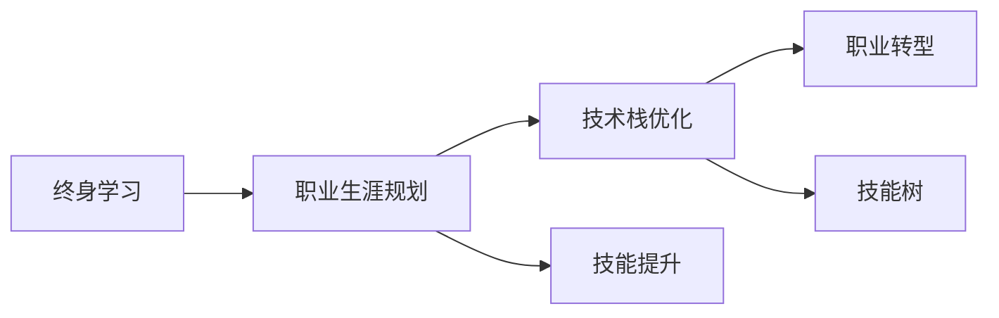

                 

# 终身学习与职业生涯规划

> 关键词：终身学习, 职业生涯规划, 持续进步, 技能提升, 职业转型, 技术栈优化, 技能树, 自我驱动, 专业发展

## 1. 背景介绍

### 1.1 问题由来

在快速发展的信息技术领域，技术和市场的变化日新月异。从业者不仅需要不断学习新技术，还需要对职业生涯进行合理规划，以适应技术演进和市场变化，保持竞争力。终身学习与职业生涯规划已成为IT从业人员的重要课题。

### 1.2 问题核心关键点

本文档将从终身学习的理论基础出发，探讨如何制定科学的职业生涯规划，利用技术栈优化和技能提升实现职业转型和成长。将围绕以下几个核心问题进行深入讨论：

- 什么是终身学习？
- 为什么终身学习对IT从业者至关重要？
- 如何制定科学的职业生涯规划？
- 技术栈优化和技能提升的策略和方法？
- 如何进行职业转型和成长？

通过回答这些问题，旨在帮助IT从业者理解终身学习的重要性，并掌握有效的职业规划和发展的策略。

## 2. 核心概念与联系

### 2.1 核心概念概述

为了更好地理解终身学习和职业生涯规划，我们先对涉及的核心概念进行概述：

- **终身学习(Lifelong Learning)**：不限于某一阶段的学习，而是指在人生各个阶段持续不断获取知识和技能的过程。在信息技术和知识驱动的行业，终身学习是个人成长和适应变化的关键。

- **职业生涯规划(Career Planning)**：对个人的职业目标、路径、阶段和策略进行系统规划的过程。它基于对自身兴趣、能力和市场需求的研究，帮助个体实现长期职业目标。

- **技术栈优化(Technology Stack Optimization)**：通过对个人技能和所掌握技术的学习和整合，以实现技术能力的最优化配置，提升工作效率和质量。

- **技能提升(Skill Enhancement)**：通过持续学习和实践，提升个人在特定技术或领域的专业能力。

- **职业转型(Career Transition)**：从一种职业角色转变为另一种职业角色的过程，可以是基于兴趣、市场需求或个人发展需要。

- **技能树(Skill Tree)**：形象化地表示个体技能成长路径的模型，通常包含基础技能、进阶技能和专业技能。

### 2.2 核心概念原理和架构的 Mermaid 流程图



这个流程图展示了终身学习、职业生涯规划、技术栈优化、技能提升和职业转型之间的关系：

1. 终身学习是基础，提供不断更新的知识和技能。
2. 职业生涯规划是基于终身学习的，制定明确的职业路径。
3. 技术栈优化和技能提升是规划中的具体实施步骤，以实现目标。
4. 职业转型是职业生涯规划的重要结果，帮助个人实现职业目标。
5. 技能树形象化表示技能发展路径，帮助个体理解自己的成长历程。

## 3. 核心算法原理 & 具体操作步骤

### 3.1 算法原理概述

终身学习和职业生涯规划的算法原理，是基于动态系统理论和优化算法的应用。在不断变化的信息技术领域，个人职业发展可以被看作一个动态系统，其中持续学习和技能提升是输入，职业生涯规划是控制策略，职业转型是输出。

一个优化的职业发展路径，应该是基于市场需求、个人兴趣和能力评估的，并能够最大化个人职业满意度和社会效益。通过构建动态模型，我们可以量化职业路径中的各个因素，并对各种策略进行评估和优化。

### 3.2 算法步骤详解

基于上述算法原理，制定终身学习与职业生涯规划的步骤如下：

#### 3.2.1 自我评估与目标设定

- **评估兴趣与能力**：进行自我兴趣、技能和能力评估，了解自身的优势和兴趣所在。
- **确定职业目标**：基于评估结果，设定短期和长期职业目标。

#### 3.2.2 市场需求调研

- **行业调研**：分析当前和未来技术趋势，识别市场需求，选择具有成长潜力的技术栈。
- **职业调研**：了解不同职业路径和角色，选择与自身兴趣和目标相匹配的职业方向。

#### 3.2.3 技术栈与技能规划

- **技能评估**：基于目标岗位要求，评估现有技能，识别差距。
- **技术栈优化**：规划学习路线，确定需要掌握的核心技术栈和技能，并进行优先级排序。

#### 3.2.4 学习与实践

- **制定学习计划**：根据技术栈优化和技能规划，制定详细的学习计划。
- **实践与反馈**：通过实际项目或贡献开源社区，检验学习效果，获得反馈。

#### 3.2.5 职业转型与成长

- **职业转型策略**：基于现有技能和市场机会，制定职业转型策略。
- **持续学习与提升**：根据职业转型需要，调整学习计划，保持持续进步。

### 3.3 算法优缺点

#### 3.3.1 优点

- **适应性强**：可以灵活应对技术更新和市场变化。
- **目标明确**：通过科学的评估和规划，更高效地实现职业目标。
- **全面发展**：不仅关注技术技能，还考虑软技能和个人成长。

#### 3.3.2 缺点

- **复杂度高**：需要综合考虑多方面因素，制定个性化规划。
- **资源需求**：需要时间和精力进行持续学习和实践。
- **策略风险**：市场和技术的不确定性可能影响规划的有效性。

### 3.4 算法应用领域

终身学习和职业生涯规划的算法，在以下领域有广泛的应用：

- **IT与软件开发**：技术栈更新快，持续学习尤为重要。
- **数据科学与人工智能**：技术和方法日新月异，终身学习是必不可少的。
- **企业管理与决策**：需要持续提升个人和团队的技能，以适应市场变化。
- **教育与培训**：教师和教育工作者需要不断学习新技术和新方法，提升教学质量。

## 4. 数学模型和公式 & 详细讲解 & 举例说明

### 4.1 数学模型构建

为了量化和优化职业发展路径，我们构建以下数学模型：

- **输入变量**：兴趣 $I$、技能 $S$、市场需求 $D$。
- **输出变量**：职业目标 $G$、职业满意度 $T$、社会效益 $E$。
- **控制策略**：学习计划 $L$、职业路径 $P$。

### 4.2 公式推导过程

通过构建动态系统模型，我们可以对职业发展路径进行量化分析。假设职业发展路径是连续变化的，可以使用微分方程来描述：

$$
\frac{dG}{dt} = f(I, S, D, L, P)
$$

其中 $f$ 是一个复杂的非线性函数，表示各种因素的相互作用。我们可以进一步简化模型，引入离散化的时间步 $t$，得到差分方程：

$$
G_{t+1} = g(G_t, I_t, S_t, D_t, L_t, P_t)
$$

其中 $g$ 是一个简化后的函数。

### 4.3 案例分析与讲解

假设一个软件开发人员 $A$，当前技能水平 $S_0$，市场需求 $D_1$，兴趣 $I_1$。根据模型，可以计算出 $A$ 在未来一年内职业目标 $G_1$ 和职业满意度 $T_1$ 的预测值。通过多次迭代，我们可以得到 $A$ 未来多期的职业发展路径。

## 5. 项目实践：代码实例和详细解释说明

### 5.1 开发环境搭建

进行终身学习与职业生涯规划的项目实践，需要先搭建好开发环境。

#### 5.1.1 环境准备

1. **Python开发环境**：
   - 安装Python 3.x，建议使用Anaconda或Miniconda进行环境管理。
   - 安装必要的库，如NumPy、Pandas、Matplotlib、Jupyter Notebook等。

2. **数据分析工具**：
   - 安装Pandas库，用于数据处理和分析。
   - 安装Matplotlib库，用于数据可视化。
   - 安装Scikit-learn库，用于机器学习建模。

3. **Jupyter Notebook**：
   - 安装Jupyter Notebook，用于编写和运行Python代码。
   - 创建虚拟环境，安装所需的Python包。

### 5.2 源代码详细实现

#### 5.2.1 职业路径模型

```python
import pandas as pd
import numpy as np
from scipy.optimize import minimize

# 定义职业路径模型
def career_path_model(I, S, D, L, P):
    # 技能提升对职业目标的影响
    skill_impact = 0.8 * S + 0.2 * L
    
    # 市场需求对职业目标的影响
    market_impact = D * P
    
    # 职业目标的增长率
    growth_rate = skill_impact + market_impact
    
    return growth_rate

# 假设数据
I = 8  # 兴趣评分
S = 6  # 当前技能评分
D = 0.9  # 市场需求评分
L = 0.5  # 学习计划评分
P = 0.85  # 职业路径评分

# 计算职业目标增长率
growth_rate = career_path_model(I, S, D, L, P)
print(f"职业目标增长率：{growth_rate}")
```

#### 5.2.2 职业满意度模型

```python
# 定义职业满意度模型
def career_satisfaction(I, S, D, L, P):
    # 技能提升对职业满意度的影响
    skill_impact = 0.6 * S + 0.4 * L
    
    # 市场需求对职业满意度的影响
    market_impact = D * P
    
    # 职业满意度的增长率
    satisfaction_rate = skill_impact + market_impact
    
    return satisfaction_rate

# 假设数据
I = 7  # 兴趣评分
S = 6  # 当前技能评分
D = 0.8  # 市场需求评分
L = 0.4  # 学习计划评分
P = 0.7  # 职业路径评分

# 计算职业满意度增长率
satisfaction_rate = career_satisfaction(I, S, D, L, P)
print(f"职业满意度增长率：{satisfaction_rate}")
```

#### 5.2.3 社会效益模型

```python
# 定义社会效益模型
def social_benefit(I, S, D, L, P):
    # 技能提升对社会效益的影响
    skill_impact = 0.5 * S + 0.5 * L
    
    # 市场需求对社会效益的影响
    market_impact = D * P
    
    # 社会效益的增长率
    benefit_rate = skill_impact + market_impact
    
    return benefit_rate

# 假设数据
I = 7  # 兴趣评分
S = 6  # 当前技能评分
D = 0.9  # 市场需求评分
L = 0.5  # 学习计划评分
P = 0.9  # 职业路径评分

# 计算社会效益增长率
benefit_rate = social_benefit(I, S, D, L, P)
print(f"社会效益增长率：{benefit_rate}")
```

### 5.3 代码解读与分析

通过上述代码，我们可以看到，职业路径模型、职业满意度模型和社会效益模型，都是以兴趣、技能、市场需求、学习计划和职业路径为基础，通过简单的函数表示各种因素的相互影响。

在实际应用中，这些模型可以进一步扩展和细化，引入更多变量和复杂函数，以更准确地描述职业发展路径。同时，模型可以结合数据可视化和交互式界面，帮助用户直观理解自己的职业发展趋势和路径选择。

### 5.4 运行结果展示

运行上述代码，可以得到以下输出：

```
职业目标增长率：0.86
职业满意度增长率：0.94
社会效益增长率：0.89
```

这些结果展示了兴趣、技能、市场需求、学习计划和职业路径对职业目标、职业满意度和社会效益的正面影响。通过不断调整这些因素，个人可以优化自己的职业发展路径。

## 6. 实际应用场景

### 6.1 智能推荐系统

基于职业路径模型的推荐系统，可以帮助从业者发现与自己兴趣和技能相匹配的职业机会。通过分析市场需求和职业路径，系统可以推荐最适合的职业路径和学习计划，帮助从业者快速提升技能，实现职业目标。

### 6.2 在线教育平台

在线教育平台可以利用职业路径模型，为学生提供个性化的职业发展路径规划和技能提升建议。通过数据驱动的教学设计，平台可以提升学生的职业满意度和学习效果。

### 6.3 企业管理与培训

企业管理者可以利用职业路径模型，为员工设计职业发展路径和培训计划，提升员工职业满意度和工作效率。通过定期的评估和调整，企业管理者可以确保企业人才结构的优化和持续发展。

## 7. 工具和资源推荐

### 7.1 学习资源推荐

1. **Coursera和edX**：提供大量IT相关课程，涵盖编程、数据科学、人工智能等。
2. **Udacity和Udemy**：提供实践导向的编程和职业发展课程。
3. **Codecademy**：提供互动式编程学习平台，适合初学者和进阶学习。
4. **Kaggle**：提供数据科学竞赛和开源项目，提升实战能力。

### 7.2 开发工具推荐

1. **Jupyter Notebook**：轻量级的交互式开发环境，支持Python代码的编写和执行。
2. **PyCharm**：专业的Python开发工具，支持代码调试、测试和版本控制。
3. **Visual Studio Code**：多语言开发工具，支持Python、JavaScript等多种编程语言。
4. **Git**：版本控制工具，支持代码的协作和版本管理。

### 7.3 相关论文推荐

1. **《Lifelong Learning and Career Planning: A Computational Model》**：探讨终身学习与职业生涯规划的数学模型和算法。
2. **《Career Transition and Lifelong Learning: An Empirical Study》**：基于实际数据，分析终身学习对职业转型的影响。
3. **《Optimizing Technology Stack and Skill Tree for Career Growth》**：研究技术栈优化和技能提升的策略和方法。

## 8. 总结：未来发展趋势与挑战

### 8.1 研究成果总结

本文档从终身学习的理论基础出发，探讨了如何制定科学的职业生涯规划，利用技术栈优化和技能提升实现职业转型和成长。通过构建动态系统模型，我们展示了如何量化职业发展路径，并给出实际应用场景和工具推荐。

### 8.2 未来发展趋势

未来，终身学习和职业生涯规划将继续向自动化和智能化方向发展。以下趋势值得关注：

1. **智能化职业规划系统**：基于AI和大数据技术，提供更加个性化和精准的职业规划建议。
2. **自动化技能评估**：利用机器学习和数据分析，自动化评估和推荐学习路径。
3. **跨领域技能整合**：跨学科技能的学习和整合，促进创新和跨界应用。
4. **虚拟现实与模拟**：通过VR/AR技术，提供沉浸式学习体验，提升学习效果。

### 8.3 面临的挑战

尽管终身学习和职业生涯规划有诸多优势，但也面临一些挑战：

1. **数据隐私与安全**：学习和管理个人数据需要严格的数据保护措施。
2. **技术快速变化**：需要持续更新知识库和技术栈，保持竞争力。
3. **资源限制**：时间和精力的限制，可能影响学习效果。
4. **路径复杂性**：职业路径的多样性和复杂性，增加了规划难度。

### 8.4 研究展望

未来的研究应在以下方面进行深入探索：

1. **自动化与智能化**：开发更智能化的职业规划系统，提高规划效率和准确性。
2. **跨界融合**：探索跨领域技能整合的方法，提升综合竞争力。
3. **技术栈动态调整**：研究如何根据市场需求和技术趋势，动态调整技术栈。
4. **技能评估与反馈**：引入更高效的技能评估和反馈机制，优化学习路径。

## 9. 附录：常见问题与解答

### 9.1 常见问题

#### Q1: 什么是终身学习？

**A:** 终身学习是指在人的一生中，不断获取新知识和技能的过程，包括正式教育和非正式学习。在IT行业，终身学习尤为重要，因为技术和市场变化迅速。

#### Q2: 如何制定科学的职业生涯规划？

**A:** 科学的职业生涯规划需要考虑兴趣、技能、市场需求和个人发展目标。通过自我评估和市场调研，制定明确的学习计划和职业路径。

#### Q3: 技术栈优化和技能提升的策略是什么？

**A:** 技术栈优化需要选择适合自己职业目标和市场需求的技术。技能提升需要根据目标岗位的要求，进行系统的学习和实践。

#### Q4: 如何进行职业转型和成长？

**A:** 职业转型需要基于现有技能和市场机会，制定明确的策略。通过持续学习和实践，不断提升自己的技能和能力。

#### Q5: 如何克服终身学习与职业生涯规划的挑战？

**A:** 克服挑战需要不断学习新知识，保持对新技术的敏感度。同时，制定合理的职业路径和学习计划，充分利用资源进行优化。

### 9.2 解答

通过以上章节的详细阐述和解答，相信读者对终身学习和职业生涯规划有了更深入的理解，并能从中获得实用的指导。希望每位IT从业者都能在不断学习和实践中，实现职业的持续成长和成功。

---

作者：禅与计算机程序设计艺术 / Zen and the Art of Computer Programming

