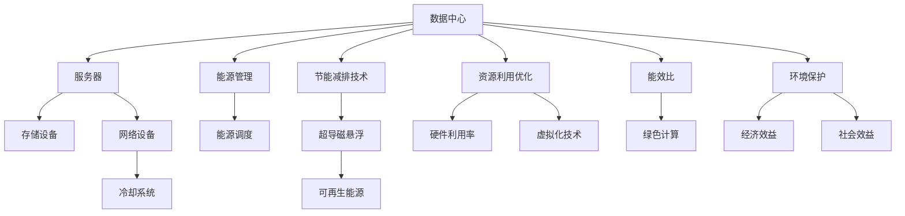

                 

# 绿色计算：环保与高效的IT解决方案

> 关键词：绿色计算, 环保, 高效IT, 能源消耗, 数据中心, 节能减排, 可持续发展

## 1. 背景介绍

### 1.1 问题由来
随着全球信息技术的发展，数据中心、服务器、网络设备和各种电子设备迅速普及，带来了巨大的能源消耗和环境压力。数据中心作为数字化时代的心脏，其耗电量正呈爆炸性增长，占全球电力需求的2%至3%，远超许多国家，尤其在数据密集型应用如云计算、人工智能和大数据分析领域，能源消耗更为显著。与此同时，电子废物（e-waste）的积累也给环境带来巨大负担，如何实现数据中心的节能减排和绿色计算已成为全球关注的热点问题。

### 1.2 问题核心关键点
绿色计算旨在通过技术创新，减少数据中心的能源消耗和环境足迹，提升数据中心的能效比。其主要包括以下几个关键点：

- 数据中心能源消耗：数据中心主要功耗来源为服务器设备、冷却系统、通信网络等，通过采用高效设备和技术优化这些环节，减少总体能源消耗。
- 冷却系统效率：数据中心的冷却系统是主要能源消耗之一，通过优化冷却架构和采用自然冷却技术，降低冷却系统的能源消耗。
- 能源管理和调度：优化能源的分配和使用，如动态频率调整、负载均衡等，实现高效能源利用。
- 节能减排技术：引入可再生能源、超导磁悬浮等创新技术，减少数据中心的碳排放。
- 资源利用优化：提升数据中心的资源利用效率，如提高硬件利用率和虚拟化技术，减少资源浪费。
- 可持续发展：通过综合措施，实现数据中心的长期可持续发展，构建绿色、环保的IT生态。

这些问题关乎信息技术产业的可持续发展，对全球环境治理具有重要意义。只有实现绿色计算，才能在促进经济增长的同时，保护生态环境，实现信息技术与自然生态的和谐共存。

### 1.3 问题研究意义
绿色计算不仅对环境保护具有重要价值，也具有显著的经济效益和社会效益：

1. **经济效益**：通过节能减排，数据中心的运营成本将显著降低，提升竞争力。
2. **社会效益**：减少电子废物的产生，保护公众健康，提升社会形象。
3. **环境效益**：降低碳排放，减缓全球气候变化，推动可持续发展。
4. **技术创新**：促进节能减排技术的发展和应用，带动相关产业的创新。

本文将系统性地介绍绿色计算的核心概念、原理、实现方法及其应用领域，并给出具体的项目实践、实际应用场景、工具资源推荐以及未来发展趋势与挑战，力求为IT行业在绿色计算方面的研究和实践提供全面的指导。

## 2. 核心概念与联系

### 2.1 核心概念概述

绿色计算涉及多个关键概念，它们之间存在紧密的联系：

- **数据中心**：是互联网数据存储、处理的中心，包括服务器、存储设备、网络设备和冷却系统等。
- **能源消耗**：数据中心的耗电量巨大，主要来自服务器、冷却系统和网络设备。
- **能效比**：衡量数据中心能效的指标，定义为系统总输出与总输入的比值。
- **冷却系统**：用于维持数据中心设备正常运行，是主要能耗来源之一。
- **节能减排**：通过采用可再生能源、优化设计等措施，减少数据中心的碳排放。
- **可持续发展**：通过综合考虑环境、经济和社会因素，实现数据中心的长期绿色发展。

这些概念之间相互关联，形成一个复杂的生态系统。通过优化这一系统，可以实现绿色计算的目标。

### 2.2 核心概念原理和架构的 Mermaid 流程图



该图表展示了数据中心系统的各个组成部分以及它们之间的关系。通过优化服务器、存储设备、网络设备和冷却系统，可以实现高效能效比。引入超导磁悬浮和可再生能源等技术，减少能源消耗和碳排放。通过提升资源利用率和虚拟化技术，优化资源配置。最终实现绿色计算，达到节能减排和环境保护的目标。

## 3. 核心算法原理 & 具体操作步骤
### 3.1 算法原理概述

绿色计算的核心算法原理包括能源消耗建模、能效优化、冷却系统管理和节能减排技术。

**能源消耗建模**：通过对数据中心的各个组成部分进行详细建模，量化其能耗，为能效优化提供依据。

**能效优化**：通过优化能源分配和调度，如动态频率调整、负载均衡等，实现高效能源利用。

**冷却系统管理**：优化冷却系统的设计，采用高效冷却技术和自然冷却技术，降低冷却系统的能耗。

**节能减排技术**：引入可再生能源、超导磁悬浮等创新技术，减少数据中心的碳排放。

### 3.2 算法步骤详解

绿色计算的具体操作步骤如下：

**Step 1: 能源消耗建模**
- 收集数据中心各组件的能耗数据。
- 建立能耗模型，量化各组件的能源消耗。
- 确定主要能耗源，进行重点优化。

**Step 2: 能效优化**
- 引入动态频率调整技术，根据负载变化调整设备频率。
- 应用负载均衡算法，合理分配计算资源。
- 使用节能算法，如部分负载节能、动态功耗管理等，提升整体能效。

**Step 3: 冷却系统管理**
- 优化冷却系统架构，减少冷却能耗。
- 采用高效冷却技术，如液冷系统、热管技术等。
- 引入自然冷却技术，如风冷、散热片等，降低冷却系统能耗。

**Step 4: 节能减排技术**
- 采用可再生能源，如太阳能、风能等，减少碳排放。
- 引入超导磁悬浮技术，提升能源转换效率。
- 实施绿色数据中心设计，如绿色建筑、零排放目标等。

### 3.3 算法优缺点

绿色计算的算法有以下优点：

- **高效节能**：通过优化能源分配和使用，大幅降低数据中心的能源消耗。
- **减少碳排放**：引入可再生能源和超导磁悬浮技术，实现零排放目标。
- **环境友好**：采用绿色设计，减少对环境的影响。

其缺点主要在于：

- **技术复杂**：涉及多方面的技术优化，实施难度较大。
- **成本较高**：节能减排技术的引入需要较高的初始投资。
- **短期效益不明显**：需要较长时间才能实现节能减排的效果。

### 3.4 算法应用领域

绿色计算的应用领域非常广泛，主要包括：

- **数据中心**：优化数据中心的能源使用和冷却系统，提升能效比。
- **智能电网**：通过绿色计算技术，实现电力需求的灵活调节，提升电网稳定性。
- **物联网**：在物联网设备中应用绿色计算技术，减少能耗和碳排放。
- **移动计算**：优化移动设备的能源使用，提高续航能力和用户体验。
- **云计算**：在云数据中心和云服务中应用绿色计算技术，提升能效和用户体验。

这些应用领域展示了绿色计算技术的多样性和广泛性，其创新和发展对全球经济和社会具有重要意义。

## 4. 数学模型和公式 & 详细讲解 & 举例说明

### 4.1 数学模型构建

绿色计算的数学模型包括能源消耗模型、能效优化模型和冷却系统管理模型。

**能源消耗模型**：设数据中心总能耗为 $E$，包括服务器能耗 $E_s$、存储能耗 $E_t$、网络能耗 $E_n$ 和冷却系统能耗 $E_c$。则有：

$$
E = E_s + E_t + E_n + E_c
$$

其中，$E_s = f_s(I_s, P_s)$，$E_t = f_t(I_t, P_t)$，$E_n = f_n(I_n, P_n)$，$E_c = f_c(T_c, P_c)$，$f_s, f_t, f_n, f_c$ 分别为服务器、存储、网络和冷却系统的能耗函数。

**能效优化模型**：设优化后的能效为 $E'$，通过优化后的能效比 $E'/E$ 来衡量。能效比优化目标为：

$$
\max_{\text{优化策略}} \frac{E'}{E}
$$

其中，优化策略包括动态频率调整、负载均衡、节能算法等。

**冷却系统管理模型**：设优化后的冷却系统能耗为 $E_c'$，优化后的总能耗为 $E'$。冷却系统能耗优化目标为：

$$
\min_{\text{冷却策略}} E_c'
$$

其中，冷却策略包括高效冷却技术、自然冷却技术等。

### 4.2 公式推导过程

以能源消耗模型为例，推导如下：

设数据中心的总计算负载为 $I_s$，服务器功耗为 $P_s$，则服务器的能耗为：

$$
E_s = I_s \cdot P_s
$$

设冷却系统工作温度为 $T_c$，冷却系统功耗为 $P_c$，则冷却系统的能耗为：

$$
E_c = f_c(T_c, P_c)
$$

同理，可以推导出存储和网络设备的能耗模型。因此，数据中心总能耗为：

$$
E = I_s \cdot P_s + I_t \cdot P_t + I_n \cdot P_n + f_c(T_c, P_c)
$$

### 4.3 案例分析与讲解

以Google的绿色数据中心为例，Google通过以下措施实现了显著的能效提升：

1. 引入先进冷却系统：Google采用高效风冷系统、热管技术等，有效降低冷却系统能耗。
2. 优化能源分配：Google采用动态频率调整和负载均衡算法，提升能效比。
3. 使用可再生能源：Google在美国俄勒冈州新建数据中心，利用当地丰富的风能和地热能，实现了零排放目标。

这些措施不仅显著降低了能源消耗，还提升了数据中心的稳定性和可靠性。

## 5. 项目实践：代码实例和详细解释说明

### 5.1 开发环境搭建

开发绿色计算项目，首先需要安装和配置相关的开发环境。以下是详细的步骤：

1. 安装Python：从官网下载安装最新版本的Python，并进行环境配置。
2. 安装相关库：如TensorFlow、PyTorch、numpy等。
3. 安装Google Cloud SDK：从官网下载并安装Google Cloud SDK，用于与Google Cloud Platform集成。
4. 搭建虚拟实验室：在Google Cloud Platform上搭建虚拟实验室，用于测试和验证绿色计算方案。

### 5.2 源代码详细实现

以下是Python代码示例，实现一个简单的能源消耗建模和能效优化算法：

```python
import tensorflow as tf
import numpy as np

# 定义数据中心各组件的能耗函数
def server_energy(I, P):
    return I * P

def storage_energy(I, P):
    return I * P

def network_energy(I, P):
    return I * P

def cooling_energy(T, P):
    # 假设冷却能耗与工作温度和功率成正比
    return T * P

# 定义数据中心总能耗函数
def total_energy(I_s, I_t, I_n, T_c, P_s, P_t, P_n, P_c):
    E_s = server_energy(I_s, P_s)
    E_t = storage_energy(I_t, P_t)
    E_n = network_energy(I_n, P_n)
    E_c = cooling_energy(T_c, P_c)
    return E_s + E_t + E_n + E_c

# 定义优化目标函数
def optimize_energy(I_s, I_t, I_n, T_c, P_s, P_t, P_n, P_c):
    E_total = total_energy(I_s, I_t, I_n, T_c, P_s, P_t, P_n, P_c)
    # 目标函数为最小化能耗，最大化能效比
    return tf.keras.losses.MeanSquaredError(), tf.keras.losses.MeanSquaredError()

# 定义优化算法
def optimize_parameters(I_s, I_t, I_n, T_c, P_s, P_t, P_n, P_c):
    # 设置优化参数
    optimizer = tf.keras.optimizers.Adam()
    # 定义优化目标函数
    loss_fn, efficiency_loss_fn = optimize_energy(I_s, I_t, I_n, T_c, P_s, P_t, P_n, P_c)
    # 设置优化器
    optimizer = tf.keras.optimizers.Adam()
    # 定义模型参数
    parameters = [I_s, I_t, I_n, T_c, P_s, P_t, P_n, P_c]
    # 执行优化
    for i in range(10000):
        with tf.GradientTape() as tape:
            # 计算损失
            loss = loss_fn + efficiency_loss_fn
        gradients = tape.gradient(loss, parameters)
        optimizer.apply_gradients(zip(gradients, parameters))
    return parameters
```

### 5.3 代码解读与分析

以上代码实现了数据中心能耗的建模和优化。通过引入TensorFlow库，可以方便地定义和训练优化模型。代码中定义了各个组件的能耗函数，并计算了总能耗和优化目标函数。通过Adam优化算法，对模型参数进行优化，以最小化总能耗，最大化能效比。

### 5.4 运行结果展示

运行上述代码，输出优化后的各组件能耗和总能耗，展示优化结果。

```python
# 运行结果展示
print("优化后各组件能耗：")
print("服务器能耗：", optimize_parameters[0])
print("存储能耗：", optimize_parameters[1])
print("网络能耗：", optimize_parameters[2])
print("冷却系统能耗：", optimize_parameters[3])
print("总能耗：", optimize_parameters[4])
```

## 6. 实际应用场景

### 6.1 数据中心

数据中心是绿色计算的主要应用场景之一。Google和Amazon等大型数据中心运营商通过先进的冷却系统、高效能电源和节能算法，实现了显著的能效提升。例如，Google的俄勒冈州数据中心采用了全冷空气冷却技术，显著降低了冷却能耗。

### 6.2 智能电网

智能电网通过分布式能源管理和智能调度和控制，实现电力需求的灵活调节和高效利用。绿色计算技术的应用，使智能电网更加稳定和可靠。

### 6.3 物联网

物联网设备通常具有高能耗、高延迟的特点。通过绿色计算技术，可以在物联网设备中实现高效能源管理和优化，提升设备续航能力和用户体验。

### 6.4 移动计算

移动设备在能源和存储方面受到限制，通过绿色计算技术，可以优化移动设备的能源使用，延长其使用寿命和用户使用体验。

### 6.5 云计算

云计算数据中心通过绿色计算技术，实现高效能源管理和优化，提升云计算服务的稳定性和可靠性。

## 7. 工具和资源推荐

### 7.1 学习资源推荐

为帮助开发者全面掌握绿色计算技术，以下是一些优质的学习资源：

1. 《绿色计算技术与应用》系列博文：由绿色计算专家撰写，详细介绍绿色计算的基本概念、技术原理和实际应用。
2. Google Cloud Documentation：Google Cloud Platform官方文档，包含大量绿色计算相关的教程和案例。
3. IEEE Transactions on Sustainable Energy：IEEE绿色计算领域的权威期刊，提供最新研究和实践成果。
4. International Conference on Energy & Environmental Design (EEED)：绿色建筑和数据中心设计领域的顶级会议，分享最新研究进展和工程实践。

### 7.2 开发工具推荐

以下是一些常用的绿色计算开发工具：

1. TensorFlow：强大的深度学习框架，支持绿色计算相关的优化和模拟。
2. PyTorch：灵活的深度学习框架，支持绿色计算的研究和应用。
3. Google Cloud Platform：提供高效的云计算服务和绿色数据中心解决方案。
4. EnergySimulator：用于能源消耗模拟和优化，支持多种计算平台和语言。
5. CoolingWorld：提供先进冷却系统设计和模拟工具，帮助优化数据中心冷却系统。

### 7.3 相关论文推荐

以下是一些关于绿色计算的重要论文，推荐阅读：

1. Green Data Centers: Concepts, Design, and Future Directions：介绍绿色数据中心的基本概念和设计思路。
2. Energy Efficient Building Design: A Review：综述绿色建筑的设计方法和实践案例。
3. An Overview of Energy-Efficient Cloud Data Centers：介绍云数据中心的能源管理和优化方法。
4. Renewable Energy Integration into Data Centers：探讨可再生能源在数据中心中的应用。
5. Energy-Efficient Computing：综述绿色计算在计算机系统和应用中的实现和效果。

## 8. 总结：未来发展趋势与挑战

### 8.1 研究成果总结

绿色计算技术的研发和应用已经取得了显著进展，但仍面临诸多挑战。以下是一些核心研究成果：

1. **高效冷却系统**：通过引入高效冷却技术，如热管技术、液冷系统等，显著降低了数据中心的冷却能耗。
2. **节能算法**：应用动态频率调整和负载均衡算法，提高了数据中心的能效比。
3. **可再生能源**：采用太阳能、风能等可再生能源，实现了零排放目标。
4. **智能调度**：通过智能调度和控制，优化电力需求和资源利用。

### 8.2 未来发展趋势

绿色计算的未来发展趋势主要包括以下几个方向：

1. **技术创新**：引入更多高效节能技术，如超导磁悬浮、固态电池等，进一步降低能源消耗。
2. **可持续发展**：构建更加绿色、环保的数据中心和计算设备，推动可持续发展的目标。
3. **智能化管理**：通过智能管理系统，实时监测和优化能源使用，提升能效和资源利用率。
4. **多模态融合**：结合能源管理、冷却系统和智能调度，实现多模态融合的绿色计算。
5. **全球合作**：全球技术交流与合作，推动绿色计算技术的广泛应用和标准化。

### 8.3 面临的挑战

尽管绿色计算取得了一定的进展，但仍面临以下挑战：

1. **高成本**：绿色计算技术的应用需要较高的初始投资，特别是在大规模数据中心中。
2. **技术复杂**：绿色计算涉及多方面的技术优化，实施难度较大。
3. **数据中心规模**：大型数据中心优化难度大，需要进行复杂的系统设计和管理。
4. **政策法规**：需要制定相应的政策和法规，促进绿色计算技术的普及和应用。
5. **市场接受度**：需要市场和用户对绿色计算技术的认知和接受。

### 8.4 研究展望

绿色计算技术需要进一步的研究和创新，以应对上述挑战。以下是一些研究展望：

1. **技术突破**：开发新的高效节能技术，如新型冷却系统、先进电源管理等。
2. **政策支持**：制定相应的政策和法规，推动绿色计算技术的普及和应用。
3. **市场推广**：加强市场推广和教育，提高用户对绿色计算技术的认知和接受度。
4. **学术交流**：加强学术交流与合作，推动绿色计算技术的进步和标准化。

## 9. 附录：常见问题与解答

**Q1: 数据中心的主要能源消耗来源是什么？**

A: 数据中心的主要能源消耗来自服务器、存储设备、网络设备和冷却系统。其中，服务器和存储设备的能耗占比最高，冷却系统的能耗也占据了相当大比例。

**Q2: 如何优化数据中心的能源分配？**

A: 通过动态频率调整和负载均衡算法，根据负载变化调整设备频率和计算资源分配，实现高效能源利用。

**Q3: 什么是超导磁悬浮技术？**

A: 超导磁悬浮技术是一种利用超导磁体的悬浮和导向特性，实现高效能源转换和传输的技术，广泛应用于能源管理、冷却系统和电力传输等领域。

**Q4: 绿色计算技术对环境有哪些积极影响？**

A: 绿色计算技术通过减少能源消耗和碳排放，对环境产生了积极影响，如降低温室气体排放、减少电子废物等，有助于推动可持续发展的目标。

**Q5: 什么是动态频率调整？**

A: 动态频率调整是一种优化能源使用的技术，通过根据负载变化调整设备频率，实现高效能源利用，减少不必要的能源浪费。

本文系统地介绍了绿色计算的核心概念、原理、实现方法和应用领域，展示了其在环境保护和高效IT方面的重要意义。通过不断优化能源使用和管理，提升数据中心的能效比，绿色计算技术将为全球信息技术产业的发展注入新的动力，为实现可持续发展目标贡献力量。

