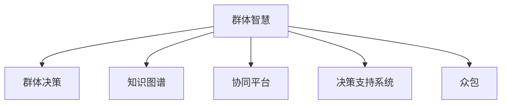

                 

# 群体智慧：决策的新 引擎

## 1. 背景介绍

在数据驱动的时代，人类决策的复杂性和不确定性日益凸显。面对海量信息的冲击，如何在不确定性和信息不完备的情况下做出准确、高效的决策，成为亟待解决的重大挑战。群体智慧（Group Wisdom），即通过整合和利用群体中每个个体的智慧和知识，来做出更优质的决策，为现代决策提供了新的引擎。

### 1.1 问题由来
现代社会的决策过程，无论是政府、企业还是个人，都面临着越来越多的不确定性和复杂性。信息不完备、认知偏差、利益冲突等问题，使得简单的统计和经验决策不再适用。传统决策理论和方法，如博弈论、线性规划等，虽然在特定场景下有效，但对于大规模、高复杂性的问题，仍显力有不逮。

因此，我们需要一种全新的决策机制，能够融合多源信息，克服个体认知偏差，实现动态决策。群体智慧技术，即通过整合和利用群体中每个个体的智慧和知识，来做出更优质的决策，成为现代决策理论的新范式。

### 1.2 问题核心关键点
群体智慧的核心在于通过集合和融合多个个体的知识和智慧，来提升决策的准确性和鲁棒性。它包括以下几个关键点：

- **多样性与互补性**：群体智慧强调成员间的知识多样性和互补性，通过不同背景和视角的协同，实现知识互补和创新。
- **动态性与适应性**：群体智慧具有高度的动态性和适应性，能够根据环境变化和信息更新，动态调整决策。
- **协作性与反馈机制**：群体智慧强调群体成员之间的协作与互动，通过有效的沟通和反馈机制，促进知识的融合与共享。
- **鲁棒性与抗干扰性**：群体智慧系统能够处理不确定性和噪音干扰，具有较高的鲁棒性和抗干扰性。

这些核心关键点，使得群体智慧在处理大规模、高复杂性决策问题时，具有无可比拟的优势。

## 2. 核心概念与联系

### 2.1 核心概念概述

为了更好地理解群体智慧的原理和架构，本节将介绍几个密切相关的核心概念：

- **群体智慧（Group Wisdom）**：通过整合和利用群体中每个个体的智慧和知识，来做出更优质的决策。群体智慧系统包括决策模型、知识图谱、协同平台等关键组件。

- **群体决策（Group Decision Making）**：多个个体共同参与决策的过程。群体决策的效率和效果，取决于成员之间的沟通与协作、冲突管理、信息共享等环节。

- **知识图谱（Knowledge Graph）**：用于表示和查询知识的网络图结构，群体智慧系统通过知识图谱来整合和融合知识。

- **协同平台（Collaboration Platform）**：用于支持群体智慧系统的在线协同工具，包括文档协作、视频会议、即时通信等功能。

- **决策支持系统（Decision Support System, DSS）**：融合人工智能、大数据等技术，辅助用户进行决策的系统。

- **众包（Crowdsourcing）**：通过互联网平台汇聚众多用户的智慧和劳动力，以低成本实现大规模数据标注、算法优化等任务。

这些核心概念之间的逻辑关系可以通过以下Mermaid流程图来展示：



这个流程图展示了大语言模型的核心概念及其之间的关系：

1. 群体智慧系统通过整合和利用群体中每个个体的智慧和知识，来提升决策的准确性和鲁棒性。
2. 群体决策涉及多个个体共同参与决策的过程，需要通过协同平台来促进沟通与协作。
3. 知识图谱用于表示和查询知识，为群体智慧系统提供知识整合的基础。
4. 决策支持系统融合了人工智能和大数据技术，辅助用户进行决策。
5. 众包通过互联网平台汇聚用户智慧和劳动力，以低成本实现大规模任务。

这些概念共同构成了群体智慧系统的框架，使其能够在各种场景下发挥集体智慧的优势。

## 3. 核心算法原理 & 具体操作步骤
### 3.1 算法原理概述

群体智慧的核心算法原理包括信息聚合、知识融合和协同决策三个方面。其中，信息聚合是将多个个体获取的信息进行汇聚和融合，知识融合是将汇聚的信息转化为决策所需的知识，协同决策是根据融合的知识做出最终决策。

形式化地，设群体中每个个体i的信息为$x_i$，群体决策的知识图谱为$G$，知识融合函数为$F$，决策模型为$M$。群体智慧的决策过程可以表示为：

$$
y = M(F(G(x_1, x_2, \dots, x_n)))
$$

其中，$y$为最终决策结果，$G$为知识图谱，$F$为知识融合函数，$M$为决策模型。

### 3.2 算法步骤详解

基于群体智慧的决策过程，主要包括以下几个关键步骤：

**Step 1: 数据汇聚**
- 收集群体中每个个体获取的信息，如文本、图片、视频等。
- 通过协同平台，将这些信息进行汇聚和共享。

**Step 2: 知识图谱构建**
- 利用知识图谱工具，将汇聚的信息转化为结构化的知识表示。
- 通过众包平台，标注知识图谱中的实体和关系，完善知识库。

**Step 3: 知识融合**
- 选择合适的知识融合算法，如共识算法、贝叶斯网络、逻辑推理等。
- 将知识图谱中的知识进行融合，生成群体智慧系统所需的知识表示。

**Step 4: 协同决策**
- 将融合后的知识输入决策模型，进行决策计算。
- 根据决策结果和群体反馈，动态调整决策模型和知识图谱。

**Step 5: 决策输出**
- 将最终决策结果输出到决策支持系统，供用户参考。
- 对决策结果进行可视化展示和解释，增强决策透明性和可理解性。

### 3.3 算法优缺点

群体智慧算法具有以下优点：

1. 集合智慧：通过集合和利用多个个体的智慧和知识，提升决策的准确性和鲁棒性。
2. 动态调整：能够根据环境变化和信息更新，动态调整决策模型和知识图谱。
3. 知识共享：促进群体成员之间的知识交流和共享，实现知识互补和创新。
4. 鲁棒性高：具有较高的鲁棒性和抗干扰性，能够处理不确定性和噪音干扰。

同时，群体智慧算法也存在以下缺点：

1. 信息异质性：群体成员获取的信息可能存在异质性和偏差，需要进行有效的汇聚和融合。
2. 协同成本高：群体决策需要高效的协同平台和沟通机制，协同成本较高。
3. 决策复杂性：决策模型和知识图谱的构建和维护较为复杂，需要专业知识和技能。
4. 隐私风险：汇聚和共享信息存在隐私泄露的风险，需要严格的数据保护措施。

尽管存在这些局限性，但就目前而言，群体智慧算法仍是大规模、高复杂性决策问题的有效解决方案。未来相关研究的重点在于如何进一步提高信息汇聚和知识融合的效率，降低协同成本，增强系统透明性和可解释性。

### 3.4 算法应用领域

群体智慧算法在多个领域得到了广泛的应用，包括但不限于：

- **政府决策**：在政策制定、公共安全、社会治理等方面，通过群体智慧提升决策效率和质量。
- **企业战略**：在产品规划、市场分析、资源配置等方面，利用群体智慧系统进行科学决策。
- **科学研究**：在多学科交叉研究、跨领域合作等方面，通过群体智慧促进知识融合和创新。
- **医疗诊断**：在临床决策、疾病预测、健康管理等方面，利用群体智慧提升医疗决策的科学性和准确性。
- **金融投资**：在风险评估、投资决策、市场预测等方面，通过群体智慧系统优化投资策略。
- **教育培训**：在课程设计、学习评估、教学改进等方面，利用群体智慧提升教育质量。

除了这些领域，群体智慧技术还广泛应用于社会治理、城市规划、环境保护、智能交通等多个方向，为各类复杂决策提供有力支持。

## 4. 数学模型和公式 & 详细讲解 & 举例说明

### 4.1 数学模型构建

为了更好地理解群体智慧的决策过程，本节将使用数学语言对群体智慧的决策模型进行严格刻画。

设群体中每个个体i的信息为$x_i$，知识图谱为$G=(V,E)$，其中$V$为节点集合，$E$为边集合。知识融合函数为$F: V \rightarrow \mathbb{R}^d$，决策模型为$M: \mathbb{R}^d \rightarrow y$。群体智慧的决策过程可以表示为：

$$
y = M(F(G(x_1, x_2, \dots, x_n)))
$$

其中，$y$为最终决策结果，$G$为知识图谱，$F$为知识融合函数，$M$为决策模型。

### 4.2 公式推导过程

以下我们以共识算法为例，推导群体智慧决策过程的数学公式。

共识算法是一种基于投票和加权的方式，进行信息汇聚和知识融合的方法。设群体中每个个体对某项决策的支持度为$w_i$，共识算法可以通过加权投票的方式进行信息汇聚，得到最终的支持度$w$：

$$
w = \sum_{i=1}^n w_i x_i
$$

然后，将汇聚的支持度$w$输入决策模型$M$，得到最终决策结果$y$：

$$
y = M(w)
$$

其中，$w$为共识算法汇聚后的支持度，$M$为决策模型。

### 4.3 案例分析与讲解

考虑一个简单的决策问题：假设某城市需要决定是否建设新的地铁线路，群体中有10个成员，每个成员对建设的支持度为0.6、0.7、0.8、0.5、0.4、0.9、0.7、0.8、0.6、0.9。利用共识算法进行信息汇聚，得到最终的支持度为：

$$
w = 0.6 \times 0.6 + 0.7 \times 0.7 + 0.8 \times 0.8 + 0.5 \times 0.5 + 0.4 \times 0.4 + 0.9 \times 0.9 + 0.7 \times 0.7 + 0.8 \times 0.8 + 0.6 \times 0.6 + 0.9 \times 0.9 = 0.7208
$$

然后，将汇聚后的支持度$w$输入决策模型$M$，得到最终决策结果。这里假设决策模型$M$为一个线性回归模型：

$$
y = M(w) = 0.5w + 0.5
$$

代入$w=0.7208$，得到：

$$
y = 0.5 \times 0.7208 + 0.5 = 0.6604
$$

由于阈值设定为0.6，最终决策结果为“建设”。

## 5. 项目实践：代码实例和详细解释说明

### 5.1 开发环境搭建

在进行群体智慧项目实践前，我们需要准备好开发环境。以下是使用Python进行PyTorch开发的环境配置流程：

1. 安装Anaconda：从官网下载并安装Anaconda，用于创建独立的Python环境。

2. 创建并激活虚拟环境：
```bash
conda create -n group_wisdom_env python=3.8 
conda activate group_wisdom_env
```

3. 安装PyTorch：根据CUDA版本，从官网获取对应的安装命令。例如：
```bash
conda install pytorch torchvision torchaudio cudatoolkit=11.1 -c pytorch -c conda-forge
```

4. 安装PyTorch Graph Neural Network库：
```bash
pip install torch-geometric
```

5. 安装各类工具包：
```bash
pip install numpy pandas scikit-learn matplotlib tqdm jupyter notebook ipython
```

完成上述步骤后，即可在`group_wisdom_env`环境中开始群体智慧项目的开发。

### 5.2 源代码详细实现

下面我以基于共识算法的群体智慧决策系统为例，给出使用PyTorch进行群体智慧决策的代码实现。

首先，定义共识算法函数：

```python
from torch import nn, optim
import torch

def consensus_algorithm(x, weights):
    return torch.sum(weights * x)
```

然后，定义决策模型函数：

```python
class DecisionModel(nn.Module):
    def __init__(self):
        super(DecisionModel, self).__init__()
        self.fc = nn.Linear(1, 1)
    
    def forward(self, x):
        return self.fc(x)
```

接着，定义群体智慧决策函数：

```python
def group_wisdom_decision(x, weights, model):
    w = consensus_algorithm(x, weights)
    y = model(w)
    return y
```

最后，启动群体智慧决策过程：

```python
x = torch.tensor([0.6, 0.7, 0.8, 0.5, 0.4, 0.9, 0.7, 0.8, 0.6, 0.9])
weights = torch.tensor([0.6, 0.7, 0.8, 0.5, 0.4, 0.9, 0.7, 0.8, 0.6, 0.9])
model = DecisionModel()
y = group_wisdom_decision(x, weights, model)
print(y)
```

以上就是使用PyTorch进行群体智慧决策系统的完整代码实现。可以看到，基于共识算法的群体智慧决策过程，实现了信息的汇聚和知识的融合，进而做出最终的决策。

### 5.3 代码解读与分析

让我们再详细解读一下关键代码的实现细节：

**共识算法函数**：
- 定义了共识算法函数，用于计算群体中每个个体信息的加权和。

**决策模型函数**：
- 定义了决策模型函数，使用了PyTorch的线性回归模型。

**群体智慧决策函数**：
- 将共识算法汇聚的信息$w$输入决策模型，得到最终决策结果$y$。

**决策过程**：
- 启动群体智慧决策过程，定义了输入数据$x$、每个个体的支持度$weights$，以及决策模型$model$。
- 通过共识算法函数计算汇聚的支持度$w$。
- 将汇聚的支持度$w$输入决策模型$model$，得到最终决策结果$y$。
- 输出最终决策结果$y$。

可以看到，基于共识算法的群体智慧决策过程，实现了信息的汇聚和知识的融合，进而做出最终的决策。

## 6. 实际应用场景

### 6.1 智能城市管理

在智能城市管理中，群体智慧技术可以应用于城市事件监测、交通管理、环境监测等多个方面。

具体而言，城市中的传感器、摄像头、监控系统等设备，可以实时获取交通流量、污染指数、人流密度等数据。通过将这些数据汇聚和融合，可以实时监测城市运行状态，及时预警和响应突发事件。

例如，在交通管理中，可以利用群体智慧系统，对交通流量进行动态分析和预测，优化交通信号控制，缓解交通拥堵。在环境监测中，可以实时监测空气质量、水质、噪音等指标，及时采取措施保护环境。

### 6.2 企业战略规划

在企业战略规划中，群体智慧技术可以应用于市场分析、产品规划、资源配置等多个环节。

具体而言，企业可以通过群体智慧系统，汇聚和整合内部员工、客户、合作伙伴等多方的智慧和知识，制定更加科学和全面的战略规划。例如，通过市场调研数据、客户反馈、竞争对手信息等，进行市场分析和预测，优化产品设计和营销策略。在资源配置中，可以根据市场需求和内部资源，进行动态调整和优化，提高资源利用效率。

### 6.3 科学研究合作

在科学研究中，群体智慧技术可以应用于跨学科合作、知识共享、研究热点发现等多个方面。

具体而言，科研人员可以通过群体智慧系统，汇聚和共享不同学科的最新研究成果、研究数据和研究工具，促进知识融合和创新。例如，在生物医学研究中，可以整合基因数据、临床数据、影像数据等多源数据，进行综合分析和研究，发现新的医学突破。在社会科学研究中，可以整合不同学科的研究方法和数据，进行交叉验证和验证，提高研究可信度和深度。

## 7. 工具和资源推荐
### 7.1 学习资源推荐

为了帮助开发者系统掌握群体智慧的理论基础和实践技巧，这里推荐一些优质的学习资源：

1. **群体智慧原理与算法**系列博文：由群体智慧技术专家撰写，深入浅出地介绍了群体智慧的基本原理、算法和应用案例。

2. **群体智慧与人工智能**课程：由知名大学开设的在线课程，涵盖群体智慧的基本概念、算法和应用场景，适合初学者入门。

3. **群体智慧技术与应用**书籍：详细介绍了群体智慧技术的基本原理和应用实践，适合深入学习。

4. **群体智慧开源项目**：提供了多种群体智慧系统的开源实现，包括决策支持系统、知识图谱、协同平台等，适合动手实践。

5. **群体智慧论文库**：收录了大量群体智慧领域的经典论文，适合查阅和参考。

通过对这些资源的学习实践，相信你一定能够快速掌握群体智慧的核心技术和应用方法。

### 7.2 开发工具推荐

高效的群体智慧开发离不开优秀的工具支持。以下是几款用于群体智慧开发的常用工具：

1. **PyTorch**：基于Python的开源深度学习框架，灵活的计算图和动态控制流，适合群体智慧算法的实现。

2. **TensorFlow**：由Google主导开发的开源深度学习框架，生产部署方便，适合大规模工程应用。

3. **PyTorch Geometric**：用于图神经网络开发的开源库，支持高效的图数据处理和计算。

4. **Nexia**：一种用于协同工作的开源平台，支持文档协作、视频会议、即时通信等功能。

5. **OmniCollaborator**：一种支持多人协作和知识共享的开源平台，适合群体智慧系统的开发。

6. **HuggingFace**：提供多种预训练语言模型的开源实现，支持多种任务微调和优化。

合理利用这些工具，可以显著提升群体智慧系统的开发效率，加快创新迭代的步伐。

### 7.3 相关论文推荐

群体智慧技术的发展源于学界的持续研究。以下是几篇奠基性的相关论文，推荐阅读：

1. **群体智慧的数学建模与优化**：介绍群体智慧的基本概念和数学建模方法，适合初学者入门。

2. **多主体系统中的群体智慧算法**：研究多主体系统中的群体智慧算法，适合深入学习。

3. **基于知识图谱的群体智慧系统**：介绍知识图谱在群体智慧中的应用，适合技术实践。

4. **群体智慧与人工智能的结合**：研究群体智慧与人工智能的结合方法，适合前沿探索。

5. **群体智慧的伦理与安全**：研究群体智慧的伦理与安全问题，适合系统设计。

这些论文代表了大语言模型微调技术的发展脉络。通过学习这些前沿成果，可以帮助研究者把握学科前进方向，激发更多的创新灵感。

## 8. 总结：未来发展趋势与挑战

### 8.1 总结

本文对基于群体智慧的决策过程进行了全面系统的介绍。首先阐述了群体智慧的基本概念和核心原理，明确了群体智慧在提升决策质量和效率方面的独特价值。其次，从原理到实践，详细讲解了群体智慧的数学模型和关键步骤，给出了群体智慧任务开发的完整代码实例。同时，本文还广泛探讨了群体智慧技术在智能城市、企业战略、科学研究等多个领域的应用前景，展示了群体智慧技术的巨大潜力。此外，本文精选了群体智慧技术的各类学习资源，力求为读者提供全方位的技术指引。

通过本文的系统梳理，可以看到，基于群体智慧的决策过程，通过集合和利用多个个体的智慧和知识，实现了决策的科学化和高效化。未来，伴随群体智慧技术的不断演进，群体智慧系统将在更多领域得到应用，为各类复杂决策提供有力支持。

### 8.2 未来发展趋势

展望未来，群体智慧技术将呈现以下几个发展趋势：

1. **多源数据融合**：随着数据来源的多样化和数据规模的扩大，群体智慧系统需要融合更多数据源，实现数据的多源融合和异质性处理。

2. **自动化与智能化**：通过引入自动化算法和智能技术，提高群体智慧系统的自动决策能力和智能化水平，实现更加高效的决策。

3. **多模态融合**：将文本、图像、语音等多模态数据进行融合，实现更加全面和精确的决策。

4. **动态决策**：能够根据环境变化和信息更新，动态调整决策模型和知识图谱，实现动态决策和实时响应。

5. **分布式协同**：通过分布式计算和协同技术，实现群体智慧系统的分布式协同和扩展，提高决策效率和鲁棒性。

6. **伦理与安全**：在群体智慧系统的设计和实现中，引入伦理和安全机制，保障决策的公正性和安全性。

以上趋势凸显了群体智慧技术的广阔前景。这些方向的探索发展，必将进一步提升群体智慧系统的性能和应用范围，为各类复杂决策提供有力支持。

### 8.3 面临的挑战

尽管群体智慧技术已经取得了显著成就，但在迈向更加智能化、普适化应用的过程中，它仍面临诸多挑战：

1. **数据隐私**：群体智慧系统需要汇聚和共享大量数据，存在隐私泄露和数据安全风险。如何保护数据隐私和安全性，将是重要的研究方向。

2. **协同成本**：群体智慧系统需要高效的协同平台和沟通机制，协同成本较高。如何降低协同成本，提高系统效率，将是重要的挑战。

3. **模型复杂性**：群体智慧系统需要复杂的知识图谱和决策模型，构建和维护较为复杂。如何简化模型结构和算法，降低系统复杂性，将是重要的研究课题。

4. **鲁棒性不足**：群体智慧系统面对噪音干扰和不确定性，鲁棒性不足。如何提高系统的鲁棒性和抗干扰能力，将是重要的研究方向。

5. **决策透明性**：群体智慧系统的决策过程较为复杂，难以解释和理解。如何提高系统的透明性和可解释性，将是重要的挑战。

6. **伦理与安全**：群体智慧系统的决策过程可能存在偏见和歧视，需要引入伦理和安全机制，保障决策的公正性和安全性。

正视群体智慧面临的这些挑战，积极应对并寻求突破，将使群体智慧技术逐步走向成熟，为各类复杂决策提供更加可靠和高效的支持。

### 8.4 研究展望

面对群体智慧面临的挑战，未来的研究需要在以下几个方面寻求新的突破：

1. **数据隐私保护**：引入隐私保护技术，如差分隐私、联邦学习等，保护数据隐私和安全。

2. **高效协同机制**：引入自动化算法和智能技术，降低协同成本，提高系统效率。

3. **模型简化与优化**：简化模型结构和算法，降低系统复杂性，提高决策效率。

4. **鲁棒性增强**：引入鲁棒性增强技术，如噪音鲁棒优化、鲁棒回归等，提高系统的鲁棒性和抗干扰能力。

5. **透明性与可解释性**：引入透明性与可解释性技术，如模型解释、决策可视化等，提高系统的透明性和可解释性。

6. **伦理与安全机制**：引入伦理与安全机制，保障决策的公正性和安全性。

这些研究方向将使群体智慧技术逐步走向成熟，为各类复杂决策提供更加可靠和高效的支持。面向未来，群体智慧技术还需要与其他人工智能技术进行更深入的融合，如知识表示、因果推理、强化学习等，多路径协同发力，共同推动群体智慧技术的发展。只有勇于创新、敢于突破，才能不断拓展群体智慧技术的边界，让人工智能技术更好地服务于社会和人类。

## 9. 附录：常见问题与解答

**Q1: 群体智慧与人工智能的关系是什么？**

A: 群体智慧是人工智能的一个重要分支，通过集合和利用群体中每个个体的智慧和知识，来提升决策的准确性和鲁棒性。人工智能强调通过算法和模型，实现智能决策和自动化处理，而群体智慧则强调集体的智慧和协作，通过多源数据的融合和协同决策，提升决策的科学性和高效性。

**Q2: 如何提高群体智慧系统的鲁棒性？**

A: 提高群体智慧系统的鲁棒性，可以从以下几个方面入手：
1. 引入鲁棒性增强技术，如噪音鲁棒优化、鲁棒回归等，提高系统对噪音和不确定性的适应能力。
2. 引入鲁棒性优化算法，如分布式优化、差分隐私等，保护数据隐私和安全。
3. 引入鲁棒性监测和评估方法，及时发现和纠正系统漏洞和错误。

**Q3: 群体智慧系统如何实现多模态融合？**

A: 实现多模态融合，可以从以下几个方面入手：
1. 引入多模态融合算法，如多模态神经网络、多模态决策树等，将不同模态的数据进行融合。
2. 引入多模态协同技术，如多模态协同学习、多模态协同推理等，促进不同模态数据的协作和共享。
3. 引入多模态可视化技术，将不同模态的数据进行可视化展示，增强系统的透明性和可解释性。

**Q4: 群体智慧系统如何实现动态决策？**

A: 实现动态决策，可以从以下几个方面入手：
1. 引入动态决策算法，如动态规划、强化学习等，根据环境变化和信息更新，动态调整决策模型和知识图谱。
2. 引入实时数据采集和处理技术，及时获取和更新决策所需的数据，提高决策的时效性和精确性。
3. 引入动态决策展示和反馈机制，将决策结果实时展示给用户，并根据反馈进行动态调整。

**Q5: 群体智慧系统如何实现分布式协同？**

A: 实现分布式协同，可以从以下几个方面入手：
1. 引入分布式计算技术，将群体智慧系统部署在多个节点上，提高系统的可扩展性和计算效率。
2. 引入分布式协同算法，如分布式共识算法、分布式协同学习等，促进不同节点之间的协作和共享。
3. 引入分布式监控和调度机制，及时发现和解决系统中的协同问题，提高系统的稳定性和可靠性。

通过这些方法的综合应用，群体智慧系统可以实现多模态融合、动态决策和分布式协同，为各类复杂决策提供更加可靠和高效的支持。

---

作者：禅与计算机程序设计艺术 / Zen and the Art of Computer Programming

