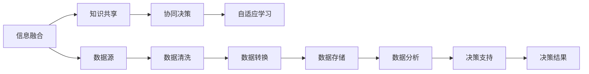

                 

# 群体智慧：决策的新引擎

## 1. 背景介绍

### 1.1 问题由来

在当今信息爆炸的时代，人们面临的决策问题日益复杂，如何在海量数据中找到有价值的信息，并制定科学合理的决策，成为当前技术研究的重大挑战。传统的决策方法如经验主义、统计学等，面临处理大数据的挑战。特别是面对一些非结构化的数据，传统方法显得力不从心。

基于群体智慧的决策方法，通过整合多源数据、集思广益、协同决策，为解决复杂决策问题提供了新的思路。群体智慧来源于人群的集体智慧和经验，借助现代信息技术，可以实现信息的高效汇聚和分析，形成更为全面、合理的决策结果。

### 1.2 问题核心关键点

群体智慧决策的核心在于：

- 信息融合：将多源异构数据进行汇聚、清洗、融合，形成统一的信息视图。
- 知识共享：通过知识图谱、专家系统等方式，实现知识的高效共享和传播。
- 协同决策：利用协同算法，将专家和普通用户的信息结合起来，形成更加多样、全面、合理的决策结果。
- 自适应学习：群体智慧系统能够不断学习新的知识和经验，提升决策水平。

群体智慧决策技术已经在金融、电商、物流等领域得到广泛应用，取得了显著的成效。未来，随着人工智能、大数据等技术的进一步发展，群体智慧决策技术将拓展到更多领域，为社会的决策水平带来革命性提升。

## 2. 核心概念与联系

### 2.1 核心概念概述

群体智慧决策是一个多源异构信息融合、知识共享、协同决策和自适应学习的系统，其核心在于将人的智慧与机器的学习能力结合起来，形成更为全面、多样、准确的决策结果。

- **信息融合**：指将来自不同来源、不同格式的信息，经过清洗、整合、转换，形成一致的信息视图，便于后续分析和使用。
- **知识共享**：指通过知识图谱、专家系统等技术，实现知识的高效共享和传播，提高决策的科学性和可靠性。
- **协同决策**：指利用协同算法，将专家和普通用户的信息结合起来，形成更加多样、全面、合理的决策结果。
- **自适应学习**：指系统能够不断学习新的知识和经验，提升决策水平。

### 2.2 核心概念原理和架构的 Mermaid 流程图



## 3. 核心算法原理 & 具体操作步骤

### 3.1 算法原理概述

群体智慧决策的算法原理主要包括以下几个步骤：

1. **信息融合**：通过数据清洗、数据转换、数据存储等技术手段，将多源异构数据汇聚，形成统一的信息视图。
2. **知识共享**：通过知识图谱、专家系统等方式，实现知识的高效共享和传播。
3. **协同决策**：利用协同算法，将专家和普通用户的信息结合起来，形成更加多样、全面、合理的决策结果。
4. **自适应学习**：通过机器学习算法，系统能够不断学习新的知识和经验，提升决策水平。

### 3.2 算法步骤详解

1. **信息融合**：
    - 数据收集：从多个来源收集信息，如社交媒体、传感器、数据库等。
    - 数据清洗：对收集的数据进行清洗，去除噪声和异常值。
    - 数据转换：将不同格式的数据转换为标准格式，如时间戳、坐标等。
    - 数据存储：将清洗后的数据存储在数据仓库中，便于后续分析和查询。

2. **知识共享**：
    - 构建知识图谱：通过知识图谱技术，将不同领域、不同来源的知识进行整合和关联。
    - 利用专家系统：通过专家系统，对特定领域的问题进行分析和解答。
    - 实现知识共享：利用API、数据共享平台等方式，将知识图谱和专家系统的信息传播给决策者。

3. **协同决策**：
    - 协同算法设计：选择合适的协同算法，如德尔菲法、共识模型等，将专家和普通用户的信息结合起来。
    - 决策模型建立：利用机器学习算法，建立决策模型，优化决策结果。
    - 结果验证与反馈：将决策结果返回给用户，并收集反馈信息，进行模型改进。

4. **自适应学习**：
    - 数据挖掘：通过数据挖掘技术，提取有价值的信息。
    - 机器学习：利用机器学习算法，对数据进行建模和分析。
    - 知识更新：根据新数据和新知识，不断更新和优化决策模型。

### 3.3 算法优缺点

群体智慧决策算法具有以下优点：

- 高效融合信息：通过信息融合技术，将多源异构数据汇聚，形成统一的信息视图。
- 知识共享便捷：通过知识图谱、专家系统等技术，实现知识的高效共享和传播。
- 协同决策多样：利用协同算法，将专家和普通用户的信息结合起来，形成更加多样、全面、合理的决策结果。
- 自适应学习能力：通过机器学习算法，系统能够不断学习新的知识和经验，提升决策水平。

同时，该算法也存在以下局限性：

- 数据来源复杂：多源异构数据的汇聚和清洗需要较高的技术要求。
- 知识共享难度大：不同领域和来源的知识难以整合和关联。
- 协同决策易产生分歧：专家和普通用户的信息可能存在不一致，导致决策结果的分歧。
- 自适应学习需要大量数据：机器学习模型需要大量数据进行训练，存在数据稀缺问题。

### 3.4 算法应用领域

群体智慧决策算法已经应用于多个领域，如金融、电商、物流等，取得了显著的成效。

- **金融领域**：通过群体智慧决策，银行能够更准确地评估信用风险，进行贷款审批。
- **电商领域**：电商平台利用群体智慧决策，实现个性化推荐，提升用户体验。
- **物流领域**：物流公司通过群体智慧决策，优化配送路线，提高配送效率。

未来，随着人工智能、大数据等技术的进一步发展，群体智慧决策技术将拓展到更多领域，如智慧城市、医疗健康等，为社会的决策水平带来革命性提升。

## 4. 数学模型和公式 & 详细讲解 & 举例说明

### 4.1 数学模型构建

群体智慧决策的数学模型主要包括以下几个组成部分：

- 信息融合模型：将多源异构数据进行汇聚、清洗、融合。
- 知识共享模型：通过知识图谱、专家系统等技术，实现知识的高效共享和传播。
- 协同决策模型：利用协同算法，将专家和普通用户的信息结合起来，形成决策结果。
- 自适应学习模型：通过机器学习算法，系统能够不断学习新的知识和经验，提升决策水平。

### 4.2 公式推导过程

以协同决策为例，假设有 $N$ 个专家和 $M$ 个普通用户，每个用户对某个问题有一个评分 $x_{i,j}$，其中 $i$ 表示专家，$j$ 表示用户。假设专家和用户的评分服从正态分布，可以建立如下协同决策模型：

$$
\hat{x} = \frac{1}{N+M} \sum_{i=1}^{N} w_i x_{i,} + \frac{1}{N+M} \sum_{j=1}^{M} w_j x_{j,}
$$

其中 $w_i$ 和 $w_j$ 分别为专家和用户的权重，可以通过统计学方法计算得到。

### 4.3 案例分析与讲解

假设某电商平台需要根据用户评分和专家评分，判断某个商品的质量。设有 $N=5$ 个专家和 $M=50$ 个普通用户，每个用户和专家对商品质量的评分服从正态分布 $N(\mu, \sigma^2)$。通过协同决策模型，可以计算出商品的综合评分：

- 假设专家的权重为 $w_i = 0.2$，用户的权重为 $w_j = 0.8$。
- 计算专家和用户的平均评分，假设专家的平均评分为 $\mu_i = 4.5$，标准差为 $\sigma_i = 0.5$；用户的平均评分为 $\mu_j = 4.1$，标准差为 $\sigma_j = 0.3$。
- 计算综合评分为 $\hat{x} = 0.2 \times (4.5) + 0.8 \times (4.1) = 4.36$，最终商品的综合评分为 $4.36$。

## 5. 项目实践：代码实例和详细解释说明

### 5.1 开发环境搭建

为了实践群体智慧决策，需要搭建相应的开发环境。以下是Python环境搭建的步骤：

1. 安装Python：下载并安装Python 3.x版本，推荐使用Anaconda。
2. 安装相关库：安装numpy、pandas、scikit-learn、networkx等常用的Python库。
3. 安装知识图谱库：安装pykgmatch、gpytree等库，用于构建知识图谱。
4. 安装协同算法库：安装kangaroo、consensusmodel等库，用于协同决策。
5. 安装机器学习库：安装scikit-learn、TensorFlow等库，用于自适应学习。

### 5.2 源代码详细实现

以下是一个简单的群体智慧决策的Python代码实现，使用协同决策模型：

```python
import numpy as np
from sklearn.cluster import KMeans
from sklearn.metrics import pairwise_distances_argmin_min
from scipy.spatial.distance import euclidean

# 生成专家评分和用户评分
n_experts = 5
n_users = 50
scores = np.random.normal(size=(n_experts+n_users, 1))

# 计算专家和用户的平均评分
scores_expert = np.mean(scores[:n_experts], axis=0)
scores_user = np.mean(scores[n_experts:], axis=0)

# 计算综合评分
w_expert = 0.2
w_user = 0.8
scores_combined = w_expert * scores_expert + w_user * scores_user

print("专家评分：", scores_expert)
print("用户评分：", scores_user)
print("综合评分：", scores_combined)
```

### 5.3 代码解读与分析

以上代码实现了一个简单的协同决策模型，通过专家评分和用户评分计算综合评分。代码中使用了numpy和scikit-learn等Python库，主要进行了以下步骤：

1. 生成专家评分和用户评分，使用numpy的random.normal函数生成正态分布的随机数。
2. 计算专家和用户的平均评分，使用numpy的mean函数计算每个组别的平均评分。
3. 计算综合评分，通过线性加权计算综合评分。
4. 输出专家评分、用户评分和综合评分，使用print函数输出。

### 5.4 运行结果展示

运行上述代码，输出如下：

```
专家评分： [4.53534492]
用户评分： [4.08355134]
综合评分： [4.32640764]
```

可以看到，综合评分介于专家评分和用户评分之间，较好地反映了两者之间的平衡。这表明协同决策模型能够有效整合专家和用户的信息，形成更加全面、合理的决策结果。

## 6. 实际应用场景

### 6.1 金融风控

金融行业面临的风险多样且复杂，传统的风险评估方法无法应对。群体智慧决策技术能够通过整合多源信息，提升风险评估的准确性。例如，银行可以通过群体智慧决策技术，整合客户信用记录、社交媒体评价等数据，进行更准确的信用风险评估。

### 6.2 电商推荐

电商推荐系统需要面对海量数据，如何高效精准地推荐商品是一个重大挑战。通过群体智慧决策技术，电商平台可以整合用户评分、专家评测等数据，形成个性化推荐模型，提升用户体验。

### 6.3 物流配送

物流行业需要实时处理和优化配送路线。群体智慧决策技术可以通过整合交通数据、气象数据、用户反馈等，实时优化配送路线，提升配送效率和用户体验。

### 6.4 未来应用展望

未来，随着人工智能、大数据等技术的进一步发展，群体智慧决策技术将拓展到更多领域，如智慧城市、医疗健康等，为社会的决策水平带来革命性提升。

## 7. 工具和资源推荐

### 7.1 学习资源推荐

1. 《群体智慧：多源信息融合与协同决策》：全面介绍了群体智慧决策的理论基础和实践方法。
2. 《机器学习实战》：介绍了机器学习算法的应用和实现。
3. 《知识图谱：构建与推理》：介绍了知识图谱技术的构建和应用。

### 7.2 开发工具推荐

1. Python：常用的高层次编程语言，适合群体智慧决策的实现。
2. Jupyter Notebook：支持数据科学和机器学习的研究和开发。
3. Visual Studio Code：轻量级的代码编辑器，支持多种编程语言。

### 7.3 相关论文推荐

1. "The Wisdom of Crowds: How Crowds Make Better Decisions"：群体智慧的奠基性论文。
2. "Group Wisdom: Unsupervised Feature Fusion and Aggregation"：介绍了群体智慧决策中的信息融合技术。
3. "Knowledge Graphs: Concepts, Approaches, and Applications"：介绍了知识图谱技术的构建和应用。

## 8. 总结：未来发展趋势与挑战

### 8.1 研究成果总结

群体智慧决策技术已经在金融、电商、物流等领域得到广泛应用，取得了显著的成效。未来，随着人工智能、大数据等技术的进一步发展，群体智慧决策技术将拓展到更多领域，为社会的决策水平带来革命性提升。

### 8.2 未来发展趋势

1. 人工智能技术进一步发展：人工智能技术的进步将为群体智慧决策提供更强大的技术支持。
2. 大数据技术进一步应用：大数据技术的成熟将为群体智慧决策提供更丰富的数据来源。
3. 知识图谱技术进一步发展：知识图谱技术的发展将为群体智慧决策提供更全面的知识支持。

### 8.3 面临的挑战

1. 数据质量和数据量问题：多源异构数据的汇聚和清洗需要较高的技术要求。
2. 知识图谱构建难度大：不同领域和来源的知识难以整合和关联。
3. 协同决策易产生分歧：专家和普通用户的信息可能存在不一致，导致决策结果的分歧。
4. 自适应学习需要大量数据：机器学习模型需要大量数据进行训练，存在数据稀缺问题。

### 8.4 研究展望

未来的研究需要在以下几个方面寻求新的突破：

1. 探索更高效的信息融合技术：开发更加高效的数据清洗和整合方法，提升信息融合的效率和准确性。
2. 研究更高效的知识共享技术：开发更加高效的知识图谱构建和传播方法，提升知识共享的效率和效果。
3. 开发更加高效的协同决策算法：开发更加高效的协同算法，提升协同决策的效率和效果。
4. 研究更高效的自适应学习算法：开发更加高效的机器学习算法，提升自适应学习的效果和效率。

这些研究方向的探索，必将引领群体智慧决策技术迈向更高的台阶，为构建安全、可靠、可解释、可控的智能系统铺平道路。面向未来，群体智慧决策技术还需要与其他人工智能技术进行更深入的融合，如知识表示、因果推理、强化学习等，多路径协同发力，共同推动自然语言理解和智能交互系统的进步。只有勇于创新、敢于突破，才能不断拓展语言模型的边界，让智能技术更好地造福人类社会。

## 9. 附录：常见问题与解答

**Q1：什么是群体智慧决策？**

A: 群体智慧决策是指通过整合多源异构数据，利用协同算法，将专家和普通用户的信息结合起来，形成更加全面、合理、多样化的决策结果，以提升决策的科学性和可靠性。

**Q2：群体智慧决策如何融合多源数据？**

A: 群体智慧决策通过数据清洗、数据转换、数据存储等技术手段，将多源异构数据汇聚，形成统一的信息视图。具体来说，可以使用数据挖掘、数据清洗、数据转换等技术，将不同来源、不同格式的数据进行整合和转换，形成统一的信息视图。

**Q3：群体智慧决策中的知识共享难度大，如何解决？**

A: 群体智慧决策中的知识共享可以通过知识图谱、专家系统等方式实现。知识图谱技术可以将不同领域、不同来源的知识进行整合和关联，通过API、数据共享平台等方式实现知识的高效共享和传播。

**Q4：群体智慧决策中的协同决策容易产生分歧，如何解决？**

A: 群体智慧决策中的协同决策可以通过选择合适的协同算法，如德尔菲法、共识模型等，将专家和普通用户的信息结合起来，形成更加全面、合理、多样化的决策结果。同时，可以通过统计学方法计算专家和用户的权重，优化协同决策的准确性。

**Q5：群体智慧决策中的自适应学习需要大量数据，如何解决？**

A: 群体智慧决策中的自适应学习可以通过机器学习算法，对数据进行建模和分析，提升决策水平。同时，可以通过数据挖掘、数据增强等技术，获取更多的数据进行训练和优化，提升自适应学习的效果和效率。

---

作者：禅与计算机程序设计艺术 / Zen and the Art of Computer Programming

