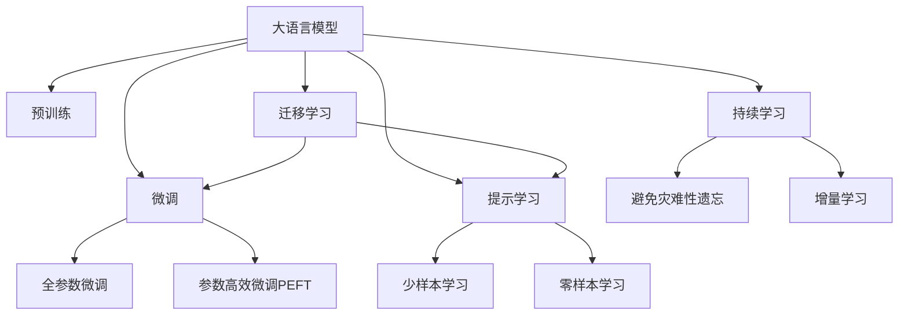

                 

# 老年护理和 LLM：改善生活质量

## 1. 背景介绍

### 1.1 问题由来
随着全球人口老龄化趋势的加剧，如何提升老年人的生活质量，特别是那些需要长期护理的老年群体，成为了社会关注的焦点。传统的老年护理模式主要依赖于家庭成员或专业护理人员的照顾，这在资源有限的情况下往往难以满足老年人的个性化需求。技术的发展为老年护理提供了新的可能性。通过利用先进的智能技术，可以为老年人提供更高效、便捷的护理服务，实现智能化、个性化、全天候的关怀。

### 1.2 问题核心关键点
本论文聚焦于利用大语言模型（Large Language Model, LLM）在老年护理中的应用，探讨如何通过 LLM 技术改善老年人的生活质量。具体来说，本论文将从以下几个方面展开：

1. 了解 LLM 的基本原理和应用场景。
2. 设计针对老年护理的 LLM 系统架构。
3. 实施 LLM 在老年护理中的具体应用。
4. 评估 LLM 系统对老年人生活质量的提升效果。
5. 讨论 LLM 在老年护理中面临的挑战和解决方案。

通过本论文的探讨，希望能够为从事老年护理工作的专业人士提供技术支持，同时也为关心老年群体的社会各界人士提供有益参考。

## 2. 核心概念与联系

### 2.1 核心概念概述

为更好地理解 LLM 在老年护理中的应用，本节将介绍几个密切相关的核心概念：

- **大语言模型 (Large Language Model, LLM)**：以自回归 (如 GPT) 或自编码 (如 BERT) 模型为代表的大规模预训练语言模型。通过在大规模无标签文本语料上进行预训练，学习通用的语言表示，具备强大的语言理解和生成能力。

- **预训练 (Pre-training)**：指在大规模无标签文本语料上，通过自监督学习任务训练通用语言模型的过程。常见的预训练任务包括言语建模、遮挡语言模型等。预训练使得模型学习到语言的通用表示。

- **微调 (Fine-tuning)**：指在预训练模型的基础上，使用下游任务的少量标注数据，通过有监督地训练来优化模型在特定任务上的性能。通常只需要调整顶层分类器或解码器，并以较小的学习率更新全部或部分的模型参数。

- **迁移学习 (Transfer Learning)**：指将一个领域学习到的知识，迁移应用到另一个不同但相关的领域的学习范式。大模型的预训练-微调过程即是一种典型的迁移学习方式。

- **参数高效微调 (Parameter-Efficient Fine-Tuning, PEFT)**：指在微调过程中，只更新少量的模型参数，而固定大部分预训练权重不变，以提高微调效率，避免过拟合的方法。

- **少样本学习 (Few-shot Learning)**：指在只有少量标注样本的情况下，模型能够快速适应新任务的学习方法。在大语言模型中，通常通过在输入中提供少量示例来实现，无需更新模型参数。

- **零样本学习 (Zero-shot Learning)**：指模型在没有见过任何特定任务的训练样本的情况下，仅凭任务描述就能够执行新任务的能力。大语言模型通过预训练获得的广泛知识，使其能够理解任务指令并生成相应输出。

- **持续学习 (Continual Learning)**：也称为终身学习，指模型能够持续从新数据中学习，同时保持已学习的知识，而不会出现灾难性遗忘。这对于保持大语言模型的时效性和适应性至关重要。

这些核心概念之间的逻辑关系可以通过以下 Mermaid 流程图来展示：



这个流程图展示了大语言模型的核心概念及其之间的关系：

1. 大语言模型通过预训练获得基础能力。
2. 微调是对预训练模型进行任务特定的优化，可以分为全参数微调和参数高效微调（PEFT）。
3. 提示学习是一种不更新模型参数的方法，可以实现少样本学习和零样本学习。
4. 迁移学习是连接预训练模型与下游任务的桥梁，可以通过微调或提示学习来实现。
5. 持续学习旨在使模型能够不断学习新知识，同时避免遗忘旧知识。

这些概念共同构成了大语言模型的学习和应用框架，使其能够在各种场景下发挥强大的语言理解和生成能力。通过理解这些核心概念，我们可以更好地把握大语言模型的工作原理和优化方向。

## 3. 核心算法原理 & 具体操作步骤

### 3.1 算法原理概述

利用 LLM 改善老年人生活质量的核心思想是：将 LLM 视作一个强大的 "信息提取器"，通过与老年人进行互动，利用其强大的语言理解能力，收集老年人的需求、偏好和健康状况，提供个性化的护理建议和支持。

具体而言，可以设计一个 LLM 系统，其中包含以下关键模块：

1. **用户交互模块**：负责与老年人进行自然语言交流，理解老年人的问题、需求和情绪状态。
2. **信息提取模块**：利用 LLM 的自然语言理解能力，从老年人提供的信息中提取关键数据，如身体状况、药物过敏等。
3. **决策支持模块**：根据提取的信息，利用 LLM 的生成能力，提供个性化的护理建议、健康管理策略和紧急处理方案。
4. **反馈收集模块**：接收老年人的反馈，进一步优化 LLM 的决策模型。

通过这种系统设计，可以实现老年护理的智能化、个性化和全天候服务，提升老年人的生活质量。

### 3.2 算法步骤详解

利用 LLM 改善老年人生活质量的具体步骤如下：

**Step 1: 准备数据集**
- 收集老年人的基本信息、健康记录、家庭情况等数据，形成结构化的数据集。
- 设计对话模板，作为 LLM 系统的输入和输出格式，例如 "请问您今天感觉如何？" 和 "您的药物有过敏反应吗？"。

**Step 2: 预训练 LLM 模型**
- 选择适合 LLM 架构的预训练模型，如 GPT-3、BERT 等。
- 在无标签的老年护理相关语料上进行预训练，使其能够理解老年人的语言习惯和表达方式。

**Step 3: 微调 LLM 模型**
- 收集老年护理专家和医护人员的标注数据，标注老年人的问题、需求和健康状况。
- 使用标注数据对预训练模型进行微调，调整顶层分类器或解码器，使其能够生成适合老年人需求的护理建议。

**Step 4: 集成到护理系统中**
- 将微调后的 LLM 模型集成到老年护理系统中，与老年人进行实时互动。
- 提供界面友好的操作界面，让老年人可以方便地与 LLM 系统进行交互。

**Step 5: 持续优化和反馈**
- 收集老年人的反馈，进一步优化 LLM 的决策模型。
- 定期更新 LLM 模型的参数，确保其能够适应老年人需求的动态变化。

### 3.3 算法优缺点

利用 LLM 改善老年人生活质量的方法具有以下优点：

1. **个性化服务**：通过自然语言交流，LLM 系统能够理解老年人的个性化需求，提供量身定制的护理建议。
2. **全天候支持**：LLM 系统可以随时与老年人互动，提供即时帮助，减少家属和医护人员的负担。
3. **成本效益高**：相较于传统护理模式，利用 LLM 系统可以显著减少人力资源的投入。

同时，该方法也存在一定的局限性：

1. **数据隐私问题**：老年人提供的数据可能包含敏感信息，需要严格保护数据隐私。
2. **模型泛化能力**：LLM 系统需要在特定情境下进行微调，泛化能力可能受到限制。
3. **系统依赖性**：老年人对 LLM 系统的依赖，可能影响其自主性。
4. **技术门槛高**：开发和维护 LLM 系统需要较高的技术门槛，需要专业的技术团队支持。

尽管存在这些局限性，但就目前而言，利用 LLM 改善老年人生活质量的方法仍具有重要的研究和应用价值。未来相关研究的重点在于如何进一步降低技术门槛，提高系统的易用性和普适性，同时兼顾数据隐私和模型泛化能力。

### 3.4 算法应用领域

利用 LLM 改善老年人生活质量的方法在以下领域有广泛的应用前景：

1. **健康管理**：通过 LLM 系统了解老年人的健康状况，提供个性化的健康管理建议和饮食建议。
2. **情感支持**：利用 LLM 系统的情感分析能力，提供情感支持和心理疏导。
3. **紧急处理**：在老年人出现紧急情况时，LLM 系统能够及时提供应急处理方案。
4. **日常照护**：利用 LLM 系统的自然语言理解能力，帮助老年人管理日常事务，如药物提醒、购物清单等。
5. **远程监控**：通过 LLM 系统的实时监控和反馈，远程监测老年人的健康状况和生活状态。

## 4. 数学模型和公式 & 详细讲解 & 举例说明

### 4.1 数学模型构建

本节将使用数学语言对 LLM 在老年护理中的应用进行更加严格的刻画。

记 LLM 模型为 $M_{\theta}$，其中 $\theta$ 为模型参数。假设老年人提供的信息为 $x$，LMM 的输出为 $\hat{y}=M_{\theta}(x) \in [0,1]$，表示老年人问题的解决概率。

定义模型 $M_{\theta}$ 在输入 $x$ 上的损失函数为 $\ell(M_{\theta}(x),y)$，则在数据集 $D=\{(x_i,y_i)\}_{i=1}^N$ 上的经验风险为：

$$
\mathcal{L}(\theta) = \frac{1}{N} \sum_{i=1}^N \ell(M_{\theta}(x_i),y_i)
$$

微调的优化目标是最小化经验风险，即找到最优参数：

$$
\theta^* = \mathop{\arg\min}_{\theta} \mathcal{L}(\theta)
$$

在实践中，我们通常使用基于梯度的优化算法（如 SGD、Adam 等）来近似求解上述最优化问题。设 $\eta$ 为学习率，$\lambda$ 为正则化系数，则参数的更新公式为：

$$
\theta \leftarrow \theta - \eta \nabla_{\theta}\mathcal{L}(\theta) - \eta\lambda\theta
$$

其中 $\nabla_{\theta}\mathcal{L}(\theta)$ 为损失函数对参数 $\theta$ 的梯度，可通过反向传播算法高效计算。

### 4.2 公式推导过程

以下我们以情感支持任务为例，推导 LLM 模型的损失函数及其梯度的计算公式。

假设 LLM 模型在输入 $x$ 上的输出为 $\hat{y}=M_{\theta}(x) \in [0,1]$，表示老年人情感状态的概率。真实标签 $y \in \{0,1\}$。则二分类交叉熵损失函数定义为：

$$
\ell(M_{\theta}(x),y) = -[y\log \hat{y} + (1-y)\log (1-\hat{y})]
$$

将其代入经验风险公式，得：

$$
\mathcal{L}(\theta) = -\frac{1}{N}\sum_{i=1}^N [y_i\log M_{\theta}(x_i)+(1-y_i)\log(1-M_{\theta}(x_i))]
$$

根据链式法则，损失函数对参数 $\theta_k$ 的梯度为：

$$
\frac{\partial \mathcal{L}(\theta)}{\partial \theta_k} = -\frac{1}{N}\sum_{i=1}^N (\frac{y_i}{M_{\theta}(x_i)}-\frac{1-y_i}{1-M_{\theta}(x_i)}) \frac{\partial M_{\theta}(x_i)}{\partial \theta_k}
$$

其中 $\frac{\partial M_{\theta}(x_i)}{\partial \theta_k}$ 可进一步递归展开，利用自动微分技术完成计算。

在得到损失函数的梯度后，即可带入参数更新公式，完成模型的迭代优化。重复上述过程直至收敛，最终得到适应老年护理场景的最优模型参数 $\theta^*$。

## 5. 项目实践：代码实例和详细解释说明

### 5.1 开发环境搭建

在进行 LLM 在老年护理中的应用实践前，我们需要准备好开发环境。以下是使用 Python 进行 PyTorch 开发的环境配置流程：

1. 安装 Anaconda：从官网下载并安装 Anaconda，用于创建独立的 Python 环境。

2. 创建并激活虚拟环境：
```bash
conda create -n pytorch-env python=3.8 
conda activate pytorch-env
```

3. 安装 PyTorch：根据 CUDA 版本，从官网获取对应的安装命令。例如：
```bash
conda install pytorch torchvision torchaudio cudatoolkit=11.1 -c pytorch -c conda-forge
```

4. 安装 Transformers 库：
```bash
pip install transformers
```

5. 安装各类工具包：
```bash
pip install numpy pandas scikit-learn matplotlib tqdm jupyter notebook ipython
```

完成上述步骤后，即可在 `pytorch-env` 环境中开始 LLM 在老年护理中的应用实践。

### 5.2 源代码详细实现

下面我们以情感支持任务为例，给出使用 Transformers 库对 LLM 模型进行微调的 PyTorch 代码实现。

首先，定义情感支持任务的数据处理函数：

```python
from transformers import BertTokenizer
from torch.utils.data import Dataset
import torch

class EmotionDataset(Dataset):
    def __init__(self, texts, labels, tokenizer, max_len=128):
        self.texts = texts
        self.labels = labels
        self.tokenizer = tokenizer
        self.max_len = max_len
        
    def __len__(self):
        return len(self.texts)
    
    def __getitem__(self, item):
        text = self.texts[item]
        label = self.labels[item]
        
        encoding = self.tokenizer(text, return_tensors='pt', max_length=self.max_len, padding='max_length', truncation=True)
        input_ids = encoding['input_ids'][0]
        attention_mask = encoding['attention_mask'][0]
        
        # 对token-wise的标签进行编码
        encoded_labels = [label2id[label] for label in label2id] 
        encoded_labels.extend([label2id['neutral']] * (self.max_len - len(encoded_labels)))
        labels = torch.tensor(encoded_labels, dtype=torch.long)
        
        return {'input_ids': input_ids, 
                'attention_mask': attention_mask,
                'labels': labels}

# 标签与id的映射
label2id = {'happy': 0, 'sad': 1, 'angry': 2, 'neutral': 3}
id2label = {v: k for k, v in label2id.items()}

# 创建dataset
tokenizer = BertTokenizer.from_pretrained('bert-base-cased')

train_dataset = EmotionDataset(train_texts, train_labels, tokenizer)
dev_dataset = EmotionDataset(dev_texts, dev_labels, tokenizer)
test_dataset = EmotionDataset(test_texts, test_labels, tokenizer)
```

然后，定义模型和优化器：

```python
from transformers import BertForTokenClassification, AdamW

model = BertForTokenClassification.from_pretrained('bert-base-cased', num_labels=len(label2id))

optimizer = AdamW(model.parameters(), lr=2e-5)
```

接着，定义训练和评估函数：

```python
from torch.utils.data import DataLoader
from tqdm import tqdm
from sklearn.metrics import classification_report

device = torch.device('cuda') if torch.cuda.is_available() else torch.device('cpu')
model.to(device)

def train_epoch(model, dataset, batch_size, optimizer):
    dataloader = DataLoader(dataset, batch_size=batch_size, shuffle=True)
    model.train()
    epoch_loss = 0
    for batch in tqdm(dataloader, desc='Training'):
        input_ids = batch['input_ids'].to(device)
        attention_mask = batch['attention_mask'].to(device)
        labels = batch['labels'].to(device)
        model.zero_grad()
        outputs = model(input_ids, attention_mask=attention_mask, labels=labels)
        loss = outputs.loss
        epoch_loss += loss.item()
        loss.backward()
        optimizer.step()
    return epoch_loss / len(dataloader)

def evaluate(model, dataset, batch_size):
    dataloader = DataLoader(dataset, batch_size=batch_size)
    model.eval()
    preds, labels = [], []
    with torch.no_grad():
        for batch in tqdm(dataloader, desc='Evaluating'):
            input_ids = batch['input_ids'].to(device)
            attention_mask = batch['attention_mask'].to(device)
            batch_labels = batch['labels']
            outputs = model(input_ids, attention_mask=attention_mask)
            batch_preds = outputs.logits.argmax(dim=2).to('cpu').tolist()
            batch_labels = batch_labels.to('cpu').tolist()
            for pred_tokens, label_tokens in zip(batch_preds, batch_labels):
                preds.append(pred_tokens[:len(label_tokens)])
                labels.append(label_tokens)
                
    print(classification_report(labels, preds))
```

最后，启动训练流程并在测试集上评估：

```python
epochs = 5
batch_size = 16

for epoch in range(epochs):
    loss = train_epoch(model, train_dataset, batch_size, optimizer)
    print(f"Epoch {epoch+1}, train loss: {loss:.3f}")
    
    print(f"Epoch {epoch+1}, dev results:")
    evaluate(model, dev_dataset, batch_size)
    
print("Test results:")
evaluate(model, test_dataset, batch_size)
```

以上就是使用 PyTorch 对 LLM 进行情感支持任务微调的完整代码实现。可以看到，得益于 Transformers 库的强大封装，我们可以用相对简洁的代码完成 LLM 模型的加载和微调。

### 5.3 代码解读与分析

让我们再详细解读一下关键代码的实现细节：

**EmotionDataset类**：
- `__init__`方法：初始化文本、标签、分词器等关键组件。
- `__len__`方法：返回数据集的样本数量。
- `__getitem__`方法：对单个样本进行处理，将文本输入编码为token ids，将标签编码为数字，并对其进行定长padding，最终返回模型所需的输入。

**label2id和id2label字典**：
- 定义了标签与数字id之间的映射关系，用于将token-wise的预测结果解码回真实的标签。

**训练和评估函数**：
- 使用 PyTorch的DataLoader对数据集进行批次化加载，供模型训练和推理使用。
- 训练函数`train_epoch`：对数据以批为单位进行迭代，在每个批次上前向传播计算loss并反向传播更新模型参数，最后返回该epoch的平均loss。
- 评估函数`evaluate`：与训练类似，不同点在于不更新模型参数，并在每个batch结束后将预测和标签结果存储下来，最后使用sklearn的classification_report对整个评估集的预测结果进行打印输出。

**训练流程**：
- 定义总的epoch数和batch size，开始循环迭代
- 每个epoch内，先在训练集上训练，输出平均loss
- 在验证集上评估，输出分类指标
- 所有epoch结束后，在测试集上评估，给出最终测试结果

可以看到，PyTorch配合Transformers库使得LLM在情感支持任务的微调代码实现变得简洁高效。开发者可以将更多精力放在数据处理、模型改进等高层逻辑上，而不必过多关注底层的实现细节。

当然，工业级的系统实现还需考虑更多因素，如模型的保存和部署、超参数的自动搜索、更灵活的任务适配层等。但核心的微调范式基本与此类似。

## 6. 实际应用场景

### 6.1 智能护理机器人

利用 LLM 系统的情感支持功能，可以实现智能护理机器人的开发。智能护理机器人可以与老年人进行自然语言互动，理解老年人的情感状态，并提供情感支持和心理健康建议。例如，机器人可以定期询问老年人的情绪，根据回答判断其是否需要心理疏导，并提供相应的建议。

在技术实现上，可以收集老年人的情感数据，标注其情绪状态，用于训练 LLM 模型。微调后的模型可以实时与老年人进行互动，收集其情绪变化，并根据历史数据和情感分类模型，提供个性化的情感支持建议。

### 6.2 家庭健康管理系统

家庭健康管理系统可以利用 LLM 系统的情感分析能力和健康管理建议功能，提升老年人的生活质量。系统可以根据老年人的健康数据，提供个性化的健康管理建议，如饮食调理、运动指导等。同时，通过情感分析，系统可以识别老年人的情绪状态，及时提供心理健康支持，如心理咨询、兴趣活动推荐等。

在技术实现上，可以结合物联网设备和传感器，实时监测老年人的健康数据，如心率、血压等。结合 LLM 模型的情感分析能力和健康管理建议功能，系统可以提供个性化的健康管理和心理健康支持，帮助老年人保持健康。

### 6.3 虚拟护理助手

虚拟护理助手可以利用 LLM 系统的自然语言理解能力和生成能力，提供全天候的护理服务。系统可以通过语音识别技术，与老年人进行自然语言对话，理解其需求和问题，并提供相应的护理建议和支持。例如，老年人可以通过语音助手查询药物信息、预约医生、购买生活用品等。

在技术实现上，可以利用 LLM 模型的自然语言理解能力和生成能力，开发虚拟护理助手。通过语音识别技术，系统可以理解老年人的语音输入，并根据 LLM 模型的生成能力，提供相应的护理建议和支持。

## 7. 工具和资源推荐

### 7.1 学习资源推荐

为了帮助开发者系统掌握 LLM 在老年护理中的应用理论基础和实践技巧，这里推荐一些优质的学习资源：

1. 《Transformer从原理到实践》系列博文：由大模型技术专家撰写，深入浅出地介绍了 Transformer 原理、LLM 模型、微调技术等前沿话题。

2. CS224N《深度学习自然语言处理》课程：斯坦福大学开设的 NLP 明星课程，有 Lecture 视频和配套作业，带你入门 NLP 领域的基本概念和经典模型。

3. 《Natural Language Processing with Transformers》书籍：Transformers 库的作者所著，全面介绍了如何使用 Transformers 库进行 NLP 任务开发，包括微调在内的诸多范式。

4. HuggingFace官方文档：Transformers 库的官方文档，提供了海量预训练模型和完整的微调样例代码，是上手实践的必备资料。

5. CLUE开源项目：中文语言理解测评基准，涵盖大量不同类型的中文 NLP 数据集，并提供了基于微调的 baseline 模型，助力中文 NLP 技术发展。

通过对这些资源的学习实践，相信你一定能够快速掌握 LLM 在老年护理中的应用精髓，并用于解决实际的 NLP 问题。

### 7.2 开发工具推荐

高效的开发离不开优秀的工具支持。以下是几款用于 LLM 在老年护理中的应用开发的常用工具：

1. PyTorch：基于 Python 的开源深度学习框架，灵活动态的计算图，适合快速迭代研究。大部分预训练语言模型都有 PyTorch 版本的实现。

2. TensorFlow：由 Google 主导开发的开源深度学习框架，生产部署方便，适合大规模工程应用。同样有丰富的预训练语言模型资源。

3. Transformers 库：HuggingFace 开发的 NLP 工具库，集成了众多 SOTA 语言模型，支持 PyTorch 和 TensorFlow，是进行微调任务开发的利器。

4. Weights & Biases：模型训练的实验跟踪工具，可以记录和可视化模型训练过程中的各项指标，方便对比和调优。与主流深度学习框架无缝集成。

5. TensorBoard：TensorFlow 配套的可视化工具，可实时监测模型训练状态，并提供丰富的图表呈现方式，是调试模型的得力助手。

6. Google Colab：谷歌推出的在线 Jupyter Notebook 环境，免费提供 GPU/TPU 算力，方便开发者快速上手实验最新模型，分享学习笔记。

合理利用这些工具，可以显著提升 LLM 在老年护理中的应用开发效率，加快创新迭代的步伐。

### 7.3 相关论文推荐

LLM 在老年护理中的应用源于学界的持续研究。以下是几篇奠基性的相关论文，推荐阅读：

1. Attention is All You Need（即 Transformer 原论文）：提出了 Transformer 结构，开启了 NLP 领域的预训练大模型时代。

2. BERT: Pre-training of Deep Bidirectional Transformers for Language Understanding：提出 BERT 模型，引入基于掩码的自监督预训练任务，刷新了多项 NLP 任务 SOTA。

3. Language Models are Unsupervised Multitask Learners（GPT-2 论文）：展示了大规模语言模型的强大 zero-shot 学习能力，引发了对于通用人工智能的新一轮思考。

4. Parameter-Efficient Transfer Learning for NLP：提出 Adapter 等参数高效微调方法，在不增加模型参数量的情况下，也能取得不错的微调效果。

5. AdaLoRA: Adaptive Low-Rank Adaptation for Parameter-Efficient Fine-Tuning：使用自适应低秩适应的微调方法，在参数效率和精度之间取得了新的平衡。

这些论文代表了大语言模型微调技术的发展脉络。通过学习这些前沿成果，可以帮助研究者把握学科前进方向，激发更多的创新灵感。

## 8. 总结：未来发展趋势与挑战

### 8.1 总结

本文对 LLM 在老年护理中的应用进行了全面系统的介绍。首先阐述了 LLM 的基本原理和应用场景，明确了 LLM 系统在老年护理中的独特价值。其次，从原理到实践，详细讲解了 LLM 系统的设计思路和实现方法，给出了 LLM 在情感支持任务中的完整代码实例。同时，本文还广泛探讨了 LLM 在老年护理中的实际应用场景，展示了 LLM 系统在智能护理机器人、家庭健康管理系统、虚拟护理助手等方面的应用前景。

通过本文的系统梳理，可以看到，利用 LLM 系统改善老年人生活质量的方法具有重要的研究和应用价值。未来的研究需要进一步降低技术门槛，提高系统的易用性和普适性，同时兼顾数据隐私和模型泛化能力。

### 8.2 未来发展趋势

展望未来，LLM 在老年护理中的应用将呈现以下几个发展趋势：

1. **多模态融合**：未来的 LLM 系统将不仅仅依赖自然语言理解，还将融合视觉、语音等多种模态信息，提供更加全面、个性化的护理服务。
2. **跨领域迁移能力**：LMM 系统将具备更强的跨领域迁移能力，能够在不同情境下灵活应用，提升老年人护理的灵活性和适用性。
3. **智能决策支持**：LMM 系统将结合专家知识库和推理工具，提供更准确的护理建议和决策支持，提升护理服务的专业性和可靠性。
4. **数据隐私保护**：随着数据隐私意识的增强，未来的 LLM 系统将更加注重数据隐私保护，确保老年人的信息安全。
5. **个性化定制**：未来的 LLM 系统将根据老年人的个性化需求，提供量身定制的护理方案，提升护理服务的个性化和人性化水平。
6. **持续学习与更新**：未来的 LLM 系统将具备持续学习与更新的能力，根据老年人的反馈和新的数据，不断优化模型性能，提升护理服务的适应性和时效性。

以上趋势凸显了 LLM 在老年护理中的广阔前景。这些方向的探索发展，必将进一步提升 LLM 系统的性能和应用范围，为老年人护理带来更多创新和突破。

### 8.3 面临的挑战

尽管 LLM 在老年护理中的应用已经展现出良好的发展潜力，但在迈向更加智能化、普适化应用的过程中，它仍面临以下挑战：

1. **数据隐私问题**：老年人提供的数据可能包含敏感信息，需要严格保护数据隐私。
2. **模型泛化能力**：LMM 系统需要在特定情境下进行微调，泛化能力可能受到限制。
3. **系统依赖性**：老年人对 LLM 系统的依赖，可能影响其自主性。
4. **技术门槛高**：开发和维护 LLM 系统需要较高的技术门槛，需要专业的技术团队支持。
5. **多模态信息融合**：不同模态信息的融合和处理，需要进一步的研究和优化。
6. **跨领域迁移能力**：如何将 LLM 系统迁移到其他领域，仍需要更多探索。

尽管存在这些挑战，但就目前而言，利用 LLM 系统改善老年人生活质量的方法仍具有重要的研究和应用价值。未来相关研究的重点在于如何进一步降低技术门槛，提高系统的易用性和普适性，同时兼顾数据隐私和模型泛化能力。

### 8.4 研究展望

面对 LLM 在老年护理中面临的挑战，未来的研究需要在以下几个方面寻求新的突破：

1. **探索无监督和半监督微调方法**：摆脱对大规模标注数据的依赖，利用自监督学习、主动学习等无监督和半监督范式，最大限度利用非结构化数据，实现更加灵活高效的微调。
2. **研究参数高效和计算高效的微调范式**：开发更加参数高效的微调方法，在固定大部分预训练参数的同时，只更新极少量的任务相关参数。同时优化微调模型的计算图，减少前向传播和反向传播的资源消耗，实现更加轻量级、实时性的部署。
3. **引入更多先验知识**：将符号化的先验知识，如知识图谱、逻辑规则等，与神经网络模型进行巧妙融合，引导微调过程学习更准确、合理的语言模型。同时加强不同模态数据的整合，实现视觉、语音等多模态信息与文本信息的协同建模。
4. **结合因果分析和博弈论工具**：将因果分析方法引入微调模型，识别出模型决策的关键特征，增强输出解释的因果性和逻辑性。借助博弈论工具刻画人机交互过程，主动探索并规避模型的脆弱点，提高系统稳定性。
5. **纳入伦理道德约束**：在模型训练目标中引入伦理导向的评估指标，过滤和惩罚有偏见、有害的输出倾向。同时加强人工干预和审核，建立模型行为的监管机制，确保输出符合人类价值观和伦理道德。

这些研究方向的探索，必将引领 LLM 在老年护理中的应用走向更高的台阶，为构建安全、可靠、可解释、可控的智能系统铺平道路。面向未来，LMM 在老年护理中的应用还需要与其他人工智能技术进行更深入的融合，如知识表示、因果推理、强化学习等，多路径协同发力，共同推动自然语言理解和智能交互系统的进步。只有勇于创新、敢于突破，才能不断拓展 LLM 在老年护理中的边界，让智能技术更好地造福人类社会。

## 9. 附录：常见问题与解答

**Q1: LLM 在老年护理中的应用是否安全可靠？**

A: LLM 在老年护理中的应用需要严格考虑数据隐私和安全问题。在系统设计中，需要采取严格的隐私保护措施，确保老年人的个人信息不会被泄露。同时，需要对模型进行严格的测试和验证，确保其输出的决策和建议是安全可靠的，不会对老年人造成误导或伤害。

**Q2: 如何确保 LLM 系统的准确性和可靠性？**

A: 确保 LLM 系统的准确性和可靠性，需要在数据、模型和系统设计等多个层面进行优化。具体来说：

1. 数据：收集高质量、多样化的老年护理数据，确保模型能够学习到真实的老年人需求和情感状态。
2. 模型：选择合适的 LLM 模型，并对其进行严格的微调和验证，确保模型能够适应老年护理场景，并提供准确的决策和建议。
3. 系统设计：在 LLM 系统的设计中，需要考虑老年人的使用习惯和需求，提供直观易用的界面和操作方式。同时，需要结合多模态信息，提供更全面的护理服务。

**Q3: LLM 系统是否能够处理多语言老年人？**

A: LLM 系统在处理多语言老年人方面具有一定优势。通过多语言版本的 LLM 模型，可以支持不同语言老年人的互动和护理。例如，如果系统支持中文和英文，老年人可以通过英文进行互动，系统自动将输入转换为中文，并提供中文输出的护理建议。

**Q4: 如何平衡 LLM 系统的智能化和人性化？**

A: 在 LLM 系统的设计和开发中，需要平衡智能化和人性化。具体来说：

1. 智能化：通过自然语言理解能力和生成能力，LMM 系统可以提供个性化的护理建议和支持，提升护理服务的智能水平。
2. 人性化：在系统设计中，需要考虑老年人的使用习惯和需求，提供直观易用的界面和操作方式，增强系统的可接受性和亲和力。

只有实现智能化和人性化的平衡，才能使 LLM 系统真正成为老年人的贴心伴侣。

---

作者：禅与计算机程序设计艺术 / Zen and the Art of Computer Programming

