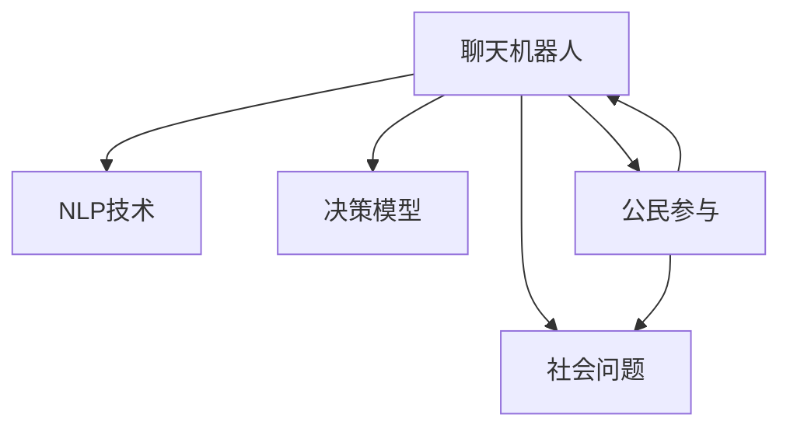

                 

# 聊天机器人公民参与：社会问题和决策

在当今快速发展的数字化时代，人工智能（AI）技术正在以前所未有的速度改变着我们的生活方式和社会运作模式。随着聊天机器人的普及，其参与社会决策和公民参与的潜力正逐渐被人们所认识。本文将深入探讨聊天机器人在社会问题和决策中的作用，分析其核心概念与原理，并提出具体的操作技术和应用场景，以期为社会问题的解决和公民参与提供新的视角和方法。

## 1. 背景介绍

### 1.1 问题由来
聊天机器人（Chatbot）作为一种基于自然语言处理（NLP）技术的智能系统，近年来在医疗、教育、客服等多个领域取得了显著成果。然而，它们在社会问题和决策中的应用仍然是一个相对新颖的领域。社会问题的多样性和复杂性，以及决策的科学性和伦理性，使得聊天机器人参与社会问题的解决和决策需要多学科、多领域的协作。

### 1.2 问题核心关键点
聊天机器人参与社会问题的解决和决策的核心关键点包括：
1. 如何准确理解社会问题及其背景。
2. 如何构建有效的决策模型，并结合社会知识进行推理。
3. 如何与公民进行互动，收集和反馈意见。
4. 如何平衡技术、伦理和法律的界限，确保公平、透明和可解释性。

### 1.3 问题研究意义
聊天机器人参与社会问题的解决和决策具有重要意义：
1. 提升决策效率和准确性。聊天机器人可以快速处理大量信息，辅助决策者进行科学分析。
2. 增强公民参与。通过与公民的互动，收集意见和反馈，提升决策的民主性和透明度。
3. 促进社会问题的解决。聊天机器人能够提供24/7的咨询服务，帮助社会问题得到快速响应和解决。

## 2. 核心概念与联系

### 2.1 核心概念概述

为了更好地理解聊天机器人参与社会问题和决策的机制，本节将介绍几个密切相关的核心概念：

- 聊天机器人（Chatbot）：基于NLP和AI技术的智能系统，能够模拟人类对话，处理用户请求。
- 自然语言处理（NLP）：使计算机能够理解、解释和生成自然语言的技术，是聊天机器人工作的基础。
- 社会问题（Social Issues）：涉及社会公平、道德、伦理等问题的议题，需要通过集体讨论和决策来解决。
- 决策模型（Decision Model）：用于辅助决策的数学模型，通常包括预测、分类、聚类等算法。
- 公民参与（Citizen Engagement）：通过各种手段和平台，使公民能够参与公共事务决策的过程。

这些核心概念之间的逻辑关系可以通过以下Mermaid流程图来展示：



这个流程图展示了聊天机器人与NLP技术、社会问题、决策模型和公民参与之间的联系：

1. 聊天机器人利用NLP技术理解和生成自然语言，从而与公民进行互动。
2. 聊天机器人能够构建社会问题模型，并结合决策模型进行推理。
3. 聊天机器人通过公民参与收集意见和反馈，辅助决策过程。

## 3. 核心算法原理 & 具体操作步骤

### 3.1 算法原理概述

聊天机器人参与社会问题和决策的算法原理主要包括：

- **自然语言理解（NLU）**：聊天机器人首先需要理解用户的自然语言输入，提取关键信息和语义。
- **信息检索与融合**：结合社会知识库和外部数据，进行信息检索和融合，为决策提供支持。
- **决策支持系统（DSS）**：构建决策模型，利用统计学、优化等算法，为决策者提供支持。
- **公民参与机制**：设计用户界面和交互方式，收集和反馈公民的意见和建议。

### 3.2 算法步骤详解

聊天机器人参与社会问题和决策的主要操作步骤如下：

**Step 1: 数据收集与预处理**
- 收集社会问题相关的数据，包括历史事件、统计数据、专家意见等。
- 对数据进行清洗、标准化和归一化处理，确保数据质量。

**Step 2: 构建知识库**
- 构建社会知识库，包括社会问题的背景、相关法律法规、专家意见等。
- 利用信息检索技术，使聊天机器人能够快速查询和获取相关知识。

**Step 3: 自然语言理解**
- 使用NLP技术，对用户的自然语言输入进行分词、词性标注、实体识别等处理。
- 通过语义分析和上下文理解，提取关键信息和语义意图。

**Step 4: 信息检索与融合**
- 利用信息检索技术，在知识库中检索相关问题和解决方案。
- 结合外部数据和用户反馈，对检索结果进行融合和筛选，生成推荐列表。

**Step 5: 决策支持**
- 构建决策模型，如决策树、贝叶斯网络等，结合社会知识库进行推理和预测。
- 提供决策建议，辅助决策者进行科学决策。

**Step 6: 公民参与与反馈**
- 设计用户界面，通过聊天机器人与公民进行互动，收集意见和反馈。
- 利用情感分析、文本分类等技术，分析公民的意见和建议，为决策提供参考。

**Step 7: 结果展示与反馈**
- 将决策建议和公民反馈整合，生成报告和建议。
- 展示给决策者，并提供后续改进的建议。

### 3.3 算法优缺点

聊天机器人参与社会问题和决策具有以下优点：

1. **高效性**：能够快速处理大量信息，辅助决策者进行科学分析。
2. **可扩展性**：支持多语言和多文化背景的用户，具有广泛的应用潜力。
3. **透明度**：通过公民参与和反馈，增强决策的透明性和民主性。
4. **动态性**：能够实时更新和扩展知识库，保持决策的相关性。

同时，聊天机器人参与社会问题和决策也存在一些缺点：

1. **数据质量依赖**：决策的准确性依赖于知识库和数据的质量，需要持续维护和更新。
2. **伦理和法律风险**：涉及敏感信息处理，需要严格遵守伦理和法律规范。
3. **技术复杂性**：需要多学科的协作和知识融合，技术实现难度较大。
4. **用户接受度**：需要设计友好的用户界面和交互方式，提高用户的接受度和满意度。

### 3.4 算法应用领域

聊天机器人参与社会问题和决策的应用领域包括：

1. **公共卫生**：在疫情期间，利用聊天机器人进行疫情监测、症状评估、健康咨询等。
2. **环境保护**：通过聊天机器人收集公众意见，辅助环境保护政策的制定和执行。
3. **教育公平**：利用聊天机器人提供教育资源和支持，帮助弱势群体获得教育机会。
4. **社会治理**：结合公民反馈和数据，辅助政府进行社会治理和政策制定。
5. **灾害应对**：在灾害发生时，提供实时的救援和支持，辅助灾害应对和恢复。

## 4. 数学模型和公式 & 详细讲解 & 举例说明

### 4.1 数学模型构建

聊天机器人参与社会问题和决策的数学模型构建主要包括以下几个方面：

- **自然语言理解模型**：使用词向量模型、深度学习模型等，对用户输入进行语义分析和实体识别。
- **信息检索模型**：使用向量空间模型、隐式语义分析等，在知识库中进行信息检索和匹配。
- **决策支持模型**：使用决策树、贝叶斯网络、神经网络等，结合社会知识库进行推理和预测。

### 4.2 公式推导过程

以决策树为例，决策树模型通过分裂数据集，将问题逐步分解为更小、更简单的问题，从而进行分类和预测。其数学公式如下：

$$
T = \bigcup_{i=1}^n T_i
$$

其中，$T$ 表示决策树，$T_i$ 表示第 $i$ 层的子树。决策树的分裂过程可以使用信息增益、基尼指数等指标进行衡量，选择最优的特征进行分裂。

### 4.3 案例分析与讲解

以疫情期间的聊天机器人为例，分析其参与社会问题和决策的过程：

1. **数据收集**：收集与疫情相关的数据，包括病例分布、症状描述、医疗资源等。
2. **知识库构建**：构建关于疫情的知识库，包括病毒传播机制、防控措施、医疗资源分布等。
3. **自然语言理解**：通过聊天机器人，用户可以输入症状描述、地点等信息，进行初步评估和推荐。
4. **信息检索与融合**：利用信息检索技术，从知识库中检索相关建议和防控措施，结合用户反馈进行融合和筛选。
5. **决策支持**：通过决策树模型，结合知识库和数据，生成推荐的防疫措施和医疗资源。
6. **公民参与与反馈**：聊天机器人与公民互动，收集意见和建议，反馈给决策者进行政策调整。
7. **结果展示与反馈**：展示推荐结果和公民反馈，供决策者参考和改进。

## 5. 项目实践：代码实例和详细解释说明

### 5.1 开发环境搭建

在进行聊天机器人项目实践前，我们需要准备好开发环境。以下是使用Python进行PyTorch开发的环境配置流程：

1. 安装Anaconda：从官网下载并安装Anaconda，用于创建独立的Python环境。

2. 创建并激活虚拟环境：
```bash
conda create -n chatbot-env python=3.8 
conda activate chatbot-env
```

3. 安装PyTorch：根据CUDA版本，从官网获取对应的安装命令。例如：
```bash
conda install pytorch torchvision torchaudio cudatoolkit=11.1 -c pytorch -c conda-forge
```

4. 安装聊天机器人库：
```bash
pip install chatterbot
```

5. 安装各类工具包：
```bash
pip install numpy pandas scikit-learn matplotlib tqdm jupyter notebook ipython
```

完成上述步骤后，即可在`chatbot-env`环境中开始项目实践。

### 5.2 源代码详细实现

下面我们以构建一个简单的疫情聊天机器人为例，给出使用PyTorch进行自然语言处理和决策支持的代码实现。

首先，定义自然语言处理模型：

```python
from chatterbot import ChatBot
from chatterbot.trainers import ListTrainer
from sklearn.feature_extraction.text import CountVectorizer
from sklearn.naive_bayes import MultinomialNB

# 定义聊天机器人
chatbot = ChatBot('CovidBot')

# 定义训练数据
training_data = [
    ('我出现了咳嗽和发热，怎么办?', '建议您立即就医'),
    ('我如何预防新型冠状病毒?', '戴口罩、勤洗手、保持社交距离')
    # 更多训练数据
]

# 使用列表训练器进行训练
trainer = ListTrainer(chatbot)
trainer.train(training_data)

# 使用决策树模型进行推理
def predict_label(text):
    # 提取特征
    vectorizer = CountVectorizer()
    features = vectorizer.fit_transform([text])
    X = features.toarray()
    # 使用朴素贝叶斯分类器进行预测
    clf = MultinomialNB()
    clf.fit(X, ['是', '否', '可能'])
    label = clf.predict_proba(X)[0]
    return label

# 测试聊天机器人的推理能力
result = predict_label('我出现了咳嗽和发热，怎么办？')
print(result)
```

然后，定义信息检索和决策支持函数：

```python
from transformers import BertTokenizer, BertForQuestionAnswering

# 加载预训练的Bert模型
tokenizer = BertTokenizer.from_pretrained('bert-base-uncased')
model = BertForQuestionAnswering.from_pretrained('bert-base-uncased')

def get_answer(question, context):
    # 对问题进行编码
    encoding = tokenizer(question, context, return_tensors='pt')
    start_scores, end_scores = model(**encoding)
    start_index = torch.argmax(start_scores, dim=1)
    end_index = torch.argmax(end_scores, dim=1)
    answer = tokenizer.convert_tokens_to_string(tokenizer.convert_ids_to_tokens(start_index) + tokenizer.convert_ids_to_tokens(end_index))
    return answer

# 测试信息检索功能
answer = get_answer('我出现了咳嗽和发热，怎么办?', '我出现了咳嗽和发热，怎么办？')
print(answer)
```

最后，启动聊天机器人并进行测试：

```python
chatbot.train(training_data)

while True:
    user_input = input('请输入问题：')
    if user_input.lower() == '退出':
        break
    bot_response = chatbot.get_response(user_input)
    print('聊天机器人回答：', bot_response)
```

以上就是使用PyTorch和chatterbot构建一个简单的疫情聊天机器人的完整代码实现。可以看到，通过Python和相关库，我们可以方便地实现自然语言处理和决策支持功能。

### 5.3 代码解读与分析

让我们再详细解读一下关键代码的实现细节：

**自然语言处理模型**：
- 使用chatterbot库创建聊天机器人。
- 定义训练数据，包括问题和对应的回答。
- 使用列表训练器对聊天机器人进行训练。

**信息检索模型**：
- 加载预训练的BERT模型，用于信息检索。
- 定义信息检索函数，对问题进行编码和推理。

**决策支持模型**：
- 定义决策函数，使用朴素贝叶斯分类器进行推理。

**测试和交互**：
- 启动聊天机器人，并使用while循环进行持续交互。
- 用户输入问题后，调用聊天机器人的get_response方法获取回答。

可以看到，通过合理的代码设计和数据处理，我们能够实现一个基本的聊天机器人，提供自然语言处理和决策支持功能。

## 6. 实际应用场景

### 6.1 智能客服系统

聊天机器人在智能客服系统中的应用可以大大提升客服效率和客户满意度。通过自然语言处理和决策支持，聊天机器人可以处理常见问题，提供24/7的咨询服务，减轻人工客服的负担。

在技术实现上，可以收集企业内部的历史客服对话记录，将问题和最佳答复构建成监督数据，在此基础上对预训练的聊天机器人进行微调。微调后的聊天机器人能够自动理解用户意图，匹配最合适的答案模板进行回复。对于用户提出的新问题，还可以接入检索系统实时搜索相关内容，动态组织生成回答。如此构建的智能客服系统，能大幅提升客户咨询体验和问题解决效率。

### 6.2 金融舆情监测

金融机构需要实时监测市场舆论动向，以便及时应对负面信息传播，规避金融风险。传统的人工监测方式成本高、效率低，难以应对网络时代海量信息爆发的挑战。基于聊天机器人技术的文本分类和情感分析技术，为金融舆情监测提供了新的解决方案。

具体而言，可以收集金融领域相关的新闻、报道、评论等文本数据，并对其进行主题标注和情感标注。在此基础上对预训练语言模型进行微调，使其能够自动判断文本属于何种主题，情感倾向是正面、中性还是负面。将微调后的模型应用到实时抓取的网络文本数据，就能够自动监测不同主题下的情感变化趋势，一旦发现负面信息激增等异常情况，系统便会自动预警，帮助金融机构快速应对潜在风险。

### 6.3 个性化推荐系统

当前的推荐系统往往只依赖用户的历史行为数据进行物品推荐，无法深入理解用户的真实兴趣偏好。基于聊天机器人技术的个性化推荐系统可以更好地挖掘用户行为背后的语义信息，从而提供更精准、多样的推荐内容。

在实践中，可以收集用户浏览、点击、评论、分享等行为数据，提取和用户交互的物品标题、描述、标签等文本内容。将文本内容作为模型输入，用户的后续行为（如是否点击、购买等）作为监督信号，在此基础上微调预训练语言模型。微调后的模型能够从文本内容中准确把握用户的兴趣点。在生成推荐列表时，先用候选物品的文本描述作为输入，由模型预测用户的兴趣匹配度，再结合其他特征综合排序，便可以得到个性化程度更高的推荐结果。

### 6.4 未来应用展望

随着聊天机器人技术的不断发展，其参与社会问题和决策的应用前景将更加广阔：

1. **智慧医疗**：在疫情期间，利用聊天机器人进行疫情监测、症状评估、健康咨询等，辅助医生诊疗，加速新药开发进程。
2. **智能教育**：利用聊天机器人提供教育资源和支持，帮助弱势群体获得教育机会，进行个性化辅导和答疑。
3. **智慧城市治理**：结合公民反馈和数据，辅助政府进行社会治理和政策制定，提升城市管理的自动化和智能化水平。
4. **应急响应**：在灾害发生时，提供实时的救援和支持，辅助灾害应对和恢复。

## 7. 工具和资源推荐

### 7.1 学习资源推荐

为了帮助开发者系统掌握聊天机器人参与社会问题和决策的理论基础和实践技巧，这里推荐一些优质的学习资源：

1. **《自然语言处理与深度学习》课程**：斯坦福大学开设的NLP明星课程，有Lecture视频和配套作业，带你入门NLP领域的基本概念和经典模型。
2. **《深度学习与自然语言处理》书籍**：介绍深度学习和自然语言处理的基本原理和应用，涵盖NLP模型的训练、评估、微调等方面。
3. **HuggingFace官方文档**：提供丰富的预训练语言模型和完整的微调样例代码，是上手实践的必备资料。
4. **TensorFlow官方文档**：介绍TensorFlow框架的使用方法和最佳实践，提供多类模型和算法的实现。
5. **NLTK库**：自然语言处理工具包，提供文本预处理、语料库、模型训练等功能，适合NLP初学者。

通过对这些资源的学习实践，相信你一定能够快速掌握聊天机器人参与社会问题和决策的精髓，并用于解决实际的NLP问题。

### 7.2 开发工具推荐

高效的开发离不开优秀的工具支持。以下是几款用于聊天机器人开发和部署的常用工具：

1. **PyTorch**：基于Python的开源深度学习框架，灵活动态的计算图，适合快速迭代研究。
2. **TensorFlow**：由Google主导开发的开源深度学习框架，生产部署方便，适合大规模工程应用。
3. **HuggingFace Transformers库**：提供丰富的预训练模型和微调方法，适合NLP任务开发。
4. **TensorBoard**：TensorFlow配套的可视化工具，可实时监测模型训练状态，并提供丰富的图表呈现方式。
5. **Weights & Biases**：模型训练的实验跟踪工具，可以记录和可视化模型训练过程中的各项指标，方便对比和调优。

合理利用这些工具，可以显著提升聊天机器人参与社会问题和决策的开发效率，加快创新迭代的步伐。

### 7.3 相关论文推荐

聊天机器人参与社会问题和决策的发展源于学界的持续研究。以下是几篇奠基性的相关论文，推荐阅读：

1. **《基于深度学习的智能问答系统》**：介绍深度学习在智能问答中的应用，涵盖语义理解、信息检索和对话管理等方面。
2. **《聊天机器人技术及其应用》**：系统综述聊天机器人的研究现状和应用场景，提供丰富的案例和实例。
3. **《社会问题治理的智能技术》**：探讨智能技术在社会问题治理中的应用，包括自然语言处理、信息检索和决策支持等方面。
4. **《智能客服系统的设计与实现》**：介绍智能客服系统的设计与实现方法，涵盖自然语言处理、对话管理、知识库构建等方面。

这些论文代表了大语言模型微调技术的发展脉络。通过学习这些前沿成果，可以帮助研究者把握学科前进方向，激发更多的创新灵感。

## 8. 总结：未来发展趋势与挑战

### 8.1 研究成果总结

本文对聊天机器人参与社会问题和决策进行了全面系统的介绍。首先阐述了聊天机器人参与社会问题的解决和决策的核心概念和原理，明确了聊天机器人参与社会问题的解决和决策的重要性和挑战。其次，从原理到实践，详细讲解了聊天机器人参与社会问题和决策的数学模型和算法步骤，给出了具体的代码实现。同时，本文还广泛探讨了聊天机器人在智能客服、金融舆情、个性化推荐等多个行业领域的应用前景，展示了聊天机器人技术的巨大潜力。此外，本文精选了聊天机器人技术的各类学习资源，力求为读者提供全方位的技术指引。

通过本文的系统梳理，可以看到，聊天机器人参与社会问题和决策技术正在成为人工智能领域的重要范式，极大地拓展了聊天机器人的应用边界，催生了更多的落地场景。受益于大规模语料的预训练和微调方法的不断进步，聊天机器人将在更多领域得到应用，为社会问题的解决和决策提供新的视角和方法。

### 8.2 未来发展趋势

展望未来，聊天机器人参与社会问题和决策技术将呈现以下几个发展趋势：

1. **智能化程度提升**：随着深度学习、自然语言处理等技术的发展，聊天机器人的智能水平将进一步提升，能够更好地理解用户意图和语义。
2. **多模态交互**：聊天机器人将逐步支持多模态交互，结合图像、声音等多模态数据，提升用户体验和互动效果。
3. **联邦学习**：通过联邦学习等技术，保护用户隐私的同时，提升聊天机器人的智能水平和适应性。
4. **自适应学习**：通过自适应学习技术，聊天机器人能够根据用户反馈和数据动态调整模型参数，提升用户满意度和系统性能。
5. **跨领域应用**：聊天机器人将拓展到更多领域，如医疗、教育、金融等，提供更加全面和多样化的服务。

以上趋势凸显了聊天机器人参与社会问题和决策技术的广阔前景。这些方向的探索发展，必将进一步提升聊天机器人的智能化水平和应用范围，为社会问题的解决和决策提供更高效、更可靠的解决方案。

### 8.3 面临的挑战

尽管聊天机器人参与社会问题和决策技术已经取得了一定的成果，但在迈向更加智能化、普适化应用的过程中，它仍面临着诸多挑战：

1. **数据隐私保护**：聊天机器人处理大量用户数据，需要严格保护用户隐私，遵守数据保护法规。
2. **公平性和透明性**：聊天机器人需要确保决策过程的公平性和透明性，避免偏见和歧视。
3. **伦理和法律风险**：涉及敏感信息处理，需要严格遵守伦理和法律规范，确保系统安全性。
4. **技术复杂性**：聊天机器人需要多学科的协作和知识融合，技术实现难度较大。
5. **用户接受度**：需要设计友好的用户界面和交互方式，提高用户的接受度和满意度。

正视聊天机器人参与社会问题和决策面临的这些挑战，积极应对并寻求突破，将使得聊天机器人技术在构建智能社会中发挥更大的作用。相信随着学界和产业界的共同努力，这些挑战终将一一被克服，聊天机器人参与社会问题和决策技术必将在构建智能社会中扮演越来越重要的角色。

### 8.4 研究展望

面对聊天机器人参与社会问题和决策所面临的挑战，未来的研究需要在以下几个方面寻求新的突破：

1. **隐私保护技术**：开发更加安全和高效的隐私保护技术，确保用户数据的安全性。
2. **公平性算法**：研究公平性和透明性算法，确保聊天机器人的决策过程公正无偏。
3. **多模态交互**：研究多模态交互技术，提升聊天机器人的智能化水平和用户体验。
4. **自适应学习**：研究自适应学习算法，使聊天机器人能够动态调整模型参数，提升系统性能。
5. **跨领域应用**：研究跨领域应用技术，拓展聊天机器人在更多领域的实际应用。

这些研究方向的探索，必将引领聊天机器人技术迈向更高的台阶，为构建智能社会提供新的动力和方向。面向未来，聊天机器人参与社会问题和决策技术需要与其他人工智能技术进行更深入的融合，如知识表示、因果推理、强化学习等，多路径协同发力，共同推动社会问题的解决和智能决策的发展。

## 9. 附录：常见问题与解答

**Q1：如何提升聊天机器人的智能水平？**

A: 提升聊天机器人的智能水平需要多方面的努力，包括：
1. 使用更加先进的深度学习模型，如BERT、GPT等。
2. 利用多模态数据进行训练，如结合图像、声音等多模态数据。
3. 引入自适应学习技术，根据用户反馈和数据动态调整模型参数。
4. 使用联邦学习等技术，保护用户隐私的同时提升模型性能。

**Q2：聊天机器人在社会问题和决策中的应用有哪些？**

A: 聊天机器人在社会问题和决策中的应用包括：
1. 智能客服系统：提供24/7的咨询服务，减轻人工客服的负担。
2. 金融舆情监测：监测市场舆论动向，规避金融风险。
3. 个性化推荐系统：挖掘用户兴趣偏好，提供个性化的推荐内容。
4. 智慧医疗：在疫情期间，提供疫情监测、症状评估和健康咨询等服务。
5. 智能教育：提供教育资源和支持，帮助弱势群体获得教育机会。

**Q3：聊天机器人参与社会问题和决策面临哪些挑战？**

A: 聊天机器人参与社会问题和决策面临以下挑战：
1. 数据隐私保护：严格保护用户隐私，遵守数据保护法规。
2. 公平性和透明性：确保决策过程的公正性和透明性。
3. 伦理和法律风险：确保系统安全性，遵守伦理和法律规范。
4. 技术复杂性：多学科协作和知识融合，技术实现难度较大。
5. 用户接受度：设计友好的用户界面和交互方式。

**Q4：如何选择合适的聊天机器人平台？**

A: 选择合适的聊天机器人平台需要考虑以下因素：
1. 平台的功能和接口：选择功能丰富、易于集成的平台。
2. 技术的先进性和可靠性：选择技术先进、稳定性高的平台。
3. 社区支持和资源：选择有活跃社区和丰富资源的平台。
4. 价格和成本：选择性价比高的平台，避免过度投入。

**Q5：如何提升聊天机器人的用户体验？**

A: 提升聊天机器人的用户体验需要考虑以下因素：
1. 友好的用户界面：设计简洁、直观的界面，方便用户操作。
2. 自然流畅的对话：使用自然语言处理技术，提升对话的流畅性和自然性。
3. 个性化的推荐：根据用户偏好和行为，提供个性化的内容和推荐。
4. 实时的反馈和互动：及时响应用户请求，提供实时的反馈和互动。

---

作者：禅与计算机程序设计艺术 / Zen and the Art of Computer Programming

