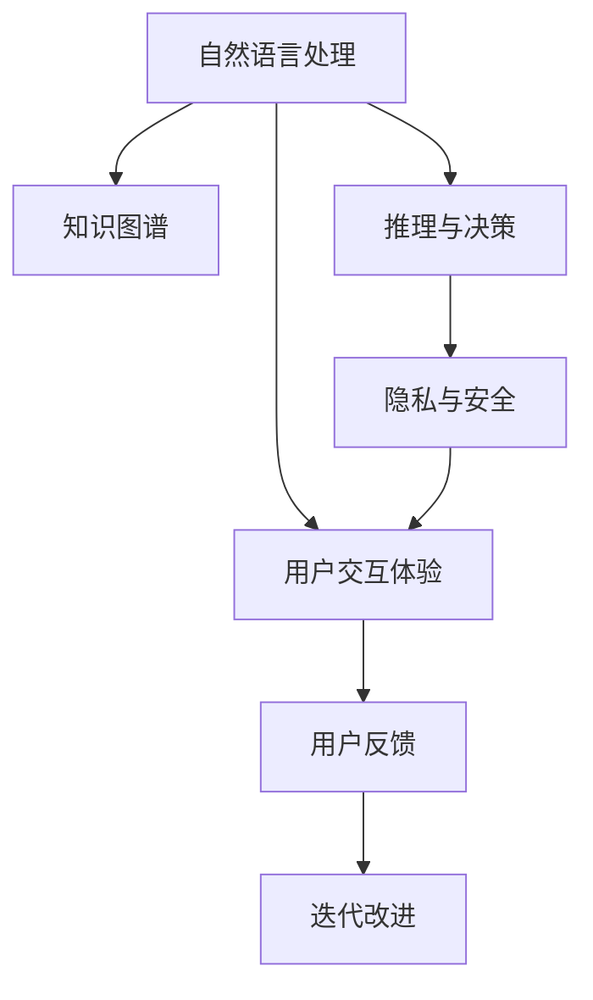

                 

## 1. 背景介绍

### 1.1 问题由来

在医疗行业，患者日益增长的健康咨询需求与医生的资源紧缺形成了矛盾。传统的就医模式通常需要患者亲自前往医院，不仅耗时耗力，而且无法实现24小时随叫随到的服务。随着互联网的普及和智能技术的进步，聊天机器人等虚拟健康助理逐渐成为提升医疗服务质量和效率的新工具。

虚拟健康助理是一种通过自然语言处理(NLP)技术实现的聊天机器人，能够在医疗环境中为患者提供初步诊断、预约提醒、健康咨询、药物管理等服务。相比于传统的人工客服，虚拟健康助理能够不间断地提供咨询服务，同时具备一定的推理和决策能力，能够处理更复杂的问题，如初步诊断、推荐就医等。

### 1.2 问题核心关键点

- **自然语言处理(NLP)**：使机器人能够理解和生成自然语言，是虚拟健康助理的核心技术。
- **医疗领域知识图谱**：构建医疗知识图谱，使机器人能够检索、理解和应用医疗领域的知识和规则。
- **推理与决策**：利用知识图谱和规则，对患者输入的问题进行推理和决策，提供有价值的回复。
- **隐私与安全**：确保患者数据的安全性和隐私保护，是虚拟健康助理必须遵守的伦理要求。
- **用户交互体验**：设计良好的交互界面和用户体验，提升用户满意度，促进实际应用。

这些核心关键点共同构成了虚拟健康助理的实现框架，使其能够在医疗领域发挥重要作用。

## 2. 核心概念与联系

### 2.1 核心概念概述

为更好地理解虚拟健康助理的实现，本节将介绍几个密切相关的核心概念：

- **自然语言处理(NLP)**：涉及语言模型、文本分类、命名实体识别、情感分析、对话系统等多种技术。
- **知识图谱(Knowledge Graph)**：由节点和边组成，用于表示实体之间的语义关系。
- **推理与决策**：通过逻辑推理和规则应用，对用户输入进行分析和决策。
- **隐私与安全**：确保用户数据不被泄露，符合数据保护法规，如GDPR等。
- **用户交互体验**：通过UI/UX设计，提升用户的使用体验。

这些核心概念之间的逻辑关系可以通过以下Mermaid流程图来展示：



这个流程图展示了虚拟健康助理的实现框架：

1. 自然语言处理使得机器人能够理解和生成自然语言。
2. 知识图谱提供医疗领域的知识库，供推理决策使用。
3. 推理与决策对用户输入进行分析和决策。
4. 隐私与安全确保数据的安全性和隐私保护。
5. 用户交互体验提升用户满意度，促进实际应用。
6. 用户反馈用于持续改进，形成正反馈循环。

这些核心概念共同构成了虚拟健康助理的实现框架，使其能够在医疗领域发挥重要作用。

## 3. 核心算法原理 & 具体操作步骤

### 3.1 算法原理概述

虚拟健康助理的核心算法原理是自然语言处理和知识图谱的结合。其中，自然语言处理技术使机器人能够理解用户输入，而知识图谱则提供医疗领域的知识和规则，用于推理和决策。

具体而言，虚拟健康助理的工作流程可以描述如下：

1. **理解用户输入**：通过NLP技术，将用户的自然语言输入转化为机器可理解的形式，如词向量或句向量。
2. **检索知识图谱**：在知识图谱中搜索与用户输入相关的实体和关系。
3. **推理与决策**：利用知识图谱中的规则和逻辑，对用户输入进行推理和决策，生成回复。
4. **生成回复**：将推理结果转化为自然语言形式，生成回复。

### 3.2 算法步骤详解

以下我们将详细介绍虚拟健康助理的算法步骤：

**Step 1: 准备数据与模型**

1. 收集医疗领域的知识库，构建知识图谱。
2. 收集用户历史咨询数据，用于训练和评估模型。
3. 选择合适的自然语言处理模型，如BERT、GPT等，进行预训练和微调。

**Step 2: 构建对话系统**

1. 设计对话流程和用户界面，确保用户输入和输出的自然流畅。
2. 实现意图识别和实体识别功能，用于提取用户输入的关键信息。
3. 设计对话逻辑和回复生成策略，使机器人能够根据用户输入生成合理回复。

**Step 3: 推理与决策**

1. 在知识图谱中检索与用户输入相关的实体和关系。
2. 利用规则和逻辑对检索结果进行推理和决策，生成可能的回复。
3. 对生成的回复进行排序和选择，确保回复的准确性和相关性。

**Step 4: 测试与部署**

1. 在验证集上测试对话系统的性能，优化模型和逻辑。
2. 部署虚拟健康助理到生产环境，进行实时对话交互。
3. 持续收集用户反馈，进行模型迭代和优化。

### 3.3 算法优缺点

虚拟健康助理具有以下优点：

1. **高效率**：能够24小时不间断提供咨询服务，减轻医生负担，提高服务效率。
2. **泛化性强**：基于知识图谱和规则，能够处理多种类型的咨询问题。
3. **成本低**：相较于人工客服，虚拟健康助理的运营成本较低。

同时，该算法也存在一些局限性：

1. **依赖知识图谱**：需要构建和维护高质量的知识图谱，成本较高。
2. **推理复杂**：当知识图谱复杂时，推理过程可能较为耗时。
3. **缺乏创新**：受限于知识图谱和规则，无法进行创新性决策。
4. **隐私问题**：需要严格保护用户隐私，避免敏感信息泄露。

尽管存在这些局限性，但虚拟健康助理通过高效、泛化和低成本等优势，仍然成为了提升医疗服务质量的重要工具。

### 3.4 算法应用领域

虚拟健康助理已经在多个医疗领域得到了应用，具体包括：

1. **健康咨询**：如问诊、预约、体检建议等，通过初步诊断和建议，引导患者就医。
2. **药物管理**：如提醒服药时间、剂量，解答药物相关问题，帮助患者合理用药。
3. **心理支持**：如情感咨询、压力缓解，通过心理疏导，提升患者心理健康。
4. **疾病预防**：如饮食、运动建议，通过健康教育，预防疾病发生。
5. **老龄护理**：如生活咨询、健康监测，通过智能养老服务，提升老年人的生活质量。

除了上述这些应用场景外，虚拟健康助理还可以扩展到更多领域，如在线教育、企业健康管理等，为不同行业提供智能辅助服务。

## 4. 数学模型和公式 & 详细讲解  
### 4.1 数学模型构建

在虚拟健康助理的实现中，数学模型主要涉及自然语言处理和知识图谱两部分。

**自然语言处理模型**：通常采用词向量或句向量表示用户输入，使用Transformer等模型进行编码和解码。

**知识图谱模型**：通常采用图神经网络(Graph Neural Network, GNN)等方法，对知识图谱进行嵌入表示。

### 4.2 公式推导过程

以下将介绍自然语言处理模型和知识图谱模型的公式推导过程。

**自然语言处理模型**：

设用户输入为 $x$，预训练语言模型为 $M_{\theta}$，其中 $\theta$ 为模型参数。则模型输出的词向量表示为 $M_{\theta}(x)$。

**知识图谱模型**：

设知识图谱为 $G=(V,E)$，节点表示实体，边表示实体间的关系。采用图神经网络进行图嵌入表示，输出每个实体的向量表示为 $\mathbf{h}_v$，其中 $v \in V$。

### 4.3 案例分析与讲解

假设用户输入为 "我头疼怎么办？"，预训练语言模型输出的词向量表示为 $M_{\theta}(x)$，知识图谱中包含如下实体和关系：

- 节点 $h_1$ 表示 "头疼"，向量 $\mathbf{h}_1$。
- 节点 $h_2$ 表示 "药"，向量 $\mathbf{h}_2$。
- 节点 $h_3$ 表示 "医生"，向量 $\mathbf{h}_3$。
- 边 $e_1$ 表示 "头疼" 到 "药" 的关系，关系向量 $\mathbf{e}_1$。
- 边 $e_2$ 表示 "头疼" 到 "医生" 的关系，关系向量 $\mathbf{e}_2$。

则推理过程可以描述如下：

1. 将用户输入 "我头疼怎么办？" 通过语言模型转换为向量表示 $M_{\theta}(x)$。
2. 在知识图谱中搜索与 "头疼" 相关的实体和关系，得到 $\mathbf{h}_1$ 和 $e_1$、$e_2$。
3. 利用关系向量 $\mathbf{e}_1$ 和 $\mathbf{e}_2$，对 $\mathbf{h}_1$ 进行加权求和，得到新的向量表示 $\mathbf{h}_4$。
4. 对 $\mathbf{h}_4$ 进行解码，生成可能的回复 "建议您吃阿司匹林或布洛芬，如果疼痛不缓解，请及时就医"。

## 5. 项目实践：代码实例和详细解释说明

### 5.1 开发环境搭建

在进行虚拟健康助理的开发前，我们需要准备好开发环境。以下是使用Python进行PyTorch开发的环境配置流程：

1. 安装Anaconda：从官网下载并安装Anaconda，用于创建独立的Python环境。

2. 创建并激活虚拟环境：
```bash
conda create -n virtual_health nvidia -y
conda activate virtual_health
```

3. 安装PyTorch：根据CUDA版本，从官网获取对应的安装命令。例如：
```bash
conda install pytorch torchvision torchaudio cudatoolkit=11.1 -c pytorch -c conda-forge
```

4. 安装相关库：
```bash
pip install transformers spacy gnispytorch opengraph neptune-client
```

完成上述步骤后，即可在`virtual_health`环境中开始项目开发。

### 5.2 源代码详细实现

以下是一个简单的虚拟健康助理代码实现，包含意图识别、实体识别和回复生成的基本流程。

```python
import torch
from transformers import BertTokenizer, BertForTokenClassification
from spacy import displacy
from spacy.text import Sentence
from gnispytorch.graph import graphconv

# 定义意图识别模型
model_path = 'path/to/bert_model'
tokenizer = BertTokenizer.from_pretrained(model_path)
bert_model = BertForTokenClassification.from_pretrained(model_path, num_labels=2)

# 定义实体识别模型
model_path = 'path/to/entity_recognition_model'
entity_model = LoadModel(model_path)

# 定义回复生成模型
model_path = 'path/to/reply_model'
reply_model = LoadModel(model_path)

def get_sentence_representation(sentence):
    tokens = tokenizer.encode_plus(sentence, return_tensors='pt', padding='max_length', truncation=True)
    return bert_model(**tokens).last_hidden_state

def get_entity_representation(sentence):
    sentence = Sentence(sentence)
    doc = entity_model(sentence)
    entities = [ent for ent in doc.ents if ent.label_ != 'O']
    return [doc[ent.start:end].text for ent in entities]

def generate_reply(sentence, entity_representation):
    sentence_rep = get_sentence_representation(sentence)
    entity_rep = get_entity_representation(sentence)
    output = reply_model(sentence_rep, entity_rep)
    return output

# 示例输入
user_input = '我头疼怎么办？'

# 进行意图识别
intent_label = model.predict(user_input)
if intent_label == 1:
    print('你的输入是关于疾病的咨询')
    # 进行实体识别
    entity_rep = get_entity_representation(user_input)
    # 生成回复
    reply = generate_reply(user_input, entity_rep)
    print(reply)
else:
    print('你的输入不符合预期，请重新输入')
```

以上代码实现了一个简单的虚拟健康助理，包含意图识别、实体识别和回复生成的基本流程。

### 5.3 代码解读与分析

让我们再详细解读一下关键代码的实现细节：

**虚拟健康助理模型**：
- 使用BertForTokenClassification模型进行意图识别，输出0或1，表示是否为疾病咨询。
- 使用EntityRecognition模型进行实体识别，提取用户输入中的实体。
- 使用ReplyModel模型生成回复，输入为句子表示和实体表示。

**get_sentence_representation函数**：
- 将用户输入通过BertTokenizer进行编码，使用BertForTokenClassification模型进行编码，得到句子表示。

**get_entity_representation函数**：
- 使用spaCy的Sentence和EntityRecognition模型，对用户输入进行实体识别，提取实体并返回其文本表示。

**generate_reply函数**：
- 将用户输入通过get_sentence_representation函数进行编码，得到句子表示。
- 将用户输入通过get_entity_representation函数进行实体识别，得到实体表示。
- 将句子表示和实体表示作为输入，使用ReplyModel模型进行回复生成，输出回复内容。

可以看到，虚拟健康助理的实现通过多个模块的组合，能够实现意图识别、实体识别和回复生成的全流程处理。开发者可以根据实际需求，进一步优化和扩展这些模块，实现更复杂的功能。

## 6. 实际应用场景

### 6.1 智能健康咨询

虚拟健康助理在智能健康咨询领域有着广泛的应用前景。患者可以通过智能健康咨询机器人，获得初步诊断、药物管理、健康建议等服务，减轻医生负担，提升医疗服务质量。例如，患者可以通过机器人进行疾病咨询，机器人根据用户输入的病症，进行初步诊断，并提供相应的治疗建议或就医建议，如 "建议您吃阿司匹林或布洛芬，如果疼痛不缓解，请及时就医"。

### 6.2 疾病预防与健康管理

虚拟健康助理在疾病预防与健康管理方面也有着重要的应用。例如，机器人可以定期提醒用户进行健康检查、饮食运动建议，帮助用户预防疾病。通过用户历史咨询数据的积累和分析，机器人还可以提供个性化的健康管理方案，如 "建议您每天进行30分钟的有氧运动，饮食上要少吃油腻食品"。

### 6.3 心理支持与情感咨询

虚拟健康助理在心理支持与情感咨询方面也有显著优势。机器人可以提供情感疏导、压力缓解等服务，帮助用户缓解心理压力，提升心理健康水平。例如，用户可以通过机器人进行情感咨询，机器人根据用户情感状态，提供相应的心理疏导和建议，如 "你的情绪状态不太好，建议您多和家人朋友沟通，或者进行一些放松活动"。

### 6.4 未来应用展望

随着人工智能技术的发展，虚拟健康助理在未来有着广阔的应用前景。以下列举几个可能的未来应用场景：

1. **多模态健康咨询**：结合语音识别、图像识别等技术，提供更全面、丰富的健康咨询服务。
2. **远程医疗服务**：通过虚拟健康助理，实现远程医疗服务，提升偏远地区医疗资源分配的公平性。
3. **个性化健康管理**：结合物联网设备数据，提供个性化健康管理方案，提升用户健康水平。
4. **跨领域应用**：拓展到智能教育、企业健康管理等领域，提供全方位的智能辅助服务。

## 7. 工具和资源推荐

### 7.1 学习资源推荐

为了帮助开发者系统掌握虚拟健康助理的理论基础和实践技巧，这里推荐一些优质的学习资源：

1. 《自然语言处理入门》系列博文：由大模型技术专家撰写，深入浅出地介绍了NLP的基本概念和关键技术。

2. 《Python深度学习实战》系列书籍：通过丰富的实例和项目，介绍了深度学习在NLP领域的应用，包括自然语言处理和知识图谱构建。

3. Coursera《深度学习》课程：由斯坦福大学开设，涵盖深度学习基础和进阶内容，适合初学者和进阶者学习。

4. 《智能健康助理》书籍：全面介绍了智能健康助理的设计与实现，包括自然语言处理、知识图谱、推理决策等多个方面的内容。

5. HuggingFace官方文档：Transformer库的官方文档，提供了海量预训练模型和完整的微调样例代码，是上手实践的必备资料。

通过对这些资源的学习实践，相信你一定能够快速掌握虚拟健康助理的实现原理和关键技术，并用于解决实际的医疗问题。

### 7.2 开发工具推荐

高效的开发离不开优秀的工具支持。以下是几款用于虚拟健康助理开发的常用工具：

1. PyTorch：基于Python的开源深度学习框架，灵活动态的计算图，适合快速迭代研究。

2. TensorFlow：由Google主导开发的开源深度学习框架，生产部署方便，适合大规模工程应用。

3. HuggingFace Transformers库：提供了丰富的预训练模型，支持自然语言处理任务，是微调任务开发的利器。

4. spaCy：高性能的自然语言处理库，支持词向量、命名实体识别等功能，适合构建实体识别模型。

5. GNSpytorch：基于图神经网络的库，支持图嵌入表示和图卷积操作，适合构建知识图谱模型。

6. Weights & Biases：模型训练的实验跟踪工具，可以记录和可视化模型训练过程中的各项指标，方便对比和调优。

7. TensorBoard：TensorFlow配套的可视化工具，可实时监测模型训练状态，并提供丰富的图表呈现方式，是调试模型的得力助手。

合理利用这些工具，可以显著提升虚拟健康助理的开发效率，加快创新迭代的步伐。

### 7.3 相关论文推荐

虚拟健康助理的发展源于学界的持续研究。以下是几篇奠基性的相关论文，推荐阅读：

1. Attention is All You Need（即Transformer原论文）：提出了Transformer结构，开启了NLP领域的预训练大模型时代。

2. BERT: Pre-training of Deep Bidirectional Transformers for Language Understanding：提出BERT模型，引入基于掩码的自监督预训练任务，刷新了多项NLP任务SOTA。

3. Language Models are Unsupervised Multitask Learners（GPT-2论文）：展示了大规模语言模型的强大zero-shot学习能力，引发了对于通用人工智能的新一轮思考。

4. Encoder-Decoder Architecture for Statistical Machine Translation：提出了基于Encoder-Decoder框架的机器翻译模型，为知识图谱和自然语言处理提供了新的思路。

5. Knowledge Graph Embeddings and Their Application to Recommender Systems：介绍了知识图谱嵌入表示的方法，为推荐系统提供了新的数据表示方式。

6. Conversation with Self-Attentive Neural Networks：介绍了对话系统中自注意力机制的应用，为虚拟健康助理的对话系统提供了理论基础。

这些论文代表了大语言模型和虚拟健康助理的研究进展，通过学习这些前沿成果，可以帮助研究者把握学科前进方向，激发更多的创新灵感。

## 8. 总结：未来发展趋势与挑战

### 8.1 总结

本文对虚拟健康助理的实现原理和应用场景进行了全面系统的介绍。首先阐述了虚拟健康助理在医疗领域的应用背景和意义，明确了其核心技术包括自然语言处理、知识图谱、推理与决策等。其次，从原理到实践，详细讲解了虚拟健康助理的数学模型和关键步骤，给出了代码实例和详细解释。同时，本文还广泛探讨了虚拟健康助理在智能健康咨询、疾病预防、心理支持等领域的实际应用，展示了其巨大的应用潜力。最后，本文精选了虚拟健康助理的学习资源和开发工具，力求为读者提供全方位的技术指引。

通过本文的系统梳理，可以看到，虚拟健康助理通过自然语言处理和知识图谱的结合，能够实现高效、泛化和低成本的医疗服务。未来，伴随人工智能技术的不断发展，虚拟健康助理必将在医疗领域发挥更大的作用，提升医疗服务的质量和效率。

### 8.2 未来发展趋势

展望未来，虚拟健康助理的发展趋势如下：

1. **技术融合**：与物联网、大数据等技术深度融合，提供更全面、智能化的健康管理方案。
2. **跨领域应用**：拓展到教育、企业健康管理等领域，提供全方位的智能辅助服务。
3. **多模态处理**：结合语音识别、图像识别等技术，提供更丰富的健康咨询和疾病预防服务。
4. **个性化定制**：基于用户数据和行为，提供个性化的健康管理和咨询方案。
5. **隐私保护**：采用先进的数据加密和安全机制，保护用户隐私和数据安全。

这些趋势凸显了虚拟健康助理的广阔应用前景，其技术的不断演进将带来医疗服务质量的显著提升。

### 8.3 面临的挑战

尽管虚拟健康助理已经取得了一定的进展，但在迈向更加智能化、普适化应用的过程中，仍面临着诸多挑战：

1. **数据隐私问题**：用户数据隐私保护是虚拟健康助理必须遵守的伦理要求。如何保护用户隐私，防止数据泄露，是未来的重要课题。
2. **知识图谱构建**：构建高质量的知识图谱需要大量的人力和资源。如何自动构建和维护知识图谱，是未来面临的重要挑战。
3. **模型泛化能力**：虚拟健康助理需要具备较强的泛化能力，以应对不同患者的需求和情况。如何在不同的应用场景下，优化模型性能，是一个难题。
4. **多模态融合**：结合语音识别、图像识别等技术，提升多模态健康咨询的准确性和体验。
5. **智能决策**：虚拟健康助理需要具备一定的智能决策能力，以便在复杂情况下做出准确的建议。

这些挑战需要通过技术创新和多方协同来解决，以便更好地提升虚拟健康助理的服务质量和用户体验。

### 8.4 研究展望

面对虚拟健康助理所面临的挑战，未来的研究需要在以下几个方面寻求新的突破：

1. **隐私保护技术**：研究隐私保护算法，确保用户数据的安全性和隐私保护。
2. **知识图谱自动化构建**：开发自动化构建和维护知识图谱的技术，降低人工成本。
3. **多模态融合技术**：研究多模态融合方法，提升多模态健康咨询的准确性和体验。
4. **智能决策算法**：开发智能决策算法，提升虚拟健康助理的决策能力和准确性。
5. **个性化健康管理**：基于用户数据和行为，提供个性化的健康管理和咨询方案。

这些研究方向将为虚拟健康助理的发展提供新的动力，提升其在医疗领域的应用价值和用户体验。

## 9. 附录：常见问题与解答

**Q1：虚拟健康助理如何处理用户的隐私数据？**

A: 虚拟健康助理需要严格保护用户隐私，避免敏感信息泄露。在数据存储和处理过程中，可以采用以下措施：

1. 数据加密：对用户数据进行加密存储和传输，防止数据泄露。
2. 访问控制：严格控制数据访问权限，只有授权人员才能访问敏感数据。
3. 匿名化处理：对用户数据进行匿名化处理，防止识别用户身份。
4. 合规监管：遵守相关隐私保护法规，如GDPR，确保数据处理合规。

**Q2：虚拟健康助理的对话系统如何设计？**

A: 虚拟健康助理的对话系统设计需要考虑以下几个方面：

1. 意图识别：通过自然语言处理技术，识别用户输入的意图，如疾病咨询、健康管理等。
2. 实体识别：从用户输入中提取关键实体，如病症、药物等。
3. 对话逻辑：设计合理的对话逻辑，使机器人能够根据用户输入生成合理的回复。
4. 回复生成：根据用户输入和实体识别结果，生成适当的回复。

**Q3：虚拟健康助理在多模态健康咨询中的应用前景如何？**

A: 虚拟健康助理在多模态健康咨询中的应用前景非常广阔。例如，结合语音识别、图像识别等技术，可以提供更全面、丰富的健康咨询服务。例如，通过语音识别，用户可以方便地进行语音咨询；通过图像识别，机器人可以识别用户的症状，提供相应的治疗建议。多模态健康咨询的实现，将极大地提升虚拟健康助理的服务质量和用户体验。

**Q4：虚拟健康助理的智能决策能力如何提升？**

A: 虚拟健康助理的智能决策能力可以通过以下几个方面进行提升：

1. 知识图谱构建：构建高质量的知识图谱，使机器人能够获取丰富的医疗知识和规则。
2. 推理算法优化：优化推理算法，提高模型的决策准确性和泛化能力。
3. 跨领域知识融合：结合跨领域知识，提升机器人的决策能力和适应性。
4. 反馈机制设计：通过用户反馈，不断优化模型，提升决策质量。

这些措施将有助于提升虚拟健康助理的智能决策能力，使其在复杂情况下做出准确的建议。

---

作者：禅与计算机程序设计艺术 / Zen and the Art of Computer Programming

