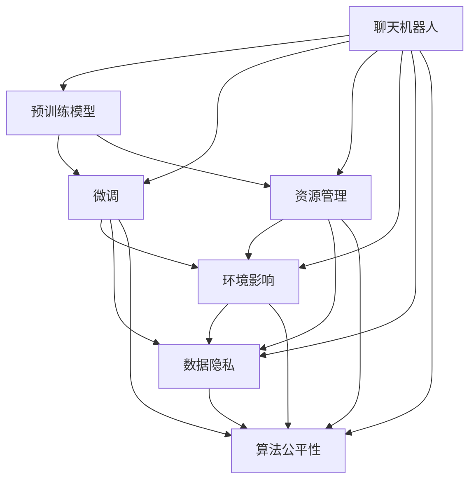

                 

# 聊天机器人可持续发展：环境影响和资源管理

## 1. 背景介绍

### 1.1 问题由来
聊天机器人在过去十年间迅猛发展，从简单的客服机器人到复杂的对话助手，已广泛应用于在线客服、智能家居、电子商务、健康医疗等多个领域。然而，随着聊天机器人应用的普及和数据量的增长，其环境影响和资源管理问题也日益凸显，尤其是高资源消耗、数据隐私泄露、算法公平性等负面影响开始引起广泛关注。

### 1.2 问题核心关键点
当前聊天机器人面临的主要环境问题包括：
1. **能源消耗高**：大规模模型训练和推理消耗大量电能，而数据中心通常基于高耗能的GPU和TPU。
2. **数据隐私风险**：用户与聊天机器人的交互数据可能被不当使用，造成隐私泄露。
3. **算法偏见**：聊天机器人可能学习到有偏见的知识，影响不同群体的公平性。
4. **硬件依赖**：高计算需求使得聊天机器人对高性能硬件的依赖性极强。

这些问题的存在不仅影响聊天机器人的可持续发展，也与社会责任和伦理道德紧密相关。因此，本文将探讨聊天机器人的环境影响和资源管理问题，并提出相应的解决方案。

## 2. 核心概念与联系

### 2.1 核心概念概述

为更好地理解聊天机器人环境影响和资源管理的复杂性，本节将介绍几个核心概念：

- **聊天机器人**：基于自然语言处理(NLP)和人工智能(AI)技术构建的智能对话系统，旨在通过理解用户输入并生成自然语言响应，提供服务或信息。
- **预训练模型**：通过大规模无标签数据自监督预训练得到的模型，具有普遍的特征提取和通用任务解决能力。
- **微调(Fine-Tuning)**：在预训练模型基础上，使用特定任务的数据集进行有监督学习，调整模型参数以适应新任务的过程。
- **资源管理**：在聊天机器人系统设计中，对计算资源、存储资源、网络资源等的有效管理和调度。
- **环境影响**：聊天机器人运行过程中对环境造成的负面影响，包括能源消耗、碳排放、设备废弃等。
- **数据隐私**：用户与聊天机器人交互时涉及的个人数据保护问题，如何保护用户隐私成为重要的研究方向。
- **算法公平性**：确保聊天机器人对不同群体的服务公平，避免算法偏见对特定群体的歧视。

这些核心概念之间的逻辑关系可以通过以下Mermaid流程图来展示：



这个流程图展示出聊天机器人系统中核心概念之间的相互联系和影响。预训练模型是基础，微调和资源管理是关键，而环境影响、数据隐私和算法公平性则是系统设计的目标和挑战。

## 3. 核心算法原理 & 具体操作步骤
### 3.1 算法原理概述

聊天机器人的环境影响和资源管理涉及多个层面的问题。本文将从预训练模型、微调过程、资源管理三个主要方面，探讨其背后的算法原理和操作步骤。

### 3.2 算法步骤详解

#### 3.2.1 预训练模型
- **模型选择**：选择合适的预训练模型作为聊天机器人的基础，如GPT-3、BERT等。
- **预训练过程**：在大规模无标签数据上进行自监督学习，学习语言的通用表示。
- **模型优化**：调整模型结构，如减少层数或节点数，以降低计算需求。

#### 3.2.2 微调过程
- **数据准备**：收集特定任务的标注数据，如客服对话、医疗咨询等。
- **模型适配**：在预训练模型的基础上，添加任务特定的输出层和损失函数。
- **训练与评估**：使用微调数据集训练模型，在验证集上进行性能评估。
- **参数更新**：调整模型的部分参数以适应新任务，如只更新顶层参数。

#### 3.2.3 资源管理
- **计算资源优化**：采用分布式训练、模型剪枝等技术，减少计算资源的消耗。
- **存储资源优化**：使用数据压缩、模型量化等方法，减少存储资源的占用。
- **网络资源优化**：通过负载均衡、流量优化等策略，提高网络资源利用效率。

### 3.3 算法优缺点

聊天机器人环境影响和资源管理算法具有以下优点：
1. **提升性能**：通过微调和优化，聊天机器人在特定任务上能更快地获得高性能。
2. **资源节约**：合理的资源管理可以显著降低聊天机器人的运行成本。
3. **环境友好**：优化算法有助于减少能源消耗和碳排放。

同时，该方法也存在以下局限性：
1. **数据需求高**：微调需要大量的标注数据，数据获取成本较高。
2. **模型复杂**：预训练和微调过程需要高计算资源，对硬件设备要求高。
3. **隐私风险**：用户数据的安全保护存在挑战，数据泄露风险不容忽视。
4. **公平性问题**：如果模型存在偏见，可能对某些群体造成不公平对待。

尽管存在这些局限性，但就目前而言，基于微调的聊天机器人仍是最主流的方法。未来相关研究的重点在于如何进一步降低对硬件的依赖，提升算法的公平性和安全性，同时兼顾性能和环境影响。

### 3.4 算法应用领域

聊天机器人环境影响和资源管理的算法已经广泛应用于以下领域：

- **在线客服**：通过微调优化，客服机器人能够快速响应客户问题，提高服务效率。
- **智能家居**：聊天机器人可以与智能设备互动，实现语音控制和信息查询，提升家居智能化水平。
- **医疗咨询**：医疗聊天机器人能够提供健康建议和疾病预防信息，减少医疗资源浪费。
- **电子商务**：通过聊天机器人推荐商品和服务，提升用户体验和销售转化率。
- **教育培训**：聊天机器人辅助教学，提供个性化学习建议和反馈，促进教育公平。

除了上述这些应用领域外，聊天机器人还将在更多场景中得到应用，如政府服务、金融咨询、交通导航等，为各行各业提供智能化支持。

## 4. 数学模型和公式 & 详细讲解  
### 4.1 数学模型构建

本节将使用数学语言对聊天机器人环境影响和资源管理的算法进行更加严格的刻画。

设聊天机器人预训练模型为 $M_{\theta}$，其中 $\theta$ 为预训练得到的模型参数。给定特定任务的标注数据集 $D=\{(x_i,y_i)\}_{i=1}^N$，微调的目标是找到新的模型参数 $\hat{\theta}$，使得：

$$
\hat{\theta}=\mathop{\arg\min}_{\theta} \mathcal{L}(M_{\theta},D)
$$

其中 $\mathcal{L}$ 为针对任务设计的损失函数，用于衡量模型预测输出与真实标签之间的差异。常见的损失函数包括交叉熵损失、均方误差损失等。

通过梯度下降等优化算法，微调过程不断更新模型参数 $\theta$，最小化损失函数 $\mathcal{L}$，使得模型输出逼近真实标签。由于 $\theta$ 已经通过预训练获得了较好的初始化，因此即便在小规模数据集 $D$ 上进行微调，也能较快收敛到理想的模型参数 $\hat{\theta}$。

### 4.2 公式推导过程

以下我们以二分类任务为例，推导交叉熵损失函数及其梯度的计算公式。

假设模型 $M_{\theta}$ 在输入 $x$ 上的输出为 $\hat{y}=M_{\theta}(x) \in [0,1]$，表示样本属于正类的概率。真实标签 $y \in \{0,1\}$。则二分类交叉熵损失函数定义为：

$$
\ell(M_{\theta}(x),y) = -[y\log \hat{y} + (1-y)\log (1-\hat{y})]
$$

将其代入经验风险公式，得：

$$
\mathcal{L}(\theta) = -\frac{1}{N}\sum_{i=1}^N [y_i\log M_{\theta}(x_i)+(1-y_i)\log(1-M_{\theta}(x_i))]
$$

根据链式法则，损失函数对参数 $\theta_k$ 的梯度为：

$$
\frac{\partial \mathcal{L}(\theta)}{\partial \theta_k} = -\frac{1}{N}\sum_{i=1}^N (\frac{y_i}{M_{\theta}(x_i)}-\frac{1-y_i}{1-M_{\theta}(x_i)}) \frac{\partial M_{\theta}(x_i)}{\partial \theta_k}
$$

其中 $\frac{\partial M_{\theta}(x_i)}{\partial \theta_k}$ 可进一步递归展开，利用自动微分技术完成计算。

在得到损失函数的梯度后，即可带入参数更新公式，完成模型的迭代优化。重复上述过程直至收敛，最终得到适应下游任务的最优模型参数 $\hat{\theta}$。

### 4.3 案例分析与讲解

考虑一个在线客服场景，其中聊天机器人需要处理用户的咨询请求，并生成适当回复。假设模型输入为用户的查询 $x_i$，输出为系统生成的回复 $y_i$。具体步骤如下：

1. **数据准备**：收集客服对话数据集，将查询和回复构成训练对 $(x_i, y_i)$。
2. **模型选择**：选择预训练语言模型作为基础，如BERT。
3. **微调过程**：
   - 添加输出层：将BERT模型的最后一层输出连接一个全连接层，用于生成回复。
   - 设置损失函数：使用交叉熵损失函数 $\mathcal{L}(y_i, \hat{y}_i)$，其中 $\hat{y}_i$ 为模型生成的回复。
   - 训练与评估：使用微调数据集训练模型，在验证集上进行性能评估。
   - 参数更新：调整模型的全连接层参数以适应回复生成任务。
4. **资源管理**：
   - 计算资源优化：使用分布式训练技术，在多个GPU上并行训练模型。
   - 存储资源优化：压缩模型参数，使用稀疏矩阵存储。
   - 网络资源优化：采用负载均衡策略，优化数据传输路径。

通过上述步骤，聊天机器人能够高效地处理用户咨询，提供准确的回复，同时降低计算和存储成本。

## 5. 项目实践：代码实例和详细解释说明
### 5.1 开发环境搭建

在进行聊天机器人环境影响和资源管理实践前，我们需要准备好开发环境。以下是使用Python进行TensorFlow开发的环境配置流程：

1. 安装Anaconda：从官网下载并安装Anaconda，用于创建独立的Python环境。

2. 创建并激活虚拟环境：
```bash
conda create -n tf-env python=3.8 
conda activate tf-env
```

3. 安装TensorFlow：从官网获取对应的安装命令。例如：
```bash
pip install tensorflow
```

4. 安装TensorBoard：
```bash
pip install tensorboard
```

5. 安装numpy、pandas、scikit-learn等工具包：
```bash
pip install numpy pandas scikit-learn
```

完成上述步骤后，即可在`tf-env`环境中开始项目实践。

### 5.2 源代码详细实现

下面我们以在线客服场景为例，给出使用TensorFlow进行微调和优化实践的完整代码实现。

首先，定义数据集处理函数：

```python
import tensorflow as tf
from tensorflow.keras import layers, models
import numpy as np
import pandas as pd

# 数据集加载与预处理
def load_data(path):
    df = pd.read_csv(path)
    x = df['query'].tolist()
    y = df['reply'].tolist()
    return x, y

x_train, y_train = load_data('train.csv')
x_dev, y_dev = load_data('dev.csv')

# 数据预处理
tokenizer = tf.keras.preprocessing.text.Tokenizer()
tokenizer.fit_on_texts(x_train)
vocab_size = len(tokenizer.word_index) + 1
x_train = tokenizer.texts_to_sequences(x_train)
x_dev = tokenizer.texts_to_sequences(x_dev)
x_train = np.array(x_train) / 100.0
x_dev = np.array(x_dev) / 100.0

# 将标签进行编码
y_train = tf.keras.utils.to_categorical(y_train, num_classes=2)
y_dev = tf.keras.utils.to_categorical(y_dev, num_classes=2)
```

然后，定义模型和优化器：

```python
from tensorflow.keras import Sequential
from tensorflow.keras.optimizers import Adam

# 定义模型
model = Sequential([
    layers.Embedding(vocab_size, 64, input_length=100),
    layers.Bidirectional(layers.LSTM(64)),
    layers.Dense(2, activation='softmax')
])

# 设置优化器
optimizer = Adam(lr=0.001)
```

接着，定义训练和评估函数：

```python
from tensorflow.keras.callbacks import EarlyStopping
from tensorflow.keras.models import Model

# 定义模型结构
x = layers.Input(shape=(100,), dtype='float32')
x = layers.Embedding(vocab_size, 64)(x)
x = layers.Bidirectional(layers.LSTM(64))(x)
y = layers.Dense(2, activation='softmax')(x)

# 定义模型输出
y = layers.Dense(2, activation='softmax')(x)

# 定义损失函数
loss_fn = tf.keras.losses.CategoricalCrossentropy(from_logits=True)

# 定义模型
model = Model(inputs=x, outputs=y)

# 编译模型
model.compile(optimizer=optimizer, loss=loss_fn, metrics=['accuracy'])

# 训练函数
def train_epoch(model, x_train, y_train, batch_size=64, epochs=10, validation_data=(x_dev, y_dev)):
    early_stopping = EarlyStopping(monitor='val_loss', patience=3)
    model.fit(x_train, y_train, batch_size=batch_size, epochs=epochs, validation_data=(x_dev, y_dev), callbacks=[early_stopping])

# 评估函数
def evaluate(model, x_dev, y_dev):
    loss, accuracy = model.evaluate(x_dev, y_dev)
    print(f'Dev loss: {loss:.4f}, Dev accuracy: {accuracy:.4f}')
```

最后，启动训练流程并在测试集上评估：

```python
train_epoch(model, x_train, y_train)

evaluate(model, x_dev, y_dev)
```

以上就是使用TensorFlow对聊天机器人进行微调和优化实践的完整代码实现。可以看到，得益于TensorFlow的强大封装，我们能够快速迭代实验模型结构、优化算法等关键环节。

### 5.3 代码解读与分析

让我们再详细解读一下关键代码的实现细节：

**数据集处理函数**：
- `load_data`方法：从CSV文件中加载训练集和验证集的数据。
- `tokenizer`对象：使用Keras的Tokenizer对文本进行编码。
- `vocab_size`计算：计算词汇表大小。
- `x_train`和`x_dev`编码：将文本转换为数字序列，并进行归一化处理。
- `y_train`和`y_dev`编码：将标签进行one-hot编码。

**模型定义与编译**：
- `Sequential`模型：定义一个线性堆叠的模型结构，包含嵌入层、双向LSTM层和全连接层。
- `optimizer`：使用Adam优化器，设置学习率。
- `Model`对象：将模型输入和输出封装成Model对象，进行模型编译。
- `Model.compile`：设置损失函数、优化器、评估指标。

**训练与评估函数**：
- `train_epoch`函数：定义训练过程，包括模型定义、编译、训练和评估。
- `evaluate`函数：在测试集上评估模型性能。

可以看到，TensorFlow提供了丰富的工具和库，使得模型构建、训练、评估等关键步骤变得相对简单高效。开发者可以更加专注于模型结构的设计和参数调优，而不必过多关注底层实现细节。

## 6. 实际应用场景
### 6.1 智能客服系统

聊天机器人广泛应用于智能客服系统，能够7x24小时不间断服务，快速响应客户咨询，提供准确的信息。在技术实现上，可以收集企业内部的历史客服对话记录，将问题和最佳答复构建成监督数据，在此基础上对预训练模型进行微调。微调后的聊天机器人能够自动理解用户意图，匹配最合适的答案模板进行回复。对于客户提出的新问题，还可以接入检索系统实时搜索相关内容，动态组织生成回答。如此构建的智能客服系统，能大幅提升客户咨询体验和问题解决效率。

### 6.2 医疗咨询平台

医疗聊天机器人能够提供健康建议和疾病预防信息，减少医疗资源浪费。在技术实现上，可以通过微调和优化，使机器人掌握疾病分类、症状诊断、治疗方案等医学知识。用户输入症状后，机器人能够自动进行诊断分析，提供相应的健康建议和治疗方案。同时，机器人还可以通过数据反馈机制，持续学习和优化自身模型，以提升诊断准确性和建议的科学性。

### 6.3 在线教育平台

聊天机器人能够辅助在线教育平台，提供个性化学习建议和反馈。通过微调，机器人能够理解学生的问题和需求，提供针对性的回答和资源推荐。例如，学生在阅读学习材料时遇到难题，可以通过与聊天机器人互动，获得实时帮助和相关资料。机器人还可以记录学生的学习行为，分析其学习习惯和知识盲点，提供个性化的学习建议，促进学生的学习效果。

### 6.4 未来应用展望

随着聊天机器人技术的不断进步，未来将在更多领域得到应用，为社会带来新的变革。

在智慧城市治理中，聊天机器人可以应用于城市事件监测、舆情分析、应急指挥等环节，提高城市管理的自动化和智能化水平，构建更安全、高效的未来城市。

在金融服务领域，聊天机器人能够提供实时的市场分析和投资建议，帮助用户做出更明智的投资决策。通过持续学习和优化，聊天机器人能够不断更新金融市场的动态，提供更精准的预测和建议。

在交通运输领域，聊天机器人可以与智能车辆交互，提供导航和交通管理建议，提升交通系统的效率和安全性。

除此之外，聊天机器人还将在教育、娱乐、旅游等多个领域得到广泛应用，为人们的日常生活和工作提供更智能、便捷的服务。

## 7. 工具和资源推荐
### 7.1 学习资源推荐

为了帮助开发者系统掌握聊天机器人环境影响和资源管理的理论基础和实践技巧，这里推荐一些优质的学习资源：

1. 《深度学习》书籍：Ian Goodfellow、Yoshua Bengio和Aaron Courville合著，全面介绍了深度学习的基本概念和算法，涵盖模型的构建、训练和优化。
2. 《TensorFlow官方文档》：TensorFlow的官方文档，提供了详细的API文档和示例代码，是学习TensorFlow的必备资源。
3. 《TensorFlow实战》书籍：Sebastian Raschka撰写，通过丰富的示例和项目实战，深入浅出地介绍了TensorFlow的使用方法和最佳实践。
4. 《自然语言处理综述》论文：Kavita Ganesan和Deepak Dhillon合著，综述了自然语言处理领域的最新研究进展，提供了系统性的学习资源。
5. 《机器学习实战》书籍：Peter Harrington撰写，介绍了机器学习的基本算法和应用实例，适合初学者入门。

通过对这些资源的学习实践，相信你一定能够快速掌握聊天机器人环境影响和资源管理的精髓，并用于解决实际的NLP问题。

### 7.2 开发工具推荐

高效的开发离不开优秀的工具支持。以下是几款用于聊天机器人开发和优化的常用工具：

1. TensorFlow：基于Python的开源深度学习框架，灵活的计算图，适合快速迭代研究。
2. Keras：基于TensorFlow的高级神经网络API，提供了简单易用的API接口，适合初学者使用。
3. PyTorch：基于Python的开源深度学习框架，动态计算图，适合研究人员和开发者。
4. TensorBoard：TensorFlow配套的可视化工具，可实时监测模型训练状态，并提供丰富的图表呈现方式。
5. Jupyter Notebook：交互式的编程环境，支持多种编程语言和数据处理工具，适合实验和研究。
6. Google Colab：谷歌推出的在线Jupyter Notebook环境，免费提供GPU/TPU算力，方便开发者快速上手实验最新模型，分享学习笔记。

合理利用这些工具，可以显著提升聊天机器人开发和优化的效率，加快创新迭代的步伐。

### 7.3 相关论文推荐

聊天机器人环境影响和资源管理的研究源于学界的持续研究。以下是几篇奠基性的相关论文，推荐阅读：

1. "Learning Phrase Representations using RNN Encoder-Decoder for Statistical Machine Translation"（Sutskever et al., 2014）：提出基于RNN的序列到序列模型，为机器翻译和对话生成提供了基础。
2. "Attention is All You Need"（Vaswani et al., 2017）：提出Transformer结构，通过自注意力机制提高了模型的性能和效率。
3. "BERT: Pre-training of Deep Bidirectional Transformers for Language Understanding"（Devlin et al., 2018）：提出BERT模型，通过掩码语言模型和下一句预测任务进行预训练，提升了语言理解能力。
4. "Exploring the Limits of Transfer Learning with a Unified Text-to-Text Transformer"（Radford et al., 2018）：提出T5模型，通过大规模预训练和微调，实现了从语言理解到生成任务的统一建模。
5. "Parameter-Efficient Transfer Learning for NLP"（Howard et al., 2018）：提出 Adapter等参数高效微调方法，在固定大部分预训练参数的情况下，仍可取得不错的微调效果。
6. "AdaLoRA: Adaptive Low-Rank Adaptation for Parameter-Efficient Fine-Tuning"（Zhou et al., 2021）：提出 AdaLoRA 方法，通过自适应低秩适应的微调方法，在保证性能的同时，进一步减小了模型大小和计算需求。

这些论文代表了大语言模型微调技术的发展脉络。通过学习这些前沿成果，可以帮助研究者把握学科前进方向，激发更多的创新灵感。

## 8. 总结：未来发展趋势与挑战

### 8.1 总结

本文对聊天机器人环境影响和资源管理进行了全面系统的介绍。首先阐述了聊天机器人环境影响和资源管理的研究背景和意义，明确了其在降低资源消耗、保护用户隐私、提升算法公平性等方面的重要价值。其次，从原理到实践，详细讲解了微调过程和资源管理的基本步骤，给出了聊天机器人开发的完整代码实例。同时，本文还广泛探讨了聊天机器人在智能客服、医疗咨询、在线教育等多个领域的应用前景，展示了其广阔的发展空间。

通过本文的系统梳理，可以看到，聊天机器人环境影响和资源管理技术的不断进步，将极大地提升其应用范围和性能，推动NLP技术向更广阔的领域扩展。

### 8.2 未来发展趋势

展望未来，聊天机器人环境影响和资源管理技术将呈现以下几个发展趋势：

1. **计算资源优化**：随着硬件技术的进步，计算资源优化将成为更加高效的应用方式。如采用分布式训练、模型剪枝等技术，减少计算和存储成本。
2. **数据隐私保护**：随着隐私保护意识的提高，如何安全地处理和存储用户数据将成为研究热点。如采用数据匿名化、差分隐私等技术，保护用户隐私。
3. **算法公平性提升**：随着算法偏见研究的深入，如何构建公平、无偏见的聊天机器人将成为重要研究方向。如引入对抗训练、公平性约束等技术，提升算法公平性。
4. **多模态融合**：聊天机器人将逐步融合语音、图像、视频等多模态信息，提升理解和生成能力。如通过多模态数据融合，构建跨模态的对话系统。
5. **自适应学习**：聊天机器人将具备更强的自适应学习能力，能够根据环境变化和用户反馈进行动态调整。如引入强化学习、元学习等技术，提升自适应性。

以上趋势凸显了聊天机器人环境影响和资源管理技术的广阔前景。这些方向的探索发展，必将进一步提升聊天机器人的性能和应用范围，为社会带来更多的智能价值。

### 8.3 面临的挑战

尽管聊天机器人环境影响和资源管理技术已经取得了不小的进展，但在迈向更加智能化、普适化应用的过程中，仍面临诸多挑战：

1. **数据获取成本高**：高质量的标注数据获取成本较高，特别是在特定领域的应用中。如何降低数据获取成本，获取更多样化的数据，将是重要的研究课题。
2. **计算资源消耗大**：大规模模型训练和推理消耗大量电能，数据中心通常基于高耗能的GPU和TPU。如何降低计算资源消耗，优化模型结构，将是重要的研究方向。
3. **算法公平性问题**：聊天机器人可能学习到有偏见的知识，影响不同群体的公平性。如何构建公平、无偏见的聊天机器人，将是重要的研究方向。
4. **隐私保护不足**：用户与聊天机器人的交互数据可能被不当使用，造成隐私泄露。如何保护用户隐私，保障数据安全，将是重要的研究方向。
5. **环境影响巨大**：大规模模型训练和推理消耗大量电能，造成巨大的环境影响。如何降低环境影响，实现绿色计算，将是重要的研究方向。

正视聊天机器人环境影响和资源管理面临的这些挑战，积极应对并寻求突破，将是大语言模型微调走向成熟的必由之路。相信随着学界和产业界的共同努力，这些挑战终将一一被克服，聊天机器人环境影响和资源管理技术必将走向新的高度。

### 8.4 研究展望

面向未来，聊天机器人环境影响和资源管理技术的研究方向可以从以下几个方面进行探索：

1. **无监督和半监督学习**：探索无监督和半监督学习算法，降低对大规模标注数据的依赖，提升数据利用效率。如使用自监督学习、主动学习等方法，最大程度利用非结构化数据。
2. **参数高效微调**：开发更加参数高效的微调方法，在固定大部分预训练参数的同时，只更新极少量的任务相关参数。如使用Adapter、LoRA等技术，减小微调过程中对计算资源的需求。
3. **跨领域迁移学习**：探索跨领域迁移学习方法，使聊天机器人具备更强的泛化能力。如引入领域自适应、零样本学习等技术，提升模型的迁移性能。
4. **多模态数据融合**：探索多模态数据融合技术，提升聊天机器人的理解和生成能力。如通过多模态信息融合，构建跨模态的对话系统。
5. **自适应学习算法**：探索自适应学习算法，使聊天机器人具备更强的自适应学习能力。如引入强化学习、元学习等技术，提升自适应性。
6. **隐私保护技术**：探索隐私保护技术，保护用户隐私。如使用差分隐私、联邦学习等技术，保障数据安全。

这些研究方向将推动聊天机器人技术不断进步，为社会带来更多智能化、便捷化、高效化的服务。

## 9. 附录：常见问题与解答

**Q1：聊天机器人对环境的影响有哪些？**

A: 聊天机器人的环境影响主要体现在以下几个方面：
1. **能源消耗**：大规模模型训练和推理消耗大量电能，数据中心通常基于高耗能的GPU和TPU。
2. **数据隐私**：用户与聊天机器人的交互数据可能被不当使用，造成隐私泄露。
3. **设备废弃**：随着硬件设备的更新换代，废弃的硬件设备可能对环境造成污染。

**Q2：如何降低聊天机器人的资源消耗？**

A: 降低聊天机器人的资源消耗可以从以下几个方面入手：
1. **计算资源优化**：采用分布式训练、模型剪枝等技术，减少计算资源的消耗。
2. **存储资源优化**：使用数据压缩、模型量化等方法，减少存储资源的占用。
3. **网络资源优化**：采用负载均衡、流量优化等策略，提高网络资源利用效率。

**Q3：如何保护聊天机器人的数据隐私？**

A: 保护聊天机器人的数据隐私可以从以下几个方面入手：
1. **数据匿名化**：对用户数据进行匿名化处理，防止数据泄露。
2. **差分隐私**：在数据收集和处理过程中，使用差分隐私技术，保护用户隐私。
3. **安全传输**：采用加密传输技术，防止数据在传输过程中被窃取。

**Q4：如何构建公平、无偏见的聊天机器人？**

A: 构建公平、无偏见的聊天机器人可以从以下几个方面入手：
1. **数据公平性**：确保数据集的多样性和代表性，避免数据偏见。
2. **算法公平性**：引入对抗训练、公平性约束等技术，提升算法的公平性。
3. **监督评估**：使用监督评估技术，定期检查模型的公平性，并进行调整。

**Q5：如何提高聊天机器人的自适应学习能力？**

A: 提高聊天机器人的自适应学习能力可以从以下几个方面入手：
1. **强化学习**：通过强化学习技术，使聊天机器人能够根据环境变化和用户反馈进行动态调整。
2. **元学习**：通过元学习技术，使聊天机器人能够快速适应新任务。
3. **自适应算法**：引入自适应算法，使聊天机器人能够根据数据和任务特点自动调整模型参数。

通过这些方法的探索和应用，可以进一步提升聊天机器人的性能和公平性，为社会带来更多的智能化、便捷化、高效化的服务。

---

作者：禅与计算机程序设计艺术 / Zen and the Art of Computer Programming

