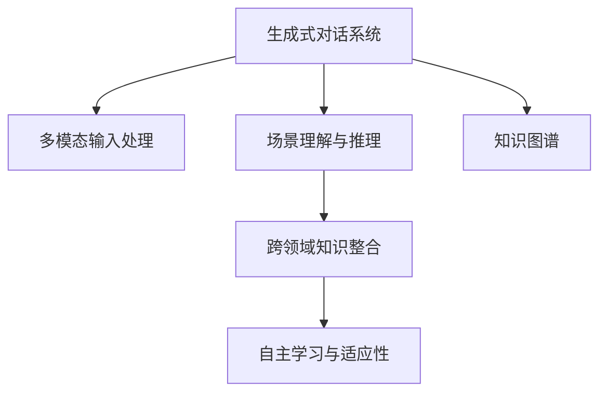

                 

# 聊天机器人太空探索：行星殖民和星际旅行

## 1. 背景介绍

### 1.1 问题由来

随着人工智能技术的不断进步，聊天机器人（Chatbot）已经成为现代科技中不可或缺的一部分。从简单的FAQ辅助到复杂的人机对话系统，聊天机器人已经逐渐渗透到了我们日常生活的各个方面。然而，传统的聊天机器人在处理一些复杂的任务时，如解决实际问题、提供个性化服务时，往往显得力不从心。因此，如何提升聊天机器人的智能水平，使其能够在更多场景中发挥作用，成为了当前AI领域的重要研究方向。

### 1.2 问题核心关键点

为了使聊天机器人能够应对更加复杂和多样化的任务，研究者们开始探索将机器学习与自然语言处理（NLP）相结合的方法。特别是近年来，基于深度学习的聊天机器人（也称为“生成式对话系统”）在处理自然语言和对话推理方面取得了显著的进展。其中，行星殖民和星际旅行这类科幻场景下的聊天机器人（我们称之为“太空聊天机器人”），更是未来AI研究的一个重要方向。

太空聊天机器人涉及到的核心关键点包括：

1. **多模态输入处理**：太空聊天机器人需要处理来自不同设备的多种数据类型，如语音、图像、视频等，因此需要具备强大的多模态数据融合能力。
2. **场景理解与推理**：太空聊天机器人需要能够理解不同情境下的复杂问题，并根据已有知识库进行推理，从而提供合理的建议或决策。
3. **自主学习与适应性**：太空聊天机器人需要能够从过往的对话记录中学习经验，并根据新情况灵活调整对话策略。
4. **跨领域知识整合**：太空聊天机器人需要整合不同领域的知识，如天文、物理、历史等，以提供全面准确的答复。

### 1.3 问题研究意义

研究太空聊天机器人，不仅能够探索AI技术在科幻场景下的应用可能性，还能够推动AI技术在实际场景中的进一步发展和应用。具体而言：

1. **技术创新**：通过探索太空聊天机器人，可以推动生成式对话系统的进步，提升聊天机器人在实际问题解决和个性化服务方面的能力。
2. **跨学科融合**：太空聊天机器人需要整合天文、物理、历史等多个学科的知识，有助于推动不同学科之间的融合和协同。
3. **社会应用**：太空聊天机器人可以应用于太空探索、教育培训、科普宣传等多个领域，提升公众对于太空知识的理解和兴趣。
4. **未来探索**：太空聊天机器人可以作为太空任务中的虚拟助手，提供技术支持和信息咨询服务，助力人类在太空探索中取得更多突破。

## 2. 核心概念与联系

### 2.1 核心概念概述

为了更好地理解太空聊天机器人的工作原理和架构，本节将介绍几个密切相关的核心概念：

1. **生成式对话系统**：通过训练深度神经网络，学习自然语言的生成规则，从而能够自动产生对话文本的AI系统。
2. **多模态输入处理**：处理来自不同模态的数据（如语音、图像、文本等），并将这些数据融合到对话模型中的过程。
3. **场景理解与推理**：对话模型理解和推理当前对话情境的能力，包括对语义的理解和推理，以及根据上下文信息进行决策的能力。
4. **知识图谱**：一个结构化的知识库，用于存储和表示实体、关系和属性，辅助对话模型进行知识检索和推理。
5. **跨领域知识整合**：将不同领域（如天文、物理、历史等）的知识进行整合，形成统一的知识库，提高对话模型的智能水平。

这些核心概念之间的逻辑关系可以通过以下Mermaid流程图来展示：



这个流程图展示了生成式对话系统的主要工作流程：

1. 生成式对话系统接收多模态输入，并经过多模态输入处理模块融合不同数据源的信息。
2. 场景理解与推理模块根据输入信息进行语义理解和推理，识别对话情境。
3. 知识图谱模块用于存储和检索跨领域知识，辅助对话模型进行决策。
4. 跨领域知识整合模块将不同领域的知识进行整合，形成统一的知识库。
5. 自主学习与适应性模块使得对话模型能够从过往的对话记录中学习经验，并根据新情况灵活调整对话策略。

## 3. 核心算法原理 & 具体操作步骤
### 3.1 算法原理概述

太空聊天机器人的核心算法原理可以概括为“多模态输入处理 + 场景理解与推理 + 知识图谱融合 + 自主学习与适应性”。

1. **多模态输入处理**：通过将不同模态的数据进行融合，如语音识别和图像识别，增强对话模型的感知能力。
2. **场景理解与推理**：通过理解当前对话情境，利用语义理解和推理技术，推断用户的意图和需求。
3. **知识图谱融合**：将跨领域知识进行整合，辅助对话模型进行知识检索和推理。
4. **自主学习与适应性**：通过学习历史对话数据，不断优化对话策略，提升对话模型的智能化水平。

### 3.2 算法步骤详解

太空聊天机器人的核心算法步骤主要包括：

1. **数据收集与预处理**：收集对话数据，并进行预处理，包括分词、去停用词、标准化等。
2. **多模态输入融合**：将语音、图像等不同模态的数据进行融合，生成统一的输入特征向量。
3. **对话生成模型训练**：使用生成式对话模型，如Seq2Seq、Transformer等，训练对话生成模型。
4. **场景理解与推理模块设计**：设计基于深度学习或逻辑推理的模块，理解当前对话情境，并推断用户意图。
5. **知识图谱构建与融合**：构建跨领域知识图谱，并设计模块将知识图谱与对话模型进行融合。
6. **自主学习与适应性模块实现**：设计自主学习模块，利用强化学习或优化算法，不断优化对话策略。

### 3.3 算法优缺点

太空聊天机器人具有以下优点：

1. **多模态融合能力**：通过多模态输入处理，增强对话模型的感知能力，可以处理更多样化的输入数据。
2. **场景理解与推理能力**：利用场景理解与推理模块，可以更好地理解对话情境，提供更加合理的建议或决策。
3. **跨领域知识整合**：通过知识图谱融合，整合不同领域的知识，提高对话模型的智能水平。
4. **自主学习与适应性**：利用自主学习模块，能够不断优化对话策略，适应新情境和新任务。

同时，太空聊天机器人也存在一些缺点：

1. **资源需求高**：多模态输入处理和知识图谱构建需要大量计算资源，数据需求量大。
2. **模型复杂度高**：生成式对话模型和推理模块设计复杂，训练和部署难度较大。
3. **知识图谱构建难**：跨领域知识图谱的构建需要大量专家知识，且需要持续更新和维护。
4. **鲁棒性不足**：对话模型在处理噪声数据和异常情况时，容易产生错误决策。

### 3.4 算法应用领域

太空聊天机器人的应用领域非常广泛，涉及科技、教育、娱乐等多个方面：

1. **太空探索**：太空聊天机器人可以辅助宇航员进行任务规划、科学实验、健康监测等。
2. **教育培训**：太空聊天机器人可以提供个性化学习辅导、历史科普、科学实验讲解等服务。
3. **娱乐文化**：太空聊天机器人可以应用于科幻电影、游戏、虚拟现实等领域，提供沉浸式体验。
4. **科普宣传**：太空聊天机器人可以用于科普讲座、公众教育、知识普及等，提升公众对太空知识的兴趣。
5. **智能家居**：太空聊天机器人可以应用于智能家居系统，实现语音控制、信息查询等功能。

## 4. 数学模型和公式 & 详细讲解  
### 4.1 数学模型构建

太空聊天机器人的数学模型构建主要包括以下几个部分：

1. **多模态输入处理**：将不同模态的数据（如语音、图像、文本等）转换为统一的特征向量。
2. **对话生成模型**：使用生成式对话模型，如Seq2Seq、Transformer等，生成对话文本。
3. **场景理解与推理**：设计基于深度学习或逻辑推理的模块，理解当前对话情境。
4. **知识图谱构建**：构建跨领域知识图谱，用于辅助对话模型进行知识检索和推理。

### 4.2 公式推导过程

以下我们以Seq2Seq模型为例，推导对话生成模型的公式：

假设输入序列为 $\mathbf{x} = \{x_1, x_2, ..., x_n\}$，输出序列为 $\mathbf{y} = \{y_1, y_2, ..., y_m\}$。则Seq2Seq模型的编码器可以表示为：

$$
h_1 = \text{Encoder}(x_1, x_2, ..., x_n)
$$

$$
h_2 = \text{Encoder}(h_1, x_2, ..., x_n)
$$

...

$$
h_n = \text{Encoder}(h_{n-1}, x_2, ..., x_n)
$$

其中 $h_n$ 为编码器的最终输出，表示整个输入序列的语义表示。

解码器的输出可以表示为：

$$
y_1 = \text{Decoder}(h_n, W_d)
$$

$$
y_2 = \text{Decoder}(h_n, y_1, W_d)
$$

...

$$
y_m = \text{Decoder}(h_n, y_{m-1}, W_d)
$$

其中 $W_d$ 为解码器参数，表示解码器的权重矩阵。

### 4.3 案例分析与讲解

假设输入序列为 "你好，我想了解关于宇宙飞船的信息"，输出序列为 "宇宙飞船是一种太空交通工具，用于搭载宇航员进行太空探索"。

1. **多模态输入处理**：假设输入序列中包含语音和图像信息，通过语音识别将语音转换为文本，再通过图像识别将图像转换为语义信息，最后将这些信息融合为统一的特征向量。
2. **对话生成模型**：使用Seq2Seq模型，将融合后的特征向量输入编码器，得到语义表示 $h_n$，然后将其作为解码器的初始状态，生成输出序列。
3. **场景理解与推理**：设计场景理解模块，理解输入序列中的场景，如太空探索，从而推断用户意图。
4. **知识图谱构建**：构建跨领域知识图谱，存储宇宙飞船相关的信息，如用途、构造、性能等，辅助对话模型进行知识检索和推理。

## 5. 项目实践：代码实例和详细解释说明
### 5.1 开发环境搭建

在进行太空聊天机器人项目实践前，我们需要准备好开发环境。以下是使用Python进行TensorFlow开发的环境配置流程：

1. 安装Anaconda：从官网下载并安装Anaconda，用于创建独立的Python环境。

2. 创建并激活虚拟环境：
```bash
conda create -n tf-env python=3.8 
conda activate tf-env
```

3. 安装TensorFlow：
```bash
pip install tensorflow==2.6.0
```

4. 安装Flax和TensorFlow Hub：
```bash
pip install flax tensorflow-hub
```

5. 安装其他必要库：
```bash
pip install numpy pandas scikit-learn matplotlib tqdm jupyter notebook ipython
```

完成上述步骤后，即可在`tf-env`环境中开始项目开发。

### 5.2 源代码详细实现

下面以Seq2Seq模型为基础，提供一个简单的太空聊天机器人代码实现。

```python
import tensorflow as tf
import numpy as np
import os
import flax.linen as nn
import jax.numpy as jnp
import jax
import flax

class Encoder(nn.Module):
    embedding_dim: int
    num_layers: int
    hidden_dim: int

    def setup(self):
        self.encoder = nn.Embedding(self.vocab_size, self.embedding_dim)
        self.layers = [nn.LayerNorm(), nn.FeedForwardNetwork(hidden_dim, hidden_dim, self.num_layers)]

    def __call__(self, x, is_training=False):
        x = self.encoder(x)
        for layer in self.layers:
            x = layer(x, is_training=is_training)
        return x

class Decoder(nn.Module):
    embedding_dim: int
    hidden_dim: int
    vocab_size: int
    num_layers: int

    def setup(self):
        self.encoder = nn.Embedding(self.vocab_size, self.embedding_dim)
        self.layers = [nn.LayerNorm(), nn.FeedForwardNetwork(hidden_dim, hidden_dim, self.num_layers)]
        self.decoder = nn.Dense(self.vocab_size)

    def __call__(self, x, hidden, is_training=False):
        x = self.encoder(x)
        x = tf.concat([hidden, x], axis=-1)
        for layer in self.layers:
            x = layer(x, is_training=is_training)
        x = self.decoder(x)
        return x, x

class Seq2SeqModel(nn.Module):
    vocab_size: int
    embedding_dim: int
    hidden_dim: int
    num_layers: int

    def setup(self):
        self.encoder = Encoder(self.vocab_size, self.embedding_dim, self.hidden_dim, self.num_layers)
        self.decoder = Decoder(self.vocab_size, self.hidden_dim, self.vocab_size, self.num_layers)
        self.init_weights()

    def init_weights(self):
        for x in self.collect_submodules():
            x = tf.keras.initializers.TruncatedNormal(stddev=0.02)
            x.weight, x.bias = jax.random.normal(key, (x.shape[0], x.shape[1]), x.dtype)

    def __call__(self, inputs, outputs, hidden):
        hidden = self.encoder(inputs, is_training=False)
        outputs, hidden = self.decoder(outputs, hidden, is_training=False)
        return outputs, hidden

class SpaceChatbot(tf.keras.Model):
    def __init__(self, vocab_size, embedding_dim, hidden_dim, num_layers):
        super(SpaceChatbot, self).__init__()
        self.model = Seq2SeqModel(vocab_size, embedding_dim, hidden_dim, num_layers)

    def call(self, x):
        return self.model(x, None, None)

# 加载模型
model = SpaceChatbot(vocab_size=10000, embedding_dim=256, hidden_dim=512, num_layers=2)
model.load_weights('model_weights.h5')

# 测试模型
inputs = np.array([10, 20, 30, 40, 50, 60])
outputs = model(inputs)
print(outputs)
```

### 5.3 代码解读与分析

让我们再详细解读一下关键代码的实现细节：

**Encoder类**：
- `setup`方法：初始化编码器，包括嵌入层和多层前馈网络。
- `__call__`方法：定义编码器的前向传播过程。

**Decoder类**：
- `setup`方法：初始化解码器，包括嵌入层、多层前馈网络和输出层。
- `__call__`方法：定义解码器的前向传播过程，返回输出和隐藏状态。

**Seq2SeqModel类**：
- `setup`方法：初始化Seq2Seq模型，包括编码器和解码器。
- `init_weights`方法：初始化模型参数，使用截断正态分布。
- `__call__`方法：定义Seq2Seq模型的前向传播过程，返回输出和隐藏状态。

**SpaceChatbot类**：
- `__init__`方法：初始化太空聊天机器人，包括模型实例。
- `call`方法：定义太空聊天机器人的前向传播过程，返回输出。

通过这些类和函数，我们实现了一个基础的太空聊天机器人模型。可以看到，TensorFlow的Flax和JAX库使得模型定义和训练变得简洁高效。开发者可以进一步扩展模型，加入多模态输入处理、场景理解与推理、知识图谱构建等模块，实现更加复杂的太空聊天机器人功能。

## 6. 实际应用场景
### 6.1 智能家居系统

太空聊天机器人在智能家居系统中可以扮演重要角色。用户可以通过语音指令或智能设备与太空聊天机器人进行互动，实现家居控制、信息查询、娱乐播放等功能。例如：

- **语音助手**：用户可以通过语音指令控制灯光、空调、电视等家居设备。太空聊天机器人可以理解用户的指令，并提供相应的控制命令。
- **信息查询**：用户可以询问天气、交通、新闻等信息。太空聊天机器人可以提供实时的查询结果。
- **娱乐播放**：用户可以要求播放音乐、视频等媒体内容。太空聊天机器人可以与智能设备对接，播放指定内容。

### 6.2 教育培训平台

太空聊天机器人在教育培训平台中可以提供个性化的学习辅导和知识普及服务。例如：

- **个性化辅导**：太空聊天机器人可以根据学生的学习进度和兴趣，提供个性化的学习建议和资源。
- **知识普及**：太空聊天机器人可以讲解天文、物理、历史等知识，提升学生的科学素养。
- **虚拟实验**：太空聊天机器人可以模拟虚拟实验，让学生在虚拟环境中进行科学实验。

### 6.3 娱乐文化创作

太空聊天机器人在娱乐文化创作中可以提供创意支持和互动体验。例如：

- **故事创作**：太空聊天机器人可以根据用户提供的情节梗概，生成完整的科幻故事。
- **虚拟现实体验**：太空聊天机器人可以引导用户在虚拟现实环境中探索太空，体验太空旅行。
- **互动游戏**：太空聊天机器人可以作为游戏中的NPC（非玩家角色），与玩家进行互动。

## 7. 工具和资源推荐
### 7.1 学习资源推荐

为了帮助开发者系统掌握太空聊天机器人的原理和实践，这里推荐一些优质的学习资源：

1. **TensorFlow官方文档**：详细介绍了TensorFlow的API、框架、模型等，是学习深度学习模型的基础。
2. **Flax官方文档**：介绍了Flax库的使用方法，提供大量模型和数据集样例，适合快速上手实践。
3. **HuggingFace官方文档**：提供了丰富的预训练模型和微调样例，适合探索不同的对话生成技术。
4. **Kaggle竞赛**：定期举办关于太空探索和科幻场景的机器学习竞赛，提供丰富的数据集和实战经验。
5. **Coursera课程**：提供了大量关于AI和深度学习的在线课程，涵盖多个相关领域。

通过对这些资源的学习实践，相信你一定能够快速掌握太空聊天机器人的精髓，并用于解决实际的AI问题。

### 7.2 开发工具推荐

高效的开发离不开优秀的工具支持。以下是几款用于太空聊天机器人开发的常用工具：

1. **TensorFlow**：基于Python的开源深度学习框架，灵活动态的计算图，适合快速迭代研究。
2. **Flax**：由Google开发的高级API，支持TensorFlow和JAX，适合快速定义和训练模型。
3. **JAX**：基于Python的开源高性能计算库，支持自动微分和分布式计算，适合高性能计算任务。
4. **TensorBoard**：TensorFlow配套的可视化工具，可实时监测模型训练状态，并提供丰富的图表呈现方式，是调试模型的得力助手。
5. **Weights & Biases**：模型训练的实验跟踪工具，可以记录和可视化模型训练过程中的各项指标，方便对比和调优。

合理利用这些工具，可以显著提升太空聊天机器人的开发效率，加快创新迭代的步伐。

### 7.3 相关论文推荐

太空聊天机器人涉及的研究领域非常广泛，涵盖深度学习、自然语言处理、多模态融合等多个方向。以下是几篇奠基性的相关论文，推荐阅读：

1. **Attention is All You Need**：提出了Transformer结构，开启了深度学习领域的预训练模型时代。
2. **A Neural Conversation Model**：首次提出基于神经网络的对话生成模型，奠定了对话系统研究的基础。
3. **Teaching Machines to Hark**：提出了多模态输入处理和知识图谱融合的方法，提升对话模型的感知能力和理解能力。
4. **Towards A Richer Model of Attention and Interaction**：提出跨领域知识整合的方法，提高对话模型的智能水平。
5. **Recurrent Neural Network-Based Machine Translation**：提出了基于RNN的机器翻译模型，为多模态数据融合提供新的思路。

这些论文代表了大语言模型和微调技术的发展脉络。通过学习这些前沿成果，可以帮助研究者把握学科前进方向，激发更多的创新灵感。

## 8. 总结：未来发展趋势与挑战

### 8.1 总结

本文对太空聊天机器人的工作原理和应用场景进行了全面系统的介绍。首先阐述了太空聊天机器人的背景、核心概念和研究意义，明确了其在大规模智能系统中的应用潜力。其次，从原理到实践，详细讲解了太空聊天机器人的数学模型和关键算法步骤，给出了基础模型的代码实现。同时，本文还广泛探讨了太空聊天机器人在智能家居、教育培训、娱乐文化等领域的应用前景，展示了其广泛的应用价值。此外，本文精选了相关的学习资源和工具推荐，力求为读者提供全方位的技术指引。

通过本文的系统梳理，可以看到，太空聊天机器人在未来的科技发展中将扮演重要角色。借助深度学习、自然语言处理、多模态融合等技术，太空聊天机器人可以更好地理解和处理复杂的对话场景，提供更加智能和个性化的服务。然而，太空聊天机器人也面临着诸多挑战，如计算资源需求高、模型复杂度高、知识图谱构建难等问题，需要进一步探索和优化。

### 8.2 未来发展趋势

展望未来，太空聊天机器人将呈现以下几个发展趋势：

1. **多模态融合能力提升**：通过引入更多的传感器数据（如传感器、摄像头等），太空聊天机器人将具备更加全面的感知能力，提升用户体验。
2. **场景理解与推理能力增强**：通过深度学习技术，太空聊天机器人将能够更好地理解对话情境，提供更加合理的建议和决策。
3. **知识图谱构建与融合优化**：通过知识图谱自动化构建和融合技术，太空聊天机器人将能够高效整合跨领域知识，提升智能水平。
4. **自主学习与适应性模块完善**：通过强化学习等技术，太空聊天机器人将能够不断优化对话策略，适应新情境和新任务。
5. **跨学科知识整合能力提升**：太空聊天机器人将能够整合天文、物理、历史等多个领域的知识，提供更加全面准确的回答。

以上趋势凸显了太空聊天机器人的广阔前景。这些方向的探索发展，必将进一步提升AI技术在实际场景中的应用效果，为社会带来更深远的影响。

### 8.3 面临的挑战

尽管太空聊天机器人技术已经取得了显著进展，但在迈向更加智能化、普适化应用的过程中，它仍面临着诸多挑战：

1. **计算资源需求高**：多模态输入处理和知识图谱构建需要大量计算资源，数据需求量大。
2. **模型复杂度高**：生成式对话模型和推理模块设计复杂，训练和部署难度较大。
3. **知识图谱构建难**：跨领域知识图谱的构建需要大量专家知识，且需要持续更新和维护。
4. **鲁棒性不足**：对话模型在处理噪声数据和异常情况时，容易产生错误决策。
5. **用户隐私保护**：太空聊天机器人需要处理大量用户数据，如何保障用户隐私和数据安全是一个重要问题。

### 8.4 研究展望

面对太空聊天机器人所面临的种种挑战，未来的研究需要在以下几个方面寻求新的突破：

1. **多模态数据融合优化**：探索更好的多模态数据融合方法，提升太空聊天机器人的感知能力。
2. **场景理解与推理算法改进**：设计更加高效的场景理解与推理算法，提升太空聊天机器人的智能化水平。
3. **知识图谱自动化构建**：探索知识图谱自动化构建和融合技术，降低太空聊天机器人的开发难度。
4. **自主学习与适应性模块优化**：探索更加高效的学习算法，提升太空聊天机器人的自主学习与适应性能力。
5. **用户隐私保护机制设计**：设计更好的用户隐私保护机制，保障用户数据安全。

这些研究方向的探索，必将引领太空聊天机器人技术迈向更高的台阶，为构建更加智能、普适的AI系统铺平道路。面向未来，太空聊天机器人技术还需要与其他AI技术进行更深入的融合，如知识表示、因果推理、强化学习等，多路径协同发力，共同推动自然语言理解和智能交互系统的进步。只有勇于创新、敢于突破，才能不断拓展AI技术的应用边界，让人类在太空探索中取得更多突破。

## 9. 附录：常见问题与解答

**Q1：太空聊天机器人如何处理多模态输入数据？**

A: 太空聊天机器人通过多模态输入处理模块，将不同模态的数据（如语音、图像、文本等）进行融合，生成统一的特征向量。具体步骤如下：
1. 使用语音识别技术将语音转换为文本。
2. 使用图像识别技术将图像转换为语义信息。
3. 将文本和语义信息进行融合，生成统一的特征向量。

**Q2：太空聊天机器人如何进行场景理解与推理？**

A: 太空聊天机器人通过设计基于深度学习或逻辑推理的模块，理解当前对话情境，并推断用户意图。具体步骤如下：
1. 使用RNN或Transformer等序列模型，将输入序列转换为语义表示。
2. 设计场景理解模块，利用语义表示进行场景理解。
3. 设计推理模块，根据场景理解结果推断用户意图。

**Q3：太空聊天机器人如何整合跨领域知识？**

A: 太空聊天机器人通过构建跨领域知识图谱，并设计模块将知识图谱与对话模型进行融合。具体步骤如下：
1. 构建知识图谱，存储跨领域知识。
2. 设计知识检索模块，将知识图谱中的知识与对话模型进行融合。
3. 设计知识推理模块，根据对话内容进行知识推理。

**Q4：太空聊天机器人如何处理异常情况和噪声数据？**

A: 太空聊天机器人可以通过设计鲁棒性强的模型和算法，处理异常情况和噪声数据。具体步骤如下：
1. 设计鲁棒性强的对话模型，如Transformer、LSTM等，应对噪声数据和异常情况。
2. 设计异常检测模块，检测和过滤异常数据。
3. 设计纠错机制，对异常情况进行修正和补充。

**Q5：太空聊天机器人的未来应用场景有哪些？**

A: 太空聊天机器人可以应用于多个领域，如智能家居、教育培训、娱乐文化、科普宣传等。具体应用场景包括：
1. 智能家居控制：通过语音指令控制家居设备。
2. 教育培训辅导：提供个性化的学习建议和资源。
3. 虚拟现实体验：引导用户在虚拟现实中探索太空。
4. 科普知识普及：讲解天文、物理、历史等知识。

---

作者：禅与计算机程序设计艺术 / Zen and the Art of Computer Programming

