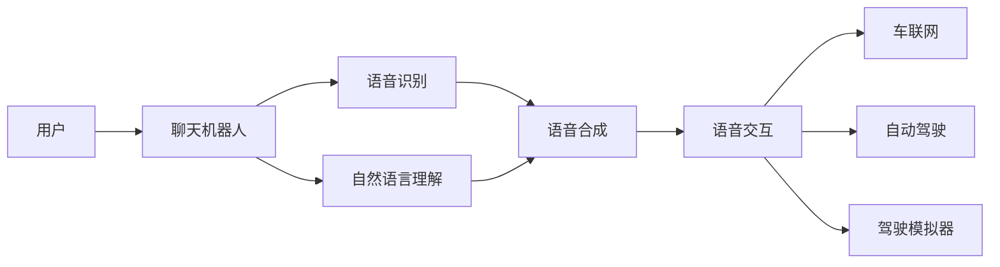

                 

# 聊天机器人汽车行业：智能汽车和驾驶体验

> 关键词：智能汽车, 驾驶体验, 自然语言处理(NLP), 聊天机器人, 语音助手, 车联网, 自动驾驶, 自动驾驶辅助系统, 驾驶模拟器

## 1. 背景介绍

### 1.1 问题由来

随着汽车工业的发展，人们对驾驶体验的要求越来越高。传统的汽车功能已经无法满足现代消费者对智能、个性化、互动化的需求。因此，汽车制造商和科技公司开始引入先进的智能技术，以提升汽车的智能化水平和驾驶体验。聊天机器人技术，作为一种重要的自然语言处理(NLP)技术，已经成为智能汽车领域的重要组成部分。

智能汽车不仅包括自动驾驶和车联网等核心功能，还涵盖了诸如驾驶辅助、车辆个性化定制、语音识别与语音交互、智能导航等多方面内容。聊天机器人作为智能汽车系统的重要组成部分，可以显著提升驾驶体验，增强用户与车辆之间的互动和连接。

### 1.2 问题核心关键点

聊天机器人技术在汽车行业中的应用，主要集中在以下几个方面：

- **语音识别与自然语言理解**：实现语音到文本的转换，理解驾驶员的语音指令和问题，从而提供准确的语音反馈和信息。
- **语音合成与语音交互**：将文本信息转换为自然流畅的语音输出，提升驾驶过程中的人机交互体验。
- **智能导航与实时信息**：提供实时路况、天气、事件等信息的智能导航服务，提高驾驶安全性。
- **驾驶辅助与自动驾驶**：通过语音指令控制汽车，提供如自动泊车、自适应巡航等辅助驾驶功能，甚至部分自动驾驶功能。
- **个性化服务与车辆管理**：根据驾驶员的个性化偏好，提供音乐、导航、消息推送等服务，管理车辆状态和维护。

### 1.3 问题研究意义

聊天机器人技术在汽车行业的应用，不仅能够提升驾驶体验，还能增加车辆的安全性、舒适性和便利性。研究其核心技术和实际应用，对于推动智能汽车的发展和提升驾驶安全具有重要意义。

- **提升驾驶体验**：通过语音交互和自然语言处理，聊天机器人能够显著提升驾驶过程中的互动性和便利性。
- **增强安全性**：通过智能导航和驾驶辅助功能，聊天机器人可以提供实时的路况信息和驾驶建议，减少交通事故和驾驶疲劳。
- **优化资源利用**：聊天机器人可以实时管理车辆状态和维护，降低车辆运营成本。
- **推动产业发展**：随着聊天机器人技术的普及，智能汽车市场将迎来新的发展机遇，推动整个汽车行业的转型升级。

## 2. 核心概念与联系

### 2.1 核心概念概述

聊天机器人技术在智能汽车中的应用，主要涉及以下几个核心概念：

- **自然语言处理(NLP)**：使用计算机技术理解和生成人类语言，包括语音识别、语音合成、自然语言理解和生成。
- **语音助手**：一种基于聊天机器人的交互界面，能够实时响应用户的语音指令和问题。
- **车联网**：通过网络将车辆与外界相连，提供实时数据和信息交换，支持聊天机器人的应用。
- **自动驾驶与辅助驾驶**：利用传感器和计算能力，实现部分或全部驾驶功能的自动化，增强驾驶体验。
- **驾驶模拟器**：模拟实际驾驶环境，提供驾驶训练和测试，支持聊天机器人技术的学习和优化。

### 2.2 核心概念原理和架构的 Mermaid 流程图



### 2.3 核心概念联系

聊天机器人技术在智能汽车中的应用，通过以下几个环节实现了驾驶体验的提升：

- **语音识别与自然语言理解**：将用户的语音指令转换为文本信息，理解其意图。
- **语音合成与语音交互**：将处理结果转换为自然流畅的语音反馈，增强人机交互体验。
- **智能导航与实时信息**：通过车联网获取实时数据，提供导航和驾驶辅助信息。
- **驾驶辅助与自动驾驶**：利用聊天机器人和相关技术实现自动化驾驶功能，提升驾驶安全性。
- **个性化服务与车辆管理**：根据用户偏好，提供个性化服务和车辆管理，提升用户体验。

这些环节相互协作，共同构建了一个功能丰富、交互便捷的智能汽车系统。

## 3. 核心算法原理 & 具体操作步骤

### 3.1 算法原理概述

聊天机器人技术在智能汽车中的应用，主要基于自然语言处理(NLP)技术，包括语音识别、自然语言理解和生成、语音合成等环节。其核心算法原理如下：

- **语音识别**：将用户的语音输入转换为文本，主要使用深度学习模型如CNN、RNN、Transformer等进行语音信号处理和特征提取。
- **自然语言理解(NLU)**：分析文本信息，理解用户的意图和上下文，主要使用深度学习模型如BERT、GPT等进行文本表示和语义分析。
- **自然语言生成(NLG)**：将处理结果转换为自然流畅的语音输出，主要使用深度学习模型如CTC、Attention机制等进行文本到语音的转换。
- **语音交互**：实时响应用户的语音指令和问题，主要使用状态机、意图识别等方法实现人机交互逻辑。

### 3.2 算法步骤详解

以下是聊天机器人技术在智能汽车应用中的详细操作步骤：

**Step 1: 数据收集与预处理**

1. 收集汽车驾驶和用户交互的语音和文本数据。
2. 对数据进行去噪、分词、标记等预处理。
3. 构建标注数据集，包括语音和文本数据，用于模型训练和评估。

**Step 2: 模型训练与优化**

1. 使用语音识别模型对语音数据进行特征提取和模型训练，提高识别准确率。
2. 使用自然语言处理模型对文本数据进行语义分析和意图识别，提高理解能力。
3. 使用语音合成模型对处理结果进行语音输出，提升语音自然度。
4. 使用意图识别和响应生成模型进行人机交互逻辑优化，提高响应速度和准确性。

**Step 3: 系统集成与测试**

1. 将训练好的模型集成到智能汽车系统中，实现语音识别、自然语言理解、语音合成、语音交互等功能。
2. 在实际驾驶环境中进行测试，评估聊天机器人的表现和用户体验。
3. 根据测试结果进行模型调优和系统改进，提升系统稳定性和性能。

**Step 4: 部署与维护**

1. 将优化后的系统部署到智能汽车中，进行大规模应用。
2. 定期收集用户反馈和系统运行数据，进行模型更新和系统维护。
3. 持续迭代和优化，提升聊天机器人系统的用户体验和功能。

### 3.3 算法优缺点

聊天机器人技术在智能汽车中的应用，具有以下优点：

- **提升驾驶体验**：通过语音交互和自然语言处理，聊天机器人能够显著提升驾驶过程中的互动性和便利性。
- **增强安全性**：通过智能导航和驾驶辅助功能，聊天机器人可以提供实时的路况信息和驾驶建议，减少交通事故和驾驶疲劳。
- **优化资源利用**：聊天机器人可以实时管理车辆状态和维护，降低车辆运营成本。

同时，也存在一些缺点：

- **识别和理解误差**：语音识别和自然语言理解存在误差，可能导致误操作或错误指令。
- **交互限制**：聊天机器人对用户的语音和文本输入有一定的格式和语境要求，限制了人机交互的灵活性。
- **网络依赖**：车联网和智能导航功能依赖于网络，在网络覆盖不佳或中断时，功能受限。

### 3.4 算法应用领域

聊天机器人技术在智能汽车中的应用，涵盖以下几个领域：

- **智能导航与实时信息**：提供实时路况、天气、事件等信息的智能导航服务，提高驾驶安全性。
- **驾驶辅助与自动驾驶**：通过语音指令控制汽车，提供如自动泊车、自适应巡航等辅助驾驶功能，甚至部分自动驾驶功能。
- **个性化服务与车辆管理**：根据驾驶员的个性化偏好，提供音乐、导航、消息推送等服务，管理车辆状态和维护。
- **车辆故障诊断与维护**：通过聊天机器人进行实时故障诊断，及时提供维护建议和服务。
- **客户服务与技术支持**：提供车辆维修、保养、投诉处理等服务，提升用户满意度。

## 4. 数学模型和公式 & 详细讲解 & 举例说明

### 4.1 数学模型构建

聊天机器人技术在智能汽车中的应用，主要基于深度学习模型和机器学习算法。以下是一些核心数学模型及其构建方法：

- **语音识别模型**：基于CNN、RNN、Transformer等模型，使用语音信号作为输入，输出文本信息。数学公式如下：

$$
M_{\text{语音识别}}(x) = \sigma(W_{\text{语音识别}}x + b_{\text{语音识别}})
$$

其中 $x$ 为语音信号，$W_{\text{语音识别}}$ 为模型权重，$b_{\text{语音识别}}$ 为偏置。

- **自然语言理解模型**：基于BERT、GPT等模型，使用文本信息作为输入，输出意图和上下文。数学公式如下：

$$
M_{\text{NLU}}(x) = \sigma(W_{\text{NLU}}x + b_{\text{NLU}})
$$

其中 $x$ 为文本信息，$W_{\text{NLU}}$ 为模型权重，$b_{\text{NLU}}$ 为偏置。

- **自然语言生成模型**：基于CTC、Attention机制等模型，使用意图和上下文作为输入，输出语音信息。数学公式如下：

$$
M_{\text{NLG}}(x) = \sigma(W_{\text{NLG}}x + b_{\text{NLG}})
$$

其中 $x$ 为意图和上下文，$W_{\text{NLG}}$ 为模型权重，$b_{\text{NLG}}$ 为偏置。

### 4.2 公式推导过程

以自然语言理解模型为例，推导其数学公式：

假设输入文本为 $x = (x_1, x_2, ..., x_n)$，意图为 $y$，则自然语言理解模型的目标是最小化损失函数：

$$
\mathcal{L}(M_{\text{NLU}}, x, y) = \sum_{i=1}^{n} \mathcal{L}(M_{\text{NLU}}, x_i, y)
$$

其中 $\mathcal{L}(M_{\text{NLU}}, x_i, y)$ 为单个文本样本的损失函数，通常使用交叉熵损失。

根据损失函数的定义，可以推导出自然语言理解模型的目标函数：

$$
\min_{\theta} \sum_{i=1}^{n} \mathcal{L}(M_{\text{NLU}}(x_i; \theta), y_i)
$$

其中 $\theta$ 为模型参数，$y_i$ 为文本样本的意图标签。

### 4.3 案例分析与讲解

假设一辆智能汽车中的聊天机器人，能够根据用户的语音指令和车辆状态，提供实时导航和驾驶辅助服务。以下是具体案例分析：

**案例一：智能导航**

用户输入语音指令“去我家附近的加油站”，系统进行如下处理：

1. 语音识别模型将语音转换为文本：“去我家附近的加油站”。
2. 自然语言理解模型分析文本，提取意图：“导航”。
3. 智能导航系统查询目的地，生成导航路线。
4. 自然语言生成模型将导航路线转换为语音：“请前往XX加油站，距离您XX公里，预计XX分钟到达”。

**案例二：驾驶辅助**

用户输入语音指令“自动泊车”，系统进行如下处理：

1. 语音识别模型将语音转换为文本：“自动泊车”。
2. 自然语言理解模型分析文本，提取意图：“自动泊车”。
3. 自动泊车系统进行环境感知，启动泊车功能。
4. 自然语言生成模型反馈泊车状态：“正在自动泊车，请稍等”。

通过这些案例，可以看出聊天机器人技术在智能汽车中的应用，能够显著提升驾驶体验和安全性。

## 5. 项目实践：代码实例和详细解释说明

### 5.1 开发环境搭建

以下是使用Python和TensorFlow搭建聊天机器人开发环境的流程：

1. 安装Anaconda：从官网下载并安装Anaconda，用于创建独立的Python环境。

2. 创建并激活虚拟环境：
```bash
conda create -n chatbot-env python=3.8 
conda activate chatbot-env
```

3. 安装TensorFlow：根据CUDA版本，从官网获取对应的安装命令。例如：
```bash
conda install tensorflow -c pytorch -c conda-forge
```

4. 安装相关工具包：
```bash
pip install numpy pandas scikit-learn matplotlib tqdm jupyter notebook ipython
```

完成上述步骤后，即可在`chatbot-env`环境中开始聊天机器人开发。

### 5.2 源代码详细实现

以下是一个基于TensorFlow和Keras实现的聊天机器人系统的代码示例：

**Step 1: 数据准备**

首先，我们需要准备聊天机器人训练用的数据集，包括用户语音和文本数据，以及意图标签。

```python
import numpy as np
import pandas as pd

# 准备数据集
data = pd.read_csv('chatbot_data.csv')
texts = data['text'].values
labels = data['label'].values

# 将文本数据转换为数值表示
tokenizer = Tokenizer()
tokenizer.fit_on_texts(texts)
sequences = tokenizer.texts_to_sequences(texts)

# 填充序列，确保序列长度一致
max_len = max([len(seq) for seq in sequences])
sequences = np.pad(sequences, ((0, max_len - len(sequences)), (0, 0)), mode='constant', constant_values=0)
```

**Step 2: 模型搭建**

接下来，我们搭建一个基于LSTM的聊天机器人模型，包括一个嵌入层、LSTM层和全连接层：

```python
from tensorflow.keras.models import Sequential
from tensorflow.keras.layers import Embedding, LSTM, Dense, Dropout

# 定义模型结构
model = Sequential()
model.add(Embedding(input_dim=len(tokenizer.word_index) + 1, output_dim=128))
model.add(LSTM(units=128, dropout=0.2))
model.add(Dense(units=64, activation='relu'))
model.add(Dense(units=1, activation='sigmoid'))

# 编译模型
model.compile(loss='binary_crossentropy', optimizer='adam', metrics=['accuracy'])
```

**Step 3: 模型训练**

使用训练数据集对模型进行训练，设定训练轮数和批次大小：

```python
# 将意图标签转换为one-hot编码
labels = keras.utils.to_categorical(labels, num_classes=2)

# 定义训练数据和测试数据
train_sequences = sequences[:len(train_data)//2]
train_labels = labels[:len(train_data)//2]
test_sequences = sequences[len(train_data)//2:]
test_labels = labels[len(train_data)//2:]

# 将数据转换为TensorFlow张量
train_sequences = tf.convert_to_tensor(train_sequences)
train_labels = tf.convert_to_tensor(train_labels)
test_sequences = tf.convert_to_tensor(test_sequences)
test_labels = tf.convert_to_tensor(test_labels)

# 训练模型
model.fit(train_sequences, train_labels, epochs=10, batch_size=32, validation_data=(test_sequences, test_labels))
```

**Step 4: 模型评估与测试**

在测试数据集上对模型进行评估和测试，输出模型准确率和混淆矩阵：

```python
from sklearn.metrics import confusion_matrix

# 预测测试数据集
test_predictions = model.predict(test_sequences)
test_predictions = np.round(test_predictions)

# 计算混淆矩阵
cm = confusion_matrix(test_labels, test_predictions)
print(cm)
print('Accuracy:', np.mean(test_predictions == test_labels))
```

### 5.3 代码解读与分析

以下是代码中的一些关键点解释：

**数据准备**

- `Tokenizer`：用于将文本转换为数值序列，以便于模型训练。
- `pad_sequences`：将序列填充到统一长度，保证模型输入的一致性。

**模型搭建**

- `Embedding`：将数值序列转换为向量表示，以便于模型学习。
- `LSTM`：使用长短期记忆网络，处理序列数据。
- `Dense`：全连接层，输出预测结果。

**模型训练**

- `to_categorical`：将意图标签转换为one-hot编码，以便于模型处理。
- `fit`：对模型进行训练，设定训练轮数和批次大小。

**模型评估与测试**

- `predict`：预测测试数据集，输出预测结果。
- `confusion_matrix`：计算混淆矩阵，评估模型性能。

## 6. 实际应用场景

### 6.1 智能导航

聊天机器人可以应用于智能导航系统，提供实时路况、天气、事件等信息，提升驾驶体验和安全性。

**实际应用**

一辆智能汽车中的聊天机器人，能够根据用户的语音指令和车辆状态，提供实时导航和驾驶辅助服务。例如，用户输入语音指令“去我家附近的加油站”，系统进行如下处理：

1. 语音识别模型将语音转换为文本：“去我家附近的加油站”。
2. 自然语言理解模型分析文本，提取意图：“导航”。
3. 智能导航系统查询目的地，生成导航路线。
4. 自然语言生成模型将导航路线转换为语音：“请前往XX加油站，距离您XX公里，预计XX分钟到达”。

**技术细节**

智能导航系统需要与GPS、地图API等外部服务集成，获取实时路况和地理信息。系统还需要根据用户偏好和历史导航数据，提供个性化的导航建议。

### 6.2 驾驶辅助

聊天机器人可以应用于驾驶辅助系统，提供如自动泊车、自适应巡航等辅助驾驶功能，增强驾驶安全性。

**实际应用**

用户输入语音指令“自动泊车”，系统进行如下处理：

1. 语音识别模型将语音转换为文本：“自动泊车”。
2. 自然语言理解模型分析文本，提取意图：“自动泊车”。
3. 自动泊车系统进行环境感知，启动泊车功能。
4. 自然语言生成模型反馈泊车状态：“正在自动泊车，请稍等”。

**技术细节**

自动泊车系统需要与摄像头、雷达、超声波传感器等外部设备集成，获取车辆周围环境信息。系统还需要根据用户偏好和实时路况，动态调整泊车策略，确保泊车成功。

### 6.3 个性化服务

聊天机器人可以应用于个性化服务系统，根据用户的偏好和历史数据，提供定制化的服务和建议。

**实际应用**

用户输入语音指令“播放一首轻音乐”，系统进行如下处理：

1. 语音识别模型将语音转换为文本：“播放一首轻音乐”。
2. 自然语言理解模型分析文本，提取意图：“播放音乐”。
3. 音乐播放系统根据用户偏好，播放轻音乐。
4. 自然语言生成模型反馈播放状态：“已为您播放轻音乐”。

**技术细节**

音乐播放系统需要与音频播放设备集成，提供音乐播放和控制功能。系统还需要根据用户的音乐历史和偏好，推荐适合的播放列表。

## 7. 工具和资源推荐

### 7.1 学习资源推荐

为了帮助开发者系统掌握聊天机器人技术，以下是一些优质的学习资源：

1. TensorFlow官方文档：提供了详细的TensorFlow教程和代码示例，帮助开发者快速上手。
2. Keras官方文档：提供了Keras教程和代码示例，帮助开发者快速搭建和训练模型。
3. PyTorch官方文档：提供了PyTorch教程和代码示例，帮助开发者掌握深度学习框架。
4. NLP相关书籍：如《自然语言处理综论》、《深度学习与自然语言处理》等，帮助开发者系统了解NLP理论和技术。
5. 在线课程：如Coursera、Udacity上的NLP和深度学习课程，帮助开发者系统学习。

通过对这些资源的学习实践，相信你一定能够快速掌握聊天机器人技术的精髓，并用于解决实际的智能汽车问题。

### 7.2 开发工具推荐

高效的开发离不开优秀的工具支持。以下是几款用于聊天机器人开发的常用工具：

1. TensorFlow：基于Python的开源深度学习框架，灵活动态的计算图，适合快速迭代研究。
2. Keras：Keras的高级API，易于上手，适合快速搭建模型。
3. PyTorch：基于Python的深度学习框架，灵活性高，适合深入研究。
4. Weights & Biases：模型训练的实验跟踪工具，可以记录和可视化模型训练过程中的各项指标，方便对比和调优。
5. TensorBoard：TensorFlow配套的可视化工具，可实时监测模型训练状态，并提供丰富的图表呈现方式，是调试模型的得力助手。

合理利用这些工具，可以显著提升聊天机器人开发的效率，加快创新迭代的步伐。

### 7.3 相关论文推荐

聊天机器人技术在智能汽车中的应用，源于学界的持续研究。以下是几篇奠基性的相关论文，推荐阅读：

1. Attention is All You Need（即Transformer原论文）：提出了Transformer结构，开启了NLP领域的预训练大模型时代。
2. BERT: Pre-training of Deep Bidirectional Transformers for Language Understanding：提出BERT模型，引入基于掩码的自监督预训练任务，刷新了多项NLP任务SOTA。
3. Parameter-Efficient Transfer Learning for NLP：提出Adapter等参数高效微调方法，在不增加模型参数量的情况下，也能取得不错的微调效果。
4. Transfer Learning with Continuous Tokens for Text Generation：引入基于连续型Prompt的微调范式，为如何充分利用预训练知识提供了新的思路。
5. Conversational AI for Home Robotics：提出基于聊天机器人的家庭机器人系统，展示了智能聊天机器人技术在家庭自动化中的应用。

这些论文代表了大语言模型微调技术的发展脉络。通过学习这些前沿成果，可以帮助研究者把握学科前进方向，激发更多的创新灵感。

## 8. 总结：未来发展趋势与挑战

### 8.1 研究成果总结

聊天机器人技术在智能汽车中的应用，已经取得了显著的进展，但依然面临诸多挑战：

1. **数据质量与多样性**：高质量、多样化的训练数据对模型性能至关重要，但获取这些数据往往需要大量人力和时间成本。
2. **模型复杂性与计算资源**：大模型需要大量的计算资源进行训练和推理，如何高效利用资源是一个重要问题。
3. **安全性与隐私保护**：聊天机器人需要处理大量的用户隐私数据，如何保障数据安全和隐私保护是一个重要挑战。
4. **人机交互自然度**：自然流畅的人机交互体验是聊天机器人的核心需求，如何提升自然度是一个重要研究方向。

### 8.2 未来发展趋势

展望未来，聊天机器人技术在智能汽车中的应用，将呈现以下几个发展趋势：

1. **数据增强与数据生成**：通过数据增强和生成技术，提高模型的泛化能力和鲁棒性。
2. **多模态融合**：将视觉、语音、文本等多种模态信息融合，提升人机交互的自然度和效率。
3. **参数高效微调**：开发更多参数高效微调方法，如Adapter、LoRA等，降低计算资源消耗，提高模型优化效率。
4. **跨领域迁移**：提升模型在多领域的迁移能力，实现通用化的智能交互。
5. **可解释性与可控性**：提升模型的可解释性和可控性，确保其决策过程透明和可控。

### 8.3 面临的挑战

尽管聊天机器人技术在智能汽车中的应用已经取得了一定的进展，但仍面临诸多挑战：

1. **数据质量和多样性**：高质量、多样化的训练数据对模型性能至关重要，但获取这些数据往往需要大量人力和时间成本。
2. **计算资源与计算效率**：大模型需要大量的计算资源进行训练和推理，如何高效利用资源是一个重要问题。
3. **安全性与隐私保护**：聊天机器人需要处理大量的用户隐私数据，如何保障数据安全和隐私保护是一个重要挑战。
4. **自然度与人机交互体验**：自然流畅的人机交互体验是聊天机器人的核心需求，如何提升自然度是一个重要研究方向。

### 8.4 研究展望

未来的研究需要在以下几个方向寻求新的突破：

1. **数据增强与数据生成**：通过数据增强和生成技术，提高模型的泛化能力和鲁棒性。
2. **多模态融合**：将视觉、语音、文本等多种模态信息融合，提升人机交互的自然度和效率。
3. **参数高效微调**：开发更多参数高效微调方法，如Adapter、LoRA等，降低计算资源消耗，提高模型优化效率。
4. **跨领域迁移**：提升模型在多领域的迁移能力，实现通用化的智能交互。
5. **可解释性与可控性**：提升模型的可解释性和可控性，确保其决策过程透明和可控。

## 9. 附录：常见问题与解答

**Q1：聊天机器人如何实现多模态融合？**

A: 多模态融合是指将视觉、语音、文本等多种模态信息融合，提升人机交互的自然度和效率。实现多模态融合的主要方法包括：

1. **融合模型架构**：使用多模态融合模型，将不同模态的信息融合到统一的空间中，提升模型的表征能力。
2. **多模态数据处理**：将不同模态的数据进行统一处理，如图像处理、语音特征提取等，以供融合模型使用。
3. **多模态训练与优化**：在模型训练过程中，引入多模态数据，优化模型的参数，提升模型的鲁棒性和泛化能力。

通过多模态融合技术，可以实现更加自然流畅的人机交互体验，提升智能汽车系统的智能性和互动性。

**Q2：如何提高聊天机器人的自然度？**

A: 提高聊天机器人的自然度主要从以下几个方面入手：

1. **语言模型训练**：使用大规模高质量语料进行语言模型的预训练，提升模型的语言理解能力和生成能力。
2. **多轮对话设计**：设计多轮对话策略，使机器人能够理解和回应用户的复杂问题，提升对话的自然度。
3. **情感与语调处理**：使用情感识别和语调处理技术，使机器人能够根据用户情绪调整回答，提升对话的自然度和亲和力。
4. **个性化定制**：根据用户的个性化偏好和历史数据，提供定制化的回答和服务，提升用户满意度。

通过这些方法，可以显著提升聊天机器人的自然度，增强用户对系统的信任感和满意度。

**Q3：如何保障聊天机器人的安全性与隐私保护？**

A: 保障聊天机器人的安全性与隐私保护主要从以下几个方面入手：

1. **数据加密与匿名化**：对用户数据进行加密和匿名化处理，防止数据泄露和滥用。
2. **访问控制与权限管理**：对系统的访问进行严格的权限管理，确保只有授权用户能够访问敏感数据。
3. **异常检测与预警**：通过异常检测和预警机制，及时发现和处理系统的安全威胁。
4. **安全审计与监控**：对系统的运行进行实时监控和审计，确保系统的稳定性和安全性。

通过这些方法，可以显著提升聊天机器人的安全性与隐私保护能力，保障用户数据和系统的安全。

---

作者：禅与计算机程序设计艺术 / Zen and the Art of Computer Programming

