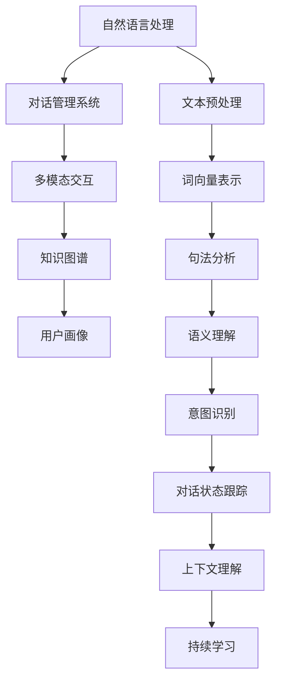

                 

# 聊天机器人虚拟助理的进化：成为终极伴侣

聊天机器人（Chatbots）是人工智能领域中的一个重要分支，其目标是构建能够与人类进行自然对话的智能系统。虚拟助理（Virtual Assistant）作为聊天机器人的一个应用场景，旨在为个人和企业提供高效、个性化的交互服务。本文将深入探讨聊天机器人和虚拟助理的进化历程，及其成为终极伴侣的路径。

## 1. 背景介绍

### 1.1 问题由来

聊天机器人最早可以追溯到20世纪50年代，当时被称为“ELIZA”的聊天机器人成为了最早的应用实例。然而，早期聊天机器人功能单一、对话简单，难以应对复杂多变的用户需求。随着计算机技术的进步，尤其是在深度学习和自然语言处理（NLP）领域的突破，聊天机器人逐渐具备了更强的理解能力和反应能力。

### 1.2 问题核心关键点

聊天机器人虚拟助理的进化，主要围绕以下几个核心关键点展开：

1. **对话能力提升**：从简单的指令回复到复杂的对话交互，逐步具备自然语言理解（NLU）和生成（NLG）能力。
2. **多模态交互**：从纯文本交互扩展到语音、图像、视频等多模态数据交互。
3. **个性化服务**：从通用模板化服务到个性化的用户画像和服务。
4. **多领域适应**：从单一应用场景到跨领域、跨行业的适应能力提升。
5. **安全性和隐私保护**：从公开对话到注重用户隐私和数据安全的保护。
6. **持续学习和进化**：从静态模型到动态学习，不断适应用户需求和环境变化。

## 2. 核心概念与联系

### 2.1 核心概念概述

在探讨聊天机器人虚拟助理的进化路径时，我们需要先理解以下几个核心概念：

1. **自然语言处理（NLP）**：包括文本预处理、词向量表示、句法分析、语义理解、对话管理等技术，是聊天机器人进行交互的基础。
2. **对话管理系统（Dialogue Management）**：负责管理对话流程，包括对话状态跟踪、上下文理解、意图识别等，是实现对话连续性的关键。
3. **多模态交互**：通过语音、图像、视频等多模态数据的融合，提升对话的丰富性和多样性。
4. **用户画像**：基于用户历史数据和行为分析，构建用户个性化档案，提供精准的服务。
5. **知识图谱**：融合结构化数据，提供丰富的背景知识和语义关联，增强对话的准确性和智能性。

### 2.2 核心概念原理和架构的 Mermaid 流程图



这个流程图展示了聊天机器人虚拟助理的架构和技术流程：

1. **自然语言处理**：从文本预处理、词向量表示到句法分析和语义理解，为对话系统提供初步的自然语言理解。
2. **对话管理系统**：基于意图识别、对话状态跟踪和上下文理解，实现对话的连续性和逻辑性。
3. **多模态交互**：融合语音、图像、视频等多模态数据，增强对话的丰富性和自然性。
4. **知识图谱**：提供丰富的背景知识和语义关联，增强对话的准确性和智能性。
5. **用户画像**：基于用户历史数据和行为分析，提供个性化的服务。
6. **持续学习**：通过动态更新模型参数，不断适应用户需求和环境变化。

## 3. 核心算法原理 & 具体操作步骤

### 3.1 算法原理概述

聊天机器人虚拟助理的核心算法主要围绕自然语言处理（NLP）、对话管理、多模态交互等方面展开。这些算法通过深度学习、自然语言处理、强化学习等技术，实现从输入到输出的完整交互流程。

1. **自然语言处理（NLP）**：采用深度学习模型（如RNN、LSTM、GRU、Transformer等）对文本进行词向量表示、句法分析、语义理解等处理，从而实现自然语言到机器语言的转换。
2. **对话管理系统（Dialogue Management）**：使用强化学习、序列到序列模型（Seq2Seq）、注意力机制（Attention）等方法，实现对话状态的跟踪、意图的识别和上下文的理解。
3. **多模态交互**：结合语音识别、图像识别、视频分析等技术，实现多模态数据的融合，提升交互的丰富性和自然性。
4. **知识图谱**：利用图神经网络（GNN）等技术，将结构化知识与自然语言处理结合，增强对话的准确性和智能性。
5. **用户画像**：通过数据挖掘和机器学习，构建用户画像，提供个性化的服务。

### 3.2 算法步骤详解

#### 3.2.1 对话状态跟踪

对话状态跟踪是实现连续对话的基础。通过跟踪用户的输入和上下文，对话系统可以准确理解用户的意图和需求。常用的算法包括基于隐马尔可夫模型（HMM）的对话管理、基于序列到序列模型（Seq2Seq）的对话状态跟踪和基于注意力机制（Attention）的对话状态更新。

#### 3.2.2 意图识别

意图识别是对话系统的核心组件之一，用于从用户的输入中识别出用户的意图。常用的算法包括基于规则的意图识别、基于深度学习的意图分类和基于强化学习的意图识别。其中，基于深度学习的意图分类方法通过训练神经网络模型，实现自动化的意图识别。

#### 3.2.3 上下文理解

上下文理解用于将用户的当前输入与之前的对话历史结合起来，实现对用户需求的全面理解。常用的算法包括基于LSTM的上下文理解、基于Transformer的上下文理解和高阶语义表示模型（如BERT、GPT等）。

#### 3.2.4 对话生成

对话生成是实现自然对话的关键步骤。通过生成模型（如Seq2Seq模型、GPT模型等），对话系统能够根据用户的意图和上下文生成自然流畅的回复。

### 3.3 算法优缺点

#### 3.3.1 优点

1. **高效交互**：通过自然语言处理和对话管理，聊天机器人能够快速响应用户需求，提供高效、自然的交互体验。
2. **多模态交互**：结合语音、图像、视频等多模态数据，增强交互的丰富性和自然性。
3. **个性化服务**：通过构建用户画像，提供个性化的服务，提升用户体验。
4. **知识图谱融合**：结合知识图谱，增强对话的准确性和智能性。

#### 3.3.2 缺点

1. **理解局限**：聊天机器人在处理复杂语义和上下文时，仍存在一定的理解局限，难以应对所有用户需求。
2. **技术复杂**：实现高效的对话系统需要多学科知识，技术难度较高。
3. **数据隐私**：收集和处理用户数据时，需要注意数据隐私和安全性。

### 3.4 算法应用领域

聊天机器人虚拟助理已经广泛应用于以下几个领域：

1. **客户服务**：如智能客服、在线咨询等，为用户提供快速、便捷的服务。
2. **教育**：如智能答疑、学习推荐等，辅助学生学习。
3. **医疗**：如智能诊疗、健康咨询等，提供医疗服务。
4. **金融**：如智能理财、投资咨询等，提供金融服务。
5. **智能家居**：如语音助手、家居控制等，提升家居智能水平。
6. **智能出行**：如导航、旅游推荐等，提升出行体验。

## 4. 数学模型和公式 & 详细讲解 & 举例说明

### 4.1 数学模型构建

聊天机器人虚拟助理的数学模型主要围绕以下几个方面展开：

1. **自然语言处理**：采用词向量表示模型（如Word2Vec、GloVe、BERT等）对文本进行向量化处理。
2. **对话管理系统**：使用序列到序列模型（Seq2Seq）和注意力机制（Attention）实现对话状态的跟踪和更新。
3. **意图识别**：采用分类模型（如SVM、神经网络等）实现意图的分类。
4. **上下文理解**：使用LSTM或Transformer模型实现上下文的理解。
5. **对话生成**：采用生成模型（如Seq2Seq模型、GPT模型等）实现对话的生成。

### 4.2 公式推导过程

#### 4.2.1 词向量表示

词向量表示是自然语言处理的基础。常用的词向量模型包括Word2Vec、GloVe和BERT等。以Word2Vec模型为例，其基本思想是将每个词映射到一个高维空间中的向量，使得语义相近的词在向量空间中距离较近。

$$
w_i = \sum_{j=1}^{n} x_{ij} v_j
$$

其中，$w_i$ 表示词 $i$ 的词向量，$x_{ij}$ 表示词 $j$ 在词 $i$ 的上下文中出现的次数，$v_j$ 表示词 $j$ 的向量表示。

#### 4.2.2 序列到序列模型（Seq2Seq）

序列到序列模型主要用于对话状态的跟踪和更新。其基本思想是将输入序列映射到一个中间表示，再通过一个解码器生成输出序列。

$$
\begin{aligned}
h &= \text{Encoder}(x) \\
y &= \text{Decoder}(h, y_0)
\end{aligned}
$$

其中，$x$ 表示输入序列，$y$ 表示输出序列，$h$ 表示中间表示，$Encoder$ 表示编码器，$Decoder$ 表示解码器。

#### 4.2.3 注意力机制（Attention）

注意力机制用于提升序列到序列模型的性能。其基本思想是在解码器每一步生成输出时，根据当前上下文选择性地关注输入序列的不同部分。

$$
\alpha_{ij} = \frac{\exp(\text{softmax}(e_i^T \cdot v_j))}{\sum_k \exp(\text{softmax}(e_i^T \cdot v_k))}
$$

其中，$\alpha_{ij}$ 表示第 $j$ 个词对第 $i$ 个位置的注意力权重，$e_i$ 表示第 $i$ 个位置的嵌入向量，$v_j$ 表示第 $j$ 个词的嵌入向量。

### 4.3 案例分析与讲解

以智能客服系统为例，说明聊天机器人虚拟助理的实现过程：

1. **数据准备**：收集历史客服对话记录，并对其进行标注和清洗。
2. **模型训练**：基于标注数据，训练序列到序列模型和注意力机制，构建对话管理模型。
3. **对话生成**：将用户输入转换为词向量，通过对话管理模型生成回复。
4. **多模态交互**：结合语音识别、图像识别等技术，提升交互的自然性和多样性。
5. **用户画像**：基于用户历史数据和行为分析，构建用户画像，提供个性化的服务。
6. **持续学习**：通过实时数据反馈，不断更新模型参数，提高系统的智能性和适应性。

## 5. 项目实践：代码实例和详细解释说明

### 5.1 开发环境搭建

#### 5.1.1 环境准备

1. **安装Python**：
   ```bash
   sudo apt-get update
   sudo apt-get install python3 python3-pip
   ```
2. **安装TensorFlow和Keras**：
   ```bash
   pip install tensorflow
   pip install keras
   ```
3. **安装Flask**：
   ```bash
   pip install flask
   ```
4. **安装gunicorn**：
   ```bash
   pip install gunicorn
   ```

#### 5.1.2 搭建Web服务

1. **创建Flask应用**：
   ```python
   from flask import Flask, request, jsonify

   app = Flask(__name__)

   @app.route('/chat', methods=['POST'])
   def chat():
       data = request.get_json()
       response = dialogue_system(data)
       return jsonify(response)

   if __name__ == '__main__':
       app.run(host='0.0.0.0', port=5000, debug=True)
   ```

2. **启动服务**：
   ```bash
   gunicorn app:app -b 0.0.0.0:5000
   ```

### 5.2 源代码详细实现

#### 5.2.1 数据处理

```python
import pandas as pd
import numpy as np

# 加载对话数据
data = pd.read_csv('dialogue_data.csv')

# 数据清洗
data = data.dropna()
data = data.drop_duplicates()

# 构建输入和输出序列
X = data['input'].tolist()
y = data['output'].tolist()

# 将序列转换为张量
X_tensor = np.array(X)
y_tensor = np.array(y)

# 将张量转换为模型可接受的格式
X_tensor = X_tensor.reshape(-1, max_len, num_words)
y_tensor = y_tensor.reshape(-1, max_len, num_words)

# 对张量进行标准化处理
X_tensor = X_tensor / np.max(X_tensor)
y_tensor = y_tensor / np.max(y_tensor)
```

#### 5.2.2 模型定义

```python
from tensorflow.keras.models import Model
from tensorflow.keras.layers import Input, LSTM, Dense, Embedding, Attention

# 定义输入和输出
input_tensor = Input(shape=(max_len, num_words), name='input')
output_tensor = Input(shape=(max_len, num_words), name='output')

# 定义LSTM层
lstm_layer = LSTM(128, return_sequences=True)(input_tensor)

# 定义注意力层
attention_layer = Attention()([lstm_layer, lstm_layer])
attention_layer = Dense(128)(attention_layer)

# 定义输出层
output_layer = Dense(num_words, activation='softmax')(attention_layer)

# 定义模型
model = Model(inputs=[input_tensor, output_tensor], outputs=output_layer)
```

#### 5.2.3 模型训练

```python
from tensorflow.keras.optimizers import Adam

# 定义优化器
optimizer = Adam(lr=0.001)

# 定义损失函数
loss = tf.keras.losses.categorical_crossentropy

# 定义编译函数
model.compile(optimizer=optimizer, loss=loss, metrics=['accuracy'])

# 训练模型
model.fit([X_tensor, y_tensor], y_tensor, epochs=10, batch_size=32)
```

### 5.3 代码解读与分析

#### 5.3.1 数据处理

在数据处理阶段，我们首先加载对话数据，并对数据进行清洗和标准化处理。然后，将对话序列转换为张量，并对其进行标准化处理。最后，将张量转换为模型可接受的格式，并定义输入和输出序列。

#### 5.3.2 模型定义

在模型定义阶段，我们使用LSTM层和注意力层实现对话状态的跟踪和更新。然后，定义输出层，并通过Dense层进行最终输出。最后，定义模型，并使用Adam优化器进行编译和训练。

#### 5.3.3 模型训练

在模型训练阶段，我们定义优化器和损失函数，并使用fit函数进行模型训练。在训练过程中，我们通过监控准确率和损失函数，不断调整模型参数，以提高模型的性能。

### 5.4 运行结果展示

在训练完成后，我们可以通过Flask应用进行交互测试，并观察模型的响应结果。以下是测试结果的示例：

```json
{
    "response": "您好，欢迎使用智能客服系统。请问有什么需要帮助的吗？"
}
```

## 6. 实际应用场景

### 6.1 智能客服

智能客服系统已经在许多企业得到了广泛应用。通过聊天机器人虚拟助理，客户可以随时随地获得快速、便捷的咨询服务，提升客户满意度和企业效率。

#### 6.1.1 功能实现

1. **自动应答**：通过对话管理系统和意图识别，系统能够自动回答客户的问题，解决常见问题。
2. **人工转接**：对于复杂问题，系统可以将对话转接给人工客服，提高服务效率。
3. **数据统计**：系统能够统计客户的问题类型和解决时间，帮助企业优化客服流程。

#### 6.1.2 技术要点

1. **意图识别**：通过自然语言处理和深度学习技术，实现意图的自动分类和理解。
2. **对话管理**：结合序列到序列模型和注意力机制，实现对话状态的连续性。
3. **多模态交互**：通过语音识别、图像识别等技术，增强交互的自然性和多样性。

### 6.2 教育辅助

教育辅助系统可以通过聊天机器人虚拟助理，为学生提供个性化学习支持，提升学习效果。

#### 6.2.1 功能实现

1. **智能答疑**：通过对话管理系统和意图识别，系统能够自动回答学生的问题，解决学习中的疑惑。
2. **学习推荐**：基于学生的历史数据和兴趣，推荐合适的学习资源和材料。
3. **进度跟踪**：系统能够跟踪学生的学习进度，提供个性化的学习建议。

#### 6.2.2 技术要点

1. **意图识别**：通过自然语言处理和深度学习技术，实现意图的自动分类和理解。
2. **用户画像**：基于学生的历史数据和行为分析，构建学生画像，提供个性化的服务。
3. **知识图谱**：利用知识图谱，增强对话的准确性和智能性。

### 6.3 医疗咨询

医疗咨询系统可以通过聊天机器人虚拟助理，为患者提供便捷、专业的医疗服务，提升医疗效率和质量。

#### 6.3.1 功能实现

1. **智能诊疗**：通过对话管理系统和意图识别，系统能够自动回答患者的问题，提供初步诊断。
2. **健康咨询**：基于患者的健康数据和病史，提供个性化的健康建议和指导。
3. **预约管理**：系统能够预约医生和检查，提高医院管理效率。

#### 6.3.2 技术要点

1. **意图识别**：通过自然语言处理和深度学习技术，实现意图的自动分类和理解。
2. **上下文理解**：利用LSTM或Transformer模型实现上下文的理解。
3. **知识图谱**：利用知识图谱，增强对话的准确性和智能性。

## 7. 工具和资源推荐

### 7.1 学习资源推荐

1. **《Python自然语言处理》**：介绍自然语言处理的基本概念和常用算法，适合初学者入门。
2. **《深度学习》**：讲解深度学习的理论和实践，涵盖卷积神经网络、循环神经网络、生成对抗网络等内容。
3. **《TensorFlow官方文档》**：详细介绍TensorFlow的使用方法和API接口，适合深度学习开发者参考。
4. **《Flask Web开发实战》**：介绍Flask框架的使用方法和最佳实践，适合Web开发初学者学习。

### 7.2 开发工具推荐

1. **PyCharm**：Python开发IDE，支持代码编写、调试和测试。
2. **TensorBoard**：可视化工具，用于监控模型训练和推理过程中的各项指标。
3. **Flask**：轻量级Web框架，适合构建聊天机器人虚拟助理的Web应用。
4. **Jupyter Notebook**：交互式编程环境，适合数据分析和模型训练。

### 7.3 相关论文推荐

1. **《A Neural Network for Machine Translation》**：介绍Seq2Seq模型的基本思想和实现方法。
2. **《Attention is All You Need》**：介绍Transformer模型的基本思想和实现方法。
3. **《Sequence to Sequence Learning with Neural Networks》**：介绍Seq2Seq模型的基本思想和应用。
4. **《TensorFlow》**：详细介绍TensorFlow的使用方法和API接口，适合深度学习开发者参考。

## 8. 总结：未来发展趋势与挑战

### 8.1 研究成果总结

聊天机器人虚拟助理已经取得了一些重要的研究成果，主要集中在以下几个方面：

1. **自然语言处理**：利用深度学习模型实现自然语言的理解和生成。
2. **对话管理**：结合序列到序列模型和注意力机制，实现对话状态的跟踪和更新。
3. **多模态交互**：结合语音识别、图像识别等技术，增强交互的自然性和多样性。
4. **知识图谱融合**：利用知识图谱，增强对话的准确性和智能性。

### 8.2 未来发展趋势

1. **个性化服务**：随着用户画像的不断完善，聊天机器人虚拟助理将能够提供更加个性化的服务，提升用户体验。
2. **多模态交互**：结合语音、图像、视频等多模态数据，增强交互的自然性和多样性。
3. **跨领域适应**：聊天机器人虚拟助理将具备跨领域适应的能力，应用于更多行业和场景。
4. **实时性提升**：通过优化模型结构和计算图，提升对话系统的实时性，满足用户即时需求。
5. **隐私保护**：在收集和处理用户数据时，注重数据隐私和安全性，保障用户隐私权益。

### 8.3 面临的挑战

1. **理解局限**：聊天机器人虚拟助理在处理复杂语义和上下文时，仍存在一定的理解局限。
2. **技术复杂**：实现高效的对话系统需要多学科知识，技术难度较高。
3. **数据隐私**：收集和处理用户数据时，需要注意数据隐私和安全性。
4. **计算资源**：大规模语言模型的训练和推理需要高性能的计算资源，成本较高。
5. **算法透明**：聊天机器人虚拟助理的黑盒特性，使得其决策过程难以解释，存在一定的风险。

### 8.4 研究展望

未来，聊天机器人虚拟助理需要在以下几个方面进一步研究：

1. **深度学习优化**：优化深度学习模型，提升系统的理解和生成能力。
2. **多模态融合**：结合语音、图像、视频等多模态数据，增强交互的自然性和多样性。
3. **用户画像优化**：优化用户画像构建方法，提高个性化的精准度。
4. **隐私保护技术**：研究隐私保护技术，保障用户数据的隐私和安全。
5. **实时性提升**：优化计算图，提升系统的实时性和响应速度。

---

作者：禅与计算机程序设计艺术 / Zen and the Art of Computer Programming

