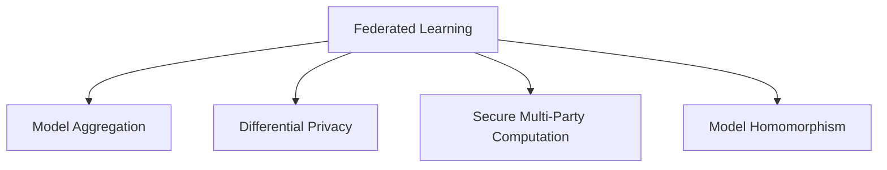

                 

# 联邦学习：保护隐私的分布式机器学习

> 关键词：联邦学习,分布式机器学习,隐私保护,模型聚合,安全多方计算

## 1. 背景介绍

### 1.1 问题由来

在互联网时代，数据成为企业竞争的核心资源之一。数据驱动的机器学习模型，逐渐成为各行各业智能化转型的重要工具。然而，传统的集中式机器学习训练方法，需要将大量数据汇集到中心服务器进行训练，数据所有权和隐私保护问题日渐凸显。与此同时，各企业在数据获取和计算能力上存在差异，集中式训练难以兼顾效率与公平。

针对这些问题，联邦学习应运而生。联邦学习允许各参与方在本地数据上训练模型，通过安全地传输模型参数和计算结果，最终在中心服务器或各参与方之间聚合，生成全局最优模型。该方法通过保持本地数据不被集中存储或泄露，保障数据隐私，同时提高数据利用效率，实现多节点协同优化，适用于边端计算、智能城市等分布式数据环境。

### 1.2 问题核心关键点

联邦学习的主要创新点在于数据在本地训练，并通过模型聚合而非数据传输实现模型优化，从而保障数据隐私。核心技术包括：
- 安全聚合：参与方通过差分隐私等技术，使得模型参数聚合不会泄露本地数据细节。
- 安全传输：使用多方安全计算等技术，在传输过程中保护模型参数和中间计算结果。
- 模型同态：通过加密算法对模型操作进行加密，使得模型推理可以在加密后的数据上直接进行，无需解密。

这些关键技术共同构建了联邦学习的框架，使其能够在保护隐私的前提下，实现多节点协同训练和优化。

### 1.3 问题研究意义

研究联邦学习，对于拓展数据驱动技术的应用场景，保障数据隐私，提升数据利用效率，具有重要意义：

1. 数据隐私保护：通过本地训练，联邦学习避免了集中式训练中数据泄露的风险，保障了数据隐私和用户隐私权。
2. 数据利用效率：联邦学习允许多节点分布式训练，避免了数据集中存储和传输带来的时间和带宽成本。
3. 模型优化效率：联邦学习支持多节点协同优化，可以利用分布式计算资源，加速模型训练和优化。
4. 多节点适应性：联邦学习可以应用于多节点协同环境，支持企业间合作，实现资源共享和优势互补。
5. 可扩展性：联邦学习模型可以灵活扩展，适应不同规模和复杂度的数据环境。

联邦学习作为隐私保护和分布式机器学习的重要手段，其研究与应用前景广阔，有望在未来人工智能发展中发挥关键作用。

## 2. 核心概念与联系

### 2.1 核心概念概述

为更好地理解联邦学习的工作原理和应用场景，本节将介绍几个密切相关的核心概念：

- 联邦学习(Federated Learning)：指多个参与方（如移动设备、服务器等）在本地数据上训练模型，通过模型参数的聚合生成全局最优模型的方法。
- 模型聚合(Model Aggregation)：指通过一定的算法，将多个本地模型参数合成全局模型参数的过程，常见方法包括模型平均、梯度平均等。
- 差分隐私(Differential Privacy)：指保护数据隐私的技术，通过在模型参数中引入噪声，使得任何单个数据样本对模型输出的影响极小。
- 安全多方计算(Secure Multi-Party Computation)：指多个参与方在不泄露各自输入的前提下，共同计算一个输出结果的计算方法。
- 模型同态(Model Homomorphism)：指在不解密的情况下，直接对模型进行计算，实现加密数据上的机器学习推理。

这些核心概念之间的逻辑关系可以通过以下Mermaid流程图来展示：



这个流程图展示了大语言模型的核心概念及其之间的关系：

1. 联邦学习通过模型聚合实现全局模型的生成。
2. 差分隐私保障模型聚合中的数据隐私。
3. 安全多方计算保护模型聚合和传输过程中的数据安全。
4. 模型同态实现加密数据上的模型推理。

这些概念共同构成了联邦学习的计算框架，使得各参与方能够在保护隐私的前提下，协同优化全局模型。

## 3. 核心算法原理 & 具体操作步骤
### 3.1 算法原理概述

联邦学习本质上是一种分布式机器学习技术，其核心在于通过模型聚合实现全局最优模型的生成。其算法原理可以概括为：

1. **本地模型训练**：各参与方在本地数据上训练本地模型，生成本地模型参数。
2. **参数聚合**：将本地模型参数发送至中心服务器或某个指定的参与方，进行模型聚合。
3. **全局模型生成**：根据聚合后的模型参数，生成全局模型。

联邦学习的目标是通过不断迭代上述过程，使全局模型不断逼近最优解。

### 3.2 算法步骤详解

联邦学习的一般步骤如下：

1. **初始化全局模型**：在各参与方之间随机初始化一个全局模型参数 $\theta_0$，作为分布式训练的起点。

2. **本地模型训练**：各参与方在本地数据集 $D_i$ 上训练模型，得到本地模型参数 $\theta_i^{(t)}$，其中 $t$ 表示迭代次数。

3. **参数聚合**：各参与方将本地模型参数 $\theta_i^{(t)}$ 发送至中心服务器或某个指定的参与方，进行模型聚合操作。常见的聚合方法包括模型平均和梯度平均。

   - **模型平均**：将各参与方的模型参数 $\theta_i^{(t)}$ 取平均，得到全局模型参数 $\theta^{(t+1)}$。

   - **梯度平均**：将各参与方的梯度参数 $\Delta_i^{(t)}$ 取平均，得到全局梯度参数 $\Delta^{(t+1)}$，然后对全局模型参数进行更新。

4. **全局模型更新**：根据聚合后的全局梯度参数 $\Delta^{(t+1)}$，对全局模型参数 $\theta^{(t+1)}$ 进行更新，得到新一轮的全局模型参数。

5. **终止条件**：当全局模型达到预设的迭代次数或满足精度要求时，训练结束。

### 3.3 算法优缺点

联邦学习作为一种分布式机器学习范式，具有以下优点：

1. 数据隐私保护：通过本地训练和模型聚合，联邦学习避免了集中式训练中数据泄露的风险，保障了数据隐私和用户隐私权。
2. 分布式计算效率：联邦学习支持多节点分布式计算，可以充分利用各参与方的计算资源，加速模型训练和优化。
3. 异构性适应：联邦学习可以适应不同规模、不同设备性能、不同网络环境的参与方，实现资源共享和优势互补。

同时，联邦学习也存在一些局限性：

1. 通信开销：模型参数和梯度参数的传输需要大量带宽，通信开销可能成为训练瓶颈。
2. 聚合算法复杂度：模型聚合需要高效的算法设计，保证聚合结果的准确性和计算效率。
3. 同步问题：各参与方之间的同步和通信协议复杂，需要设计合理的算法来保证同步性和可靠性。
4. 模型一致性：不同参与方之间的模型参数更新策略不同，可能导致模型不一致，影响模型性能。
5. 计算资源需求：各参与方需要具备一定计算能力和存储资源，以支持本地模型训练和参数传输。

尽管存在这些局限性，但联邦学习通过本地训练和模型聚合，显著提升了数据利用效率和隐私保护水平，具有广泛的应用前景。

### 3.4 算法应用领域

联邦学习已经广泛应用于多个领域，展示了其强大的潜力和广泛的应用场景：

1. **医疗健康**：联邦学习可以用于分布式健康数据集成和分析，保护患者隐私，提升医疗服务质量。例如，基于 federated learning 的药物试验设计，通过分布式数据，提升新药研发效率。

2. **智能交通**：联邦学习可以应用于智能交通系统，实现车辆与交通基础设施之间的协同优化，提升交通运行效率和安全性。例如，基于 federated learning 的交通流量预测，通过分布式车辆数据，实时调整交通信号灯。

3. **智能制造**：联邦学习可以用于工业互联网的智能制造，实现生产过程的优化和故障预测。例如，基于 federated learning 的设备状态监测，通过分布式传感器数据，实时评估设备健康状态，提升设备维护效率。

4. **智慧城市**：联邦学习可以应用于智慧城市环境，实现城市管理和服务资源的优化配置。例如，基于 federated learning 的能源管理，通过分布式电力数据，优化能源分配和消费，降低能源浪费。

5. **安全监测**：联邦学习可以用于安全监测和反欺诈系统，提升数据隐私保护和安全监测效率。例如，基于 federated learning 的信用卡欺诈检测，通过分布式交易数据，实时识别异常行为，保障金融安全。

6. **个性化推荐**：联邦学习可以应用于个性化推荐系统，实现精准推荐和用户画像构建。例如，基于 federated learning 的商品推荐，通过分布式用户行为数据，实时生成个性化推荐结果。

7. **自然语言处理**：联邦学习可以应用于自然语言处理任务，提升模型在分布式数据集上的表现。例如，基于 federated learning 的情感分析，通过分布式文本数据，提升模型情感识别的准确性。

联邦学习的多样化应用场景，展示了其灵活性和广泛的应用潜力，未来将在更多领域得到广泛应用，推动各行业的智能化转型。

## 4. 数学模型和公式 & 详细讲解 & 举例说明

### 4.1 数学模型构建

联邦学习的数学模型可以形式化表示如下：

设各参与方的本地数据集为 $D_i = \{(x_j^i, y_j^i)\}_{j=1}^{n_i}$，其中 $x_j^i$ 为输入，$y_j^i$ 为标签，$n_i$ 为本地数据量。

初始化全局模型参数 $\theta_0$，在各参与方 $i$ 上迭代训练 $t$ 次，得到本地模型参数 $\theta_i^{(t)}$。

假设联邦学习使用梯度下降算法，每次迭代更新全局模型参数，更新公式为：

$$
\theta^{(t+1)} = \theta^{(t)} - \eta \Delta^{(t)}
$$

其中 $\eta$ 为学习率，$\Delta^{(t)}$ 为全局梯度参数，定义为：

$$
\Delta^{(t)} = \frac{1}{N} \sum_{i=1}^N \Delta_i^{(t)}
$$

其中 $N$ 为参与方数量，$\Delta_i^{(t)}$ 为第 $i$ 个参与方的梯度参数。

### 4.2 公式推导过程

为了更深入地理解联邦学习的数学模型，下面将对梯度平均方法的公式进行推导。

假设在 $t$ 轮迭代中，第 $i$ 个参与方的模型参数为 $\theta_i^{(t)}$，对应的梯度参数为 $\Delta_i^{(t)}$。

模型平均方法的定义为：

$$
\theta^{(t+1)} = \frac{1}{N} \sum_{i=1}^N \theta_i^{(t)}
$$

梯度平均方法的定义为：

$$
\Delta^{(t+1)} = \frac{1}{N} \sum_{i=1}^N \Delta_i^{(t)}
$$

$$
\theta^{(t+1)} = \theta^{(t)} - \eta \Delta^{(t)}
$$

将 $\Delta_i^{(t)}$ 带入上述公式，得到：

$$
\theta^{(t+1)} = \theta^{(t)} - \eta \cdot \frac{1}{N} \sum_{i=1}^N \Delta_i^{(t)}
$$

$$
\theta^{(t+1)} = \theta^{(t)} - \eta \cdot \frac{1}{N} \sum_{i=1}^N \frac{\partial L_i(\theta^{(t)})}{\partial \theta^{(t)}}
$$

其中 $L_i(\theta^{(t)})$ 表示第 $i$ 个参与方的损失函数。

$$
\theta^{(t+1)} = \theta^{(t)} - \eta \cdot \frac{1}{N} \sum_{i=1}^N \frac{\partial L_i(\theta^{(t)})}{\partial \theta^{(t)}}
$$

$$
\theta^{(t+1)} = \theta^{(t)} - \eta \cdot \Delta^{(t)}
$$

$$
\Delta^{(t)} = \frac{1}{N} \sum_{i=1}^N \Delta_i^{(t)}
$$

上述公式展示了梯度平均方法的数学推导过程。在每轮迭代中，各参与方计算本地梯度 $\Delta_i^{(t)}$，并发送给中心服务器或某个指定的参与方进行聚合，生成全局梯度 $\Delta^{(t)}$，然后根据全局梯度更新全局模型参数 $\theta^{(t+1)}$。

### 4.3 案例分析与讲解

以医疗健康领域的联邦学习为例，具体介绍其应用场景和模型训练过程。

在医疗健康领域，各医疗机构拥有大量病人的电子健康记录(EHR)数据，但这些数据通常涉及敏感信息，无法集中存储。为了实现分布式医疗数据分析，可以使用联邦学习算法。

假设某医疗机构的数据集为 $D_i = \{(x_j^i, y_j^i)\}_{j=1}^{n_i}$，其中 $x_j^i$ 为病人的健康记录，$y_j^i$ 为病人的诊断结果。

初始化全局模型参数 $\theta_0$，各医疗机构在本地数据上训练模型，得到本地模型参数 $\theta_i^{(t)}$。假设联邦学习使用梯度下降算法，每次迭代更新全局模型参数，更新公式为：

$$
\theta^{(t+1)} = \theta^{(t)} - \eta \Delta^{(t)}
$$

其中 $\eta$ 为学习率，$\Delta^{(t)}$ 为全局梯度参数。

各医疗机构将本地模型参数 $\theta_i^{(t)}$ 发送至中心服务器或某个指定的医疗机构，进行模型聚合。假设使用梯度平均方法，则有：

$$
\Delta^{(t+1)} = \frac{1}{N} \sum_{i=1}^N \Delta_i^{(t)}
$$

其中 $N$ 为医疗机构数量，$\Delta_i^{(t)}$ 为第 $i$ 个医疗机构的梯度参数。

根据全局梯度参数 $\Delta^{(t+1)}$，更新全局模型参数 $\theta^{(t+1)}$，得到新一轮的全局模型参数。

通过迭代训练，各医疗机构在本地数据上分布式训练模型，通过模型聚合生成全局模型，保障数据隐私的同时，提升了医疗数据分析的效率和准确性。

## 5. 项目实践：代码实例和详细解释说明
### 5.1 开发环境搭建

在进行联邦学习实践前，我们需要准备好开发环境。以下是使用Python进行PyTorch开发的环境配置流程：

1. 安装Anaconda：从官网下载并安装Anaconda，用于创建独立的Python环境。

2. 创建并激活虚拟环境：
```bash
conda create -n federated-learning python=3.8 
conda activate federated-learning
```

3. 安装PyTorch：根据CUDA版本，从官网获取对应的安装命令。例如：
```bash
conda install pytorch torchvision torchaudio cudatoolkit=11.1 -c pytorch -c conda-forge
```

4. 安装联邦学习相关库：
```bash
pip install federated_learning
```

5. 安装各类工具包：
```bash
pip install numpy pandas scikit-learn matplotlib tqdm jupyter notebook ipython
```

完成上述步骤后，即可在`federated-learning`环境中开始联邦学习实践。

### 5.2 源代码详细实现

下面我们以医疗健康领域的联邦学习为例，给出使用PyTorch进行联邦学习实践的代码实现。

首先，定义数据集和模型：

```python
from federated_learning.datasets import load_mnist
from federated_learning.models import LinearRegression

# 加载数据集
train_dataset, test_dataset = load_mnist()

# 定义模型
model = LinearRegression()
```

然后，定义联邦学习参数和网络：

```python
from federated_learning.core import FederatedAveraging
from federated_learning.models import FederatedLinearRegression

# 定义联邦学习参数
config = FederatedAveragingConfig(
    model=FederatedLinearRegression(model),
    client_sample_size=100,
    rounds=10,
    num_clients=5,
    accuracy=0.95,
    federated_learning_loss='mean_squared_error',
)

# 定义联邦学习网络
federated_learning = FederatedAveraging(config)
```

接着，定义训练和评估函数：

```python
from federated_learning.utils import evaluate_model

# 定义训练函数
def train_epoch(model, dataset):
    # 计算模型在数据集上的损失函数
    loss = model.loss(dataset)
    # 更新模型参数
    model.update()
    return loss

# 定义评估函数
def evaluate(model, dataset):
    # 计算模型在数据集上的损失函数
    loss = model.loss(dataset)
    # 输出评估结果
    print(f"Accuracy: {evaluate_model(model, dataset)}")
```

最后，启动联邦学习流程并在测试集上评估：

```python
# 在数据集上训练模型
for epoch in range(config.rounds):
    train_loss = train_epoch(model, train_dataset)
    evaluate(model, test_dataset)
```

以上就是使用PyTorch进行联邦学习实践的完整代码实现。可以看到，得益于Federated Learning库的强大封装，我们可以用相对简洁的代码完成联邦学习模型的训练和评估。

### 5.3 代码解读与分析

让我们再详细解读一下关键代码的实现细节：

**load_mnist函数**：
- 从federated learning库中加载MNIST数据集，作为联邦学习任务的示例数据。

**FederatedLinearRegression类**：
- 定义了联邦学习中的线性回归模型，用于本地训练和模型聚合。

**FederatedAveragingConfig类**：
- 配置联邦学习的基本参数，包括模型、训练轮数、客户端数量等。

**FederatedAveraging类**：
- 实现联邦学习的核心算法，通过模型聚合生成全局模型。

**train_epoch函数**：
- 定义了训练函数的逻辑，计算模型在数据集上的损失函数，并更新模型参数。

**evaluate函数**：
- 定义了评估函数的逻辑，计算模型在数据集上的损失函数，并输出评估结果。

**训练流程**：
- 在联邦学习框架下，通过多轮迭代训练，各客户端本地训练模型，并将模型参数发送至中心服务器进行聚合，生成全局模型。
- 在训练过程中，评估函数不断评估模型性能，调整学习率等参数。

可以看到，Federated Learning库使得联邦学习模型的实现变得简洁高效。开发者可以将更多精力放在数据处理、模型改进等高层逻辑上，而不必过多关注底层的实现细节。

当然，工业级的系统实现还需考虑更多因素，如模型的保存和部署、超参数的自动搜索、更灵活的任务适配层等。但核心的联邦学习范式基本与此类似。

## 6. 实际应用场景
### 6.1 智能制造

联邦学习可以应用于智能制造领域，提升设备状态监测和故障预测的准确性。例如，基于 federated learning 的设备状态监测系统，通过分布式传感器数据，实时评估设备健康状态，提升设备维护效率。

在具体应用中，各制造企业可以共享设备传感器数据，通过联邦学习训练全局模型，实现设备状态的协同监测和预测。各企业通过本地模型训练和参数聚合，将模型更新发送到中心服务器或某个指定的企业，生成全局模型。通过不断迭代训练，全局模型能够不断学习各企业的设备状态数据，提升故障预测的准确性。

### 6.2 智慧城市

联邦学习可以应用于智慧城市环境，实现城市管理和服务资源的优化配置。例如，基于 federated learning 的能源管理系统，通过分布式电力数据，优化能源分配和消费，降低能源浪费。

在具体应用中，各城市可以通过智能电网、智慧能源设备等获取分布式电力数据，并通过联邦学习训练全局模型。各城市将本地模型参数发送至中心服务器或某个指定的城市，进行模型聚合，生成全局模型。通过不断迭代训练，全局模型能够学习各城市的电力数据，优化能源分配和消费策略，降低能源浪费，提升能源利用效率。

### 6.3 金融风险管理

联邦学习可以应用于金融风险管理，实现分布式风险评估和预测。例如，基于 federated learning 的信用风险评估系统，通过分布式客户数据，实时评估客户信用风险，提升风险管理效率。

在具体应用中，各金融机构可以共享客户数据，通过联邦学习训练全局模型，实现客户信用风险的协同评估。各金融机构通过本地模型训练和参数聚合，将模型更新发送到中心服务器或某个指定的金融机构，生成全局模型。通过不断迭代训练，全局模型能够学习各金融机构的客户数据，提升信用风险评估的准确性。

### 6.4 未来应用展望

随着联邦学习技术的发展，其在更多领域的应用前景将不断拓展。

在智慧医疗领域，联邦学习可以用于分布式健康数据集成和分析，保护患者隐私，提升医疗服务质量。例如，基于 federated learning 的药物试验设计，通过分布式数据，提升新药研发效率。

在智能交通领域，联邦学习可以应用于智能交通系统，实现车辆与交通基础设施之间的协同优化，提升交通运行效率和安全性。例如，基于 federated learning 的交通流量预测，通过分布式车辆数据，实时调整交通信号灯。

在智能制造领域，联邦学习可以应用于工业互联网的智能制造，实现生产过程的优化和故障预测。例如，基于 federated learning 的设备状态监测，通过分布式传感器数据，实时评估设备健康状态，提升设备维护效率。

在智慧城市领域，联邦学习可以应用于智慧城市环境，实现城市管理和服务资源的优化配置。例如，基于 federated learning 的能源管理系统，通过分布式电力数据，优化能源分配和消费，降低能源浪费。

在金融风险管理领域，联邦学习可以应用于金融风险管理，实现分布式风险评估和预测。例如，基于 federated learning 的信用风险评估系统，通过分布式客户数据，实时评估客户信用风险，提升风险管理效率。

联邦学习的广泛应用前景，展示了其强大的潜力和广阔的发展空间。随着技术的不断进步和应用场景的不断拓展，联邦学习必将在更多领域得到广泛应用，推动各行业的智能化转型。

## 7. 工具和资源推荐
### 7.1 学习资源推荐

为了帮助开发者系统掌握联邦学习的理论基础和实践技巧，这里推荐一些优质的学习资源：

1. 《联邦学习：分布式数据上的机器学习》系列博文：由联邦学习领域专家撰写，深入浅出地介绍了联邦学习的原理、算法和应用案例。

2. CS564《分布式系统》课程：斯坦福大学开设的分布式系统课程，涵盖了联邦学习的基本概念和经典算法，是入门联邦学习的重要资料。

3. 《分布式机器学习：算法与挑战》书籍：该书系统地介绍了分布式机器学习的基本概念、算法和挑战，包括联邦学习在内的多个分布式算法。

4. FLlib官方文档：Federated Learning库的官方文档，提供了丰富的联邦学习算法和工具，是联邦学习实践的必备资料。

5. TensorFlow Federated：Google开源的联邦学习工具库，支持TensorFlow，提供了丰富的联邦学习算法和工具，是联邦学习实践的强大后盾。

通过对这些资源的学习实践，相信你一定能够快速掌握联邦学习的精髓，并用于解决实际的分布式机器学习问题。

### 7.2 开发工具推荐

高效的开发离不开优秀的工具支持。以下是几款用于联邦学习开发的常用工具：

1. PyTorch：基于Python的开源深度学习框架，灵活动态的计算图，适合快速迭代研究。联邦学习领域的主流实现库Flower和FLlib均支持PyTorch。

2. TensorFlow：由Google主导开发的开源深度学习框架，生产部署方便，适合大规模工程应用。TensorFlow Federated提供了丰富的联邦学习工具和算法，是联邦学习实践的重要工具。

3. FLlib：Google开源的联邦学习库，提供了丰富的联邦学习算法和工具，支持多种分布式框架。

4. Flower：Facebook开源的联邦学习库，支持多种分布式框架，包括PyTorch、TensorFlow等。

5. MLlib：Apache Spark提供的机器学习库，支持联邦学习，适合大数据分布式训练环境。

6. FLlibCloud：Google Cloud提供的联邦学习工具，支持TensorFlow Federated，提供丰富的云原生联邦学习服务。

合理利用这些工具，可以显著提升联邦学习任务的开发效率，加快创新迭代的步伐。

### 7.3 相关论文推荐

联邦学习作为分布式机器学习的重要方向，近年来得到了学界的广泛关注。以下是几篇奠基性的相关论文，推荐阅读：

1. A federated learning approach to distributed data mining in cloud computing（FL1）：提出联邦学习的基本概念，并设计了联邦学习中的梯度聚合算法。

2. Federated Learning: Concepts and Applications（FL2）：系统地介绍了联邦学习的基本概念、算法和应用场景，是联邦学习领域的经典论文。

3. A Scalable federated learning system for collaborative machine learning in health care（FL3）：提出了一种用于医疗健康领域的可扩展联邦学习系统，展示了联邦学习在医疗健康领域的应用潜力。

4. SMART: A Scalable Multi-Task Learning Approach for Collaborative Federation（FL4）：提出了一种基于多任务学习的联邦学习算法，提升联邦学习算法的性能和可扩展性。

5. Federated learning for Mobile IoT（FL5）：提出了一种用于物联网联邦学习的方法，通过本地训练和模型聚合，实现移动设备的协同优化。

这些论文代表了大规模机器学习范式的最新进展。通过学习这些前沿成果，可以帮助研究者把握学科前进方向，激发更多的创新灵感。

## 8. 总结：未来发展趋势与挑战

### 8.1 总结

本文对联邦学习的基本原理和实际应用进行了全面系统的介绍。首先阐述了联邦学习的背景和意义，明确了其数据隐私保护和分布式计算的独特优势。其次，从原理到实践，详细讲解了联邦学习的数学模型和关键步骤，给出了联邦学习任务开发的完整代码实例。同时，本文还广泛探讨了联邦学习在智能制造、智慧城市、金融风险管理等多个领域的应用前景，展示了联邦学习的强大潜力和广泛应用。此外，本文精选了联邦学习的各类学习资源，力求为读者提供全方位的技术指引。

通过本文的系统梳理，可以看到，联邦学习作为一种分布式机器学习技术，其数据隐私保护和分布式计算优势显著，适用于多节点协同环境，具有广泛的应用前景。未来，伴随联邦学习技术的不断发展，其在更多领域的应用必将更加广泛，推动各行业的智能化转型。

### 8.2 未来发展趋势

展望未来，联邦学习技术将呈现以下几个发展趋势：

1. 模型一致性和效率：联邦学习需要保证各参与方之间的模型一致性，同时提升聚合算法的计算效率。未来，将开发更高效的聚合算法，支持大规模、高频率的参数传输。

2. 模型优化和策略：联邦学习需要设计更优的模型优化策略，平衡模型效果和通信开销。未来，将开发更多适用于联邦学习的优化算法，支持异构环境下的高效训练。

3. 隐私保护和伦理：联邦学习需要在保护数据隐私的前提下，设计更优的隐私保护和伦理机制。未来，将开发更强的差分隐私技术，保护用户隐私权，同时确保算法的公平性和可解释性。

4. 多任务学习和联合训练：联邦学习可以实现多任务学习和联合训练，提升模型的泛化能力和任务协同优化。未来，将开发更多适用于多任务学习的联邦学习算法，支持跨任务、跨领域的协同优化。

5. 实时联邦学习：联邦学习需要在实时环境中进行模型训练和推理，支持在线学习。未来，将开发更高效的实时联邦学习算法，支持实时数据分析和动态模型更新。

6. 联邦学习系统：联邦学习需要设计更优的联邦学习系统，支持联邦学习的高效部署和维护。未来，将开发更灵活、可扩展的联邦学习系统，支持多节点协同优化。

以上趋势凸显了联邦学习技术的广阔前景。这些方向的探索发展，将进一步提升联邦学习算法的性能和应用范围，为各行业的智能化转型提供更强大的技术支持。

### 8.3 面临的挑战

尽管联邦学习技术已经取得了瞩目成就，但在迈向更加智能化、普适化应用的过程中，它仍面临着诸多挑战：

1. 通信开销：模型参数和梯度参数的传输需要大量带宽，通信开销可能成为训练瓶颈。如何优化通信开销，降低传输成本，是联邦学习面临的主要挑战之一。

2. 模型一致性：不同参与方之间的模型参数更新策略不同，可能导致模型不一致，影响模型性能。如何设计一致性的同步协议，保障模型一致性，是联邦学习的重要研究方向。

3. 隐私保护：联邦学习需要在保护数据隐私的前提下，设计更强的隐私保护机制。如何设计高效的差分隐私算法，保护用户隐私权，是联邦学习的重要研究方向。

4. 计算资源需求：各参与方需要具备一定计算能力和存储资源，以支持本地模型训练和参数传输。如何降低计算资源需求，支持低成本联邦学习，是联邦学习的重要研究方向。

5. 模型泛化能力：联邦学习需要在保持数据隐私的前提下，提升模型的泛化能力。如何设计更优的模型聚合算法，提升模型泛化能力，是联邦学习的重要研究方向。

6. 实时性需求：联邦学习需要在实时环境中进行模型训练和推理，支持在线学习。如何设计高效的实时联邦学习算法，支持实时数据分析和动态模型更新，是联邦学习的重要研究方向。

7. 数据异质性：各参与方之间数据质量、数据格式、数据分布存在差异，如何设计鲁棒、高效的联邦学习算法，支持数据异质性的联邦学习，是联邦学习的重要研究方向。

尽管存在这些挑战，但联邦学习通过本地训练和模型聚合，显著提升了数据利用效率和隐私保护水平，具有广泛的应用前景。未来，随着相关研究的不断突破，联邦学习技术将在更多领域得到广泛应用，推动各行业的智能化转型。

### 8.4 研究展望

面对联邦学习面临的诸多挑战，未来的研究需要在以下几个方面寻求新的突破：

1. 优化通信开销：开发更高效的通信协议，如分布式数据压缩、边缘计算等，减少通信开销，降低传输成本。

2. 提升模型一致性：设计更强的同步协议，如基于区块链的共识算法，保障各参与方之间的模型一致性。

3. 增强隐私保护：设计更强的差分隐私算法，如加入本地扰动、全局聚合等，保护用户隐私权，确保数据安全。

4. 降低计算资源需求：开发轻量级的联邦学习算法，如模型剪枝、知识蒸馏等，降低计算资源需求，支持低成本联邦学习。

5. 提升模型泛化能力：设计更优的模型聚合算法，如多任务学习和联合训练，提升模型泛化能力和协同优化。

6. 支持实时学习：开发高效的实时联邦学习算法，支持在线学习，提高数据实时性。

7. 支持数据异质性：设计鲁棒、高效的联邦学习算法，支持数据异质性的联邦学习，提高联邦学习的普适性。

这些研究方向的探索，必将引领联邦学习技术迈向更高的台阶，为构建安全、可靠、可解释、可控的智能系统铺平道路。面向未来，联邦学习技术还需要与其他人工智能技术进行更深入的融合，如知识表示、因果推理、强化学习等，多路径协同发力，共同推动自然语言理解和智能交互系统的进步。只有勇于创新、敢于突破，才能不断拓展联邦学习模型的边界，让智能技术更好地造福人类社会。

## 9. 附录：常见问题与解答

**Q1：什么是联邦学习？**

A: 联邦学习是一种分布式机器学习技术，允许各参与方在本地数据上训练模型，通过模型聚合而非数据传输实现模型优化，从而保障数据隐私。

**Q2：联邦学习与分布式学习有什么区别？**

A: 分布式学习和联邦学习都是分布式机器学习的重要范式。分布式学习通常将数据集分为多个子集，各子集在不同的节点上并行训练，最终通过模型聚合生成全局模型。而联邦学习通过本地训练和模型聚合，避免了集中式训练中数据泄露的风险，保障了数据隐私。

**Q3：联邦学习中的差分隐私是什么？**

A: 差分隐私是一种保护数据隐私的技术，通过在模型参数中引入噪声，使得任何单个数据样本对模型输出的影响极小，从而保护数据隐私。

**Q4：联邦学习中的安全多方计算是什么？**

A: 安全多方计算是一种分布式计算技术，允许多个参与方在不泄露各自输入的前提下，共同计算一个输出结果。安全多方计算可以用于保护联邦学习中的模型传输和聚合过程，确保数据安全。

**Q5：联邦学习的优点是什么？**

A: 联邦学习的优点包括：数据隐私保护、分布式计算效率、异构性适应、多节点协同优化等。通过本地训练和模型聚合，联邦学习能够显著提升数据利用效率和隐私保护水平，同时实现多节点协同优化。

**Q6：联邦学习的局限性是什么？**

A: 联邦学习的局限性包括：通信开销、模型一致性、隐私保护、计算资源需求等。模型参数和梯度参数的传输需要大量带宽，通信开销可能成为训练瓶颈。不同参与方之间的模型参数更新策略不同，可能导致模型不一致，影响模型性能。各参与方需要具备一定计算能力和存储资源，以支持本地模型训练和参数传输。

通过本文的系统梳理，可以看到，联邦学习作为一种分布式机器学习技术，其数据隐私保护和分布式计算优势显著，适用于多节点协同环境，具有广泛的应用前景。未来，伴随联邦学习技术的不断发展，其在更多领域的应用必将更加广泛，推动各行业的智能化转型。

