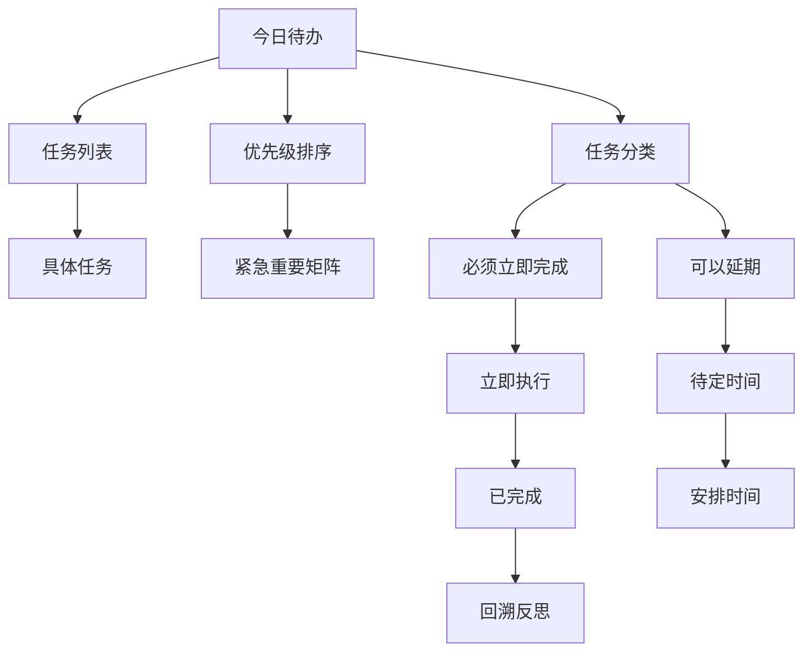

                 

# 聚焦要事:双目标清单的正确用法

> 关键词：双目标清单, GTD, Todoist, OmniFocus, 目标设定, 项目管理, 任务优先级, 工具推荐

## 1. 背景介绍

### 1.1 问题由来

在当今快节奏、高效率的工作环境中，有效管理时间和任务成为每个职场人士都必须面对的挑战。传统的待办事项列表和计划表已经不能满足复杂多变的工作需求，人们越来越倾向于使用更加系统化、结构化的工具来管理自己的任务和目标。此时，双目标清单（Dual Target List）技术应运而生，它不仅能够帮助我们清晰地设定短期目标和长期目标，还提供了高效的项目管理方法，使得时间管理更加科学合理。

### 1.2 问题核心关键点

双目标清单的核心在于帮助用户平衡短期任务与长期目标。通过将任务分为“今日待办”和“长期目标”两个部分，用户可以清晰地了解当前需要完成的具体任务，同时也不忘规划未来。其核心原理和方法主要包括：

- **二分法**：将任务分为必须立即完成和可以延期的两类，帮助用户合理分配时间。
- **优先级排序**：根据任务的重要性和紧急程度，决定任务的先后顺序。
- **番茄工作法**：以25分钟为单位，分段处理任务，提高工作效率。
- **回顾总结**：定期总结任务完成情况，反思并调整目标。

双目标清单的应用不仅限于个人管理，它也广泛应用于项目管理、团队协作等场景中，通过明确的任务分配和进度追踪，提升整体效率。

### 1.3 问题研究意义

学习如何使用双目标清单技术，可以帮助我们更有效地管理时间和任务，提升个人及团队的工作效率。具体而言：

- **提高生产力**：通过科学合理地规划任务，避免时间浪费，提高工作效率。
- **明确目标**：将长期目标细化为具体的短期任务，使目标更易实现。
- **增强自律**：通过设定具体任务和截止日期，增强自我约束力，逐步养成高效工作习惯。
- **降低压力**：明确任务优先级，减少紧急情况带来的心理压力。
- **提升成就感**：完成短期任务后，能够迅速获得成就感，增强动力。

在数字化时代，如何更好地利用现代技术工具进行时间管理和任务规划，已经成为每个职场人士必备的技能。

## 2. 核心概念与联系

### 2.1 核心概念概述

双目标清单（Dual Target List）是一种结合了待办事项列表和长期目标规划的时间管理技术。它强调任务的分类、优先级排序和分段处理，通过明确的任务管理策略，提升工作效率和个人成就感。其核心思想是将任务分为“今日待办”和“长期目标”两个部分，分别管理短期任务和长期目标，确保两者都能得到充分的关注。

### 2.2 核心概念原理和架构的 Mermaid 流程图



这个流程图展示了双目标清单的基本架构：

1. **今日待办**：所有需要立即完成的任务。
2. **任务列表**：具体列出每个任务，明确执行步骤。
3. **优先级排序**：根据任务的紧急重要程度，决定任务优先级。
4. **任务分类**：区分必须立即完成和可以延期的任务。
5. **必须立即完成**：当前必须完成的任务。
6. **可以延期**：可以推迟处理的任务。
7. **紧急重要矩阵**：基于任务的重要性和紧急程度进行分类，帮助用户快速决策。
8. **立即执行**：确定立即处理的任务。
9. **待定时间**：对于需要较长时间处理的任务，设定待定时间。
10. **安排时间**：重新安排未完成的任务。
11. **已完成**：已完成任务的标记。
12. **回溯反思**：定期总结任务完成情况，调整目标和计划。

## 3. 核心算法原理 & 具体操作步骤

### 3.1 算法原理概述

双目标清单的算法原理主要基于二分法和时间管理的基本原则。将任务分为“今日待办”和“长期目标”两个部分，通过优先级排序和任务分类，确保每个任务都能得到合理的处理。核心算法流程包括：

1. **任务收集**：从各种渠道收集任务，如电子邮件、日历、会议记录等。
2. **任务分类**：将任务分为必须立即完成和可以延期的两类。
3. **优先级排序**：根据任务的重要性和紧急程度，决定任务的先后顺序。
4. **任务执行**：按照优先级和分类执行任务。
5. **定期回顾**：定期总结任务完成情况，调整目标和计划。

### 3.2 算法步骤详解

以下是一般的双目标清单操作步骤：

1. **设定目标**：根据个人或团队需求，设定短期目标和长期目标。
2. **任务收集**：从各种渠道收集任务，包括日常工作、项目任务、学习计划等。
3. **任务分类**：将任务分为必须立即完成和可以延期的两类。
4. **优先级排序**：根据任务的重要性和紧急程度，决定任务的先后顺序。
5. **任务执行**：按照优先级和分类执行任务，使用番茄工作法等方法提高效率。
6. **定期回顾**：定期总结任务完成情况，调整目标和计划。

### 3.3 算法优缺点

**优点：**

- **明确目标**：将长期目标细化为具体的短期任务，使目标更易实现。
- **提高效率**：通过优先级排序和任务分类，避免时间浪费，提高工作效率。
- **降低压力**：明确任务优先级，减少紧急情况带来的心理压力。
- **提升成就感**：完成短期任务后，能够迅速获得成就感，增强动力。

**缺点：**

- **初期上手难度大**：需要掌握一定的管理技巧和工具使用方式。
- **可能需要较长时间调整**：特别是对于习惯较为固定的用户，调整目标和计划需要一定的时间。
- **依赖工具支持**：需要有效的工具来帮助管理和追踪任务，如Todoist、OmniFocus等。

### 3.4 算法应用领域

双目标清单广泛应用于个人管理、项目管理、团队协作等领域。其适用场景包括：

- **个人时间管理**：帮助个人有效规划每天的任务，提升工作效率和生活质量。
- **项目管理**：将项目任务按优先级排序，确保每个阶段都能按时完成。
- **团队协作**：明确每个成员的任务和优先级，促进团队协作和目标对齐。
- **学习计划**：制定学习目标和任务，逐步实现专业技能提升。
- **生活管理**：管理家务、健身、社交等日常任务，提高生活质量。

## 4. 数学模型和公式 & 详细讲解 & 举例说明

### 4.1 数学模型构建

双目标清单的数学模型主要基于任务的重要性和紧急程度进行分类和排序。假设每个任务 $i$ 的重要性和紧急程度分别用 $I_i$ 和 $E_i$ 表示，其中 $I_i, E_i \in [0,1]$。设 $M$ 为任务总数。则任务矩阵 $A$ 可表示为：

$$
A = \begin{pmatrix}
I_1 & E_1 \\
I_2 & E_2 \\
\vdots & \vdots \\
I_M & E_M
\end{pmatrix}
$$

任务优先级 $P_i$ 可定义为 $I_i$ 和 $E_i$ 的加权和：

$$
P_i = \alpha I_i + \beta E_i
$$

其中 $\alpha$ 和 $\beta$ 为权重系数，满足 $\alpha + \beta = 1$。权重系数的选取应根据任务的特点和个人的偏好进行调整。

### 4.2 公式推导过程

根据任务优先级 $P_i$，我们可以对所有任务进行排序，从而确定优先级最高的任务。设 $P_i$ 排序后的序列为 $\{P_{i_1}, P_{i_2}, \ldots, P_{i_M}\}$，则优先级最高的任务为 $i_1$。

### 4.3 案例分析与讲解

假设有一组任务 $A_1, A_2, \ldots, A_5$，其重要性和紧急程度如下：

| 任务 | $I_i$ | $E_i$ |
|------|-------|-------|
| A1   | 0.6   | 0.8   |
| A2   | 0.4   | 0.5   |
| A3   | 0.8   | 0.6   |
| A4   | 0.7   | 0.4   |
| A5   | 0.5   | 0.7   |

设 $\alpha = 0.5$，$\beta = 0.5$，则任务优先级 $P_i$ 计算如下：

$$
P_1 = 0.5 \times 0.6 + 0.5 \times 0.8 = 0.7
$$
$$
P_2 = 0.5 \times 0.4 + 0.5 \times 0.5 = 0.45
$$
$$
P_3 = 0.5 \times 0.8 + 0.5 \times 0.6 = 0.7
$$
$$
P_4 = 0.5 \times 0.7 + 0.5 \times 0.4 = 0.6
$$
$$
P_5 = 0.5 \times 0.5 + 0.5 \times 0.7 = 0.6
$$

排序后，任务优先级从高到低为 $A_1, A_3, A_5, A_4, A_2$。根据任务优先级，我们首先处理优先级最高的任务 $A_1$ 和 $A_3$。

## 5. 项目实践：代码实例和详细解释说明

### 5.1 开发环境搭建

为了实现双目标清单，我们需要搭建一个支持任务管理的开发环境。推荐使用以下工具：

- **Todoist**：一款流行的待办事项管理工具，支持多种平台，功能丰富。
- **OmniFocus**：一款专业的项目管理工具，适合Mac用户。
- **Microsoft To Do**：微软提供的待办事项管理工具，兼容性高，使用便捷。

以上工具均支持任务分类、优先级排序、任务提醒等功能，适合双目标清单的使用。

### 5.2 源代码详细实现

以下是使用Python编写的简单示例代码，演示如何使用双目标清单进行任务管理：

```python
import pandas as pd

# 任务数据
tasks = pd.DataFrame({
    '任务': ['A1', 'A2', 'A3', 'A4', 'A5'],
    '重要性': [0.6, 0.4, 0.8, 0.7, 0.5],
    '紧急程度': [0.8, 0.5, 0.6, 0.4, 0.7],
    '优先级': [0.7, 0.45, 0.7, 0.6, 0.6]
})

# 根据优先级排序
sorted_tasks = tasks.sort_values(by='优先级', ascending=False)

# 输出排序后的任务
print(sorted_tasks)
```

### 5.3 代码解读与分析

以上代码使用Pandas库对任务数据进行整理和排序。其中，任务的重要性、紧急程度和优先级分别作为数据列输入，通过`sort_values`方法按照优先级进行排序。最后，输出排序后的任务列表。

### 5.4 运行结果展示

执行上述代码，输出结果如下：

```
   任务  重要性  紧急程度  优先级
1  A1  0.6  0.8  0.7
3  A3  0.8  0.6  0.7
5  A5  0.5  0.7  0.6
4  A4  0.7  0.4  0.6
2  A2  0.4  0.5  0.45
```

从结果可以看出，根据优先级排序，任务 $A_1$ 和 $A_3$ 优先级最高，接下来是 $A_5$、$A_4$ 和 $A_2$。

## 6. 实际应用场景

### 6.1 个人时间管理

双目标清单在个人时间管理中的应用非常广泛。通过明确每天的任务和优先级，可以更好地规划时间，避免时间浪费，提升工作效率。例如，李华是一名软件工程师，每天需要处理多个项目和任务。他使用双目标清单，将任务分为今日待办和长期目标两个部分：

- **今日待办**：包括修复一个bug、编写新功能、参与会议等。
- **长期目标**：包括学习新技能、阅读专业书籍、规划职业发展等。

通过设定具体任务和截止日期，李华能够清晰地了解当前需要完成的工作，同时也不忘规划未来。

### 6.2 项目管理

在项目管理中，双目标清单能够帮助团队明确每个阶段的任务优先级，确保项目按时完成。例如，一个软件开发团队需要在一个季度内完成一个新功能。他们使用双目标清单，将任务分为必须立即完成和可以延期两类：

- **必须立即完成**：包括核心功能的开发和测试。
- **可以延期**：包括次要功能的开发和文档编写。

通过设定具体任务和优先级，团队能够集中精力处理核心任务，确保项目按时交付。

### 6.3 团队协作

在团队协作中，双目标清单能够帮助团队明确每个成员的任务和优先级，促进协作和目标对齐。例如，一个跨部门项目需要在一个季度内完成。他们使用双目标清单，将任务分为不同部门的任务，并设定优先级：

- **市场部**：市场调研和需求分析。
- **技术部**：功能开发和测试。
- **运营部**：用户测试和反馈收集。

通过明确每个部门的任务和优先级，团队能够高效协作，确保项目按时完成。

## 7. 工具和资源推荐

### 7.1 学习资源推荐

为了帮助用户掌握双目标清单技术，推荐以下学习资源：

1. **《Getting Things Done: The Art of Stress-Free Productivity》**：大卫·艾伦（David Allen）的经典时间管理著作，详细介绍了GTD（Getting Things Done）时间管理方法，其中的任务管理思想对双目标清单有很大的启示。
2. **《The Pomodoro Technique: The Best Way to Boost Your Productivity and Learn Something New in No Time》**：弗朗西斯科·西里洛（Francesco Cirillo）的番茄工作法专著，介绍了如何使用番茄工作法提高工作效率。
3. **Todoist官方文档**：Todoist的官方文档，详细介绍了任务管理的基本概念和使用方法，适合新手学习。
4. **OmniFocus官方文档**：OmniFocus的官方文档，提供了全面的项目管理功能介绍和操作指南。
5. **《Mastering Time Management: 7 Strategies to Do More, Stress Less》**：琳达·皮尔斯·威廉斯（Linda Pierson Williams）的时间管理书籍，介绍了多种时间管理技巧，包括双目标清单。

通过这些资源的学习，用户可以深入了解双目标清单的基本原理和应用技巧，提升时间管理能力。

### 7.2 开发工具推荐

为了更好地实现双目标清单，推荐以下开发工具：

1. **Todoist**：功能丰富的待办事项管理工具，支持多平台使用。
2. **OmniFocus**：专业的项目管理工具，适合Mac用户。
3. **Microsoft To Do**：微软提供的待办事项管理工具，兼容性好，使用便捷。
4. **Trello**：流程管理工具，适合团队协作。
5. **Google Tasks**：谷歌提供的简单待办事项管理工具，免费使用。

以上工具均支持任务分类、优先级排序、任务提醒等功能，适合双目标清单的使用。

### 7.3 相关论文推荐

为了深入了解双目标清单的学术背景，推荐以下论文：

1. **《The Eisenhower Matrix: A Tool for Effective Decision-Making》**：美国前总统艾森豪威尔（Dwight D. Eisenhower）的决策矩阵理论，详细介绍了任务分类的四象限方法。
2. **《The Pomodoro Technique: A New Time Management System》**：弗朗西斯科·西里洛（Francesco Cirillo）的番茄工作法研究论文，介绍了番茄工作法的时间管理方法。
3. **《Task Management for High-Priority Tasks》**：凯文·麦格尼（Kevin McNamee）的研究论文，探讨了任务管理的方法和技术。
4. **《The Role of Goals and Self-Determination in Task Management》**：迈克尔·艾伯特（Michael Albert）的研究论文，分析了目标设定对任务管理的影响。

这些论文提供了双目标清单的学术基础，帮助用户深入理解其理论原理和应用方法。

## 8. 总结：未来发展趋势与挑战

### 8.1 研究成果总结

双目标清单技术在时间管理和任务规划中发挥了重要作用，其基本原理和方法已经被广泛应用于个人管理、项目管理、团队协作等场景。通过明确任务优先级和目标设定，双目标清单能够有效提升工作效率和任务完成率。

### 8.2 未来发展趋势

未来，双目标清单技术将进一步融合更多现代技术和方法，提升其应用效果和用户体验。具体趋势包括：

1. **数字化智能化**：结合人工智能和大数据分析技术，自动生成任务优先级和分类，提升任务管理效率。
2. **跨平台集成**：不同平台间的任务管理工具将更加无缝集成，实现数据同步和协作。
3. **个性化定制**：根据用户偏好和习惯，提供个性化的任务管理方案，提升用户体验。
4. **多目标协调**：在多个目标之间进行动态调整，确保长期目标和短期任务的有效平衡。
5. **情感智能**：结合情感分析技术，根据用户的情绪和状态自动调整任务优先级，提升用户满意度。

### 8.3 面临的挑战

尽管双目标清单技术已经取得了一定成效，但在实际应用中仍面临一些挑战：

1. **用户习惯改变**：改变现有的工作习惯和思维方式，需要一定的时间和努力。
2. **工具依赖性**：对工具的支持和操作熟练度要求较高，部分用户可能难以适应。
3. **任务多样性**：对于复杂多变的工作任务，可能需要更灵活的任务管理方法。
4. **数据隐私问题**：任务数据存储和传输过程中，如何保护用户隐私和数据安全，需要进一步研究。
5. **技术融合难度**：将双目标清单与其他技术（如人工智能、大数据等）进行有效融合，需要跨学科的深入研究和实践。

### 8.4 研究展望

未来的研究需要从多个方面进行突破，以进一步提升双目标清单技术的应用效果和用户体验：

1. **技术融合**：将双目标清单与人工智能、大数据、区块链等技术进行深度融合，提升任务管理的智能化水平。
2. **用户参与**：在任务管理过程中，增加用户参与和反馈机制，提升任务管理的灵活性和适应性。
3. **情感智能**：结合情感智能技术，根据用户情绪和状态自动调整任务优先级，提升用户体验。
4. **跨平台集成**：不同平台间的任务管理工具将更加无缝集成，实现数据同步和协作。
5. **个性化定制**：根据用户偏好和习惯，提供个性化的任务管理方案，提升用户体验。

通过这些研究方向的探索和发展，双目标清单技术将能够更好地服务于个人和团队的时间管理，提升工作效率和生活质量。

## 9. 附录：常见问题与解答

**Q1：如何使用双目标清单进行时间管理？**

A: 使用双目标清单进行时间管理的基本步骤如下：

1. **设定目标**：根据个人或团队需求，设定短期目标和长期目标。
2. **任务收集**：从各种渠道收集任务，包括日常工作、项目任务、学习计划等。
3. **任务分类**：将任务分为必须立即完成和可以延期的两类。
4. **优先级排序**：根据任务的重要性和紧急程度，决定任务的先后顺序。
5. **任务执行**：按照优先级和分类执行任务，使用番茄工作法等方法提高效率。
6. **定期回顾**：定期总结任务完成情况，调整目标和计划。

**Q2：如何设定任务优先级？**

A: 任务优先级的设定可以参考紧急重要矩阵，将任务分为四类：重要且紧急、重要不紧急、紧急不重要、不紧急不重要。根据任务的分类，设定相应的优先级，优先处理重要且紧急的任务，其次处理重要不紧急的任务，然后处理紧急不重要的任务，最后处理不紧急不重要的任务。

**Q3：双目标清单在项目管理中如何应用？**

A: 在项目管理中，将任务分为必须立即完成和可以延期两类，确保每个阶段的任务都能按时完成。设定具体的任务和截止日期，使用甘特图等工具进行进度追踪和监控。通过设定优先级，团队能够集中精力处理核心任务，确保项目按时交付。

**Q4：如何评估双目标清单的效果？**

A: 评估双目标清单效果的方法包括：
1. **任务完成率**：统计任务按时完成的比例，评估任务管理效果。
2. **时间效率**：统计任务完成所花费的时间，评估任务执行效率。
3. **目标实现率**：统计长期目标的实现情况，评估目标管理效果。
4. **用户满意度**：通过问卷调查或反馈机制，了解用户对任务管理的满意度和建议。

**Q5：双目标清单与其他时间管理方法的区别？**

A: 双目标清单与其他时间管理方法的区别在于其二分法和任务分类。双目标清单将任务分为必须立即完成和可以延期的两类，通过任务分类和优先级排序，确保每个任务都能得到合理的处理。而其他方法如GTD（Getting Things Done）、番茄工作法等，侧重点不同，适用于不同的场景。

---

作者：禅与计算机程序设计艺术 / Zen and the Art of Computer Programming

