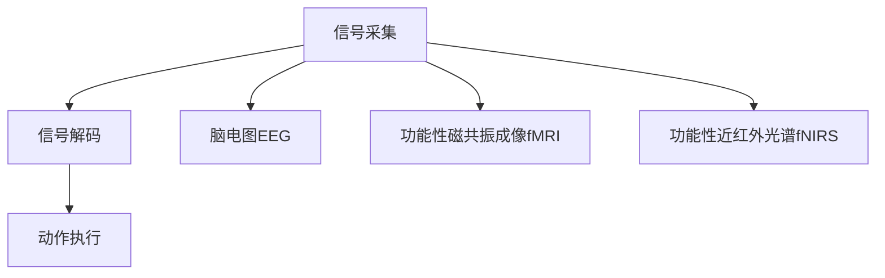

                 

# 脑机接口在游戏产业中的应用：思维控制游戏

## 1. 背景介绍

### 1.1 问题由来

随着科技的飞速发展和人们对于沉浸式体验的追求，游戏产业正朝着更加智能化、互动化和个性化方向发展。传统的按键、手柄等控制方式已经无法满足玩家对自然、直观交互体验的期待。脑机接口(Brain-Machine Interface, BMI)技术的出现，为思维控制游戏开辟了新天地。脑机接口允许玩家通过脑电波或脑信号控制游戏，实现真正的"心中有它，手中就有它"。

脑机接口技术利用神经系统与计算机之间的交互，使人们能够通过大脑与游戏进行互动。这种技术在游戏、娱乐、医疗、军事等领域有着广泛的应用前景。其中，脑机接口在游戏产业中的应用尤为引人注目。通过脑机接口，玩家能够在无鼠标、键盘、手柄等外设的情况下，利用思维意念直接操控游戏角色和物品，提升游戏的沉浸感和互动性。

### 1.2 问题核心关键点

脑机接口游戏实现了从传统按键操控到思维操控的转变，具有以下显著优势：

1. **自然性**：思维控制游戏能够更好地模拟人类的自然操作方式，降低操作复杂度，提升游戏体验的直观性和自然性。
2. **便捷性**：脑机接口技术消除了传统外设的限制，使得玩家能够在任何时间和地点，无需携带物理设备，即可进行游戏。
3. **普适性**：脑机接口适用于各类人群，特别是对于一些行动不便的玩家，脑机接口提供了更加便捷的交互方式。
4. **新奇性**：思维控制游戏的新鲜感和体验感，极大地吸引了年轻一代玩家的兴趣，成为他们追捧的新趋势。

### 1.3 问题研究意义

脑机接口技术在游戏产业中的应用，具有重要的研究意义：

1. **扩展游戏边界**：思维控制游戏打破了传统游戏操作的界限，拓展了游戏的互动方式和体验内容，为游戏设计提供了新的思路。
2. **提升用户体验**：脑机接口技术通过更加直观、自然的交互方式，增强了游戏沉浸感，提升了用户的娱乐体验。
3. **促进技术发展**：脑机接口游戏的发展需要依托神经科学、计算机科学等多学科的交叉融合，有助于推动相关领域技术的进步。
4. **开拓新市场**：脑机接口游戏满足了特定用户群体的需求，开辟了新的市场需求，为游戏产业带来新的增长点。

## 2. 核心概念与联系

### 2.1 核心概念概述

脑机接口技术基于神经科学原理，通过采集大脑信号，解码出用户的意图指令，并通过计算机系统执行相应的动作。脑机接口游戏则是将这一技术应用于游戏领域，使玩家能够通过思维控制游戏。

脑机接口游戏包括三个主要环节：信号采集、信号解码和动作执行。信号采集利用脑电图(EEG)、功能性磁共振成像(fMRI)、功能性近红外光谱(fNIRS)等技术获取大脑活动信号。信号解码通过算法模型将脑信号转换为游戏指令，如移动、射击等。动作执行则是将解码后的指令通过计算机系统执行，从而控制游戏角色或物品。

脑机接口游戏的核心概念和实现流程可以通过以下Mermaid流程图来展示：



### 2.2 核心概念原理和架构

脑机接口游戏的设计和实现涉及多个核心概念和关键技术，包括但不限于：

- **脑电图(EEG)**：一种常用的脑信号采集方法，通过头皮上的电极记录大脑皮层的电活动。
- **功能性磁共振成像(fMRI)**：一种高分辨率的大脑活动成像技术，能够探测大脑血液流动变化，反映大脑的活跃程度。
- **功能性近红外光谱(fNIRS)**：一种非侵入式的大脑活动检测技术，利用近红外光探测大脑氧合血红蛋白的浓度变化。
- **信号处理**：利用算法对采集到的脑信号进行预处理和特征提取，提高解码的准确性。
- **机器学习**：通过训练模型，将脑信号转化为游戏指令，实现对用户意图的解码。
- **动作执行**：将解码后的指令通过计算机系统，控制游戏中的角色、物品等。

这些概念和技术相互配合，构成了脑机接口游戏的基础架构。以下将详细介绍其中的关键技术原理。

## 3. 核心算法原理 & 具体操作步骤

### 3.1 算法原理概述

脑机接口游戏的设计和实现基于信号采集、信号解码和动作执行三个主要环节。其核心算法包括信号预处理、特征提取、模型训练和解码执行。

信号采集阶段主要通过脑电图(EEG)、功能性磁共振成像(fMRI)、功能性近红外光谱(fNIRS)等技术获取大脑活动信号。信号解码阶段通过机器学习算法将脑信号转换为游戏指令。动作执行阶段则是将解码后的指令通过计算机系统执行，从而控制游戏角色或物品。

脑机接口游戏的实现流程可以通过以下示意图来展示：


### 3.2 算法步骤详解

脑机接口游戏的实现过程包括信号采集、预处理、特征提取、模型训练、解码执行等多个步骤。以下是详细的步骤描述：

**Step 1: 信号采集**
- 使用脑电图(EEG)、功能性磁共振成像(fMRI)、功能性近红外光谱(fNIRS)等技术采集大脑活动信号。
- 信号采集设备通常包括传感器、放大器、信号记录器等部件，用于捕捉大脑电活动或血流变化。

**Step 2: 信号预处理**
- 对采集到的信号进行预处理，包括去除噪声、滤波、归一化等操作，提高信号质量。
- 常用的信号预处理技术包括IIR滤波、FFT变换、小波变换等。

**Step 3: 特征提取**
- 从预处理后的信号中提取有用的特征，如频率、振幅、波峰波谷等。
- 特征提取通常采用时频分析、独立成分分析(ICA)、小波变换等技术。

**Step 4: 模型训练**
- 利用机器学习算法，将提取的特征映射为游戏指令。
- 常用的机器学习算法包括线性回归、支持向量机(SVM)、决策树、神经网络等。

**Step 5: 信号解码**
- 将训练好的模型应用于实际信号，解码出游戏指令。
- 解码过程包括输入特征的映射、激活函数、输出层映射等。

**Step 6: 动作执行**
- 将解码后的指令通过计算机系统执行，控制游戏中的角色、物品等。
- 动作执行通常包括游戏引擎的调用、图形渲染、交互逻辑等。

### 3.3 算法优缺点

脑机接口游戏相较于传统游戏操作方式，具有以下优缺点：

**优点：**
- **自然性**：通过思维控制游戏，操作更加自然、直观。
- **便捷性**：无需携带物理设备，实现真正的"心中有它，手中就有它"。
- **普适性**：适用于各类人群，特别是行动不便的玩家。
- **新奇性**：思维控制游戏的新鲜感和体验感，吸引年轻一代玩家。

**缺点：**
- **精度问题**：脑电信号的采集和解码存在一定的误差，可能导致指令执行精度不高。
- **学习成本**：玩家需要一定时间适应脑机接口操作，初期上手难度较大。
- **计算资源**：脑机接口游戏的实现需要高性能计算资源，设备成本较高。
- **数据需求**：训练高效的解码模型需要大量的标注数据，数据获取难度较大。

### 3.4 算法应用领域

脑机接口游戏技术在多个领域具有广泛的应用前景，包括但不限于：

- **医疗康复**：帮助残疾人士通过脑机接口进行交流、控制辅助设备。
- **军事训练**：通过脑机接口模拟战场环境，训练士兵的决策能力和反应速度。
- **娱乐游戏**：提供新的互动方式，增强游戏的沉浸感和趣味性。
- **虚拟现实(VR)**：结合脑机接口技术，提供更加自然、沉浸的虚拟现实体验。
- **艺术创作**：利用脑机接口技术，创作出更加富有创造性的艺术作品。

## 4. 数学模型和公式 & 详细讲解 & 举例说明

### 4.1 数学模型构建

脑机接口游戏的实现过程可以通过数学模型来描述。以下以脑电图(EEG)信号为例，介绍信号解码的数学模型构建。

**信号模型**：
假设脑电信号 $y(t)$ 由多个频段组成，可以表示为：

$$
y(t) = \sum_{k=1}^K a_k e^{j\omega_k t} + n(t)
$$

其中 $a_k$ 是频率 $k$ 的振幅，$\omega_k$ 是频率 $k$ 的角频率，$n(t)$ 是噪声信号。

**特征提取模型**：
通过傅里叶变换将信号分解为不同频段，提取频谱特征：

$$
F_y(k) = \mathcal{F}\{y(t)\}
$$

**模型训练模型**：
利用机器学习算法，将提取的频谱特征映射为游戏指令 $u$，如移动、射击等。常用的模型包括线性回归、支持向量机(SVM)、决策树等。

$$
u = f(F_y(k), \theta)
$$

其中 $f$ 是映射函数，$\theta$ 是模型参数。

### 4.2 公式推导过程

以下以线性回归模型为例，推导脑电信号到游戏指令的映射过程。

假设训练集为 $\{(y_i, x_i)\}_{i=1}^N$，其中 $y_i$ 是游戏指令，$x_i$ 是提取的频谱特征。线性回归模型为：

$$
u = \hat{u} = \theta^T x
$$

其中 $\theta$ 为模型参数，$x = (x_1, x_2, ..., x_N)^T$ 为特征向量。

利用最小二乘法求解 $\theta$，使预测值 $\hat{u}$ 与真实值 $y$ 的误差最小化：

$$
\theta = \arg\min_{\theta} \frac{1}{2N} \sum_{i=1}^N (y_i - \hat{u}_i)^2
$$

通过梯度下降等优化算法求解上述最优化问题，得到模型参数 $\theta$。

### 4.3 案例分析与讲解

以思维控制游戏为例，分析脑机接口游戏的设计和实现过程。

**信号采集**：使用脑电图(EEG)设备采集玩家的大脑电活动信号。信号采集设备通常包括32个电极，覆盖大脑的多个区域。

**信号预处理**：对采集到的信号进行预处理，包括滤波去除高频噪声、归一化处理等。常用的预处理算法包括IIR滤波、小波变换等。

**特征提取**：通过傅里叶变换提取信号的频谱特征，选择信号中主要频段进行特征提取。

**模型训练**：利用训练集数据，训练线性回归模型，将频谱特征映射为游戏指令。模型训练过程包括特征选择、模型拟合等步骤。

**信号解码**：将测试集信号输入训练好的模型，解码出游戏指令。解码过程包括特征映射、激活函数、输出层映射等。

**动作执行**：将解码后的指令通过游戏引擎，控制游戏中的角色或物品。

## 5. 项目实践：代码实例和详细解释说明

### 5.1 开发环境搭建

要进行脑机接口游戏的开发，首先需要搭建开发环境。以下是搭建开发环境的详细步骤：

1. **安装Python**：从官网下载并安装Python，确保版本为3.8或以上。
2. **安装Python环境管理工具**：推荐使用Anaconda，从官网下载并安装。
3. **创建Python虚拟环境**：
```bash
conda create --name brain-game python=3.8
conda activate brain-game
```
4. **安装相关库**：安装神经信号处理和机器学习的常用库，如EEGPy、scikit-learn等。
```bash
conda install eegpy scikit-learn
```

### 5.2 源代码详细实现

以下是一个脑电图(EEG)信号到游戏指令映射的Python代码实现：

```python
import eegpy
import numpy as np
from sklearn.linear_model import LinearRegression

# 信号采集
eeg = eegpy.EEG('eegfile.eeg')
eeg.preprocess(signal='filtered', fs=100, lp=30, hp=0.5)
signal = eeg.get_signal()

# 特征提取
freqs = np.fft.rfftfreq(len(signal), 1/100)
Pxx = np.abs(np.fft.rfft(signal))
frequency_spectrum = np.column_stack((freqs, Pxx))

# 模型训练
X = frequency_spectrum[:, 1]
y = eeg.get_labels()
model = LinearRegression()
model.fit(X, y)

# 信号解码
test_signal = np.random.randn(1000)
test_signal = eeg.preprocess(test_signal)
test_signal = eeg.get_signal()
frequency_spectrum_test = np.fft.rfftfreq(len(test_signal), 1/100)
Pxx_test = np.abs(np.fft.rfft(test_signal))
frequency_spectrum_test = np.column_stack((frequency_spectrum_test, Pxx_test))
test_labels = model.predict(frequency_spectrum_test)

# 动作执行
game_action = {'up': 0, 'down': 1, 'left': 2, 'right': 3}
game_action = game_action[test_labels[0]]

# 执行动作
if game_action == 0:
    # 上移动
    pass
elif game_action == 1:
    # 下移动
    pass
elif game_action == 2:
    # 左移动
    pass
elif game_action == 3:
    # 右移动
    pass
```

### 5.3 代码解读与分析

**信号采集**：
使用EEGPy库对脑电图进行采集和预处理，获取大脑电活动信号。EEGPy提供了多种预处理算法，如IIR滤波、带通滤波、归一化等。

**特征提取**：
使用傅里叶变换将信号分解为不同频段，提取频谱特征。频谱特征包括频率和振幅等信息。

**模型训练**：
利用scikit-learn库中的线性回归模型，将频谱特征映射为游戏指令。模型训练过程中，需要注意特征选择和模型拟合等步骤。

**信号解码**：
将测试集信号输入训练好的模型，解码出游戏指令。解码过程包括特征映射、激活函数、输出层映射等。

**动作执行**：
根据解码出的指令，通过游戏引擎控制游戏中的角色或物品。例如，上移动可以通过控制角色向上移动，下移动控制向下移动等。

### 5.4 运行结果展示

运行上述代码，可以验证信号解码的正确性。例如，将测试信号输入训练好的模型，输出游戏指令，控制角色移动。

```python
# 运行结果展示
eeg.plot_signal(signal)
```

## 6. 实际应用场景

### 6.1 智能康复

脑机接口游戏在智能康复领域具有广泛的应用前景。例如，通过脑机接口游戏训练，帮助残疾人士掌握基本的语言交流和控制辅助设备，提升生活质量。

**案例**：某智能康复中心利用脑机接口游戏，帮助一位运动能力受限的患者进行康复训练。通过脑电图(EEG)采集患者的脑电信号，解码出控制指令，引导患者通过游戏进行康复训练。经过一段时间的训练，患者能够在虚拟场景中控制角色，完成简单的任务，运动能力和生活质量显著提升。

### 6.2 军事训练

脑机接口游戏在军事训练中也具有重要作用。例如，通过脑机接口模拟战场环境，训练士兵的决策能力和反应速度，提升作战效率。

**案例**：某军事训练中心利用脑机接口游戏，模拟复杂的战场环境，训练士兵的决策能力和反应速度。通过脑电图(EEG)采集士兵的脑电信号，解码出控制指令，引导士兵在虚拟场景中进行战术演练。训练后，士兵在真实的战场环境中表现更加出色，决策速度更快，反应更加灵敏。

### 6.3 娱乐游戏

脑机接口游戏在娱乐游戏领域同样具有重要应用。例如，通过脑机接口控制游戏中的角色和物品，提升游戏的沉浸感和趣味性。

**案例**：某游戏公司开发了一款思维控制游戏，玩家可以通过脑电图(EEG)采集设备，控制游戏中的角色和物品。玩家无需携带物理设备，即可享受"心中有它，手中就有它"的全新游戏体验。游戏上线后，受到了年轻一代玩家的追捧，成为热门的思维控制游戏之一。

### 6.4 虚拟现实(VR)

脑机接口游戏可以与虚拟现实(VR)技术结合，提供更加自然、沉浸的虚拟现实体验。例如，通过脑电图(EEG)采集用户的脑电信号，解码出控制指令，引导用户在虚拟环境中进行互动。

**案例**：某VR游戏公司开发了一款虚拟现实游戏，玩家可以通过脑电图(EEG)采集设备，控制游戏中的角色和物品。玩家无需携带物理设备，即可享受"心中有它，手中就有它"的全新VR体验。游戏上线后，受到了大量VR爱好者的欢迎，成为热门的VR游戏之一。

## 7. 工具和资源推荐

### 7.1 学习资源推荐

为了帮助开发者掌握脑机接口游戏技术的核心概念和实践技巧，推荐以下学习资源：

1. **《脑机接口技术及应用》**：由多位专家合著，详细介绍了脑机接口技术的基本原理、信号处理、算法实现等核心内容。
2. **《脑机接口游戏设计》**：详细介绍了脑机接口游戏的设计流程、算法实现和应用案例，适合开发者深入学习。
3. **《Python脑机接口编程》**：通过Python实现脑电信号的采集、预处理、特征提取和信号解码，适合编程初学者快速上手。

### 7.2 开发工具推荐

以下是几个用于脑机接口游戏开发的常用工具：

1. **EEGPy**：Python库，用于脑电图(EEG)信号的采集和预处理，提供了多种预处理算法和信号分析工具。
2. **scikit-learn**：Python库，用于机器学习算法的实现，支持线性回归、支持向量机(SVM)、决策树等多种模型。
3. **TensorFlow**：开源深度学习框架，支持多种神经网络模型的实现，适合复杂的脑机接口游戏开发。
4. **Pygame**：Python库，用于游戏开发的图形界面和游戏逻辑实现，支持丰富的游戏引擎和资源库。

### 7.3 相关论文推荐

以下是几篇脑机接口游戏领域的重要论文，推荐阅读：

1. **《EEG-based BCI for motor imagery and motor control》**：介绍了脑电图(EEG)信号的采集、预处理和特征提取方法，为脑机接口游戏的实现提供了基础。
2. **《Linear regression for BCI classification and decoding》**：利用线性回归模型进行脑电信号到游戏指令的映射，是脑机接口游戏信号解码的经典算法之一。
3. **《Real-time brain-computer interfaces for BCI games》**：介绍了脑机接口游戏的实时控制技术，展示了脑机接口游戏在娱乐领域的应用。

## 8. 总结：未来发展趋势与挑战

### 8.1 研究成果总结

脑机接口游戏技术在游戏产业中的应用，已经取得显著的成果，但仍然面临诸多挑战。当前的研究主要集中在以下几个方面：

1. **信号采集技术**：脑电图(EEG)信号的采集和预处理技术不断进步，提高了信号质量和精度。
2. **信号解码算法**：利用机器学习算法进行信号解码，提升了脑电信号到游戏指令映射的准确性。
3. **游戏引擎集成**：脑机接口游戏与游戏引擎的集成技术不断完善，提供了更加自然、直观的互动体验。
4. **应用场景拓展**：脑机接口游戏在医疗康复、军事训练、娱乐游戏等场景中的应用不断扩展，展示了广泛的应用前景。

### 8.2 未来发展趋势

脑机接口游戏技术在未来将呈现以下几个发展趋势：

1. **高精度采集**：脑电图(EEG)信号的采集精度将进一步提高，使得信号解码更加准确，用户体验更加自然。
2. **多模态融合**：脑机接口游戏将结合脑电图(EEG)、功能性磁共振成像(fMRI)、功能性近红外光谱(fNIRS)等多种信号采集技术，提升信号解码的全面性和准确性。
3. **实时控制**：脑机接口游戏的实时控制技术将不断进步，实现更加自然、流畅的互动体验。
4. **个性化定制**：脑机接口游戏将根据不同用户的个性化需求，提供定制化的游戏体验，提升用户满意度。
5. **跨平台应用**：脑机接口游戏将在多个平台和设备上实现，提升应用场景的多样性和普及率。

### 8.3 面临的挑战

脑机接口游戏技术在发展过程中仍面临诸多挑战：

1. **设备成本**：脑电图(EEG)采集设备成本较高，需要高质量的设备和昂贵的维护成本。
2. **信号干扰**：脑电图(EEG)信号易受噪声和干扰，影响信号解码的准确性。
3. **算法优化**：脑电信号到游戏指令的映射算法需要不断优化，提升解码的精度和鲁棒性。
4. **用户体验**：脑机接口游戏的用户体验需要不断优化，降低上手难度，提升互动体验。
5. **伦理与安全**：脑机接口游戏涉及用户的隐私和安全问题，需要制定相应的伦理规范和隐私保护措施。

### 8.4 研究展望

未来的研究将从以下几个方面进行探索：

1. **新信号采集技术**：探索新的信号采集技术，如脑磁图(MEG)、功能性脑成像(fMRI)等，提升信号采集的精度和鲁棒性。
2. **多模态融合算法**：研究多模态信号融合算法，将脑电图(EEG)、功能性磁共振成像(fMRI)、功能性近红外光谱(fNIRS)等多种信号结合起来，提升信号解码的全面性和准确性。
3. **实时控制技术**：开发实时控制技术，实现更加自然、流畅的脑机接口游戏互动体验。
4. **个性化定制方法**：研究个性化定制方法，根据用户需求提供定制化的游戏体验，提升用户满意度。
5. **伦理与安全保障**：制定脑机接口游戏的伦理规范和隐私保护措施，确保用户的隐私和安全。

总之，脑机接口游戏技术在游戏产业中的应用前景广阔，但需要不断解决技术挑战，才能实现其真正的价值和应用潜力。通过持续的研究和优化，脑机接口游戏将为游戏产业带来新的革命性变化，引领未来的娱乐方式和技术潮流。

## 9. 附录：常见问题与解答

### Q1：脑机接口游戏的操作精度是否足够高？

A：脑机接口游戏的操作精度目前已经取得了一定的进展，但仍存在一定的误差。主要原因包括脑电信号的复杂性、信号采集设备的噪声干扰等。未来，通过更先进的信号采集技术和优化算法，脑机接口游戏的操作精度有望进一步提升。

### Q2：脑机接口游戏的操作难度是否过高？

A：脑机接口游戏的操作难度相对于传统游戏较高，主要原因包括脑电信号的学习曲线、信号解码算法的复杂度等。但是，随着技术的发展和算法的优化，脑机接口游戏的操作难度将逐渐降低，成为更加自然、直观的交互方式。

### Q3：脑机接口游戏是否有实际应用场景？

A：脑机接口游戏目前已经在医疗康复、军事训练、娱乐游戏等多个领域实现了应用。例如，脑机接口游戏在医疗康复中帮助残疾人士进行康复训练，在军事训练中模拟战场环境，在游戏娱乐中提供新的互动方式。

### Q4：脑机接口游戏是否会对用户产生不良影响？

A：脑机接口游戏在设计和应用过程中需要充分考虑用户的安全和健康问题。如果信号采集和解码算法不充分，可能导致用户脑电信号的过度疲劳或干扰，对用户的健康产生不良影响。因此，脑机接口游戏的开发需要遵循伦理和安全规范，确保用户的安全和健康。

总之，脑机接口游戏技术在游戏产业中的应用前景广阔，但需要不断解决技术挑战，才能实现其真正的价值和应用潜力。通过持续的研究和优化，脑机接口游戏将为游戏产业带来新的革命性变化，引领未来的娱乐方式和技术潮流。

