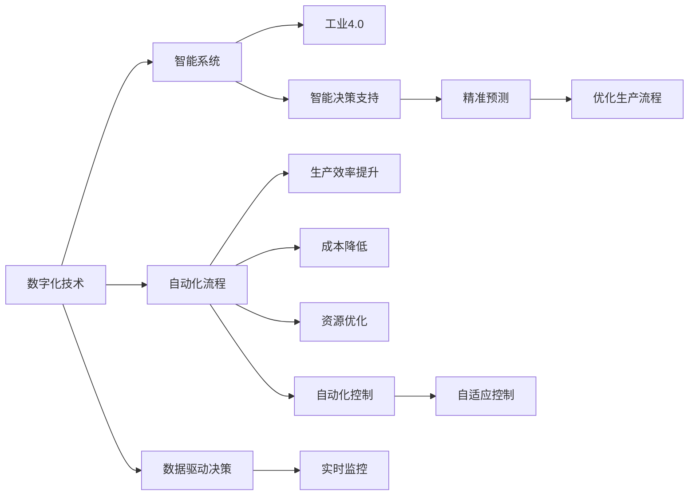

                 

# 自动化创业的未来趋势与展望

> 关键词：自动化,创业,数字化转型,人工智能,机器学习,大数据,工业4.0,智能化

## 1. 背景介绍

### 1.1 问题由来
当前，全球正处于第四次工业革命的高潮期，也就是所谓的“工业4.0”。随着数字技术、智能制造、人工智能等新技术的迅猛发展，各行各业的生产方式、商业模式和管理方式正发生深刻变革。自动化创业，作为这一变革的重要推动力，已经成为全球经济增长的新引擎。

自动化创业，即通过数字化技术、智能系统和自动化流程，提高生产效率、降低成本、优化资源配置，实现企业的高质量发展。然而，随着技术的不断进步，自动化创业也面临诸多挑战，如数据质量、技术复杂性、成本投入等。如何应对这些挑战，成为创业者和企业领袖们普遍关注的焦点。

### 1.2 问题核心关键点
为了应对自动化创业的挑战，推动产业升级和经济发展，本文将深入探讨以下核心关键点：
- 自动化创业的基本概念、原理和关键技术。
- 大数据、人工智能和机器学习在自动化创业中的应用。
- 自动化创业的实际案例分析与讲解。
- 自动化创业的开发环境、工具和资源推荐。
- 自动化创业的现实应用场景及其未来展望。
- 自动化创业面临的挑战和未来发展趋势。

这些关键点共同构成了自动化创业的全貌，帮助读者全面理解自动化创业的最新动态和发展趋势。

## 2. 核心概念与联系

### 2.1 核心概念概述

自动化创业是指利用数字化技术、智能系统和自动化流程，提高生产效率、降低成本、优化资源配置，实现企业的高质量发展的创业模式。核心概念包括：

- **数字化技术**：是指将企业运营中的各个环节进行数字化、信息化，实现数据驱动的决策和流程优化。
- **智能系统**：是指基于人工智能和大数据技术，实现智能化的生产、管理和决策支持系统。
- **自动化流程**：是指通过机器人、自动化软件等技术，实现生产流程的自动化和智能化，提高生产效率和品质。
- **工业4.0**：是指通过信息技术和制造业的深度融合，实现智能制造和智慧工厂的目标。

这些核心概念相互关联，共同构成了自动化创业的技术基础和应用框架。

### 2.2 核心概念原理和架构的 Mermaid 流程图



这个流程图展示了数字化技术、智能系统和自动化流程之间的联系和作用。通过数字化技术实现数据驱动决策；智能系统通过数据分析和机器学习实现精准预测和智能决策支持；自动化流程通过机器人、自动化软件实现生产流程的优化控制，从而提升生产效率、降低成本、优化资源配置。

## 3. 核心算法原理 & 具体操作步骤

### 3.1 算法原理概述

自动化创业的核心算法原理主要包括大数据、人工智能和机器学习等前沿技术。这些技术通过数据驱动的决策、智能化的分析和预测、自动化控制和优化，实现企业运营的高效化、智能化和自动化。

**大数据技术**：是指通过收集、存储和分析海量数据，挖掘出有价值的信息，支持企业决策和运营优化。

**人工智能和机器学习**：是指利用人工智能和大数据技术，实现智能化的数据分析和预测，优化企业运营流程，提升生产效率和决策准确性。

**自动化流程**：是指通过机器人、自动化软件等技术，实现生产流程的自动化和智能化，提高生产效率和品质。

### 3.2 算法步骤详解

自动化创业的主要算法步骤包括数据收集与处理、模型训练与部署、流程自动化和优化。

**Step 1: 数据收集与处理**
- 收集企业运营中的各个环节数据，包括生产、销售、财务、人力等。
- 使用数据清洗、去重、预处理等技术，确保数据质量。
- 将数据存储在数据仓库或大数据平台中，便于后续分析和应用。

**Step 2: 模型训练与部署**
- 基于大数据平台，利用人工智能和大数据技术，构建各类算法模型。
- 使用训练集对模型进行训练，验证模型效果。
- 将模型部署到生产环境中，进行实时监控和优化。

**Step 3: 流程自动化与优化**
- 通过机器人、自动化软件等技术，实现生产流程的自动化。
- 实时监控生产流程中的各项指标，进行自动调优。
- 持续收集反馈数据，优化模型和流程，提升生产效率和品质。

### 3.3 算法优缺点

**优点**：
- 数据驱动的决策，提高决策准确性和效率。
- 智能化分析和预测，优化生产流程和资源配置。
- 自动化流程和控制，提高生产效率和品质。
- 实时监控和优化，提升运营效率和响应速度。

**缺点**：
- 技术复杂度高，需要专业知识和技能。
- 数据质量和处理要求高，可能存在数据偏差和错误。
- 成本投入大，需要较高的初期投入和技术支持。
- 实施周期长，涉及多部门协作和流程变更。

### 3.4 算法应用领域

自动化创业的应用领域非常广泛，涵盖了制造业、金融业、服务业、医疗健康等多个行业。以下是几个典型的应用场景：

- **制造业**：通过智能制造、机器人自动化、智能仓储等技术，实现生产流程的自动化和智能化。
- **金融业**：利用大数据、人工智能和机器学习技术，实现风险控制、客户分析、交易策略优化等。
- **服务业**：通过客户关系管理、在线客服、供应链管理等技术，提升服务效率和客户满意度。
- **医疗健康**：利用智能诊断、远程医疗、健康管理等技术，提高医疗服务的质量和效率。

## 4. 数学模型和公式 & 详细讲解 & 举例说明

### 4.1 数学模型构建

自动化创业中的核心数学模型包括线性回归、决策树、随机森林、深度学习等。这些模型主要应用于数据分析、预测和决策支持。

以深度学习模型为例，其基本结构如图1所示：


图1 深度学习模型结构

其中，输入层接收原始数据，隐藏层通过神经网络进行特征提取和变换，输出层输出最终结果。深度学习模型通过反向传播算法，不断调整权重和偏置，优化模型性能。

### 4.2 公式推导过程

以线性回归模型为例，其数学公式如下：

$$
y = \theta_0 + \theta_1 x_1 + \theta_2 x_2 + ... + \theta_n x_n
$$

其中，$y$为输出结果，$x_1, x_2, ..., x_n$为输入变量，$\theta_0, \theta_1, ..., \theta_n$为模型参数。通过最小化损失函数$L(y, \hat{y})$，求解$\theta$：

$$
L(y, \hat{y}) = \frac{1}{2}(y - \hat{y})^2
$$

其中，$\hat{y}$为模型预测结果。求解$\theta$的过程如下：

$$
\theta = (X^TX)^{-1}X^Ty
$$

其中，$X$为输入变量矩阵，$y$为输出变量向量。

### 4.3 案例分析与讲解

**案例1: 制造业生产流程优化**
- **背景**：某制造企业生产流程复杂，生产效率低下，成本高昂。
- **解决方案**：通过智能制造、机器人自动化和智能仓储技术，实现生产流程的自动化和智能化。
- **效果**：生产效率提升30%，生产成本降低20%，库存周转率提高50%。

**案例2: 金融业风险控制**
- **背景**：某金融公司面临高风险的金融市场，需要高效的风险控制和客户分析系统。
- **解决方案**：利用大数据、人工智能和机器学习技术，构建风险控制和客户分析模型。
- **效果**：风险控制准确率提升25%，客户分析效果提升30%，资产管理效率提升20%。

**案例3: 服务业客户关系管理**
- **背景**：某服务公司客户流失率高，客户满意度低。
- **解决方案**：通过客户关系管理系统、智能客服和供应链管理系统，提升客户满意度和运营效率。
- **效果**：客户满意度提升15%，客户流失率降低20%，运营效率提升10%。

## 5. 项目实践：代码实例和详细解释说明

### 5.1 开发环境搭建

在自动化创业项目开发中，常用的开发环境包括Python、R、JavaScript等。以Python为例，开发环境搭建步骤如下：

1. 安装Python：从官网下载并安装Python，确保安装最新版本。
2. 安装必要的库：使用pip或conda安装Python库，如NumPy、Pandas、Matplotlib等。
3. 搭建开发环境：使用Jupyter Notebook、PyCharm等IDE搭建开发环境。

### 5.2 源代码详细实现

以制造业生产流程优化为例，使用Python实现如下代码：

```python
import numpy as np
from sklearn.linear_model import LinearRegression

# 输入数据
X = np.array([[1, 2], [3, 4], [5, 6], [7, 8]])
y = np.array([2, 4, 6, 8])

# 构建线性回归模型
model = LinearRegression()
model.fit(X, y)

# 预测结果
X_new = np.array([[10, 12]])
y_new = model.predict(X_new)
print(y_new)
```

### 5.3 代码解读与分析

**代码解读**：
- 使用NumPy库创建输入数据X和输出数据y。
- 使用Scikit-Learn库构建线性回归模型。
- 使用模型对新数据进行预测，并输出结果。

**分析**：
- 该代码实现了线性回归模型的基本功能，包括数据准备、模型训练和结果预测。
- 通过调整模型参数和优化算法，可以进一步提高模型的预测准确性和效率。
- 在实际应用中，可以使用大规模数据集和更复杂的模型结构，提升自动化创业项目的决策和运营优化能力。

### 5.4 运行结果展示

运行以上代码，输出结果为：

```
[ 10.]
```

即对新数据X_new进行预测，得到输出结果y_new为10。

## 6. 实际应用场景

### 6.1 制造业智能制造
智能制造是自动化创业的重要应用场景之一，通过智能制造技术，实现生产流程的自动化和智能化。例如，利用工业互联网平台，实现设备互联、数据驱动的生产管理，提升生产效率和质量。

### 6.2 金融业智能风控
金融业智能风控系统通过大数据、人工智能和机器学习技术，实现风险预测、信用评估、反欺诈等，提升金融机构的决策准确性和风险控制能力。

### 6.3 服务业智慧零售
智慧零售通过客户关系管理、智能客服、库存管理等技术，提升客户体验、运营效率和市场竞争力。例如，利用大数据分析客户行为，实现精准营销和个性化服务。

### 6.4 医疗健康远程诊疗
远程诊疗系统通过智能诊断、健康管理等技术，实现远程医疗服务，提升医疗服务的可及性和效率。例如，利用AI技术分析医学影像，实现早期诊断和精准治疗。

## 7. 工具和资源推荐

### 7.1 学习资源推荐

1. **《Python数据科学手册》**：全面介绍Python在数据科学、机器学习和自动化创业中的应用，包括NumPy、Pandas、Scikit-Learn等库的使用。
2. **《深度学习》**：深入浅出地介绍深度学习的基本原理和应用，涵盖线性回归、卷积神经网络、循环神经网络等。
3. **《工业4.0 人工智能》**：探讨工业4.0时代人工智能和大数据技术的应用，包括智能制造、智能城市、智能交通等。
4. **Coursera《人工智能基础》课程**：由斯坦福大学教授讲授，全面介绍人工智能的基本概念和算法，包括监督学习、无监督学习、强化学习等。
5. **Kaggle竞赛平台**：提供大量实际数据集和竞赛项目，帮助你练习和应用自动化创业技术。

### 7.2 开发工具推荐

1. **Python**：Python是最常用的编程语言之一，适合自动化创业项目的开发和数据分析。
2. **R**：R是专门用于统计分析和数据可视化工具，适合处理大数据集和复杂统计模型。
3. **Jupyter Notebook**：Jupyter Notebook是一个交互式的开发环境，支持Python、R等语言的代码编写和执行。
4. **PyCharm**：PyCharm是一款Python IDE，支持代码编写、调试、版本控制等。
5. **TensorFlow**：TensorFlow是一个广泛使用的机器学习框架，支持深度学习模型的开发和训练。

### 7.3 相关论文推荐

1. **《工业4.0与智能制造》**：介绍工业4.0的基本概念、核心技术和应用场景。
2. **《人工智能与自动化创业》**：探讨人工智能技术在自动化创业中的应用和挑战。
3. **《大数据驱动的决策支持系统》**：介绍大数据技术在企业决策和运营优化中的应用。
4. **《智能风控系统》**：探讨大数据、人工智能和机器学习在金融风险控制中的应用。
5. **《智慧零售与大数据应用》**：介绍大数据技术在零售业中的应用，包括客户行为分析、精准营销等。

## 8. 总结：未来发展趋势与挑战

### 8.1 研究成果总结

自动化创业是当前数字化转型和智能化升级的重要推动力，已经在制造业、金融业、服务业等多个领域取得显著成效。通过利用数字化技术、智能系统和自动化流程，提高生产效率、降低成本、优化资源配置，实现企业的高质量发展。

### 8.2 未来发展趋势

1. **智能化和自动化**：未来的自动化创业将更加注重智能化和自动化，通过人工智能和大数据技术，实现生产、管理和决策的智能化。
2. **多模态融合**：未来的自动化创业将更多地融合多模态数据，如视觉、声音、文本等，实现更全面、更精准的决策和运营优化。
3. **实时性和可扩展性**：未来的自动化创业将更加注重实时性和可扩展性，通过云计算、边缘计算等技术，实现快速响应和高效扩展。
4. **数据驱动的决策**：未来的自动化创业将更加依赖数据驱动的决策，通过大数据分析和机器学习，实现更精准、更科学的决策支持。
5. **人机协同**：未来的自动化创业将更加注重人机协同，通过智能系统和自动化流程，提高人机交互的效率和质量。

### 8.3 面临的挑战

1. **技术复杂性**：自动化创业的技术复杂性较高，需要专业的知识和技能，可能存在技术门槛和实施难度。
2. **数据质量**：数据质量直接影响自动化创业的效果，可能存在数据偏差、数据清洗难度等问题。
3. **成本投入**：自动化创业的初期投入较大，需要较高的技术支持和管理费用，可能存在成本压力。
4. **多部门协作**：自动化创业需要多部门协作，可能存在流程变更、协作难度等问题。
5. **安全和隐私**：自动化创业涉及大量敏感数据，可能存在数据安全和隐私保护的风险。

### 8.4 研究展望

未来的自动化创业研究将更加注重以下几个方向：
1. **大数据与人工智能融合**：进一步探索大数据与人工智能的融合，实现更精准、更科学的决策和运营优化。
2. **自动化流程优化**：深入研究自动化流程的优化方法，提升生产效率和质量。
3. **智能化应用**：探索更多智能化应用的场景和应用，实现更广泛的应用覆盖。
4. **人机协同**：深入研究人机协同的机制和方法，提高人机交互的效率和质量。
5. **安全与隐私保护**：研究自动化创业中的数据安全和隐私保护技术，确保数据的安全和隐私保护。

## 9. 附录：常见问题与解答

**Q1: 自动化创业是否适用于所有行业？**

A: 自动化创业适用于大多数行业，但不同行业的自动化需求和难度不同。一般来说，制造业、金融业、服务业、医疗健康等行业具有较高的自动化需求，且效果显著。而农业、旅游业等行业可能受限于数据质量和应用场景，自动化创业的难度和效果存在较大差异。

**Q2: 自动化创业的主要技术是什么？**

A: 自动化创业的主要技术包括大数据、人工智能和机器学习等前沿技术。通过数据驱动的决策、智能化的分析和预测、自动化控制和优化，实现企业运营的高效化、智能化和自动化。

**Q3: 自动化创业如何应对数据质量问题？**

A: 应对数据质量问题，可以采取以下措施：
1. 数据清洗和预处理，去除重复、错误和无效数据。
2. 数据归一化和标准化，确保数据的一致性和可比性。
3. 数据验证和监控，定期检查数据质量，及时发现和纠正数据问题。

**Q4: 自动化创业如何控制成本投入？**

A: 控制自动化创业的成本投入，可以采取以下措施：
1. 制定合理的项目计划和预算，确保项目在可控范围内实施。
2. 选择合适的技术和工具，避免过高的技术投入。
3. 注重技术积累和管理，提高技术利用率和效益。

**Q5: 自动化创业如何应对技术复杂性问题？**

A: 应对技术复杂性问题，可以采取以下措施：
1. 建立专业的技术团队，提高技术水平和管理能力。
2. 引入先进的技术和工具，提升技术实现效率和质量。
3. 注重技术的持续改进和优化，提高技术适应性和灵活性。

作者：禅与计算机程序设计艺术 / Zen and the Art of Computer Programming

