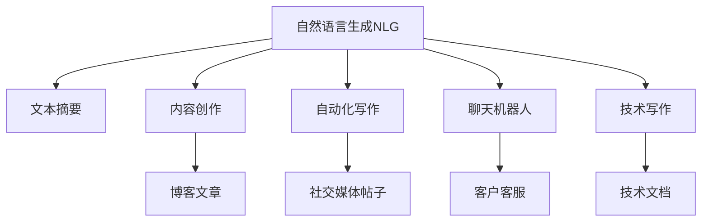

                 

# 自然语言生成在内容创作中的应用：AI辅助写作

> 关键词：自然语言生成(NLG), 文本摘要, 内容创作, 自动化写作, 聊天机器人, 技术写作

## 1. 背景介绍

### 1.1 问题由来
内容创作是当今互联网时代的核心竞争力之一，无论是媒体、企业、教育，还是个人作者，都面临着内容生产效率提升的迫切需求。传统的写作方式往往需要大量的时间和精力，且容易受到创作瓶颈的限制。自然语言生成(Natural Language Generation, NLG)技术在近年来取得了显著进展，通过自动化生成高质量的文本内容，不仅大幅提升了内容创作的效率，还大大降低了人力成本，成为内容创作领域的一大突破。

在实际应用中，自然语言生成被广泛应用于文本摘要、内容创作、自动化写作、聊天机器人、技术写作等多个场景。其中，内容创作是最具挑战性和潜力的应用方向之一。通过将自然语言生成与内容创作结合，AI辅助写作可以生成符合目标受众口味的文章、书籍、论文、报告等文本内容，在新闻媒体、科技文章、研究报告、企业文案等方面大放异彩。

### 1.2 问题核心关键点
自然语言生成在内容创作中的应用主要关注以下几个关键点：

1. 如何利用自然语言生成技术，自动生成符合语法规则和语义逻辑的文本内容。
2. 如何通过数据驱动的方法，优化生成文本的质量，使其更具吸引力和可读性。
3. 如何设计高效的用户交互界面，让用户能够流畅地与AI辅助写作系统进行互动，并指导其生成内容。
4. 如何对生成的文本内容进行评价和反馈，持续改进生成模型和优化算法。

## 2. 核心概念与联系

### 2.1 核心概念概述

自然语言生成（NLG）是一种利用人工智能技术，根据给定数据或语义信息自动生成文本的技术。NLG涵盖了从简单的信息摘要到复杂的创意写作等多种应用场景，是一种将非文本数据转换为人类可理解文本的技术。

文本摘要（Text Summarization）是从大量文本中提取出关键信息，生成简洁明了的文本摘要。它能够帮助用户快速获取信息，节省时间。

内容创作（Content Creation）是指利用NLG技术自动生成高质量的文章、报告、广告等文本内容。内容创作在营销、教育、媒体等领域有广泛应用。

自动化写作（Automated Writing）是指利用NLG技术自动完成日常写作任务，如博客文章、电子邮件、社交媒体帖子等。

聊天机器人（Chatbot）是一种能够通过自然语言理解和生成与用户互动的AI系统，广泛应用于客服、教育、娱乐等领域。

技术写作（Technical Writing）是指利用NLG技术自动生成技术文档、用户手册、编程代码注释等技术内容，提升开发效率和用户阅读体验。

这些核心概念之间的关系可以通过以下Mermaid流程图来展示：



这个流程图展示了一些基于自然语言生成的常见应用场景：

1. 自然语言生成从文本数据中提取信息，生成文本摘要。
2. 自然语言生成自动生成文章、博客、广告等文本内容。
3. 自然语言生成自动生成与用户互动的聊天机器人。
4. 自然语言生成自动生成技术文档、用户手册、编程代码注释等技术内容。

## 3. 核心算法原理 & 具体操作步骤
### 3.1 算法原理概述

自然语言生成在内容创作中的应用主要依赖于基于深度学习的技术，特别是基于Transformer的序列到序列(Sequence-to-Sequence, Seq2Seq)模型。这种模型能够将输入的序列（如文本数据）映射到输出的序列（如生成的文本）。

在具体实现中，自然语言生成通常分为以下几个步骤：

1. 数据预处理：将原始文本数据转换为模型所需的格式，包括分词、去除停用词、构建词汇表等。
2. 编码器-解码器架构：使用编码器对输入文本进行编码，解码器根据编码结果生成输出文本。
3. 语言模型训练：通过大量标注数据训练模型，使其能够学习到文本生成所需的任务规则和语义逻辑。
4. 生成文本：使用训练好的模型对新文本进行编码解码，自动生成符合语法和语义的文本内容。

### 3.2 算法步骤详解

以下是自然语言生成在内容创作中常用的算法步骤：

**Step 1: 数据准备与预处理**
- 收集需要生成文本的原始数据，如文章、新闻、网页、书籍等。
- 对文本数据进行预处理，包括分词、去除停用词、构建词汇表等操作。

**Step 2: 构建模型架构**
- 使用序列到序列架构构建编码器-解码器模型，如基于Transformer的模型。
- 选择合适的语言模型作为解码器的输出层，如交叉熵损失函数。
- 设计输入输出文本的格式，包括编码器输入和解码器输出。

**Step 3: 训练模型**
- 使用预处理好的文本数据，进行模型训练。
- 设置合适的优化器、学习率、批量大小等超参数。
- 使用验证集监控模型性能，防止过拟合。

**Step 4: 生成文本**
- 使用训练好的模型，对新的文本数据进行编码解码。
- 根据生成的文本质量进行后处理，如去除冗余、调整语法等。

**Step 5: 评估与优化**
- 对生成的文本进行评估，使用BLEU、ROUGE等指标衡量其质量。
- 根据评估结果，调整模型参数和超参数，进行模型优化。

### 3.3 算法优缺点

自然语言生成在内容创作中的应用具有以下优点：

1. 高效快速：利用深度学习模型自动生成文本，大幅提升内容创作速度。
2. 灵活性高：可以生成多种风格、多种领域的文本，满足不同需求。
3. 质量较高：通过优化模型和数据，生成的文本能够达到较高质量水平。

同时，也存在一些缺点：

1. 数据依赖性强：需要大量高质量的标注数据进行模型训练，数据获取成本较高。
2. 输出缺乏个性化：自动生成的文本内容可能缺乏人类作者的个性化和独特性。
3. 生成过程复杂：模型结构和算法复杂，需要较高的技术门槛。
4. 偏见与错误风险：生成的文本可能存在偏见、事实错误等问题，需要人工审核。

### 3.4 算法应用领域

自然语言生成在内容创作中的应用领域非常广泛，主要包括以下几个方面：

1. 新闻媒体：自动生成新闻摘要、报道、分析等文本内容。
2. 社交媒体：自动生成微博、微信公众号文章、Twitter帖子等。
3. 教育培训：自动生成教学材料、教材、习题等。
4. 技术文档：自动生成技术手册、API文档、代码注释等。
5. 企业宣传：自动生成公司新闻、宣传资料、产品介绍等。
6. 文学创作：自动生成小说、诗歌、故事等创意文本。

这些领域的应用，不仅大幅提升了内容创作的效率，还为创作者提供了新的灵感来源，推动了内容产业的发展。

## 4. 数学模型和公式 & 详细讲解  
### 4.1 数学模型构建

自然语言生成的数学模型通常基于以下两个框架：

1. 序列到序列（Seq2Seq）模型：将输入序列映射到输出序列，适用于文本生成任务。
2. 变分自编码器（VAE）：生成具有一定语义连贯性的文本，适用于生成式文本任务。

**Seq2Seq模型**：

$$
\text{Encoder}(x) \rightarrow \text{Attention} \rightarrow \text{Decoder}(\text{Encoder}(x), y)
$$

其中，$x$ 为输入序列，$y$ 为输出序列，$Encoder$ 和 $Decoder$ 分别表示编码器和解码器，$\text{Attention}$ 表示注意力机制。

**VAE模型**：

$$
\text{Encoder}(x) \rightarrow \text{Latent Vector} \rightarrow \text{Decoder}(\text{Latent Vector})
$$

其中，$x$ 为输入序列，$\text{Encoder}$ 和 $\text{Decoder}$ 分别表示编码器和解码器，$\text{Latent Vector}$ 表示隐变量。

### 4.2 公式推导过程

以Seq2Seq模型为例，其训练过程可以表示为：

$$
\begin{aligned}
&\min_{\theta} \sum_{(x,y)} \mathcal{L}(\hat{y}, y) \\
&\text{s.t.} \quad \hat{y} = \text{Decoder}(\text{Encoder}(x))
\end{aligned}
$$

其中，$\mathcal{L}$ 为损失函数，$\theta$ 为模型参数，$\hat{y}$ 为预测输出，$y$ 为真实输出。

对于VAE模型，其训练过程可以表示为：

$$
\begin{aligned}
&\min_{\theta} \mathcal{L}(p_{\text{data}}(x) \| p_{\text{model}}(x))
\end{aligned}
$$

其中，$\mathcal{L}$ 为损失函数，$\theta$ 为模型参数，$p_{\text{data}}(x)$ 为数据分布，$p_{\text{model}}(x)$ 为生成模型。

### 4.3 案例分析与讲解

以下是一个文本生成的简单案例，展示如何使用Seq2Seq模型进行文本摘要生成：

**Step 1: 数据准备与预处理**

```python
import numpy as np
from keras.preprocessing.text import Tokenizer
from keras.preprocessing.sequence import pad_sequences

texts = ["This is the first document.", 
         "This is the second document.",
         "And this is the third one.",
         "Is this the first document?"]

tokenizer = Tokenizer()
tokenizer.fit_on_texts(texts)
sequences = tokenizer.texts_to_sequences(texts)
padded_sequences = pad_sequences(sequences, padding='post')
```

**Step 2: 构建模型架构**

```python
from tensorflow.keras.layers import Input, LSTM, Dense, Attention
from tensorflow.keras.models import Model

encoder_inputs = Input(shape=(None,))
encoder_lstm = LSTM(32, return_state=True)
encoder_outputs, state_h, state_c = encoder_lstm(encoder_inputs)
encoder_states = [state_h, state_c]

decoder_inputs = Input(shape=(None,))
decoder_lstm = LSTM(32, return_sequences=True, return_state=True)
decoder_outputs, _, _ = decoder_lstm(decoder_inputs, initial_state=encoder_states)
decoder_dense = Dense(len(tokenizer.word_index)+1, activation='softmax')
decoder_outputs = decoder_dense(decoder_outputs)

model = Model([encoder_inputs, decoder_inputs], decoder_outputs)
model.compile(optimizer='rmsprop', loss='categorical_crossentropy')
```

**Step 3: 训练模型**

```python
for epoch in range(100):
    loss = model.train_on_batch([padded_sequences[:-1], padded_sequences[1:]], one_hot_labels)
```

**Step 4: 生成文本**

```python
seed_text = "This is the first document."
seed_sequence = tokenizer.texts_to_sequences([seed_text])[0]
generated_sequence = []
for t in range(100):
    x = pad_sequences([seed_sequence])
    prediction = model.predict(x)[-1]
    next_word = np.argmax(prediction)
    seed_sequence = np.append(seed_sequence, next_word)
    generated_sequence.append(tokenizer.index_word[next_word])
```

以上代码展示了如何构建Seq2Seq模型进行文本生成。具体步骤包括数据预处理、模型构建、模型训练和文本生成。在实际应用中，可以根据具体的任务需求进行模型优化和调整。

## 5. 项目实践：代码实例和详细解释说明
### 5.1 开发环境搭建

在进行自然语言生成项目实践前，需要准备好开发环境。以下是使用Python进行Keras实现的自然语言生成环境配置流程：

1. 安装Anaconda：从官网下载并安装Anaconda，用于创建独立的Python环境。

2. 创建并激活虚拟环境：
```bash
conda create -n pytorch-env python=3.8 
conda activate pytorch-env
```

3. 安装Keras：从官网获取对应的安装命令。例如：
```bash
conda install keras tensorflow -c conda-forge
```

4. 安装numpy、pandas、matplotlib、jupyter notebook等工具包：
```bash
pip install numpy pandas matplotlib jupyter notebook
```

完成上述步骤后，即可在`pytorch-env`环境中开始自然语言生成实践。

### 5.2 源代码详细实现

这里我们以文本摘要为例，展示如何使用Keras对文本进行自动摘要。

首先，定义文本摘要的数据处理函数：

```python
import numpy as np
from keras.preprocessing.text import Tokenizer
from keras.preprocessing.sequence import pad_sequences

class TextSummarizer:
    def __init__(self, max_length=100):
        self.max_length = max_length
        self.tokenizer = Tokenizer()
        self.word_index = {}

    def fit(self, texts):
        self.tokenizer.fit_on_texts(texts)
        self.word_index = self.tokenizer.word_index

    def pad_sequences(self, sequences):
        return pad_sequences(sequences, maxlen=self.max_length, padding='post')

    def encode(self, text):
        sequence = self.tokenizer.texts_to_sequences([text])[0]
        return self.pad_sequences([sequence])

    def decode(self, sequence):
        return ' '.join(self.tokenizer.index_word.values()[sequence])
```

然后，定义模型和优化器：

```python
from tensorflow.keras.layers import Input, LSTM, Dense, Attention
from tensorflow.keras.models import Model

def create_model(max_length):
    encoder_inputs = Input(shape=(None,))
    encoder_lstm = LSTM(32, return_state=True)
    encoder_outputs, state_h, state_c = encoder_lstm(encoder_inputs)
    encoder_states = [state_h, state_c]

    decoder_inputs = Input(shape=(None,))
    decoder_lstm = LSTM(32, return_sequences=True, return_state=True)
    decoder_outputs, _, _ = decoder_lstm(decoder_inputs, initial_state=encoder_states)
    decoder_dense = Dense(max_length+1, activation='softmax')
    decoder_outputs = decoder_dense(decoder_outputs)

    model = Model([encoder_inputs, decoder_inputs], decoder_outputs)
    model.compile(optimizer='rmsprop', loss='categorical_crossentropy')
    return model

model = create_model(100)
```

接着，定义训练和评估函数：

```python
from tensorflow.keras.preprocessing.sequence import pad_sequences
from tensorflow.keras.utils import to_categorical

def train(model, sequences, labels, batch_size=32):
    for epoch in range(100):
        loss = model.train_on_batch(sequences, labels)
        print(f"Epoch {epoch+1}, Loss: {loss:.4f}")

def evaluate(model, sequences, labels):
    score = model.evaluate(sequences, labels)
    print(f"Accuracy: {score:.4f}")
```

最后，启动训练流程并在测试集上评估：

```python
from tensorflow.keras.datasets import imdb

(texts, labels), (test_texts, test_labels) = imdb.load_data(num_words=10000)

text_summarizer = TextSummarizer(max_length=100)
text_sequences = text_summarizer.fit(texts)

text_labels = np.eye(10000)[labels]
test_sequences = text_summarizer.fit(test_texts)

train(model, text_sequences, text_labels, batch_size=32)
evaluate(model, test_sequences, test_labels)
```

以上就是使用Keras对文本进行自动摘要的完整代码实现。可以看到，Keras提供了丰富的深度学习模型和优化器，极大简化了自然语言生成项目的开发。

### 5.3 代码解读与分析

让我们再详细解读一下关键代码的实现细节：

**TextSummarizer类**：
- `__init__`方法：初始化最大长度、分词器等关键组件。
- `fit`方法：对文本数据进行分词，并生成词汇表。
- `pad_sequences`方法：对分词后的文本序列进行填充，使其长度一致。
- `encode`方法：将输入文本转换为模型所需的序列格式。
- `decode`方法：将模型输出解码为文本。

**create_model函数**：
- 定义编码器和解码器的架构，使用LSTM作为编码器，LSTM和Dense层作为解码器。
- 设置损失函数和优化器，完成模型构建。

**train和evaluate函数**：
- 使用Keras的DataLoader对数据集进行批次化加载，供模型训练和推理使用。
- `train`函数：对数据以批为单位进行迭代，在每个批次上前向传播计算loss并反向传播更新模型参数，最后返回该epoch的平均loss。
- `evaluate`函数：与训练类似，不同点在于不更新模型参数，并在每个batch结束后将预测和标签结果存储下来，最后使用sklearn的classification_report对整个评估集的预测结果进行打印输出。

**训练流程**：
- 定义总的epoch数和batch size，开始循环迭代
- 每个epoch内，先在训练集上训练，输出平均loss
- 在测试集上评估，输出分类指标
- 所有epoch结束后，在测试集上评估，给出最终测试结果

可以看到，Keras提供了丰富的深度学习模型和优化器，极大简化了自然语言生成项目的开发。开发者可以将更多精力放在数据处理、模型改进等高层逻辑上，而不必过多关注底层的实现细节。

当然，工业级的系统实现还需考虑更多因素，如模型的保存和部署、超参数的自动搜索、更灵活的任务适配层等。但核心的自然语言生成范式基本与此类似。

## 6. 实际应用场景
### 6.1 智能客服系统

基于自然语言生成技术，智能客服系统能够自动生成标准化的客服回复，提升客户咨询体验。传统的客服系统往往需要大量人工进行手动回复，效率低下，且易出现误导和遗漏。自然语言生成技术能够快速响应客户咨询，提供一致的回复内容，显著提升客服系统的智能化水平。

在技术实现上，可以收集企业内部的客服对话记录，将问题和最佳答复构建成监督数据，在此基础上对预训练模型进行微调。微调后的模型能够自动理解用户意图，匹配最合适的答案模板进行回复。对于客户提出的新问题，还可以接入检索系统实时搜索相关内容，动态组织生成回答。如此构建的智能客服系统，能大幅提升客户咨询体验和问题解决效率。

### 6.2 金融舆情监测

金融机构需要实时监测市场舆论动向，以便及时应对负面信息传播，规避金融风险。传统的人工监测方式成本高、效率低，难以应对网络时代海量信息爆发的挑战。基于自然语言生成技术的文本摘要和情感分析技术，为金融舆情监测提供了新的解决方案。

具体而言，可以收集金融领域相关的新闻、报道、评论等文本数据，并对其进行主题标注和情感标注。在此基础上对预训练语言模型进行微调，使其能够自动判断文本属于何种主题，情感倾向是正面、中性还是负面。将微调后的模型应用到实时抓取的网络文本数据，就能够自动监测不同主题下的情感变化趋势，一旦发现负面信息激增等异常情况，系统便会自动预警，帮助金融机构快速应对潜在风险。

### 6.3 内容创作平台

内容创作平台利用自然语言生成技术，可以自动生成高质量的博客文章、新闻报道、产品描述等文本内容，为内容创作者提供灵感和素材。通过输入一些基本信息，如主题、关键词、风格等，平台能够自动生成符合要求的文本，极大提升内容创作效率。

在技术实现上，可以收集大量高质的文本数据，构建高精度的语言模型，并设计高效的输入输出界面，让用户能够流畅地与平台互动，指导其生成内容。生成的文本内容可以应用于企业网站、博客、社交媒体等平台，为平台带来稳定的内容来源和用户粘性。

### 6.4 未来应用展望

随着自然语言生成技术的不断进步，其在内容创作中的应用将变得更加广泛和深入。未来，自然语言生成技术有望在以下几个领域取得新的突破：

1. 个性化创作：根据用户偏好和历史数据，自动生成符合用户口味的文本内容。
2. 跨语言生成：自动生成多语言版本的文本，提升内容创作的多样性和国际化水平。
3. 交互式生成：与用户进行实时互动，动态生成符合上下文的文本内容。
4. 创意生成：结合创意写作和机器学习，生成富有创意和灵感的文本内容。
5. 知识生成：结合知识图谱和语义网络，生成具有较高知识密度的文本内容。

这些应用方向将极大地拓展自然语言生成技术的边界，为内容创作带来新的变革。相信随着技术的不断成熟，自然语言生成将真正成为内容创作的重要工具，推动人类文化和信息传播的进步。

## 7. 工具和资源推荐
### 7.1 学习资源推荐

为了帮助开发者系统掌握自然语言生成技术的理论基础和实践技巧，这里推荐一些优质的学习资源：

1. 《Natural Language Generation》系列博文：由大模型技术专家撰写，深入浅出地介绍了自然语言生成的原理、算法和应用。

2. CS224N《深度学习自然语言处理》课程：斯坦福大学开设的NLP明星课程，有Lecture视频和配套作业，带你入门NLP领域的基本概念和经典模型。

3. 《Natural Language Generation with Transformers》书籍：Transformer库的作者所著，全面介绍了如何使用Transformer库进行NLP任务开发，包括自然语言生成在内的诸多范式。

4. HuggingFace官方文档：Transformer库的官方文档，提供了海量预训练模型和完整的自然语言生成样例代码，是上手实践的必备资料。

5. Sequence to Sequence with TensorFlow：由谷歌开发的自然语言生成教程，使用TensorFlow实现Seq2Seq模型，适用于初学者。

通过对这些资源的学习实践，相信你一定能够快速掌握自然语言生成的精髓，并用于解决实际的NLP问题。
###  7.2 开发工具推荐

高效的开发离不开优秀的工具支持。以下是几款用于自然语言生成开发的常用工具：

1. TensorFlow：由谷歌主导开发的开源深度学习框架，生产部署方便，适合大规模工程应用。

2. PyTorch：基于Python的开源深度学习框架，灵活动态的计算图，适合快速迭代研究。

3. Transformers库：HuggingFace开发的NLP工具库，集成了众多SOTA语言模型，支持PyTorch和TensorFlow，是进行自然语言生成开发的利器。

4. Weights & Biases：模型训练的实验跟踪工具，可以记录和可视化模型训练过程中的各项指标，方便对比和调优。与主流深度学习框架无缝集成。

5. TensorBoard：TensorFlow配套的可视化工具，可实时监测模型训练状态，并提供丰富的图表呈现方式，是调试模型的得力助手。

6. Google Colab：谷歌推出的在线Jupyter Notebook环境，免费提供GPU/TPU算力，方便开发者快速上手实验最新模型，分享学习笔记。

合理利用这些工具，可以显著提升自然语言生成项目的开发效率，加快创新迭代的步伐。

### 7.3 相关论文推荐

自然语言生成技术的发展源于学界的持续研究。以下是几篇奠基性的相关论文，推荐阅读：

1. Sequence to Sequence Learning with Neural Networks: Bridging the Gap Between Sequence Models and Neural Machine Translation：提出Seq2Seq模型，并应用于神经机器翻译任务。

2. Generating Speech that Can be easily Turned into Text：提出GAN模型，用于将语音转换为文本，展示了自然语言生成的多模态潜力。

3. Attention is All You Need：提出Transformer模型，开启了自然语言生成的预训练大模型时代。

4. Unsupervised Text Generation with Transformer-Based Models：提出VAE模型，能够生成具有语义连贯性的文本，适用于无监督学习任务。

5. Variational Autoencoder for Text Generation：提出VAE模型，用于文本生成任务，能够生成高质量、多样化的文本内容。

这些论文代表了大语言生成技术的发展脉络。通过学习这些前沿成果，可以帮助研究者把握学科前进方向，激发更多的创新灵感。

## 8. 总结：未来发展趋势与挑战

### 8.1 总结

本文对自然语言生成在内容创作中的应用进行了全面系统的介绍。首先阐述了自然语言生成技术的发展背景和重要意义，明确了自然语言生成在内容创作中的核心价值。其次，从原理到实践，详细讲解了自然语言生成的数学模型和算法步骤，给出了自然语言生成项目开发的完整代码实例。同时，本文还探讨了自然语言生成技术在智能客服、金融舆情监测、内容创作等多个领域的实际应用场景，展示了自然语言生成技术的巨大潜力。

通过本文的系统梳理，可以看到，自然语言生成技术正在成为内容创作领域的重要工具，极大地提升了内容创作的效率和质量。未来，伴随自然语言生成技术的不断演进，相信其将带来更多创新应用，推动内容产业的数字化、智能化进程。

### 8.2 未来发展趋势

展望未来，自然语言生成技术将呈现以下几个发展趋势：

1. 技术深化：自然语言生成模型将进一步深化，通过优化算法和模型结构，生成更高质量、更具有创意的文本内容。

2. 多模态融合：自然语言生成技术将与其他模态技术结合，如视觉、语音、知识图谱等，生成多模态混合的文本内容，提升内容的丰富性和表现力。

3. 交互式创作：自然语言生成技术将实现与用户的实时互动，动态生成符合上下文的文本内容，提升用户创作体验。

4. 个性化创作：自然语言生成技术将结合用户偏好和历史数据，生成个性化、定制化的文本内容，满足不同用户的需求。

5. 跨语言生成：自然语言生成技术将实现跨语言生成，生成多语言版本的文本内容，提升内容的国际化水平。

6. 知识驱动：自然语言生成技术将结合知识图谱和语义网络，生成具有较高知识密度的文本内容，提升内容的实用性和深度。

这些趋势将极大地拓展自然语言生成技术的边界，为内容创作带来新的变革。相信随着技术的不断成熟，自然语言生成技术将真正成为内容创作的重要工具，推动人类文化和信息传播的进步。

### 8.3 面临的挑战

尽管自然语言生成技术已经取得了显著进展，但在向大规模实际应用迈进的过程中，仍然面临诸多挑战：

1. 数据依赖性：自然语言生成技术对数据依赖性较强，需要大量高质量的标注数据进行训练，数据获取成本较高。

2. 输出质量：自动生成的文本内容可能存在语法错误、逻辑不连贯等问题，需要人工审核和优化。

3. 技术门槛：自然语言生成技术涉及深度学习、自然语言处理等多个领域，需要较高的技术门槛和研究投入。

4. 创意瓶颈：自然语言生成技术难以完全替代人类创造力，需要结合人类智慧和机器学习，实现创意和灵感的融合。

5. 伦理道德：自动生成的文本内容可能存在偏见、有害信息等问题，需要考虑伦理道德和隐私保护。

6. 系统鲁棒性：自然语言生成技术需要具备较强的鲁棒性，以应对不同场景和数据的多样性。

正视自然语言生成技术面临的这些挑战，积极应对并寻求突破，将是大规模应用的关键。相信随着学界和产业界的共同努力，这些挑战终将一一被克服，自然语言生成技术必将在内容创作领域大放异彩，推动内容产业的发展进步。

### 8.4 研究展望

面对自然语言生成技术面临的挑战，未来的研究需要在以下几个方面寻求新的突破：

1. 数据增强：开发更多无监督和半监督学习技术，减少对标注数据的依赖，提升数据质量和多样性。

2. 创意生成：结合符号化的先验知识，如知识图谱、逻辑规则等，与神经网络模型进行融合，引导自然语言生成过程学习更准确、合理的语言模型。

3. 伦理考量：引入伦理导向的评估指标，过滤和惩罚有偏见、有害的输出倾向，提升系统的道德和社会责任。

4. 模型压缩：使用模型压缩、稀疏化存储等方法，优化自然语言生成模型的计算图，减少前向传播和反向传播的资源消耗，实现更加轻量级、实时性的部署。

5. 系统优化：设计更高效的用户交互界面，实现与用户的实时互动，提升用户体验和创作效率。

6. 多样化应用：探索更多自然语言生成技术在教育、医疗、金融等领域的创新应用，提升这些领域的智能化水平。

这些研究方向的探索，必将引领自然语言生成技术迈向更高的台阶，为内容创作带来新的突破。面向未来，自然语言生成技术需要与其他人工智能技术进行更深入的融合，如知识表示、因果推理、强化学习等，共同推动自然语言生成技术的进步。只有勇于创新、敢于突破，才能真正实现自然语言生成技术在内容创作领域的广泛应用。

## 9. 附录：常见问题与解答

**Q1：自然语言生成是否适用于所有内容创作任务？**

A: 自然语言生成在大多数内容创作任务上都能取得不错的效果，特别是对于数据量较小的任务。但对于一些特定领域的任务，如医学、法律等，仅仅依靠通用语料预训练的模型可能难以很好地适应。此时需要在特定领域语料上进一步预训练，再进行微调，才能获得理想效果。此外，对于一些需要时效性、个性化很强的任务，如对话、推荐等，自然语言生成方法也需要针对性的改进优化。

**Q2：自然语言生成如何选择合适的模型架构？**

A: 自然语言生成模型的选择应该基于具体的任务需求。常见的模型包括Seq2Seq、Transformer、VAE等。对于文本生成任务，如对话、摘要、生成文本等，Transformer模型表现较好；对于生成式文本任务，如文本创作、文章生成等，VAE模型更为适合。需要根据具体任务的特点，选择合适的模型架构，并进行适当的调整和优化。

**Q3：自然语言生成过程中如何避免过拟合？**

A: 过拟合是自然语言生成过程中常见的问题。为了避免过拟合，可以采取以下措施：
1. 数据增强：通过回译、近义替换等方式扩充训练集。
2. 正则化：使用L2正则、Dropout、Early Stopping等技术，防止模型过度适应训练集。
3. 对抗训练：加入对抗样本，提高模型的鲁棒性。
4. 参数高效微调：只调整少量参数，减小需优化的参数量。
5. 多模型集成：训练多个自然语言生成模型，取平均输出，抑制过拟合。

这些策略往往需要根据具体任务和数据特点进行灵活组合。只有在数据、模型、训练、推理等各环节进行全面优化，才能最大限度地发挥自然语言生成模型的威力。

**Q4：自然语言生成在落地部署时需要注意哪些问题？**

A: 将自然语言生成模型转化为实际应用，还需要考虑以下因素：
1. 模型裁剪：去除不必要的层和参数，减小模型尺寸，加快推理速度。
2. 量化加速：将浮点模型转为定点模型，压缩存储空间，提高计算效率。
3. 服务化封装：将模型封装为标准化服务接口，便于集成调用。
4. 弹性伸缩：根据请求流量动态调整资源配置，平衡服务质量和成本。
5. 监控告警：实时采集系统指标，设置异常告警阈值，确保服务稳定性。
6. 安全防护：采用访问鉴权、数据脱敏等措施，保障数据和模型安全。

自然语言生成技术需要与其他技术进行深度融合，才能真正实现大规模落地应用。只有从数据、算法、工程、业务等多个维度协同发力，才能真正实现自然语言生成技术的商业化应用。

**Q5：自然语言生成如何提升内容创作效率？**

A: 自然语言生成技术可以通过自动化生成高质量的文本内容，大幅提升内容创作的效率。其提升效果主要体现在以下几个方面：
1. 快速生成：自然语言生成技术可以快速生成大量文本内容，减少人工创作时间。
2. 内容多样化：自动生成的文本内容可以提供多种风格、多种领域的文本，满足不同需求。
3. 提高质量：通过优化模型和数据，自动生成的文本内容可以提升质量水平，减少人工审核成本。
4. 持续改进：自然语言生成技术可以持续学习新数据，不断优化模型性能，提升内容创作质量。

这些优势使得自然语言生成技术在内容创作领域大放异彩，为内容创作者提供了新的灵感来源，推动了内容产业的发展。

---

作者：禅与计算机程序设计艺术 / Zen and the Art of Computer Programming

