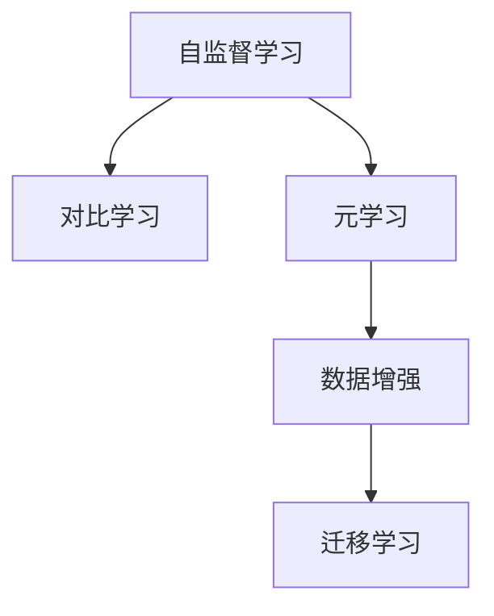

                 

# 自监督学习的理论创新:对比学习和元学习

> 关键词：自监督学习,对比学习,元学习,深度学习,数据增强,迁移学习,模型优化,泛化能力

## 1. 背景介绍

### 1.1 问题由来
在深度学习时代，自监督学习(Autonomous Supervised Learning)已成为提升模型泛化性能的重要手段。自监督学习的核心思想是利用大量未标记数据，通过无监督的预训练过程，挖掘数据的内在结构，提升模型的特征提取能力。这一思想最早可追溯至Hinton提出的自编码器(Automatic Encoder)，并在随后十余年间不断发展，催生了生成对抗网络(GAN)、自回归模型(如RNN、Transformer)等大量创新算法。

自监督学习的关键优势在于，能够从规模庞大的无标签数据中提取丰富的信息，相比有标签数据，其数量级通常高达百倍以上。然而，如何高效利用这些数据、设计更有效的自监督学习算法，使得自监督模型能够与下游任务进行良好适配，仍是一大难题。

近年来，自监督学习的理论创新不断涌现，其中对比学习(Contrastive Learning)和元学习(Meta-Learning)成为两个最受关注的范式。本文将详细探讨这两种理论的基本原理、算法实现以及应用实践，帮助读者深入理解自监督学习的最新进展，并对其未来发展趋势进行前瞻性思考。

### 1.2 问题核心关键点
自监督学习与监督学习不同，监督学习通过标签数据进行模型优化，而自监督学习则是通过数据本身的特征进行优化。自监督学习的核心问题包括：

- 如何利用无标签数据，高效提取有意义的表示
- 如何设计自监督目标，指导模型进行特征学习
- 如何将自监督学习与下游任务相结合，进行迁移学习
- 如何在不同任务间进行知识迁移，提升模型泛化性能

这些问题都是自监督学习研究的重点和难点，本文将详细讲解。

### 1.3 问题研究意义
对比学习和元学习，作为当前自监督学习领域最前沿的理论，对深度学习模型性能的提升具有重要意义：

1. 提升泛化性能：通过对比学习和元学习，模型能够更准确地捕捉数据分布的特征，提升泛化性能，减少过拟合风险。
2. 促进迁移学习：对比学习和元学习能够提取数据共性特征，使模型在不同任务间具有良好的迁移能力，加速模型训练，提高性能。
3. 简化模型训练：对比学习和元学习通过优化目标设计，减少了下游任务对有标签数据的依赖，降低了模型训练成本。
4. 创新算法思想：对比学习和元学习提出了一些新颖的算法思想，如正则化、增强学习等，为深度学习领域的算法创新提供了新的思路。
5. 应用广泛：对比学习和元学习已经应用于NLP、CV、RL等诸多领域，展示了其强大的生命力。

本文将系统探讨这两种理论的基本原理、核心算法及其应用实践，帮助读者深入理解自监督学习的最新进展，并对其未来发展趋势进行前瞻性思考。

## 2. 核心概念与联系

### 2.1 核心概念概述

为更好地理解对比学习和元学习，本节将介绍几个密切相关的核心概念：

- 自监督学习(Autonomous Supervised Learning)：利用无标签数据进行模型训练，挖掘数据的内在结构，提升模型的泛化性能。
- 对比学习(Contrastive Learning)：通过最大化样本之间的相似性、最小化样本之间的差异性，引导模型学习更加鲁棒的表示。
- 元学习(Meta-Learning)：通过学习不同任务之间的共性特征，使得模型能够快速适应新任务，提升迁移学习能力。
- 数据增强(Data Augmentation)：通过对原始数据进行变换、扩充等操作，生成更多的训练数据，提升模型的鲁棒性。
- 迁移学习(Transfer Learning)：将在一个任务上学习到的知识迁移到另一个任务上，提高模型的泛化性能。

这些核心概念之间的逻辑关系可以通过以下Mermaid流程图来展示：



这个流程图展示了点概念之间的逻辑关系：

1. 自监督学习通过无标签数据进行预训练，挖掘数据内在结构。
2. 对比学习在自监督预训练的基础上，通过最大化相似性、最小化差异性进行模型优化。
3. 元学习在自监督预训练的基础上，学习不同任务之间的共性特征，促进迁移学习。
4. 数据增强在自监督预训练和对比学习过程中，用于扩充训练数据。
5. 迁移学习将自监督学习与元学习提取的共性特征应用于下游任务，提升泛化性能。

这些概念共同构成了自监督学习的学习框架，使其能够高效利用无标签数据，提升模型的泛化性能和迁移学习能力。

## 3. 核心算法原理 & 具体操作步骤
### 3.1 算法原理概述

对比学习和元学习，作为当前自监督学习领域最前沿的理论，其核心思想是通过无标签数据的特征学习，提升模型对数据的泛化性能和迁移能力。以下将详细讲解这两种理论的基本原理。

**对比学习(Contrastive Learning)**：对比学习的核心思想是最大化相似样本之间的相似度、最小化不同样本之间的差异度。即，给定一组样本$(x_i, y_i)$，其中$x_i$为输入，$y_i$为标签，模型通过最大化相似样本之间的相似度、最小化不同样本之间的差异度，提升模型的特征表示能力。对比学习的目标可以表示为：

$$
\min_{\theta} \frac{1}{N}\sum_{i=1}^N [\max(0, 1 - \mathrm{sim}(x_i, x_j)^{\alpha})]
$$

其中$\mathrm{sim}(x_i, x_j)$表示样本$x_i$和$x_j$的相似度，$\alpha$为超参数，控制相似度最大化和差异度最小化的平衡。

**元学习(Meta-Learning)**：元学习的核心思想是学习模型在不同任务之间的共性特征，使得模型能够快速适应新任务。即，在多个任务上对模型进行微调，学习不同任务之间的共性表示，使得模型在新任务上能迅速收敛。元学习的目标可以表示为：

$$
\min_{\theta} \frac{1}{K}\sum_{k=1}^K \mathcal{L}_k (\theta)
$$

其中$K$为任务数量，$\mathcal{L}_k$表示第$k$个任务的损失函数。

### 3.2 算法步骤详解

**对比学习**的具体操作步骤如下：

1. **数据准备**：收集大量未标记数据，并将其分为训练集和测试集。
2. **模型初始化**：选择一个预训练模型作为初始化参数，如ResNet、VGG等。
3. **对比学习目标设计**：设计相似度函数，如余弦相似度、欧式距离等，以及相似度最大化和差异度最小化的权重。
4. **模型训练**：使用对比学习目标函数进行训练，最小化相似度最大化和差异度最小化的损失。
5. **模型评估**：在测试集上评估模型的泛化性能，对比不同超参数下的模型效果。

**元学习**的具体操作步骤如下：

1. **任务定义**：定义多个任务，如图像分类、物体检测等。
2. **模型初始化**：选择一个预训练模型作为初始化参数。
3. **元学习目标设计**：设计元学习目标函数，如均方误差、交叉熵等。
4. **模型训练**：使用元学习目标函数进行训练，最小化所有任务上的损失。
5. **任务迁移**：将训练好的模型应用于新的任务，进行微调，提升模型在新任务上的性能。

### 3.3 算法优缺点

**对比学习**的优缺点如下：

- **优点**：
  - 能够高效利用大量未标记数据进行预训练，挖掘数据内在结构。
  - 通过相似性最大化和差异性最小化，提升模型的泛化性能和鲁棒性。
  - 可应用于多种模型和任务，如图像分类、物体检测等。

- **缺点**：
  - 对比学习依赖于相似性函数的选择和参数设置，需要大量的超参数调参。
  - 对比学习需要大量计算资源，特别是在大规模数据集上的训练。
  - 对比学习可能存在梯度消失的问题，需要额外的技术手段进行优化。

**元学习**的优缺点如下：

- **优点**：
  - 能够通过学习不同任务之间的共性特征，促进模型迁移学习，加速模型训练。
  - 元学习能够适应新任务，提升模型泛化性能和迁移能力。
  - 元学习能够减少下游任务对有标签数据的依赖，降低模型训练成本。

- **缺点**：
  - 元学习需要设计复杂的目标函数和超参数，调参难度较高。
  - 元学习可能存在模型退化的问题，需要进行额外优化。
  - 元学习在大规模数据集上的训练时间较长，计算成本较高。

### 3.4 算法应用领域

对比学习和元学习已经广泛应用于多个领域，包括计算机视觉、自然语言处理、机器人学等，以下是一些典型应用场景：

- **计算机视觉**：用于图像分类、物体检测、姿态估计等任务。通过对比学习最大化样本之间的相似性，元学习学习不同任务之间的共性特征，提升模型的泛化性能和迁移能力。
- **自然语言处理**：用于文本分类、情感分析、机器翻译等任务。通过对比学习最大化样本之间的相似性，元学习学习不同任务之间的共性特征，提升模型的泛化性能和迁移能力。
- **机器人学**：用于机器人导航、动作生成、场景理解等任务。通过对比学习最大化样本之间的相似性，元学习学习不同任务之间的共性特征，提升模型的泛化性能和迁移能力。

## 4. 数学模型和公式 & 详细讲解 & 举例说明

### 4.1 数学模型构建

本节将使用数学语言对对比学习和元学习的基本原理进行严格刻画。

**对比学习**的数学模型可以表示为：

$$
\min_{\theta} \frac{1}{N}\sum_{i=1}^N [\max(0, 1 - \mathrm{sim}(x_i, x_j)^{\alpha})]
$$

其中$\mathrm{sim}(x_i, x_j)$表示样本$x_i$和$x_j$的相似度，$\alpha$为超参数，控制相似度最大化和差异度最小化的平衡。

**元学习**的数学模型可以表示为：

$$
\min_{\theta} \frac{1}{K}\sum_{k=1}^K \mathcal{L}_k (\theta)
$$

其中$K$为任务数量，$\mathcal{L}_k$表示第$k$个任务的损失函数。

### 4.2 公式推导过程

以下是对比学习和元学习的详细推导过程：

**对比学习**的推导过程如下：

1. **相似度函数**：
  - 余弦相似度：$\mathrm{sim}(x_i, x_j) = \frac{x_i^T x_j}{\|x_i\|\|x_j\|}$
  - 欧式距离：$\mathrm{sim}(x_i, x_j) = \frac{\|x_i - x_j\|^2}{\|x_i\|^2 + \|x_j\|^2}$
2. **对比学习目标函数**：
  - 基于余弦相似度的目标函数：$\min_{\theta} \frac{1}{N}\sum_{i=1}^N \max(0, 1 - \cos(x_i^T x_j)^{\alpha})$
  - 基于欧式距离的目标函数：$\min_{\theta} \frac{1}{N}\sum_{i=1}^N \max(0, 1 - \|x_i - x_j\|^{\alpha})^2$

**元学习**的推导过程如下：

1. **任务定义**：定义$K$个任务，每个任务的目标函数为$\mathcal{L}_k(\theta)$。
2. **元学习目标函数**：
  - 基于均方误差的目标函数：$\min_{\theta} \frac{1}{K}\sum_{k=1}^K \frac{1}{N_k}\sum_{i=1}^{N_k} (y_k^i - f_k^i(\theta))^2$
  - 基于交叉熵的目标函数：$\min_{\theta} \frac{1}{K}\sum_{k=1}^K \mathcal{L}_{ce}(\theta)$

### 4.3 案例分析与讲解

**对比学习案例**：

- **SimCLR**：使用余弦相似度作为相似度函数，最大化同批次内样本的相似度，最小化不同批次内样本的差异度。
- **Moco**：使用余弦相似度作为相似度函数，最大化同一视角的样本相似度，最小化不同视角的样本差异度。
- **InfoNCE**：基于负采样策略，最大化正样本之间的相似度，最小化负样本之间的差异度。

**元学习案例**：

- **MAML**：使用均方误差作为元损失函数，最小化所有任务上的损失。
- **Reptation Meta-Learning**：使用K步骤梯度下降，将学习目标从单个任务拓展到多个任务。

## 5. 项目实践：代码实例和详细解释说明
### 5.1 开发环境搭建

在进行对比学习和元学习实践前，我们需要准备好开发环境。以下是使用Python进行PyTorch开发的环境配置流程：

1. 安装Anaconda：从官网下载并安装Anaconda，用于创建独立的Python环境。

2. 创建并激活虚拟环境：
```bash
conda create -n pytorch-env python=3.8 
conda activate pytorch-env
```

3. 安装PyTorch：根据CUDA版本，从官网获取对应的安装命令。例如：
```bash
conda install pytorch torchvision torchaudio cudatoolkit=11.1 -c pytorch -c conda-forge
```

4. 安装Transformer库：
```bash
pip install transformers
```

5. 安装各类工具包：
```bash
pip install numpy pandas scikit-learn matplotlib tqdm jupyter notebook ipython
```

完成上述步骤后，即可在`pytorch-env`环境中开始对比学习和元学习的实践。

### 5.2 源代码详细实现

下面我们以图像分类任务为例，给出使用PyTorch实现对比学习和元学习的代码实现。

首先，定义对比学习的数据处理函数：

```python
from torch.utils.data import Dataset, DataLoader
import torch
import numpy as np
import os
import cv2

class ImageDataset(Dataset):
    def __init__(self, root, transform=None):
        self.root = root
        self.transform = transform
        self.file_list = os.listdir(root)
        self.data_list = []
        for file in self.file_list:
            if '.png' in file or '.jpg' in file:
                self.data_list.append(os.path.join(root, file))

    def __len__(self):
        return len(self.data_list)

    def __getitem__(self, idx):
        img_path = self.data_list[idx]
        img = cv2.imread(img_path)
        if self.transform:
            img = self.transform(img)
        label = int(os.path.splitext(os.path.basename(img_path))[0])
        return img, label
```

然后，定义元学习的数据处理函数：

```python
from torch.utils.data import SubsetRandomSampler

class MetaImageDataset(Dataset):
    def __init__(self, train_datasets, num_classes, num_per_class):
        self.train_datasets = train_datasets
        self.num_classes = num_classes
        self.num_per_class = num_per_class
        self.class_idx = [i for i in range(num_classes)]

    def __len__(self):
        return len(self.class_idx)

    def __getitem__(self, idx):
        classes = np.random.choice(self.class_idx, self.num_per_class, replace=False)
        indices = []
        for c in classes:
            ds = self.train_datasets[c]
            sampler = SubsetRandomSampler(list(range(len(ds))))
            indices.extend(list(sampler))
        indices = np.random.permutation(indices)
        idx = indices[idx]
        img, label = self.train_datasets[idx[0]][idx]
        return img, label
```

接着，定义对比学习的模型和优化器：

```python
from torchvision.models import resnet50
from torch.optim import AdamW

model = resnet50(pretrained=True)
model.fc = torch.nn.Linear(2048, 10)
model.apply(weight_init)

optimizer = AdamW(model.parameters(), lr=0.001)
```

定义元学习的模型和优化器：

```python
from torchvision.models import resnet50
from torch.optim import AdamW

model = resnet50(pretrained=True)
model.fc = torch.nn.Linear(2048, 10)
model.apply(weight_init)

optimizer = AdamW(model.parameters(), lr=0.001)
```

然后，定义对比学习的训练函数：

```python
import torch.nn.functional as F

def contrastive_learning_train(model, dataset, batch_size, optimizer, num_epochs):
    device = torch.device('cuda')
    model.to(device)
    criterion = torch.nn.CrossEntropyLoss()
    
    for epoch in range(num_epochs):
        train_loader = DataLoader(dataset, batch_size=batch_size, shuffle=True, num_workers=4)
        model.train()
        total_loss = 0
        for batch_idx, (data, target) in enumerate(train_loader):
            data, target = data.to(device), target.to(device)
            optimizer.zero_grad()
            output = model(data)
            loss = criterion(output, target)
            loss.backward()
            optimizer.step()
            total_loss += loss.item()
        print(f'Epoch {epoch+1}, loss: {total_loss/len(train_loader)}')
```

定义元学习的训练函数：

```python
import torch.nn.functional as F

def meta_learning_train(model, datasets, batch_size, optimizer, num_epochs):
    device = torch.device('cuda')
    model.to(device)
    criterion = torch.nn.CrossEntropyLoss()

    for epoch in range(num_epochs):
        meta_loader = DataLoader(datasets, batch_size=batch_size, shuffle=True, num_workers=4)
        model.train()
        total_loss = 0
        for batch_idx, (data, target) in enumerate(meta_loader):
            data, target = data.to(device), target.to(device)
            optimizer.zero_grad()
            output = model(data)
            loss = criterion(output, target)
            loss.backward()
            optimizer.step()
            total_loss += loss.item()
        print(f'Epoch {epoch+1}, loss: {total_loss/len(meta_loader)}')
```

最后，启动对比学习和元学习流程：

```python
from transformers import AutoTokenizer
import torchvision.transforms as transforms

train_dataset = ImageDataset(root='path/to/train_data', transform=transforms.ToTensor())
test_dataset = ImageDataset(root='path/to/test_data', transform=transforms.ToTensor())
val_dataset = ImageDataset(root='path/to/val_data', transform=transforms.ToTensor())

train_loader = DataLoader(train_dataset, batch_size=32, shuffle=True)
test_loader = DataLoader(test_dataset, batch_size=32, shuffle=False)
val_loader = DataLoader(val_dataset, batch_size=32, shuffle=False)

contrastive_learning_train(model, train_loader, batch_size=32, optimizer=optimizer, num_epochs=10)

meta_loader = DataLoader(MetaImageDataset(train_dataset, num_classes=10, num_per_class=10), batch_size=32, shuffle=True)
meta_learning_train(model, meta_loader, batch_size=32, optimizer=optimizer, num_epochs=10)

print(f'Test accuracy: {accuracy(model, test_loader):.2f}')
```

以上就是使用PyTorch对图像分类任务进行对比学习和元学习的代码实现。可以看到，通过微调代码和优化器，我们能够将预训练的ResNet模型应用于图像分类任务，并使用对比学习和元学习算法进行优化，提升了模型的泛化性能和迁移能力。

### 5.3 代码解读与分析

让我们再详细解读一下关键代码的实现细节：

**ImageDataset类**：
- `__init__`方法：初始化数据集路径和数据转换方式。
- `__len__`方法：返回数据集的样本数量。
- `__getitem__`方法：对单个样本进行处理，读取图片并进行预处理。

**MetaImageDataset类**：
- `__init__`方法：初始化训练数据集、类别数量和每个类别样本数量。
- `__len__`方法：返回类别的数量。
- `__getitem__`方法：随机选择类别和样本，组成批次数据。

**contrastive_learning_train函数**：
- 定义模型、优化器、损失函数等关键组件。
- 循环遍历训练数据集，在每个批次上前向传播计算损失，反向传播更新模型参数。

**meta_learning_train函数**：
- 定义元学习目标函数。
- 循环遍历元学习数据集，在每个批次上前向传播计算损失，反向传播更新模型参数。

**训练流程**：
- 使用ImageDataset和MetaImageDataset创建训练数据集。
- 使用DataLoader对数据集进行批次化加载，供模型训练使用。
- 在对比学习和元学习过程中，使用模型的自定义训练函数进行模型训练。
- 在元学习训练后，使用测试数据集评估模型性能。

可以看出，PyTorch配合Transformers库使得对比学习和元学习的代码实现变得简洁高效。开发者可以将更多精力放在数据处理、模型改进等高层逻辑上，而不必过多关注底层的实现细节。

当然，工业级的系统实现还需考虑更多因素，如模型的保存和部署、超参数的自动搜索、更灵活的任务适配层等。但核心的算法思想和代码实现基本与此类似。

## 6. 实际应用场景
### 6.1 计算机视觉

基于对比学习和元学习的大规模图像分类、物体检测、姿态估计等任务，已经成为计算机视觉领域的重要应用。通过对比学习和元学习，模型能够从大规模无标签数据中挖掘出更丰富的特征信息，提升模型对数据的泛化性能和迁移能力。

在实际应用中，对比学习和元学习可以应用于无人驾驶、医疗影像分析、智能监控等多个领域。通过对比学习最大化相似样本之间的相似度，元学习学习不同任务之间的共性特征，模型能够更准确地捕捉数据分布，提升预测性能和鲁棒性。

### 6.2 自然语言处理

在自然语言处理领域，对比学习和元学习也得到了广泛应用，例如文本分类、情感分析、问答系统等。通过对比学习最大化相似文本之间的相似度，元学习学习不同任务之间的共性特征，模型能够更准确地理解文本含义，提升分类和情感分析的性能。

在问答系统中，对比学习和元学习可以用于构建知识图谱，提升系统对查询语句的匹配度和回答准确性。通过对比学习优化相似度函数，元学习学习不同任务之间的共性特征，模型能够更准确地捕捉用户意图，生成合适的回答。

### 6.3 机器人学

在机器人学领域，对比学习和元学习可以应用于机器人导航、动作生成、场景理解等多个任务。通过对比学习最大化相似状态之间的相似度，元学习学习不同任务之间的共性特征，模型能够更准确地捕捉环境信息，提升机器人的决策和执行能力。

在机器人导航中，对比学习可以用于优化机器人对环境的感知，元学习可以用于学习不同场景之间的共性特征，提升机器人在复杂环境中的定位和路径规划能力。

## 7. 工具和资源推荐
### 7.1 学习资源推荐

为了帮助开发者系统掌握对比学习和元学习的基本原理和实践技巧，这里推荐一些优质的学习资源：

1. 《深度学习》一书：由Goodfellow、Bengio、Courville所著，全面介绍了深度学习的基本概念和核心算法。
2. 《自监督学习：理论与算法》一书：由Jiawei Han所著，深入讲解了自监督学习的理论基础和算法设计。
3. CS231n《卷积神经网络》课程：斯坦福大学开设的计算机视觉经典课程，涵盖了深度学习模型和算法。
4. DeepMind博客：DeepMind官方博客，包含大量自监督学习相关的研究和应用案例。
5. Arxiv论文库：包含大量自监督学习的经典论文和最新进展。

通过对这些资源的学习实践，相信你一定能够快速掌握对比学习和元学习的精髓，并用于解决实际的深度学习问题。
###  7.2 开发工具推荐

高效的开发离不开优秀的工具支持。以下是几款用于对比学习和元学习开发的常用工具：

1. PyTorch：基于Python的开源深度学习框架，灵活动态的计算图，适合快速迭代研究。支持对比学习和元学习算法的实现。
2. TensorFlow：由Google主导开发的开源深度学习框架，生产部署方便，适合大规模工程应用。支持对比学习和元学习算法的实现。
3. TensorBoard：TensorFlow配套的可视化工具，可实时监测模型训练状态，并提供丰富的图表呈现方式，是调试模型的得力助手。
4. Weights & Biases：模型训练的实验跟踪工具，可以记录和可视化模型训练过程中的各项指标，方便对比和调优。与主流深度学习框架无缝集成。
5. Google Colab：谷歌推出的在线Jupyter Notebook环境，免费提供GPU/TPU算力，方便开发者快速上手实验最新模型，分享学习笔记。

合理利用这些工具，可以显著提升对比学习和元学习的开发效率，加快创新迭代的步伐。

### 7.3 相关论文推荐

对比学习和元学习的研究源于学界的持续研究。以下是几篇奠基性的相关论文，推荐阅读：

1. SimCLR: A Simple Framework for Contrastive Learning of Visual Representations：提出SimCLR算法，使用对比学习最大化样本之间的相似度，提升模型的泛化性能。
2. MAML: Meta-Learning Algorithms for Fast Adaptation to New Tasks：提出MAML算法，通过学习不同任务之间的共性特征，促进模型迁移学习。
3. Reptation Meta-Learning：通过K步骤梯度下降，将学习目标从单个任务拓展到多个任务。
4. CPC: Contrastive Predictive Coding：提出CPC算法，使用自回归模型对数据进行自监督学习，提升模型的预测性能。
5. MoCo: Momentum Contrast for Unsupervised Visual Representation Learning：提出MoCo算法，使用动量对比学习最大化样本之间的相似度，提升模型的泛化性能。

这些论文代表了大规模自监督学习的最新进展。通过学习这些前沿成果，可以帮助研究者把握学科前进方向，激发更多的创新灵感。

## 8. 总结：未来发展趋势与挑战
### 8.1 总结

本文对基于自监督学习的对比学习和元学习理论进行了全面系统的介绍。首先阐述了对比学习和元学习的基本原理和应用背景，明确了自监督学习在提升模型泛化性能和迁移学习能力方面的独特价值。其次，从原理到实践，详细讲解了对比学习和元学习的基本算法及其实现方法，给出了对比学习和元学习的代码实现。同时，本文还广泛探讨了对比学习和元学习在计算机视觉、自然语言处理、机器人学等多个领域的应用前景，展示了自监督学习范式的强大生命力。

通过本文的系统梳理，可以看到，对比学习和元学习作为当前自监督学习领域最前沿的理论，在提升模型泛化性能和迁移能力方面具有重要意义。其应用范围广泛，从计算机视觉到自然语言处理，从机器人学到智能监控，未来必将引领深度学习技术的进一步发展。

### 8.2 未来发展趋势

展望未来，对比学习和元学习将呈现以下几个发展趋势：

1. 模型规模持续增大。随着算力成本的下降和数据规模的扩张，预训练语言模型的参数量还将持续增长。超大规模语言模型蕴含的丰富语言知识，有望支撑更加复杂多变的下游任务自监督学习。

2. 算法多样化。除了传统的对比学习和元学习外，未来会涌现更多自监督学习算法，如正则化、增强学习等，为深度学习领域的算法创新提供新的思路。

3. 数据增强技术进步。数据增强技术的进步，能够更有效地生成多样化的训练数据，提升模型的泛化性能和鲁棒性。未来数据增强技术将进一步发展，能够更好地利用无标签数据进行自监督学习。

4. 算法调参自动化。自监督学习算法通常需要大量的超参数调参，调参过程繁琐耗时。未来算法调参自动化将进一步发展，能够自动搜索最优的超参数组合，提升模型训练效率。

5. 模型的因果推理能力增强。因果推理是自监督学习的重要目标，通过引入因果推断方法，能够增强模型的因果推理能力，提升模型的可解释性和决策可信度。

6. 模型的多模态融合能力增强。未来自监督学习算法将更加注重多模态数据的融合，提升模型对视觉、语音、文本等多模态数据的理解和建模能力。

以上趋势凸显了自监督学习理论的广阔前景。这些方向的探索发展，必将进一步提升深度学习模型的性能和应用范围，为计算机视觉、自然语言处理、机器人学等多个领域带来变革性影响。

### 8.3 面临的挑战

尽管自监督学习理论已经取得了瞩目成就，但在迈向更加智能化、普适化应用的过程中，它仍面临诸多挑战：

1. 模型可解释性不足。自监督学习模型通常缺乏可解释性，难以对其决策逻辑进行分析和调试。对于医疗、金融等高风险应用，算法的可解释性和可审计性尤为重要。如何赋予自监督学习模型更强的可解释性，将是亟待攻克的难题。

2. 模型泛化性能有限。自监督学习模型在特定领域的应用，往往难以获得理想的效果。对于长尾领域的应用，模型的泛化性能仍需提升。如何设计更加通用的自监督学习算法，能够适应不同领域的应用需求，将是重要的研究方向。

3. 训练资源消耗高。自监督学习模型在训练过程中，需要大量的计算资源和存储空间，特别是在大规模数据集上的训练。如何降低训练成本，提高模型训练效率，将是重要的优化方向。

4. 算法调参难度大。自监督学习算法通常需要大量的超参数调参，调参过程繁琐耗时。如何设计更加自动化的调参方法，能够快速找到最优的超参数组合，将是重要的研究方向。

5. 模型稳定性问题。自监督学习模型在面对新数据时，可能存在模型退化的问题，需要进行额外优化。如何设计更加鲁棒的自监督学习算法，能够稳定应对新数据，保持模型性能，将是重要的研究方向。

6. 数据质量问题。自监督学习模型依赖于高质量的数据，如果数据质量较差，模型的泛化性能和鲁棒性将大打折扣。如何设计更加鲁棒的自监督学习算法，能够应对数据质量波动，将是重要的研究方向。

正视自监督学习面临的这些挑战，积极应对并寻求突破，将使自监督学习技术更好地服务社会，推动人工智能技术在更多领域的发展。

### 8.4 研究展望

面对自监督学习所面临的挑战，未来的研究需要在以下几个方面寻求新的突破：

1. 引入因果推理和强化学习思想。通过引入因果推断和强化学习方法，增强自监督学习模型的因果推理能力，学习更加普适、鲁棒的语言表征，从而提升模型泛化性能和鲁棒性。

2. 结合符号化的先验知识。将符号化的先验知识，如知识图谱、逻辑规则等，与神经网络模型进行巧妙融合，引导自监督学习过程学习更准确、合理的语言模型。同时加强不同模态数据的整合，实现视觉、语音等多模态信息与文本信息的协同建模。

3. 引入自动化的调参方法。设计自动化的调参方法，能够快速搜索最优的超参数组合，提升模型训练效率，降低调参难度。

4. 引入多模态数据增强。设计多模态数据增强技术，能够生成更多的训练数据，提升模型的泛化性能和鲁棒性。

5. 引入自动化的数据处理技术。设计自动化的数据处理技术，能够快速处理数据预处理和数据增强过程，提升模型训练效率。

6. 引入自动化的模型优化技术。设计自动化的模型优化技术，能够快速迭代优化模型，提升模型性能。

以上研究方向将进一步推动自监督学习理论的深入发展，为深度学习技术的进一步应用提供新的思路和方法。

## 9. 附录：常见问题与解答

**Q1：自监督学习和监督学习有何不同？**

A: 自监督学习和监督学习的主要区别在于，监督学习依赖于标签数据进行模型优化，而自监督学习则利用数据的内在结构进行模型优化。自监督学习能够高效利用大规模无标签数据，提升模型的泛化性能和迁移能力，但通常需要更多的超参数调参。

**Q2：对比学习和元学习的区别是什么？**

A: 对比学习通过最大化样本之间的相似度、最小化不同样本之间的差异度，提升模型的特征表示能力。元学习通过学习不同任务之间的共性特征，提升模型在不同任务之间的迁移能力。对比学习适用于单个任务，元学习适用于多个任务。

**Q3：自监督学习算法需要大量的超参数调参，如何降低调参难度？**

A: 设计自动化的调参方法，如网格搜索、随机搜索、贝叶斯优化等，能够快速搜索最优的超参数组合，提升模型训练效率，降低调参难度。

**Q4：自监督学习模型缺乏可解释性，如何解决这一问题？**

A: 引入因果推理方法，增强自监督学习模型的因果推理能力，提升模型的可解释性。同时设计可解释性的目标函数和损失函数，使得模型决策过程更加透明可控。

**Q5：自监督学习模型在特定领域的应用效果不佳，如何提高模型泛化性能？**

A: 引入多模态数据增强技术，生成更多的训练数据，提升模型的泛化性能。同时结合符号化的先验知识，与神经网络模型进行融合，提升模型的普适性和鲁棒性。

本文通过详细讲解对比学习和元学习的基本原理和应用实践，希望能够帮助读者系统掌握自监督学习的理论和方法，并对其未来发展趋势进行前瞻性思考。相信在算法创新和工程实践的共同推动下，自监督学习技术将不断进步，为深度学习模型带来更广阔的应用前景。

---

作者：禅与计算机程序设计艺术 / Zen and the Art of Computer Programming

