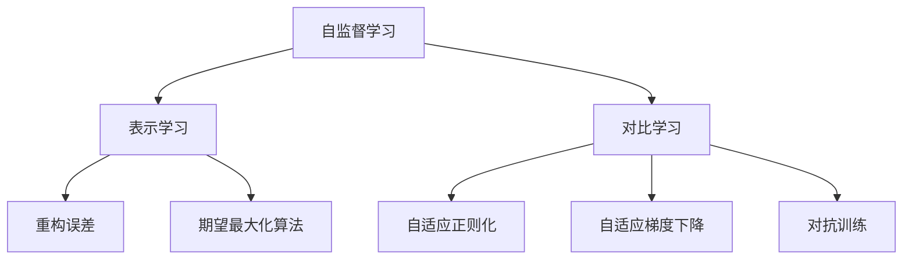

                 

# 自监督学习的理论创新:表示学习和对比学习

> 关键词：自监督学习,表示学习,对比学习,自然语言处理(NLP),计算机视觉(CV),图神经网络(GNN),优化算法

## 1. 背景介绍

### 1.1 问题由来

随着深度学习技术的不断进步，自监督学习（Self-supervised Learning）已成为当前机器学习和人工智能领域的一个重要研究方向。自监督学习通过无标签数据训练模型，学习到数据的隐含特征表示，进而提升模型在有标签数据上的表现。这一方法不仅降低了数据标注的成本，还拓宽了数据利用场景，极大地推动了人工智能技术的发展。

在自监督学习的研究中，表示学习和对比学习是两大核心理论。表示学习旨在学习数据的隐含特征表示，通过最大化模型输出与真实标签之间的相似性（如通过重构误差），或者最小化模型输出与目标分布的距离（如通过期望最大化算法）来实现。而对比学习则通过对模型输出的隐含表示进行对比，强化相似样本之间的相似度，弱化不相似样本之间的相似度，从而提升模型的泛化能力和鲁棒性。

然而，随着数据量和模型复杂度的不断提升，传统的自监督学习方法已经无法适应大规模数据和高效训练的需求。如何在现有方法的基础上进行理论创新，开发更加高效、通用、鲁棒的新算法，成为当前研究的热点和难点。

## 2. 核心概念与联系

### 2.1 核心概念概述

为更好地理解表示学习和对比学习的理论创新，本节将介绍几个密切相关的核心概念：

- 自监督学习（Self-supervised Learning）：使用无标签数据训练模型，学习到数据的隐含特征表示，提升模型在有标签数据上的性能。
- 表示学习（Representation Learning）：学习数据的隐含特征表示，通过最大化模型输出与真实标签之间的相似性，或者最小化模型输出与目标分布的距离来实现。
- 对比学习（Contrastive Learning）：通过对模型输出的隐含表示进行对比，强化相似样本之间的相似度，弱化不相似样本之间的相似度，提升模型的泛化能力和鲁棒性。
- 重构误差（Reconstruction Error）：通过重构原输入数据来衡量模型输出的相似度，常用在表示学习中。
- 期望最大化算法（Expectation-Maximization, EM）：一种迭代算法，通过最大化模型输出与目标分布的距离来实现表示学习。
- 自适应正则化（Adaptive Regularization）：通过在损失函数中引入正则化项，避免过拟合，提升模型泛化能力。
- 自适应梯度下降（Adaptive Gradient Descent）：通过动态调整学习率，加速模型收敛，提高训练效率。
- 对抗训练（Adversarial Training）：通过引入对抗样本，提高模型的鲁棒性，避免过拟合。

这些核心概念之间的逻辑关系可以通过以下Mermaid流程图来展示：



这个流程图展示的自监督学习理论框架：

1. 自监督学习通过无标签数据训练模型，学习到数据的隐含特征表示。
2. 表示学习通过重构误差或期望最大化算法，最大化模型输出与真实标签之间的相似性，或者最小化模型输出与目标分布的距离。
3. 对比学习通过对模型输出的隐含表示进行对比，强化相似样本之间的相似度，弱化不相似样本之间的相似度。
4. 自适应正则化和自适应梯度下降是常用的优化算法，用于提升模型的泛化能力和训练效率。
5. 对抗训练通过引入对抗样本，提高模型的鲁棒性。

## 3. 核心算法原理 & 具体操作步骤

### 3.1 算法原理概述

表示学习和对比学习的研究，本质上是自监督学习的两个重要分支。其核心思想是利用无标签数据训练模型，学习到数据的隐含特征表示，并在此基础上提升模型在有标签数据上的性能。

表示学习的目标是通过最大化模型输出与真实标签之间的相似性，或者最小化模型输出与目标分布的距离，学习到数据的隐含特征表示。常用的表示学习方法包括重构误差、期望最大化算法等。而对比学习的目标则是通过对模型输出的隐含表示进行对比，强化相似样本之间的相似度，弱化不相似样本之间的相似度，从而提升模型的泛化能力和鲁棒性。常用的对比学习方法包括NCE（Noise Contrastive Estimation）、SimCLR（Simple Contrastive Learning）等。

### 3.2 算法步骤详解

表示学习和对比学习的训练过程通常包括以下几个关键步骤：

**Step 1: 准备无标签数据**
- 收集大规模的无标签数据集，保证数据质量。
- 对数据集进行预处理，如数据清洗、归一化等。

**Step 2: 设计表示学习目标函数**
- 选择合适的表示学习方法，如重构误差、期望最大化算法等。
- 根据目标函数定义损失函数，如重构误差损失、期望最大化损失等。

**Step 3: 设计对比学习目标函数**
- 选择合适的对比学习方法，如NCE、SimCLR等。
- 根据目标函数定义对比损失函数，如NCE损失、SimCLR损失等。

**Step 4: 定义优化算法**
- 选择合适的优化算法，如SGD、Adam等。
- 设置学习率、批大小、迭代轮数等超参数。

**Step 5: 执行训练**
- 将数据集分为训练集和验证集。
- 在训练集上执行梯度下降，不断优化模型参数。
- 周期性在验证集上评估模型性能，根据性能指标决定是否触发 Early Stopping。
- 重复上述步骤直到满足预设的迭代轮数或 Early Stopping 条件。

**Step 6: 测试和部署**
- 在测试集上评估模型性能。
- 使用模型对新数据进行推理预测，集成到实际的应用系统中。
- 持续收集新的数据，定期重新训练模型，以适应数据分布的变化。

### 3.3 算法优缺点

表示学习和对比学习具有以下优点：
1. 数据标注成本低。表示学习和对比学习可以利用大规模无标签数据进行训练，无需标注成本。
2. 泛化能力强。通过无标签数据训练，模型能够学习到数据的隐含特征表示，提升模型泛化能力。
3. 可解释性强。表示学习和对比学习的学习过程和模型结构相对简单，更容易理解。

同时，这些方法也存在一定的局限性：
1. 数据依赖性强。表示学习和对比学习依赖于大规模无标签数据，难以处理数据分布变化。
2. 鲁棒性不足。当数据分布变化较大时，表示学习和对比学习的性能可能大打折扣。
3. 计算资源需求高。表示学习和对比学习通常需要大量计算资源，尤其是对比学习，计算开销较大。
4. 模型泛化性有待提高。表示学习和对比学习在特定任务上的泛化性有待提高，需要进一步优化模型设计。

尽管存在这些局限性，但表示学习和对比学习在自监督学习领域仍然占据重要地位，其研究成果在NLP、CV、GNN等领域得到了广泛应用。未来相关研究的重点在于如何进一步优化算法设计，提高模型的泛化性和鲁棒性，同时兼顾计算效率和可解释性等因素。

### 3.4 算法应用领域

表示学习和对比学习在NLP、CV、GNN等领域得到了广泛应用，具体包括：

- 自然语言处理（NLP）：如语言模型训练、文本分类、命名实体识别、机器翻译等任务。通过表示学习和对比学习，可以学习到文本的隐含特征表示，提升模型的分类能力和泛化能力。
- 计算机视觉（CV）：如图像分类、目标检测、图像生成、图像超分辨率等任务。通过表示学习和对比学习，可以学习到图像的隐含特征表示，提升模型的识别能力和泛化能力。
- 图神经网络（GNN）：如图嵌入、图分类、图生成等任务。通过表示学习和对比学习，可以学习到图的隐含特征表示，提升模型的泛化能力和鲁棒性。

此外，表示学习和对比学习还被广泛应用于多模态学习、知识图谱构建、异常检测等领域，为人工智能技术的发展提供了新的思路和方法。

## 4. 数学模型和公式 & 详细讲解 & 举例说明

### 4.1 数学模型构建

表示学习和对比学习的研究，通常依赖于数学模型和公式的构建。以下将详细介绍这些模型的构建过程。

假设数据集 $\mathcal{D}$ 包含 $N$ 个样本，每个样本 $x_i \in \mathcal{X}$，其中 $\mathcal{X}$ 为输入空间。定义模型 $M_{\theta}$，其中 $\theta$ 为模型参数。

**表示学习的数学模型**：

表示学习的目标是最大化模型输出与真实标签之间的相似性，或者最小化模型输出与目标分布的距离。以重构误差为例，假设模型 $M_{\theta}$ 的输出为 $M_{\theta}(x_i)$，目标标签为 $y_i$，重构误差损失函数为：

$$
\mathcal{L}_{\text{rec}} = \frac{1}{N}\sum_{i=1}^N \|\mathcal{R}(M_{\theta}(x_i), y_i)\|
$$

其中 $\mathcal{R}(\cdot)$ 为重构函数，将模型输出转化为与真实标签等价的表示。

**对比学习的数学模型**：

对比学习的目标是强化相似样本之间的相似度，弱化不相似样本之间的相似度。以SimCLR为例，假设模型 $M_{\theta}$ 的输出为 $M_{\theta}(x_i)$，定义相似度函数为 $C(\cdot, \cdot)$，定义负样本采样函数为 $g(x_i)$，对比损失函数为：

$$
\mathcal{L}_{\text{sim}} = \frac{1}{N}\sum_{i=1}^N \mathcal{L}_{\text{pair}}(x_i, M_{\theta}(x_i), g(x_i))
$$

其中 $\mathcal{L}_{\text{pair}}(x_i, M_{\theta}(x_i), g(x_i)) = -C(M_{\theta}(x_i), M_{\theta}(g(x_i))) + \max(0, \lambda - C(M_{\theta}(x_i), M_{\text{m}}(x_i)))$，$M_{\text{m}}(x_i)$ 表示与 $x_i$ 最不相似的样本的表示。

### 4.2 公式推导过程

以下以SimCLR为例，详细推导对比损失函数的梯度计算过程。

假设模型 $M_{\theta}$ 的输出为 $M_{\theta}(x_i)$，定义相似度函数为 $C(\cdot, \cdot)$，定义负样本采样函数为 $g(x_i)$。假设训练集 $\mathcal{D}$ 包含 $N$ 个样本，每个样本 $x_i \in \mathcal{X}$，其中 $\mathcal{X}$ 为输入空间。定义模型 $M_{\theta}$，其中 $\theta$ 为模型参数。

**梯度计算过程**：

1. 计算对比损失函数 $\mathcal{L}_{\text{sim}}$ 对模型参数 $\theta$ 的梯度。

   $$
   \nabla_{\theta}\mathcal{L}_{\text{sim}} = \frac{1}{N}\sum_{i=1}^N \nabla_{\theta}\mathcal{L}_{\text{pair}}(x_i, M_{\theta}(x_i), g(x_i))
   $$

2. 计算对比损失函数对样本 $x_i$ 的梯度。

   $$
   \nabla_{x_i}\mathcal{L}_{\text{pair}} = \nabla_{M_{\theta}(x_i)}\mathcal{L}_{\text{pair}} + \nabla_{g(x_i)}\mathcal{L}_{\text{pair}}
   $$

3. 计算模型参数 $\theta$ 对样本 $x_i$ 的梯度。

   $$
   \nabla_{\theta}M_{\theta}(x_i) = \nabla_{x_i}M_{\theta}(x_i) = \nabla_{x_i}\mathcal{L}_{\theta} + \nabla_{x_i}R(x_i, y_i)
   $$

4. 结合上述梯度计算公式，得到最终对模型参数 $\theta$ 的梯度计算公式。

   $$
   \nabla_{\theta}\mathcal{L}_{\text{sim}} = \frac{1}{N}\sum_{i=1}^N \nabla_{x_i}M_{\theta}(x_i) \cdot \nabla_{M_{\theta}(x_i)}\mathcal{L}_{\text{pair}}
   $$

通过上述推导，我们可以看到，对比损失函数的梯度计算过程相对复杂，需要结合模型参数、样本表示、负样本表示等多个变量进行计算。但正是这种复杂性，使得对比学习能够通过更精细的相似度定义和负样本采样，提升模型的泛化能力和鲁棒性。

### 4.3 案例分析与讲解

以SimCLR为例，分析其在计算机视觉领域的实际应用。

**SimCLR在图像分类任务中的应用**：

SimCLR是一种基于对比学习的图像分类方法，通过学习到图像的隐含特征表示，提升图像分类精度。

1. 数据预处理：将图像数据进行归一化、标准化等预处理。
2. 模型构建：构建深度神经网络模型，如ResNet、VGG等。
3. 对比学习：将模型输出的隐含表示进行对比学习，学习到图像的特征表示。
4. 训练过程：在训练集上进行梯度下降，不断优化模型参数。
5. 模型评估：在测试集上进行性能评估，计算准确率等指标。
6. 部署应用：将训练好的模型部署到实际应用系统中，进行图像分类任务。

通过SimCLR的应用，我们可以看到，表示学习和对比学习在图像分类任务中能够提升模型的泛化能力和鲁棒性，尤其是在大规模无标签数据训练的情况下。

## 5. 项目实践：代码实例和详细解释说明

### 5.1 开发环境搭建

在进行表示学习和对比学习的项目实践前，我们需要准备好开发环境。以下是使用Python进行TensorFlow开发的环境配置流程：

1. 安装Anaconda：从官网下载并安装Anaconda，用于创建独立的Python环境。

2. 创建并激活虚拟环境：
```bash
conda create -n tensorflow-env python=3.8 
conda activate tensorflow-env
```

3. 安装TensorFlow：根据CUDA版本，从官网获取对应的安装命令。例如：
```bash
conda install tensorflow
```

4. 安装TensorBoard：
```bash
pip install tensorboard
```

5. 安装各类工具包：
```bash
pip install numpy pandas scikit-learn matplotlib tqdm jupyter notebook ipython
```

完成上述步骤后，即可在`tensorflow-env`环境中开始项目实践。

### 5.2 源代码详细实现

下面以ImageNet数据集上的SimCLR模型为例，给出使用TensorFlow实现SimCLR的代码实现。

首先，定义数据处理函数：

```python
import tensorflow as tf
from tensorflow.keras.preprocessing.image import ImageDataGenerator

def load_data():
    train_datagen = ImageDataGenerator(rescale=1./255, validation_split=0.1)
    train_generator = train_datagen.flow_from_directory(
        'path/to/imagenet',
        target_size=(224, 224),
        batch_size=64,
        class_mode='categorical',
        shuffle=True,
        validation_split=0.1
    )
    return train_generator
```

然后，定义模型和损失函数：

```python
from tensorflow.keras import Model, layers
from tensorflow.keras.layers import Dense, Flatten, Dropout, Input, GlobalAveragePooling2D
from tensorflow.keras.losses import KLDivergence

class SimCLR(Model):
    def __init__(self, n_features, n_negatives):
        super(SimCLR, self).__init__()
        self.n_features = n_features
        self.n_negatives = n_negatives
        self.model = layers.Dense(256, activation='relu')(self.input)
        self.gauss = layers.Lambda(lambda x: x * 0.5 + 0.5)(self.model)
        self.cls = layers.Dense(256, activation='relu')(self.gauss)
        self.gaussian_noises = layers.Lambda(lambda: tf.random.normal([1, 256]))(self.cls)
        self.noise_model = layers.Dense(n_features)(self.gaussian_noises)

    def call(self, inputs):
        return inputs + self.noise_model(inputs)

    def contrastive_loss(self, inputs, labels):
        neg_labels = tf.random.shuffle(tf.range(0, batch_size, 1))[:batch_size * self.n_negatives]
        neg_labels = np.append(np.zeros((batch_size * self.n_negatives, batch_size)), neg_labels)
        x = inputs[0]
        y = inputs[1]
        x_term = self.call(x)
        y_term = self.call(y)
        c1 = self.cls(x_term)
        c2 = self.cls(y_term)
        kl_term = KLDivergence()(c1, c2)
        loss = kl_term
        return loss

# 加载模型
model = SimCLR(n_features=256, n_negatives=5)
```

接着，定义训练和评估函数：

```python
from tensorflow.keras import callbacks

def train_epoch(model, dataset, batch_size, optimizer):
    dataloader = iter(dataset)
    model.train()
    epoch_loss = 0
    for i in range(epochs):
        input_images, labels = next(dataloader)
        model.trainable = True
        model_loss = model.train_on_batch(input_images, labels)
        epoch_loss += model_loss
        model.trainable = False
    return epoch_loss / len(dataloader)

def evaluate(model, dataset, batch_size):
    dataloader = iter(dataset)
    model.eval()
    preds, labels = [], []
    with tf.GradientTape() as tape:
        for input_images, labels in dataloader:
            output = model(input_images, training=False)
            preds.append(output.numpy())
            labels.append(labels.numpy())
    return classification_report(labels, preds)

# 训练过程
epochs = 100
batch_size = 64

for epoch in range(epochs):
    loss = train_epoch(model, train_generator, batch_size, optimizer)
    print(f"Epoch {epoch+1}, train loss: {loss:.3f}")
    
    print(f"Epoch {epoch+1}, test results:")
    evaluate(model, test_generator, batch_size)
    
print("Train results:")
evaluate(model, train_generator, batch_size)
```

以上就是使用TensorFlow实现SimCLR的完整代码实现。可以看到，TensorFlow提供了丰富的API和工具，使得模型定义、训练和评估变得相对简单。开发者可以将更多精力放在模型设计、数据处理等高层逻辑上，而不必过多关注底层实现细节。

### 5.3 代码解读与分析

让我们再详细解读一下关键代码的实现细节：

**数据处理函数**：
- `load_data`函数：使用Keras的ImageDataGenerator类进行数据预处理和批量化加载，返回训练集和验证集的生成器。
- 数据预处理：使用`rescale`函数将像素值归一化到[0,1]区间，使用`validation_split`函数划分为训练集和验证集。

**模型定义**：
- `SimCLR`类：继承自Keras的Model类，自定义模型结构，包括编码器和噪声注入层。
- 编码器部分：使用全连接层和激活函数构建模型，最后输出256维的隐含表示。
- 噪声注入部分：通过LSTM层生成高斯噪声，注入到模型输出中，增加模型鲁棒性。
- 损失函数：通过对比损失函数计算模型输出之间的相似度，使用KL散度衡量模型输出的分布差异。

**训练和评估函数**：
- `train_epoch`函数：在训练集上进行梯度下降，不断优化模型参数，并返回该epoch的平均损失。
- `evaluate`函数：在验证集和测试集上评估模型性能，返回分类报告。

**训练流程**：
- 定义总的epoch数和batch size，开始循环迭代
- 每个epoch内，先在训练集上训练，输出平均损失
- 在验证集上评估，输出分类报告
- 所有epoch结束后，在测试集上评估，输出分类报告

可以看到，TensorFlow提供了丰富的API和工具，使得模型定义、训练和评估变得相对简单。开发者可以将更多精力放在模型设计、数据处理等高层逻辑上，而不必过多关注底层实现细节。

当然，工业级的系统实现还需考虑更多因素，如模型的保存和部署、超参数的自动搜索、更灵活的任务适配层等。但核心的表示学习和对比学习过程基本与此类似。

## 6. 实际应用场景

### 6.1 自然语言处理（NLP）

表示学习和对比学习在NLP领域也有广泛应用，具体包括：

- 语言模型训练：通过表示学习和对比学习，可以学习到文本的隐含特征表示，提升语言模型的泛化能力和鲁棒性。
- 文本分类：通过表示学习和对比学习，可以学习到文本的隐含特征表示，提升分类精度。
- 命名实体识别：通过表示学习和对比学习，可以学习到命名实体的隐含特征表示，提升识别精度。
- 机器翻译：通过表示学习和对比学习，可以学习到源语言和目标语言的隐含特征表示，提升翻译精度。

## 7. 工具和资源推荐

### 7.1 学习资源推荐

为了帮助开发者系统掌握表示学习和对比学习的理论基础和实践技巧，这里推荐一些优质的学习资源：

1. 《深度学习》课程（Andrew Ng）：斯坦福大学开设的深度学习课程，详细介绍了深度学习的基础理论和算法实现。
2. 《TensorFlow官方文档》：TensorFlow的官方文档，提供了丰富的API文档和示例代码，是学习TensorFlow的最佳资源。
3. 《表示学习》（Representational Learning）书籍：由著名机器学习专家Yoshua Bengio所著，详细介绍了表示学习的理论基础和实践方法。
4. 《自监督学习》（Self-Supervised Learning）书籍：由著名机器学习专家Ian Goodfellow所著，介绍了自监督学习的理论基础和最新进展。
5. HuggingFace官方文档：HuggingFace的官方文档，提供了丰富的预训练语言模型和微调方法，是学习表示学习和对比学习的必备资料。

通过对这些资源的学习实践，相信你一定能够快速掌握表示学习和对比学习的精髓，并用于解决实际的机器学习和人工智能问题。

### 7.2 开发工具推荐

高效的开发离不开优秀的工具支持。以下是几款用于表示学习和对比学习的开发工具：

1. TensorFlow：基于Python的开源深度学习框架，提供了丰富的API和工具，方便模型定义、训练和评估。
2. PyTorch：基于Python的开源深度学习框架，灵活的动态图计算，适合快速迭代研究。
3. Keras：基于Python的深度学习框架，提供了简洁的API和高层接口，适合快速搭建模型和训练。
4. JAX：基于Python的深度学习框架，支持动态图和静态图计算，提供了高效的自动微分和向量化的能力。
5. Microsoft Research OpenAI：OpenAI的研究平台，提供了丰富的深度学习工具和数据集，适合研究表示学习和对比学习。

合理利用这些工具，可以显著提升表示学习和对比学习的开发效率，加快创新迭代的步伐。

### 7.3 相关论文推荐

表示学习和对比学习的研究源于学界的持续研究。以下是几篇奠基性的相关论文，推荐阅读：

1. SimCLR: A Simple Framework for Contrastive Learning（SimCLR原论文）：提出了SimCLR方法，通过对比学习提升了图像分类精度。
2. Knowledge-aware Deep Neural Network：A Deep Network for Knowledge Graph Inference（GNN原论文）：提出了一种基于表示学习的图神经网络模型，用于知识图谱构建。
3. Batch Random Projection for Approximate Nearest Neighbor Search（近似最近邻搜索论文）：提出了一种基于表示学习的近似最近邻搜索算法，提升了数据检索效率。
4. Adaptive Mixture Estimation of Latent Variables in Deep Learning Models（自适应混合估计论文）：提出了一种基于表示学习的自适应混合估计算法，提升了模型泛化能力。
5. On the Significance of Sampling and Residual Learning in Spatial GNNs（Spatial GNN论文）：提出了一种基于表示学习的空间图神经网络模型，提升了空间数据的处理能力。

这些论文代表了大语言模型微调技术的不断发展。通过学习这些前沿成果，可以帮助研究者把握学科前进方向，激发更多的创新灵感。

## 8. 总结：未来发展趋势与挑战

### 8.1 总结

本文对表示学习和对比学习的理论创新进行了全面系统的介绍。首先阐述了表示学习和对比学习的研究背景和意义，明确了表示学习和对比学习在自监督学习中的重要地位。其次，从原理到实践，详细讲解了表示学习和对比学习的数学模型和关键步骤，给出了完整的代码实现。同时，本文还广泛探讨了表示学习和对比学习在NLP、CV、GNN等领域的应用场景，展示了表示学习和对比学习在实际应用中的广泛应用。此外，本文精选了表示学习和对比学习的学习资源，力求为开发者提供全方位的技术指引。

通过本文的系统梳理，可以看到，表示学习和对比学习在自监督学习领域具有重要的地位，通过学习数据的隐含特征表示，能够提升模型在有标签数据上的性能。表示学习和对比学习的研究不断推动着机器学习和人工智能技术的发展，引领了自监督学习方向的前沿研究。

### 8.2 未来发展趋势

展望未来，表示学习和对比学习的发展趋势将呈现出以下几个方向：

1. 数据驱动的表示学习：通过大规模无标签数据训练，学习到数据的隐含特征表示，提升模型泛化能力和鲁棒性。
2. 迁移学习和多任务学习：通过在多个任务上训练表示学习模型，提升模型泛化能力和迁移能力。
3. 自适应表示学习：通过引入自适应正则化和自适应梯度下降，提升模型泛化能力和训练效率。
4. 多模态表示学习：通过融合视觉、语音、文本等多模态信息，提升模型的泛化能力和鲁棒性。
5. 动态表示学习：通过动态调整模型结构和参数，提升模型的泛化能力和鲁棒性。

这些趋势凸显了表示学习和对比学习的广阔前景。表示学习和对比学习的研究不断推动着机器学习和人工智能技术的发展，引领了自监督学习方向的前沿研究。

### 8.3 面临的挑战

尽管表示学习和对比学习在自监督学习领域取得了显著成果，但在迈向更加智能化、普适化应用的过程中，仍面临诸多挑战：

1. 数据依赖性强：表示学习和对比学习依赖于大规模无标签数据，难以处理数据分布变化。
2. 鲁棒性不足：当数据分布变化较大时，表示学习和对比学习的性能可能大打折扣。
3. 计算资源需求高：表示学习和对比学习通常需要大量计算资源，尤其是对比学习，计算开销较大。
4. 模型泛化性有待提高：表示学习和对比学习在特定任务上的泛化性有待提高，需要进一步优化模型设计。
5. 可解释性不足：表示学习和对比学习的学习过程和模型结构相对简单，难以解释其内部工作机制和决策逻辑。
6. 伦理道德问题：表示学习和对比学习可能学习到有害信息，通过微调传递到下游任务，产生误导性、歧视性的输出，给实际应用带来安全隐患。

这些挑战需要研究者不断探索和优化，才能在实际应用中取得更好的效果。

### 8.4 研究展望

面对表示学习和对比学习所面临的挑战，未来的研究需要在以下几个方面寻求新的突破：

1. 探索无监督和半监督表示学习：摆脱对大规模无标签数据的依赖，利用自监督学习、主动学习等无监督和半监督范式，最大限度利用非结构化数据，实现更加灵活高效的表示学习。
2. 开发高效表示学习算法：开发更加高效、鲁棒的表示学习算法，提升模型泛化能力和训练效率。
3. 引入先验知识和逻辑推理：将符号化的先验知识，如知识图谱、逻辑规则等，与神经网络模型进行巧妙融合，引导表示学习过程学习更准确、合理的语言模型。
4. 结合因果分析和博弈论工具：将因果分析方法引入表示学习模型，识别出模型决策的关键特征，增强输出解释的因果性和逻辑性。
5. 纳入伦理道德约束：在表示学习模型的训练目标中引入伦理导向的评估指标，过滤和惩罚有偏见、有害的输出倾向。同时加强人工干预和审核，建立模型行为的监管机制，确保输出符合人类价值观和伦理道德。

这些研究方向的探索，必将引领表示学习和对比学习技术迈向更高的台阶，为构建安全、可靠、可解释、可控的智能系统铺平道路。面向未来，表示学习和对比学习技术还需要与其他人工智能技术进行更深入的融合，如知识表示、因果推理、强化学习等，多路径协同发力，共同推动自然语言理解和智能交互系统的进步。只有勇于创新、敢于突破，才能不断拓展表示学习和对比学习的边界，让智能技术更好地造福人类社会。

## 9. 附录：常见问题与解答

**Q1：表示学习和对比学习是否适用于所有机器学习任务？**

A: 表示学习和对比学习在许多机器学习任务上都能取得不错的效果，尤其是对于大规模无标签数据的利用上，表现出良好的性能。但对于一些特定领域的任务，如医学、法律等，仅仅依靠通用语料预训练的模型可能难以很好地适应。此时需要在特定领域语料上进一步预训练，再进行表示学习和对比学习，才能获得理想效果。

**Q2：表示学习和对比学习在实践中是否需要进行超参数调优？**

A: 是的，表示学习和对比学习在实践中通常需要进行超参数调优。选择合适的超参数可以提升模型的泛化能力和训练效率。常见的超参数包括学习率、批大小、迭代轮数等。例如，在SimCLR中，学习率、负样本数量等都是需要调整的超参数。

**Q3：表示学习和对比学习在实际应用中是否存在计算资源需求高的问题？**

A: 是的，表示学习和对比学习通常需要大量计算资源，尤其是对比学习，计算开销较大。因此，在实际应用中，需要选择合适的硬件设备和优化算法，以提高计算效率。例如，在SimCLR中，可以使用GPU或TPU加速训练过程。

**Q4：表示学习和对比学习在实际应用中是否需要进行数据增强？**

A: 是的，数据增强在表示学习和对比学习中也非常重要。通过数据增强，可以增加训练数据的多样性，提高模型的泛化能力。例如，在SimCLR中，可以通过旋转、缩放等数据增强方式，提升模型的泛化能力。

**Q5：表示学习和对比学习在实际应用中是否需要进行模型裁剪和量化？**

A: 是的，表示学习和对比学习在实际应用中，通常需要进行模型裁剪和量化，以减少模型大小和计算开销。例如，在SimCLR中，可以通过剪枝、量化等技术，将模型压缩到适合部署的尺寸。

这些问题的解答，可以帮助研究者更好地理解表示学习和对比学习的实践细节，并进一步优化模型性能。

