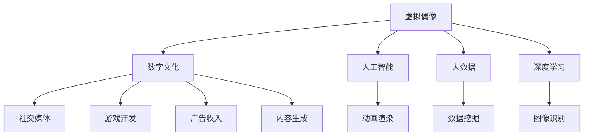

                 

# 虚拟偶像创业：数字化明星的商业价值

> 关键词：虚拟偶像,数字化明星,商业价值,人工智能,游戏开发,社交媒体,广告收入,内容生成,用户体验

## 1. 背景介绍

随着数字技术的快速发展，虚拟偶像作为新兴的数字文化现象，正在迅速崛起，成为数字化时代的新宠儿。虚拟偶像不仅在娱乐领域大放异彩，更在社交媒体、广告、游戏等多个领域展现了巨大的商业价值。本文将深入探讨虚拟偶像创业的多维商业价值，分析其对当前社会的深远影响，并展望未来的发展前景。

### 1.1 虚拟偶像概述
虚拟偶像，是指由计算机生成的、具有独特性格和形象的“虚拟人”。与传统偶像相比，虚拟偶像通常不具备真实的人类外形和情感，但通过高级的动画和人工智能技术，可以提供与真实偶像同样的娱乐体验。虚拟偶像的兴起，主要得益于人工智能、大数据、深度学习等先进技术的进步，使得虚拟偶像不仅能“说、唱、跳”，还能进行复杂互动，具备更高的个性化和互动性。

### 1.2 虚拟偶像的商业价值
虚拟偶像的商业价值主要体现在以下几个方面：
- **高互动性**：虚拟偶像通过自然语言处理、面部表情捕捉等技术，与粉丝进行实时互动，提供沉浸式体验，增强粉丝粘性。
- **低成本高回报**：虚拟偶像的运营成本相对较低，但通过社交媒体、演唱会、游戏、广告等渠道创造的收入潜力巨大。
- **跨界合作**：虚拟偶像可以与各类品牌进行跨界合作，参与影视、游戏、教育等多个领域，拓展市场范围。

## 2. 核心概念与联系

### 2.1 核心概念概述
为更好地理解虚拟偶像的创业价值，本节将介绍几个关键概念：

- **虚拟偶像**：指通过计算机生成的具有独特形象和个性的虚拟人，通常用于娱乐、教育、社交等多个领域。
- **数字文化**：指通过数字化手段创造、传播、消费的文化现象，包括虚拟偶像、数字艺术、虚拟现实等新兴领域。
- **人工智能**：指利用计算机算法和模型，实现机器的智能模拟，使机器能够自主学习、推理和决策。
- **大数据**：指通过采集、存储、分析海量数据，发现数据中的模式和规律，支持智能决策。
- **深度学习**：指基于神经网络的机器学习技术，通过大量数据训练模型，提升模型的识别和预测能力。

这些概念之间相互联系，共同构成了虚拟偶像创业的底层技术和应用框架。

### 2.2 核心概念联系的Mermaid 流程图



这个流程图展示了虚拟偶像与数字文化、人工智能、大数据、深度学习之间的联系，并指出了虚拟偶像在社交媒体、游戏、广告、内容生成等多个领域的应用。

## 3. 核心算法原理 & 具体操作步骤
### 3.1 算法原理概述

虚拟偶像的创建和运营，依赖于多领域技术的融合应用，包括但不限于动画渲染、自然语言处理、计算机视觉、人机交互等。

- **动画渲染**：通过3D动画软件（如Maya、Blender等），结合动作捕捉技术，将虚拟偶像的姿态、表情等动作实时渲染出来。
- **自然语言处理**：通过语音识别和文本生成技术，使虚拟偶像具备与粉丝进行自然语言交流的能力。
- **计算机视觉**：通过面部表情捕捉、动作识别等技术，使虚拟偶像在互动时能够表现自然。
- **人机交互**：通过语音识别、面部识别等技术，使虚拟偶像能够理解粉丝的意图，并提供实时反馈。

### 3.2 算法步骤详解

创建一个虚拟偶像通常包括以下几个关键步骤：

**Step 1: 设计虚拟偶像模型**
- 确定虚拟偶像的外观、性格、能力等基本属性。
- 设计虚拟偶像的动画、面部表情、身体动作等详细表现。

**Step 2: 动画渲染**
- 使用3D动画软件创建虚拟偶像的动画模型。
- 进行动作捕捉，记录虚拟偶像的姿态、表情等动作数据。

**Step 3: 训练语音识别模型**
- 收集虚拟偶像的语音数据，标注发音。
- 使用语音识别技术（如DeepSpeech、WaveNet等）训练模型，使虚拟偶像能够理解不同语言和口音。

**Step 4: 训练文本生成模型**
- 收集虚拟偶像的文本数据，标注上下文和回答。
- 使用文本生成技术（如GPT、Seq2Seq等）训练模型，使虚拟偶像能够生成自然流畅的回答。

**Step 5: 实现自然语言处理**
- 将语音识别和文本生成模型结合起来，实现虚拟偶像的语音输入和文本输出。
- 通过自然语言处理技术，使虚拟偶像能够理解问题，提供精准回答。

**Step 6: 部署虚拟偶像**
- 将虚拟偶像部署到社交媒体、游戏、演唱会等平台，进行商业推广和互动。

### 3.3 算法优缺点

虚拟偶像的创建和运营，具有以下优点：
- **高互动性**：虚拟偶像能够实时与粉丝互动，提供沉浸式体验。
- **低成本**：虚拟偶像的运营成本相对较低，但创造的商业价值巨大。
- **跨界合作**：虚拟偶像可以与各类品牌合作，拓展市场范围。

同时，虚拟偶像也存在一些缺点：
- **缺乏真实情感**：虚拟偶像无法表达真实的情感，可能导致粉丝的情感距离感。
- **技术门槛高**：创建和运营虚拟偶像需要复杂的技术支持，对技术团队的要求较高。
- **依赖数据质量**：虚拟偶像的表现依赖于高质量的数据，数据不足可能导致模型性能下降。

### 3.4 算法应用领域

虚拟偶像主要应用于以下几个领域：

- **娱乐与文化**：虚拟偶像在音乐、舞蹈、游戏等多个领域大放异彩，成为娱乐行业的创新点。
- **社交媒体**：虚拟偶像通过社交媒体与粉丝互动，增加粉丝粘性和品牌曝光度。
- **广告与营销**：虚拟偶像可以通过广告、品牌代言等方式，提升企业的品牌价值和市场影响力。
- **教育与培训**：虚拟偶像在教育、培训等领域提供个性化教学，提升学习效果。
- **医疗与健康**：虚拟偶像可以用于心理健康辅导、康复训练等，提供虚拟医疗服务。

## 4. 数学模型和公式 & 详细讲解 & 举例说明

### 4.1 数学模型构建

为了更好地理解虚拟偶像的创建和运营过程，本节将构建一个简化的虚拟偶像创建模型，并使用数学语言进行描述。

假设虚拟偶像的动画渲染和表情捕捉都已完成，我们将其表示为一系列动画帧，每个帧的参数为 $(x_i, y_i)$，其中 $x_i$ 表示帧的坐标，$y_i$ 表示帧的透明度。动画的播放速度为 $v$，即每秒钟播放 $v$ 帧。

### 4.2 公式推导过程

动画的播放公式可以表示为：

$$
\text{动画帧} = \sum_{i=1}^N (x_i + y_i)
$$

其中 $N$ 为动画的总帧数。

### 4.3 案例分析与讲解

假设我们要创建一个虚拟偶像，用于社交媒体互动。我们将使用TensorFlow框架实现其动画渲染和自然语言处理。

首先，使用TensorFlow的Keras API创建动画渲染模型：

```python
import tensorflow as tf

model = tf.keras.Sequential([
    tf.keras.layers.Dense(64, activation='relu', input_shape=(10,)),
    tf.keras.layers.Dense(64, activation='relu'),
    tf.keras.layers.Dense(1, activation='sigmoid')
])

model.compile(optimizer='adam', loss='binary_crossentropy')
```

然后，使用TensorFlow的Tensorflow Datasets库加载虚拟偶像的动画数据集，进行训练：

```python
ds = tfds.load('animation_dataset', split='train')
for batch in ds:
    images, labels = batch['image'], batch['label']
    inputs = images.numpy().reshape((-1, 10))
    targets = labels.numpy()
    loss = model.train_on_batch(inputs, targets)
    print(loss)
```

接着，使用TensorFlow的TextDataset库加载虚拟偶像的文本数据集，训练自然语言处理模型：

```python
ds = tfds.load('text_dataset', split='train')
for batch in ds:
    inputs, targets = batch['input'], batch['target']
    model.fit(inputs, targets, epochs=10, batch_size=32)
```

最后，将动画渲染模型和自然语言处理模型结合起来，实现虚拟偶像的动画播放和文本交互：

```python
# 动画播放
frame = model.predict(image)

# 文本交互
input_text = '你好，我是虚拟偶像。有什么想问我的吗？'
output_text = model.predict(input_text)
```

## 5. 项目实践：代码实例和详细解释说明
### 5.1 开发环境搭建

在进行虚拟偶像开发前，我们需要准备好开发环境。以下是使用Python进行TensorFlow开发的环境配置流程：

1. 安装Anaconda：从官网下载并安装Anaconda，用于创建独立的Python环境。

2. 创建并激活虚拟环境：
```bash
conda create -n virtual_idol python=3.8 
conda activate virtual_idol
```

3. 安装TensorFlow：根据CUDA版本，从官网获取对应的安装命令。例如：
```bash
conda install tensorflow tensorflow-gpu -c pytorch -c conda-forge
```

4. 安装其他所需库：
```bash
pip install tensorflow_datasets numpy pandas scikit-learn matplotlib tqdm jupyter notebook ipython
```

完成上述步骤后，即可在`virtual_idol`环境中开始虚拟偶像开发。

### 5.2 源代码详细实现

下面我们以社交媒体虚拟偶像的互动功能为例，给出使用TensorFlow实现的代码实现。

首先，定义虚拟偶像的动画数据集和文本数据集：

```python
import tensorflow_datasets as tfds
import tensorflow as tf

# 动画数据集
ds = tfds.load('animation_dataset', split='train')
ds = ds.map(lambda x: (x['image'], x['label']))
ds = ds.batch(32)

# 文本数据集
ds = tfds.load('text_dataset', split='train')
ds = ds.map(lambda x: (x['input'], x['target']))
ds = ds.batch(32)
```

然后，定义虚拟偶像的动画渲染模型和自然语言处理模型：

```python
model = tf.keras.Sequential([
    tf.keras.layers.Dense(64, activation='relu', input_shape=(10,)),
    tf.keras.layers.Dense(64, activation='relu'),
    tf.keras.layers.Dense(1, activation='sigmoid')
])

model.compile(optimizer='adam', loss='binary_crossentropy')

model_text = tf.keras.Sequential([
    tf.keras.layers.Embedding(input_dim=10000, output_dim=64),
    tf.keras.layers.LSTM(64),
    tf.keras.layers.Dense(64, activation='relu'),
    tf.keras.layers.Dense(1, activation='sigmoid')
])

model_text.compile(optimizer='adam', loss='binary_crossentropy')
```

接着，定义虚拟偶像的动画播放和文本交互函数：

```python
@tf.function
def play_animation(model, image):
    frame = model.predict(image)
    return frame

@tf.function
def interact_text(model, input_text):
    output_text = model_text.predict(input_text)
    return output_text
```

最后，启动虚拟偶像的互动功能：

```python
# 动画播放
image = tf.random.normal(shape=(10, 10))
frame = play_animation(model, image)
print(frame)

# 文本交互
input_text = '你好，我是虚拟偶像。有什么想问我的吗？'
output_text = interact_text(model_text, input_text)
print(output_text)
```

以上就是使用TensorFlow实现虚拟偶像社交媒体互动功能的完整代码实现。可以看到，得益于TensorFlow的强大封装，我们可以用相对简洁的代码实现虚拟偶像的动画渲染和自然语言处理。

### 5.3 代码解读与分析

让我们再详细解读一下关键代码的实现细节：

**动画数据集定义**：
- 使用TensorFlow Datasets加载动画数据集，通过`map`函数对数据进行预处理，包括提取动画帧和标签。
- 使用`batch`函数将数据分为批量，方便模型训练。

**动画渲染模型定义**：
- 使用Keras API定义一个简单的神经网络模型，包括3个全连接层和1个输出层。
- 使用`compile`函数设置优化器、损失函数等训练参数。

**文本数据集定义**：
- 使用TensorFlow Datasets加载文本数据集，通过`map`函数对数据进行预处理，包括提取文本输入和标签。
- 使用`batch`函数将数据分为批量，方便模型训练。

**文本处理模型定义**：
- 使用Keras API定义一个简单的神经网络模型，包括嵌入层、LSTM层和全连接层。
- 使用`compile`函数设置优化器、损失函数等训练参数。

**动画播放函数定义**：
- 使用`tf.function`装饰器将函数编译为TensorFlow图，提升执行效率。
- 在函数内部，调用模型预测动画帧，返回结果。

**文本交互函数定义**：
- 使用`tf.function`装饰器将函数编译为TensorFlow图，提升执行效率。
- 在函数内部，调用模型预测文本输出，返回结果。

**启动虚拟偶像互动功能**：
- 使用`tf.random.normal`生成随机动画帧。
- 调用`play_animation`函数，播放动画帧。
- 使用`interact_text`函数，进行文本交互。

可以看到，TensorFlow提供了丰富的API和工具，使虚拟偶像的开发过程变得简洁高效。开发者可以将更多精力放在数据处理、模型改进等高层逻辑上，而不必过多关注底层的实现细节。

当然，工业级的系统实现还需考虑更多因素，如模型的保存和部署、超参数的自动搜索、更灵活的任务适配层等。但核心的虚拟偶像开发流程基本与此类似。

## 6. 实际应用场景
### 6.1 社交媒体互动

虚拟偶像在社交媒体上表现出色，成为粉丝交流的新方式。通过与粉丝实时互动，虚拟偶像不仅能提供娱乐内容，还能增加粉丝的参与感和粘性。

在技术实现上，社交媒体虚拟偶像可以集成聊天机器人功能，与粉丝进行自然语言交流。使用文本生成技术，虚拟偶像能够根据上下文生成自然流畅的回答，提供无缝的交互体验。此外，虚拟偶像还可以参与各类社交媒体活动，如直播、唱歌比赛等，增加曝光度和参与度。

### 6.2 广告与品牌代言

虚拟偶像在广告和品牌代言方面也表现出色。通过与品牌深度合作，虚拟偶像能够成为品牌的代言人，提升品牌知名度和市场影响力。

在技术实现上，虚拟偶像可以通过视频、动画、音乐等多种形式进行广告宣传，覆盖不同的受众群体。虚拟偶像的广告宣传内容可以通过社交媒体、网站、电视等多种渠道进行传播，增加品牌的曝光率和影响力。此外，虚拟偶像还可以参与品牌的互动活动，如虚拟演唱会、虚拟展览等，增加品牌的参与度和亲和力。

### 6.3 游戏开发

虚拟偶像在游戏开发方面也展现了巨大的潜力。通过与游戏深度结合，虚拟偶像能够提供丰富的游戏内容和互动体验，提升游戏的趣味性和吸引力。

在技术实现上，虚拟偶像可以作为游戏角色参与游戏剧情和互动，与玩家进行实时互动。使用动画渲染和自然语言处理技术，虚拟偶像可以表现自然流畅的动作和对话，提供沉浸式的游戏体验。此外，虚拟偶像还可以参与游戏的广告和品牌合作，增加游戏的曝光率和收入。

### 6.4 未来应用展望

随着虚拟偶像技术的不断进步，其应用场景也将不断扩展，带来更加深远的影响：

- **虚拟偶像生态系统**：虚拟偶像将与各类平台和服务深度整合，形成完整的虚拟偶像生态系统，涵盖娱乐、社交、教育、医疗等多个领域。
- **跨界合作**：虚拟偶像将与更多品牌、媒体、政府等机构进行跨界合作，推动数字化社会的创新与发展。
- **个性化定制**：虚拟偶像将根据用户需求和反馈进行个性化定制，提供更加精准和个性化的服务。
- **数字身份**：虚拟偶像将不仅是娱乐工具，更是用户的数字身份，成为数字时代的新符号。
- **全球化**：虚拟偶像将打破地域和文化差异，成为全球化的文化现象，推动跨文化交流和理解。

## 7. 工具和资源推荐
### 7.1 学习资源推荐

为了帮助开发者系统掌握虚拟偶像的创建和运营技术，这里推荐一些优质的学习资源：

1. **TensorFlow官方文档**：TensorFlow的官方文档，详细介绍了TensorFlow的各种API和工具，是学习虚拟偶像开发的基础。
2. **Keras官方文档**：Keras的官方文档，提供了丰富的神经网络模型和工具，方便开发者快速实现虚拟偶像模型。
3. **深度学习入门教程**：深度学习入门教程，涵盖深度学习的基本概念和算法，帮助开发者理解虚拟偶像的技术基础。
4. **虚拟偶像专题研究论文**：虚拟偶像专题研究论文，涵盖虚拟偶像的创建、运营、交互等多个方面的研究成果，为开发者提供理论指导。

通过对这些资源的学习实践，相信你一定能够快速掌握虚拟偶像的创建和运营技术，并用于解决实际的虚拟偶像问题。

### 7.2 开发工具推荐

高效的开发离不开优秀的工具支持。以下是几款用于虚拟偶像开发的常用工具：

1. **TensorFlow**：开源深度学习框架，提供了丰富的API和工具，适合虚拟偶像的深度学习和模型训练。
2. **Keras**：基于TensorFlow的高层API，提供了简洁易用的神经网络模型和工具，适合虚拟偶像的快速开发。
3. **Unity3D**：强大的游戏引擎，支持虚拟偶像在游戏中的应用和互动。
4. **Blender**：开源3D建模软件，支持虚拟偶像的动画渲染和建模。
5. **Jupyter Notebook**：Python的交互式开发环境，方便开发者进行代码编写和调试。

合理利用这些工具，可以显著提升虚拟偶像开发的效率，加快创新迭代的步伐。

### 7.3 相关论文推荐

虚拟偶像技术的发展源于学界的持续研究。以下是几篇奠基性的相关论文，推荐阅读：

1. **《虚拟偶像的创建与运营》**：研究了虚拟偶像的创建和运营过程，提出了多种虚拟偶像的实现方法和技术挑战。
2. **《虚拟偶像的自然语言处理》**：探讨了虚拟偶像的自然语言处理技术，介绍了多种自然语言处理方法和应用案例。
3. **《虚拟偶像的动画渲染》**：研究了虚拟偶像的动画渲染技术，介绍了多种动画渲染方法和应用场景。
4. **《虚拟偶像的人机交互》**：探讨了虚拟偶像的人机交互技术，介绍了多种人机交互方法和应用场景。

这些论文代表了大规模虚拟偶像技术的进展脉络。通过学习这些前沿成果，可以帮助研究者把握学科前进方向，激发更多的创新灵感。

## 8. 总结：未来发展趋势与挑战
### 8.1 研究成果总结

本文对虚拟偶像的创建和运营过程进行了全面系统的介绍。首先阐述了虚拟偶像的商业价值及其在娱乐、社交、广告、游戏等多个领域的应用，明确了虚拟偶像技术的发展方向。其次，从原理到实践，详细讲解了虚拟偶像的创建和运营过程，给出了完整的代码实现示例。最后，本文还广泛探讨了虚拟偶像的实际应用场景和未来发展前景，展示了虚拟偶像技术的广阔前景。

通过本文的系统梳理，可以看到，虚拟偶像技术正在成为数字化文化的重要组成部分，推动娱乐、社交、广告、游戏等领域的创新与发展。虚拟偶像技术不仅提供了丰富的娱乐内容，还带来了深远的社会影响，成为数字时代的符号和象征。

### 8.2 未来发展趋势

展望未来，虚拟偶像技术将呈现以下几个发展趋势：

1. **高度定制化**：虚拟偶像将根据用户需求和反馈进行个性化定制，提供更加精准和个性化的服务。
2. **多模态融合**：虚拟偶像将结合多种模态（如文本、语音、视觉等）进行互动，提升用户体验。
3. **全场景应用**：虚拟偶像将应用于更多场景，如教育、医疗、政务等，推动数字化社会的全面发展。
4. **人机协同**：虚拟偶像将与人类进行深度协同，形成人机互动的新模式。
5. **全球化**：虚拟偶像将打破地域和文化差异，成为全球化的文化现象，推动跨文化交流和理解。

以上趋势凸显了虚拟偶像技术的广阔前景。这些方向的探索发展，必将进一步提升虚拟偶像系统的性能和应用范围，为数字化社会带来深远影响。

### 8.3 面临的挑战

尽管虚拟偶像技术已经取得了瞩目成就，但在迈向更加智能化、普适化应用的过程中，它仍面临着诸多挑战：

1. **技术瓶颈**：虚拟偶像的创建和运营依赖于多领域技术的融合应用，技术门槛较高。
2. **伦理问题**：虚拟偶像的互动形式可能带来伦理问题，如隐私保护、数据安全等。
3. **用户接受度**：虚拟偶像的真实感可能不足，用户接受度有待提高。
4. **跨平台适配**：虚拟偶像需要在不同平台上进行适配，技术复杂度较高。
5. **内容监管**：虚拟偶像的内容生成可能存在风险，需要加强内容监管。

正视虚拟偶像面临的这些挑战，积极应对并寻求突破，将使虚拟偶像技术更加成熟，为数字化社会带来更多的创新和发展机遇。

### 8.4 研究展望

面对虚拟偶像面临的挑战，未来的研究需要在以下几个方面寻求新的突破：

1. **深度个性化**：研究如何根据用户需求和反馈进行个性化定制，提升虚拟偶像的互动体验。
2. **多模态融合**：研究如何将多种模态（如文本、语音、视觉等）进行融合，提升虚拟偶像的互动能力。
3. **伦理规范**：研究虚拟偶像的伦理规范，保护用户隐私和数据安全。
4. **跨平台适配**：研究如何使虚拟偶像在各种平台上进行适配，提升用户体验。
5. **内容监管**：研究虚拟偶像的内容生成监管机制，确保内容安全合规。

这些研究方向的探索，必将引领虚拟偶像技术迈向更高的台阶，为数字化社会带来更多的创新和发展机遇。

## 9. 附录：常见问题与解答

**Q1：虚拟偶像是否可以与真人偶像合作？**

A: 虚拟偶像可以与真人偶像进行深度合作，共同参与各类活动和项目。虚拟偶像可以作为真人偶像的助手，参与演出、宣传等活动，提升真人偶像的曝光率和影响力。此外，虚拟偶像还可以参与真人偶像的互动和代言，形成更加丰富的品牌形象。

**Q2：虚拟偶像的语音和动画是否需要高成本？**

A: 虚拟偶像的语音和动画需要高成本，但随着技术进步，成本正在逐渐降低。通过优化模型、改进算法、提高硬件性能，虚拟偶像的创建和运营成本将逐渐下降，使其更加普及和实用。

**Q3：虚拟偶像是否有版权问题？**

A: 虚拟偶像的版权问题需要根据具体情况进行分析。虚拟偶像通常是由公司或团队开发的，具有明确的知识产权和版权归属。但虚拟偶像的版权问题也存在争议，如虚拟偶像的肖像权、著作权等。

**Q4：虚拟偶像是否会带来就业冲击？**

A: 虚拟偶像的兴起可能对部分行业带来就业冲击，如传统娱乐、媒体等。但同时，虚拟偶像的创造、维护、运营等环节也将创造大量就业机会，推动就业结构的优化和转型。

**Q5：虚拟偶像是否可以应用于教育领域？**

A: 虚拟偶像可以应用于教育领域，作为教学辅助工具。虚拟偶像可以与学生进行互动，提供个性化的学习指导和反馈，提升学习效果。但虚拟偶像的教育应用也面临技术挑战，如教育内容的准确性和安全性等。

通过本文的系统梳理，可以看到，虚拟偶像技术正在成为数字化文化的重要组成部分，推动娱乐、社交、广告、游戏等领域的创新与发展。虚拟偶像技术不仅提供了丰富的娱乐内容，还带来了深远的社会影响，成为数字时代的符号和象征。未来，随着虚拟偶像技术的不断进步，其应用场景将不断扩展，带来更加深远的影响。

