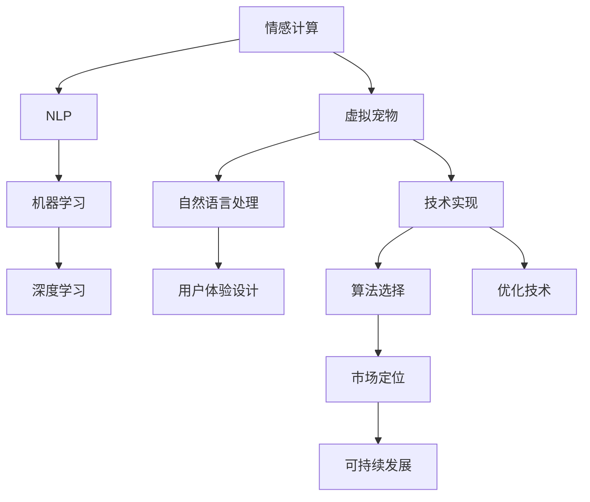

                 

## 1. 背景介绍

### 1.1 问题由来

近年来，随着移动互联网和智能设备的普及，数字化生活方式已经深入人心。虚拟宠物，作为这一趋势的产物，在提供陪伴、缓解孤独感方面展现了巨大潜力。然而，传统虚拟宠物的体验往往停留在简单的互动和娱乐层面，缺乏深度情感联系和个性化关怀，难以满足人们日益增长的心理需求。

### 1.2 问题核心关键点

- **用户体验**：虚拟宠物是否能够真正成为用户情感的寄托，感受到其存在意义。
- **个性化服务**：如何为不同用户提供定制化、个性化服务，提升用户体验。
- **情感互动**：虚拟宠物如何与用户建立深度情感连接，实现自然的情感交流。
- **技术实现**：虚拟宠物的技术架构、算法选择与优化。
- **市场定位**：如何对虚拟宠物进行市场定位，找到其独特的价值主张。
- **可持续发展**：如何确保虚拟宠物项目的长期运营和用户粘性。

这些问题构成了虚拟宠物创业的核心，亟待研究和解决。

### 1.3 问题研究意义

虚拟宠物项目具有巨大的市场潜力和情感价值，能够填补现实生活中的情感空缺，为现代人在快节奏生活中提供心灵的慰藉。通过深入研究虚拟宠物的技术实现和用户体验，可以为未来的数字陪伴产品开发提供借鉴，推动情感计算和人工智能技术的发展。

## 2. 核心概念与联系

### 2.1 核心概念概述

为更好地理解虚拟宠物创业的挑战与机遇，我们首先需要梳理几个核心概念：

- **情感计算(Emotion AI)**：通过人工智能技术，识别、理解、处理和生成人类情感的科学。
- **虚拟宠物**：通过智能算法和数字模型，模拟真实宠物的情感、行为和互动方式，提供陪伴体验。
- **自然语言处理(NLP)**：使计算机能够理解、生成和处理人类语言的技术，是虚拟宠物与用户交流的基础。
- **机器学习与深度学习**：通过算法训练模型，让虚拟宠物具备智能行为和个性化服务能力。
- **用户体验设计(UXD)**：设计满足用户需求、提升用户满意度的交互体验，是虚拟宠物项目成功的关键。

这些概念之间的联系可以通过以下Mermaid流程图来展示：



这个流程图展示了情感计算、虚拟宠物、NLP、机器学习、深度学习、用户体验设计、技术实现、算法选择、优化技术、市场定位和可持续发展等概念之间的逻辑关系。

## 3. 核心算法原理 & 具体操作步骤
### 3.1 算法原理概述

虚拟宠物的情感价值实现，基于情感计算和深度学习的综合应用。核心算法包括：

- **情感识别与理解**：通过NLP技术，对用户语言和行为进行情感分析，理解用户的情绪状态。
- **智能互动与对话**：使用深度学习模型，训练虚拟宠物的对话和互动系统，使其能够与用户进行自然流畅的交流。
- **个性化服务与推荐**：通过机器学习算法，根据用户行为和偏好，提供定制化的服务与推荐。

这些算法通过情感计算框架整合，形成一个完整的情感交互系统。

### 3.2 算法步骤详解

#### 3.2.1 情感识别与理解

1. **数据收集**：收集用户与虚拟宠物的对话数据，包括文本、语音、表情等。
2. **数据预处理**：清洗数据，去除噪声和无用信息，提取文本特征。
3. **情感分析**：使用情感词典、情感分类器等工具，对文本进行情感极性分类，识别情绪状态。
4. **情感理解**：通过序列模型（如LSTM、GRU）对用户情感变化进行建模，理解情绪变化趋势和情感需求。

#### 3.2.2 智能互动与对话

1. **对话模型训练**：使用预训练的对话模型（如GPT、BERT）作为初始化参数，在标注数据上进行微调。
2. **上下文感知**：设计上下文窗口，使虚拟宠物能够根据用户上下文进行智能响应。
3. **多模态输入**：引入语音、图像等模态，增强虚拟宠物的感知能力。
4. **用户反馈循环**：收集用户对虚拟宠物的反馈，不断优化模型参数，提升交互质量。

#### 3.2.3 个性化服务与推荐

1. **用户行为分析**：通过行为数据（如使用时间、互动频率、偏好）分析用户需求。
2. **个性化服务**：根据用户行为和偏好，提供定制化的服务（如礼物、活动）。
3. **推荐系统设计**：引入协同过滤、内容推荐等算法，推荐虚拟宠物活动和内容。
4. **反馈迭代优化**：根据用户反馈，不断调整推荐策略，提升推荐准确性。

### 3.3 算法优缺点

虚拟宠物的情感价值算法具有以下优点：

- **自然交互**：通过深度学习模型，虚拟宠物能够自然流畅地与用户交流，提升用户体验。
- **高度个性化**：通过机器学习算法，能够根据用户行为和偏好提供定制化服务，提升用户粘性。
- **情感感知**：通过情感计算技术，能够理解用户的情感状态，提供有针对性的关怀。

同时，该算法也存在以下缺点：

- **数据隐私**：虚拟宠物项目需要收集大量用户数据，涉及隐私保护和数据安全问题。
- **计算资源**：深度学习模型的训练和推理需要大量计算资源，可能导致成本较高。
- **模型泛化**：虚拟宠物模型可能过度拟合特定用户，难以泛化到新用户。
- **交互复杂性**：虚拟宠物的情感识别和理解算法较为复杂，需要精确调参和持续优化。

### 3.4 算法应用领域

虚拟宠物的情感价值算法不仅适用于虚拟宠物项目，还广泛应用于其他情感计算和智能交互领域，如智能客服、情感分析、社交机器人等。

- **智能客服**：通过情感计算，提供情感化的客服体验，提升用户满意度。
- **情感分析**：分析社交媒体上的用户情感，提供舆情分析、市场洞察等服务。
- **社交机器人**：通过情感计算和深度学习，使机器人能够与用户进行深度情感交流，提升互动质量。

## 4. 数学模型和公式 & 详细讲解
### 4.1 数学模型构建

虚拟宠物的情感价值实现，涉及多个数学模型和算法。以下是其中两个核心模型的构建：

#### 情感识别模型

1. **文本特征提取**：使用TF-IDF、词向量（如Word2Vec、GloVe）提取文本特征。
2. **情感分类模型**：基于情感词典和分类器，对文本进行情感极性分类。

公式表示如下：

$$
\text{Emotion} = \text{SVM}(\text{TF-IDF}, \text{Word2Vec})
$$

#### 对话模型

1. **序列模型训练**：使用LSTM、GRU等序列模型对用户对话进行建模。
2. **上下文感知**：引入上下文窗口，对当前对话进行上下文感知。

公式表示如下：

$$
\text{Reply} = \text{LSTM}(\text{Context}, \text{History})
$$

### 4.2 公式推导过程

#### 情感识别模型推导

1. **文本特征提取**：使用TF-IDF和词向量提取文本特征。
2. **情感分类模型**：将文本特征输入到SVM分类器中进行情感极性分类。

具体推导过程如下：

$$
\text{TF-IDF}(x) = \text{Idf} \times \text{TermFrequency}(x)
$$

$$
\text{Word2Vec}(x) = \text{EmbeddingMatrix} \times \text{BagOfWords}(x)
$$

$$
\text{Emotion} = \text{SVM}(\text{TF-IDF}, \text{Word2Vec})
$$

#### 对话模型推导

1. **序列模型训练**：使用LSTM对用户对话进行建模，输出回复。
2. **上下文感知**：引入上下文窗口，对当前对话进行上下文感知。

具体推导过程如下：

$$
\text{Reply} = \text{LSTM}(\text{Context}, \text{History})
$$

其中，$\text{Context}$ 表示当前对话的上下文，$\text{History}$ 表示用户之前的对话历史。

### 4.3 案例分析与讲解

#### 案例一：情感识别模型应用

某虚拟宠物项目收集了大量用户与虚拟宠物的对话数据，使用情感词典和分类器对用户情感进行识别。具体步骤如下：

1. **数据收集**：从用户对话数据中提取文本信息。
2. **文本特征提取**：使用TF-IDF和词向量提取文本特征。
3. **情感分类**：使用情感词典和分类器对文本进行情感极性分类。

实现代码如下：

```python
from sklearn.feature_extraction.text import TfidfVectorizer
from sklearn.svm import SVC
from gensim.models import Word2Vec

# 文本特征提取
tfidf = TfidfVectorizer()
word2vec = Word2Vec()

# 情感分类
svm = SVC()

# 训练模型
X_train = tfidf.fit_transform(train_data)
y_train = svm.fit(X_train, train_labels)

# 预测情感
X_test = tfidf.transform(test_data)
y_pred = svm.predict(X_test)

print(classification_report(y_test, y_pred))
```

#### 案例二：对话模型应用

某虚拟宠物项目使用LSTM模型训练对话系统，提升与用户的互动质量。具体步骤如下：

1. **数据收集**：从用户对话数据中提取对话历史和上下文信息。
2. **序列模型训练**：使用LSTM对对话历史进行建模，输出回复。
3. **上下文感知**：引入上下文窗口，对当前对话进行上下文感知。

实现代码如下：

```python
from tensorflow.keras.models import Sequential
from tensorflow.keras.layers import LSTM, Dense, Dropout

# 构建LSTM模型
model = Sequential()
model.add(LSTM(128, return_sequences=True, input_shape=(max_seq_len, embedding_dim)))
model.add(Dropout(0.2))
model.add(LSTM(128))
model.add(Dense(vocab_size, activation='softmax'))

# 编译模型
model.compile(optimizer='adam', loss='categorical_crossentropy', metrics=['accuracy'])

# 训练模型
model.fit(X_train, y_train, epochs=10, batch_size=32)

# 生成回复
def generate_reply(input_seq):
    input_seq = pad_sequences([input_seq], maxlen=max_seq_len, padding='pre')
    reply_seq = model.predict(input_seq)
    return decode_sequence(reply_seq[0])

print(generate_reply(input_seq))
```

## 5. 项目实践：代码实例和详细解释说明
### 5.1 开发环境搭建

虚拟宠物项目开发需要具备以下开发环境：

1. **Python环境**：Python 3.7+，推荐使用Anaconda或Pyenv管理。
2. **深度学习框架**：TensorFlow 2.0+或PyTorch 1.7+。
3. **自然语言处理工具**：NLTK、SpaCy、Gensim等。
4. **用户界面工具**：Flask、Django、React等。

具体搭建步骤如下：

1. **安装Anaconda或Pyenv**：从官网下载并安装，创建虚拟环境。
2. **安装深度学习框架**：根据官方文档安装TensorFlow或PyTorch。
3. **安装NLP工具**：使用pip安装NLTK、SpaCy、Gensim等工具。
4. **安装用户界面工具**：使用pip安装Flask、Django、React等。

### 5.2 源代码详细实现

以下是一个简单的虚拟宠物项目的代码实现：

#### 5.2.1 数据预处理

```python
from sklearn.model_selection import train_test_split
from tensorflow.keras.preprocessing.text import Tokenizer, pad_sequences

# 数据预处理
def preprocess_data(data):
    # 分词
    tokenizer = Tokenizer(oov_token='<OOV>')
    tokenizer.fit_on_texts(data)
    sequences = tokenizer.texts_to_sequences(data)
    
    # 填充序列
    max_seq_len = max([len(seq) for seq in sequences])
    padded_sequences = pad_sequences(sequences, maxlen=max_seq_len, padding='post', truncating='post')
    
    # 划分训练集和测试集
    X_train, X_test, y_train, y_test = train_test_split(padded_sequences, labels, test_size=0.2, random_state=42)
    
    return X_train, X_test, y_train, y_test
```

#### 5.2.2 情感识别模型训练

```python
from sklearn.feature_extraction.text import TfidfVectorizer
from sklearn.svm import SVC

# 情感识别模型训练
def train_emotion_model(X_train, y_train):
    tfidf = TfidfVectorizer()
    svm = SVC()
    
    X_train = tfidf.fit_transform(X_train)
    svm.fit(X_train, y_train)
    
    return svm, tfidf
```

#### 5.2.3 对话模型训练

```python
from tensorflow.keras.models import Sequential
from tensorflow.keras.layers import LSTM, Dense, Dropout

# 对话模型训练
def train_dialogue_model(X_train, y_train):
    model = Sequential()
    model.add(LSTM(128, return_sequences=True, input_shape=(max_seq_len, embedding_dim)))
    model.add(Dropout(0.2))
    model.add(LSTM(128))
    model.add(Dense(vocab_size, activation='softmax'))
    
    model.compile(optimizer='adam', loss='categorical_crossentropy', metrics=['accuracy'])
    model.fit(X_train, y_train, epochs=10, batch_size=32)
    
    return model
```

#### 5.2.4 虚拟宠物应用

```python
from flask import Flask, request, jsonify

app = Flask(__name__)

# 情感识别模型
svm, tfidf = train_emotion_model(X_train, y_train)

# 对话模型
model = train_dialogue_model(X_train, y_train)

@app.route('/predict', methods=['POST'])
def predict():
    data = request.json['data']
    X_test = tfidf.transform([data])
    y_pred = svm.predict(X_test)[0]
    
    # 对话生成
    reply = model.predict(pad_sequences([data], maxlen=max_seq_len, padding='post', truncating='post'))
    return jsonify({'response': reply[0]})
```

### 5.3 代码解读与分析

#### 代码解读

1. **数据预处理**：使用NLTK进行分词，使用Scikit-learn进行特征提取和模型训练。
2. **情感识别模型**：使用TF-IDF和SVM进行情感极性分类。
3. **对话模型**：使用LSTM进行序列建模，使用TensorFlow进行模型训练和推理。
4. **虚拟宠物应用**：使用Flask搭建RESTful API，提供情感识别和对话生成服务。

#### 代码分析

1. **数据预处理**：分词和填充序列是预处理的核心步骤，确保模型输入的一致性和标准化。
2. **情感识别模型**：使用TF-IDF提取文本特征，使用SVM进行分类。SVM模型简单易用，适合分类任务。
3. **对话模型**：使用LSTM进行序列建模，能够捕捉上下文信息，生成自然流畅的回复。
4. **虚拟宠物应用**：使用Flask搭建RESTful API，提供简单的情感识别和对话生成服务，支持异步调用和客户端访问。

## 6. 实际应用场景

### 6.1 智能客服

智能客服是虚拟宠物项目的重要应用场景。通过情感计算和深度学习技术，智能客服能够提供情感化的服务体验，提升用户满意度。

具体实现步骤如下：

1. **数据收集**：收集用户与智能客服的对话记录。
2. **情感识别**：使用情感计算技术，分析用户情感状态。
3. **智能回复**：根据用户情感状态，提供合适的回复和解决方案。
4. **持续优化**：收集用户反馈，不断优化模型，提升服务质量。

### 6.2 情感分析

情感分析是虚拟宠物项目的重要应用方向，通过分析社交媒体上的用户情感，提供舆情分析和市场洞察。

具体实现步骤如下：

1. **数据收集**：从社交媒体中收集用户情感数据。
2. **情感识别**：使用情感计算技术，分析用户情感极性。
3. **情感分析**：对用户情感数据进行统计分析，提供市场洞察和舆情分析。
4. **情感干预**：根据情感分析结果，进行情感干预和市场调整。

### 6.3 社交机器人

社交机器人是虚拟宠物项目的重要应用场景，通过情感计算和深度学习技术，社交机器人能够与用户进行深度情感交流，提升互动质量。

具体实现步骤如下：

1. **数据收集**：收集用户与社交机器人的对话记录。
2. **情感识别**：使用情感计算技术，分析用户情感状态。
3. **智能对话**：根据用户情感状态，提供合适的回复和互动。
4. **持续优化**：收集用户反馈，不断优化模型，提升互动质量。

## 7. 工具和资源推荐

### 7.1 学习资源推荐

为了帮助开发者系统掌握虚拟宠物项目的开发技术，这里推荐一些优质的学习资源：

1. **《深度学习》书籍**：Ian Goodfellow、Yoshua Bengio和Aaron Courville合著的经典教材，全面介绍了深度学习的基础和应用。
2. **《情感计算》书籍**：Jerry W. F天空笔记、Brian C. Pruksachatkun和Lewis A. Smith合著的情感计算入门书籍，介绍了情感识别和理解的基本原理和算法。
3. **《自然语言处理综论》书籍**：Daniel Jurafsky和James H. Martin合著的NLP经典教材，介绍了NLP的基础和应用。
4. **Coursera情感计算课程**：由斯坦福大学开设的情感计算课程，涵盖了情感识别和理解的多个方面。
5. **Kaggle情感分析竞赛**：Kaggle平台上众多情感分析竞赛，提供了丰富的情感计算应用场景和数据集。

### 7.2 开发工具推荐

虚拟宠物项目开发需要具备以下开发工具：

1. **深度学习框架**：TensorFlow 2.0+或PyTorch 1.7+。
2. **自然语言处理工具**：NLTK、SpaCy、Gensim等。
3. **用户界面工具**：Flask、Django、React等。
4. **数据库工具**：MySQL、MongoDB等。

### 7.3 相关论文推荐

虚拟宠物项目的核心技术包括情感计算和深度学习，以下是几篇奠基性的相关论文，推荐阅读：

1. **《用深度学习实现情感识别》**：Tomas Mikolov等人的经典论文，介绍了基于深度学习的情感识别方法。
2. **《自然语言处理综述》**：Yoshua Bengio等人的综述论文，介绍了NLP的基础和最新进展。
3. **《深度学习与情感计算》**：Lewis A. Smith的综述论文，介绍了情感计算与深度学习的融合。
4. **《社交机器人的情感交互》**：Jin M. Park等人的论文，介绍了社交机器人的情感交互方法。
5. **《情感计算在智能客服中的应用》**：Juan P. Garret等人合著的论文，介绍了情感计算在智能客服中的应用。

## 8. 总结：未来发展趋势与挑战

### 8.1 研究成果总结

虚拟宠物项目在情感计算和深度学习技术的基础上，实现了情感化的服务体验，为现代人在快节奏生活中提供了心灵的慰藉。通过情感计算技术，虚拟宠物能够理解用户情感，提供个性化服务，提升用户体验。

### 8.2 未来发展趋势

虚拟宠物项目未来将呈现以下发展趋势：

1. **个性化服务**：通过深度学习技术，进一步提升虚拟宠物的个性化服务能力，满足用户多样化需求。
2. **情感智能**：利用情感计算技术，提升虚拟宠物的情感智能水平，实现更自然、更真实的情感交流。
3. **跨模态交互**：引入多模态数据（如语音、图像），实现更丰富的交互方式。
4. **情感干预**：利用虚拟宠物进行情感干预和心理健康支持，提供更多元化的心理健康服务。

### 8.3 面临的挑战

虚拟宠物项目在发展过程中，仍面临诸多挑战：

1. **数据隐私**：用户数据隐私保护问题，如何确保用户数据的安全和隐私。
2. **计算资源**：深度学习模型的计算资源消耗问题，如何优化模型结构和推理效率。
3. **模型泛化**：虚拟宠物模型可能过度拟合特定用户，难以泛化到新用户。
4. **情感理解**：情感计算技术仍面临理解复杂情感和情感细腻差异的挑战。

### 8.4 研究展望

虚拟宠物项目未来的研究方向包括：

1. **隐私保护技术**：研究数据隐私保护技术，确保用户数据的安全和隐私。
2. **模型压缩与优化**：研究模型压缩与优化技术，提升模型的计算效率和推理速度。
3. **情感智能提升**：研究情感智能提升技术，提升虚拟宠物的情感理解和情感生成能力。
4. **跨模态交互技术**：研究跨模态交互技术，实现更丰富的交互方式。

## 9. 附录：常见问题与解答

**Q1: 虚拟宠物项目需要哪些关键技术？**

A: 虚拟宠物项目需要以下关键技术：

1. **情感计算**：用于情感识别和情感理解。
2. **深度学习**：用于对话生成和个性化服务。
3. **自然语言处理**：用于文本分析和处理。
4. **用户界面设计**：用于交互界面设计和用户体验提升。
5. **数据管理**：用于数据收集、存储和处理。

**Q2: 虚拟宠物项目如何收集用户数据？**

A: 虚拟宠物项目可以采用以下方式收集用户数据：

1. **问卷调查**：通过问卷调查收集用户基本信息和情感偏好。
2. **互动记录**：通过用户与虚拟宠物的互动记录，分析用户行为和情感变化。
3. **社交媒体**：通过社交媒体数据，分析用户情感状态和社交行为。
4. **语音识别**：通过语音识别技术，收集用户语音数据。

**Q3: 虚拟宠物项目如何保护用户隐私？**

A: 虚拟宠物项目需要采取以下措施保护用户隐私：

1. **数据匿名化**：对用户数据进行匿名化处理，确保用户隐私不被泄露。
2. **访问控制**：对用户数据访问进行严格的访问控制，确保数据安全。
3. **数据加密**：对用户数据进行加密处理，防止数据泄露和篡改。
4. **隐私声明**：明确告知用户数据收集和使用方式，获取用户同意。

**Q4: 虚拟宠物项目如何优化计算资源消耗？**

A: 虚拟宠物项目可以采用以下方式优化计算资源消耗：

1. **模型压缩**：使用模型压缩技术，减小模型尺寸，降低计算资源消耗。
2. **计算加速**：使用计算加速技术，如GPU、TPU等，提升计算效率。
3. **分布式计算**：使用分布式计算技术，实现多节点协同计算。

**Q5: 虚拟宠物项目如何提升情感理解能力？**

A: 虚拟宠物项目可以通过以下方式提升情感理解能力：

1. **情感词典扩展**：扩展情感词典，涵盖更多情感词汇和情感语义。
2. **情感模型优化**：优化情感识别模型，提升情感极性分类准确性。
3. **多模态数据融合**：引入多模态数据（如语音、图像），提升情感理解能力。
4. **用户反馈循环**：收集用户反馈，不断优化模型，提升情感理解能力。

---

作者：禅与计算机程序设计艺术 / Zen and the Art of Computer Programming

