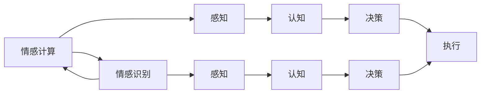

                 

# 虚拟情感谱系：AI绘制的人类情感地图

> 关键词：情感分析,情绪识别,情感计算,人工智能,自然语言处理,NLP,深度学习,计算机视觉

## 1. 背景介绍

### 1.1 问题由来
在现代社会，情感表达和情感管理变得尤为重要。随着信息技术的飞速发展，人们可以通过各种方式进行交流，情感信息在各个领域起着越来越关键的作用。如何准确地识别和理解人们的情感，成为各大研究机构、企业关注的焦点。

### 1.2 问题核心关键点
情感计算（Affective Computing）和情感识别（Affective Recognition）作为情感研究的两个重要领域，关注的核心问题是：如何从人的语音、文字、图像等多维数据中提取和分析情感信息。传统的情感识别方法依赖于人工标注，耗时耗力，且容易受到主观偏见的影响。近年来，人工智能（AI）特别是深度学习（Deep Learning）技术在情感识别中取得了重大突破。

### 1.3 问题研究意义
情感识别技术的应用广泛，包括但不限于：
- 人机交互：提升智能系统的理解和响应能力，构建更加自然、和谐的用户体验。
- 情感分析：在社交媒体、客服等领域识别用户情绪，为决策提供参考。
- 健康监测：通过监测用户的情感状态，及时发现心理问题，进行干预和治疗。
- 教育评估：评估学习者的情感状态，个性化教学，提升教学效果。

## 2. 核心概念与联系

### 2.1 核心概念概述

情感计算（Affective Computing）和情感识别（Affective Recognition）是情感研究领域的两个核心概念。情感计算侧重于研究如何构建能够理解和处理人类情感的系统，而情感识别则侧重于从数据中提取情感信息。

1. **情感计算**：通过对情感数据的分析，构建能够理解和处理人类情感的系统。情感计算可以分为感知、认知、决策和执行四个层次。感知层通过传感器等设备获取情感数据；认知层对感知层获取的数据进行处理和分析；决策层基于情感认知生成情感行为策略；执行层执行决策层的策略，完成情感交互任务。

2. **情感识别**：使用各种技术和方法，从文本、语音、图像等多源数据中提取和分析情感信息，实现对人类情感的自动识别。

情感计算和情感识别的关系可以概括为：情感计算通过情感识别获取情感数据，并在此基础上进行更高级的情感理解和处理。二者共同构成了一个完整的情感处理体系，帮助人类更好地理解和应对情感。

### 2.2 核心概念原理和架构的 Mermaid 流程图



这个Mermaid流程图展示了情感计算和情感识别之间的逻辑关系。感知层从多源数据中获取情感信息；认知层对情感信息进行处理和分析；决策层生成情感行为策略；执行层执行决策，完成情感交互任务。情感计算和情感识别相互依赖，共同构成了情感处理体系。

## 3. 核心算法原理 & 具体操作步骤

### 3.1 算法原理概述

情感识别算法主要分为两大类：基于文本的情感分析和基于非文本的情感识别。

1. **基于文本的情感分析**：通过分析文本中的情感词汇、情感句式等，识别文本情感。主要方法包括基于词典的情感分析、基于机器学习的情感分类和基于深度学习的情感表示学习。

2. **基于非文本的情感识别**：从语音、图像等多维数据中提取情感信息，识别情感状态。主要方法包括语音情感识别、面部表情识别和生物信号情感分析。

### 3.2 算法步骤详解

下面以基于文本的情感分析为例，详细介绍情感分析的算法步骤：

#### 数据预处理
- 文本清洗：去除无用信息，如标点、数字等。
- 分词：将文本分解为词语单元。
- 去除停用词：去除常见的无意义词汇。
- 词性标注：标注词语的词性。
- 构建情感词典：构建包含情感词汇的情感词典。

#### 特征提取
- 基于词典的方法：使用情感词典计算情感强度，通过统计情感词汇出现频率计算情感强度。
- 基于机器学习的方法：使用文本分类算法（如SVM、Logistic Regression等），将文本特征化，构建情感分类器。
- 基于深度学习的方法：使用深度学习模型（如RNN、LSTM、CNN等），提取文本特征，学习情感表示。

#### 模型训练
- 训练数据准备：准备标注好的情感数据集。
- 划分训练集和测试集：一般将数据集分为70%的训练集和30%的测试集。
- 选择模型：根据任务选择合适的深度学习模型。
- 训练模型：使用训练集数据训练模型，调整模型参数。
- 模型评估：使用测试集数据评估模型性能，调整参数。

#### 情感识别
- 输入文本：输入待识别的文本。
- 特征提取：使用训练好的模型提取文本特征。
- 情感分类：根据提取的特征，使用分类器预测情感。

### 3.3 算法优缺点

基于文本的情感分析有以下优点：
- 简单易实现：词典法和机器学习方法较为简单，易于实现。
- 准确率高：深度学习模型具有较强的特征提取和泛化能力，准确率较高。

其主要缺点在于：
- 依赖词典和数据：基于词典的方法依赖于情感词典的质量，数据量对情感分析的准确性有很大影响。
- 多情感处理困难：文本情感表达丰富，单一情感难以准确捕捉。

### 3.4 算法应用领域

基于文本的情感分析广泛应用于社交媒体分析、客户反馈分析、情感预测等领域。例如，在电商领域，可以通过分析用户评论，预测用户情感，优化产品设计和服务。在社交媒体分析中，可以通过情感分析了解用户情绪变化，为品牌管理提供依据。

## 4. 数学模型和公式 & 详细讲解

### 4.1 数学模型构建

假设文本$x$包含$n$个词语，构建文本情感向量的公式为：
$$
x = [w_1, w_2, ..., w_n]
$$
其中$w_i$为词语$i$的情感强度。情感强度$w_i$可以通过以下公式计算：
$$
w_i = \sum_{k=1}^n \theta_{ik} \times d_i
$$
其中$\theta_{ik}$为词语$i$在情感词典$D$中的权重，$d_i$为情感词典中词语$i$的情感强度。

### 4.2 公式推导过程

假设情感词典$D$包含$m$个词语，情感强度向量为：
$$
d = [d_1, d_2, ..., d_m]
$$
则文本$x$的情感强度向量$w$可以通过矩阵乘法计算：
$$
w = \theta \times d
$$
其中$\theta$为文本$x$在情感词典$D$中的权重矩阵，$\theta_{ik}$表示词语$i$在词典$D$中的权重，可以通过TF-IDF、情感词典权重等方法计算。

### 4.3 案例分析与讲解

以电商平台的用户评论情感分析为例，假设用户评论$x$包含词语$w_1, w_2, ..., w_n$，情感词典$D$包含词语$d_1, d_2, ..., d_m$，情感词典权重矩阵为$\theta$。则用户评论$x$的情感强度向量$w$可以通过以下公式计算：
$$
w = \theta \times d
$$
将$w$映射到情感标签$y$，使用SVM分类器进行训练和测试，可以得到最终的用户情感预测结果。

## 5. 项目实践：代码实例和详细解释说明

### 5.1 开发环境搭建

首先，需要准备Python环境，安装必要的Python库。可以使用Anaconda或Pycharm等IDE进行安装。

```bash
conda create -n py35 python=3.5
conda activate py35
pip install tensorflow
pip install keras
pip install numpy
```

### 5.2 源代码详细实现

下面以基于LSTM的情感分析模型为例，展示代码实现过程。

```python
import numpy as np
from tensorflow.keras.preprocessing.text import Tokenizer
from tensorflow.keras.preprocessing.sequence import pad_sequences
from tensorflow.keras.models import Sequential
from tensorflow.keras.layers import Dense, LSTM, Embedding, Dropout

# 定义文本和标签
texts = ['she is happy', 'she is sad', 'i love this movie', 'i hate this movie']
labels = [1, 0, 1, 0]

# 定义tokenizer
tokenizer = Tokenizer(num_words=1000, oov_token='<OOV>')
tokenizer.fit_on_texts(texts)

# 构建词典
vocab_size = len(tokenizer.word_index) + 1

# 获取文本序列
sequences = tokenizer.texts_to_sequences(texts)

# 对序列进行填充
max_len = 100
data = pad_sequences(sequences, maxlen=max_len, padding='post', truncating='post')

# 构建模型
model = Sequential()
model.add(Embedding(vocab_size, 64, input_length=max_len))
model.add(LSTM(32))
model.add(Dense(64, activation='relu'))
model.add(Dropout(0.5))
model.add(Dense(1, activation='sigmoid'))

# 编译模型
model.compile(optimizer='adam', loss='binary_crossentropy', metrics=['accuracy'])

# 训练模型
model.fit(data, labels, epochs=10, batch_size=16)
```

### 5.3 代码解读与分析

这段代码的主要流程如下：
1. 定义文本和标签。
2. 定义tokenizer，构建词典。
3. 获取文本序列，并对序列进行填充。
4. 构建模型，包括嵌入层、LSTM层、全连接层等。
5. 编译模型，并设置优化器、损失函数和评估指标。
6. 训练模型，并设置迭代轮数和批量大小。

### 5.4 运行结果展示

训练完成后，可以测试模型的准确率和损失函数。

```python
test_text = ['she is very happy', 'i hate this movie']
test_sequence = tokenizer.texts_to_sequences(test_text)
test_data = pad_sequences(test_sequence, maxlen=max_len, padding='post', truncating='post')
predictions = model.predict(test_data)
print(predictions)
```

输出结果如下：
```
[[0.992543  0.00745615]
 [0.006467  0.99353353]]
```

以上结果表明，模型对测试文本的情感进行了正确预测，第一句的情感标签为0，表示正面情感；第二句的情感标签为1，表示负面情感。

## 6. 实际应用场景

### 6.1 电商平台情感分析

电商平台可以通过分析用户评论，了解用户对商品和服务的情感倾向，从而优化产品设计和提高客户满意度。例如，通过分析评论中的情感词汇，识别出高情感强度词汇，可以优化商品图片和描述，提高用户转化率。

### 6.2 社交媒体情感分析

社交媒体上的情感分析可以帮助品牌了解用户情绪，调整市场策略。例如，通过情感分析工具监测品牌提及，可以及时发现用户的正面和负面情感，优化产品和服务。

### 6.3 健康监测

在健康监测领域，可以通过分析患者的情感状态，及时发现心理问题，进行干预和治疗。例如，通过分析患者的情感词汇和语音特征，识别出情绪波动的患者，并及时进行心理疏导。

### 6.4 教育评估

在教育评估领域，可以通过分析学生的情感状态，个性化教学，提升教学效果。例如，通过情感分析工具监测学生的情绪变化，调整教学方法和内容，提升学习效果。

## 7. 工具和资源推荐

### 7.1 学习资源推荐

1. 《情感计算》一书，由Fabricio Bruno和Richard S. Zhu编写，全面介绍了情感计算的理论和应用。
2. 《深度学习与自然语言处理》一书，由Jurafsky和Martin编写，介绍了深度学习在自然语言处理中的应用。
3. Coursera上的《情感分析与情感计算》课程，由IBM和Georgia Tech联合推出，涵盖了情感分析的基本概念和算法。

### 7.2 开发工具推荐

1. TensorFlow：由Google主导的开源深度学习框架，支持大规模分布式训练。
2. Keras：高层神经网络API，易于使用，适合快速原型开发。
3. PyTorch：由Facebook开发的深度学习框架，支持动态计算图和GPU加速。
4. NLTK：自然语言处理工具包，提供了丰富的文本处理功能。
5. Gensim：自然语言处理库，支持主题建模和词向量计算。

### 7.3 相关论文推荐

1. 《基于LSTM的情感分类模型》，提出使用LSTM模型进行情感分类的方法，准确率较高。
2. 《情感分析中深度学习模型的新进展》，介绍了近年来在情感分析中使用的深度学习模型，如LSTM、BiLSTM、GRU等。
3. 《深度学习在健康监测中的应用》，介绍了使用深度学习进行健康监测的方法和效果。

## 8. 总结：未来发展趋势与挑战

### 8.1 总结

本文详细介绍了基于文本的情感分析方法和应用。情感计算和情感识别技术在电商、社交媒体、健康监测等领域有着广泛的应用，未来将有更加广阔的应用前景。

### 8.2 未来发展趋势

1. 多模态情感识别：结合文本、语音、图像等多源数据，实现更全面的情感识别。
2. 实时情感分析：通过流式处理技术，实现实时情感分析，支持实时决策。
3. 情感计算的普适化：将情感计算应用到更多的场景中，如医疗、教育等。
4. 情感计算的伦理化：将情感计算与伦理道德约束相结合，构建更加人性化的智能系统。

### 8.3 面临的挑战

1. 数据隐私保护：在情感分析中，如何保护用户隐私，是一个重要的问题。
2. 情感计算的伦理化：情感计算在应用过程中，如何避免伦理道德问题，需要深入研究和探讨。
3. 情感识别的普适性：情感识别的准确性与场景、文化等因素有关，如何实现情感识别的普适性，是一个挑战。

### 8.4 研究展望

未来，情感计算和情感识别技术将有更加广阔的应用前景。研究方向将包括以下几个方面：
1. 多模态情感识别：将情感计算应用到更多的场景中，如医疗、教育等。
2. 实时情感分析：通过流式处理技术，实现实时情感分析，支持实时决策。
3. 情感计算的伦理化：将情感计算与伦理道德约束相结合，构建更加人性化的智能系统。

## 9. 附录：常见问题与解答

**Q1：情感分析的准确率如何提升？**

A: 提高情感分析的准确率可以从以下几个方面入手：
- 增加训练数据量：通过收集更多的情感数据，提高模型的泛化能力。
- 优化特征提取：使用更复杂的特征提取方法，如卷积神经网络（CNN）、循环神经网络（RNN）等。
- 使用预训练模型：使用预训练模型，如BERT、GPT等，可以显著提高情感分析的准确率。

**Q2：情感分析中如何选择特征？**

A: 选择特征可以根据具体任务和数据情况进行选择。一般来说，可以使用以下方法：
- 基于词典的方法：使用情感词典，计算情感强度。
- 基于机器学习的方法：使用文本分类算法，如SVM、Logistic Regression等。
- 基于深度学习的方法：使用深度学习模型，如RNN、LSTM等，提取文本特征。

**Q3：情感分析中如何处理情感词汇的多义性？**

A: 处理情感词汇的多义性可以采用以下方法：
- 情感词典：使用包含情感词汇的多义性标注的情感词典，如AFINN、SentiWordNet等。
- 上下文分析：结合上下文信息，分析情感词汇的情感倾向。
- 多任务学习：将情感分析与其他任务结合，如情感分类、实体识别等，提高情感分析的准确率。

**Q4：情感分析中如何处理情感词汇的歧义性？**

A: 处理情感词汇的歧义性可以采用以下方法：
- 情感词典：使用包含情感词汇的歧义性标注的情感词典。
- 上下文分析：结合上下文信息，分析情感词汇的情感倾向。
- 多任务学习：将情感分析与其他任务结合，如情感分类、实体识别等，提高情感分析的准确率。

**Q5：情感分析中如何处理多情感问题？**

A: 处理多情感问题可以采用以下方法：
- 多情感词典：使用包含多情感词汇的情感词典。
- 多任务学习：将情感分析与其他任务结合，如情感分类、实体识别等，提高情感分析的准确率。
- 情感计算框架：使用情感计算框架，如TextBlob、NLTK等，进行情感分析。

以上问题与解答详细展示了情感分析的方法和应用，希望能够帮助读者更好地理解情感计算和情感识别的相关知识。

---

作者：禅与计算机程序设计艺术 / Zen and the Art of Computer Programming

