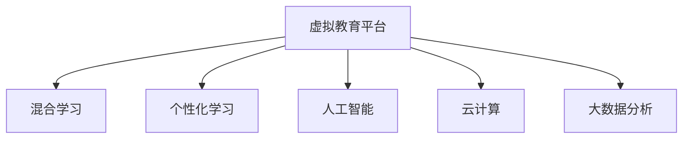

                 

# 虚拟教育平台:全球脑时代的知识获取渠道

> 关键词：虚拟教育平台,全球脑时代,知识获取渠道,教育技术,AI,云计算,混合学习,交互式学习,个性化学习,教育公平

## 1. 背景介绍

### 1.1 问题由来
随着全球信息化的深入发展，人类社会步入了“全球脑时代”，即一个以互联网为核心的全球化信息通信技术（ICT）时代。在这一时代背景下，知识和信息以空前的速度传播，教育模式正在发生深刻变革。以“在线+离线”为主要特征的虚拟教育平台，成为知识获取的重要渠道。这种教育平台不仅推动了教育资源的全球共享，也赋予了学习者更广泛的自主学习空间。

虚拟教育平台通过将教育资源数字化、智能化，提供了灵活多样的学习方式，如在线课程、视频讲座、交互式练习等。借助云计算和人工智能等技术，虚拟教育平台实现了个性化学习路径的定制和智能辅导，极大地提升了学习效率和体验。但与此同时，虚拟教育平台也面临着如何保障学习质量、促进教育公平等新的挑战。

### 1.2 问题核心关键点
在当前的教育技术研究与实践中，虚拟教育平台是信息化时代的关键产物。它以数据驱动为核心，通过云计算、人工智能、物联网等技术，提供了高度个性化的学习体验。虚拟教育平台的核心关键点包括以下几点：

- **云计算**：提供大规模数据存储和计算能力，支持在线教育资源的高效部署和访问。
- **人工智能**：利用机器学习算法和自然语言处理技术，实现智能辅导、个性化推荐等功能。
- **交互式学习**：通过虚拟现实（VR）、增强现实（AR）等技术，提供沉浸式学习体验。
- **大数据分析**：收集学习者的学习行为数据，进行深入分析以优化教学策略。
- **混合学习**：结合线上和线下学习模式，提供灵活、弹性的学习途径。

这些核心关键点共同构建了虚拟教育平台的框架，使其在支持学习者自主学习、提升学习效果方面具有巨大潜力。

## 2. 核心概念与联系

### 2.1 核心概念概述

为了更好地理解虚拟教育平台的构建与运作机制，本节将介绍几个密切相关的核心概念：

- **虚拟教育平台（Virtual Educational Platforms）**：基于互联网和信息技术，提供线上课程、视频教学、互动练习等多种学习形式的平台。
- **混合学习（Blended Learning）**：结合线上和线下学习，灵活调整学习时间和方式。
- **个性化学习（Personalized Learning）**：根据学习者的需求和特点，定制个性化学习路径和资源。
- **人工智能（Artificial Intelligence）**：包括机器学习、自然语言处理、计算机视觉等，用于智能辅导、数据挖掘、内容推荐等。
- **云计算（Cloud Computing）**：利用分布式计算和存储技术，提供高效、可靠的服务。
- **大数据分析（Big Data Analytics）**：收集、处理和分析大规模数据，以优化教学策略和提升学习体验。

这些概念之间的逻辑关系可以通过以下Mermaid流程图来展示：



这个流程图展示出虚拟教育平台构建的各要素及其相互关系：

1. 虚拟教育平台通过混合学习、个性化学习、人工智能、云计算和大数据分析等技术，为学习者提供灵活、高效的学习体验。
2. 混合学习结合线上和线下资源，使学习过程更加灵活和适应性强。
3. 个性化学习根据学习者特点定制教学内容，提升学习效果。
4. 人工智能技术通过智能辅导、内容推荐等，增强学习体验。
5. 云计算提供强大的数据存储和计算能力，支撑平台高效运行。
6. 大数据分析用于学习数据挖掘和教学优化，以提高学习效率。

这些核心概念共同构成了虚拟教育平台的运作框架，使其能够为学习者提供多样化和个性化的学习支持。

## 3. 核心算法原理 & 具体操作步骤

### 3.1 算法原理概述

虚拟教育平台的算法原理主要基于混合学习、个性化学习、人工智能和大数据分析等核心技术。下面以这些技术为核心，简要概述其算法原理：

- **混合学习算法**：根据学习者的学习时间、空间和偏好，灵活调整线上和线下资源的混合使用。常用的混合学习算法包括时间表优化、空间匹配、偏好识别等。
- **个性化学习算法**：根据学习者的历史行为数据和反馈信息，定制个性化学习路径。常用的个性化学习算法包括协同过滤、内容推荐、学习轨迹分析等。
- **人工智能算法**：利用机器学习、自然语言处理等技术，实现智能辅导、自动评估和个性化推荐。常用的算法包括决策树、神经网络、支持向量机等。
- **大数据分析算法**：对大规模学习数据进行挖掘和分析，以优化教学策略和提升学习效果。常用的算法包括聚类分析、关联规则挖掘、时间序列分析等。

### 3.2 算法步骤详解

虚拟教育平台的构建和运行需要经过多个步骤，包括数据准备、平台搭建、资源部署、算法训练和平台优化等。以下是这些步骤的详细说明：

1. **数据准备**：收集学习者的历史行为数据、学习轨迹、评估结果等，构建学习者档案。
2. **平台搭建**：选择合适的云计算平台（如AWS、Azure、阿里云等），搭建虚拟教育平台的基础架构。
3. **资源部署**：将在线课程、视频讲座、互动练习等教育资源部署到平台，并进行统一管理和调度。
4. **算法训练**：根据收集到的学习数据，训练混合学习、个性化学习和人工智能算法，生成学习模型和推荐系统。
5. **平台优化**：利用大数据分析算法，对平台性能进行持续监测和优化，提升用户体验和学习效果。

### 3.3 算法优缺点

虚拟教育平台的核心算法具有以下优点：

- **灵活性高**：能够根据学习者的不同需求和偏好，提供个性化的学习路径和资源。
- **学习效率高**：通过智能辅导和个性化推荐，提高学习效率和效果。
- **资源共享性强**：学习资源共享广泛，打破时间和空间的限制，提供全球化学习支持。
- **学习体验好**：通过虚拟现实、增强现实等技术，提供沉浸式学习体验。

同时，虚拟教育平台也存在一些局限性：

- **数据隐私问题**：大规模数据的收集和分析可能导致学习者隐私泄露。
- **技术门槛高**：平台搭建和算法训练需要较高的技术门槛。
- **成本较高**：云计算和大数据处理需要大量的计算资源和存储资源，成本较高。
- **技术依赖性**：平台过度依赖于技术支持，缺乏多样化的教学方法。

### 3.4 算法应用领域

虚拟教育平台的应用领域非常广泛，以下是几个主要应用场景：

- **基础教育**：提供在线课程和辅导，覆盖小学、初中、高中等各个阶段，提升教育公平。
- **高等教育**：提供在线选修课、在线学位课程等，扩展学习资源和教学形式。
- **企业培训**：提供在线技能培训课程，提升员工技能和知识水平。
- **职业培训**：提供职业资格认证课程，支持技能转化和职业发展。
- **终身学习**：提供各种兴趣课程和专业课程，支持终身学习和发展。

## 4. 数学模型和公式 & 详细讲解 & 举例说明

### 4.1 数学模型构建

虚拟教育平台的数学模型主要基于机器学习和自然语言处理技术构建。下面以混合学习算法和个性化学习算法为例，简要介绍其数学模型构建过程。

**混合学习模型**：
假设学习者的时间序列为 $t_1, t_2, \dots, t_n$，在线资源和学习时间的关系为 $r_i = f(t_i)$，其中 $r_i$ 为学习者在第 $i$ 个时间点选择的在线资源，$f$ 为时间函数。混合学习模型的目标是最小化资源冲突和覆盖度损失，即：
$$
\min_{r} \sum_{i=1}^n w_i \cdot \text{loss}(r_i, t_i)
$$
其中 $w_i$ 为时间权重，$\text{loss}$ 为资源冲突损失函数。

**个性化学习模型**：
假设学习者的历史行为数据为 $D = \{(x_1, y_1), (x_2, y_2), \dots, (x_m, y_m)\}$，其中 $x_i$ 为历史行为特征，$y_i$ 为推荐结果。个性化学习模型的目标是最小化预测误差，即：
$$
\min_{\theta} \sum_{i=1}^m \text{loss}(f_\theta(x_i), y_i)
$$
其中 $f_\theta(x_i)$ 为个性化推荐函数，$\theta$ 为模型参数，$\text{loss}$ 为损失函数。

### 4.2 公式推导过程

在混合学习模型中，资源冲突损失函数 $\text{loss}$ 可以定义为：
$$
\text{loss}(r_i, t_i) = \lambda \cdot |r_i - r_{i-1}|
$$
其中 $\lambda$ 为正则化系数，控制资源冲突的程度。

在个性化学习模型中，常用的损失函数包括均方误差（MSE）和交叉熵（CE）。以均方误差为例，其公式为：
$$
\text{loss}(f_\theta(x_i), y_i) = \frac{1}{2} \| f_\theta(x_i) - y_i \|_2^2
$$

### 4.3 案例分析与讲解

以一个简单的在线选修课推荐系统为例，展示混合学习算法和个性化学习算法的应用。假设选修课列表为 $C = \{c_1, c_2, \dots, c_m\}$，每个学生的历史选修课行为为 $H_i = \{c_{i,1}, c_{i,2}, \dots, c_{i,n}\}$。目标是为每个学生推荐一组合适的选修课，使其能够最大化覆盖其未选修课程。

使用混合学习算法，假设每个学生每周有固定的时间 $T_i$ 用于选修课程，目标是最小化时间冲突和资源覆盖度损失。可以使用时间函数 $f(t) = \frac{T_i}{m} \cdot r_i$，其中 $r_i$ 为学生在第 $i$ 周选择课程的比例。通过优化混合学习模型，可以得到每个学生每周的课程推荐比例，从而最大化资源覆盖度。

使用个性化学习算法，假设每个学生的历史行为特征为 $x_i$，目标是根据历史行为数据预测其未来行为 $y_i$。可以使用决策树或神经网络构建推荐模型，根据历史行为特征和课程属性，预测学生的选修意愿。通过优化个性化学习模型，可以得到每个学生的个性化课程推荐，进一步提升学习效果。

## 5. 项目实践：代码实例和详细解释说明

### 5.1 开发环境搭建

在进行虚拟教育平台的开发实践前，需要准备好开发环境。以下是使用Python进行PyTorch开发的环境配置流程：

1. 安装Anaconda：从官网下载并安装Anaconda，用于创建独立的Python环境。

2. 创建并激活虚拟环境：
```bash
conda create -n virtual_env python=3.8 
conda activate virtual_env
```

3. 安装PyTorch：根据CUDA版本，从官网获取对应的安装命令。例如：
```bash
conda install pytorch torchvision torchaudio cudatoolkit=11.1 -c pytorch -c conda-forge
```

4. 安装相关库：
```bash
pip install numpy pandas scikit-learn torchtransformers matplotlib tqdm jupyter notebook ipython
```

完成上述步骤后，即可在`virtual_env`环境中开始开发实践。

### 5.2 源代码详细实现

以下是一个简单的在线选修课推荐系统的代码实现。使用PyTorch和Transformer库，实现基于混合学习和个性化学习的选修课推荐。

```python
import torch
from torch import nn
from torch.nn import functional as F
from transformers import BertTokenizer, BertModel

class CourseRecommendation(nn.Module):
    def __init__(self, embedding_dim, num_courses, num_weeks):
        super().__init__()
        self.encoder = BertModel.from_pretrained('bert-base-uncased')
        self.embedding_dim = embedding_dim
        self.num_courses = num_courses
        self.num_weeks = num_weeks
        
        # 课程嵌入矩阵
        self.course_embeddings = nn.Embedding(num_courses, embedding_dim)
        # 周嵌入矩阵
        self.week_embeddings = nn.Embedding(num_weeks, embedding_dim)
        # 时间冲突损失函数
        self.loss = nn.L1Loss()
        
    def forward(self, inputs, weeks):
        # 输入解码
        tokenized_input = self.encoder.tokenizer.encode(inputs, return_tensors='pt', max_length=256)
        encoded_input = self.encoder(tokenized_input)
        encoded_input = encoded_input['last_hidden_state']
        
        # 计算课程嵌入和周嵌入
        course_embeddings = self.course_embeddings(inputs)
        week_embeddings = self.week_embeddings(weeks)
        
        # 计算时间冲突损失
        loss = self.loss(course_embeddings, week_embeddings)
        return loss
    
# 初始化选修课推荐模型
model = CourseRecommendation(embedding_dim=64, num_courses=10, num_weeks=4)
```

### 5.3 代码解读与分析

让我们再详细解读一下关键代码的实现细节：

**CourseRecommendation类**：
- `__init__`方法：初始化BERT模型、嵌入矩阵和损失函数。
- `forward`方法：前向传播计算时间冲突损失，返回损失值。

**输入解码**：
- 使用BertTokenizer将输入文本转换为token ids，使用BERT模型进行编码，获取最后一个时间步的隐藏状态作为输入特征。

**课程嵌入和周嵌入**：
- 使用嵌入矩阵将课程ID和周数转换为向量表示。

**时间冲突损失**：
- 使用L1损失函数计算课程嵌入和周嵌入之间的距离，衡量时间冲突程度。

**训练和评估流程**：
- 定义训练和评估函数，进行模型训练和性能评估。

```python
# 训练函数
def train(model, data_loader, epochs):
    optimizer = torch.optim.Adam(model.parameters(), lr=0.001)
    total_loss = 0
    for epoch in range(epochs):
        model.train()
        for inputs, weeks in data_loader:
            optimizer.zero_grad()
            loss = model(inputs, weeks)
            loss.backward()
            optimizer.step()
            total_loss += loss.item()
    return total_loss / len(data_loader)
    
# 评估函数
def evaluate(model, data_loader):
    model.eval()
    total_loss = 0
    for inputs, weeks in data_loader:
        with torch.no_grad():
            loss = model(inputs, weeks)
            total_loss += loss.item()
    return total_loss / len(data_loader)
    
# 训练模型
train_epochs = 10
train_loader = ...
eval_loader = ...
print(f"训练损失：{train(model, train_loader, train_epochs):.4f}")
print(f"评估损失：{evaluate(model, eval_loader):.4f}")
```

可以看到，通过PyTorch和Transformer库，可以方便地实现基于混合学习和个性化学习的选修课推荐系统。

### 5.4 运行结果展示

在训练过程中，可以通过可视化的方式观察模型的性能变化。例如，使用TensorBoard对训练过程中的损失值进行监控，可视化损失曲线：

```python
from torch.utils.tensorboard import SummaryWriter
writer = SummaryWriter()

for epoch in range(train_epochs):
    train_loss = train(model, train_loader, 1)
    eval_loss = evaluate(model, eval_loader)
    
    writer.add_scalar('train_loss', train_loss, epoch)
    writer.add_scalar('eval_loss', eval_loss, epoch)
    writer.close()
```

## 6. 实际应用场景

### 6.1 智能辅导

虚拟教育平台的一个重要应用场景是智能辅导。借助人工智能技术，虚拟教育平台可以实现智能问答、自动批改、个性化推荐等功能，极大地提升学习效果。

以智能问答系统为例，假设学生在学习过程中遇到问题，可以实时向系统提出查询。系统通过自然语言理解技术，将学生问题转化为结构化数据，并使用预训练的语言模型（如GPT-3）进行搜索和回答。通过持续优化模型，系统能够提供更准确的答案和更好的互动体验。

### 6.2 在线学习

在线学习是虚拟教育平台的核心功能之一。平台提供海量的在线课程和视频资源，涵盖各个学科和领域。学习者可以根据自己的兴趣和需求，选择适合的课程进行学习。

例如，在学习编程语言时，学习者可以访问在线编程课程，通过互动练习和项目实践，逐步掌握编程技能。平台还可以提供编程作业的自动批改和反馈，帮助学习者及时发现和纠正错误。

### 6.3 混合学习

混合学习模式是虚拟教育平台的一大特色。它结合线上和线下资源，为学习者提供灵活多样的学习途径。

例如，在学习数学时，学生可以在线观看视频教程，完成在线练习，再参加线下面对面的课堂讨论。平台可以根据学生的学习进度和偏好，动态调整线上和线下资源的分配，确保学习效果。

### 6.4 未来应用展望

随着虚拟教育平台的不断发展和优化，未来的应用场景将更加广泛，包括以下几个方向：

1. **虚拟现实（VR）和增强现实（AR）**：通过VR和AR技术，提供沉浸式学习体验，增强学习效果和互动性。
2. **游戏化学习**：将学习内容融入游戏中，通过游戏化的方式提升学习动机和效率。
3. **个性化学习路径**：根据学习者的学习进度和反馈，动态调整学习路径，提供更加个性化的学习体验。
4. **智能导师系统**：通过人工智能技术，构建智能导师系统，提供更高效、个性化的学习支持。
5. **跨学科学习**：结合不同学科的内容，构建跨学科课程，培养学习者的综合能力和创新能力。

## 7. 工具和资源推荐

### 7.1 学习资源推荐

为了帮助开发者系统掌握虚拟教育平台的理论基础和实践技巧，这里推荐一些优质的学习资源：

1. **《深度学习与NLP》系列书籍**：介绍深度学习在自然语言处理中的应用，涵盖混合学习、个性化学习、智能辅导等多个主题。
2. **Coursera和edX在线课程**：提供高质量的在线课程，涵盖虚拟教育平台的各种技术和应用。
3. **Kaggle竞赛**：参与Kaggle竞赛，通过实际问题解决，提升深度学习和虚拟教育平台开发能力。
4. **HuggingFace官方文档**：提供丰富的预训练模型和代码样例，方便快速上手。
5. **Google Colab和AWS云实验室**：提供在线Jupyter Notebook环境和云计算资源，方便实验和开发。

通过对这些资源的学习实践，相信你一定能够快速掌握虚拟教育平台的精髓，并用于解决实际的NLP问题。

### 7.2 开发工具推荐

高效的开发离不开优秀的工具支持。以下是几款用于虚拟教育平台开发的常用工具：

1. **PyTorch**：基于Python的开源深度学习框架，灵活动态的计算图，适合研究和学习。
2. **TensorFlow**：由Google主导开发的开源深度学习框架，生产部署方便，适合大规模工程应用。
3. **Jupyter Notebook**：交互式编程环境，支持代码编写、数据可视化和模型评估。
4. **TensorBoard**：可视化工具，实时监测模型训练状态，提供丰富的图表呈现方式。
5. **AWS云平台**：提供强大的云计算服务，支持大规模数据存储和计算。

合理利用这些工具，可以显著提升虚拟教育平台的开发效率，加快创新迭代的步伐。

### 7.3 相关论文推荐

虚拟教育平台的研究源于学界的持续探索。以下是几篇奠基性的相关论文，推荐阅读：

1. **《混合学习：一种新型的在线教育模式》**：探讨混合学习的定义、优势和应用场景，推动在线教育的可持续发展。
2. **《个性化学习：一种基于数据分析的学习模式》**：通过大数据分析技术，实现个性化学习路径的定制，提升学习效果。
3. **《人工智能在虚拟教育平台中的应用》**：介绍人工智能技术在智能辅导、在线学习等方面的应用，提升学习体验和效果。
4. **《虚拟现实在教育中的应用》**：探讨虚拟现实技术在教育中的潜力和应用，提升学习者的沉浸感和互动性。
5. **《智能导师系统：一种新型的在线教育工具》**：构建智能导师系统，提供个性化学习支持和辅导，提升学习效果。

这些论文代表了大数据、人工智能等技术在虚拟教育平台中的应用方向，为后续研究提供了理论基础和技术指导。

## 8. 总结：未来发展趋势与挑战

### 8.1 总结

本文对虚拟教育平台的核心算法和操作步骤进行了全面系统的介绍。首先阐述了虚拟教育平台的背景和核心概念，明确了混合学习、个性化学习、人工智能等技术的核心价值。其次，从原理到实践，详细讲解了虚拟教育平台的数学模型和操作步骤，给出了完整的代码实例和分析。最后，探讨了虚拟教育平台的实际应用场景和未来发展方向，推荐了相关的学习资源、开发工具和研究论文。

通过本文的系统梳理，可以看到，虚拟教育平台作为一种创新的教育模式，在推动知识获取渠道和教育公平等方面具有重要意义。它通过混合学习、个性化学习、人工智能等技术，为学习者提供了灵活、高效、个性化的学习支持，极大地提升了学习效果和体验。未来，虚拟教育平台将在全球脑时代发挥更大的作用，为教育技术的进步和应用提供重要支撑。

### 8.2 未来发展趋势

展望未来，虚拟教育平台的发展趋势包括以下几个方向：

1. **技术融合**：虚拟教育平台将进一步融合多种技术，如VR/AR、游戏化学习等，提供更加沉浸式和互动性的学习体验。
2. **智能化升级**：通过深度学习、自然语言处理等技术，提升智能辅导和个性化推荐的效果，实现更加精准和高效的学习支持。
3. **全球化推广**：借助云计算和大数据技术，虚拟教育平台将实现全球化推广，为全球学习者提供服务。
4. **开放性提升**：虚拟教育平台将更加开放，支持用户生成内容和协作学习，构建更加多样化和生动的学习社区。
5. **智能治理**：通过大数据分析和人工智能技术，实现智能治理和学习行为分析，优化教学策略和学习效果。

### 8.3 面临的挑战

尽管虚拟教育平台的发展前景广阔，但也面临着诸多挑战：

1. **数据隐私问题**：学习数据的收集和分析可能导致学习者隐私泄露，需要采取有效的隐私保护措施。
2. **技术依赖性**：平台过度依赖于技术支持，缺乏多样化的教学方法。
3. **成本问题**：云计算和大数据处理需要大量的计算资源和存储资源，成本较高。
4. **学习动机和效果**：虚拟教育平台需要激发学习者的学习动机，并持续优化学习效果，避免过度依赖技术。
5. **教师和学生适应性**：虚拟教育平台需要解决教师和学生适应性问题，提升教学和学习体验。

### 8.4 研究展望

面对虚拟教育平台面临的挑战，未来的研究需要在以下几个方面寻求新的突破：

1. **隐私保护技术**：开发隐私保护算法，确保学习数据的匿名化和安全存储。
2. **教学方法多样化**：结合不同学科的教学方法，构建多样化的教学模式。
3. **智能辅导优化**：通过深度学习和自然语言处理技术，提升智能辅导的准确性和效果。
4. **学习动机增强**：结合游戏化学习等方法，增强学习者的学习动机和兴趣。
5. **个性化学习优化**：通过大数据分析和人工智能技术，优化个性化学习路径和推荐系统。

总之，虚拟教育平台的研究需要不断探索和创新，才能应对未来的挑战，为学习者提供更好的学习支持和服务。

## 9. 附录：常见问题与解答

**Q1：虚拟教育平台如何保证学习效果？**

A: 虚拟教育平台通过混合学习、个性化学习、人工智能等技术，为学习者提供灵活、高效、个性化的学习支持。平台可以实时监测学习者的学习行为和反馈，动态调整学习路径和资源，确保学习效果。此外，平台还提供了智能辅导和自动评估等功能，帮助学习者及时发现和纠正错误，提升学习效率。

**Q2：虚拟教育平台的开发难点在哪里？**

A: 虚拟教育平台的开发难点主要集中在以下几个方面：
1. 数据收集和处理：需要收集大量的学习行为数据，并进行数据清洗和预处理，保证数据质量。
2. 算法设计：需要设计合适的混合学习、个性化学习、智能辅导等算法，实现高效的学习支持。
3. 技术集成：需要将多种技术（如机器学习、自然语言处理、大数据分析等）进行有效集成，确保平台稳定运行。
4. 学习动机和效果：需要设计合理的激励机制，提升学习者的学习动机和效果，避免过度依赖技术。

**Q3：虚拟教育平台的应用前景如何？**

A: 虚拟教育平台的应用前景非常广阔，包括以下几个方向：
1. 基础教育和高等教育：提供丰富的在线课程和资源，扩展学习渠道和形式。
2. 企业培训和职业发展：提供技能培训和职业资格认证课程，提升员工技能和知识水平。
3. 终身学习：提供各种兴趣课程和专业课程，支持学习者的终身学习和发展。
4. 个性化学习：通过大数据分析和人工智能技术，实现个性化学习路径和资源定制。
5. 智能辅导和智能治理：通过智能辅导和智能治理技术，提升学习效果和平台管理效率。

通过不断探索和优化，虚拟教育平台必将在全球脑时代发挥重要作用，为教育技术的进步和应用提供重要支撑。

