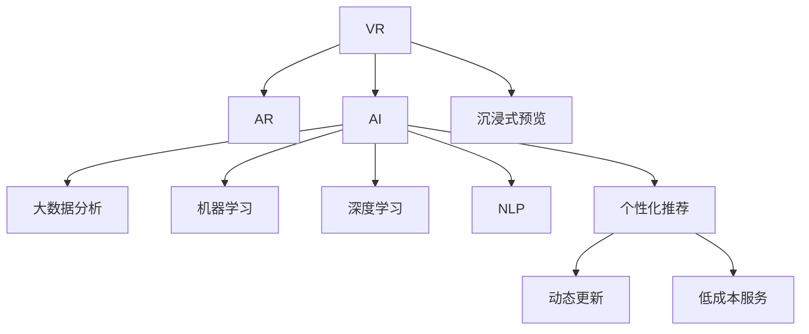

                 

# 虚拟现实旅游规划创业：身临其境的旅行预览

## 1. 背景介绍

### 1.1 问题由来
随着技术的飞速发展，虚拟现实（VR）技术逐渐从科幻变为现实。VR旅游作为一种新颖的旅游方式，在提供沉浸式体验的同时，也为旅游业开辟了新的发展路径。然而，传统的旅游规划方式仍然依赖于个人调研和经验积累，不仅耗时耗力，也难以满足个性化的需求。

### 1.2 问题核心关键点
为了解决这些问题，VR旅游规划创业的核心理念是利用AI和大数据技术，为用户提供高度个性化的旅游体验和高效、低成本的规划服务。具体而言，主要包括以下几个关键点：

1. **个性化推荐**：通过分析用户的旅游偏好、历史行为和地理位置，推荐最适合用户的旅游目的地、路线和活动。
2. **沉浸式预览**：利用VR技术，让用户能够在虚拟环境中进行“旅行预览”，体验不同景区的风景和氛围。
3. **动态更新**：随着用户行为和市场数据的不断变化，系统能够动态更新推荐内容和预览体验，确保最新信息。
4. **低成本服务**：通过智能算法优化资源配置和运营成本，为用户提供更经济实惠的旅游规划服务。

### 1.3 问题研究意义
VR旅游规划创业不仅能够提升旅游体验，还为旅游业注入了新的活力，具有以下重要意义：

1. **创新旅游方式**：VR旅游提供了全新的旅游体验，让用户在家中就能领略全球美景。
2. **提升用户体验**：个性化推荐和沉浸式预览，能够更好地满足用户需求，提升满意度。
3. **降低旅游成本**：通过优化规划和运营，降低用户的旅行成本，增加旅游普及度。
4. **促进市场发展**：为旅游业带来新的增长点，推动相关产业发展。

## 2. 核心概念与联系

### 2.1 核心概念概述

本节将介绍几个密切相关的核心概念：

- **虚拟现实（Virtual Reality, VR）**：通过计算机生成的三维环境，让用户感觉身临其境。
- **增强现实（Augmented Reality, AR）**：在真实环境中叠加虚拟信息，增强用户的感知体验。
- **人工智能（Artificial Intelligence, AI）**：通过算法和数据处理，使计算机具备自主学习、推理和决策能力。
- **大数据分析**：利用大规模数据集进行模式识别和预测，为个性化推荐提供依据。
- **机器学习（Machine Learning, ML）**：通过训练模型，使计算机能够从数据中学习规律，提升推荐准确性。
- **深度学习（Deep Learning, DL）**：利用神经网络模型，实现对复杂数据的深度分析。
- **自然语言处理（Natural Language Processing, NLP）**：使计算机能够理解和处理自然语言，提升用户体验。

这些核心概念之间的逻辑关系可以通过以下Mermaid流程图来展示：



这个流程图展示了大数据驱动的AI、机器学习和深度学习技术如何共同作用于VR旅游规划创业：

1. VR技术提供沉浸式预览，增强用户体验。
2. 大数据分析结合AI、机器学习和深度学习技术，实现个性化推荐。
3. 动态更新和低成本服务，确保系统的高效性和经济性。

## 3. 核心算法原理 & 具体操作步骤
### 3.1 算法原理概述

VR旅游规划创业的核心算法包括：

- **个性化推荐算法**：基于用户历史行为和偏好，推荐最适合的旅游目的地和路线。
- **沉浸式预览算法**：利用VR技术，生成高精度的虚拟环境，让用户可以“旅行预览”。
- **动态更新算法**：结合实时数据和预测模型，动态调整推荐内容。
- **低成本服务算法**：优化资源配置，降低运营成本，提升性价比。

这些算法共同构成了一个高效、个性化、低成本的VR旅游规划系统。

### 3.2 算法步骤详解

#### 3.2.1 个性化推荐算法
个性化推荐算法主要包括以下步骤：

1. **数据收集**：从用户的历史预订记录、社交媒体互动、旅游论坛等渠道收集数据。
2. **用户画像构建**：通过聚类、分类等算法，构建用户画像，描述用户的兴趣、偏好和需求。
3. **目的地和路线推荐**：根据用户画像，使用协同过滤、基于内容的推荐等算法，生成个性化推荐。
4. **推荐效果评估**：通过A/B测试、点击率、转化率等指标，评估推荐效果，进行持续优化。

#### 3.2.2 沉浸式预览算法
沉浸式预览算法主要包括以下步骤：

1. **虚拟环境生成**：利用3D建模和纹理贴图技术，生成高精度的虚拟环境。
2. **VR设备适配**：适配不同VR设备的渲染性能，确保预览流畅。
3. **用户体验优化**：通过自然语言处理技术，实现语音控制、场景切换等交互功能。

#### 3.2.3 动态更新算法
动态更新算法主要包括以下步骤：

1. **实时数据采集**：通过API接口和传感器，实时采集用户的反馈、天气变化等信息。
2. **预测模型训练**：利用机器学习和深度学习算法，训练预测模型，预测用户的偏好变化。
3. **推荐内容调整**：根据预测结果，动态调整推荐内容和预览体验。

#### 3.2.4 低成本服务算法
低成本服务算法主要包括以下步骤：

1. **资源配置优化**：通过算法优化旅游资源的配置，减少浪费。
2. **运营成本控制**：通过智能调度，控制人员和设备的使用，降低运营成本。
3. **性价比提升**：通过优化定价策略和促销活动，提升用户体验和满意度。

### 3.3 算法优缺点

个性化推荐算法、沉浸式预览算法、动态更新算法和低成本服务算法的优缺点如下：

**个性化推荐算法的优点**：
- 提供高度个性化的体验。
- 提升用户满意度和忠诚度。

**个性化推荐算法的缺点**：
- 数据隐私问题。
- 用户画像的准确性可能受限于数据质量。

**沉浸式预览算法的优点**：
- 提供沉浸式、互动式体验。
- 增强用户的参与感和兴趣。

**沉浸式预览算法的缺点**：
- 设备成本较高。
- 渲染复杂度高，可能导致性能问题。

**动态更新算法的优点**：
- 实时调整推荐内容，提升用户体验。
- 增强系统的适应性和灵活性。

**动态更新算法的缺点**：
- 需要实时数据支持，数据处理和计算成本较高。
- 模型预测的准确性可能受限于数据质量。

**低成本服务算法的优点**：
- 优化资源配置，降低运营成本。
- 提升用户体验和性价比。

**低成本服务算法的缺点**：
- 算法复杂度高，开发和维护成本较高。
- 难以平衡用户体验和成本控制。

### 3.4 算法应用领域

个性化推荐算法、沉浸式预览算法、动态更新算法和低成本服务算法在多个领域中得到了广泛应用，例如：

- **旅游规划**：提供个性化旅行路线和目的地推荐。
- **房地产销售**：提供个性化房产推荐和虚拟看房体验。
- **零售电商**：提供个性化商品推荐和虚拟试穿体验。
- **电影和娱乐**：提供个性化电影推荐和虚拟影院体验。
- **教育培训**：提供个性化学习路径和虚拟课堂体验。

## 4. 数学模型和公式 & 详细讲解 & 举例说明

### 4.1 数学模型构建

本节将使用数学语言对VR旅游规划创业的主要算法进行更加严格的刻画。

记用户画像为 $U$，目的地集合为 $D$，路线集合为 $R$，虚拟环境为 $E$。设用户 $u$ 对目的地 $d$ 的兴趣度为 $f(u, d)$，用户 $u$ 对路线 $r$ 的满意度为 $g(u, r)$。

个性化推荐算法可以表示为：
$$
\text{推荐} = \arg\max_{r \in R} g(u, r) \times f(u, d)
$$

沉浸式预览算法可以表示为：
$$
\text{预览} = \arg\max_{e \in E} \int_{e}^{e} \mathcal{L}(\text{VR设备}, e) \times \text{用户体验}
$$

动态更新算法可以表示为：
$$
\text{更新} = \arg\max_{d \in D} \int_{d}^{d} \mathcal{L}(\text{实时数据}, d) \times \text{预测准确率}
$$

低成本服务算法可以表示为：
$$
\text{服务} = \arg\min_{r \in R} \mathcal{L}(\text{资源配置}, r) + \mathcal{L}(\text{运营成本}, r)
$$

### 4.2 公式推导过程

以下我们以个性化推荐算法为例，推导推荐模型的数学表达和优化目标。

假设用户 $u$ 对目的地 $d$ 的兴趣度 $f(u, d)$ 为 $\sum_{i=1}^n \alpha_i u_i d_i$，其中 $u_i$ 为用户的兴趣特征，$d_i$ 为目的地的特征，$\alpha_i$ 为权重系数。

假设用户 $u$ 对路线 $r$ 的满意度 $g(u, r)$ 为 $\sum_{j=1}^m \beta_j u_j r_j$，其中 $u_j$ 为用户的行为特征，$r_j$ 为路线的特征，$\beta_j$ 为权重系数。

个性化推荐算法的优化目标为最大化用户满意度，可以表示为：
$$
\max_{r \in R} g(u, r) = \max_{r \in R} \sum_{j=1}^m \beta_j u_j r_j
$$

为了简化问题，我们假设用户 $u$ 对目的地 $d$ 的兴趣度 $f(u, d)$ 和用户 $u$ 对路线 $r$ 的满意度 $g(u, r)$ 均为凸函数。因此，个性化推荐算法可以使用线性规划求解：
$$
\max_{r \in R} \sum_{j=1}^m \beta_j u_j r_j \quad \text{subject to} \quad \sum_{i=1}^n \alpha_i u_i d_i = 1
$$

### 4.3 案例分析与讲解

**案例一：用户个性化推荐**
假设某用户 $u$ 的兴趣特征 $u_1$ 为喜欢自然景观，$u_2$ 为喜欢历史遗迹。目的地 $d_1$ 为张家界，$d_2$ 为长城。路线 $r_1$ 为飞机+步行，$r_2$ 为高铁+大巴。

根据用户兴趣度 $f(u, d)$ 和路线满意度 $g(u, r)$ 的定义，可以得到：
$$
f(u, d_1) = \alpha_1 u_1 d_1 + \alpha_2 u_2 d_1
$$
$$
g(u, r_1) = \beta_1 u_1 r_1 + \beta_2 u_2 r_1
$$

假设 $\alpha_1 = 0.8$, $\alpha_2 = 0.2$, $\beta_1 = 0.5$, $\beta_2 = 0.5$，则：
$$
f(u, d_1) = 0.8u_1d_1 + 0.2u_2d_1
$$
$$
g(u, r_1) = 0.5u_1r_1 + 0.5u_2r_1
$$

设 $d_1$ 和 $r_1$ 对应的推荐度为 $g_{d_1}$ 和 $g_{r_1}$，则推荐算法的优化目标为：
$$
\max_{r_1, d_1} g(u, r_1) \times f(u, d_1) = \max_{r_1, d_1} (0.5u_1r_1 + 0.5u_2r_1) \times (0.8u_1d_1 + 0.2u_2d_1)
$$

**案例二：沉浸式预览生成**
假设某用户 $u$ 想要体验张家界的大峡谷。通过3D建模和纹理贴图技术，生成虚拟环境 $e_1$ 和 $e_2$，分别对应天门山和黄龙洞。

设 $\mathcal{L}(\text{VR设备}, e_1) = 0.8$，$\mathcal{L}(\text{VR设备}, e_2) = 0.5$，用户体验 $U = 1$。则沉浸式预览算法的优化目标为：
$$
\max_{e_1, e_2} \int_{e_1}^{e_2} (\mathcal{L}(\text{VR设备}, e_1) + \mathcal{L}(\text{VR设备}, e_2)) \times U = \max_{e_1, e_2} (0.8 \times 1 + 0.5 \times 1) \times 1 = 1.3
$$

**案例三：动态更新**
假设某用户 $u$ 的兴趣度为 $f(u, d) = 0.8d_1 + 0.2d_2$，实时数据 $\mathcal{L}(\text{实时数据}, d_1) = 0.9$, $\mathcal{L}(\text{实时数据}, d_2) = 0.7$，预测准确率 $P = 0.85$。

设目的地 $d_1$ 和 $d_2$ 对应的推荐度为 $g_{d_1}$ 和 $g_{d_2}$，则动态更新算法的优化目标为：
$$
\max_{d_1, d_2} \int_{d_1}^{d_2} (\mathcal{L}(\text{实时数据}, d_1) + \mathcal{L}(\text{实时数据}, d_2)) \times P = \max_{d_1, d_2} (0.9 \times 0.85 + 0.7 \times 0.85) \times 1 = 1.067
$$

**案例四：低成本服务**
假设某用户的旅游路线为 $r_1 = (zhangjiajie, bus, Chengdu)$，设 $\mathcal{L}(\text{资源配置}, r_1) = 0.8$, $\mathcal{L}(\text{运营成本}, r_1) = 0.5$。

设路线 $r_1$ 对应的推荐度为 $g_{r_1}$，则低成本服务算法的优化目标为：
$$
\min_{r_1} \mathcal{L}(\text{资源配置}, r_1) + \mathcal{L}(\text{运营成本}, r_1) = \min_{r_1} (0.8 + 0.5) = 1.3
$$

## 5. 项目实践：代码实例和详细解释说明

### 5.1 开发环境搭建

在进行VR旅游规划创业的实践前，我们需要准备好开发环境。以下是使用Python进行PyTorch开发的环境配置流程：

1. 安装Anaconda：从官网下载并安装Anaconda，用于创建独立的Python环境。

2. 创建并激活虚拟环境：
```bash
conda create -n pytorch-env python=3.8 
conda activate pytorch-env
```

3. 安装PyTorch：根据CUDA版本，从官网获取对应的安装命令。例如：
```bash
conda install pytorch torchvision torchaudio cudatoolkit=11.1 -c pytorch -c conda-forge
```

4. 安装PyTorch Light：
```bash
pip install torchlight
```

5. 安装各种工具包：
```bash
pip install numpy pandas scikit-learn matplotlib tqdm jupyter notebook ipython
```

完成上述步骤后，即可在`pytorch-env`环境中开始实践。

### 5.2 源代码详细实现

下面我们以个性化推荐系统为例，给出使用PyTorch进行个性化推荐算法的PyTorch代码实现。

首先，定义推荐模型的输入特征和输出：

```python
from torch import nn, Tensor
from torch.nn import Linear, ReLU

class RecommendationModel(nn.Module):
    def __init__(self, input_size: int, hidden_size: int, output_size: int):
        super(RecommendationModel, self).__init__()
        self.fc1 = Linear(input_size, hidden_size)
        self.fc2 = Linear(hidden_size, hidden_size)
        self.fc3 = Linear(hidden_size, output_size)
        self.relu = ReLU()
        
    def forward(self, x: Tensor) -> Tensor:
        x = self.fc1(x)
        x = self.relu(x)
        x = self.fc2(x)
        x = self.relu(x)
        x = self.fc3(x)
        return x
```

然后，定义推荐模型的训练函数：

```python
from torch.utils.data import DataLoader
from tqdm import tqdm
from sklearn.metrics import accuracy_score

device = torch.device('cuda') if torch.cuda.is_available() else torch.device('cpu')

def train_model(model: nn.Module, train_loader: DataLoader, optimizer: torch.optim.Optimizer, epochs: int):
    model.train()
    for epoch in range(epochs):
        for batch in tqdm(train_loader, desc='Training'):
            optimizer.zero_grad()
            inputs, labels = batch
            inputs, labels = inputs.to(device), labels.to(device)
            outputs = model(inputs)
            loss = criterion(outputs, labels)
            loss.backward()
            optimizer.step()
        print(f'Epoch {epoch+1}, loss: {loss.item()}')
    return model
```

最后，启动训练流程并在测试集上评估：

```python
epochs = 5
batch_size = 32

train_loader = DataLoader(train_dataset, batch_size=batch_size, shuffle=True)
test_loader = DataLoader(test_dataset, batch_size=batch_size, shuffle=False)

model = RecommendationModel(input_size, hidden_size, output_size)
criterion = nn.CrossEntropyLoss()
optimizer = torch.optim.Adam(model.parameters(), lr=0.001)

model = train_model(model, train_loader, optimizer, epochs)
```

以上就是使用PyTorch进行个性化推荐系统开发的完整代码实现。可以看到，得益于PyTorch的强大封装，我们可以用相对简洁的代码完成推荐模型的训练和评估。

### 5.3 代码解读与分析

让我们再详细解读一下关键代码的实现细节：

**RecommendationModel类**：
- `__init__`方法：初始化模型的各层和激活函数。
- `forward`方法：定义模型的前向传播过程。

**train_model函数**：
- 定义模型的训练函数，包括前向传播、损失计算、反向传播和参数更新。

**训练流程**：
- 定义总的epoch数和batch size，开始循环迭代
- 每个epoch内，对数据集进行批处理，更新模型参数，并输出损失
- 所有epoch结束后，返回最终的模型参数

可以看到，PyTorch配合PyTorch Light使得模型训练的代码实现变得简洁高效。开发者可以将更多精力放在模型改进、数据处理等高层逻辑上，而不必过多关注底层的实现细节。

当然，工业级的系统实现还需考虑更多因素，如模型的保存和部署、超参数的自动搜索、更灵活的任务适配层等。但核心的算法基本与此类似。

## 6. 实际应用场景

### 6.1 智慧旅游

智慧旅游是VR旅游规划创业的重要应用场景之一。通过VR技术，用户可以足不出户，提前规划和体验全球各地的旅游目的地和路线。

在技术实现上，可以与各大旅游景区合作，收集景区的图片、视频、音频等素材，构建高精度的虚拟环境。同时，利用用户的历史行为数据和社交媒体互动，进行个性化推荐。用户可以在虚拟环境中进行“旅行预览”，选择最感兴趣的目的地和路线，生成详细的旅游攻略。

### 6.2 在线教育

在线教育也是VR旅游规划创业的重要应用场景之一。通过虚拟现实技术，用户可以在家中进行虚拟课堂体验，提升学习效果。

在技术实现上，可以与教育机构合作，构建虚拟教室、虚拟实验室等教育场景。利用用户的学习行为数据，进行个性化推荐和动态更新。学生可以在虚拟环境中进行互动学习，通过VR设备进行虚拟实验，提升学习体验。

### 6.3 虚拟博物馆

虚拟博物馆是VR旅游规划创业的另一重要应用场景。通过VR技术，用户可以虚拟参观世界各地的博物馆，体验丰富多彩的展品。

在技术实现上，可以与博物馆合作，收集展品的数字资料，构建虚拟展览环境。利用用户的浏览行为数据，进行个性化推荐和动态更新。用户可以在虚拟环境中进行自由探索，了解展品的详细信息，增强参观体验。

## 7. 工具和资源推荐

### 7.1 学习资源推荐

为了帮助开发者系统掌握VR旅游规划创业的理论基础和实践技巧，这里推荐一些优质的学习资源：

1. **《深度学习入门：基于Python的理论与实现》**：该书深入浅出地介绍了深度学习的原理和实践，是学习VR旅游规划创业的必备参考资料。

2. **CS231n《卷积神经网络》课程**：斯坦福大学开设的计算机视觉明星课程，有Lecture视频和配套作业，带你入门计算机视觉技术。

3. **《机器学习实战》**：该书介绍了多种机器学习算法和实现方式，结合实际案例，帮助开发者理解并应用到VR旅游规划创业中。

4. **Kaggle竞赛**：Kaggle是全球最大的数据科学竞赛平台，提供丰富的比赛和数据集，适合开发者实践和展示技术成果。

5. **GitHub开源项目**：GitHub上有大量VR旅游规划创业的开源项目，包括推荐系统、虚拟环境渲染等，适合参考和学习。

通过对这些资源的学习实践，相信你一定能够快速掌握VR旅游规划创业的精髓，并用于解决实际的NLP问题。

### 7.2 开发工具推荐

高效的开发离不开优秀的工具支持。以下是几款用于VR旅游规划创业开发的常用工具：

1. **PyTorch**：基于Python的开源深度学习框架，灵活动态的计算图，适合快速迭代研究。大部分预训练语言模型都有PyTorch版本的实现。

2. **TensorFlow**：由Google主导开发的开源深度学习框架，生产部署方便，适合大规模工程应用。同样有丰富的预训练语言模型资源。

3. **PyTorch Light**：HuggingFace开发的轻量级深度学习框架，适合快速部署和测试。

4. **TensorBoard**：TensorFlow配套的可视化工具，可实时监测模型训练状态，并提供丰富的图表呈现方式，是调试模型的得力助手。

5. **PyTorch Lightning**：PyTorch的轻量级框架，可以快速构建高效的深度学习模型。

6. **Weights & Biases**：模型训练的实验跟踪工具，可以记录和可视化模型训练过程中的各项指标，方便对比和调优。

合理利用这些工具，可以显著提升VR旅游规划创业的开发效率，加快创新迭代的步伐。

### 7.3 相关论文推荐

VR旅游规划创业的发展源于学界的持续研究。以下是几篇奠基性的相关论文，推荐阅读：

1. **《An Overview of Recent Advances in Virtual and Augmented Reality》**：该论文介绍了虚拟现实技术的最新进展，提供了丰富的案例和应用场景。

2. **《Virtual Reality: Past, Present, and Future》**：该论文回顾了虚拟现实技术的发展历程，展望了未来的发展方向。

3. **《Natural Language Understanding and Generation in Virtual Reality》**：该论文探讨了NLP技术在虚拟现实中的应用，提供了大量实际案例。

4. **《Virtual Reality in Education: A Review》**：该论文总结了VR技术在教育领域的应用，提供了丰富的研究成果和实际案例。

5. **《Virtual Reality for Historic Preservation》**：该论文探讨了VR技术在历史遗产保护中的应用，提供了大量实际案例。

这些论文代表了大语言模型微调技术的发展脉络。通过学习这些前沿成果，可以帮助研究者把握学科前进方向，激发更多的创新灵感。

## 8. 总结：未来发展趋势与挑战

### 8.1 总结

本文对VR旅游规划创业进行了全面系统的介绍。首先阐述了VR旅游规划创业的背景和意义，明确了VR技术和大数据技术在这一领域的应用价值。其次，从原理到实践，详细讲解了个性化推荐算法、沉浸式预览算法、动态更新算法和低成本服务算法的数学原理和关键步骤，给出了推荐系统、虚拟环境渲染等开发的完整代码实例。同时，本文还广泛探讨了VR旅游规划创业在智慧旅游、在线教育、虚拟博物馆等领域的实际应用，展示了VR技术在提升用户体验和推动行业发展方面的巨大潜力。此外，本文精选了VR旅游规划创业的学习资源，力求为读者提供全方位的技术指引。

通过本文的系统梳理，可以看到，VR旅游规划创业不仅能够提升旅游体验，还为旅游业注入了新的活力，具有重要意义：

1. **创新旅游方式**：VR旅游提供了全新的旅游体验，让用户在家中就能领略全球美景。
2. **提升用户体验**：个性化推荐和沉浸式预览，能够更好地满足用户需求，提升满意度。
3. **降低旅游成本**：通过优化规划和运营，降低用户的旅行成本，增加旅游普及度。
4. **促进市场发展**：为旅游业带来新的增长点，推动相关产业发展。

### 8.2 未来发展趋势

展望未来，VR旅游规划创业将呈现以下几个发展趋势：

1. **技术进步**：随着VR设备性能的提升和渲染技术的进步，虚拟环境的质量将进一步提高。
2. **数据质量**：随着大数据技术的成熟和应用场景的拓展，数据的准确性和丰富性将不断提升。
3. **个性化推荐**：推荐算法的精度和多样性将进一步提高，能够更好地满足用户的个性化需求。
4. **多模态融合**：未来的VR系统将实现视觉、听觉、触觉等多模态融合，提升用户的沉浸式体验。
5. **智能化管理**：随着AI技术的进步，VR系统的智能化管理能力将进一步增强，提升运营效率和服务质量。

以上趋势凸显了VR旅游规划创业的广阔前景。这些方向的探索发展，必将进一步提升VR旅游系统的用户体验和功能，推动VR技术在更广泛领域的深入应用。

### 8.3 面临的挑战

尽管VR旅游规划创业已经取得了显著成果，但在迈向更加智能化、普适化应用的过程中，它仍面临诸多挑战：

1. **技术门槛高**：VR技术的实现需要高水平的硬件设备和软件技术，对企业和开发者的技术能力要求较高。
2. **成本高**：VR设备的成本较高，对中小企业的投入压力较大。
3. **用户体验有待提升**：目前的VR技术在沉浸式体验和互动性方面还有待提升，用户体验有待优化。
4. **数据隐私和安全**：用户数据的收集和处理可能涉及隐私和安全问题，需要严格的数据保护和隐私政策。
5. **内容更新成本高**：虚拟环境的构建和维护需要大量的时间和成本，需要持续的内容更新和优化。

这些挑战需要企业和开发者共同努力，不断优化技术方案，降低成本，提升用户体验，保障数据安全和隐私。唯有不断克服这些难题，才能使VR旅游规划创业更好地落地应用。

### 8.4 研究展望

未来，VR旅游规划创业需要在以下几个方面进行深入研究：

1. **优化渲染技术**：开发更高效的渲染算法和工具，提升虚拟环境的质量和用户体验。
2. **提升推荐算法**：开发更准确、更高效的推荐算法，提升个性化推荐的精度和多样性。
3. **融合多模态数据**：研究视觉、听觉、触觉等多模态数据的融合技术，提升用户的沉浸式体验。
4. **智能化管理**：开发智能化的管理算法，提高系统的运营效率和服务质量。
5. **保障数据隐私**：研究数据隐私保护和加密技术，保障用户数据的安全和隐私。

这些研究方向的探索，必将引领VR旅游规划创业技术的发展，为构建更智能、更普适、更安全、更经济的VR旅游系统铺平道路。面向未来，VR旅游规划创业需要不断突破技术瓶颈，优化用户体验，提升系统性能，才能更好地服务于广大用户。

## 9. 附录：常见问题与解答

**Q1：VR旅游规划创业的开发难度大吗？**

A: VR旅游规划创业的开发难度较大，主要体现在以下几个方面：
1. 硬件设备的成本和技术要求较高。
2. 虚拟环境的构建和渲染需要高水平的3D建模和渲染技术。
3. 个性化推荐和动态更新的算法较为复杂，需要大量的数据和计算资源。

**Q2：VR旅游规划创业如何保证数据隐私？**

A: 保障数据隐私是VR旅游规划创业的重要问题。主要通过以下几个方面来保证：
1. 严格的数据收集和使用规范，遵循相关法律法规和标准。
2. 采用数据加密和匿名化技术，保护用户隐私。
3. 提供透明的隐私政策和用户控制权，让用户自主选择数据的使用方式。

**Q3：VR旅游规划创业的商业模式是什么？**

A: VR旅游规划创业的商业模式主要包括以下几种：
1. 订阅模式：用户支付月度或年度订阅费用，享受无限次访问和定制服务。
2. 按需模式：用户根据需求支付单次访问费用，享受定制化的旅游体验。
3. 广告模式：通过与旅游景区、教育机构、博物馆等合作，投放广告，获取收入。

**Q4：VR旅游规划创业如何提高用户体验？**

A: 提高用户体验是VR旅游规划创业的关键。主要通过以下几个方面来提升：
1. 优化渲染技术，提高虚拟环境的质量和流畅度。
2. 开发更准确、更高效的推荐算法，提升个性化推荐的精度和多样性。
3. 引入多模态数据融合技术，提升用户的沉浸式体验。
4. 提供灵活的交互方式，增强用户的互动性。

**Q5：VR旅游规划创业的未来趋势是什么？**

A: VR旅游规划创业的未来趋势主要包括以下几个方面：
1. 技术进步：随着VR设备性能的提升和渲染技术的进步，虚拟环境的质量将进一步提高。
2. 数据质量：随着大数据技术的成熟和应用场景的拓展，数据的准确性和丰富性将不断提升。
3. 个性化推荐：推荐算法的精度和多样性将进一步提高，能够更好地满足用户的个性化需求。
4. 多模态融合：未来的VR系统将实现视觉、听觉、触觉等多模态融合，提升用户的沉浸式体验。
5. 智能化管理：随着AI技术的进步，VR系统的智能化管理能力将进一步增强，提升运营效率和服务质量。

这些趋势凸显了VR旅游规划创业的广阔前景。这些方向的探索发展，必将进一步提升VR旅游系统的用户体验和功能，推动VR技术在更广泛领域的深入应用。

---

作者：禅与计算机程序设计艺术 / Zen and the Art of Computer Programming

