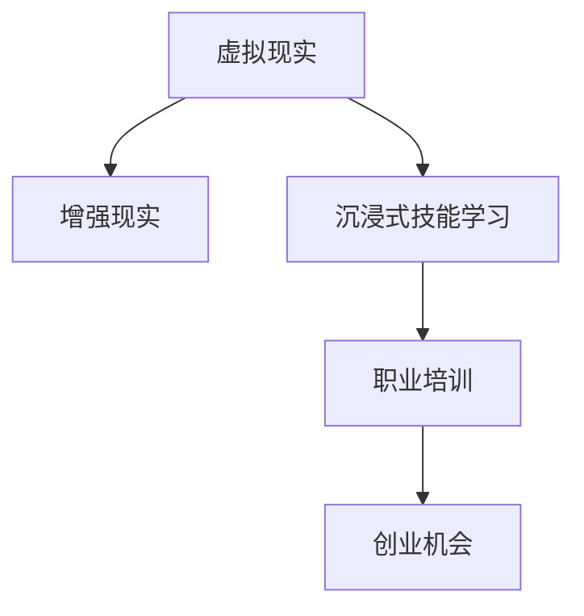

                 

# 虚拟现实职业培训创业：沉浸式技能学习

> 关键词：虚拟现实, 职业培训, 沉浸式学习, 技能培训, 人工智能, 增强现实, 创业机会

## 1. 背景介绍

### 1.1 问题由来

在当今数字化时代，技能培训成为了各行各业从业者持续发展的关键。然而，传统的培训方式往往存在诸多限制：受时间和地点的束缚、学习内容单一、无法即时反馈等，无法满足现代职业人士快速适应变化需求。为此，一种新型的技能培训方式——沉浸式技能学习，应运而生，它借助虚拟现实(Virtual Reality, VR)和增强现实(Augmented Reality, AR)技术，通过模拟真实环境，为培训者提供身临其境的体验，从而极大地提升了学习效率和效果。

虚拟现实技术利用计算机生成的三维虚拟环境，让参与者通过佩戴VR头显，能够沉浸在一个由计算机生成的虚拟世界中。而增强现实技术则是在现实世界中叠加虚拟信息，如AR眼镜，可以在真实的物理环境中看到虚拟的图形和信息。这两种技术的结合，使得沉浸式技能学习的可能性大大增强，尤其在职业培训领域，其潜力被广泛看好。

### 1.2 问题核心关键点

沉浸式技能学习的核心关键点在于：

1. **互动性**：培训者可以在虚拟或增强现实环境中与虚拟对象互动，进行实际操作，从而提升操作技能。
2. **沉浸感**：通过三维视觉和听觉反馈，提供沉浸式的培训体验，增强记忆和理解。
3. **定制化**：根据不同学习者的特点和需求，定制个性化的培训方案。
4. **实时反馈**：提供即时的反馈和指导，帮助学习者及时纠正错误。
5. **成本效益**：通过虚拟环境的重复使用，降低实际操作的成本和风险。

本文将从虚拟现实职业培训创业的视角，深入探讨如何利用沉浸式技能学习，开发高效、实用的职业培训产品，挖掘其中的创业机会。

## 2. 核心概念与联系

### 2.1 核心概念概述

为更好地理解虚拟现实职业培训创业，首先需要了解核心概念及其相互关系：

- **虚拟现实(VR)**：利用计算机生成的虚拟环境，提供沉浸式体验。
- **增强现实(AR)**：在现实世界中叠加虚拟信息，提供增强体验。
- **沉浸式技能学习**：结合VR和AR技术，通过模拟真实环境，提升学习者的技能水平。
- **职业培训**：基于技能需求，为从业者提供定向的技能培训服务。
- **创业机会**：在技术、市场、商业模型等驱动下，产生的新的商业模式和市场需求。

这些概念之间的逻辑关系可以通过以下Mermaid流程图来展示：



这个流程图展示了虚拟现实、增强现实和沉浸式技能学习如何共同构成职业培训和创业机会的基础。

## 3. 核心算法原理 & 具体操作步骤
### 3.1 算法原理概述

沉浸式技能学习的核心在于通过模拟真实环境，提供沉浸式体验。其算法原理主要包括以下几个方面：

1. **三维建模与渲染**：利用计算机图形学技术，构建逼真的虚拟环境和物体，并对其进行渲染，形成可以实时交互的三维场景。
2. **环境感知与互动**：通过传感器和动作捕捉技术，实现对参与者动作的实时跟踪和反馈。
3. **个性化定制**：根据参与者的需求和学习进度，动态调整培训内容和难度。
4. **实时反馈与指导**：通过计算机视觉和语音识别技术，提供即时的学习反馈和指导。

### 3.2 算法步骤详解

沉浸式技能学习的具体实施步骤包括：

**Step 1: 环境设计**

- 设计符合职业培训需求的虚拟环境，包括操作场景、工具、设备等。
- 定义虚拟环境中的交互规则和任务目标，如操作流程、安全规范等。

**Step 2: 模型渲染**

- 使用计算机图形学工具，将设计好的环境进行三维建模和纹理贴图。
- 利用渲染引擎进行实时渲染，生成高质量的虚拟场景。

**Step 3: 传感器集成**

- 安装传感器和动作捕捉设备，如VR头显、手势追踪器、位置跟踪器等，确保参与者与虚拟环境之间的互动。
- 校准传感器，保证数据采集的准确性和稳定性。

**Step 4: 互动与反馈**

- 编写交互脚本，实现参与者与虚拟对象之间的互动逻辑。
- 根据参与者的操作，提供实时反馈和指导，如操作提示、错误纠正等。

**Step 5: 个性化培训**

- 根据参与者的学习进度和表现，动态调整培训内容和学习难度。
- 通过智能算法分析参与者的行为数据，提供个性化的学习建议。

**Step 6: 评估与优化**

- 定期评估培训效果，收集反馈意见。
- 根据评估结果，优化虚拟环境和培训方案。

### 3.3 算法优缺点

沉浸式技能学习的优点包括：

1. **互动性强**：参与者可以在虚拟环境中进行实际操作，提升操作技能的熟练度。
2. **沉浸感高**：通过三维视觉和听觉反馈，增强学习体验和记忆效果。
3. **安全性高**：通过虚拟环境模拟实际操作，降低实际操作的风险和成本。
4. **灵活度高**：可以根据不同职业的需求，定制个性化的培训方案。

其缺点包括：

1. **技术门槛高**：需要较高的计算机图形学、传感器技术、实时渲染等技术支持。
2. **设备成本高**：需要采购高端的VR头显、传感器等设备，增加了初期的投资成本。
3. **学习曲线陡**：参与者需要一定时间来适应虚拟环境的操作和反馈机制。

### 3.4 算法应用领域

沉浸式技能学习可以广泛应用于多个领域，包括但不限于：

1. **医疗健康**：医生和护士可以通过虚拟手术模拟器，进行复杂的手术操作练习。
2. **制造业**：技术人员可以在虚拟工厂中操作设备，进行装配、焊接等技能培训。
3. **建筑行业**：建筑师和施工人员可以在虚拟建筑中进行设计、施工模拟，提升专业技能。
4. **军事训练**：士兵可以通过虚拟战场模拟，进行战术演练和技能训练。
5. **教育培训**：教师和学生可以通过虚拟实验室，进行科学实验和技能训练。

## 4. 数学模型和公式 & 详细讲解 & 举例说明（备注：数学公式请使用latex格式，latex嵌入文中独立段落使用 $$，段落内使用 $)
### 4.1 数学模型构建

在沉浸式技能学习中，涉及到大量的三维空间计算和传感器数据处理，因此数学模型构建是关键。

假设虚拟环境中的对象为 $O$，参与者的位置为 $\mathbf{p}$，目标点为 $\mathbf{t}$。则目标点的计算公式为：

$$
\mathbf{t} = \mathbf{p} + \mathbf{v}(\mathbf{p})
$$

其中 $\mathbf{v}(\mathbf{p})$ 表示目标点相对于当前位置的偏移向量，可以通过传感器数据实时计算得到。

### 4.2 公式推导过程

在实际应用中，参与者与虚拟对象之间的互动关系可以用以下公式描述：

$$
\begin{aligned}
&\text{若参与者与目标点距离小于半径 } r \\
&\text{则目标点被视为与参与者互动，触发相应操作} \\
&d = \|\mathbf{p} - \mathbf{t}\| \\
&\text{若 } d < r \\
&\text{触发互动，执行操作}
\end{aligned}
$$

在实际应用中，参与者的操作可以通过控制器模型进行建模，如：

$$
\mathbf{u} = f(\mathbf{p}, \mathbf{t})
$$

其中 $\mathbf{u}$ 表示控制指令，$f$ 为控制函数，依赖于参与者的当前位置和目标点的距离。

### 4.3 案例分析与讲解

以虚拟手术模拟器为例，分析沉浸式技能学习的具体实现。

- **环境设计**：模拟手术室的虚拟环境，包括手术台、手术工具、患者模型等。
- **模型渲染**：使用Maya或Blender等工具，构建逼真的手术场景和工具模型，并进行渲染。
- **传感器集成**：使用Vive或Oculus等VR头显，采集参与者的头部动作，使用Leap Motion等手势追踪器，采集参与者的手部动作。
- **互动与反馈**：编写Python脚本，根据传感器数据，控制手术工具的移动，并在VR头显中实时反馈操作结果，如手术过程、患者反应等。
- **个性化培训**：根据参与者的学习进度和表现，动态调整手术难度和复杂度，提供个性化的学习建议。

## 5. 项目实践：代码实例和详细解释说明
### 5.1 开发环境搭建

在进行沉浸式技能学习项目的开发时，需要准备以下开发环境：

1. **计算机图形学工具**：如Maya、Blender等，用于三维建模和渲染。
2. **传感器和设备**：如VR头显、手势追踪器、位置跟踪器等，用于数据采集和互动控制。
3. **编程语言和框架**：如Python、Unity、Unreal Engine等，用于编写交互脚本和开发应用程序。
4. **数据采集和处理工具**：如OpenNI、Leap Motion SDK等，用于传感器数据的实时采集和处理。
5. **云计算平台**：如AWS、Azure、Google Cloud等，用于分布式数据处理和云渲染。

### 5.2 源代码详细实现

以下是一个简单的Python代码示例，用于模拟VR环境中的互动过程：

```python
import numpy as np
from pyvirtualreality import VRDisplay, VRLine, VRPlane

def initialize_vr_environment():
    display = VRDisplay()
    display.add_callback(VRDisplay.EVENT_MOTION, motion_callback)
    display.add_callback(VRDisplay.EVENT_KEY_PRESS, key_press_callback)

def motion_callback(event):
    p = event.pos
    t = p + np.array([0, 0, 1])
    if np.linalg.norm(t - [0, 0, 0]) < 0.1:
        # 触发互动，执行操作
        print("Target reached")

def key_press_callback(event):
    if event.key == "a":
        # 按下a键，执行其他操作
        print("Button a pressed")

if __name__ == "__main__":
    initialize_vr_environment()
    display = VRDisplay()
    display.add_callback(VRDisplay.EVENT_MOTION, motion_callback)
    display.add_callback(VRDisplay.EVENT_KEY_PRESS, key_press_callback)
    display.start()
```

### 5.3 代码解读与分析

这个示例代码展示了如何通过Python实现基本的VR互动。其中：

- `pyvirtualreality` 库用于创建VR环境，并注册事件回调函数。
- `VRDisplay` 对象用于管理VR环境，并处理输入事件。
- `motion_callback` 函数用于处理鼠标移动事件，计算目标点的坐标。
- `key_press_callback` 函数用于处理按键事件，执行相应操作。
- 通过判断目标点是否在预设范围内，触发互动操作。

可以看到，代码实现相对简单，但已经可以初步展示VR互动的实现思路。

### 5.4 运行结果展示

在运行上述代码后，可以在VR环境中看到参与者的鼠标移动，并实时输出目标点的坐标。当鼠标移动到指定范围内时，程序会输出"Target reached"，表示成功触发互动。

## 6. 实际应用场景
### 6.1 医疗健康

在医疗健康领域，虚拟手术模拟器已经得到了广泛应用。例如，普华永道和Covidien合作开发的Da Vinci Surgical System，可以通过虚拟手术模拟器，进行复杂的微创手术操作练习，提升医生的手术技能。

### 6.2 制造业

在制造业领域，虚拟装配模拟器可以用于培训技术人员进行设备的装配、焊接等操作。通过模拟真实环境，技术人员可以在虚拟环境中进行反复练习，提升操作技能和效率。

### 6.3 建筑行业

在建筑行业，虚拟建筑模拟器可以用于培训建筑师和施工人员进行设计、施工模拟。通过虚拟环境，参与者可以进行复杂的设计方案验证和施工过程模拟，提升专业技能。

### 6.4 军事训练

在军事训练领域，虚拟战场模拟器可以用于士兵的战术演练和技能培训。通过虚拟环境，士兵可以进行模拟战斗和战术演练，提升实战能力。

### 6.5 教育培训

在教育培训领域，虚拟实验室可以用于科学实验和技能培训。通过虚拟环境，学生可以进行复杂的科学实验，提高实验操作技能和科学素养。

## 7. 工具和资源推荐
### 7.1 学习资源推荐

为了帮助开发者系统掌握沉浸式技能学习的开发技术，这里推荐一些优质的学习资源：

1. **《虚拟现实编程实战》系列书籍**：系统介绍了VR开发的基础知识和常用技术，如Unity、Unreal Engine等。
2. **Google VR Dev Kit**：谷歌推出的VR开发工具包，包含丰富的示例和文档，方便开发者入门。
3. **Unity VR Developer**：Unity官方提供的VR开发指南，包括VR引擎介绍、开发流程、性能优化等。
4. **Unreal Engine VR**：虚幻引擎的VR开发资源，提供从基础到高级的VR开发教程。
5. **Coursify**：在线学习平台，提供VR和AR开发的课程，涵盖基础技术和实际应用。

通过对这些资源的学习实践，相信你一定能够快速掌握沉浸式技能学习的开发技术，并将其应用于实际项目中。

### 7.2 开发工具推荐

高效的开发离不开优秀的工具支持。以下是几款用于沉浸式技能学习开发的常用工具：

1. **Unity**：一款强大的游戏引擎，支持VR和AR开发，拥有丰富的插件和社区支持。
2. **Unreal Engine**：虚幻引擎，支持高端的VR和AR开发，提供高质量的渲染和互动体验。
3. **WebVR**：WebVR标准，支持在Web浏览器中进行VR体验，便于跨平台开发和部署。
4. **ARKit**：苹果公司提供的AR开发框架，适用于iOS设备，提供丰富的AR功能。
5. **ARCore**：谷歌提供的AR开发框架，适用于Android设备，提供强大的AR功能。

合理利用这些工具，可以显著提升沉浸式技能学习的开发效率，加快创新迭代的步伐。

### 7.3 相关论文推荐

沉浸式技能学习的研究涉及到计算机图形学、传感器技术、人机交互等多个领域，以下是几篇奠基性的相关论文，推荐阅读：

1. **《Virtual Reality: a Survey》**：全面介绍了虚拟现实技术的发展历史、基本原理和应用场景。
2. **《Augmented Reality: A Review and Future Directions》**：详细介绍了增强现实技术的发展历程、关键技术和应用领域。
3. **《Interactive Computer Graphics: A Top-Down Approach with Examples》**：介绍了计算机图形学的基本原理和技术，是学习VR和AR开发的基础。
4. **《Hand Tracking in Virtual Reality》**：探讨了手势追踪技术在虚拟现实中的应用，提供了实用的实现方法。
5. **《Computer Vision: Models, Learning, and Inference》**：介绍了计算机视觉技术的原理和应用，是理解VR和AR交互的基础。

这些论文代表了大语言模型微调技术的发展脉络。通过学习这些前沿成果，可以帮助研究者把握学科前进方向，激发更多的创新灵感。

## 8. 总结：未来发展趋势与挑战

### 8.1 研究成果总结

本文对沉浸式技能学习的原理和应用进行了详细探讨，分析了虚拟现实和增强现实技术在职业培训中的潜力。通过具体实例和案例分析，展示了沉浸式技能学习的实施步骤和技术细节。同时，从商业应用的角度，分析了其中的创业机会和市场前景。

### 8.2 未来发展趋势

展望未来，沉浸式技能学习将呈现以下几个发展趋势：

1. **技术成熟度提升**：随着VR和AR技术的不断发展，沉浸式技能学习的体验和效果将进一步提升。
2. **硬件普及率提高**：随着VR头显和AR眼镜等设备的普及，沉浸式技能学习的门槛将逐步降低。
3. **应用场景扩展**：沉浸式技能学习将进一步应用于更多领域，如教育、娱乐、游戏等，带来更广泛的市场需求。
4. **跨平台协作增强**：通过WebVR等技术，实现跨平台协作，提升沉浸式技能学习的灵活性和可扩展性。
5. **人工智能融合**：结合人工智能技术，如自然语言处理、机器学习等，提供更智能的互动体验和个性化推荐。

以上趋势凸显了沉浸式技能学习的广阔前景，这些方向的探索发展，必将进一步提升技能学习的效率和效果，为各行各业带来新的培训模式。

### 8.3 面临的挑战

尽管沉浸式技能学习具有诸多优势，但在迈向更加智能化、普适化应用的过程中，仍面临诸多挑战：

1. **技术瓶颈**：当前的VR和AR技术仍然存在延迟、分辨率等问题，影响用户体验。
2. **设备成本**：高端的VR头显和AR眼镜等设备成本较高，限制了市场的普及。
3. **内容开发**：高质量的VR和AR内容开发需要专业团队和大量资源，内容制作周期较长。
4. **用户接受度**：部分用户对VR和AR技术的接受度不高，需要更多市场教育和用户培养。
5. **跨平台兼容性**：不同平台和设备之间的兼容性问题，需要统一的开发标准和接口。

这些挑战需要技术、市场、生态等多个方面协同努力，才能逐步克服，推动沉浸式技能学习的广泛应用。

### 8.4 研究展望

面对沉浸式技能学习所面临的挑战，未来的研究需要在以下几个方面寻求新的突破：

1. **硬件优化**：通过硬件技术创新，提升设备的性能和用户体验，降低成本。
2. **内容创新**：开发更多高质量、个性化、互动性强的VR和AR内容，吸引更多用户。
3. **跨平台协同**：建立统一的开发标准和接口，实现跨平台协作和共享。
4. **用户培养**：通过市场教育和用户培养，提升用户对VR和AR技术的接受度和使用率。
5. **AI融合**：结合人工智能技术，提供更智能、个性化的互动体验和推荐系统。

这些研究方向的探索，必将引领沉浸式技能学习技术迈向更高的台阶，为各行各业带来新的培训模式和商业机会。总之，沉浸式技能学习需要从技术、市场、生态等多个维度协同发力，才能真正实现其广泛应用和商业价值。

## 9. 附录：常见问题与解答

**Q1: 沉浸式技能学习的技术难点有哪些？**

A: 沉浸式技能学习的主要技术难点包括：

1. **三维建模和渲染**：需要高质量的建模工具和渲染引擎，以保证虚拟环境的真实性和性能。
2. **传感器集成和处理**：需要高性能的传感器设备，以及实时数据处理技术，保证参与者的互动体验。
3. **实时交互和反馈**：需要复杂的控制算法和实时渲染技术，保证互动的流畅性和反馈的及时性。

**Q2: 如何选择适合沉浸式技能学习的虚拟现实引擎？**

A: 选择适合的虚拟现实引擎需要考虑多个因素：

1. **功能丰富性**：如Unity和Unreal Engine都支持VR和AR开发，但Unity功能更为丰富，适用于游戏和娱乐领域；Unreal Engine则适用于高端的模拟和仿真。
2. **性能表现**：不同的引擎在性能上有差异，需要根据具体应用场景选择。
3. **社区支持**：强大的社区支持和丰富的插件资源，可以提升开发效率和效果。
4. **跨平台支持**：如Unity和WebVR都支持跨平台开发，便于部署和推广。

**Q3: 如何提高沉浸式技能学习的用户体验？**

A: 提高用户体验需要从多个方面入手：

1. **硬件升级**：提升VR头显和AR眼镜等设备的性能和舒适度。
2. **内容优化**：开发高质量、个性化、互动性强的VR和AR内容，提升学习效果。
3. **交互设计**：设计自然、流畅、易用的交互界面，减少操作复杂度。
4. **实时反馈**：提供即时、准确、有意义的反馈和指导，帮助用户快速掌握技能。
5. **个性化定制**：根据用户的学习进度和特点，提供个性化的学习路径和建议。

**Q4: 沉浸式技能学习有哪些商业应用场景？**

A: 沉浸式技能学习可以应用于以下商业应用场景：

1. **职业培训**：如医疗健康、制造业、建筑行业等，通过虚拟环境模拟实际操作，提升专业技能。
2. **教育培训**：如科学实验、编程语言、设计等，提供更丰富、互动的学习体验。
3. **军事训练**：如战术演练、装备操作等，提升实战能力和训练效果。
4. **娱乐游戏**：如虚拟旅游、主题公园等，提供沉浸式娱乐体验。
5. **工业模拟**：如工业操作、生产流程等，提升工作效率和质量。

通过这些商业应用场景，沉浸式技能学习可以为各行各业带来新的培训模式和市场机会。

**Q5: 沉浸式技能学习的发展前景如何？**

A: 沉浸式技能学习的发展前景非常广阔：

1. **技术成熟度提升**：随着VR和AR技术的不断发展，沉浸式技能学习的体验和效果将进一步提升。
2. **硬件普及率提高**：随着设备价格的下降，沉浸式技能学习的市场门槛将逐步降低。
3. **应用场景扩展**：沉浸式技能学习将进一步应用于更多领域，如教育、娱乐、游戏等，带来更广泛的市场需求。
4. **跨平台协作增强**：通过WebVR等技术，实现跨平台协作，提升沉浸式技能学习的灵活性和可扩展性。
5. **AI融合**：结合人工智能技术，如自然语言处理、机器学习等，提供更智能、个性化的互动体验和推荐系统。

总之，沉浸式技能学习在未来的发展前景非常广阔，将在各行各业中带来新的培训模式和商业机会。

---

作者：禅与计算机程序设计艺术 / Zen and the Art of Computer Programming

