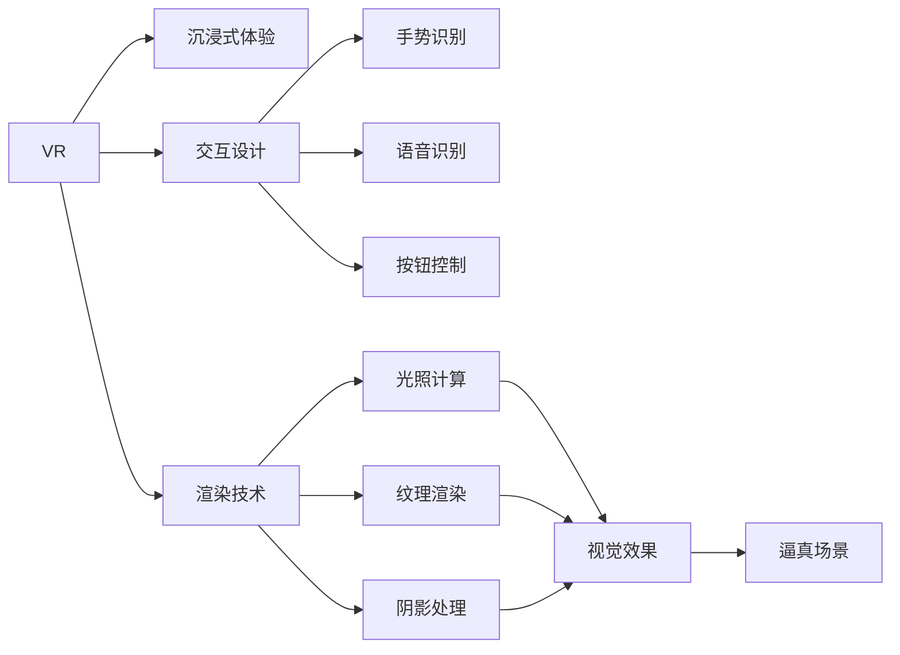

                 

# 虚拟现实（VR）开发：沉浸式体验设计

## 1. 背景介绍

随着科技的迅猛发展，虚拟现实（Virtual Reality, VR）技术正在逐步成熟并走向普及，为人们提供了一种全新的沉浸式体验方式。VR开发不仅是技术上的挑战，更是一门艺术，需要通过巧妙的互动设计和逼真的渲染技术，让用户体验到身临其境的虚拟世界。本文将深入探讨VR开发的艺术和科学，从背景、核心概念、算法原理到实际应用，全面解析VR开发的沉浸式体验设计。

## 2. 核心概念与联系

### 2.1 核心概念概述

在探讨VR开发的沉浸式体验设计前，首先需要明确几个核心概念：

- **虚拟现实（VR）**：通过计算机生成虚拟环境，用户可以通过头戴式显示设备(HMD)和交互设备，在三维空间中与虚拟环境进行互动。
- **沉浸式体验**：通过视觉、听觉、触觉等多种感官刺激，使用户完全融入虚拟环境，产生与现实世界难以区分的感觉。
- **交互设计**：为实现沉浸式体验，需要设计用户与虚拟环境交互的方式，包括手势、语音、按钮等，增强用户的参与感和代入感。
- **渲染技术**：虚拟环境的逼真呈现离不开高性能的图形渲染，包括光照、纹理、阴影等，这些都需要复杂的图形计算技术支持。

这些概念紧密联系，共同构成了VR开发的框架。

### 2.2 核心概念原理和架构的 Mermaid 流程图

## 3. 核心算法原理 & 具体操作步骤

### 3.1 算法原理概述

VR开发的沉浸式体验设计涉及多个关键算法，包括但不限于：

- **3D场景渲染**：通过计算机图形学技术，将3D模型渲染成逼真的场景，是实现沉浸式体验的基础。
- **实时光照**：动态计算场景中各个元素的光照效果，增加真实感。
- **纹理映射**：将高分辨率的纹理贴到3D模型上，使物体表面更具细节和立体感。
- **阴影计算**：根据光源位置和角度，计算场景中物体的阴影效果，增强深度感。
- **交互算法**：设计用户与虚拟环境的互动逻辑，通过碰撞检测、物理模拟等算法，实现真实的交互效果。

这些算法通过图形处理单元（GPU）和中央处理器（CPU）的协同工作，实现复杂的图形渲染和互动处理，最终呈现在用户的HMD上。

### 3.2 算法步骤详解

#### 3.2.1 3D场景渲染

- **建模**：使用3D建模软件（如Blender、Maya等）创建虚拟场景的3D模型。
- **纹理贴图**：为模型添加高分辨率的纹理贴图，增加细节和立体感。
- **光照设置**：根据光源的位置和强度，设置场景的光照效果，使用动态光照技术，实现真实的光影变化。
- **渲染**：使用图形API（如OpenGL、Vulkan等）进行渲染，将模型和光照效果呈现在屏幕上。

#### 3.2.2 实时光照

- **环境光**：根据场景环境设置基本光照效果，使用全局光照技术，使场景亮度更加均匀。
- **动态光源**：根据用户行为和场景变化，动态计算光源位置和强度，实现真实的光影效果。
- **阴影处理**：使用阴影贴图技术，根据光源位置计算物体阴影，增强场景的深度感。

#### 3.2.3 纹理映射

- **纹理生成**：使用高级纹理生成技术，根据物体表面特性生成高分辨率纹理。
- **纹理映射**：将纹理贴到3D模型上，增加物体表面的细节和立体感。
- **纹理滤波**：使用纹理滤波技术，根据视角和距离，动态调整纹理质量，提升渲染效率。

#### 3.2.4 阴影计算

- **投影计算**：使用投影技术，根据光源位置和角度，计算物体阴影。
- **阴影贴图**：使用阴影贴图技术，将阴影效果映射到物体表面上，增强深度感。
- **阴影层次**：根据物体重要性，设置不同的阴影层次，优化渲染性能。

#### 3.2.5 交互算法

- **碰撞检测**：通过碰撞检测算法，判断用户操作是否与虚拟环境发生碰撞。
- **物理模拟**：使用物理引擎，模拟物体的运动和互动，增强真实感。
- **交互反馈**：根据用户操作，提供相应的视觉和听觉反馈，增强沉浸感。

### 3.3 算法优缺点

#### 3.3.1 优点

- **逼真效果**：通过高精度的3D建模和动态光照技术，可以呈现逼真的虚拟环境。
- **实时互动**：使用高性能GPU和实时渲染技术，实现实时互动，增强用户体验。
- **多感官刺激**：结合视觉、听觉、触觉等多种感官刺激，提供全方位的沉浸式体验。

#### 3.3.2 缺点

- **高计算资源需求**：复杂的图形渲染和实时计算需要高性能的硬件设备。
- **复杂的开发流程**：需要具备一定的图形学和编程知识，开发周期较长。
- **渲染细节受限**：受限于渲染管线和硬件性能，部分细节可能无法实现。

### 3.4 算法应用领域

VR开发的应用领域非常广泛，涵盖了游戏、教育、医疗、旅游等多个行业。以下是几个典型应用场景：

- **游戏**：通过VR技术，游戏玩家可以在虚拟世界中自由探索和互动，提供全新的游戏体验。
- **教育**：虚拟现实技术可以用于模拟实验、虚拟课堂等，提供沉浸式学习环境。
- **医疗**：VR技术可以用于手术模拟、心理治疗等领域，帮助医生和患者更好地理解和应对复杂情况。
- **旅游**：通过VR技术，用户可以虚拟旅行，体验不同国家和城市的风情。

## 4. 数学模型和公式 & 详细讲解 & 举例说明

### 4.1 数学模型构建

在VR开发中，数学模型是实现逼真渲染和互动的基础。以下是几个常见的数学模型：

- **3D坐标系**：使用右手坐标系表示3D空间中的位置和方向。
- **光照模型**：包括Phong光照模型和Gouraud光照模型，用于计算物体表面的光照效果。
- **纹理映射**：使用UV坐标和纹理坐标，将纹理映射到3D模型上。
- **碰撞检测**：使用包围盒（AABB）、球体（Sphere）、三角形（Triangle）等几何体，实现碰撞检测和碰撞响应。

### 4.2 公式推导过程

#### 4.2.1 3D坐标系

3D坐标系定义如下：

- **位置向量**：$\vec{p} = (x, y, z)$，表示物体在3D空间中的位置。
- **方向向量**：$\vec{d} = (dx, dy, dz)$，表示物体的方向。
- **单位向量**：$\vec{u} = \frac{\vec{d}}{\|\vec{d}\|}$，将方向向量转换为单位向量。

#### 4.2.2 Phong光照模型

Phong光照模型由三个部分组成：环境光、漫反射光和镜面反射光。公式如下：

$$
I(\vec{p}) = I_a + I_d + I_s
$$

其中：

- **环境光**：$I_a = I_{ambient}$，表示环境光的强度。
- **漫反射光**：$I_d = I_{diffuse} \cdot f_{diffuse} \cdot \vec{n} \cdot \vec{l}$，表示物体表面的漫反射光。
- **镜面反射光**：$I_s = I_{specular} \cdot f_{specular} \cdot (\vec{r} \cdot \vec{h})^k$，表示物体表面的镜面反射光。

#### 4.2.3 纹理映射

纹理映射通过UV坐标将纹理贴到3D模型上。假设物体表面有一个点$\vec{p}$，其UV坐标为$\vec{u}=(u, v)$，纹理坐标为$\vec{t}=(u_t, v_t)$，则：

$$
\vec{t} = (u, v) = \vec{u}
$$

纹理贴到物体表面后，可以渲染出逼真的视觉效果。

#### 4.2.4 碰撞检测

碰撞检测算法通常使用包围盒（AABB）和球体（Sphere）实现。假设两个物体A和B的包围盒分别为$\vec{A}$和$\vec{B}$，球体分别为$r_A$和$r_B$，则：

$$
\text{检测结果} = \left\{
\begin{aligned}
& \text{碰撞}, & & \text{如果}\ \vec{A} \cap \vec{B} \neq \emptyset \\
& \text{未碰撞}, & & \text{如果}\ \vec{A} \cap \vec{B} = \emptyset
\end{aligned}
\right.
$$

### 4.3 案例分析与讲解

#### 4.3.1 虚拟教室

- **场景建模**：使用Blender创建虚拟教室的3D模型，包括桌椅、黑板、投影仪等。
- **纹理贴图**：为模型添加高分辨率的纹理贴图，增加细节和立体感。
- **光照设置**：根据教室环境设置基本光照效果，使用动态光照技术，实现真实的光影变化。
- **渲染**：使用OpenGL进行渲染，将模型和光照效果呈现在屏幕上。

#### 4.3.2 虚拟手术

- **场景建模**：使用Maya创建虚拟手术室的3D模型，包括手术台、器械、患者等。
- **纹理贴图**：为模型添加高分辨率的纹理贴图，增加细节和立体感。
- **光照设置**：根据手术环境设置基本光照效果，使用动态光照技术，实现真实的光影变化。
- **渲染**：使用Vulkan进行渲染，将模型和光照效果呈现在屏幕上。
- **交互设计**：使用手势识别和物理模拟技术，实现医生的手术操作，增强真实感。

## 5. 项目实践：代码实例和详细解释说明

### 5.1 开发环境搭建

#### 5.1.1 环境配置

- **操作系统**：Windows 10 或以上，Linux Ubuntu 16.04 或以上。
- **图形API**：OpenGL 4.3、Vulkan 1.1 或以上。
- **3D建模软件**：Blender、Maya 等。
- **编程语言**：C++、Python 等。
- **开发工具**：Visual Studio、Code::Blocks 等。

#### 5.1.2 安装依赖

- **安装 Blender**：从官网下载并安装 Blender，配置环境变量。
- **安装 OpenGL**：根据操作系统，安装 OpenGL 相关驱动程序和库。
- **安装 Vulkan**：下载并安装 Vulkan SDK，配置环境变量。
- **安装 CMake**：下载并安装 CMake，配置环境变量。
- **安装调试工具**：安装调试工具，如 Visual Studio Debugger 或 GDB。

### 5.2 源代码详细实现

#### 5.2.1 3D场景渲染

- **建模**：使用 Blender 创建虚拟场景的3D模型，导出为OBJ格式。
- **纹理贴图**：在 Blender 中为模型添加高分辨率的纹理贴图，导出为PNG格式。
- **光照设置**：在 Blender 中设置场景的环境光和动态光源，导出为GLSL代码。
- **渲染**：使用OpenGL进行渲染，将模型和光照效果呈现在屏幕上。

#### 5.2.2 实时光照

- **环境光**：在OpenGL中设置环境光的强度和颜色。
- **动态光源**：根据用户行为和场景变化，动态计算光源位置和强度，实现真实的光影效果。
- **阴影处理**：使用阴影贴图技术，将阴影效果映射到物体表面上，增强深度感。

#### 5.2.3 纹理映射

- **纹理生成**：使用高级纹理生成技术，根据物体表面特性生成高分辨率纹理。
- **纹理映射**：在OpenGL中为模型添加纹理贴图，增加物体表面的细节和立体感。
- **纹理滤波**：使用纹理滤波技术，根据视角和距离，动态调整纹理质量，提升渲染效率。

#### 5.2.4 阴影计算

- **投影计算**：在OpenGL中使用投影技术，根据光源位置和角度，计算物体阴影。
- **阴影贴图**：使用阴影贴图技术，将阴影效果映射到物体表面上，增强深度感。
- **阴影层次**：根据物体重要性，设置不同的阴影层次，优化渲染性能。

### 5.3 代码解读与分析

#### 5.3.1 3D场景渲染

- **模型加载**：使用OpenGL的glLoadIdentity函数，将坐标系原点移动到模型中心。
- **纹理贴图**：使用glTexCoord函数，将纹理坐标映射到物体表面。
- **光照设置**：使用OpenGL的glLight和glMaterial函数，设置光源和物体表面的光照效果。
- **渲染**：使用glBegin和glEnd函数，开始和结束渲染。

#### 5.3.2 实时光照

- **环境光**：使用OpenGL的glEnable和glDisable函数，开启和关闭环境光。
- **动态光源**：根据用户行为和场景变化，动态计算光源位置和强度。
- **阴影处理**：使用OpenGL的glEnable和glDisable函数，开启和关闭阴影贴图。

#### 5.3.3 纹理映射

- **纹理生成**：使用纹理生成工具，根据物体表面特性生成高分辨率纹理。
- **纹理映射**：在OpenGL中为模型添加纹理贴图，使用glTexCoord函数，将纹理坐标映射到物体表面。
- **纹理滤波**：使用纹理滤波技术，根据视角和距离，动态调整纹理质量。

#### 5.3.4 阴影计算

- **投影计算**：在OpenGL中使用投影技术，根据光源位置和角度，计算物体阴影。
- **阴影贴图**：使用OpenGL的glEnable和glDisable函数，开启和关闭阴影贴图。
- **阴影层次**：根据物体重要性，设置不同的阴影层次，优化渲染性能。

### 5.4 运行结果展示

- **虚拟教室**：展示虚拟教室的逼真渲染效果，通过交互设计实现教师与学生的互动。
- **虚拟手术**：展示虚拟手术的逼真渲染效果，通过手势识别和物理模拟实现医生的手术操作。

## 6. 实际应用场景

### 6.1 虚拟教室

#### 6.1.1 场景描述

- **场景**：虚拟教室，包括桌椅、黑板、投影仪等。
- **目标**：提供沉浸式学习环境，增强学生参与感。
- **技术实现**：通过3D建模和实时渲染，实现逼真的虚拟教室。

#### 6.1.2 应用效果

- **互动性**：学生可以通过手势或键盘，与虚拟教室中的元素互动。
- **沉浸感**：通过高精度的3D建模和动态光照，提供逼真的沉浸式体验。
- **扩展性**：可以根据教学需求，动态调整虚拟教室的布局和内容。

### 6.2 虚拟手术

#### 6.2.1 场景描述

- **场景**：虚拟手术室，包括手术台、器械、患者等。
- **目标**：模拟手术过程，帮助医生提高手术技能。
- **技术实现**：通过3D建模和实时渲染，实现逼真的虚拟手术环境。

#### 6.2.2 应用效果

- **真实感**：通过高精度的3D建模和动态光照，提供逼真的手术场景。
- **交互性**：医生可以通过手势或键盘，与虚拟手术中的元素互动。
- **安全性**：在虚拟环境中进行手术操作，避免对真实患者造成伤害。

## 7. 工具和资源推荐

### 7.1 学习资源推荐

- **《Virtual Reality Programming with HTML5》**：介绍使用HTML5实现VR开发的书籍，适合初学者入门。
- **《OpenGL Programming Guide》**：OpenGL编程指南，详细讲解了OpenGL的各项功能和用法。
- **《VR Introduction with Blender》**：介绍使用Blender实现VR开发的课程，适合Blender用户。
- **《Unity 3D VR Development》**：Unity 3D VR开发教程，结合Unity引擎，实现逼真的VR体验。
- **《Vulkan Programming Guide》**：Vulkan编程指南，详细讲解了Vulkan的各项功能和用法。

### 7.2 开发工具推荐

- **Blender**：开源的3D建模和渲染软件，支持复杂的场景建模和实时渲染。
- **Maya**：专业的3D建模和动画软件，适合复杂场景的建模和渲染。
- **Unity**：跨平台的VR开发引擎，支持多种图形API和交互设计。
- **Unreal Engine**：专业的游戏开发引擎，支持高精度的实时渲染和物理模拟。
- **OpenGL**：跨平台的图形API，支持硬件加速的实时渲染。
- **Vulkan**：跨平台的图形API，支持低延迟和高性能的实时渲染。

### 7.3 相关论文推荐

- **Real-Time High-Quality 3D Object Reconstruction Using Joint Learning**：介绍使用深度学习技术进行3D物体重建的方法。
- **Deep Learning for Real-Time Geometric Feature Extraction**：介绍使用深度学习技术进行实时几何特征提取的方法。
- **Real-Time Human Pose Estimation with OpenPose**：介绍使用深度学习技术进行人体姿态估计的方法。
- **Real-Time High-Dynamic-Range Video**：介绍使用深度学习技术进行高动态范围视频渲染的方法。

## 8. 总结：未来发展趋势与挑战

### 8.1 总结

本文全面解析了虚拟现实（VR）开发的沉浸式体验设计，从背景、核心概念、算法原理到实际应用，系统地介绍了VR开发的各个方面。通过3D建模、实时渲染、光照计算、纹理映射和阴影处理等技术，实现了逼真的虚拟环境，并通过手势识别和物理模拟，增强了用户互动体验。VR开发的应用领域非常广泛，涵盖了游戏、教育、医疗、旅游等多个行业，具有广阔的发展前景。

### 8.2 未来发展趋势

- **高分辨率渲染**：随着硬件性能的提升，高分辨率渲染技术将进一步普及，提供更加逼真的虚拟环境。
- **实时AI交互**：通过AI技术，实现更加智能化的虚拟角色互动，增强用户的沉浸感。
- **多感官融合**：结合视觉、听觉、触觉等多种感官，提供全方位的沉浸式体验。
- **分布式渲染**：通过分布式渲染技术，实现高负载场景的高效渲染，提升用户体验。
- **混合现实**：结合虚拟现实和增强现实技术，实现混合现实应用，提供更加丰富的交互方式。

### 8.3 面临的挑战

- **高计算资源需求**：复杂的图形渲染和实时计算需要高性能的硬件设备。
- **交互设计的复杂性**：实现逼真的交互效果需要深入理解用户的心理和行为，设计复杂且易用的交互方式。
- **渲染效果的逼真度**：渲染效果越逼真，对硬件的要求越高，需要不断优化算法和提高硬件性能。
- **用户体验的多样性**：用户需求千差万别，需要提供多种交互方式和场景，满足不同用户的需求。

### 8.4 研究展望

未来的VR开发将进一步结合人工智能、增强现实等技术，提供更加智能和互动的虚拟环境。通过高分辨率渲染、实时AI交互、多感官融合、分布式渲染和混合现实技术，实现更加丰富和逼真的虚拟体验。同时，需要不断优化算法和提升硬件性能，解决高计算资源需求和交互设计的复杂性等挑战，满足不同用户的需求。

## 9. 附录：常见问题与解答

**Q1：VR开发需要哪些核心技术？**

A: VR开发需要以下核心技术：

- **3D建模**：通过3D建模软件创建逼真的虚拟场景。
- **实时渲染**：使用图形API进行高性能的实时渲染。
- **光照计算**：动态计算场景中各个元素的光照效果，增强真实感。
- **纹理映射**：将高分辨率的纹理贴到3D模型上，增加细节和立体感。
- **阴影计算**：根据光源位置和角度，计算物体阴影，增强深度感。
- **交互设计**：设计用户与虚拟环境交互的方式，通过碰撞检测和物理模拟，实现真实的互动效果。

**Q2：VR开发的难点是什么？**

A: VR开发的难点包括：

- **高计算资源需求**：复杂的图形渲染和实时计算需要高性能的硬件设备。
- **渲染效果的逼真度**：渲染效果越逼真，对硬件的要求越高，需要不断优化算法和提高硬件性能。
- **交互设计的复杂性**：实现逼真的交互效果需要深入理解用户的心理和行为，设计复杂且易用的交互方式。
- **用户体验的多样性**：用户需求千差万别，需要提供多种交互方式和场景，满足不同用户的需求。

**Q3：如何进行VR开发？**

A: 进行VR开发需要以下步骤：

1. **场景建模**：使用3D建模软件创建虚拟场景的3D模型。
2. **纹理贴图**：为模型添加高分辨率的纹理贴图，增加细节和立体感。
3. **光照设置**：根据场景环境设置基本光照效果，使用动态光照技术，实现真实的光影变化。
4. **渲染**：使用图形API进行渲染，将模型和光照效果呈现在屏幕上。
5. **交互设计**：设计用户与虚拟环境的互动方式，通过碰撞检测和物理模拟，实现真实的互动效果。

**Q4：VR开发的应用领域有哪些？**

A: VR开发的应用领域非常广泛，涵盖游戏、教育、医疗、旅游等多个行业：

- **游戏**：提供沉浸式游戏体验。
- **教育**：模拟实验、虚拟课堂等，提供沉浸式学习环境。
- **医疗**：模拟手术、心理治疗等领域，提高医生技能和患者体验。
- **旅游**：虚拟旅行，体验不同国家和城市的风情。

---

作者：禅与计算机程序设计艺术 / Zen and the Art of Computer Programming

