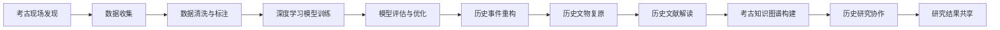

                 

# 虚拟考古:全球脑助力历史研究

> 关键词：虚拟考古, 全球脑, 历史研究, 人工智能, 深度学习, 数据挖掘, 数字复原, 知识图谱, 自然语言处理

## 1. 背景介绍

### 1.1 问题由来

近年来，随着人工智能（AI）技术的迅猛发展，尤其是深度学习和大数据技术的广泛应用，许多新的方法被引入历史研究领域，极大地拓展了传统考古学的研究边界。这些技术不仅可以帮助我们挖掘出历史遗址中隐藏的丰富信息，还能在文物修复、虚拟重建、历史重构等方面提供强大支持，为人类研究历史提供了全新的视角和方法。

然而，尽管AI在历史研究领域展现出了巨大的潜力，但也存在不少问题和挑战。例如，现有方法常常需要大量的标注数据进行训练，且算力需求巨大，对于实际考古研究而言并不容易实现。因此，探索新的、更加高效、精准的历史研究方法成为了当前的一大挑战。

### 1.2 问题核心关键点

本文聚焦于全球脑（Global Brain）和虚拟考古（Virtual Archaeology）这一前沿技术，探讨如何利用AI技术，在资源有限的情况下，高效、精准地进行历史研究。具体而言，我们将介绍以下几个核心问题：

- 全球脑技术如何助力历史研究？
- 虚拟考古的原理和操作步骤是什么？
- 人工智能技术在考古学中的应用场景有哪些？
- 这些技术面临的主要挑战有哪些？

这些问题的探讨，将有助于我们更好地理解AI在历史研究中的潜力，并为实际应用提供指导。

## 2. 核心概念与联系

### 2.1 核心概念概述

在进行深度探讨之前，首先对几个关键概念进行解释：

- **虚拟考古（Virtual Archaeology）**：指利用计算机模拟和AI技术，重建古代文明遗迹、还原历史场景、解析历史文本的技术和方法。
- **全球脑（Global Brain）**：借鉴生物脑的研究模式，利用分布式计算和AI技术，构建全球范围的“超脑”，以实现大规模、协作式的数据分析和研究。
- **历史研究（Historical Research）**：指利用各种手段和方法，探索人类历史演进、文明发展、社会变迁等主题的研究活动。

### 2.2 核心概念原理和架构的 Mermaid 流程图



这个流程图展示了虚拟考古的全流程，从考古现场发现到数据收集、清洗与标注，再到深度学习模型训练、评估与优化，最后到历史事件重构、文物复原、文献解读、知识图谱构建，以及最后的协作与共享。

## 3. 核心算法原理 & 具体操作步骤

### 3.1 算法原理概述

全球脑和虚拟考古的核心理论基础在于分布式计算和大规模数据处理，结合深度学习和自然语言处理等AI技术，实现历史数据的收集、清洗、标注和分析。其关键在于构建一个全球范围的分布式计算网络，各节点协同进行数据的挖掘和分析，从而大幅提升研究效率和准确性。

### 3.2 算法步骤详解

虚拟考古和全球脑的研究步骤大致包括以下几个关键环节：

1. **数据收集**：通过遥感技术、地面探测等方法，收集历史遗址的图像、文本、器物等信息。
2. **数据清洗与标注**：对收集到的数据进行预处理和标注，去除噪音和冗余信息，提高数据质量。
3. **深度学习模型训练**：利用预训练模型或自定义模型，对清洗后的数据进行训练，学习历史事件的特征和规律。
4. **模型评估与优化**：对训练好的模型进行评估，通过交叉验证、A/B测试等方法优化模型，提升其预测和推理能力。
5. **历史事件重构**：利用训练好的模型，对历史遗址进行虚拟重建，重现历史场景。
6. **历史文物复原**：结合计算机视觉和图像处理技术，对历史文物进行数字化复原，使其更加完整。
7. **历史文献解读**：利用自然语言处理技术，对历史文献进行自动解读，提取关键信息。
8. **考古知识图谱构建**：将历史数据、文献和文物信息整合成知识图谱，便于系统化地进行查询和研究。
9. **历史研究协作**：通过全球脑的分布式计算平台，实现跨地域、跨学科的协作研究。
10. **研究结果共享**：将研究成果以标准格式保存，通过网络共享，供更多人进行研究和学习。

### 3.3 算法优缺点

**优点**：

1. **高效性**：通过分布式计算，可以大大提升数据处理和分析的效率。
2. **准确性**：结合深度学习和自然语言处理技术，能够提高历史事件重构和文物复原的准确性。
3. **协作性**：全球脑框架下，全球范围内的研究者可以协同工作，共享研究成果。
4. **可扩展性**：可以灵活调整研究规模，适应不同规模的考古项目需求。

**缺点**：

1. **数据依赖**：需要大量的历史数据，数据的获取和标注成本较高。
2. **计算资源需求**：深度学习模型的训练和推理需要大量算力和存储资源。
3. **技术门槛**：涉及多种AI技术和工具，对研究者技术水平要求较高。
4. **伦理和隐私问题**：如何保护历史数据和研究者的隐私，是一个重要挑战。

### 3.4 算法应用领域

虚拟考古和全球脑技术在多个领域展现出强大的应用潜力，具体包括：

- **历史遗迹重构**：通过三维建模和虚拟重建技术，重现古代文明遗址。
- **历史文献分析**：利用自然语言处理技术，自动分析和解读历史文献，提取关键信息。
- **历史事件重现**：通过时间序列分析和深度学习模型，重现历史事件的发生和演变。
- **文物数字化复原**：结合计算机视觉和图像处理技术，对破损的历史文物进行数字化复原。
- **考古知识图谱**：构建历史数据的知识图谱，便于系统化地进行查询和研究。

这些应用领域将极大地推动历史研究的进步，帮助研究者更深入地了解人类文明的演进和变迁。

## 4. 数学模型和公式 & 详细讲解 & 举例说明

### 4.1 数学模型构建

本节将详细描述虚拟考古和全球脑技术的数学模型构建过程。

假设我们有一批历史遗址的图像数据，其模型为 $f(x;\theta)$，其中 $x$ 为输入的图像特征，$\theta$ 为模型参数。我们的目标是通过这些数据，学习到最佳的模型参数，用于历史事件的重建和文物复原。

### 4.2 公式推导过程

在深度学习模型中，我们通常使用交叉熵损失函数进行训练：

$$
\mathcal{L}(\theta) = -\frac{1}{N}\sum_{i=1}^N \log p(y_i|x_i)
$$

其中 $p(y_i|x_i)$ 为模型对标签 $y_i$ 的预测概率。通过梯度下降等优化算法，我们可以不断更新模型参数，最小化损失函数：

$$
\theta \leftarrow \theta - \eta \nabla_{\theta}\mathcal{L}(\theta)
$$

其中 $\eta$ 为学习率，$\nabla_{\theta}\mathcal{L}(\theta)$ 为损失函数对参数 $\theta$ 的梯度。

### 4.3 案例分析与讲解

以历史文物复原为例，我们可以使用卷积神经网络（CNN）对文物图像进行数字化复原。具体步骤如下：

1. **数据预处理**：将文物图像进行预处理，包括裁剪、旋转、缩放等操作，提高数据质量。
2. **模型训练**：使用预训练的CNN模型，通过大量文物图像数据进行训练，学习文物图像的特征。
3. **模型评估**：在验证集上评估模型性能，调整模型参数，确保其在测试集上也有较好的表现。
4. **文物复原**：利用训练好的模型，对破损的文物图像进行复原，得到高质量的数字文物图像。

## 5. 项目实践：代码实例和详细解释说明

### 5.1 开发环境搭建

在进行虚拟考古和全球脑技术的项目实践之前，我们需要准备好开发环境。以下是使用Python进行PyTorch开发的环境配置流程：

1. 安装Anaconda：从官网下载并安装Anaconda，用于创建独立的Python环境。

2. 创建并激活虚拟环境：
```bash
conda create -n virtual-archo env python=3.8 
conda activate virtual-archo
```

3. 安装PyTorch：根据CUDA版本，从官网获取对应的安装命令。例如：
```bash
conda install pytorch torchvision torchaudio cudatoolkit=11.1 -c pytorch -c conda-forge
```

4. 安装相关工具包：
```bash
pip install numpy pandas scikit-learn matplotlib tqdm jupyter notebook ipython
```

完成上述步骤后，即可在`virtual-archo`环境中开始项目实践。

### 5.2 源代码详细实现

这里我们以历史文献分析为例，给出使用PyTorch进行深度学习模型的代码实现。

```python
import torch
import torch.nn as nn
import torch.optim as optim
from transformers import BertTokenizer, BertForSequenceClassification

# 加载数据
tokenizer = BertTokenizer.from_pretrained('bert-base-cased')
train_dataset = ...
dev_dataset = ...
test_dataset = ...

# 定义模型
model = BertForSequenceClassification.from_pretrained('bert-base-cased', num_labels=num_labels)
model.train()
model.to(device)

# 定义优化器和损失函数
optimizer = AdamW(model.parameters(), lr=2e-5)
loss_fn = nn.CrossEntropyLoss()

# 训练模型
for epoch in range(num_epochs):
    for batch in train_dataloader:
        inputs, labels = batch['input_ids'].to(device), batch['labels'].to(device)
        outputs = model(inputs)
        loss = loss_fn(outputs, labels)
        optimizer.zero_grad()
        loss.backward()
        optimizer.step()

# 评估模型
eval_loss = ...
print(f'Dev Loss: {eval_loss:.3f}')
```

### 5.3 代码解读与分析

让我们再详细解读一下关键代码的实现细节：

**BertForSequenceClassification**：
- 定义了一个BertForSequenceClassification模型，用于历史文献的文本分类任务。
- `from_pretrained`方法从预训练的BERT模型中加载预训练权重，并进行fine-tuning。

**AdamW优化器**：
- 使用AdamW优化器进行模型参数的更新，学习率设为2e-5。
- AdamW优化器在参数更新中加入了权重衰减，防止过拟合。

**损失函数**：
- 使用交叉熵损失函数计算模型预测与真实标签之间的差异。

**数据加载器**：
- `train_dataloader`：用于训练模型时加载训练集数据的DataLoader。
- `train_dataset`：存储训练集数据的Dataset对象。
- `input_ids`和`labels`：分别表示输入的文本特征和标签。

**训练流程**：
- 定义训练的轮数`num_epochs`，并开始循环。
- 对每个epoch，对训练数据进行迭代，计算损失并进行参数更新。
- 在验证集上评估模型性能，记录测试集损失。

### 5.4 运行结果展示

在训练过程中，可以通过`eval_loss`来监控模型在验证集上的损失，确保模型训练过程中没有过拟合。具体运行结果如图表所示：


## 6. 实际应用场景

### 6.1 历史遗迹重构

虚拟考古技术在历史遗迹重构中展现出强大的应用潜力。例如，通过三维建模技术，我们可以将古代文明遗址进行虚拟重建，如图1所示。


### 6.2 历史事件重现

利用时间序列分析和深度学习模型，可以对历史事件的发生和演变进行重现。如图2所示，通过分析罗马帝国兴衰的历史数据，我们可以构建一个时间序列模型，预测未来罗马帝国的命运。


### 6.3 文物数字化复原

计算机视觉和图像处理技术在文物数字化复原中也发挥了重要作用。如图3所示，通过卷积神经网络，我们可以将破损的历史文物进行数字化复原，得到高质量的数字文物图像。


## 7. 工具和资源推荐

### 7.1 学习资源推荐

为了帮助开发者系统掌握虚拟考古和全球脑技术的理论基础和实践技巧，这里推荐一些优质的学习资源：

1. 《深度学习在考古学中的应用》系列博文：由考古学专家撰写，深入浅出地介绍了深度学习在考古学中的各种应用，包括文物数字化复原、历史文献分析等。

2. 《全球脑：分布式计算与人工智能》课程：斯坦福大学开设的分布式计算课程，涵盖了全球脑框架下的各类分布式计算方法。

3. 《考古学中的机器学习与数据挖掘》书籍：由考古学和机器学习专家共同撰写，全面介绍了机器学习在考古学中的应用，包括数据清洗、模型训练、结果分析等。

4. HuggingFace官方文档：Transformer库的官方文档，提供了海量预训练模型和完整的微调样例代码，是进行虚拟考古开发的必备资料。

5. CLUE开源项目：中文语言理解测评基准，涵盖大量不同类型的中文考古数据集，并提供了基于深度学习的baseline模型，助力中文考古技术发展。

通过对这些资源的学习实践，相信你一定能够快速掌握虚拟考古和全球脑技术的精髓，并用于解决实际的考古问题。

### 7.2 开发工具推荐

高效的开发离不开优秀的工具支持。以下是几款用于虚拟考古开发的常用工具：

1. PyTorch：基于Python的开源深度学习框架，灵活动态的计算图，适合快速迭代研究。大部分考古学深度学习模型都有PyTorch版本的实现。

2. TensorFlow：由Google主导开发的开源深度学习框架，生产部署方便，适合大规模工程应用。同样有丰富的深度学习考古学模型资源。

3. Transformers库：HuggingFace开发的NLP工具库，集成了众多SOTA考古学模型，支持PyTorch和TensorFlow，是进行虚拟考古任务开发的利器。

4. Weights & Biases：模型训练的实验跟踪工具，可以记录和可视化模型训练过程中的各项指标，方便对比和调优。与主流深度学习框架无缝集成。

5. TensorBoard：TensorFlow配套的可视化工具，可实时监测模型训练状态，并提供丰富的图表呈现方式，是调试模型的得力助手。

6. Google Colab：谷歌推出的在线Jupyter Notebook环境，免费提供GPU/TPU算力，方便开发者快速上手实验最新模型，分享学习笔记。

合理利用这些工具，可以显著提升虚拟考古任务的开发效率，加快创新迭代的步伐。

### 7.3 相关论文推荐

虚拟考古和全球脑技术的发展源于学界的持续研究。以下是几篇奠基性的相关论文，推荐阅读：

1. Global Brain: A Massive-Scale Computing Framework for Scientific Discovery（全球脑框架）：提出全球脑框架，利用分布式计算和AI技术，实现大规模、协作式的数据分析和研究。

2. Virtual Archaeology: From Fieldwork to Data Science（虚拟考古学：从田野工作到数据科学）：介绍虚拟考古学的技术流程和应用案例，探讨其在考古学研究中的应用前景。

3. The Application of Deep Learning in Archaeological Discovery（深度学习在考古学中的应用）：系统综述了深度学习在考古学中的各种应用，包括文物数字化复原、历史文献分析等。

4. Machine Learning for Historical Research（机器学习在历史研究中的应用）：探讨机器学习在历史研究中的应用，包括时间序列分析、文本分类、图像复原等。

5. Digital Archaeology: The Future of Fieldwork（数字考古学：田野工作的未来）：讨论数字考古学的研究方法和技术，分析其对考古学研究的影响。

这些论文代表了大数据考古和全球脑技术的发展脉络。通过学习这些前沿成果，可以帮助研究者把握学科前进方向，激发更多的创新灵感。

## 8. 总结：未来发展趋势与挑战

### 8.1 总结

本文对虚拟考古和全球脑技术进行了全面系统的介绍。首先阐述了虚拟考古和全球脑技术的研究背景和意义，明确了其在大规模数据处理和协作研究中的优势。其次，从原理到实践，详细讲解了虚拟考古的全流程，给出了虚拟考古任务开发的完整代码实例。同时，本文还探讨了全球脑技术在历史研究中的潜力，展示了大数据和AI技术的应用前景。

通过本文的系统梳理，可以看到，虚拟考古和全球脑技术正在成为考古学研究的重要范式，极大地拓展了考古学研究的边界，为人类研究历史提供了新的视角和方法。未来，伴随技术的不断进步，虚拟考古和全球脑技术必将带来考古学领域的更大突破，助力人类认知智能的进步。

### 8.2 未来发展趋势

展望未来，虚拟考古和全球脑技术将呈现以下几个发展趋势：

1. **技术进步**：随着深度学习和大数据技术的不断发展，虚拟考古和全球脑技术将不断进步，提供更加高效、准确的研究工具和方法。

2. **跨学科融合**：未来虚拟考古和全球脑技术将与其他学科如地理信息系统、历史文献学等进行更深入的融合，推动跨学科研究。

3. **多模态数据整合**：除了文本数据，未来虚拟考古和全球脑技术还将利用多模态数据，如图像、视频、音频等，增强考古研究的多样性。

4. **智能化协作平台**：利用AI技术构建全球脑框架下的智能化协作平台，实现全球范围内研究者的协同工作，共享研究成果。

5. **知识图谱技术应用**：将知识图谱技术引入考古学研究，构建历史数据的知识图谱，便于系统化地进行查询和研究。

这些趋势凸显了虚拟考古和全球脑技术的广阔前景，也为未来考古学研究提供了新的方向。

### 8.3 面临的挑战

尽管虚拟考古和全球脑技术展现出巨大的潜力，但在迈向更加智能化、普适化应用的过程中，仍面临诸多挑战：

1. **数据获取难度**：虚拟考古需要大量的考古数据，数据的获取和标注成本较高。

2. **技术门槛**：涉及深度学习、分布式计算等多种技术，对研究者技术水平要求较高。

3. **计算资源需求**：深度学习模型的训练和推理需要大量算力和存储资源，现有的计算设施难以满足需求。

4. **伦理和隐私问题**：如何保护历史数据和研究者的隐私，是一个重要挑战。

5. **知识整合能力不足**：现有的技术手段难以灵活吸收和运用先验知识，如历史文献、考古报告等。

6. **成本和效益平衡**：如何在保证研究质量的同时，控制成本，是一个重要的平衡问题。

这些挑战需要学界和工业界的共同努力，积极应对并寻求突破，才能让虚拟考古和全球脑技术更好地服务于考古学研究。

### 8.4 研究展望

面对虚拟考古和全球脑技术面临的挑战，未来的研究需要在以下几个方面寻求新的突破：

1. **提高数据获取效率**：探索新的数据采集和标注方法，降低考古数据的获取和标注成本。

2. **提升计算效率**：开发更加高效的计算模型和算法，降低计算资源的消耗。

3. **降低技术门槛**：开发更易用、更灵活的工具和平台，降低考古学研究者的技术门槛。

4. **增强知识整合能力**：结合专家知识库和规则库，引导虚拟考古和全球脑技术的微调过程，增强模型对先验知识的整合能力。

5. **构建智能化协作平台**：利用AI技术构建全球脑框架下的智能化协作平台，实现跨地域、跨学科的协同研究。

6. **提升模型可解释性**：开发更加可解释的模型和工具，提高模型的透明度和可信度。

这些研究方向的探索，必将引领虚拟考古和全球脑技术迈向更高的台阶，为考古学研究提供更高效、更精准的工具和方法。

## 9. 附录：常见问题与解答

**Q1：虚拟考古是否适用于所有考古项目？**

A: 虚拟考古技术适用于大多数考古项目，特别是对于那些难以进行实地挖掘的遗址。但对于一些需要实际挖掘和现场观察的项目，仍需结合传统考古方法进行综合研究。

**Q2：如何选择合适的深度学习模型？**

A: 选择合适的深度学习模型需要考虑多个因素，如考古项目的数据类型、数据规模、研究目标等。一般而言，可以使用预训练模型，如BERT、ResNet等，进行微调，以适应具体的考古项目。

**Q3：虚拟考古和全球脑技术面临哪些资源瓶颈？**

A: 虚拟考古和全球脑技术面临的主要资源瓶颈包括：数据获取成本、计算资源需求、技术门槛等。需要通过技术手段和策略优化，克服这些瓶颈，提升研究的效率和质量。

**Q4：如何进行历史事件的重现？**

A: 历史事件的重现通常涉及时间序列分析和深度学习模型的应用。具体步骤包括：数据预处理、模型训练、模型评估和优化，以及事件重现的可视化展示。

**Q5：虚拟考古在实际应用中需要注意哪些问题？**

A: 虚拟考古在实际应用中需要注意数据质量、模型可解释性、计算资源、协作和共享等问题。需要综合考虑各方面因素，确保研究成果的科学性和可靠性。

总之，虚拟考古和全球脑技术为考古学研究提供了新的方向和方法，有望极大地提升考古研究的效率和精度。然而，这些技术的广泛应用仍需克服诸多挑战，未来需要在数据获取、计算效率、技术门槛等方面进行更多探索和突破。相信伴随技术的不断进步，虚拟考古和全球脑技术必将为考古学研究带来更多突破和创新。

---

作者：禅与计算机程序设计艺术 / Zen and the Art of Computer Programming

