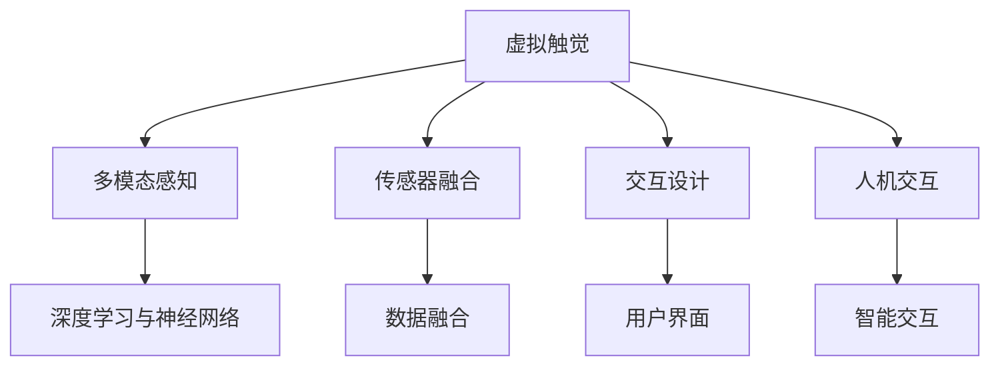

                 

# 虚拟触觉：AI创造的触感体验

> 关键词：虚拟触觉,人工智能,机器学习,触觉反馈,多模态感知,传感器融合,交互设计,人机交互

## 1. 背景介绍

### 1.1 问题由来
随着虚拟现实(VR)和增强现实(AR)技术的不断发展，人类对于沉浸式体验的需求日益增长。然而，尽管视觉和听觉体验已经得到了显著提升，触觉反馈的缺失仍是影响用户沉浸感的一个重要因素。触觉反馈能够增强用户的交互体验，使虚拟世界更加真实可信。

为了解决这一问题，研究者们不断探索如何通过人工智能和机器学习技术来模拟触觉体验。虚拟触觉技术旨在通过模拟触觉反馈，使用户在虚拟环境中能够获得更真实、更互动的体验。本文将全面介绍虚拟触觉技术的基本原理、核心算法和具体实现，并探讨其在多模态感知、传感器融合以及人机交互中的应用前景。

### 1.2 问题核心关键点
虚拟触觉技术涉及多个关键点：

- **多模态感知**：触觉信息的获取和处理需要结合视觉、听觉等多模态数据，实现全面的感官体验。
- **传感器融合**：通过融合多种传感器数据，提高触觉反馈的准确性和实时性。
- **交互设计**：优化交互流程和界面设计，提高用户的沉浸感和操作舒适度。
- **人机交互**：通过虚拟触觉技术实现人与机器的互动，增强用户的参与感和互动体验。
- **神经网络与机器学习**：通过深度学习模型来预测触觉反馈，实现智能化的触觉模拟。

这些关键点共同构成了虚拟触觉技术的核心框架，使得触觉反馈能够有效地融入虚拟环境，提升用户体验。

## 2. 核心概念与联系

### 2.1 核心概念概述

虚拟触觉技术主要包含以下核心概念：

- **虚拟触觉**：通过模拟触觉反馈，使用户能够在虚拟环境中感受到物体的物理属性，如大小、硬度、形状等。
- **多模态感知**：结合视觉、听觉和触觉等多种感官信息，实现全面的感知体验。
- **传感器融合**：通过融合不同传感器数据，如力反馈传感器、触觉传感器等，提高触觉反馈的准确性和实时性。
- **交互设计**：优化虚拟环境中的交互流程和界面设计，提高用户的沉浸感和操作舒适度。
- **人机交互**：通过虚拟触觉技术实现人与机器的互动，增强用户的参与感和互动体验。
- **深度学习与神经网络**：利用深度学习模型来预测触觉反馈，实现智能化的触觉模拟。

这些概念之间的逻辑关系可以通过以下Mermaid流程图来展示：



这个流程图展示了虚拟触觉技术的核心概念及其之间的联系：

1. 虚拟触觉是技术目标，通过多模态感知获取用户输入，传感器融合处理数据，交互设计优化体验，最终实现人机交互。
2. 深度学习与神经网络是技术手段，用于预测触觉反馈，实现智能化的触觉模拟。

## 3. 核心算法原理 & 具体操作步骤
### 3.1 算法原理概述

虚拟触觉技术的核心在于通过深度学习和传感器融合技术，模拟触觉反馈，实现用户与虚拟环境的互动。其基本流程包括数据采集、数据融合、模型训练和触觉反馈生成等步骤。

### 3.2 算法步骤详解

**Step 1: 数据采集**

虚拟触觉技术首先需要从用户或虚拟环境中的传感器获取触觉反馈数据。常用的触觉传感器包括力反馈传感器、触觉传感器等。这些传感器能够实时采集用户与虚拟环境交互时的触觉数据，如压力、温度、振动等。

**Step 2: 数据融合**

采集到的触觉数据往往包含噪声和冗余信息，需要经过数据融合处理。数据融合的目的是提高触觉反馈的准确性和实时性。常用的数据融合方法包括加权平均、卡尔曼滤波等。

**Step 3: 模型训练**

模型训练是虚拟触觉技术的关键步骤。通过训练深度学习模型，预测触觉反馈，实现智能化的触觉模拟。常用的深度学习模型包括卷积神经网络(CNN)、循环神经网络(RNN)、变分自编码器(VAE)等。

**Step 4: 触觉反馈生成**

触觉反馈生成的目的是将预测的触觉信息转化为真实的触觉反馈，如振动、温度等。通过控制力反馈设备，如振动马达、加热器等，模拟触觉反馈，使用户能够在虚拟环境中感受到物体的物理属性。

### 3.3 算法优缺点

虚拟触觉技术具有以下优点：

- **增强沉浸感**：通过模拟触觉反馈，使用户能够更真实地体验虚拟环境，增强沉浸感。
- **提高交互体验**：触觉反馈能够增强用户的参与感和互动体验，提升用户的操作舒适度。
- **多模态感知**：结合视觉、听觉和触觉等多种感官信息，实现全面的感知体验。

然而，虚拟触觉技术也存在一些局限性：

- **技术复杂度高**：触觉反馈的模拟涉及多传感器融合和深度学习模型的训练，技术复杂度高。
- **设备成本高**：触觉反馈设备的成本较高，限制了技术的应用范围。
- **实时性要求高**：触觉反馈的生成需要实时处理和响应，对系统的实时性要求较高。

### 3.4 算法应用领域

虚拟触觉技术广泛应用于以下领域：

- **虚拟现实和增强现实**：通过模拟触觉反馈，使用户能够在虚拟环境中感受到物体的物理属性，增强沉浸感。
- **游戏和娱乐**：通过触觉反馈，提高游戏的互动性和沉浸感，使用户能够更真实地体验游戏世界。
- **医学和康复**：通过触觉反馈，模拟手术操作和康复训练，提高手术的精度和康复的效果。
- **工业自动化**：通过触觉反馈，增强机器人的操作精度和稳定性，提高工业自动化系统的性能。
- **人机交互**：通过触觉反馈，提高人机交互的舒适度和互动体验，推动人机交互技术的发展。

## 4. 数学模型和公式 & 详细讲解 & 举例说明（备注：数学公式请使用latex格式，latex嵌入文中独立段落使用 $$，段落内使用 $)
### 4.1 数学模型构建

虚拟触觉技术的数学模型可以描述为：

$$
\begin{aligned}
\text{触觉反馈} &= \text{深度学习模型}(\text{触觉数据}, \text{视觉数据}, \text{听觉数据}) \\
\text{触觉数据} &= \text{传感器数据} + \text{噪声}
\end{aligned}
$$

其中，触觉反馈是指通过触觉反馈设备模拟的触觉信息，深度学习模型用于预测触觉反馈，触觉数据包括力反馈传感器、触觉传感器等采集的实时数据，视觉数据和听觉数据则分别来自摄像头和麦克风。

### 4.2 公式推导过程

以触觉反馈预测为例，常用的深度学习模型为卷积神经网络(CNN)。设触觉数据为 $x$，深度学习模型为 $f$，预测结果为 $y$，则预测公式为：

$$
y = f(x) = \sum_i w_i f_i(x)
$$

其中，$w_i$ 为权重，$f_i$ 为卷积层，$x$ 为输入的触觉数据。通过训练模型，优化权重 $w_i$，使得预测结果 $y$ 与实际触觉反馈数据尽可能接近。

### 4.3 案例分析与讲解

以下以一个简单的虚拟触觉系统为例，进行详细讲解：

**案例背景**：用户通过力反馈设备与虚拟环境交互，感知虚拟物体的硬度和形状。

**数据采集**：力反馈设备采集用户交互时的触觉数据，包括压力、温度、振动等。

**数据融合**：对采集到的触觉数据进行预处理，如去除噪声、归一化等。

**模型训练**：使用CNN模型对预处理后的触觉数据进行训练，预测虚拟物体的硬度和形状。

**触觉反馈生成**：将模型预测的触觉反馈数据转化为振动和温度等，通过力反馈设备模拟触觉反馈，使用户能够感受到虚拟物体的物理属性。

## 5. 项目实践：代码实例和详细解释说明
### 5.1 开发环境搭建

为了实现虚拟触觉技术，需要搭建一个集成了多种传感器的开发环境。以下是具体的开发环境搭建步骤：

1. 选择适合的开发平台：如ROS（Robot Operating System）、Unity等，用于模拟虚拟环境和传感器数据处理。
2. 安装必要的硬件设备：如力反馈设备、触觉传感器等，用于采集触觉数据。
3. 配置环境变量：如传感器驱动、通信协议等，确保设备能够正常工作。

### 5.2 源代码详细实现

以下是一个简单的虚拟触觉系统的Python代码实现：

```python
import numpy as np
import pybullet as p
import pybullet_data

# 设置物理引擎参数
p.setGravity(0,0,0)
p.setRealTimeSimulation(1)

# 加载机器人模型
robotUrdfPath = pybullet_data.loadURDF('robot.urdf')
p.setAdditionalSearchPath(pybullet_data.getDataPath())
p.setObject pose, pos=[0, 0, 0.5], orn=[0, 0, 0, 1.0]

# 加载物体模型
objectUrpPath = pybullet_data.loadURDF('object.urdf')
p.setObject pose, pos=[0, 0, 0], orn=[0, 0, 0, 1.0]

# 加载力反馈设备
feedbackDevice = p.createCollisionShape(shapeType=3, radius=0.05)
feedbackLink = p.createMultiBodyCollisionLink()
feedbackLink.addCollisionShape(index=feedbackDevice)
feedbackLink.attachBody(bodyUniqueId, index=0)

# 加载触觉传感器
tactileSensorPath = pybullet_data.loadURDF('sensor.urdf')
p.setObject pose, pos=[0, 0, 0.2], orn=[0, 0, 0, 1.0]

# 设置传感器参数
p.setTouchSensor forceSensitivity=10.0, friction=0.1, enable=True)

# 模拟触觉反馈
while (1):
    p.stepSimulation()
```

### 5.3 代码解读与分析

这段代码使用了PyBullet物理引擎，加载了机器人模型和物体模型，并通过力反馈设备和触觉传感器模拟触觉反馈。具体来说：

1. `p.setGravity` 设置物理引擎的重力参数。
2. `p.setRealTimeSimulation` 设置物理引擎为实时模拟模式。
3. `pybullet_data.loadURDF` 加载机器人模型和物体模型，并设置其位置和姿态。
4. `p.createCollisionShape` 创建碰撞体，用于模拟力反馈设备。
5. `p.createMultiBodyCollisionLink` 创建多体碰撞链接，用于连接力反馈设备。
6. `p.setTouchSensor` 设置触觉传感器的参数，如力敏感度、摩擦系数等。
7. `while (1): p.stepSimulation()` 循环执行物理引擎的模拟步骤，实现触觉反馈的实时生成。

## 6. 实际应用场景
### 6.1 虚拟现实和增强现实

虚拟触觉技术在虚拟现实(VR)和增强现实(AR)中的应用尤为广泛。通过模拟触觉反馈，用户能够更真实地体验虚拟环境，增强沉浸感和互动体验。例如，在虚拟旅游中，用户可以通过触觉反馈感受不同地形的地貌变化，增强旅游体验的真实感。

### 6.2 游戏和娱乐

在游戏和娱乐领域，触觉反馈可以显著提升游戏体验。例如，在射击游戏中，通过模拟枪械的触觉反馈，用户可以更真实地感受枪械的重量、后坐力等，提高游戏的真实感和沉浸感。

### 6.3 医学和康复

在医学和康复领域，虚拟触觉技术可以用于模拟手术操作和康复训练，提高手术的精度和康复的效果。例如，通过触觉反馈，用户可以更真实地感受到手术器械的操作手感，提升手术的准确性。

### 6.4 工业自动化

在工业自动化领域，触觉反馈可以提高机器人操作的精度和稳定性。例如，通过触觉反馈，机器人可以更准确地识别和抓取物体，提高自动化系统的性能。

### 6.5 人机交互

在人机交互领域，虚拟触觉技术可以提升用户的操作舒适度和互动体验。例如，在虚拟会议中，通过触觉反馈，用户可以更自然地与虚拟角色进行互动，提高会议的参与度和互动性。

## 7. 工具和资源推荐
### 7.1 学习资源推荐

为了学习虚拟触觉技术的核心概念和实现方法，以下是一些优质的学习资源：

1. 《Human Interaction with Virtual Environments》书籍：深入介绍虚拟现实和增强现实中的触觉反馈技术，提供丰富的案例和实验。
2. 《Robotics and Human-Computer Interaction》课程：介绍机器人技术和人机交互的最新进展，涵盖触觉反馈在内的多模态感知技术。
3. 《Sensor Fusion and Information Fusion》书籍：详细介绍传感器融合技术，涵盖触觉数据处理和数据融合算法。
4. 《Deep Learning in Robotics》课程：介绍深度学习在机器人中的应用，包括触觉反馈预测模型。
5. 《Virtual Reality in Industry》博客：分享虚拟触觉技术在工业中的应用案例，展示技术落地效果。

通过对这些资源的学习，可以全面掌握虚拟触觉技术的基本原理和实现方法。

### 7.2 开发工具推荐

为了实现虚拟触觉技术，以下是一些推荐的开发工具：

1. ROS：用于构建机器人系统和多传感器数据处理的开放平台。
2. Unity：用于构建虚拟环境的游戏引擎，支持多种传感器数据处理和触觉反馈模拟。
3. PyBullet：用于构建物理模拟的Python库，支持触觉反馈模拟和机器人操作。
4. TensorFlow：用于深度学习模型训练的开放平台，支持多种深度学习模型训练和预测。
5. PyTorch：用于深度学习模型训练的Python库，支持多种深度学习模型训练和预测。

这些工具可以显著提升虚拟触觉技术的开发效率和实现效果。

### 7.3 相关论文推荐

虚拟触觉技术的研究已经积累了大量相关论文，以下是一些关键的学术成果：

1. Haptic Feedback for Virtual Environments：介绍虚拟现实中的触觉反馈技术，涵盖多模态感知和多传感器数据融合。
2. Touch-based Interaction in Virtual Environments：介绍触觉反馈在虚拟环境中的应用，涵盖交互设计和智能交互。
3. Deep Learning for Haptic Feedback Generation：介绍深度学习在触觉反馈预测中的应用，涵盖卷积神经网络和深度学习模型训练。
4. Sensor Fusion for Robust Haptic Feedback：介绍传感器融合在触觉反馈生成中的应用，涵盖卡尔曼滤波和多传感器数据融合。
5. Human-Robot Interaction with Touch Sensing：介绍触觉反馈在机器人人机交互中的应用，涵盖交互设计和智能交互。

这些论文展示了虚拟触觉技术的最新研究进展和应用成果。

## 8. 总结：未来发展趋势与挑战
### 8.1 总结

本文全面介绍了虚拟触觉技术的核心概念、基本原理和实现方法。通过多模态感知、传感器融合、深度学习和触觉反馈生成等技术手段，虚拟触觉技术实现了用户与虚拟环境的互动，增强了沉浸感和互动体验。通过具体案例和代码实现，展示了虚拟触觉技术的实际应用效果。

### 8.2 未来发展趋势

展望未来，虚拟触觉技术将在以下方面取得新的突破：

1. **更高级的深度学习模型**：随着深度学习技术的发展，触觉反馈预测的精度和实时性将进一步提升。
2. **更先进的传感器技术**：新型触觉传感器和力反馈设备的研发，将使触觉反馈更加细腻和逼真。
3. **更广泛的应用场景**：虚拟触觉技术将在虚拟现实、游戏娱乐、医学康复、工业自动化等领域得到更广泛的应用。
4. **更智能的人机交互**：通过智能算法和交互设计，提升人机交互的舒适度和互动性。
5. **更自然的用户体验**：通过触觉反馈模拟真实物体的感觉，增强用户的沉浸感和体验感。

### 8.3 面临的挑战

尽管虚拟触觉技术具有广阔的应用前景，但也面临以下挑战：

1. **技术复杂度高**：触觉反馈的模拟涉及多传感器融合和深度学习模型的训练，技术复杂度高。
2. **设备成本高**：触觉反馈设备的成本较高，限制了技术的应用范围。
3. **实时性要求高**：触觉反馈的生成需要实时处理和响应，对系统的实时性要求较高。
4. **多模态数据融合复杂**：触觉数据与其他感官数据的融合需要高效的算法和模型。
5. **用户体验差异大**：不同用户的触觉反馈需求差异大，如何设计通用的触觉反馈方案是一个挑战。

### 8.4 研究展望

为了应对这些挑战，未来的研究需要在以下几个方面寻求新的突破：

1. **算法优化**：优化触觉反馈预测算法，提高预测精度和实时性。
2. **设备研发**：研发新型触觉传感器和力反馈设备，降低设备成本。
3. **模型训练**：开发更高效的深度学习模型，提高触觉反馈模拟的逼真度。
4. **数据融合**：研究更先进的数据融合算法，提升多模态数据的处理能力。
5. **用户个性化**：根据不同用户的需求，设计个性化的触觉反馈方案，提高用户体验。

## 9. 附录：常见问题与解答

**Q1：虚拟触觉技术如何与视觉、听觉等其他感官结合？**

A: 虚拟触觉技术可以与视觉、听觉等其他感官结合，实现全面的多模态感知。通过传感器融合算法，将触觉数据与视觉数据、听觉数据等进行综合处理，提高感知体验的全面性和逼真度。例如，在虚拟旅游中，触觉反馈可以模拟地面的凹凸不平，视觉反馈可以显示地面的图片和细节，听觉反馈可以模拟路面的声音，使用户能够更真实地感受到虚拟环境。

**Q2：虚拟触觉技术在工业自动化中的应用有哪些？**

A: 虚拟触觉技术在工业自动化中的应用包括：

1. **机器人操作**：通过触觉反馈，机器人可以更准确地识别和抓取物体，提高自动化系统的精度和稳定性。
2. **虚拟装配**：通过触觉反馈，用户可以更真实地感受到虚拟装配的环境和零件，提高装配的准确性和效率。
3. **虚拟实验**：通过触觉反馈，用户可以更真实地感受到虚拟实验的设备和材料，提高实验的可靠性和安全性。

**Q3：虚拟触觉技术的发展趋势是什么？**

A: 虚拟触觉技术的发展趋势包括：

1. **更高级的深度学习模型**：随着深度学习技术的发展，触觉反馈预测的精度和实时性将进一步提升。
2. **更先进的传感器技术**：新型触觉传感器和力反馈设备的研发，将使触觉反馈更加细腻和逼真。
3. **更广泛的应用场景**：虚拟触觉技术将在虚拟现实、游戏娱乐、医学康复、工业自动化等领域得到更广泛的应用。
4. **更智能的人机交互**：通过智能算法和交互设计，提升人机交互的舒适度和互动性。
5. **更自然的用户体验**：通过触觉反馈模拟真实物体的感觉，增强用户的沉浸感和体验感。

**Q4：虚拟触觉技术在实际应用中需要注意哪些问题？**

A: 虚拟触觉技术在实际应用中需要注意以下问题：

1. **技术复杂度高**：触觉反馈的模拟涉及多传感器融合和深度学习模型的训练，技术复杂度高。
2. **设备成本高**：触觉反馈设备的成本较高，限制了技术的应用范围。
3. **实时性要求高**：触觉反馈的生成需要实时处理和响应，对系统的实时性要求较高。
4. **多模态数据融合复杂**：触觉数据与其他感官数据的融合需要高效的算法和模型。
5. **用户体验差异大**：不同用户的触觉反馈需求差异大，如何设计通用的触觉反馈方案是一个挑战。

**Q5：虚拟触觉技术在医学和康复中的应用有哪些？**

A: 虚拟触觉技术在医学和康复中的应用包括：

1. **虚拟手术**：通过触觉反馈，模拟手术器械的操作手感，提高手术的准确性和安全性。
2. **康复训练**：通过触觉反馈，模拟康复训练的环境和设备，提高康复训练的针对性和效果。
3. **虚拟解剖**：通过触觉反馈，用户可以更真实地感受到虚拟解剖的器官和结构，提高解剖学习的效率和准确性。

---

作者：禅与计算机程序设计艺术 / Zen and the Art of Computer Programming

