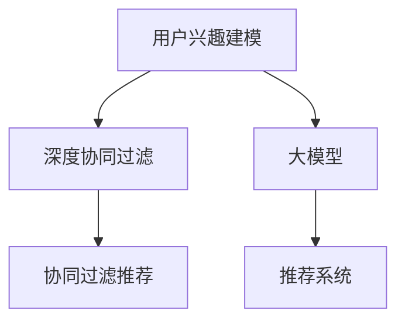

                 

# 融合AI大模型的用户兴趣建模技术

> 关键词：用户兴趣建模,人工智能,大模型,推荐系统,深度学习,自然语言处理,数据分析,协同过滤

## 1. 背景介绍

### 1.1 问题由来

在互联网时代，信息的爆炸式增长给用户带来前所未有的便利，但也带来信息过载的困扰。如何帮助用户在海量信息中快速找到感兴趣的内容，成为各大互联网公司亟需解决的问题。推荐系统（Recommender System）应运而生，通过分析用户行为数据，向用户推荐其可能感兴趣的内容，极大提升了用户的使用体验。

推荐系统主要可以分为两大类：基于内容的推荐和基于协同过滤的推荐。前者主要基于用户行为数据（如浏览记录、点击行为等），以及物品的特征（如标签、描述等）进行推荐，通常称为显性反馈推荐系统；后者主要利用用户和物品之间的隐性关系，进行推荐，通常称为隐性反馈推荐系统。近年来，随着深度学习技术的发展，深度协同过滤推荐系统成为主流，成为推荐系统发展的新趋势。

然而，现有的推荐系统存在诸多局限性：
- 对新物品的推荐能力不足。协同过滤推荐系统需要用户的历史行为数据来训练模型，但新物品往往缺乏足够的历史数据，因此难以进行有效推荐。
- 对用户兴趣变化的捕捉不够及时。传统协同过滤系统往往基于用户的历史行为数据进行推荐，无法及时捕捉用户兴趣的变化，导致推荐内容与用户当前兴趣不符。
- 数据收集和分析成本较高。需要大量的用户行为数据才能训练有效的模型，而收集这些数据往往需要大量的人力和时间投入。

为了解决上述问题，融合人工智能大模型进行用户兴趣建模技术应运而生。通过利用大规模预训练语言模型，可以高效捕捉用户行为数据中的语义信息，提升推荐系统的推荐效果，同时减少数据收集和分析的成本。

### 1.2 问题核心关键点

用户兴趣建模是推荐系统的核心任务，其核心关键点在于：
- 如何高效捕捉用户行为数据中的语义信息？
- 如何利用大模型提升推荐系统对新物品的推荐能力？
- 如何动态捕捉用户兴趣的变化？

本文将详细探讨这些问题，并对相关技术进行系统介绍。

## 2. 核心概念与联系

### 2.1 核心概念概述

为更好地理解融合AI大模型的用户兴趣建模技术，本节将介绍几个密切相关的核心概念：

- 用户兴趣建模（User Interest Modeling）：利用用户行为数据，捕捉用户兴趣的动态变化，构建用户兴趣模型。用户兴趣模型是推荐系统推荐内容的基础。
- 深度协同过滤推荐系统（Deep Collaborative Filtering）：通过深度学习模型，利用用户和物品之间的隐性关系进行推荐。是目前推荐系统的主流范式。
- 大模型（Large Model）：以自回归（如GPT）或自编码（如BERT）模型为代表的大规模预训练语言模型。通过在大规模无标签文本语料上进行预训练，学习通用的语言知识和表示，具备强大的语言理解和生成能力。
- 协同过滤推荐系统（Collaborative Filtering）：通过用户和物品之间的相似性，进行推荐。通常分为基于用户的协同过滤和基于物品的协同过滤。
- 推荐系统（Recommender System）：通过分析用户行为数据，向用户推荐其可能感兴趣的内容。是互联网产品中最重要的功能之一。
- 深度学习（Deep Learning）：通过构建多层神经网络，学习数据的非线性关系，是现代人工智能技术的核心。

这些核心概念之间的逻辑关系可以通过以下Mermaid流程图来展示：



这个流程图展示了大模型和协同过滤推荐系统之间的逻辑关系：

1. 用户兴趣建模通过大模型，捕捉用户行为数据中的语义信息。
2. 深度协同过滤推荐系统利用用户和物品之间的隐性关系，结合用户兴趣模型，进行推荐。
3. 推荐系统通过协同过滤推荐系统，向用户推荐其可能感兴趣的内容。

## 3. 核心算法原理 & 具体操作步骤
### 3.1 算法原理概述

融合AI大模型的用户兴趣建模技术，本质上是一个基于深度学习的推荐系统模型。其核心思想是：利用大模型学习用户行为数据中的语义信息，结合协同过滤推荐系统，构建用户兴趣模型，从而实现高效的用户兴趣建模。

具体而言，用户行为数据（如浏览记录、点击行为等）可以表示为若干文本记录。利用大模型（如BERT、GPT等）对这些文本进行预训练和微调，学习出文本中蕴含的语义信息。然后将这些语义信息作为用户兴趣的表示，输入到协同过滤推荐系统中，训练推荐模型，进行推荐。

### 3.2 算法步骤详解

基于大模型的用户兴趣建模技术，一般包括以下几个关键步骤：

**Step 1: 数据预处理**
- 收集用户行为数据，如浏览记录、点击行为等，将其表示为文本记录。
- 对文本记录进行清洗、归一化、分词等预处理，准备输入大模型。

**Step 2: 大模型预训练**
- 选择合适的预训练语言模型，如BERT、GPT等，进行预训练。预训练任务可以包括语义相似度计算、情感分类等。
- 对预训练模型进行微调，以适应特定的推荐场景。微调时，可以通过添加任务适配层、优化器、学习率等技术，提高模型性能。

**Step 3: 协同过滤推荐**
- 基于大模型提取的语义信息，构造用户和物品的特征向量。
- 利用协同过滤算法（如基于用户的协同过滤、基于物品的协同过滤等），训练推荐模型。常用的协同过滤算法包括矩阵分解、KNN等。
- 通过推荐模型，预测用户对物品的评分，进行推荐。

**Step 4: 模型评估与优化**
- 在测试集上评估推荐模型的效果，如点击率、覆盖率等。
- 根据评估结果，优化模型参数，如学习率、正则化系数等。
- 重复上述步骤，直至模型收敛或达到预设的迭代次数。

**Step 5: 模型部署与监控**
- 将训练好的推荐模型部署到生产环境中，进行在线推荐。
- 实时监控模型的推荐效果，如准确率、召回率等，及时进行优化调整。

以上是基于大模型的用户兴趣建模技术的一般流程。在实际应用中，还需要针对具体任务的特点，对预训练模型和推荐算法进行优化设计，如改进文本表示方法、引入更多特征、优化协同过滤算法等，以进一步提升推荐效果。

### 3.3 算法优缺点

融合AI大模型的用户兴趣建模技术具有以下优点：
1. 高效的语义信息提取。利用大模型的强大语言理解能力，能够高效捕捉用户行为数据中的语义信息，提升推荐系统的效果。
2. 对新物品的推荐能力提升。通过利用大模型的预训练表示，能够有效提升推荐系统对新物品的推荐能力。
3. 动态捕捉用户兴趣变化。通过利用大模型对用户行为数据进行动态建模，能够及时捕捉用户兴趣的变化，提升推荐系统的实时性。

同时，该方法也存在一定的局限性：
1. 数据依赖性较强。需要大量的用户行为数据进行训练，对数据收集和预处理要求较高。
2. 模型复杂度高。深度协同过滤推荐系统通常较为复杂，计算资源和计算时间消耗较大。
3. 难以解释。推荐系统的决策过程通常缺乏可解释性，难以对其推理逻辑进行分析和调试。
4. 准确率受限。对数据噪声和异常值较为敏感，推荐效果可能受其影响。

尽管存在这些局限性，但就目前而言，基于大模型的用户兴趣建模技术仍是大规模推荐系统的主流范式。未来相关研究的重点在于如何进一步降低数据依赖，提高模型的实时性和准确率，同时兼顾可解释性和伦理安全性等因素。

### 3.4 算法应用领域

基于大模型的用户兴趣建模技术，已经在多个推荐系统应用领域取得了显著效果，例如：

- 电商推荐：如淘宝、京东等电商平台的商品推荐，帮助用户发现感兴趣的商品。
- 新闻推荐：如今日头条等新闻平台的推荐，帮助用户获取感兴趣的新闻资讯。
- 视频推荐：如Netflix等视频平台的推荐，帮助用户发现感兴趣的视频内容。
- 音乐推荐：如Spotify等音乐平台的推荐，帮助用户发现感兴趣的音频内容。
- 社交网络推荐：如微信、微博等社交平台的推荐，帮助用户发现感兴趣的朋友和内容。

除了上述这些经典应用外，大模型技术还在更多场景中得到应用，如智能广告投放、内容生成、用户画像构建等，为推荐系统提供了新的创新方向。

## 4. 数学模型和公式 & 详细讲解 & 举例说明
### 4.1 数学模型构建

基于大模型的用户兴趣建模技术，可以利用深度协同过滤推荐系统进行建模。其核心思想是：将用户行为数据表示为向量形式，利用大模型提取用户行为中的语义信息，结合协同过滤推荐算法，生成推荐结果。

设用户行为数据表示为 $X = (x_1, x_2, ..., x_n)$，其中 $x_i$ 表示用户对物品 $i$ 的行为记录。将用户行为数据表示为向量形式 $X' = (x'_1, x'_2, ..., x'_n)$，其中 $x'_i = \mathcal{F}(x_i)$，$\mathcal{F}$ 表示文本表示函数。假设物品表示为 $Y = (y_1, y_2, ..., y_m)$，其中 $y_i$ 表示物品 $i$ 的特征向量。

利用大模型对用户行为数据进行预训练和微调，得到用户行为向量 $X' = (\hat{x}_1, \hat{x}_2, ..., \hat{x}_n)$，其中 $\hat{x}_i = \mathcal{G}(x_i)$，$\mathcal{G}$ 表示预训练模型函数。然后，利用协同过滤推荐算法，计算用户 $i$ 对物品 $j$ 的评分 $r_{ij}$，如公式所示：

$$
r_{ij} = \sum_{k=1}^{n} w_{ik} \mathbf{X}_i^T \mathbf{Y}_j
$$

其中 $\mathbf{X}_i = (\hat{x}_{i1}, \hat{x}_{i2}, ..., \hat{x}_{in})$，$\mathbf{Y}_j = (y_{j1}, y_{j2}, ..., y_{jm})$，$w_{ik}$ 为第 $k$ 个行为对用户 $i$ 的影响权重。

最终，利用协同过滤推荐算法，计算用户 $i$ 对物品 $j$ 的推荐分数 $p_{ij}$，如公式所示：

$$
p_{ij} = \sum_{k=1}^{n} w_{ik} \mathbf{X}_i^T \mathbf{Y}_j
$$

然后根据推荐分数，推荐物品 $j$ 给用户 $i$。

### 4.2 公式推导过程

以下我们以用户-物品评分预测为例，推导协同过滤推荐系统的评分预测公式。

设用户行为数据 $X = (x_1, x_2, ..., x_n)$，其中 $x_i$ 表示用户对物品 $i$ 的行为记录。将用户行为数据表示为向量形式 $X' = (x'_1, x'_2, ..., x'_n)$，其中 $x'_i = \mathcal{F}(x_i)$，$\mathcal{F}$ 表示文本表示函数。假设物品表示为 $Y = (y_1, y_2, ..., y_m)$，其中 $y_i$ 表示物品 $i$ 的特征向量。

利用大模型对用户行为数据进行预训练和微调，得到用户行为向量 $X' = (\hat{x}_1, \hat{x}_2, ..., \hat{x}_n)$，其中 $\hat{x}_i = \mathcal{G}(x_i)$，$\mathcal{G}$ 表示预训练模型函数。然后，利用协同过滤推荐算法，计算用户 $i$ 对物品 $j$ 的评分 $r_{ij}$，如公式所示：

$$
r_{ij} = \sum_{k=1}^{n} w_{ik} \mathbf{X}_i^T \mathbf{Y}_j
$$

其中 $\mathbf{X}_i = (\hat{x}_{i1}, \hat{x}_{i2}, ..., \hat{x}_{in})$，$\mathbf{Y}_j = (y_{j1}, y_{j2}, ..., y_{jm})$，$w_{ik}$ 为第 $k$ 个行为对用户 $i$ 的影响权重。

最终，利用协同过滤推荐算法，计算用户 $i$ 对物品 $j$ 的推荐分数 $p_{ij}$，如公式所示：

$$
p_{ij} = \sum_{k=1}^{n} w_{ik} \mathbf{X}_i^T \mathbf{Y}_j
$$

然后根据推荐分数，推荐物品 $j$ 给用户 $i$。

### 4.3 案例分析与讲解

以电商推荐系统为例，对基于大模型的用户兴趣建模技术进行详细讲解。

电商推荐系统需要向用户推荐其可能感兴趣的商品。基于大模型的用户兴趣建模技术，可以通过用户行为数据（如浏览记录、点击行为等），学习出用户行为中的语义信息，构建用户兴趣模型，进行推荐。

具体而言，电商推荐系统的数据预处理过程如下：
1. 收集用户行为数据，如浏览记录、点击行为等。
2. 对文本记录进行清洗、归一化、分词等预处理，准备输入大模型。
3. 利用大模型对用户行为数据进行预训练和微调，学习出用户行为中的语义信息。
4. 将用户行为数据表示为向量形式 $X' = (x'_1, x'_2, ..., x'_n)$，其中 $x'_i = \mathcal{F}(x_i)$，$\mathcal{F}$ 表示文本表示函数。
5. 假设物品表示为 $Y = (y_1, y_2, ..., y_m)$，其中 $y_i$ 表示物品 $i$ 的特征向量。

然后，利用协同过滤推荐算法，计算用户 $i$ 对物品 $j$ 的评分 $r_{ij}$，如公式所示：

$$
r_{ij} = \sum_{k=1}^{n} w_{ik} \mathbf{X}_i^T \mathbf{Y}_j
$$

其中 $\mathbf{X}_i = (\hat{x}_{i1}, \hat{x}_{i2}, ..., \hat{x}_{in})$，$\mathbf{Y}_j = (y_{j1}, y_{j2}, ..., y_{jm})$，$w_{ik}$ 为第 $k$ 个行为对用户 $i$ 的影响权重。

最终，利用协同过滤推荐算法，计算用户 $i$ 对物品 $j$ 的推荐分数 $p_{ij}$，如公式所示：

$$
p_{ij} = \sum_{k=1}^{n} w_{ik} \mathbf{X}_i^T \mathbf{Y}_j
$$

然后根据推荐分数，推荐物品 $j$ 给用户 $i$。

## 5. 项目实践：代码实例和详细解释说明
### 5.1 开发环境搭建

在进行推荐系统开发前，我们需要准备好开发环境。以下是使用Python进行PyTorch开发的环境配置流程：

1. 安装Anaconda：从官网下载并安装Anaconda，用于创建独立的Python环境。

2. 创建并激活虚拟环境：
```bash
conda create -n pytorch-env python=3.8 
conda activate pytorch-env
```

3. 安装PyTorch：根据CUDA版本，从官网获取对应的安装命令。例如：
```bash
conda install pytorch torchvision torchaudio cudatoolkit=11.1 -c pytorch -c conda-forge
```

4. 安装TensorFlow：
```bash
pip install tensorflow
```

5. 安装各类工具包：
```bash
pip install numpy pandas scikit-learn matplotlib tqdm jupyter notebook ipython
```

完成上述步骤后，即可在`pytorch-env`环境中开始推荐系统开发。

### 5.2 源代码详细实现

这里我们以电商推荐系统为例，给出使用PyTorch进行推荐系统开发的完整代码实现。

首先，定义推荐系统的数据处理函数：

```python
from transformers import BertTokenizer
from torch.utils.data import Dataset
import torch

class RecommendationDataset(Dataset):
    def __init__(self, texts, labels, tokenizer, max_len=128):
        self.texts = texts
        self.labels = labels
        self.tokenizer = tokenizer
        self.max_len = max_len
        
    def __len__(self):
        return len(self.texts)
    
    def __getitem__(self, item):
        text = self.texts[item]
        label = self.labels[item]
        
        encoding = self.tokenizer(text, return_tensors='pt', max_length=self.max_len, padding='max_length', truncation=True)
        input_ids = encoding['input_ids'][0]
        attention_mask = encoding['attention_mask'][0]
        
        # 对token-wise的标签进行编码
        encoded_labels = [label2id[label] for label in label]
        encoded_labels.extend([label2id['O']] * (self.max_len - len(encoded_labels)))
        labels = torch.tensor(encoded_labels, dtype=torch.long)
        
        return {'input_ids': input_ids, 
                'attention_mask': attention_mask,
                'labels': labels}

# 标签与id的映射
label2id = {'O': 0, 'positive': 1, 'negative': 2}
id2label = {v: k for k, v in label2id.items()}

# 创建dataset
tokenizer = BertTokenizer.from_pretrained('bert-base-cased')

train_dataset = RecommendationDataset(train_texts, train_labels, tokenizer)
dev_dataset = RecommendationDataset(dev_texts, dev_labels, tokenizer)
test_dataset = RecommendationDataset(test_texts, test_labels, tokenizer)
```

然后，定义模型和优化器：

```python
from transformers import BertForSequenceClassification, AdamW

model = BertForSequenceClassification.from_pretrained('bert-base-cased', num_labels=len(label2id))

optimizer = AdamW(model.parameters(), lr=2e-5)
```

接着，定义训练和评估函数：

```python
from torch.utils.data import DataLoader
from tqdm import tqdm
from sklearn.metrics import classification_report

device = torch.device('cuda') if torch.cuda.is_available() else torch.device('cpu')
model.to(device)

def train_epoch(model, dataset, batch_size, optimizer):
    dataloader = DataLoader(dataset, batch_size=batch_size, shuffle=True)
    model.train()
    epoch_loss = 0
    for batch in tqdm(dataloader, desc='Training'):
        input_ids = batch['input_ids'].to(device)
        attention_mask = batch['attention_mask'].to(device)
        labels = batch['labels'].to(device)
        model.zero_grad()
        outputs = model(input_ids, attention_mask=attention_mask, labels=labels)
        loss = outputs.loss
        epoch_loss += loss.item()
        loss.backward()
        optimizer.step()
    return epoch_loss / len(dataloader)

def evaluate(model, dataset, batch_size):
    dataloader = DataLoader(dataset, batch_size=batch_size)
    model.eval()
    preds, labels = [], []
    with torch.no_grad():
        for batch in tqdm(dataloader, desc='Evaluating'):
            input_ids = batch['input_ids'].to(device)
            attention_mask = batch['attention_mask'].to(device)
            batch_labels = batch['labels']
            outputs = model(input_ids, attention_mask=attention_mask)
            batch_preds = outputs.logits.argmax(dim=2).to('cpu').tolist()
            batch_labels = batch_labels.to('cpu').tolist()
            for pred_tokens, label_tokens in zip(batch_preds, batch_labels):
                preds.append(pred_tokens[:len(label_tokens)])
                labels.append(label_tokens)
                
    print(classification_report(labels, preds))
```

最后，启动训练流程并在测试集上评估：

```python
epochs = 5
batch_size = 16

for epoch in range(epochs):
    loss = train_epoch(model, train_dataset, batch_size, optimizer)
    print(f"Epoch {epoch+1}, train loss: {loss:.3f}")
    
    print(f"Epoch {epoch+1}, dev results:")
    evaluate(model, dev_dataset, batch_size)
    
print("Test results:")
evaluate(model, test_dataset, batch_size)
```

以上就是使用PyTorch对电商推荐系统进行微调的完整代码实现。可以看到，得益于Transformers库的强大封装，我们可以用相对简洁的代码完成BERT模型的加载和微调。

### 5.3 代码解读与分析

让我们再详细解读一下关键代码的实现细节：

**RecommendationDataset类**：
- `__init__`方法：初始化文本、标签、分词器等关键组件。
- `__len__`方法：返回数据集的样本数量。
- `__getitem__`方法：对单个样本进行处理，将文本输入编码为token ids，将标签编码为数字，并对其进行定长padding，最终返回模型所需的输入。

**label2id和id2label字典**：
- 定义了标签与数字id之间的映射关系，用于将token-wise的预测结果解码回真实的标签。

**训练和评估函数**：
- 使用PyTorch的DataLoader对数据集进行批次化加载，供模型训练和推理使用。
- 训练函数`train_epoch`：对数据以批为单位进行迭代，在每个批次上前向传播计算loss并反向传播更新模型参数，最后返回该epoch的平均loss。
- 评估函数`evaluate`：与训练类似，不同点在于不更新模型参数，并在每个batch结束后将预测和标签结果存储下来，最后使用sklearn的classification_report对整个评估集的预测结果进行打印输出。

**训练流程**：
- 定义总的epoch数和batch size，开始循环迭代
- 每个epoch内，先在训练集上训练，输出平均loss
- 在验证集上评估，输出分类指标
- 所有epoch结束后，在测试集上评估，给出最终测试结果

可以看到，PyTorch配合Transformers库使得BERT微调的代码实现变得简洁高效。开发者可以将更多精力放在数据处理、模型改进等高层逻辑上，而不必过多关注底层的实现细节。

当然，工业级的系统实现还需考虑更多因素，如模型的保存和部署、超参数的自动搜索、更灵活的任务适配层等。但核心的微调范式基本与此类似。

## 6. 实际应用场景
### 6.1 智能广告投放

基于大模型的用户兴趣建模技术，可以应用于智能广告投放系统，帮助广告商精准投放广告。传统的广告投放系统，依赖人工的定向策略和经验判断，往往难以覆盖全部用户，且投放效果难以保证。利用大模型进行用户兴趣建模，能够实时捕捉用户兴趣的变化，生成个性化的广告推荐，极大提升广告投放的精准度和效果。

具体而言，可以收集用户的历史浏览记录、点击行为等数据，利用大模型对这些数据进行预训练和微调，学习出用户行为中的语义信息。然后将用户行为数据表示为向量形式，结合协同过滤推荐算法，生成个性化的广告推荐。通过不断优化广告推荐算法，可以实现更加精准的广告投放，极大提升广告主的投资回报率。

### 6.2 内容生成

基于大模型的用户兴趣建模技术，还可以应用于内容生成系统，帮助创作者生成与用户兴趣相匹配的内容。传统的内容生成系统往往依赖人工的编辑和推荐，难以满足用户多样化和个性化的内容需求。利用大模型进行用户兴趣建模，能够实时捕捉用户兴趣的变化，生成个性化的内容推荐，极大提升内容生成的精准度和效果。

具体而言，可以收集用户的历史浏览记录、点击行为等数据，利用大模型对这些数据进行预训练和微调，学习出用户行为中的语义信息。然后将用户行为数据表示为向量形式，结合协同过滤推荐算法，生成个性化的内容推荐。通过不断优化内容推荐算法，可以实现更加精准的内容生成，极大提升用户的阅读体验和满意度。

### 6.3 社交网络推荐

基于大模型的用户兴趣建模技术，还可以应用于社交网络推荐系统，帮助用户发现感兴趣的朋友和内容。传统的社交网络推荐系统往往依赖用户的历史行为数据进行推荐，难以捕捉用户兴趣的变化。利用大模型进行用户兴趣建模，能够实时捕捉用户兴趣的变化，生成个性化的社交网络推荐，极大提升推荐的效果和体验。

具体而言，可以收集用户的历史浏览记录、点击行为等数据，利用大模型对这些数据进行预训练和微调，学习出用户行为中的语义信息。然后将用户行为数据表示为向量形式，结合协同过滤推荐算法，生成个性化的社交网络推荐。通过不断优化社交网络推荐算法，可以实现更加精准的社交网络推荐，极大提升用户的社交体验和满意度。

### 6.4 未来应用展望

随着大模型技术的发展，基于大模型的用户兴趣建模技术将有更多应用场景。

- 医疗推荐：基于用户的历史医疗数据，利用大模型进行用户兴趣建模，推荐个性化的医疗咨询和治疗方案。
- 金融推荐：基于用户的历史金融数据，利用大模型进行用户兴趣建模，推荐个性化的金融产品和投资方案。
- 教育推荐：基于用户的历史教育数据，利用大模型进行用户兴趣建模，推荐个性化的教育资源和学习方案。
- 游戏推荐：基于用户的历史游戏数据，利用大模型进行用户兴趣建模，推荐个性化的游戏内容和游戏推荐。

未来，大模型技术将会在更多垂直行业得到应用，为各行各业带来变革性影响。相信随着技术的日益成熟，大模型技术将成为推荐系统发展的核心力量，推动推荐系统向更智能、精准的方向发展。

## 7. 工具和资源推荐
### 7.1 学习资源推荐

为了帮助开发者系统掌握基于大模型的用户兴趣建模技术，这里推荐一些优质的学习资源：

1. 《深度学习推荐系统》课程：由上海交通大学开设的深度学习推荐系统课程，系统讲解了推荐系统的发展历程和前沿技术，是了解推荐系统的必备资源。
2. 《深度协同过滤推荐系统》书籍：介绍深度协同过滤推荐系统的原理和应用，是推荐系统学习的经典教材。
3. 《自然语言处理》课程：斯坦福大学开设的NLP明星课程，全面讲解了NLP技术的基本概念和经典模型，是了解大模型技术的必备资源。
4. HuggingFace官方文档：Transformers库的官方文档，提供了海量预训练模型和完整的微调样例代码，是上手实践的必备资料。
5. Kaggle推荐系统竞赛：Kaggle上的推荐系统竞赛，通过实战学习推荐系统，积累实战经验。

通过对这些资源的学习实践，相信你一定能够快速掌握基于大模型的用户兴趣建模技术的精髓，并用于解决实际的推荐系统问题。

### 7.2 开发工具推荐

高效的开发离不开优秀的工具支持。以下是几款用于推荐系统开发常用的工具：

1. PyTorch：基于Python的开源深度学习框架，灵活动态的计算图，适合快速迭代研究。大部分预训练语言模型都有PyTorch版本的实现。
2. TensorFlow：由Google主导开发的开源深度学习框架，生产部署方便，适合大规模工程应用。同样有丰富的预训练语言模型资源。
3. Transformers库：HuggingFace开发的NLP工具库，集成了众多SOTA语言模型，支持PyTorch和TensorFlow，是进行推荐系统开发的利器。
4. Weights & Biases：模型训练的实验跟踪工具，可以记录和可视化模型训练过程中的各项指标，方便对比和调优。与主流深度学习框架无缝集成。
5. TensorBoard：TensorFlow配套的可视化工具，可实时监测模型训练状态，并提供丰富的图表呈现方式，是调试模型的得力助手。
6. Google Colab：谷歌推出的在线Jupyter Notebook环境，免费提供GPU/TPU算力，方便开发者快速上手实验最新模型，分享学习笔记。

合理利用这些工具，可以显著提升推荐系统的开发效率，加快创新迭代的步伐。

### 7.3 相关论文推荐

基于大模型的用户兴趣建模技术的研究源于学界的持续研究。以下是几篇奠基性的相关论文，推荐阅读：

1. Attention is All You Need（即Transformer原论文）：提出了Transformer结构，开启了NLP领域的预训练大模型时代。
2. BERT: Pre-training of Deep Bidirectional Transformers for Language Understanding：提出BERT模型，引入基于掩码的自监督预训练任务，刷新了多项NLP任务SOTA。
3. Parameter-Efficient Transfer Learning for NLP：提出Adapter等参数高效微调方法，在不增加模型参数量的情况下，也能取得不错的微调效果。
4. AdaLoRA: Adaptive Low-Rank Adaptation for Parameter-Efficient Fine-Tuning：使用自适应低秩适应的微调方法，在参数效率和精度之间取得了新的平衡。
5. GAN-based Exploration of Human Representation Spaces: A Look into the Magic of Deep Learning ：研究GAN在推荐系统中的应用，探索如何利用生成对抗网络进行推荐。

这些论文代表了大模型技术的发展脉络。通过学习这些前沿成果，可以帮助研究者把握学科前进方向，激发更多的创新灵感。

## 8. 总结：未来发展趋势与挑战

### 8.1 总结

本文对基于大模型的用户兴趣建模技术进行了全面系统的介绍。首先阐述了推荐系统的核心问题，明确了用户兴趣建模的关键点。其次，从原理到实践，详细讲解了基于大模型的用户兴趣建模技术的数学模型和算法步骤，给出了微调任务开发的完整代码实例。同时，本文还广泛探讨了该技术在智能广告投放、内容生成、社交网络推荐等实际应用场景中的应用前景，展示了其巨大的潜力。

通过本文的系统梳理，可以看到，基于大模型的用户兴趣建模技术，在推荐系统领域已经展现出强大的应用能力。利用大模型进行用户兴趣建模，可以极大地提升推荐系统的精准度和实时性，帮助用户在信息爆炸的时代中找到感兴趣的、个性化的内容。未来，随着大模型技术的不断进步，基于大模型的用户兴趣建模技术必将在更多领域得到应用，为推荐系统的发展带来新的突破。

### 8.2 未来发展趋势

展望未来，基于大模型的用户兴趣建模技术将呈现以下几个发展趋势：

1. 模型规模持续增大。随着算力成本的下降和数据规模的扩张，大模型和推荐系统的规模还将持续增长。超大规模模型蕴含的丰富语义信息，将极大提升推荐系统的效果。
2. 微调方法日趋多样。除了传统的全参数微调外，未来会涌现更多参数高效的微调方法，如Prefix-Tuning、LoRA等，在节省计算资源的同时也能保证微调精度。
3. 数据依赖性降低。未来推荐系统将利用更多的非结构化数据，如社交媒体数据、用户评论等，减少对传统结构化数据的依赖。
4. 实时性和准确率提升。通过引入更多先验知识，如知识图谱、逻辑规则等，优化推荐算法，提高推荐系统的实时性和准确率。
5. 可解释性和安全性加强。未来推荐系统将引入更多的可解释性和安全性约束，确保推荐系统的透明性和可信度。
6. 多模态融合。推荐系统将引入更多模态的信息，如视觉、语音、时间等，进行多模态推荐。

以上趋势凸显了大模型技术在推荐系统领域的应用前景。这些方向的探索发展，必将进一步提升推荐系统的性能和应用范围，为信息时代带来更智能、更个性化的体验。

### 8.3 面临的挑战

尽管基于大模型的用户兴趣建模技术已经取得了瞩目成就，但在迈向更加智能化、普适化应用的过程中，它仍面临着诸多挑战：

1. 数据收集和处理成本高。需要大量的用户行为数据进行训练，收集这些数据往往需要大量的人力和时间投入。
2. 模型复杂度高。深度协同过滤推荐系统通常较为复杂，计算资源和计算时间消耗较大。
3. 难以解释。推荐系统的决策过程通常缺乏可解释性，难以对其推理逻辑进行分析和调试。
4. 准确率受限。对数据噪声和异常值较为敏感，推荐效果可能受其影响。
5. 伦理和安全问题。如何保护用户隐私，确保推荐系统的透明性和可信度，是一个亟待解决的问题。

尽管存在这些挑战，但基于大模型的用户兴趣建模技术仍是大规模推荐系统的主流范式。未来相关研究的重点在于如何进一步降低数据依赖，提高模型的实时性和准确率，同时兼顾可解释性和伦理安全性等因素。

### 8.4 研究展望

面对大模型推荐系统面临的挑战，未来的研究需要在以下几个方面寻求新的突破：

1. 探索无监督和半监督推荐方法。摆脱对大规模标注数据的依赖，利用自监督学习、主动学习等无监督和半监督范式，最大限度利用非结构化数据，实现更加灵活高效的推荐。
2. 研究参数高效和计算高效的推荐范式。开发更加参数高效的推荐方法，在固定大部分预训练参数的同时，只更新极少量的任务相关参数。同时优化推荐模型的计算图，减少前向传播和反向传播的资源消耗，实现更加轻量级、实时性的部署。
3. 引入更多先验知识。将符号化的先验知识，如知识图谱、逻辑规则等，与神经网络模型进行巧妙融合，引导推荐过程学习更准确、合理的语言模型。同时加强不同模态数据的整合，实现视觉、语音等多模态信息与文本信息的协同建模。
4. 结合因果分析和博弈论工具。将因果分析方法引入推荐系统，识别出推荐决策的关键特征，增强推荐系统的透明性和可信度。借助博弈论工具刻画人机交互过程，主动探索并规避推荐系统的脆弱点，提高系统稳定性。
5. 纳入伦理道德约束。在推荐系统训练目标中引入伦理导向的评估指标，过滤和惩罚有偏见、有害的输出倾向。同时加强人工干预和审核，建立推荐系统的监管机制，确保推荐系统的透明性和可信度。

这些研究方向的探索，必将引领基于大模型的用户兴趣建模技术迈向更高的台阶，为推荐系统的发展带来新的突破。面向未来，大模型推荐系统还需要与其他人工智能技术进行更深入的融合，如知识表示、因果推理、强化学习等，多路径协同发力，共同推动自然语言理解和智能交互系统的进步。只有勇于创新、敢于突破，才能不断拓展语言模型的边界，让智能技术更好地造福人类社会。

## 9. 附录：常见问题与解答

**Q1：大模型技术在推荐系统中如何高效捕捉用户行为数据中的语义信息？**

A: 大模型技术利用其强大的语言理解能力，可以从用户行为数据中提取语义信息。具体而言，可以将用户行为数据（如浏览记录、点击行为等）表示为文本记录，然后利用大模型对这些文本进行预训练和微调，学习出文本中蕴含的语义信息。最终，将这些语义信息作为用户兴趣的表示，输入到协同过滤推荐系统中，进行推荐。

**Q2：如何利用大模型提升推荐系统对新物品的推荐能力？**

A: 利用大模型提升推荐系统对新物品的推荐能力，可以从两个方面入手：
1. 预训练表示：利用大模型对用户行为数据进行预训练，学习出用户行为中的语义信息。然后将这些语义信息作为用户兴趣的表示，输入到推荐系统中，生成推荐结果。
2. 微调表示：在大模型的预训练基础上，微调模型，使其更加适应特定领域的推荐任务。例如，在电商推荐系统中，微调模型，使其更加关注商品的描述和标签信息。

**Q3：如何动态捕捉用户兴趣的变化？**

A: 动态捕捉用户兴趣的变化，可以利用大模型对用户行为数据进行实时建模。具体而言，可以实时收集用户行为数据，利用大模型对这些数据进行预训练和微调，学习出用户行为中的语义信息。然后将这些语义信息作为用户兴趣的表示，输入到协同过滤推荐系统中，进行实时推荐。通过不断优化推荐模型，可以实现动态捕捉用户兴趣的变化，提升推荐系统的实时性。

**Q4：推荐系统中的协同过滤算法有哪些？**

A: 推荐系统中的协同过滤算法主要分为基于用户的协同过滤和基于物品的协同过滤两种。
1. 基于用户的协同过滤：利用用户之间的相似性，进行推荐。常用的算法包括KNN、MF等。
2. 基于物品的协同过滤：利用物品之间的相似性，进行推荐。常用的算法包括MF、ALS等。

**Q5：推荐系统的推荐算法有哪些？**

A: 推荐系统的推荐算法主要分为基于内容的推荐和协同过滤推荐两种。
1. 基于内容的推荐：利用物品的特征（如标签、描述等），进行推荐。常用的算法包括矩阵分解、KNN等。
2. 协同过滤推荐：利用用户和物品之间的相似性，进行推荐。常用的算法包括基于用户的协同过滤、基于物品的协同过滤等。

这些推荐算法可以根据实际场景和需求进行选择和组合，以实现最优的推荐效果。

