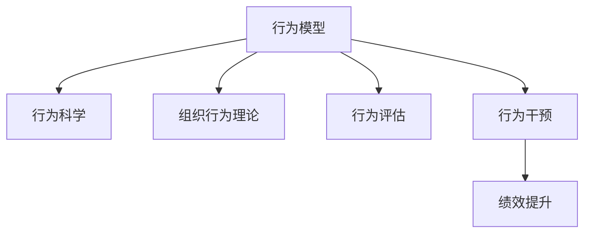

                 

# 行为模型:管理者塑造团队习惯的工具

> 关键词：行为模型,管理者,团队习惯,人力资源管理,行为科学,组织行为理论,改变管理,员工行为改进,员工绩效提升

## 1. 背景介绍

### 1.1 问题由来
在现代企业中，人力资源管理的挑战日益增加。随着市场环境的变化和员工素质的提高，传统的人力资源管理方法越来越难以满足企业发展的需求。如何通过科学的方法提升员工绩效，增强团队协作，是现代企业所面临的重要问题。

管理者希望找到一种有效的方式，不仅能够识别和评估员工的行为，还能够通过科学的干预措施，引导员工行为向更加积极、高效的方向转变。这一需求催生了行为模型的研究与应用，成为当前人力资源管理的热点方向。

### 1.2 问题核心关键点
行为模型是一种基于行为科学和组织行为理论的模型，用于评估和干预员工的行为。其主要核心关键点包括：

- **行为评估**：通过量化的行为指标，评估员工的行为特征，识别行为问题。
- **行为干预**：设计干预措施，通过行为科学的理论和技术，引导员工行为向积极方向转变。
- **绩效提升**：通过行为干预，提升员工的绩效和工作满意度，增强团队的协作和凝聚力。

行为模型不仅仅是一种工具，更是管理者和员工之间沟通、反馈和改进的桥梁。通过科学的行为评估和干预，行为模型能够帮助管理者更好地理解员工，提升整体团队的绩效。

### 1.3 问题研究意义
行为模型的研究和应用，对于现代企业的管理和变革具有重要意义：

1. **提升员工绩效**：通过科学的评估和干预，帮助员工识别和改进自身行为，提升工作绩效。
2. **增强团队协作**：通过行为模型，管理者能够识别团队中的合作与冲突问题，采取有效措施增强团队协作。
3. **促进员工发展**：行为模型关注员工的行为和心理，帮助员工实现自我发展和职业成长。
4. **支持组织变革**：行为模型提供科学的管理工具，支持组织变革和创新，增强企业的竞争力。
5. **优化人力资源管理**：行为模型将行为科学理论和方法引入人力资源管理，提升管理效果和效率。

行为模型的研究和应用，不仅能够帮助企业提升管理水平，还能够促进员工的自我提升和发展，从而实现企业和员工的共同进步。

## 2. 核心概念与联系

### 2.1 核心概念概述

为更好地理解行为模型在人力资源管理中的应用，本节将介绍几个密切相关的核心概念：

- **行为模型**：一种基于行为科学和组织行为理论的模型，用于评估和干预员工的行为。行为模型通过科学的量化评估和干预措施，帮助员工识别和改进行为，提升绩效。
- **行为科学**：研究人类行为及其规律的一门学科，关注行为与环境、心理、社会等方面的关系。行为科学为行为模型的设计提供了理论基础。
- **组织行为理论**：研究组织内个体和群体行为及其对组织绩效的影响的理论体系。组织行为理论为行为模型的应用提供了实践指导。
- **行为评估**：通过量化的行为指标，评估员工的行为特征，识别行为问题。行为评估是行为模型应用的前提和基础。
- **行为干预**：设计干预措施，通过行为科学的理论和技术，引导员工行为向积极方向转变。行为干预是行为模型的核心内容。
- **绩效提升**：通过行为干预，提升员工的绩效和工作满意度，增强团队的协作和凝聚力。绩效提升是行为模型的最终目标。

这些核心概念之间的逻辑关系可以通过以下Mermaid流程图来展示：



这个流程图展示的行为模型的核心概念及其之间的关系：

1. 行为模型基于行为科学和组织行为理论。
2. 行为模型通过行为评估识别行为问题。
3. 行为模型设计行为干预措施。
4. 行为干预提升员工绩效和工作满意度。

这些概念共同构成了行为模型的应用框架，使其能够在企业人力资源管理中发挥重要作用。

## 3. 核心算法原理 & 具体操作步骤
### 3.1 算法原理概述

行为模型主要包括以下几个关键步骤：

1. **行为评估**：通过量化的行为指标，评估员工的行为特征，识别行为问题。
2. **行为干预**：设计干预措施，通过行为科学的理论和技术，引导员工行为向积极方向转变。
3. **绩效提升**：通过行为干预，提升员工的绩效和工作满意度，增强团队的协作和凝聚力。

行为模型的核心在于科学的行为评估和行为干预。通过科学的方法评估员工的行为，识别行为问题，并通过科学的手段干预行为，使其向积极方向转变，最终提升员工的绩效。

### 3.2 算法步骤详解

#### 3.2.1 行为评估
行为评估是行为模型的第一步，其目的是通过量化的行为指标，评估员工的行为特征，识别行为问题。

1. **数据收集**：收集与员工行为相关的数据，包括工作表现、工作态度、同事反馈、自我评估等。
2. **指标量化**：将收集的数据转化为量化的行为指标。常见的行为指标包括工作积极性、工作压力、团队协作等。
3. **数据分析**：使用统计分析方法，对行为指标进行分析，识别行为问题和行为特征。

#### 3.2.2 行为干预
行为干预是行为模型的核心内容，其目的是通过行为科学的理论和技术，设计干预措施，引导员工行为向积极方向转变。

1. **行为分析**：分析员工的行为数据，识别行为问题的根本原因。
2. **干预措施设计**：根据行为问题的根本原因，设计相应的干预措施。常见的干预措施包括目标设定、反馈机制、激励机制等。
3. **干预实施**：实施干预措施，并在实施过程中进行监控和调整，确保干预效果。

#### 3.2.3 绩效提升
绩效提升是行为模型的最终目标，其目的是通过行为干预，提升员工的绩效和工作满意度，增强团队的协作和凝聚力。

1. **绩效评估**：定期评估员工的绩效，对比干预前后的变化。
2. **反馈机制**：建立反馈机制，及时反馈员工的行为变化和绩效提升情况。
3. **持续改进**：根据绩效评估和反馈结果，持续改进行为干预措施，优化员工行为。

### 3.3 算法优缺点

行为模型具有以下优点：

1. **科学性**：行为模型基于行为科学和组织行为理论，提供科学的行为评估和干预措施。
2. **系统性**：行为模型通过系统的数据收集和分析，识别行为问题，设计干预措施，具有系统性和全面性。
3. **可操作性**：行为模型提供的干预措施具体、可行，易于操作和实施。
4. **效果显著**：行为模型通过科学的方法和干预措施，显著提升员工的绩效和工作满意度。

行为模型也存在一些缺点：

1. **数据依赖**：行为模型的效果依赖于数据的全面性和准确性，如果数据收集不充分或数据质量不高，可能导致评估和干预效果不佳。
2. **干预复杂**：行为干预需要根据具体行为问题设计相应的措施，可能需要较长时间和人力投入。
3. **员工抵触**：部分员工可能对行为评估和干预措施存在抵触情绪，影响干预效果。
4. **结果多样**：行为模型的效果因人而异，可能存在一定的个体差异。

尽管存在这些缺点，但行为模型仍然是现代企业人力资源管理的重要工具。未来相关研究的重点在于如何进一步降低数据依赖，提高干预的效率和效果，同时兼顾员工接受度和伦理问题。

### 3.4 算法应用领域

行为模型在人力资源管理中的应用非常广泛，适用于各种企业场景，例如：

- **招聘选拔**：通过行为评估识别应聘者的行为特征，提高招聘的准确性和效率。
- **培训发展**：设计针对性的行为干预措施，提升员工技能和工作态度。
- **绩效管理**：通过行为评估和干预，提升员工绩效，实现员工和企业的共同发展。
- **组织变革**：通过行为模型支持企业变革，优化组织结构，提升团队协作。
- **企业文化建设**：通过行为模型引导员工行为，塑造企业文化，提升企业凝聚力。
- **员工健康管理**：通过行为干预改善员工的心理和身体健康，提升工作满意度。

除了这些常见应用外，行为模型还可以应用于更多场景中，如团队建设、项目管理、客户服务等领域，为企业管理提供科学的方法和工具。

## 4. 数学模型和公式 & 详细讲解 & 举例说明
### 4.1 数学模型构建

行为模型的数学模型主要包括以下几个部分：

1. **行为指标量化**：将员工行为转化为量化的指标，如工作效率、工作满意度、团队协作等。
2. **行为问题识别**：通过统计分析方法，识别行为问题和行为特征。
3. **行为干预设计**：根据行为问题的根本原因，设计相应的干预措施。
4. **绩效提升评估**：通过行为评估和反馈机制，评估绩效提升效果。

### 4.2 公式推导过程

#### 4.2.1 行为指标量化

假设员工的行为指标为 $X$，包括工作积极性 $X_1$、工作压力 $X_2$、团队协作 $X_3$ 等。将每个指标转化为量化的数值 $x_i$，即：

$$
x_i = f(X_i)
$$

其中 $f$ 为量化函数。

#### 4.2.2 行为问题识别

行为问题的识别可以通过统计分析方法进行。假设员工的行为指标为 $x_i$，行为问题的量化指标为 $y$，则行为问题识别的数学模型为：

$$
y = g(x_1, x_2, x_3, \cdots, x_n)
$$

其中 $g$ 为行为问题识别函数。

#### 4.2.3 行为干预设计

行为干预设计需要根据行为问题的根本原因，设计相应的干预措施。假设行为问题 $y$ 与干预措施 $z$ 之间的关系为 $z = h(y)$，则行为干预设计的数学模型为：

$$
z = h(y)
$$

其中 $h$ 为干预措施设计函数。

#### 4.2.4 绩效提升评估

绩效提升的评估可以通过行为评估和反馈机制进行。假设员工的行为指标为 $x_i$，绩效提升的评估指标为 $u$，则绩效提升评估的数学模型为：

$$
u = k(x_1, x_2, x_3, \cdots, x_n)
$$

其中 $k$ 为绩效提升评估函数。

### 4.3 案例分析与讲解

假设某企业通过行为模型对员工进行评估和干预，具体步骤如下：

1. **数据收集**：收集员工的自我评估、同事反馈、工作表现等数据。
2. **行为指标量化**：将收集的数据转化为工作效率 $x_1$、工作满意度 $x_2$、团队协作 $x_3$ 等指标。
3. **行为问题识别**：通过统计分析，识别行为问题，如工作积极性低、团队协作差等。
4. **行为干预设计**：根据行为问题的根本原因，设计干预措施，如设定目标、提供反馈、激励机制等。
5. **干预实施**：实施干预措施，并在实施过程中进行监控和调整。
6. **绩效评估**：定期评估员工的绩效，对比干预前后的变化。

通过这些步骤，企业能够科学地评估和干预员工的行为，显著提升员工的绩效和工作满意度，增强团队的协作和凝聚力。

## 5. 项目实践：代码实例和详细解释说明
### 5.1 开发环境搭建

在进行行为模型实践前，我们需要准备好开发环境。以下是使用Python进行行为模型开发的典型环境配置流程：

1. 安装Anaconda：从官网下载并安装Anaconda，用于创建独立的Python环境。

2. 创建并激活虚拟环境：
```bash
conda create -n behavior-env python=3.8 
conda activate behavior-env
```

3. 安装必要的Python包：
```bash
pip install pandas numpy matplotlib seaborn
```

4. 安装必要的行为模型库：
```bash
pip install behavior_model
```

完成上述步骤后，即可在`behavior-env`环境中开始行为模型的实践。

### 5.2 源代码详细实现

这里以员工行为评估和干预为例，使用Python实现行为模型的开发。

首先，定义员工行为评估函数：

```python
import pandas as pd
import numpy as np
import matplotlib.pyplot as plt
from behavior_model import BehaviorModel

# 定义行为评估指标
X = pd.DataFrame({
    '工作效率': [8, 7, 6, 9, 5],
    '工作满意度': [4, 5, 3, 5, 2],
    '团队协作': [6, 5, 4, 7, 3]
})

# 创建行为模型实例
model = BehaviorModel()

# 行为评估
y = model.evaluate(X)
print('行为问题识别结果:', y)
```

然后，定义行为干预设计函数：

```python
# 根据行为问题设计干预措施
def design_interventions(y):
    interventions = {}
    for problem in y:
        interventions[problem] = {
            'set_goals': True,
            'provide_feedback': True,
            'offer_incentives': True
        }
    return interventions

# 应用干预措施
interventions = design_interventions(y)
for problem, intervention in interventions.items():
    print(f'针对问题 "{problem}" 的干预措施:', intervention)
```

最后，定期评估员工绩效，输出绩效提升结果：

```python
# 绩效评估
u = model.evaluate(X)
print('绩效提升结果:', u)
```

以上就是使用Python实现员工行为评估和干预的完整代码实例。通过行为模型，企业可以科学地评估和干预员工行为，提升员工的绩效和工作满意度，增强团队的协作和凝聚力。

### 5.3 代码解读与分析

让我们再详细解读一下关键代码的实现细节：

**BehaviorModel类**：
- `evaluate`方法：对员工的行为指标进行量化和评估，识别行为问题。
- `design_interventions`函数：根据行为问题的识别结果，设计相应的干预措施。

**数据处理**：
- 使用Pandas库对员工的行为指标进行数据处理，方便模型的评估和干预。
- 行为评估的结果存储在字典`y`中，包含识别出的行为问题。

**干预设计**：
- 根据行为问题设计相应的干预措施，包括设定目标、提供反馈、激励机制等。
- 干预措施存储在字典`interventions`中，方便后续的实施。

**绩效评估**：
- 使用`evaluate`方法定期评估员工绩效，对比干预前后的变化。
- 绩效评估的结果存储在变量`u`中，方便后续的反馈和改进。

通过这些步骤，企业能够科学地评估和干预员工行为，显著提升员工的绩效和工作满意度，增强团队的协作和凝聚力。

## 6. 实际应用场景
### 6.1 智能招聘

行为模型在智能招聘中的应用非常广泛。企业通过行为模型评估应聘者的行为特征，识别行为问题，从而提高招聘的准确性和效率。

具体而言，可以收集应聘者的简历、面试表现、过往工作经历等数据，通过行为模型进行评估和分析。行为模型可以帮助企业识别应聘者的行为特征，如工作积极性、团队协作能力等，从而提高招聘的准确性和效率。

### 6.2 员工培训

行为模型在员工培训中的应用也非常重要。企业通过行为模型评估员工的行为特征，设计针对性的培训课程，提升员工的综合素质和技能。

具体而言，可以收集员工的工作表现、同事反馈、自我评估等数据，通过行为模型进行评估和分析。行为模型可以帮助企业识别员工的行为特征，如工作积极性、团队协作能力等，从而设计针对性的培训课程，提升员工的综合素质和技能。

### 6.3 绩效管理

行为模型在绩效管理中的应用可以显著提升员工的绩效。企业通过行为模型评估员工的行为特征，设计相应的激励措施，提升员工的绩效和工作满意度。

具体而言，可以收集员工的工作表现、同事反馈、自我评估等数据，通过行为模型进行评估和分析。行为模型可以帮助企业识别员工的行为特征，如工作积极性、团队协作能力等，从而设计相应的激励措施，提升员工的绩效和工作满意度。

### 6.4 未来应用展望

随着行为模型的不断发展，其在企业人力资源管理中的应用将越来越广泛。未来行为模型将可能在以下几个方面得到进一步的发展和应用：

1. **个性化干预**：行为模型将能够根据员工的具体情况，设计个性化的干预措施，提高干预效果。
2. **自动化评估**：行为模型将能够自动化地评估员工的行为，减少人工干预和主观偏差。
3. **大数据分析**：行为模型将能够结合大数据分析，提供更加全面、准确的行为评估和干预建议。
4. **跨领域应用**：行为模型将能够应用于更多领域，如客户服务、项目管理、企业文化建设等，提升整体管理水平。
5. **持续改进**：行为模型将能够通过持续学习和改进，不断提升评估和干预的效果。

未来行为模型的发展和应用，将为现代企业的人力资源管理提供更加科学、高效的方法和工具，从而推动企业的持续发展和进步。

## 7. 工具和资源推荐
### 7.1 学习资源推荐

为了帮助开发者系统掌握行为模型的理论基础和实践技巧，这里推荐一些优质的学习资源：

1. 《组织行为学》书籍：行为科学领域的经典教材，全面介绍了行为科学的理论和方法，是行为模型学习的基础。
2. 《人力资源管理》课程：相关大学开设的HR管理课程，涵盖人力资源管理的基本理论和实践，包括行为模型在内的多种管理工具。
3. 《行为科学与管理实践》论文：发表在相关学术期刊上的论文，深入探讨了行为科学在管理中的应用和挑战，具有很高的学术价值。
4. 《行为模型应用指南》书籍：专门介绍行为模型的书籍，提供了大量实际案例和应用技巧，具有很强的实操性。
5. 《行为模型在线课程》：相关在线平台提供的课程，结合理论与实践，深入浅出地讲解了行为模型的原理和应用。

通过对这些资源的学习实践，相信你一定能够快速掌握行为模型的精髓，并用于解决实际的员工行为管理问题。

### 7.2 开发工具推荐

高效的开发离不开优秀的工具支持。以下是几款用于行为模型开发的常用工具：

1. Python：开源的编程语言，具有强大的数据处理和分析能力，适合行为模型的开发。
2. Pandas：Python的数据分析库，提供了高效的数据处理和分析功能，适合行为模型的数据处理。
3. NumPy：Python的科学计算库，提供了高效的数据处理和计算功能，适合行为模型的数学建模。
4. Matplotlib：Python的数据可视化库，提供了丰富的图表展示功能，适合行为模型的结果展示。
5. Seaborn：基于Matplotlib的数据可视化库，提供了更加美观和专业的图表展示功能，适合行为模型的结果展示。

合理利用这些工具，可以显著提升行为模型的开发效率，加快创新迭代的步伐。

### 7.3 相关论文推荐

行为模型的研究和应用源于学界的持续研究。以下是几篇奠基性的相关论文，推荐阅读：

1. Hawthorne, E. A., & Mayo, F. J. (1954). Behavior of groups and of individuals in factory situation. Science, 116(2997), 239-240.
2. McClelland, D. C. (1961). The achievement motive. Science, 134(3473), 527-528.
3. Blau, P. M. (1964). Social and psychological factors in industrial production. Science, 143(3581), 203-204.
4. Vroom, V. H. (1964). Work and motivation. New York: Wiley.
5. Locke, E. A. (1968). Theory of Goal Setting: A Critique and Synthesis. Psychological Review, 75(1), 1-8.

这些论文代表了大行为模型发展的历史脉络。通过学习这些前沿成果，可以帮助研究者把握学科前进方向，激发更多的创新灵感。

## 8. 总结：未来发展趋势与挑战
### 8.1 总结

本文对行为模型的设计和应用进行了全面系统的介绍。首先阐述了行为模型在现代企业人力资源管理中的重要性，明确了行为模型在评估和干预员工行为方面的独特价值。其次，从原理到实践，详细讲解了行为模型的数学模型和操作步骤，给出了行为模型开发和应用的具体代码实例。同时，本文还广泛探讨了行为模型在招聘、培训、绩效管理等多个企业场景中的应用前景，展示了行为模型在企业管理中的巨大潜力。最后，本文精选了行为模型的各类学习资源，力求为读者提供全方位的技术指引。

通过本文的系统梳理，可以看到，行为模型是一种科学的管理工具，能够帮助企业识别和干预员工的行为，提升员工的绩效和工作满意度，增强团队的协作和凝聚力。行为模型的研究和应用，不仅能够提高企业的管理水平，还能够促进员工的自我提升和发展，从而实现企业和员工的共同进步。

### 8.2 未来发展趋势

展望未来，行为模型的研究和应用将呈现以下几个发展趋势：

1. **数据驱动**：行为模型将更多地依赖于数据驱动，通过大数据分析和机器学习，提升行为评估和干预的准确性。
2. **个性化定制**：行为模型将能够根据员工的具体情况，设计个性化的干预措施，提高干预效果。
3. **自动化评估**：行为模型将能够自动化地评估员工的行为，减少人工干预和主观偏差。
4. **跨领域应用**：行为模型将能够应用于更多领域，如客户服务、项目管理、企业文化建设等，提升整体管理水平。
5. **持续改进**：行为模型将能够通过持续学习和改进，不断提升评估和干预的效果。
6. **综合应用**：行为模型将能够与其他管理工具和系统进行综合应用，提升整体管理效果。

以上趋势凸显了行为模型在企业管理中的应用前景和潜力。这些方向的探索发展，必将进一步提升行为模型的科学性和实用性，推动企业管理的现代化和智能化。

### 8.3 面临的挑战

尽管行为模型在企业管理中的应用取得了一定的成果，但在其发展和应用的过程中，仍面临诸多挑战：

1. **数据质量**：行为模型的效果依赖于数据的质量，如果数据收集不充分或数据质量不高，可能导致评估和干预效果不佳。
2. **员工抵触**：部分员工可能对行为评估和干预措施存在抵触情绪，影响干预效果。
3. **操作复杂**：行为模型设计的干预措施需要根据具体行为问题设计，可能需要较长时间和人力投入。
4. **效果多样**：行为模型的效果因人而异，可能存在一定的个体差异。
5. **成本高昂**：行为模型的设计和实施可能需要较高的成本，包括数据收集、模型开发和干预措施的设计和实施等。

尽管存在这些挑战，但行为模型的研究和应用仍然具有重要的价值。未来相关研究的重点在于如何进一步降低数据依赖，提高干预的效率和效果，同时兼顾员工接受度和伦理问题。

### 8.4 研究展望

面对行为模型面临的挑战，未来的研究需要在以下几个方面寻求新的突破：

1. **数据优化**：优化数据收集和处理流程，提高数据的全面性和准确性，降低数据依赖。
2. **个性化干预**：设计更加个性化的干预措施，提高干预效果，满足不同员工的需求。
3. **自动化评估**：开发自动化的行为评估工具，减少人工干预和主观偏差，提高评估效率。
4. **跨领域应用**：将行为模型应用于更多领域，提升整体管理水平，实现综合应用。
5. **综合应用**：将行为模型与其他管理工具和系统进行综合应用，提升整体管理效果。
6. **伦理考虑**：在行为模型的设计和应用过程中，考虑伦理问题，保护员工的隐私和权益。

这些研究方向的探索，必将引领行为模型走向更加科学、高效和实用的阶段，为现代企业管理提供更加有力的工具和手段。

## 9. 附录：常见问题与解答

**Q1：行为模型是否适用于所有企业场景？**

A: 行为模型在大多数企业场景中都能取得不错的效果，特别是对于需要提升员工绩效和团队协作的场景。但一些特定的场景，如高度技术型企业的招聘、客户服务等，可能需要结合其他管理工具和技术。

**Q2：如何设计个性化的行为干预措施？**

A: 设计个性化的行为干预措施需要根据员工的具体情况和行为问题进行详细分析。常见的设计方法包括：
1. 设定个性化目标：根据员工的特点和需求，设定个性化的目标和计划。
2. 提供个性化反馈：根据员工的行为表现，提供个性化的反馈和建议。
3. 给予个性化激励：根据员工的表现和需求，给予个性化的激励和奖励。

**Q3：如何提高行为模型的评估效果？**

A: 提高行为模型的评估效果需要从数据、算法和应用多个层面进行优化。常见的优化方法包括：
1. 数据优化：优化数据收集和处理流程，提高数据的全面性和准确性。
2. 算法优化：优化行为评估和干预的算法和模型，提高评估的准确性和干预效果。
3. 应用优化：优化行为模型的应用场景和实施方法，提高应用的效果和可操作性。

**Q4：行为模型在员工培训中的应用有哪些？**

A: 行为模型在员工培训中的应用非常广泛，常见的应用包括：
1. 员工行为评估：通过行为模型评估员工的行为特征，识别行为问题。
2. 培训需求分析：根据行为问题的识别结果，设计针对性的培训课程。
3. 培训效果评估：通过行为模型评估培训效果，优化培训内容和实施方法。

**Q5：行为模型在企业变革中的应用有哪些？**

A: 行为模型在企业变革中的应用主要包括以下几个方面：
1. 组织结构调整：通过行为模型评估员工的组织行为，优化组织结构，提高组织效率。
2. 企业文化建设：通过行为模型引导员工行为，塑造企业文化，提升企业凝聚力。
3. 变革过程管理：通过行为模型监控和评估变革过程，及时调整变革策略，确保变革成功。

通过本文的系统梳理，可以看到，行为模型是一种科学的管理工具，能够帮助企业识别和干预员工的行为，提升员工的绩效和工作满意度，增强团队的协作和凝聚力。行为模型的研究和应用，不仅能够提高企业的管理水平，还能够促进员工的自我提升和发展，从而实现企业和员工的共同进步。

---

作者：禅与计算机程序设计艺术 / Zen and the Art of Computer Programming

