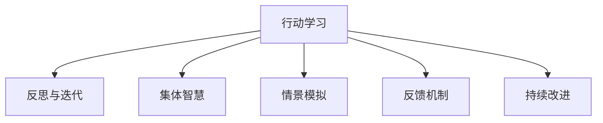

                 

# 行动中学习：管理者 的成长之道

> 关键词：行动学习，管理者，成长路径，实践导向，组织发展

## 1. 背景介绍

### 1.1 问题由来
在当今快速变化的时代，管理者面临着前所未有的挑战和机遇。如何迅速适应变化、做出有效决策、引领团队成长，成为他们职业生涯中的重要课题。传统的管理知识和理论往往与实际情境脱节，无法有效指导管理实践。基于此，“行动学习”（Action Learning）应运而生，作为一种以行动为导向的管理学习方式，逐渐受到广泛关注。

### 1.2 问题核心关键点
行动学习聚焦于通过实践来提升管理者的领导力和决策能力，强调在实际工作中不断学习和反思，以解决问题、提升绩效。与传统理论教育不同，行动学习重在经验积累和行为改变，注重管理者在具体情境中的应用和实践。

### 1.3 问题研究意义
行动学习对于提升管理者的实战能力和组织竞争力具有重要意义：

- **提升实战能力**：通过实际情境中的学习和实践，管理者能够在真实环境中提升问题解决和决策能力。
- **促进知识应用**：将理论知识应用于实际情境，增强对管理理论的理解和应用能力。
- **推动组织创新**：通过集体学习，管理者能够汇聚团队智慧，推动组织创新和发展。
- **增强团队合作**：在行动学习过程中，管理者与团队成员的互动和协作，增强团队凝聚力和合作效率。

## 2. 核心概念与联系

### 2.1 核心概念概述

为更好地理解行动学习，本节将介绍几个核心概念：

- **行动学习**：一种以实践为核心的管理学习方式，强调通过具体情境中的行动和反思，提升管理者的领导力和决策能力。
- **反思与迭代**：行动学习的重要组成部分，强调在行动后进行深入反思，从实践中提取教训，不断迭代优化。
- **集体智慧**：行动学习强调集体参与和互动，通过团队讨论、工作坊等形式，汇集多样化视角和经验，促进知识共享。
- **情景模拟**：通过模拟真实情境，管理者可以在相对安全的环境中进行学习和实验，减少实际操作中的风险。
- **反馈机制**：行动学习中反馈至关重要，通过多方面的反馈信息，管理者能够及时调整行为，优化决策过程。
- **持续改进**：行动学习倡导持续改进的理念，不断通过行动和反思，提升自身和团队的能力。

这些核心概念之间的逻辑关系可以通过以下Mermaid流程图来展示：



这个流程图展示了几大核心概念之间的紧密联系：

1. 行动学习强调在实践中不断行动与反思。
2. 通过集体智慧的汇集，管理者能够吸取团队成员的经验和建议。
3. 情景模拟为管理者提供了一个相对安全的实验场所。
4. 反馈机制为管理者提供了外部信息，帮助其及时调整行为。
5. 持续改进理念推动管理者不断提升自身能力。

## 3. 核心算法原理 & 具体操作步骤
### 3.1 算法原理概述

行动学习的核心在于通过具体的管理实践，不断学习和反思，提升管理者的能力。其基本流程包括以下几个步骤：

1. **定义问题**：确定需要解决的具体管理问题，设定明确的学习目标。
2. **制定行动计划**：基于问题分析，制定详细的行动方案，明确角色分工和时间节点。
3. **实施行动**：按照行动计划，执行具体的管理活动，收集相关数据和反馈信息。
4. **反思总结**：行动后，团队成员进行反思总结，评估行动效果，提炼出可借鉴的经验和教训。
5. **调整优化**：基于反思结果，调整行动计划，优化管理行为，不断迭代提升。

### 3.2 算法步骤详解

以下详细介绍行动学习的详细步骤：

**Step 1: 确定学习目标**
- 识别当前工作中遇到的具体管理挑战，如团队协作问题、绩效管理问题、变革管理问题等。
- 明确学习目标，如提升团队协作能力、优化绩效管理方法、增强变革管理能力等。

**Step 2: 组建学习团队**
- 选择适当的团队成员，确保成员角色互补，包含不同背景和经验。
- 指定团队领导，负责行动学习的组织和协调，确保顺利进行。

**Step 3: 制定行动计划**
- 分析问题原因，制定详细的行动方案。
- 设定具体的时间节点和责任人，明确任务分工。
- 设计反馈和评估机制，确保行动效果的及时反馈。

**Step 4: 实施行动**
- 按照计划执行具体的管理活动，收集相关数据和反馈信息。
- 记录行动过程中的关键事件和行为，确保后续反思和总结有据可依。

**Step 5: 反思总结**
- 行动结束后，团队成员进行反思总结，分享各自的经验和教训。
- 评估行动效果，分析成功和失败的原因，提炼出可借鉴的经验。
- 形成行动报告，总结学习成果和下一步行动计划。

**Step 6: 调整优化**
- 基于反思总结，调整行动计划，优化管理行为。
- 在新的情境下再次行动，验证调整效果。
- 重复上述步骤，持续改进管理能力。

### 3.3 算法优缺点

行动学习具有以下优点：

1. **实践导向**：通过实际情境中的学习和反思，管理者能够在真实环境中提升问题解决和决策能力。
2. **实用性强**：强调将理论知识应用于实际情境，增强对管理理论的理解和应用能力。
3. **团队合作**：通过集体参与和互动，管理者能够吸取团队成员的经验和建议，增强团队凝聚力和合作效率。
4. **灵活性高**：行动学习可以根据具体情境灵活调整行动方案，适应各种复杂环境。

同时，该方法也存在一些局限性：

1. **时间成本高**：行动学习通常需要较长时间，短期内难以看到显著效果。
2. **复杂性高**：需要组织多方面的反馈和反思，协调团队成员的参与，管理难度较大。
3. **依赖团队**：行动学习的效果高度依赖于团队成员的参与和合作，团队成员的积极性直接影响学习效果。

尽管存在这些局限性，但行动学习仍是一种非常有效和实用的管理学习方式，尤其适合于那些需要解决复杂、多样化问题的管理者。

### 3.4 算法应用领域

行动学习适用于各种管理情境，特别是那些需要解决复杂、多样化问题的领域。以下是几个典型的应用场景：

- **团队协作管理**：提升团队合作效率，解决团队冲突，增强团队凝聚力。
- **绩效管理**：优化绩效考核机制，提升员工绩效，改善工作氛围。
- **变革管理**：引导组织变革，解决变革过程中的阻力，推动组织创新。
- **决策支持**：提升管理者的决策能力，通过实际情境中的学习和反思，增强决策的科学性和有效性。
- **员工发展**：帮助员工识别职业发展路径，提供个性化的职业指导，提升员工满意度。

## 4. 数学模型和公式 & 详细讲解  
### 4.1 数学模型构建

行动学习的数学模型可以抽象为“问题-行动-反思-调整”的闭环系统。假设管理者面对的问题为 $P$，采取的行动为 $A$，行动后的反思总结为 $R$，基于反思的调整优化为 $C$。则行动学习的数学模型可以表示为：

$$
\begin{aligned}
\text{Action Plan} &= \text{Define Problem} \times \text{Team Formation} \times \text{Action Design} \\
\text{Action} &= \text{Action Plan} \times \text{Resource Allocation} \\
\text{Reflection} &= \text{Action} \times \text{Data Collection} \times \text{Team Discussion} \\
\text{Adjustment} &= \text{Reflection} \times \text{Feedback Analysis} \times \text{Iteration Optimization}
\end{aligned}
$$

### 4.2 公式推导过程

以下对行动学习的数学模型进行详细推导：

**Step 1: 问题定义**
- 假设管理者面对的问题为 $P$，问题描述为 $P(x)$，其中 $x$ 为影响问题的各种因素。

**Step 2: 团队形成**
- 假设管理者选择了 $T$ 名团队成员，团队结构为 $T(t)$，其中 $t$ 表示团队成员的角色和职责。

**Step 3: 行动设计**
- 假设管理者设计了 $A(a)$ 种行动方案，每种方案的具体步骤为 $a(i)$，其中 $i$ 表示步骤编号。

**Step 4: 行动执行**
- 假设管理者在 $A$ 种方案中选取了 $a$ 种进行执行，实际执行步骤为 $a(j)$，其中 $j$ 表示当前执行步骤。

**Step 5: 反思总结**
- 假设管理者在行动后进行了 $R(r)$ 次反思总结，每次反思总结的关键事件为 $r(s)$，其中 $s$ 表示事件编号。

**Step 6: 调整优化**
- 假设管理者根据反思总结，进行了 $C(c)$ 次调整优化，每次调整的具体措施为 $c(k)$，其中 $k$ 表示调整次数。

### 4.3 案例分析与讲解

以一家高科技公司的团队协作问题为例，进行详细分析：

**背景**：某高科技公司发现团队协作效率低下，导致项目进度滞后，团队氛围紧张。管理者决定采用行动学习的方式，提升团队协作能力。

**Step 1: 问题定义**
- 问题描述：团队协作效率低下，项目进度滞后，团队氛围紧张。

**Step 2: 团队形成**
- 团队成员：包含项目经理、技术骨干、人力资源经理等，共计 10 人。

**Step 3: 行动设计**
- 设计三种行动方案：团队建设活动、项目流程优化、团队角色重新分配。

**Step 4: 行动执行**
- 选择团队建设活动方案进行执行，安排全体成员参加团队建设活动，共计 3 次，每次活动持续 2 小时。

**Step 5: 反思总结**
- 每次活动结束后，团队成员进行反思总结，记录关键事件和行为，共计 3 次。

**Step 6: 调整优化**
- 基于反思总结，调整项目流程和团队角色，优化团队协作效率，提升团队氛围。

经过多次迭代优化，团队协作效率显著提升，项目进度加快，团队氛围明显改善。

## 5. 项目实践：代码实例和详细解释说明
### 5.1 开发环境搭建

在进行行动学习实践前，我们需要准备好开发环境。以下是使用Python进行开发的环境配置流程：

1. 安装Anaconda：从官网下载并安装Anaconda，用于创建独立的Python环境。

2. 创建并激活虚拟环境：
```bash
conda create -n action_learning python=3.8 
conda activate action_learning
```

3. 安装必要的Python包：
```bash
pip install numpy pandas sympy matplotlib
```

4. 安装必要的R包（如果需要）：
```bash
conda install rpy2
```

5. 安装必要的Jupyter Notebook扩展：
```bash
jupyter labextension install @jupyter-widgets/jupyterlab-manager
```

完成上述步骤后，即可在`action_learning`环境中开始行动学习实践。

### 5.2 源代码详细实现

下面给出行动学习的一个示例代码，使用Python和R进行实践。

首先，定义问题的具体描述和团队成员信息：

```python
import pandas as pd

# 定义问题描述
problem_description = "团队协作效率低下，导致项目进度滞后，团队氛围紧张。"

# 定义团队成员信息
team_members = pd.DataFrame({
    "Name": ["Alice", "Bob", "Charlie", "David", "Eva", "Frank", "Grace", "Helen", "Ian", "Jack"],
    "Role": ["Project Manager", "Technical Lead", "QA Engineer", "UI/UX Designer", "Business Analyst", "Marketing Specialist", "HR Manager", "Finance Manager", "Sales Representative", "IT Support Engineer"],
    "Experience": [5, 3, 2, 4, 3, 4, 2, 3, 2, 5]
})

# 输出团队成员信息
print(team_members)
```

然后，设计行动方案并进行实际执行：

```python
# 设计三种行动方案
action_plans = {
    "Team Building": {
        "Steps": ["冰破冰游戏", "团队愿景讨论", "信任活动"]
    },
    "Project Optimization": {
        "Steps": ["项目流程标准化", "关键路径识别", "资源优化"]
    },
    "Role Reallocation": {
        "Steps": ["角色重新定义", "跨部门协作", "绩效考核优化"]
    }
}

# 选择团队建设活动方案
selected_action_plan = "Team Building"

# 执行团队建设活动
team_building_steps = action_plans[selected_action_plan]["Steps"]
for step in team_building_steps:
    print(f"执行 {step} 活动")
    
# 记录反思总结
reflections = {
    "Team Building 1": ["增强了团队成员之间的信任", "发现了一些潜在的沟通问题"],
    "Team Building 2": ["提高了团队士气", "发现了一些团队合作中的矛盾"],
    "Team Building 3": ["优化了团队协作流程", "提升了项目进度"]
}

# 输出反思总结
print(reflections)
```

最后，分析反思总结并进行调整优化：

```python
# 分析反思总结
for step, reflection in reflections.items():
    print(f"反思 {step}: {reflection}")

# 调整优化
adjustments = {
    "Project Optimization": ["改进项目流程", "优化资源配置"],
    "Role Reallocation": ["调整团队角色", "优化绩效考核"]
}

# 输出调整优化措施
print(adjustments)
```

以上就是行动学习的一个完整示例代码，展示了如何通过Python进行问题定义、行动设计、行动执行、反思总结和调整优化的全过程。

## 6. 实际应用场景
### 6.1 企业内部管理

行动学习在企业内部管理中的应用非常广泛，可以通过解决具体的管理问题，提升团队协作效率，优化绩效管理方法，增强变革管理能力。例如，某公司通过行动学习解决了团队协作效率低下和项目进度滞后的问题，大幅提升了团队协作效率和项目进度，增强了团队凝聚力和员工满意度。

### 6.2 公共部门治理

行动学习在公共部门治理中同样具有重要应用价值，可以帮助政府部门解决复杂的公共管理问题，提升公共服务质量。例如，某市政府通过行动学习优化了公共服务流程，提升了公共服务效率，增强了公民满意度。

### 6.3 非营利组织运营

非营利组织常常面临资源有限、人员不足等问题，通过行动学习可以提升组织运营效率，优化资源配置，增强组织的可持续发展能力。例如，某非营利组织通过行动学习优化了志愿者管理流程，提升了志愿者参与度和组织影响力。

### 6.4 未来应用展望

随着行动学习理念的不断普及，未来其在各行各业的应用将更加广泛。以下是对未来应用前景的展望：

1. **跨部门协作**：行动学习将成为跨部门协作的重要工具，帮助不同部门之间的沟通和合作，提升整体工作效率。
2. **知识管理**：行动学习将促进知识共享和创新，通过集体智慧的汇集，推动组织知识管理能力的提升。
3. **领导力培养**：行动学习将成为领导力培养的重要手段，通过实践经验积累，提升领导者的决策能力和团队管理能力。
4. **企业文化建设**：行动学习将成为企业文化建设的重要途径，通过团队互动和反思，推动企业文化和价值观的形成和固化。
5. **持续改进**：行动学习将成为持续改进的重要手段，通过不断的实践和反思，提升组织的核心竞争力。

## 7. 工具和资源推荐
### 7.1 学习资源推荐

为了帮助管理者系统掌握行动学习的方法和技巧，这里推荐一些优质的学习资源：

1. 《行动学习：提高领导力和团队绩效》书籍：深入浅出地介绍了行动学习的核心理念、操作步骤和应用案例，适合管理者的系统学习。
2. 《组织学习与行动学习》课程：斯坦福商学院开设的在线课程，详细讲解了行动学习的理论基础和实践方法，提供了丰富的案例分析。
3. 《行动学习工作坊》：组织内部进行的行动学习工作坊，通过实际情境中的学习和反思，提升管理者的实战能力。
4. 《行动学习工具与方法》文章：管理期刊中关于行动学习的理论文章和实践案例，提供了丰富的学习资源和参考资料。
5. 《行动学习最佳实践》报告：行业专家编写的行动学习最佳实践报告，总结了成功案例和经验教训，提供了宝贵的指导。

通过对这些资源的学习实践，相信管理者能够更好地掌握行动学习的精髓，并在实际管理中发挥其优势。

### 7.2 开发工具推荐

高效的开发离不开优秀的工具支持。以下是几款用于行动学习开发的常用工具：

1. Python：作为通用的编程语言，Python具备丰富的数据分析和可视化库，适合进行复杂的行动学习分析。
2. R语言：在统计分析和数据可视化方面表现出色，适合进行深入的数据分析和报告生成。
3. Jupyter Notebook：提供了交互式的编程环境，支持Python、R等多种语言，适合进行实时数据分析和展示。
4. Microsoft Excel：数据处理和可视化方面的经典工具，适合进行简单的数据分析和报告生成。
5. Microsoft Power BI：强大的数据可视化和报表工具，适合进行大规模数据可视化和报表生成。

合理利用这些工具，可以显著提升行动学习的开发效率，加快创新迭代的步伐。

### 7.3 相关论文推荐

行动学习的研究源于学界的持续探索。以下是几篇奠基性的相关论文，推荐阅读：

1. "Action Learning: A review and research directions"：总结了行动学习的理论基础和应用方向，提供了丰富的参考文献和案例分析。
2. "The impact of action learning on leadership development"：探讨了行动学习对领导力发展的影响，提供了实证研究结果和经验总结。
3. "Effectiveness of action learning in cross-departmental teams"：研究了行动学习在跨部门团队中的应用效果，提供了详细的实验结果和分析。
4. "Facilitating organizational learning through action learning"：探讨了行动学习在组织知识管理中的应用，提供了相关的理论和方法。
5. "Developing adaptive leaders through action learning"：研究了行动学习在领导力培养中的应用，提供了详细的实践案例和经验总结。

这些论文代表了行动学习研究的发展脉络。通过学习这些前沿成果，可以帮助管理者更好地理解行动学习的理论和实践，提升管理能力。

## 8. 总结：未来发展趋势与挑战
### 8.1 总结

本文对行动学习的方法和实践进行了全面系统的介绍。首先阐述了行动学习的背景和意义，明确了行动学习在提升管理者的实战能力和决策能力方面的独特价值。其次，从原理到实践，详细讲解了行动学习的数学模型和操作步骤，提供了完整的代码实例。同时，本文还广泛探讨了行动学习在各个行业领域的应用前景，展示了行动学习范式的巨大潜力。此外，本文精选了行动学习的各类学习资源，力求为管理者提供全方位的技术指引。

通过本文的系统梳理，可以看到，行动学习作为一种以实践为导向的管理学习方式，具有广阔的应用前景。未来，随着行动学习理念的不断普及，其在各行各业的应用将更加广泛，成为推动组织创新和发展的重要工具。

### 8.2 未来发展趋势

展望未来，行动学习将呈现以下几个发展趋势：

1. **技术融合**：行动学习将与其他技术手段进行深度融合，如大数据分析、人工智能等，提升行动学习的精准度和效率。
2. **跨领域应用**：行动学习将突破传统行业的限制，在更多领域得到应用，如医疗、教育、金融等。
3. **全球化拓展**：随着国际合作的加深，行动学习将在全球范围内传播和推广，促进国际间的知识共享和经验交流。
4. **个性化定制**：行动学习将根据不同组织和团队的特点，提供个性化的学习方案，提升学习效果。
5. **多样化评估**：行动学习将引入更多评估手段，如定量分析、定性评估、混合方法等，全面衡量学习效果。

以上趋势凸显了行动学习的广阔前景。这些方向的探索发展，必将进一步提升行动学习的精准度和效果，推动管理者能力的提升和组织的可持续发展。

### 8.3 面临的挑战

尽管行动学习具有诸多优势，但在实践过程中仍面临一些挑战：

1. **管理者的适应性**：行动学习要求管理者改变传统的管理方式，接受新的理念和方法，这可能需要一定的时间和适应过程。
2. **资源投入**：行动学习需要投入一定的时间和精力，且需要多方面的反馈和反思，增加了管理的复杂性。
3. **组织文化的变革**：行动学习需要组织文化的支持，团队成员需要积极参与和互动，文化上的阻力可能影响学习效果。
4. **反馈机制的建立**：行动学习依赖于有效的反馈机制，反馈信息的收集和分析需要精细化的管理。
5. **评估标准的制定**：行动学习的评估标准需要科学合理，否则难以全面衡量学习效果。

尽管存在这些挑战，但行动学习仍然是一种非常实用和有效的管理学习方式，尤其适合于那些需要解决复杂、多样化问题的管理者。

### 8.4 研究展望

面对行动学习面临的挑战，未来的研究需要在以下几个方面寻求新的突破：

1. **理论创新**：深入研究行动学习的理论基础，探索新的理论框架和方法论。
2. **技术应用**：引入新技术手段，如大数据分析、人工智能等，提升行动学习的精准度和效率。
3. **实践指导**：提供更加系统化和实操性的指导，帮助管理者在实际应用中更好地掌握行动学习。
4. **跨领域应用**：拓展行动学习在更多领域的应用，促进跨学科的知识交流和经验共享。
5. **多样性支持**：支持不同组织和团队的特点，提供多样化的学习方案，提升学习效果。

这些研究方向的探索，必将引领行动学习技术迈向更高的台阶，为管理者的成长和组织的可持续发展提供更加坚实的理论和方法支持。总之，行动学习需要管理者不断学习、实践和反思，才能在实际管理中发挥其优势，推动组织的持续改进和创新发展。

## 9. 附录：常见问题与解答

**Q1：行动学习与传统理论教育有何不同？**

A: 行动学习强调实践导向，通过实际情境中的学习和反思，提升管理者的实战能力和决策能力。而传统理论教育则侧重于理论知识的传授，缺乏实践的训练和反思。

**Q2：行动学习需要投入多少时间？**

A: 行动学习需要一定的时间投入，通常需要多次迭代才能取得明显效果。具体时间取决于问题的复杂性和组织的文化，一般建议每次迭代周期为2-3个月。

**Q3：行动学习对管理者的要求有哪些？**

A: 行动学习要求管理者具备较强的沟通能力、团队协作能力和反思总结能力。需要管理者积极参与和互动，推动团队的集体智慧的形成和应用。

**Q4：行动学习在企业内部管理中的应用前景如何？**

A: 行动学习在企业内部管理中具有广泛的应用前景，可以帮助企业解决具体的管理问题，提升团队协作效率，优化绩效管理方法，增强变革管理能力。

**Q5：行动学习在公共部门治理中的应用案例有哪些？**

A: 行动学习在公共部门治理中也有成功应用案例，例如某市政府通过行动学习优化了公共服务流程，提升了公共服务效率，增强了公民满意度。

---

作者：禅与计算机程序设计艺术 / Zen and the Art of Computer Programming

