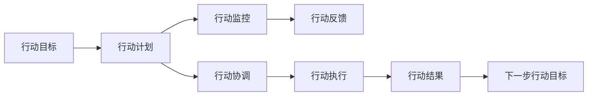

                 

# 行动体系：决定管理者的天花板

## 1. 背景介绍

在全球化的知识经济时代，管理者的角色和挑战也在不断演变。现代管理者的首要任务，已不再是单纯的资源调配和效率优化，而是构建能应对复杂多变环境、持续创新并引领变革的行动体系。一个健全的行动体系不仅能增强团队协作效率，还能使管理者在其职位上实现自我超越，达到新的管理高度。本文将深入探讨如何构建行动体系，并分析其对管理者职业成长的影响。

## 2. 核心概念与联系

### 2.1 核心概念概述

为了清晰地理解行动体系，我们首先梳理了几个核心概念：

- **行动体系（Action System）**：指由多个相互关联的行动元素组成的系统，旨在确保组织内外的决策、执行、反馈和修正过程顺畅进行。行动体系包括行动目标、行动计划、行动协调、行动监控和行动反馈等关键要素。
- **行动目标（Action Goals）**：定义组织和个人的短期和长期目标，是行动体系的核心驱动力。
- **行动计划（Action Plan）**：为达成行动目标所制定的详细步骤和方法。
- **行动协调（Action Coordination）**：确保团队成员理解并同步执行行动计划。
- **行动监控（Action Monitoring）**：跟踪行动计划的执行进度和成果，并根据实际情况进行调整。
- **行动反馈（Action Feedback）**：根据行动结果和监控数据，进行反思和调整，优化未来的行动计划。

这些概念之间的关系可以通过以下Mermaid流程图来展示：



这个流程图展示了从目标设定到结果反馈的全过程，描述了各个环节如何相互协作，推动行动体系的运行。

## 3. 核心算法原理 & 具体操作步骤

### 3.1 算法原理概述

构建行动体系的算法原理基于系统工程和行为科学的理论，主要涉及以下几个方面：

1. **系统思维**：将管理对象视为一个整体系统，通过分析系统内部各部分之间的相互作用来寻找优化策略。
2. **目标设定理论**：基于SMART原则（具体的、可测量的、可实现的、相关的、有时间限制的）设定明确的目标。
3. **PDCA循环（Plan-Do-Check-Act）**：通过持续的计划、执行、检查和行动，不断优化行动体系。

### 3.2 算法步骤详解

构建行动体系的步骤包括：

1. **明确行动目标**：利用SMART原则，明确长期和短期的行动目标。
2. **制定行动计划**：根据行动目标，制定详细的执行步骤和方法。
3. **分配行动责任**：明确各个团队成员的职责和任务，确保协同执行。
4. **实施行动计划**：按照既定计划推进执行，同时监控执行情况。
5. **反馈和调整**：根据监控结果和反馈信息，进行适时调整和优化。
6. **复盘和改进**：在行动结束后，进行复盘总结，提取经验和教训，为未来行动提供参考。

### 3.3 算法优缺点

**优点**：
- 系统化的管理方法，有助于全面提升组织效率。
- 明确的目标设定和PDCA循环，有助于提升团队执行力和自我反思能力。
- 增强了管理者的战略规划能力和执行力。

**缺点**：
- 实施过程复杂，需要较高的管理水平和组织文化支持。
- 目标和计划设定不当可能导致执行偏差或效率低下。
- 反馈和调整过程需要持续投入资源和时间。

### 3.4 算法应用领域

行动体系的应用领域广泛，涵盖了企业、政府、教育等多个行业。在企业中，行动体系被广泛应用于项目管理、产品开发、市场营销、客户服务等环节。在政府机构，行动体系则被用来优化公共服务、政策执行和项目管理。在教育领域，行动体系有助于提升教育质量、优化教学方法和课程设计。

## 4. 数学模型和公式 & 详细讲解 & 举例说明

### 4.1 数学模型构建

构建行动体系的过程可以用数学模型来描述，我们将其分解为以下几个变量和函数：

- **目标变量**：$G$，表示行动目标。
- **计划变量**：$P$，表示行动计划。
- **责任变量**：$R$，表示行动责任分配。
- **执行变量**：$E$，表示实际执行情况。
- **监控变量**：$M$，表示行动监控数据。
- **反馈变量**：$F$，表示行动反馈信息。

模型构建函数为：

$$
\begin{align*}
G &= \text{设定目标}(SMART原则) \\
P &= \text{制定计划}(依赖于G) \\
R &= \text{分配责任}(考虑成员能力和负荷) \\
E &= \text{执行计划}(P, R) \\
M &= \text{监控执行}(E) \\
F &= \text{生成反馈}(M) \\
G' &= \text{调整目标}(G, F) \\
\end{align*}
$$

### 4.2 公式推导过程

以目标设定和计划制定的具体过程为例，公式推导如下：

设行动目标为 $G = \text{设定目标}(SMART原则)$，其包含五个子目标：

$$
G = (G_1, G_2, G_3, G_4, G_5)
$$

其中 $G_1$ 为具体性，$G_2$ 为可测量性，$G_3$ 为可实现性，$G_4$ 为相关性，$G_5$ 为时限性。计划 $P$ 定义为：

$$
P = \text{制定计划}(G)
$$

具体制定步骤包括：

$$
P = (P_1, P_2, P_3, P_4, P_5)
$$

其中 $P_1$ 为资源分配，$P_2$ 为任务分解，$P_3$ 为时间安排，$P_4$ 为质量控制，$P_5$ 为风险管理。

### 4.3 案例分析与讲解

以某大型IT企业开发新产品为例，分析其行动体系的应用：

1. **目标设定**：明确新产品上市的时间目标和市场份额目标。
2. **制定计划**：根据目标设定，制定详细的开发流程和里程碑计划。
3. **责任分配**：根据团队成员的技能和负荷，合理分配各阶段的任务和责任。
4. **执行计划**：严格按照既定计划推进开发和测试工作，确保各阶段任务按时完成。
5. **监控执行**：通过每日站会、阶段评审等方式，监控项目进展和风险。
6. **反馈和调整**：根据监控数据和反馈信息，调整开发流程和资源分配，优化开发效率。

## 5. 项目实践：代码实例和详细解释说明

### 5.1 开发环境搭建

开发行动体系的软件工具主要包括JIRA、Trello、Confluence等协作平台。以下以JIRA为例，简述开发环境搭建流程：

1. 安装JIRA软件。
2. 配置数据库和服务器。
3. 创建项目和任务板。
4. 添加团队成员和权限设置。
5. 设置任务类型和优先级。

### 5.2 源代码详细实现

以JIRA的任务分配和监控功能为例，给出具体的代码实现：

```python
from jira import JIRA
from jira.issue import Issue

jira = JIRA(options={'server': 'https://your-jira-server.com'}, basic_auth=('username', 'password'))

# 创建新任务
def create_task(summary, description, project_key, issuetype_key, assignee_key):
    issue = jira.create_issue(
        project={'key': project_key},
        summary=summary,
        description=description,
        issuetype={'key': issuetype_key},
        assignee={'key': assignee_key}
    )
    return issue

# 获取任务详情
def get_task_details(issue_key):
    task = jira.issue(issue_key)
    return task

# 更新任务状态
def update_task_status(issue_key, status):
    task = jira.issue(issue_key)
    task.update(status={'self': status})

# 监控任务进度
def monitor_task_progress(issue_key, completed_percent):
    task = jira.issue(issue_key)
    task.update(fields={'status': 'In Progress', 'progress': completed_percent})
```

### 5.3 代码解读与分析

上述代码展示了JIRA的基本API操作，包括创建任务、获取任务详情和更新任务状态。使用这些API，管理者可以灵活地管理和监控项目进展，优化任务分配和执行。

### 5.4 运行结果展示

通过上述代码实现的行动体系功能，可以实现以下效果：

- 快速创建和分配任务，确保责任明确。
- 实时监控任务进度和风险，及时调整资源配置。
- 通过任务反馈，优化后续行动计划，提升团队协作效率。

## 6. 实际应用场景

### 6.1 智能制造

在智能制造领域，行动体系通过优化生产流程、协调资源分配、监控生产进度，实现了智能化、高效化的制造管理。管理者可以根据实时数据，灵活调整生产计划，避免生产中断和资源浪费。

### 6.2 智慧城市

智慧城市建设中，行动体系通过协调不同部门的工作，优化公共资源配置，实现高效的城市治理。例如，通过智慧交通系统，实时监控交通流量，调整信号灯控制，缓解交通拥堵。

### 6.3 教育管理

在教育管理中，行动体系通过明确教学目标、优化教学计划、监控教学质量，提升了教育效果和教师管理效率。例如，通过学生反馈数据，及时调整教学内容和方法，提升学生的学习体验和效果。

### 6.4 未来应用展望

未来，随着AI和数据分析技术的发展，行动体系将进一步智能化和自动化。管理者可以借助AI模型分析大量历史数据，生成更为精准的行动计划和目标设定。同时，基于大数据和物联网的实时监控系统，将提供更准确的执行和反馈信息。

## 7. 工具和资源推荐

### 7.1 学习资源推荐

1. **《行动体系：构建高效管理工具》**：全面介绍了行动体系的理论和实践方法，适用于各类管理者。
2. **《系统思维与行动体系》**：详细讲解系统思维和行动体系的应用，帮助管理者构建全面的管理视角。
3. **《行为科学导论》**：涵盖行为科学的基本原理和应用，为管理者提供理论支撑。
4. **《项目管理：实践指南》**：提供系统化的项目管理知识和方法，提升管理者的执行力和效率。
5. **Coursera《管理科学与行动体系》课程**：由知名大学教授讲授，系统讲解行动体系的理论和实践。

### 7.2 开发工具推荐

1. **JIRA**：全球领先的协作与问题跟踪平台，适用于各类项目管理。
2. **Trello**：简单易用的看板管理工具，适合任务协调和进度监控。
3. **Confluence**：在线文档管理工具，用于知识共享和协作。
4. **Microsoft Project**：项目管理和资源分配的专业工具，支持多种操作系统和浏览器。
5. **Asana**：高效的项目管理和任务跟踪工具，适合小型团队使用。

### 7.3 相关论文推荐

1. **《行动体系构建与优化》**：探讨行动体系的构建方法和优化策略。
2. **《基于行动体系的管理理论框架》**：分析行动体系的框架和应用案例。
3. **《智能管理系统的行动体系设计》**：介绍智能管理系统中的行动体系设计和应用。
4. **《行动体系在金融风险管理中的应用》**：分析行动体系在金融风险管理中的应用。
5. **《行动体系在教育管理中的应用研究》**：探讨行动体系在教育管理中的应用和效果。

## 8. 总结：未来发展趋势与挑战

### 8.1 研究成果总结

本文系统介绍了行动体系的理论和实践方法，指出行动体系对管理者职业成长的重要性。行动体系不仅帮助管理者优化资源配置，提升团队协作效率，还能增强其战略规划和执行力。

### 8.2 未来发展趋势

未来行动体系的发展趋势包括：

1. **智能化和自动化**：借助AI和大数据分析技术，生成更为精准的行动计划和目标设定。
2. **跨领域应用**：行动体系将在更多领域得到应用，如智慧制造、智慧城市、智能教育等。
3. **持续优化**：管理者通过实时监控和反馈机制，持续优化行动体系，提升管理效果。
4. **多样化工具**：引入更多协作和监控工具，提升管理效率。

### 8.3 面临的挑战

虽然行动体系在管理中的应用前景广阔，但仍面临以下挑战：

1. **工具整合难度**：不同工具的整合和数据共享可能存在困难，需要系统化设计。
2. **数据隐私和安全**：在数据监控和共享过程中，如何保护隐私和数据安全。
3. **技术门槛**：需要管理者具备一定的技术素养，才能高效使用行动体系工具。
4. **文化适应**：不同组织文化和团队习惯可能影响行动体系的实施效果。

### 8.4 研究展望

未来的研究应关注以下方向：

1. **跨领域融合**：探索行动体系在更多领域的应用，并与其他管理技术融合。
2. **人工智能辅助**：结合AI和大数据分析，提升行动体系的管理效果。
3. **多模态数据整合**：整合视觉、听觉、触觉等多模态数据，提升决策的全面性和准确性。
4. **社会化协作**：引入社交网络和协作工具，增强团队的凝聚力和协同效率。

## 9. 附录：常见问题与解答

**Q1：构建行动体系需要投入大量时间和精力，是否值得？**

A: 构建行动体系虽然需要一定的前期投入，但其长远价值是显而易见的。通过系统化的管理，管理者可以显著提升团队协作效率和执行能力，优化资源配置，提升整体绩效。因此，行动体系的投入是值得的。

**Q2：如何平衡行动体系与其他管理工具的使用？**

A: 行动体系与其他管理工具可以互补使用，形成一个系统化的管理生态。例如，可以将行动体系与项目管理工具（如JIRA、Asana）结合，实现任务分配、进度监控和反馈调整。同时，引入数据分析和AI工具，优化决策和执行过程。

**Q3：行动体系在小型团队中是否适用？**

A: 行动体系不仅适用于大型组织，小型团队同样可以从中受益。通过明确的目标设定和PDCA循环，小型团队可以提升协作效率和执行能力。行动体系的核心在于系统化管理，规模大小不影响其适用性。

**Q4：行动体系是否适用于非正式团队？**

A: 行动体系对团队的正式性要求不高，同样适用于非正式团队。通过明确目标和责任，非正式团队可以增强协作效率，提升整体绩效。

**Q5：行动体系对管理者有什么具体要求？**

A: 管理者需要具备系统思维、战略规划和执行力。同时，需要熟练使用行动体系工具，如JIRA、Trello等，提升团队管理和监控能力。此外，还需要不断学习和更新管理知识，适应不断变化的环境。

---

作者：禅与计算机程序设计艺术 / Zen and the Art of Computer Programming

